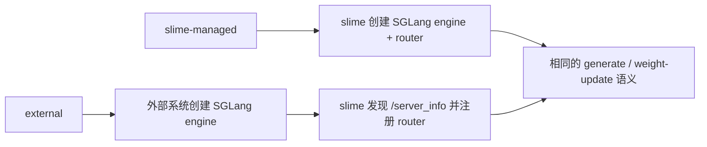

# slime Rollout 后端选择、切换与扩展分析

> **定位**：slime 段 1 实现机制 · Rollout Extension / Backend Boundary
> **源码基线**：`THUDM/slime@681b3adca54105d5ecd3fb822fa0dc58a427e0f9`
> **系列入口**：[[slime/index]]

## 1. 中心结论

slime **预留了充分的 rollout 数据生成扩展口，但没有提供像 verl 那样的多 rollout engine 插件注册表**。当前主仓库有意选择单一 SGLang backend：默认 server 生命周期、router、参数解析、健康检查、显存 offload 和四类权重同步都直接依赖 SGLang。官方 README 也把“单 backend”解释为避免 lowest-common-denominator 抽象、直接暴露 SGLang 特性这一明确取舍。[`README_zh.md:18-24`](https://github.com/THUDM/slime/blob/681b3adca54105d5ecd3fb822fa0dc58a427e0f9/README_zh.md#L18-L24) [`README_zh.md:36-50`](https://github.com/THUDM/slime/blob/681b3adca54105d5ecd3fb822fa0dc58a427e0f9/README_zh.md#L36-L50)

因此，“能否扩展其他 rollout 引擎”必须分四层回答：

| 层级 | 当前是否有正式入口 | 典型改动 | 是否替换 engine |
|---|---:|---|---:|
| 单样本生成逻辑 | 是，`--custom-generate-function-path` | 多轮、工具、RAG、agent loop | 否 |
| 整轮 rollout 编排 | 是，`--rollout-function-path` | DataSource 调度、fan-out、异步队列、定制返回 | 不一定 |
| 外部部署 | 是，`--rollout-external-engine-addrs` | 连接训练任务外管理的 SGLang | 否，仍是 SGLang |
| 完整 backend | 没有稳定插件接口 | lifecycle/router/API/weight sync/health 全面适配 | 是，需 fork/派生项目 |

## 2. 两个真正稳定的数据面扩展点

### 2.1 `custom-generate`：保留默认批调度，只替换每条 sample 的交互

参数说明把该入口限定为替换默认 rollout 中的 `generate(args, sample, sampling_params)`，并明确推荐给 multi-turn 和 function calling。[`arguments.py:477-493`](https://github.com/THUDM/slime/blob/681b3adca54105d5ecd3fb822fa0dc58a427e0f9/slime/utils/arguments.py#L477-L493)

这层最适合接入另一个**兼容 HTTP 生成协议的服务**，或在 SGLang 上实现 agent loop。函数最终只需把交互折叠回 `Sample`；默认 rollout 仍负责 prompt 分组、并发、reward/filter、重试与 buffer 对接。换句话说，这里替换的是“怎样产生 token”，不是“谁拥有 rollout server”。

### 2.2 `rollout-function`：替换整轮数据生成编排

`--rollout-function-path` 可动态导入完整 rollout 函数；其签名接收 `args / rollout_id / data_source / evaluation`，训练输出至少要让 sample 具备 `tokens`、`response_length`、`reward` 和 `status`。[`arguments.py:328-340`](https://github.com/THUDM/slime/blob/681b3adca54105d5ecd3fb822fa0dc58a427e0f9/slime/utils/arguments.py#L328-L340)

返回协议由两个 dataclass 表示：训练返回嵌套的 `list[list[Sample]]` 与 metrics，评估返回字典；旧式返回值仍会被兼容包装。[`base_types.py:7-25`](https://github.com/THUDM/slime/blob/681b3adca54105d5ecd3fb822fa0dc58a427e0f9/slime/rollout/base_types.py#L7-L25) `RolloutManager` 启动 server 后动态加载该函数，执行后先校验 sibling `rollout_id`，再逐层 flatten；fan-out 产生的多个训练片段必须共享身份，避免 loss reducer 把一次 rollout 重复计数。[`rollout.py:464-495`](https://github.com/THUDM/slime/blob/681b3adca54105d5ecd3fb822fa0dc58a427e0f9/slime/ray/rollout.py#L464-L495) [`rollout.py:687-701`](https://github.com/THUDM/slime/blob/681b3adca54105d5ecd3fb822fa0dc58a427e0f9/slime/ray/rollout.py#L687-L701)

这意味着自定义函数可以直接请求 vLLM、TensorRT-LLM 或自研服务，再返回合法 `Sample`；但如果不进一步改控制面，slime 仍会按默认路径创建 SGLang server。实际接入时通常还要配合 external/debug 路径绕开内置启动，或者修改 `start_rollout_servers`。

## 3. External rollout engine 不是通用 backend

官方文档中的 “External Rollout Engines” 指 **SGLang 进程由外部系统启动**，不是任意推理引擎。slime 会发现 `/server_info`，启动/连接 SGLang router，并继续用所选 transport 更新 actor 权重。[`external-rollout-engines.md:1-48`](https://github.com/THUDM/slime/blob/681b3adca54105d5ecd3fb822fa0dc58a427e0f9/docs/zh/advanced/external-rollout-engines.md#L1-L48)

源码进一步消除了歧义：external 分支仍导入 `SGLangEngine`，创建零 GPU 的 Ray proxy actor，用 SGLang 的 engine 信息、初始化参数和 router 注册协议包装外部服务。[`external.py:195-250`](https://github.com/THUDM/slime/blob/681b3adca54105d5ecd3fb822fa0dc58a427e0f9/slime/backends/sglang_utils/external.py#L195-L250)

它改变的是**部署所有权**：

external 路径带来环境、集群和硬件解耦，尤其适合 disk/full 或 disk/delta 同步；但 external engine 生命周期由外部系统负责，不进入 slime 的 engine fault-tolerance 恢复流程。[`external-rollout-engines.md:50-56`](https://github.com/THUDM/slime/blob/681b3adca54105d5ecd3fb822fa0dc58a427e0f9/docs/zh/advanced/external-rollout-engines.md#L50-L56) [`external-rollout-engines.md:95-103`](https://github.com/THUDM/slime/blob/681b3adca54105d5ecd3fb822fa0dc58a427e0f9/docs/zh/advanced/external-rollout-engines.md#L95-L103)

## 4. 为什么完整替换不是改一个类名

控制面当前把 backend 语义写进多个边界：

1. `ServerGroup` 的类型定义就是 homogeneous SGLang engines，创建 actor 时硬编码 `ray.remote(SGLangEngine)`。[`rollout.py:144-162`](https://github.com/THUDM/slime/blob/681b3adca54105d5ecd3fb822fa0dc58a427e0f9/slime/ray/rollout.py#L144-L162) [`rollout.py:188-220`](https://github.com/THUDM/slime/blob/681b3adca54105d5ecd3fb822fa0dc58a427e0f9/slime/ray/rollout.py#L188-L220)
2. server 拓扑由 SGLang config 解析，创建 per-model router、PD/EPD server groups，并把 `args.sglang_model_routers` 暴露给自定义 rollout。[`rollout.py:1132-1169`](https://github.com/THUDM/slime/blob/681b3adca54105d5ecd3fb822fa0dc58a427e0f9/slime/ray/rollout.py#L1132-L1169) [`rollout.py:1260-1269`](https://github.com/THUDM/slime/blob/681b3adca54105d5ecd3fb822fa0dc58a427e0f9/slime/ray/rollout.py#L1260-L1269)
3. 参数入口先独立解析 SGLang 参数，再合并、校验到总 namespace；这不是一个 `backend=...` 分发器。[`arguments.py:1607-1642`](https://github.com/THUDM/slime/blob/681b3adca54105d5ecd3fb822fa0dc58a427e0f9/slime/utils/arguments.py#L1607-L1642)
4. 训练侧 updater 只在 full/delta 与 disk/NCCL/tensor IPC 之间选择，构造时接收 SGLang rollout handles，没有 backend registry。[`actor.py:151-181`](https://github.com/THUDM/slime/blob/681b3adca54105d5ecd3fb822fa0dc58a427e0f9/slime/backends/megatron_utils/actor.py#L151-L181)

因此一个可用的新 backend 至少要实现或重写以下面：

| 适配面 | 最小契约 | 容易漏掉的正确性问题 |
|---|---|---|
| 参数/config | backend 参数、拓扑、模型路径 | 不应继续无条件解析 SGLang 参数 |
| 生命周期 | start/init/health/kill/recover | 多 rank engine 的失败边界 |
| 请求协议 | token-in/token-out、logprob、abort、metadata | 不可从 text 重分词伪造 rollout token |
| router | worker 注册、会话亲和、PD/多模型 | agent prefix-cache 与 session routing |
| 显存管理 | pause/continue、weights/KV/CUDA graph offload | colocate 期间 health probe 误判 |
| 权重提交 | flush → transfer → version → resume | 请求中途跨版本、量化后处理、MoE 名称映射 |
| 可观测性 | trace attrs、perf、engine metrics | 后端指标名称不同但语义需保持 |

## 5. vime 证明了“可派生”，没有证明“主仓库可热插拔”

slime 官方 README 把 vime 列为基于 slime、使用 vLLM rollout backend 的衍生项目；vime 自身进一步声明保留 slime 的训练栈与数据生成设计，并把 rollout 换成 vLLM + vllm-router。[`README.md:124-126`](https://github.com/THUDM/slime/blob/681b3adca54105d5ecd3fb822fa0dc58a427e0f9/README.md#L124-L126) [`README_zh.md:8-17`](https://github.com/vllm-project/vime/blob/8144096e3f4fb0fb670c37b8f2d84015f7e92320/README_zh.md#L8-L17)

这项事实证明 slime 的上半部边界足够清楚，可以复用训练栈与数据流并替换生成栈；它并不等价于主仓库存在 `--rollout-backend vllm`。更准确的表述是：

> slime 是 **backend-replaceable by derivation**，不是 **backend-pluggable by configuration**。

固定基线下，vime 也没有反向抽象出通用 backend registry：其 server group 直接创建 `VLLMEngine`，默认请求固定走 `/inference/v1/generate`，权重 updater 对接 vLLM 的 NCCL/IPC/session API。它完成的是一套深度 vLLM 适配，而不是让 SGLang、vLLM 与第三方 engine 共用同一运行时接口。[`rollout.py:143-242`](https://github.com/vllm-project/vime/blob/8144096e3f4fb0fb670c37b8f2d84015f7e92320/vime/ray/rollout.py#L143-L242) [`vllm_rollout.py:327-447`](https://github.com/vllm-project/vime/blob/8144096e3f4fb0fb670c37b8f2d84015f7e92320/vime/rollout/vllm_rollout.py#L327-L447)

vime 的架构、拓扑、请求契约、四类权重同步、训推一致性、异步、容错、精度/模型/硬件矩阵以及文档—源码差异，见 [[25_vime_vllm_backend_support_analysis]]。

## 6. 选择与切换指南

| 需求 | 推荐路径 | 原因 |
|---|---|---|
| 多轮/工具/agent，不改变 serving | `--custom-generate-function-path` | 改动最小，保留默认调度与统计 |
| 自定义 prompt 队列、整轮异步或数据 fan-out | `--rollout-function-path` | 可替换完整数据面编排 |
| SGLang 独立部署或异构硬件 | external SGLang + disk transport | 部署解耦但协议不变 |
| PD、EPD、多模型、异构 SGLang 组 | `--sglang-config` | 仍由 slime 管生命周期，拓扑表达最完整 |
| 必须使用 vLLM | 优先评估 [[25_vime_vllm_backend_support_analysis|vime]]，或维护 backend 适配 fork | 主仓库没有运行时切换开关；vime 已补齐 vLLM 控制面和权重提交 |
| 自研 engine 仅提供 `/generate` | 先用 custom generate 做协议桥 | 可验证 token/logprob/Sample 契约，再决定是否下沉控制面 |

## 7. 扩展验收门槛

只验证“能生成文本”远远不够。新 backend 至少应通过：

- 同一响应的 token ids、`response_length`、`loss_mask`、rollout logprobs 严格等长；
- fan-out sibling 共享 `rollout_id`，group/sample reducer 不重复计数；
- 权重更新前 drain/flush，更新后所有服务 rank 报告同一 version；
- abort/retry 不把旧响应、旧 logprob 或旧 routing metadata 带入下一次尝试；
- 量化 rollout 验证量化配置、scale 和热更新后处理；
- 初始 actor/train 与 rollout logprob 对齐门禁仍能运行；
- engine 失败、部分 rank 失败和 router 失联各有明确恢复所有者。

这些要求解释了 slime 为什么宁愿深度绑定 SGLang：后端抽象的难点不是 `generate()`，而是把 serving 状态纳入 RL 的版本、统计和恢复闭环。

## Related Pages

- [[25_vime_vllm_backend_support_analysis]] — vime 的独立源码解读与逐能力支持度矩阵
- [[13_slime_sglang_rollout_engine_analysis]] — slime 默认 SGLang backend 的请求和生命周期基线
- [[16_slime_weight_sync_analysis]] — 完整 backend 必须接住的四类权重传输与提交事务
- [[17_slime_train_inference_consistency_analysis]] — 新 backend 的 weight/token/distribution/kernel 一致性门槛
- [[18_slime_fault_tolerance_observability_analysis]] — engine recovery、debug replay 与观测闭环
- [[24_slime_agent_workflow_examples_analysis]] — custom generate 与整轮 rollout hook 的 agent 用法
