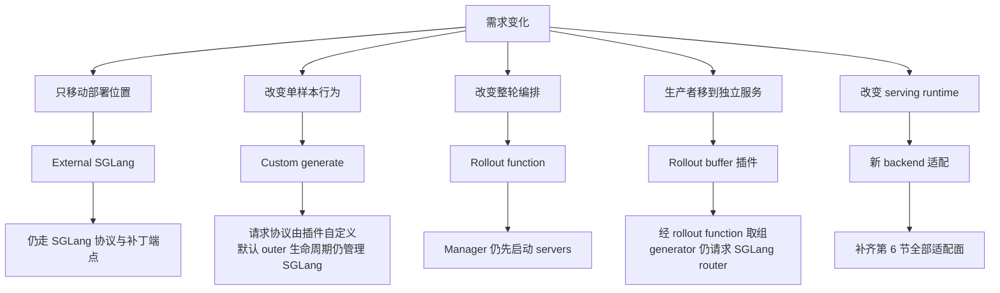
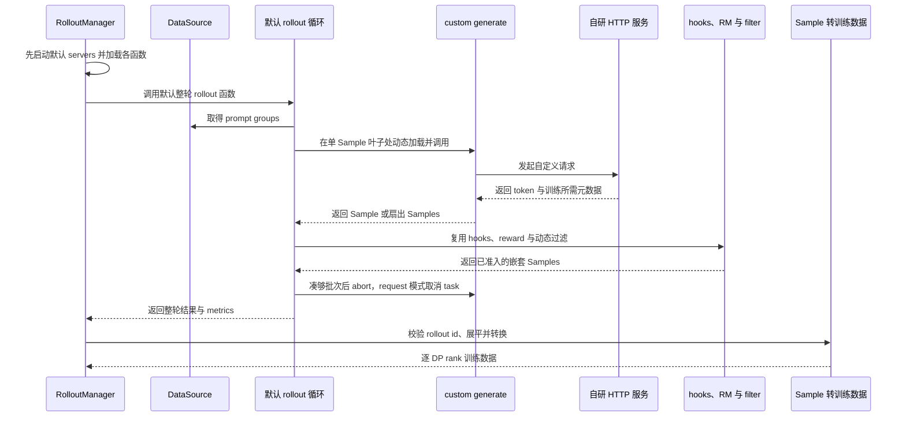

# slime Rollout 后端扩展：先选对扩展边界，再决定是否替换引擎

> **源码基线**：`THUDM/slime@4c193f1f37509cca70f0e88807a9305b70f63f4e`（`main`，2026-09-03）
> **主题**：先区分“换 rollout”背后的几条扩展边界：custom generate、rollout function、forge/sleep/样本钩子、rollout buffer 插件与 external SGLang，并说明 SGLang 专有能力为什么会进入后端接口。随后追踪自研服务经 custom generate 接入的最小路径，列出替换推理后端必须承接的适配面，最后给出选择路径、验收失败门槛与演进锚点。核心代码在 `slime/rollout/`、`slime/backends/sglang_utils/` 与 `slime_plugins/rollout_buffer/`。
> **适用范围**：扩展边界与新后端适配面；默认请求、abort 与 partial 状态机归 [[13_slime_sglang_rollout_engine_analysis|SGLang rollout 引擎]]，权重提交事务归 [[16_slime_weight_sync_analysis|权重同步]]，引擎健康检测与重建归 [[18_slime_fault_tolerance_observability_analysis|容错与可观测性]]，agent 运行时归 [[24_slime_agent_workflow_examples_analysis|Agent 工作流]]，vLLM 派生实现归 [[25_vime_vllm_backend_support_analysis|vime 支持度审计]]。
> **最近更新**：2026-09-17。覆盖请求级 abort 模式、rollout buffer 插件的配置与失败边界、external 路径对 `/pull_weights` 补丁的依赖与外部 PD 测试、契约测试的适用范围，以及唯一的后端适配面清单。

slime 的 rollout 扩展不是一条从“轻量插件”逐级升级到“重型插件”的单一路径，而是几条互相独立的改动轴：外部 SGLang 只改变服务由谁部署；custom generate 只改变单条 Sample 怎样生成；rollout function 改变整轮数据编排；rollout buffer 插件把轨迹生产者移到独立 HTTP 服务；真正接入新后端则必须接管引擎生命周期、router、请求与取消、显存、权重发布和故障恢复。前几类函数入口有文档和契约测试支撑；完整后端的启动位置没有抽象成公开 `Protocol` 或注册分发器，`slime/backends/sglang_utils/engine_group.py::ServerGroup.start_engines` 直接构造 `SGLangEngine`，所谓后端接口只是一组由 SGLang 具体 actor 满足的内部约定（第 6 节）。把这些轴误当成同一层插件，最常见的结果是“文本能生成”，但默认 SGLang 仍被启动，或者权重更新、样本回收、故障恢复在第一次训练迭代后失效。

本文只判断**应在哪个边界扩展**。请求内容、中止与部分结果状态机归 [[13_slime_sglang_rollout_engine_analysis|SGLang rollout 引擎]]；Ray 对象层级归 [[11_slime_ray_control_plane_analysis|Ray 控制面]]；权重发布协议归 [[16_slime_weight_sync_analysis|权重同步]]。

## 1. 问题背景：所谓“换 rollout”其实混合了几个问题

项目明确选择单一 SGLang rollout backend：SGLang 上游参数加 `--sglang-` 前缀直接暴露；README 把理由写成避免为兼容多个推理框架而退化为 lowest-common-denominator 公共能力子集，从而直接使用 SGLang 的 serving、routing、caching、disaggregation 与 weight-sync 能力（`README_zh.md` 的设计目标与“原生 Engine 透传与 SGLang 部署”两节）。

这使“我想接另一个服务”至少有五种不同含义：

| 需求 | 正确扩展边界 | 改变什么 | 明确不改变什么 |
|---|---|---|---|
| SGLang 已由外部平台部署 | external SGLang | 进程由谁启动、GPU 在哪个集群 | engine 类型、router 注册、更新端点仍是 SGLang |
| 每条样本要做工具调用、RAG 或多轮交互 | custom generate | 请求序列、环境交互、返回的 Sample 或 fragments，可选请求级取消 | 默认一轮 rollout 的并发、筛选和 server 启动 |
| 默认 prompt-group 循环无法表达后台队列或持续异步 | rollout-function replacement | DataSource 消费、任务队列、跨轮次调度、整轮返回 | `RolloutManager` 的 server 初始化与下游训练数据边界 |
| 轨迹由独立 agent 框架批量生产，训练侧只取结果 | rollout buffer 插件（仍通过 rollout function 接入） | 生产者进程、消息级轨迹、按组取数 | Manager 仍启动 SGLang；generator 仍请求其 router |
| 必须使用另一套 serving runtime | 新 backend 适配 | engine、router、拓扑、请求与取消、更新、健康检查与恢复 | 只能继续复用上层 Sample/DataSource 与 trainer ABI |

前两种函数入口的职责区分由官方 customization 文档直接给出：绝大多数 agent 场景先用 custom generate，只有 per-sample 定制不够时才替换 rollout function（`docs/zh/get_started/customization.md` 的“通过 customization 接口实现 agentic workflow”表）。external 文档则把对象限定为“外部系统预先部署和管理的 SGLang engine”（`docs/zh/advanced/external-rollout-engines.md` 开头）。

```mermaid
flowchart TB
    Q["需求变化"] --> D["只移动部署位置"]
    Q --> G["改变单样本行为"]
    Q --> O["改变整轮编排"]
    Q --> P["生产者移到独立服务"]
    Q --> B["改变 serving runtime"]
    D --> ES["External SGLang"]
    G --> CG["Custom generate"]
    O --> RF["Rollout function"]
    P --> RB["Rollout buffer 插件"]
    B --> NB["新 backend 适配"]
    ES --> SP["仍走 SGLang 协议与补丁端点"]
    CG --> CP["请求协议由插件自定义<br/>默认 outer 生命周期仍管理 SGLang"]
    RF --> MS["Manager 仍先启动 servers"]
    RB --> RS["经 rollout function 取组<br/>generator 仍请求 SGLang router"]
    NB --> BC["补齐第 6 节全部适配面"]
```

> **设计分析**：这些轴不能合成一个 `backend_plugin` 开关。部署所有权、请求语义、数据编排、轨迹生产位置和 serving runtime 可以独立变化；把它们捆绑会迫使“小改 agent loop”的用户同时实现健康检查和权重同步，也会让“外部部署同一种 engine”被误报成 backend 替换。

## 2. 为什么这么设计：底层引擎的专有能力必然进入后端接口

SGLang（推理框架侧入口见 [[02_engineering/03_infer_frameworks/sglang/index|SGLang]]）不是藏在一个纯 `generate(tokens)` 接口后面。固定基线至少有四类原生能力跨过 slime 边界：

| 后端专有能力 | 进入 slime 的位置 | 对通用接口的影响 |
|---|---|---|
| 全量上游参数 | `add_sglang_arguments` 临时替换 `parser.add_argument`，给 `ServerArgs.add_cli_args` 注册的 flag 与 dest 加 `sglang_` 前缀；router 参数经 `RouterArgs.add_cli_args(use_router_prefix=True)` 以 `--router-*` 暴露 | 通用 schema 无法预知每次 SGLang 升级新增的开关 |
| PD/EPD 与异构 group | `--sglang-config` 的 server group 可为 `regular`、`prefill`、`decode`、`placeholder`、`encoder`；EPD 先启动 encoder 组，再把 `encoder_urls` 与 `language_only` 注入 prefill/regular 组 | 通用 topology 若只有 replica/TP，就表达不了阶段角色和启动依赖 |
| session 与行为 metadata | router 策略为 consistent hashing 时请求带 `X-SMG-Routing-Key`；开 routing replay 时请求 `return_routed_experts`；返回的 token/logprob、`finish_reason`、`weight_version`、top-p 保留集写入 Sample | 通用 response 若只含 text/tokens，会丢一致性与重放所需语义 |
| 内存与热更新控制 | engine 暴露 tagged resume、pause/continue、disk/distributed/tensor update、post-process 与本地 checkpoint pull | 通用 lifecycle 若只有 start/stop，无法支持 colocate、量化热更新与增量同步 |

其中一部分“SGLang 能力”本身来自 slime 镜像的补丁而非上游：`/post_process_weights` 与 `/get_weight_version` 的可用实现来自 `docker/patch/latest/sglang.patch`，`/pull_weights` 来自 `docker/patch/latest/sglang-pull_weights.patch`，top-p 保留集元数据来自 `docker/patch/latest/sglang-top_p.patch`；`docker/Dockerfile` 在 `ENABLE_SGLANG_PATCH=1`（默认）时按序应用这些补丁。上游 `sgl-project/sglang@v0.5.15.post1` 没有 `/pull_weights`，其 `/get_weight_version` 返回 404 弃用提示。所以“后端接口”不仅宽，而且绑定到“上游版本 + 补丁”的组合。

> **设计分析：只保留公共能力会带来什么问题**
>
> - 若通用 backend 接口只保留所有 engine 都有的 `generate/start/stop`，它会禁止或旁路 PD/EPD、session affinity、routing replay、tagged offload 和多种在线更新，因而过度限制强 backend。
> - 若把这些能力都做成 optional method、capability flag 和 backend-specific config，抽象层仍要传播 SGLang 的 worker role、cache、quantization 与 update 语义；它形式上通用，实质上已经泄漏。verl 选择了另一条路：用 `rollout.name` 在 vLLM 与 SGLang 之间切换，但它自己的分析也表明 sleep 标签、abort/resume、PD 与 delta 加载在两个后端之间并不对齐（见 [[14_verl_rollout_runtime_analysis|verl rollout runtime]] 的后端差异一节）。
>
> 所以项目有意选择“上层 Sample/DataSource 接口稳定、下层推理引擎保留原生实现”，而不是遗漏了一个简单工厂（分析判断，依据是 README 的取舍声明与代码中不存在任何后端分发点）。代价是替换运行时需要维护较宽的适配层或派生实现，收益是 SGLang 新能力不必先缩减为公共功能子集。

本页其余章节按这条判据展开：稳定的函数接口与插件见第 3 节，外部 SGLang 的部署边界见第 4 节，一条可回退的最小接入路径见第 5 节，完整后端必须补齐的适配面见第 6 节，约束与失败门槛见第 7 节。

## 3. 稳定的函数接口：稳定的是数据边界，不是推理引擎边界

### 3.1 Custom generate：改请求和 Sample 行为

`--custom-generate-function-path` 的参数 help 把它定义为只替换示例 rollout 里的 `generate(args, sample, sampling_params)`，用途是 multi-turn、function calling 等特殊生成逻辑。customization 文档给出的签名是异步 callable，返回一个 `Sample` 或一次执行拆出的 `list[Sample]`；拆出的 sibling samples 必须共享 `rollout_id`，否则 `slime/observability/rollout_data_utils.py::validate_rollout_id_annotated` 在三层嵌套输出上断言失败。

`slime/rollout/sglang_rollout.py::generate_and_rm` 在默认信号量和单样本 DP 上下文内，先取 `sample.generate_function_path`，否则取全局 custom generate，都没有才用默认 `generate`；签名含 `evaluation` 时透传。之后仍执行 `apply_rollout_sample_hooks` 和 reward 计算（已填 reward 的不重算）。因此这个钩子替换的是“如何完成这一条 Sample”，而不是默认分组收集与过滤、分组 RM 或整轮收集逻辑。`tests/plugin_contracts/test_plugin_generate_contracts.py` 固定了前三个参数名，并覆盖默认分支、单样本覆盖、全局覆盖与 group RM 下的 list 返回。

**取消边界有两种模式。** 默认（server 模式）下，`generate_and_rm` 用 `_run_server_abort_generate` 计数在途生成；整轮结束时 `abort` 仅在计数非零时查询 router 的 `/workers`，再经 `slime/backends/sglang_utils/server_control.py::abort_servers_until_idle` 对每个 worker 发 `/abort_request {"abort_all": true}` 并轮询 `/v1/loads` 直到请求数为 0。生成函数若声明 `abort_mode = "request"`（参数 help 已写明；`slime/rollout/sglang_streaming_rollout.py::generate_streaming` 就这样声明），`_run_request_abortable_generate` 把它登记为可取消 task，`abort` 直接 `task.cancel()`，被取消的 Sample 标为 `ABORTED` 并保留已写入的前缀；与本次 abort 无关的取消照常向上抛出。customization 文档中的签名说明尚未提到 `abort_mode`，以参数 help 与源码为准。

> **设计分析**：custom generate 把请求发给自研服务时，server 模式的 abort 只能停止 SGLang workers，不能证明自研服务已停止计算。声明请求级 abort 后，slime 能关闭自己发起的 HTTP 请求，但服务端是否随连接断开而停算、已消耗的资源是否回收，仍是该服务自己的契约（slime 源码无法证明）。流式生成的 docstring 还提醒：SGLang 把 top-p 与 routed-expert 元数据放在终止 chunk 上，请求级取消会丢掉它们，需要这些特性在 partial rollout 中保留时应改用 server 模式。若这些差异会破坏 partial、资源回收或版本边界，就已越过 custom generate 的安全适用范围。

### 3.2 Rollout function：改整轮数据编排

`--rollout-function-path` 的参数 help 给出签名 `generate_rollout(args, rollout_id, data_source, evaluation=False)`，训练输出的 Sample 至少要设置 `tokens`、`response_length`、`reward` 和 `status`。`slime/rollout/base_types.py::call_rollout_fn` 把训练和评估输出分别包装成 `RolloutFnTrainOutput` 与 `RolloutFnEvalOutput`，并兼容旧式裸返回值。

官方 fully-async 实例 `slime/rollout/fully_async_rollout.py::generate_rollout_fully_async` 展示了这层真正能改什么：后台线程跨 rollout 保持固定在途池，完成 group 进入队列，含 `ABORTED` 样本的 group 回到 DataSource；官方要求配合 `train_async.py` 使用；它仍复用默认 `generate_and_rm_group`，入口拒绝 evaluation，跨轮次顺序为 best effort。partial 限制与原对象回填边界见 [[13_slime_sglang_rollout_engine_analysis|SGLang rollout 引擎]]。

**能力边界**：rollout function 可以重排“何时取数据、何时提交、何时返回”，但 `slime/ray/rollout.py::RolloutManager.__init__` 先调用 `slime/backends/sglang_utils/deployment.py::start_rollout_servers`，之后才加载 DataSource、rollout、eval、reward post-process 与 train-data conversion 函数，并在构造结束前 `ray.get` 全部 engine init handle。因而它不是关闭或替换默认 backend 的生命周期 hook。

**契约测试的适用范围。** `tests/plugin_contracts/test_plugin_rollout_contracts.py` 分两层：对任意路径只比较签名，要求形参名、种类与默认值和默认 `generate_rollout` 完全一致（`args, rollout_id, data_source, evaluation=False`）；只有被测路径不是默认函数时，才用 `args=None` 和一个只有 `get_samples` 的假 DataSource 真调一次训练与评估，要求每组样本数等于 `n_samples_per_prompt`、Sample 字段齐全、评估输出非空；缺 reward 的实现由 `test_misaligned_rollout_plugin_is_rejected` 验证会被拒绝。自定义路径通过环境变量 `SLIME_CONTRACT_ROLLOUT_FUNCTION_PATH` 或直接运行测试文件时传 `--rollout-function-path` 注入。仓内几个替换函数本身过不了这组契约：

| 仓内函数 | 不通过的检查 |
|---|---|
| `slime/rollout/fully_async_rollout.py::generate_rollout_fully_async` | 第三个形参名是 `data_buffer`；`evaluation=True` 抛 `ValueError`；依赖真实 `args` 与 router |
| `slime_plugins/rollout_buffer/rollout_buffer_example.py::generate_rollout` | 形参名 `data_buffer`；评估抛 `NotImplementedError`；依赖外部 buffer 服务 |
| `slime/rollout/sft_rollout.py::generate_rollout` | 形参名 `data_buffer`（SFT 路径归 [[28_slime_sft_path_and_loss_mask_analysis|SFT 与 loss mask]]） |
| `slime/rollout/forge_load.py::generate_rollout` | 签名一致，但读 `args.load_forge_rollout_data`，`args=None` 时无法运行；字面路径模式下评估返回空 |

所以这组契约验证的是“可脱离服务运行的自包含 rollout 函数与默认函数形状一致”，不是所有合法 rollout function 的准入门槛；需要真实 router、外部服务或特殊 DataSource 的函数，只能用它核对形状，行为仍要靠端到端运行验证（分析判断）。

### 3.3 Forge、sleep 和 Sample hooks 是三种不同的替换

`slime/rollout/forge_load.py::generate_rollout` 读 `--load-forge-rollout-data` 指定的 `.pt`，把 dict 恢复为 Sample，保留原 `sample.rollout_id`。字面路径每轮复用同一文件，eval 返回空；模板路径 `{rollout_id}` 在训练文件缺失时回退到 `0`，eval 查 `eval_<id>` 且不回退到训练样本，找不到也返回空。训练找不到文件时抛 `RuntimeError`。它不设置 debug-train-only，适合保留真实 SGLang、权重更新和显存切换的内存实验。

`slime/rollout/sleep_rollout.py::sleep` 每小时 sleep 并日志计数，永不返回训练 batch。因为 Manager 已先启动服务，可在此时人工压测或 profile；它不是 engine 的显存 sleep API，使用过程归 [[18_slime_fault_tolerance_observability_analysis|容错与可观测性]]。

`--rollout-sample-hook-path` 更窄：它不替换 generation，而是在 generation 后、RM 前逐 Sample 叶子执行 hook（可配多个路径，按序执行）。`slime/rollout/sample_hooks.py::apply_rollout_sample_hooks` 支持同步/异步 hook、原地改写返回 `None` 或返回替换 Sample，保持嵌套 list；其他返回类型抛 `TypeError`。hook 可接 `evaluation` 与当前 round 的 `rollout_id`，不接收的关键字会被过滤。生成与完整 RM 分派归 [[13_slime_sglang_rollout_engine_analysis|SGLang rollout 引擎]]。

> **设计分析**：三者替换的层次不同，所以不能互相代用。forge 替换“数据从哪来”却保留整个服务栈，sleep 替换“是否产出数据”只为留出观察窗口，sample hook 只在单条 Sample 上做后处理；若用 sample hook 去模拟 forge，就会在已经真实生成之后才覆盖数据，既浪费 GPU 又破坏行为 logprob 的来源。

### 3.4 Rollout buffer 插件：把生产者移到独立服务

`slime_plugins/rollout_buffer` 由三部分组成，训练侧只通过 rollout function 接入：

1. **buffer 服务** `slime_plugins/rollout_buffer/buffer.py`（FastAPI，默认端口 8889）。`/start_rollout` 在后台任务中调用 `run_rollout`：先用 `discover_generators` 扫 `slime_plugins/rollout_buffer/generator/*.py` 里定义了 `TASK_TYPE` 与 `run_rollout` 的模块，可选取 `transform_group`、`is_valid_group`、`get_group_data_meta_info`，再按 `task_type` 选中 generator，并**新建**全局 `RolloutBuffer`。`/buffer/write` 按 `instance_id` 追加消息记录；`/get_rollout_data` 调 `BufferQueue.get`，一次取走所有满足 `is_valid_group` 的组（默认条件是组内条数 ≥ `num_repeat_per_sample`），并从服务端删除。
2. **generator** `slime_plugins/rollout_buffer/generator/base_generator.py`。`run_rollout` 用 OpenAI 客户端请求 `remote_engine_url` 的 `/v1` chat completions（即 slime 启动的 SGLang router），`query_single_turn` 遇到 `finish_reason == "abort"` 时睡 10 秒后以 `continue_final_message` 续写，最多 6 次；reward 在 generator 内用规则 math RM 计算，再经 `BaseGenerator.send_data_to_buffer` 写入 buffer。
3. **训练侧 rollout function** `slime_plugins/rollout_buffer/rollout_buffer_example.py::generate_rollout`。首次调用经 `start_rollout` 把 router 地址、`--rollout-task-type`、采样参数与已完成组清单发给 buffer 服务；之后 `generate_rollout_async` 轮询 `/get_rollout_data`，校验每条记录含 `uid/instance_id/messages/reward/extra_info`，`select_rollout_data` 挑组，用 `slime/utils/mask_utils.py::MultiTurnLossMaskGenerator` 从 messages 重新构造 token 与 loss mask，放入 `slime/rollout/data_source.py::RolloutDataSourceWithBuffer` 后按 `rollout_batch_size` 取出。示例脚本 `slime_plugins/rollout_buffer/rollout_buffer_example.sh` 用 `train_async.py` 启动。

这改变的是外部生产队列与整轮函数，仍把 SGLang router 地址交给 generator；不会替换 Manager 的 engine 生命周期。它也不是 `AsyncRolloutWorker` 的输出队列：后者在同一进程保留真实 Sample，前者经 HTTP 传消息记录并重新构造训练数据。

**配置面**（`slime/utils/arguments.py::add_rollout_buffer_arguments`）：

| 参数 | 默认 | 读取方与语义 |
|---|---|---|
| `--rollout-buffer-url` | `None` | 示例 rollout function 用它调用 `/start_rollout` 与 `/get_rollout_data`，并作为 `remote_buffer_url` 发给 generator |
| `--fetch-trajectory-retry-times` | `-1` | 示例取数循环的异常重试上限；`-1` 表示无限重试 |
| `--rollout-task-type` | `math` | 发给 buffer 服务的 `task_type`，用于选择 generator 的 `TASK_TYPE` |
| `--min-batch-collection-ratio` | `1` | **无读取方**：全仓只有参数定义，设置它不改变任何行为 |
| `--loss-mask-type` | `qwen` | 示例用它构造 `MultiTurnLossMaskGenerator`；SFT 路径同样读取 |

**失败边界**（源码行为；后果中标注的推断未运行验证）：

| 场景 | 源码行为 | 后果 |
|---|---|---|
| 取回的有效组多于需要 | 服务端 `BufferQueue.get` 已把所有有效组删除；`select_rollout_data` 按组内最大时间戳只保留最新的 `need_length` 组 | 超额组被丢弃、不回填，较早完成的轨迹白算（分析判断：长轨迹更容易被挤掉） |
| 需要 rollout logprob 或版本信息 | 构造的 Sample 只有 tokens、response_length、reward、status、loss_mask、metadata，没有 `rollout_log_probs`、`weight_versions` 或 top-p/routed-expert 元数据 | 依赖行为 logprob 或重放元数据的选项得不到输入；token 由 messages 重新分词而非引擎实际输出（分析判断：可能出现分词漂移，见 [[24_slime_agent_workflow_examples_analysis|Agent 工作流]]） |
| 生成跨越权重更新 | generator 在 abort 后续写同一轨迹，不记录版本 | 一条轨迹可能拼接多个策略版本的输出 |
| buffer 长期不出数 | `get_rollout_data` 在 `success=false` 时每 3 秒轮询、永不超时；重试计数只统计异常 | 即使 `--fetch-trajectory-retry-times` 为有限值，训练也可能无限阻塞；为 `-1` 时连异常也无限重试 |
| buffer 服务不可达 | 训练侧 `start_rollout` 无限重试且不休眠；generator 的 `send_data_to_buffer` 只试 2 次后静默丢弃 | 前者忙等，后者丢数据 |
| 重启后续跑 | 服务端 `_get_valid_groups_with_timeout` 返回的 `finished_groups` 始终为空列表 | 写入 DataSource metadata 的“已完成组”为空，重启后 `skip_instance_ids` 不跳过任何实例（分析判断） |
| eval | 示例直接抛 `NotImplementedError` | eval 必须另配 `--eval-function-path`，评估路径归 [[27_slime_evaluation_path_analysis|评估路径]] |

插件 README 与实现有三处不一致：README 要求 generator 文件以 `_generator.py` 结尾，`discover_generators` 实际扫描 `slime_plugins/rollout_buffer/generator/*.py`；README 说默认实现在 `slime_plugins/rollout_buffer/default_func.py`，该文件不存在，默认函数定义在 `slime_plugins/rollout_buffer/buffer.py`；README 称可重写“五个可选函数”，发现逻辑只读取三个。以源码为准。

## 4. 外部 SGLang：改变服务由谁部署，不改变通信协议

**发现发生在参数解析期。** `slime/utils/arguments.py::slime_validate_args` 在 `--rollout-external-engine-addrs` 非空（且非 debug-train-only）时调用 `slime/backends/sglang_utils/external.py::apply_external_engine_info_to_args`：对每个地址先请求 `/server_info`、失败再试 `/get_server_info`，从返回的 ServerArgs 字段推断 TP/PP/EP、GPU 数和 worker 类型，并写回 `args.rollout_external_engine_infos`、`rollout_num_engines` 与 **`rollout_num_gpus`**（按各 engine GPU 数求和）。所以 external 模式同样在解析期派生 rollout GPU 数，不需要也不应手工对齐。`_infer_worker_type` 的结果有四种：`encoder_only` 为真时是 `encoder`，`disaggregation_mode` 为 prefill/decode 时取之，否则 `regular`；external 文档只列了 `regular`、`prefill`、`decode` 三类，以源码为准。上游 v0.5.15.post1 的 `/server_info` 返回 `dataclasses.asdict(server_args)`，这些字段属于上游契约。

与 `--sglang-config`、`--prefill-num-servers` 的互斥由 `slime/backends/sglang_utils/arguments.py::validate_args` 断言，它在 `slime_validate_args` 之后运行，因此两者同时给出时，slime 会先完成一次外部发现再拒绝组合。

**部署侧仍是 SGLang 代理。** `start_rollout_servers` 在 external 模式下转到 `slime/backends/sglang_utils/external.py::start_external_rollout_servers`：启动（或复用已给定地址的）router，按 PD worker 是否存在决定 PD 模式，为每个外部 engine 创建申请零 GPU 的 `SGLangEngine` Ray actor 并调用 `init`。`SGLangEngine._init_external` 用 `get_server_info` 取实际参数，与 slime 期望的非拓扑字段（如 `disaggregation_mode`、`enable_return_routed_experts`）逐项断言，再 `_register_to_router`；encoder 类型不注册到 router。最后把默认 router 写回 `args.sglang_model_routers`。外部发现测试 `tests/test_external_sglang_engines.py` 要求 server info 能还原 TP/PP/EP/MoE-DP 拓扑，而不是只检查一个通用 `/health`。

**资源边界确实移动了。** `slime/ray/placement_group.py::_get_placement_group_layout` 在 external 模式下只为训练 GPU 建 bundle，proxy actor 本身申请零 GPU；实际 serving GPU 由外部系统拥有。`ExternalRolloutServer` 的 `offload/onload/onload_weights/onload_kv` 返回空列表，不管理外部显存；`recover` 只告警并跳过，external 文档的部署清单也明确说 fault tolerance 恢复不覆盖它。external 路径不向 prefill/regular 注入 `encoder_urls`，外部 EPD 的编排需要由外部部署自己完成（分析判断，依据是 `start_external_rollout_servers` 中没有对应步骤）。

**协议边界没有移动，而且带着补丁依赖。** external 文档要求 SGLang HTTP endpoint、server info 和所选权重通信路径：

| 同步方式 | 调用的 engine 端点 | 端点来源 |
|---|---|---|
| full + nccl（训练器与 engine 能建 NCCL group） | `init_weights_update_group`、`update_weights_from_distributed`、`pause_generation`/`continue_generation` 等 | 上游端点；量化模型的 `post_process_weights` 来自 `sglang.patch` |
| full + disk | 写 `weight_vNNNNNN/` 后调 `update_weights_from_disk` | 上游端点 |
| full + disk + `--update-weight-local-checkpoint-dir` | 先对每个 engine 调 `pull_weights` 把 checkpoint 拉到各 host 本地，再从本地 reload | `/pull_weights` 来自 `sglang-pull_weights.patch` |
| delta + disk | 首次 `pull_weights(0)` 物化本地基线，之后每版 `pull_weights` 校验并 apply，再 `update_weights_from_disk` | `/pull_weights` 来自 `sglang-pull_weights.patch`；delta 模式在 `slime_validate_args` 中强制要求 disk transport 与本地 checkpoint 目录 |

因此，外部 engine 若不是用打过 slime 补丁的 SGLang 启动，delta 同步与本地 checkpoint 路径在第一次调用 `/pull_weights` 时就会失败（分析判断：上游 v0.5.15.post1 不存在该路由，调用会得到 HTTP 错误，未运行验证）。镜像是否打补丁由 `docker/Dockerfile` 的 `PATCH_VERSION` 与 `ENABLE_SGLANG_PATCH` 控制，其 TODO 注释写明 GB200/GB300 暂时不打补丁、需用户自带 SGLang 版本。逐端点的“上游 / 补丁”归属与镜像闸门见 [[16_slime_weight_sync_analysis#2.2 从最小实例到整个同步系统|权重同步的提交协议与 SGLang 依赖边界]]，版本计数、pull 与 reload 的顺序也归该页。

**外部 PD 是这条边界的组合实例。** `tests/test_qwen3_4B_external_pd.py` 在单机带外启动一个 prefill 与一个 decode SGLang（tp=1，mooncake 传输后端），slime 用 `--rollout-external-engine-addrs` 连接、经 `/server_info` 推断类型并注册到 PD 模式 router；权重同步用 `--update-weight-mode delta --update-weight-transport disk` 加本地 checkpoint 目录。测试 docstring 称这是“对预先启动的 worker 唯一真正可用的同步路径”（原因写为训练器与外部 engine 之间没有 NCCL group）。这比 external 文档的推荐表更强：文档仍把 full + nccl（能建 group 时）与 full + disk 列为可选路径。两者不矛盾于源码——`create_weight_updater` 对 external 没有额外限制——但该断言只由这一个测试的配置支撑，其余组合在外部 PD 下没有测试覆盖（分析判断）。PD 本身的部署与参数归 [[13_slime_sglang_rollout_engine_analysis|SGLang rollout 引擎]]。

> **设计分析**：external 是“同一种 backend 的远程部署模式”。若把任意生成服务伪装成 external SGLang，就必须模仿 server-info 字段、router worker 注册、`/abort_request` 与 `/v1/loads`、热更新端点（包括补丁提供的 `/pull_weights` 与 `/post_process_weights`）、pause/flush/version 等语义；这已经是协议重实现，不是地址配置。另一个推论是：server 模式的 abort 会对 router 下所有 worker 发 `abort_all`，外部 engine 若同时服务别的调用方，它们的请求也会被中止（分析判断）；请求级 `abort_mode` 不经过这一步。

## 5. 追踪一条扩展路径：自研 HTTP 服务先从 custom generate 接入

假设目标只是验证自研服务能否产生可训练轨迹，最小且可回退的路径如下：

```mermaid
sequenceDiagram
    participant RM as RolloutManager
    participant DS as DataSource
    participant RL as 默认 rollout 循环
    participant CG as custom generate
    participant HS as 自研 HTTP 服务
    participant RF as hooks、RM 与 filter
    participant CV as Sample 转训练数据
    RM->>RM: 先启动默认 servers 并加载各函数
    RM->>RL: 调用默认整轮 rollout 函数
    RL->>DS: 取得 prompt groups
    RL->>CG: 在单 Sample 叶子处动态加载并调用
    CG->>HS: 发起自定义请求
    HS-->>CG: 返回 token 与训练所需元数据
    CG-->>RL: 返回 Sample 或扇出 Samples
    RL->>RF: 复用 hooks、reward 与动态过滤
    RF-->>RL: 返回已准入的嵌套 Samples
    RL->>CG: 凑够批次后 abort，request 模式取消 task
    RL-->>RM: 返回整轮结果与 metrics
    RM->>CV: 校验 rollout id、展平并转换
    CV-->>RM: 逐 DP rank 训练数据
```

这张图刻意保留了默认 rollout 循环：custom generate 只替换单 Sample 的生成叶子，不接管 DataSource、并发收集、准入、训练转换或权重更新；取消只在声明 `abort_mode = "request"` 时才落到它自己的 task 上。

1. CLI 用 `--custom-generate-function-path` 指向异步函数；参数层只承诺替换单 Sample 的生成步骤，并说明请求级 abort 的声明方式。
2. `RolloutManager.__init__` 先经 `start_rollout_servers` 创建默认 servers，再创建 DataSource 并加载默认 rollout function；custom generate 本身要到单 Sample 执行时才由 `generate_and_rm` 动态加载。
3. 默认 `generate_rollout_async` 从 DataSource 取 group，进入现有的并发收集、动态过滤、abort 与 partial 回填逻辑；partial 模式只回收至少含一条“已中止且有部分响应”样本的组。
4. `generate_and_rm` 在 semaphore 内调用自研函数，按 `abort_mode` 选择取消方式；返回后仍由默认路径执行 hooks、补 reward，并允许 fanout list。
5. `RolloutManager._get_rollout_data` 经 `call_rollout_fn` 接收 `RolloutFnTrainOutput`，在展平前用 `validate_rollout_id_annotated` 校验 compact siblings 的 `rollout_id`，随后进入 `_convert_samples_to_train_data` 与按 DP 切分。

这条路径验证的是 **token/Sample/奖励/训练兼容性**，不是 backend 完成度。它有三个明确停止条件：默认 SGLang 的额外资源已不可接受；自研服务需要自己的 session/router 语义或服务端取消保证；训练权重必须热更新到自研服务。一旦命中任一条件，就应升级为 backend 适配，而不是继续在 custom generate 内堆控制面旁路。

## 6. 新后端必须承接的适配面

固定基线的服务启动点不是后端分发器：`slime/backends/sglang_utils/engine_group.py` 直接导入 `SGLangEngine`，`ServerGroup.start_engines` 用 `ray.remote(SGLangEngine)` 构造 actor；external 路径同样直接构造它。因此下表不是公开稳定 API，而是**从调用点反推出的内部接口义务**。它是本知识库中“新 rollout 后端必须实现什么”的唯一清单；其他页面（包括 [[25_vime_vllm_backend_support_analysis|vime 支持度审计]]）按下表的适配面名称引用，不再各自维护列表。

| 适配面 | slime 侧调用点（谁调用 → 用到什么） | 依赖侧接口与来源 | 缺失或不兼容时的边界 |
|---|---|---|---|
| ① 参数与部署配置 | `slime/utils/arguments.py::parse_args` 在非 debug-train-only、未设 `--load-debug-rollout-data` 时先调 `slime/backends/sglang_utils/arguments.py::sglang_parse_args`：独立 parser 以 `parse_known_args` 只吃 SGLang 相关参数，其中 `add_sglang_arguments` 注册 `--sglang-*` 并经 `add_sglang_router_arguments` 注册 `--router-*`，同时把 router 均衡阈值默认设为 abs 10 / rel 1.2；`slime/backends/sglang_utils/arguments.py::validate_args` 推导 TP 并查互斥；`slime/backends/sglang_utils/sglang_config.py::resolve_sglang_config` 解析五类 worker 与 per-group overrides；`slime/backends/sglang_utils/sglang_engine.py::_compute_server_args` 把编排参数映射为 `ServerArgs` | 上游 `ServerArgs`、`RouterArgs` 字段集，随安装版本变化 | 新 runtime 需要自己的参数面与拓扑 schema；worker role 与 override 键不能复用 |
| ② 外部发现 | `slime_validate_args` → `slime/backends/sglang_utils/external.py::apply_external_engine_info_to_args` 写回 engine 数、GPU 数、worker 类型；`SGLangEngine._init_external` 逐字段断言 | 上游 `/server_info`（`/get_server_info` 兜底）返回的 ServerArgs 字段 | 字段对不上时在解析期或 init 断言失败 |
| ③ 部署与生命周期 | `RolloutManager.__init__` → `slime/backends/sglang_utils/deployment.py::start_rollout_servers`（regular / `slime/backends/sglang_utils/disaggregation.py::start_pd_server_groups` / `start_epd_server_groups`）→ `ServerGroup.start_engines` → `SGLangEngine.init`（`launch_server_process` 或外部校验）；Manager 构造末尾等待 init handle；`SGLangEngine.shutdown`、`get_url` | 上游 server 进程入口与 `/health_generate` 就绪等待 | ready 语义、进程归属、端口游标与 EPD 的启动先后都要自带 |
| ④ router 与 worker 注册 | `slime/backends/sglang_utils/deployment.py::_start_router`（每模型一个；PD 模式；关闭断路器与 router 健康检查）；`SGLangEngine._register_to_router` 向 `/workers` 注册（prefill 带 bootstrap port，encoder 不注册），shutdown 时删除；`args.sglang_model_routers` 供 `slime/rollout/sglang_rollout.py::get_model_url` 定向访问 | `sglang_router` 的 worker API（上游契约，本页未读其源码） | 不注册就收不到流量；server 模式 abort 的 worker 列表也取自 router |
| ⑤ 请求与响应元数据 | 两个消费者。rollout 路径：`slime/rollout/sglang_rollout.py::generate` 发 `/generate`（`input_ids`，或多模态时 `text`+`image_data`；`return_logprob`；按需 `return_routed_experts`；`X-SMG-Routing-Key`），自己从 `meta_info.output_token_logprobs` 拆出 token 与 logprob → `slime/utils/types.py::Sample.append_response_tokens` → `_apply_meta_info` 读 `finish_reason.type`、`weight_version`、`routed_experts`、top-p 保留集、spec 与 prefix-cache 计数。agent 路径：`slime/agent/adapters/common.py::call_sglang_generate` 发带 `rid` 的 `/generate`（`return_logprob`、`X-SMG-Routing-Key`），同样读 `output_token_logprobs` 与 `finish_reason`，归 [[24_slime_agent_workflow_examples_analysis|Agent 工作流]] | `/generate` 为上游；top-p 保留集字段来自 `sglang-top_p.patch` | 缺字段时 logprob 为空、无法区分 abort/length/stop、重放与版本统计失效；字段语义对齐归 [[17_slime_train_inference_consistency_analysis|训推一致性]] |
| ⑥ 取消与排空 | rollout 路径：`slime/rollout/sglang_rollout.py::abort`，server 模式经 router `/workers` → `slime/backends/sglang_utils/server_control.py::abort_servers_until_idle`（`/abort_request` 带 `abort_all` + `/v1/loads` 轮询）；`abort_mode = "request"` 时取消 task。agent 路径：`slime/agent/adapters/common.py::_abort_sglang_request` 在客户端取消或超时时按 `rid` 中止单个请求，向 router `/workers` 列出的每个 worker 发 `/abort_request {"rid": rid}`，router 返回 404 时直接对该地址发 | 上游 `/abort_request`（全量与按 `rid` 两种用法）、`/v1/loads` | 无法全量中止或查询负载时，整轮结束与更新前的“在途已清空”无法确认 |
| ⑦ 拓扑暴露 | `RolloutManager.get_updatable_engines_and_lock` → `slime/backends/sglang_utils/engine_group.py::RolloutServer.engine_gpu_counts` / `engine_gpu_offsets` / `engine_parallel_configs` / `num_new_engines`；`_get_updatable_server` 只取第一个可更新模型 | slime 内部 | updater 看到的 rank 布局必须与服务一致 |
| ⑧ 显存生命周期 | `RolloutManager.offload/onload/onload_weights/onload_kv` → `ServerGroup.offload/onload`（只对与训练共卡的组）→ `SGLangEngine.release_memory_occupation`（先 `flush_cache`）/ `resume_memory_occupation(tags)`，tag 常量取自 `sglang.srt.constants` | 上游 `/release_memory_occupation`、`/resume_memory_occupation`、`/flush_cache` | 不支持就必须在配置期拒绝 colocate 与 offload |
| ⑨ 权重发布与校验 | `slime/backends/megatron_utils/update_weight/__init__.py::create_weight_updater` 按 mode×transport×colocate 选 updater。**updater**：NCCL 与共卡路径调 `pause_generation`、`flush_cache`、`init_weights_update_group`/`destroy_weights_update_group`、`update_weights_from_distributed` 或 `update_weights_from_tensor`、`post_process_weights`、`continue_generation`；delta 路径调 `pull_weights`、`pause_generation`、`flush_cache`、`update_weights_from_disk`、`continue_generation`。**`slime/ray/actor_group.py::RayTrainGroup._reload_rollout_weights_from_disk`**（full+disk）：设了本地 checkpoint 目录时先 `pull_weights`，再 pause、flush、`update_weights_from_disk`、continue，仅 `--ci-test` 时调 `get_weight_version` 核对版本。**driver**：`--check-weight-update-equal` 下，`slime/ray/placement_group.py::create_rollout_manager` 发 `snapshot` 与 `reset_tensors`，`train.py::train` / `train_async.py::train` 首次更新后发 `compare`，都经 `RolloutManager.check_weights` → `SGLangEngine.check_weights` | 多数为上游端点（含 `/weights_checker`）；`/post_process_weights` 与可用的 `/get_weight_version` 来自 `sglang.patch`，`/pull_weights` 来自 `sglang-pull_weights.patch` | 顺序、版本与提交边界归 [[16_slime_weight_sync_analysis|权重同步]] |
| ⑩ 健康检测与恢复 | `slime/utils/health_monitor.py::RolloutHealthMonitor` → `SGLangEngine.health_generate`，失败则 `shutdown` + `ray.kill` 并置空槽；`MegatronTrainRayActor.update_weights` → `RolloutManager.recover_updatable_engines` → `RolloutServer.recover` 重跑 `start_engines`，`num_new_engines > 0` 时 `connect_rollout_engines` 重推权重；CI 故障注入 `slime/ray/rollout.py::RolloutManager._try_ci_fault_injection` 调 `SGLangEngine.simulate_crash`，它复用 `shutdown` 从 router 注销并杀掉本地进程树（外部 engine 上直接返回） | 上游 `/health_generate`；router 的 worker 删除 API | 恢复链与“恢复成功”的判据归 [[18_slime_fault_tolerance_observability_analysis|容错与可观测性]] |
| ⑪ 观测与剖析 | `slime/observability/rollout_metrics.py` 从 meta 读 `e2e_latency`、`queue_time` 与 `pd_*` 计时；`slime/observability/trace_utils.py::build_sglang_meta_trace_attrs`；`SGLangEngine.start_profile/stop_profile` 已定义但仓内无调用方，`tools/profile_rollout.py` 直接对 worker 地址发 `/start_profile` 与 `/stop_profile` | `queue_time`、`e2e_latency` 与 `/start_profile`、`/stop_profile` 为上游；`pd_*` 计时字段来自 `sglang.patch` | 缺字段只丢指标与 trace 属性，不影响训练数据（分析判断） |

以上是从固定调用点反推的内部义务，不是已发布的 backend Protocol。完整方法外观读 `slime/backends/sglang_utils/sglang_engine.py::SGLangEngine`，部署与生命周期调用者读 `slime/backends/sglang_utils/deployment.py`、`slime/backends/sglang_utils/engine_group.py::ServerGroup/RolloutServer` 与 `slime/ray/rollout.py::RolloutManager`。

> **设计分析**：新后端可以实现同名的引擎适配外观，也可以连同部署、更新器和监控一起替换；但只替换请求函数无法满足上表。前者改动小，却会继承为 SGLang 设计的接口（例如 ⑧ 的 tag 常量直接从 `sglang.srt.constants` 导入）；后者边界更清楚，但会形成派生实现，而不是一个配置插件。vime 走的是后者，逐项状态见 [[25_vime_vllm_backend_support_analysis|vime 支持度审计]]；vLLM 自身的服务与权重接口见 [[02_engineering/03_infer_frameworks/vllm/index|vLLM]]。

## 7. 约束：选择路径、能力边界与失败门槛

| 你真正需要的能力 | 首选路径 | 升级到下一层的信号 |
|---|---|---|
| 工具、RAG、多轮、环境交互、fanout | custom generate | 需要跨 Sample 全局队列、服务端取消保证或不再接受默认 SGLang 启动 |
| 持续后台队列、跨轮次在途任务、自定义 DataSource 消费 | rollout function | 需要改变 engine 资源、router、更新或恢复所有者 |
| 轨迹由独立 agent 框架批量生产 | rollout buffer 插件 | 需要行为 logprob、版本信息、eval 或不丢组的回填 |
| 独立容器/集群中的 SGLang | external SGLang | 外部服务不是 SGLang，或无法提供 server-info、abort/load 与更新端点（含补丁端点） |
| 另一推理 runtime | 完整 backend 适配或派生实现 | 无更低层可升级；必须逐项声明第 6 节中不支持的适配面 |

验收新扩展时，至少主动触发以下失败路径：

1. **资源重复**：custom hook 已请求外部服务，但默认 SGLang 是否仍被 `RolloutManager.__init__` 启动并占 GPU？
2. **取消悬空**：动态采样结束或权重更新触发 abort 时，非 SGLang 请求是否真的停止，而不是只在本地把 Sample 标为 aborted？未声明 `abort_mode = "request"` 时，默认外层只控制 SGLang workers；声明后 slime 只能取消自己的 task。
3. **数据悄悄错位**：返回值是否满足 Sample 字段要求，并继续保证 token、mask、logprob 与扇出标识的训练语义完整？rollout 契约测试只覆盖可脱离服务运行的函数（第 3.2 节），完整数据语义见 [[12_slime_sample_datasource_analysis|Sample 与 DataSource]]。
4. **半版本服务**：每个 serving rank 是否在 resume 前完成更新、清掉旧 cache 并报告同一 version？现有 full+disk 路径只在 `--ci-test` 时由 `slime/ray/actor_group.py::RayTrainGroup._reload_rollout_weights_from_disk` 逐 engine 核对 version。
5. **恢复到初始权重**：engine 重建后是否重新连接 updater 并覆盖到当前 actor 版本？现有流程在 `MegatronTrainRayActor.update_weights` 中以 `num_new_engines > 0` 触发重连。
6. **能力假兼容**：不支持 PD、routing replay、colocate offload、量化 post-process、`/pull_weights` 或某种 transport 时，是否在配置期 fail fast，而不是运行中静默降级？SGLang 参数校验与 delta 模式的前置条件都在解析期断言（`slime/backends/sglang_utils/arguments.py::validate_args`、`slime_validate_args`）。

最终判断标准不是“能否返回一段文本”，而是**改动是否停在它声称的职责边界内**。只改变数据行为，就使用稳定的函数接口；一旦负责资源、版本或故障恢复，就应明确自己正在实现新的后端。

## 8. 发展趋势

> [!note] 推断
> 本节只引用固定基线里实际存在的 TODO、能力声明与近期提交，不构成项目路线图；判断部分是本页推断。

这些锚点都落在**扩展边界本身**上，而不是落在“会不会支持某个新引擎”上：

- **router 参数面还没有统一到 `--sglang-` 前缀约定。** `slime/backends/sglang_utils/arguments.py` 在 `add_sglang_router_arguments` 上方写着 “TODO: use all sglang router arguments with `--sglang-router` prefix”；当前实现是三个手写 `--sglang-router-*` 参数加一次 `RouterArgs.add_cli_args(parser, use_router_prefix=True, exclude_host_port=True)`，并把 router 日志级别默认设为 `warn`。第 2 节说“全量上游参数被前缀包装后暴露”对 `ServerArgs` 成立，对 router 只是部分成立；**由此可推断**，依赖具体 router flag 名的外部部署脚本要预期这层命名还会动。
- **多模型/多 server 的权重更新是已声明的未完成项。** `RolloutManager._get_updatable_server` 的 docstring 直接写 “multi-model weight update is not yet supported”，因此第 6 节 ⑦、⑨ 的义务目前只对单一可更新模型成立。想在一个作业里同时在线更新两套 serving 模型的扩展，现在没有可复用的上游路径。
- **rollout-function 层的 partial resume 仍未接通。** `examples/fully_async/README.md` 的 Limitations 写明 “partial-rollout-style resume for `ABORTED` trajectories is not yet wired; for now the trajectory is re-queued and starts over”。这是示例声明的支持范围；源码实际回填原 Sample 对象，没有统一清空 token，不能据此断言所有 custom generate 都必定从零重做。具体边界由 [[13_slime_sglang_rollout_engine_analysis|SGLang rollout 引擎]] 维护。
- **扩展点在变细，而不是变成后端注册表。** 近期新增的是生成函数级的 `abort_mode` 声明与流式累积器 `slime/rollout/streaming_utils.py::SGLangStreamAccumulator`，仍在 custom generate 这一层；新增的 `slime/utils/accelerator/` 选择的是进程的设备后端（`slime/utils/accelerator/cuda.py`、`slime/utils/accelerator/musa.py` 等），不是 rollout serving 后端，不要混为一谈。

固定基线里**没有**任何注释或文档提到要把 engine 启动点抽象成 `Protocol`、注册表或后端分发器。第 6 节所说“内部约定不是公开 API”因此是当前的稳定状态，而不是一个即将被替换的过渡形态；把它当成“等官方出插件接口”来规划，在这个基线上没有依据。

## 9. 源码阅读路线

1. 取舍声明与入口：`README_zh.md`（设计目标、原生 Engine 透传）→ `docs/zh/get_started/customization.md`（agentic workflow 表、测试一节）→ `slime/utils/arguments.py` 的 `--rollout-function-path`、`--custom-generate-function-path`、`--rollout-sample-hook-path`、`--load-forge-rollout-data`、`--rollout-external-engine-addrs` 与 `slime_validate_args`。
2. Manager 装配顺序：`slime/ray/rollout.py::RolloutManager.__init__` / `_get_rollout_data` / `_convert_samples_to_train_data` → `slime/rollout/base_types.py::call_rollout_fn` → `slime/observability/rollout_data_utils.py::validate_rollout_id_annotated`。
3. 单样本生成与取消：`slime/rollout/sglang_rollout.py::generate_and_rm` / `_run_request_abortable_generate` / `_run_server_abort_generate` / `generate` / `abort` / `generate_rollout_async` → `slime/backends/sglang_utils/server_control.py::abort_servers_until_idle` → `slime/rollout/sglang_streaming_rollout.py::generate_streaming` → `slime/rollout/sample_hooks.py::apply_rollout_sample_hooks` → `tests/test_streaming_rollout.py::test_stream_cancellation_closes_request_and_keeps_prefix`。
4. 替换函数与契约：`slime/rollout/fully_async_rollout.py::generate_rollout_fully_async` → `slime/rollout/forge_load.py::_resolve_path` / `generate_rollout` → `slime/rollout/sleep_rollout.py::sleep` → `tests/plugin_contracts/test_plugin_rollout_contracts.py::assert_rollout_function_signature_matches_default` / `test_rollout_function_path_contract_supports_user_override` → `tests/plugin_contracts/test_plugin_generate_contracts.py`。
5. buffer 插件：`slime_plugins/rollout_buffer/buffer.py::discover_generators` / `BufferQueue.get` / `RolloutBuffer.read` / `run_rollout` → `slime_plugins/rollout_buffer/generator/base_generator.py::query_single_turn` / `BaseGenerator.send_data_to_buffer` → `slime_plugins/rollout_buffer/rollout_buffer_example.py::start_rollout` / `get_rollout_data` / `select_rollout_data` / `generate_rollout_async` → `slime/utils/arguments.py::add_rollout_buffer_arguments` → `slime/rollout/data_source.py::RolloutDataSourceWithBuffer.add_samples`。
6. 部署与 external：`slime/backends/sglang_utils/deployment.py::start_rollout_servers` / `_start_router` → `slime/backends/sglang_utils/disaggregation.py::start_epd_server_groups` → `slime/backends/sglang_utils/engine_group.py::ServerGroup.start_engines` / `RolloutServer.recover` → `slime/backends/sglang_utils/external.py::apply_external_engine_info_to_args` / `_infer_worker_type` / `start_external_rollout_servers` / `ExternalRolloutServer` → `slime/ray/placement_group.py::_get_placement_group_layout` → `tests/test_external_sglang_engines.py` → `tests/test_qwen3_4B_external_pd.py`（docstring 与 `execute`）→ `docs/zh/advanced/external-rollout-engines.md`。
7. engine 外观与补丁：`slime/backends/sglang_utils/sglang_engine.py::SGLangEngine.init` / `_init_external` / `_register_to_router` / `health_generate` / `release_memory_occupation` / `resume_memory_occupation` / `pull_weights` / `update_weights_from_disk` / `post_process_weights` / `check_weights` / `shutdown` / `simulate_crash` 与 `_compute_server_args` → `slime/backends/sglang_utils/arguments.py::sglang_parse_args` / `add_sglang_arguments` / `add_sglang_router_arguments` / `validate_args` → `docker/Dockerfile`（`ENABLE_SGLANG_PATCH`）→ `docker/patch/latest/sglang-pull_weights.patch`（补丁内 SGLang 路径 `python/sglang/srt/entrypoints/http_server.py` 的 `/pull_weights` 与 `python/sglang/srt/weight_sync/local_checkpoint.py::pull`）→ `docker/patch/latest/sglang.patch`（`/post_process_weights`、`/weight_version`、`pd_*` 元数据）。
8. 更新与恢复的调用侧：`slime/backends/megatron_utils/update_weight/__init__.py::create_weight_updater` → `slime/backends/megatron_utils/actor.py::MegatronTrainRayActor.update_weights` → `slime/ray/actor_group.py::RayTrainGroup._reload_rollout_weights_from_disk` → `slime/ray/placement_group.py::create_rollout_manager`（`check_weights` 的 snapshot/reset_tensors）→ `slime/utils/health_monitor.py::RolloutHealthMonitor` → `slime/ray/rollout.py::RolloutManager._try_ci_fault_injection` → `slime/agent/adapters/common.py::call_sglang_generate` / `_abort_sglang_request`（agent 路径的请求与按 `rid` 中止）。

## Related Pages

- [[11_slime_ray_control_plane_analysis]] — `RolloutManager`、server、group 与 engine 的对象所有权及资源放置以该页为准。
- [[12_slime_sample_datasource_analysis]] — 自定义生成函数与 rollout 函数必须保证的 Sample、DataSource、扇出和训练数据约定。
- [[13_slime_sglang_rollout_engine_analysis]] — 默认请求、router、abort、partial、流式生成与 PD 部署的权威展开。
- [[16_slime_weight_sync_analysis]] — 新 backend 必须承接的 pause、flush、传输、`/pull_weights`、版本与 resume 提交事务。
- [[18_slime_fault_tolerance_observability_analysis]] — engine 故障检测、局部恢复和外部部署恢复所有权的边界。
- [[25_vime_vllm_backend_support_analysis]] — 以派生实现方式替换为 vLLM 时，第 6 节各适配面分别被复用、改写还是缺失。
- [[14_verl_rollout_runtime_analysis]] — verl 用 `rollout.name` 在多后端间切换，可与 slime 的单后端取舍对照。
