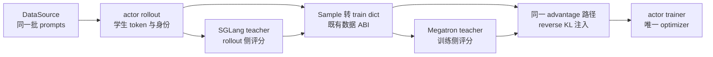
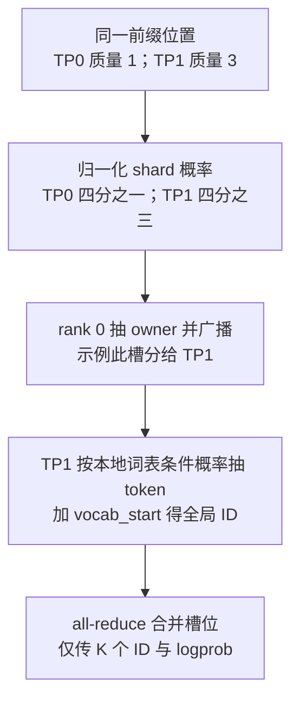

# slime On-Policy 蒸馏：让固定 teacher 加入同一条在线策略训练闭环

> **源码基线**：`THUDM/slime@681b3adca54105d5ecd3fb822fa0dc58a427e0f9`（`main`，2026-08-12）
> **主题**：解释训练内 teacher、SGLang 外部评分以及独立 Megatron teacher server 的接口边界，跟踪逐 token 信号进入 advantage 的路径。
> **适用范围**：现成 OPD 接入与 teacher server；多模态输入归多模态页，训练角色切换归训练后端页。
> **最近更新**：2026-09-10。核实 converter 判定，补 teacher server、配置示例及基线后温度变更。

OPD 的系统难题不是“再部署一个 teacher”，而是让 teacher 对 actor 刚采出的同一 prefix、同一 action 给出逐 token 信号，同时不复制 prompt 管道、rollout 身份、DP schedule、Megatron trainer 和 optimizer 生命周期。slime 把 teacher 设计成一个只读评分角色：SGLang teacher 在 rollout 侧把 selected-token logprob 写进 `Sample`，Megatron teacher 在 actor worker 内复用同一批 train data 做额外前向；两条现成 OPD 路径最终都只向既有训练 ABI 增加 `teacher_log_probs`，再把 sampled reverse-KL 注入基础 advantage。代价是 teacher 延迟或 CPU↔GPU 角色切换进入关键路径，而且“同 token、同 span、固定 teacher”主要靠配置和数据对齐守住，而不是一套完整的版本握手协议。

本文只负责 OPD 的接入动机、teacher placement、信号流和版本边界。通用 `Sample`/converter 语义归 [[12_slime_sample_datasource_analysis]]，Megatron 角色切换与训练执行归 [[14_slime_megatron_training_analysis]]，reducer 与并行归一化归 [[15_slime_loss_parallelism_analysis]]。带 fixed-commit 定位符的是源码、官方文档、示例或测试事实；标为“设计分析”的段落是从实现与失败路径作出的推断。

## 1. 根本矛盾：teacher 必须评价学生访问到的状态，却不应拥有第二套数据系统

本基线的 `--opd-type` 仍只有 `sglang`、`megatron` 两个值。仓内另有独立 Megatron teacher server，但其响应尚未直接接到现成 OPD helper；它是第三种部署形态，不是第三个 CLI 枚举。

OPD 训练的是学生自己生成的 response：在学生访问到的历史 $h_t$ 上，teacher 只评价学生实际采到的 token $a_t$，并不生成另一条轨迹。官方定义明确把学生放在 reverse-KL 的第一项，期望也取在学生分布上。[`docs/en/advanced/on-policy-distillation.md:17-32`](https://github.com/THUDM/slime/blob/681b3adca54105d5ecd3fb822fa0dc58a427e0f9/docs/en/advanced/on-policy-distillation.md#L17-L32)

因此系统要同时守住四个不变量：

| 不变量 | 必须成立的关系 | 若破坏会怎样 |
|---|---|---|
| on-policy 状态 | prefix 来自 actor rollout，而不是 teacher 数据集 | teacher 信号优化的是另一种状态分布 |
| action join | student/teacher logprob 指向同一个 token id 和 response 位置 | 差值不再是任何 KL 的 Monte Carlo 项 |
| 单一训练所有权 | 只有 actor 拥有 policy optimizer；teacher 只前向 | 第二个 trainer 会引入重复 schedule、更新和 checkpoint 语义 |
| 版本边界 | actor rollout 版本可识别，teacher 在实验中保持固定 | 信号变化无法区分来自学生更新还是 teacher 漂移 |

slime 的接入点正好落在已有边界上：`Sample` 本来就保存 rollout token 与可选行为字段，固定基线只新增一个 response-aligned 的 `teacher_log_probs` 字段；默认 converter 又把它作为条件字段送进既有 train dict。[`slime/utils/types.py:93-128`](https://github.com/THUDM/slime/blob/681b3adca54105d5ecd3fb822fa0dc58a427e0f9/slime/utils/types.py#L93-L128) `slime/ray/rollout.py::RolloutManager._convert_samples_to_train_data`



> **设计分析**：这里的“teacher 是角色”不是说两种 teacher 都是同一种进程，而是说它们都只拥有一个职责——为已经确定身份的 student action 生产 logprob。数据取得、step 切分、loss mask、optimizer 和权重发布仍由原闭环所有者负责；teacher 不建立平行的 `DataSource → scheduler → trainer`。

## 2. 为什么不选四个直观替代方案

下表是基于上述不变量的设计分析，不是项目文档声称做过的对比实验：

| 替代方案 | 表面收益 | 与 OPD 目标的冲突 | slime 当前选择 |
|---|---|---|---|
| offline distillation | teacher 先生成语料，学生按 SFT 训练，系统简单 | 状态与 action 都来自 teacher/静态语料，不是当前 actor 的访问分布 | actor 生成，teacher 只重评分 |
| 独立 teacher dataset/ETL | 可离线批量算 teacher logits | 需要用 token、样本和版本重新 join 两条数据流；actor 更新后离线信号迅速变旧 | logprob 附着在当前 `Sample` 或当前 train batch |
| reward-only teacher | 只传每条 response 一个 scalar，带宽小 | 丢掉逐 token“teacher 对实际 action 的相对偏好”，不能构造 sampled reverse-KL | 保留 response-aligned selected-token logprob |
| 单独 teacher trainer | 角色边界看似清晰 | 复制 DP/PP schedule、batch packing、模型输入变换与生命周期，却没有 teacher optimizer 工作 | 外部 scorer 或 actor 内只读 tag |

这种选择也解释了为什么 slime 不传 teacher 的全词表 logits：SGLang helper 请求输入 token 的 logprob，Megatron forward 也只收集目标 token 的 response logprob；训练目标需要的是学生采样 action 的 Monte Carlo 项，而不是第二份 $T\times V$ 分布张量。[`slime/rollout/on_policy_distillation.py:8-29`](https://github.com/THUDM/slime/blob/681b3adca54105d5ecd3fb822fa0dc58a427e0f9/slime/rollout/on_policy_distillation.py#L8-L29) [`slime/backends/megatron_utils/loss.py:513-544`](https://github.com/THUDM/slime/blob/681b3adca54105d5ecd3fb822fa0dc58a427e0f9/slime/backends/megatron_utils/loss.py#L513-L544)

## 3. 角色状态归属：actor 更新，ref 可刷新，teacher 只读

固定基线创建 actor group 时，只有 `opd_type=megatron` 才把 `with_opd_teacher=True` 传给现有 actor `RayTrainGroup`；它没有额外申请 teacher placement group，也没有创建第二个 Ray train group。[`slime/ray/placement_group.py:140-183`](https://github.com/THUDM/slime/blob/681b3adca54105d5ecd3fb822fa0dc58a427e0f9/slime/ray/placement_group.py#L140-L183) worker 初始化仍只有一套 Megatron model、optimizer 与 scheduler，ref 和 teacher checkpoint 被加载成同一 model 槽位的备份 tag。[`slime/backends/megatron_utils/actor.py:95-136`](https://github.com/THUDM/slime/blob/681b3adca54105d5ecd3fb822fa0dc58a427e0f9/slime/backends/megatron_utils/actor.py#L95-L136)

| 角色 | 运行位置与所持状态 | 是否更新 | 是否发布到 rollout 侧 |
|---|---|---|---|
| actor | actor worker 的当前 Megatron model，拥有 optimizer | 每个有效 train step 更新 | 是，weight updater 明确读取 `actor` tag。[`slime/backends/megatron_utils/actor.py:151-182`](https://github.com/THUDM/slime/blob/681b3adca54105d5ecd3fb822fa0dc58a427e0f9/slime/backends/megatron_utils/actor.py#L151-L182) |
| ref | actor worker 内只读参数 tag | 可由 `ref_update_interval` 周期性覆盖 | 否；只用于比较前向。[`slime/backends/megatron_utils/actor.py:550-562`](https://github.com/THUDM/slime/blob/681b3adca54105d5ecd3fb822fa0dc58a427e0f9/slime/backends/megatron_utils/actor.py#L550-L562) |
| Megatron teacher | actor worker 内只读参数 tag | 固定基线训练后只备份 actor、可选刷新 ref，没有覆盖 teacher tag | 否；只在 advantage 前做额外前向。[`slime/backends/megatron_utils/actor.py:447-460`](https://github.com/THUDM/slime/blob/681b3adca54105d5ecd3fb822fa0dc58a427e0f9/slime/backends/megatron_utils/actor.py#L447-L460) [`slime/backends/megatron_utils/actor.py:550-562`](https://github.com/THUDM/slime/blob/681b3adca54105d5ecd3fb822fa0dc58a427e0f9/slime/backends/megatron_utils/actor.py#L550-L562) |
| SGLang teacher | slime/Ray 训练资源之外的 HTTP server | slime 不拥有其 optimizer 或更新协议 | 否；只返回 logprob。E2E 测试把 teacher GPU 从训练 GPUs 中单独划出。[`tests/test_qwen2.5_0.5B_opd_sglang.py:23-88`](https://github.com/THUDM/slime/blob/681b3adca54105d5ecd3fb822fa0dc58a427e0f9/tests/test_qwen2.5_0.5B_opd_sglang.py#L23-L88) |

Megatron teacher 的“加载进训练”也不是多驻留一份 GPU model：`TensorBackuper` 为每个 tag 建 pinned CPU 参数副本，restore 时把该 tag 拷回当前 model 参数；teacher checkpoint 加载显式关闭 optimizer/RNG 恢复，加载后才备份为 `teacher`。[`slime/utils/tensor_backper.py:42-74`](https://github.com/THUDM/slime/blob/681b3adca54105d5ecd3fb822fa0dc58a427e0f9/slime/utils/tensor_backper.py#L42-L74) [`slime/backends/megatron_utils/actor.py:655-689`](https://github.com/THUDM/slime/blob/681b3adca54105d5ecd3fb822fa0dc58a427e0f9/slime/backends/megatron_utils/actor.py#L655-L689)

> **设计分析**：这是一种“共享 GPU 执行槽、分离 CPU 参数所有权”的角色复用。它避免 teacher 常驻第二份训练显存，但每轮 teacher forward 前后都有 CPU↔GPU 参数切换，并为完整 teacher tag 消耗 host pinned memory。角色切换、offload 和 Megatron-native 执行的通用机制由 [[14_slime_megatron_training_analysis]] 负责。

## 4. SGLang teacher：在 rollout 侧计算结果，再随 Sample 传给训练器

学生生成结束后，标准 rollout reward hook 会对尚未有 reward 的 Sample 调用 `async_rm`；若配置 `custom_rm_path`，它动态加载 OPD `reward_func`，把返回 JSON 暂存在 `sample.reward`。[`slime/rollout/sglang_rollout.py:250-289`](https://github.com/THUDM/slime/blob/681b3adca54105d5ecd3fb822fa0dc58a427e0f9/slime/rollout/sglang_rollout.py#L250-L289) [`slime/rollout/rm_hub/__init__.py:55-64`](https://github.com/THUDM/slime/blob/681b3adca54105d5ecd3fb822fa0dc58a427e0f9/slime/rollout/rm_hub/__init__.py#L55-L64)

OPD helper 发送完整 `sample.tokens`，在本基线固定发送 `temperature=0`，并设置 `max_new_tokens=0`、`return_logprob=True` 和 `logprob_start_len=0`；多模态 Sample 还会把 image data 一起编码发送。因此外部 teacher 是 prefill scorer，不是第二个 generator。[`slime/rollout/on_policy_distillation.py:8-29`](https://github.com/THUDM/slime/blob/681b3adca54105d5ecd3fb822fa0dc58a427e0f9/slime/rollout/on_policy_distillation.py#L8-L29)

RolloutManager 转换训练数据前调用自定义 reward postprocess。它丢掉 SGLang 输入 logprob 的第一个无前驱位置，从尾部裁出每条 response span，写入 `sample.teacher_log_probs`，并为“纯蒸馏”返回全零 scalar reward；若要 RL+OPD，源码注释要求用户在此合入任务 reward。[`slime/rollout/on_policy_distillation.py:32-67`](https://github.com/THUDM/slime/blob/681b3adca54105d5ecd3fb822fa0dc58a427e0f9/slime/rollout/on_policy_distillation.py#L32-L67)

之后不再有 OPD 专用 transport：converter 把字段放进 train dict，DP partition 像处理 token/mask 一样选择本 rank 的条目，再转成 contiguous CPU `float32` tensor，通过 Ray object store 或 NIXL 送到 actor；actor 搬到 GPU 时按相同 response span 做 CP slice。[`slime/ray/rollout.py:41-85`](https://github.com/THUDM/slime/blob/681b3adca54105d5ecd3fb822fa0dc58a427e0f9/slime/ray/rollout.py#L41-L85) [`slime/ray/rollout.py:900-935`](https://github.com/THUDM/slime/blob/681b3adca54105d5ecd3fb822fa0dc58a427e0f9/slime/ray/rollout.py#L900-L935) [`slime/backends/megatron_utils/actor.py:283-299`](https://github.com/THUDM/slime/blob/681b3adca54105d5ecd3fb822fa0dc58a427e0f9/slime/backends/megatron_utils/actor.py#L283-L299)

这条 placement 的收益是 teacher 可使用不同架构并独立部署，只要它能评价学生的 token ids；官方文档因此把“大模型或不同架构 teacher”列为 SGLang 模式的场景，同时明确要求 tokenizer 与 vocabulary 兼容。[`docs/en/advanced/on-policy-distillation.md:43-55`](https://github.com/THUDM/slime/blob/681b3adca54105d5ecd3fb822fa0dc58a427e0f9/docs/en/advanced/on-policy-distillation.md#L43-L55) **由此可推断**，每条 Sample 新增的 teacher prefill/RPC 会让 teacher queue 进入 rollout 长尾；固定 helper 每次新建 `ClientSession`、HTTP 错误直接上抛，没有复用通用 remote-RM 的共享 session 与重试逻辑。[`slime/rollout/on_policy_distillation.py:25-29`](https://github.com/THUDM/slime/blob/681b3adca54105d5ecd3fb822fa0dc58a427e0f9/slime/rollout/on_policy_distillation.py#L25-L29) [`slime/rollout/rm_hub/__init__.py:19-52`](https://github.com/THUDM/slime/blob/681b3adca54105d5ecd3fb822fa0dc58a427e0f9/slime/rollout/rm_hub/__init__.py#L19-L52)

## 5. Megatron teacher：不经 Sample 传输，直接在同一训练批次上补齐字段

Megatron 模式没有在 rollout 阶段生产 `Sample.teacher_log_probs`。actor 收到原有 train data 后构造一次 `DataIterator`，依次切到可选 ref、teacher 和 current/old actor；teacher 调用与 actor/ref 相同的 `compute_log_prob`，只是使用 `teacher_` 前缀把输出写成 `teacher_log_probs`，随后恢复 actor 再计算 advantage。[`slime/backends/megatron_utils/actor.py:424-503`](https://github.com/THUDM/slime/blob/681b3adca54105d5ecd3fb822fa0dc58a427e0f9/slime/backends/megatron_utils/actor.py#L424-L503)

`compute_log_prob` 继续走 Megatron 原生 forward-only pipeline：reset 同一 iterator、切到 eval、使用同一 packed token 输入与 response lengths，只在 PP last stage按 prefix 收集结果。[`slime/backends/megatron_utils/actor.py:360-372`](https://github.com/THUDM/slime/blob/681b3adca54105d5ecd3fb822fa0dc58a427e0f9/slime/backends/megatron_utils/actor.py#L360-L372) [`slime/backends/megatron_utils/model.py:344-376`](https://github.com/THUDM/slime/blob/681b3adca54105d5ecd3fb822fa0dc58a427e0f9/slime/backends/megatron_utils/model.py#L344-L376) [`slime/backends/megatron_utils/model.py:447-505`](https://github.com/THUDM/slime/blob/681b3adca54105d5ecd3fb822fa0dc58a427e0f9/slime/backends/megatron_utils/model.py#L447-L505)

所以两种模式的统一契约不是“teacher 必须写 Sample”，而是 advantage 计算前 train dict 必须存在 response-aligned `teacher_log_probs`：

| 路径 | 生产位置 | 中间载体 | 汇合位置 |
|---|---|---|---|
| SGLang teacher | rollout reward 阶段 | `Sample.teacher_log_probs` → CPU train dict → Ray/NIXL | actor 的 `rollout_data` |
| Megatron teacher | actor advantage 前的 forward-only 阶段 | 同一 `DataIterator` 的 `teacher_log_probs` | actor 的 `rollout_data` |

> **设计分析**：SGLang 选择“远端模型自由度”，把 teacher prefill 和 logprob 运输放到 rollout 关键路径；Megatron 选择“输入与并行路径同构”，以同架构 checkpoint、host memory、参数 restore 和额外 pipeline forward 为代价。两者都没有再实现一遍 Sample identity、DP split 或 optimizer loop。

### 5.1 训练内 teacher 的最小配置

下面摘取 `examples/on_policy_distillation/run-qwen3-8B-opd-megatron.sh` 的 OPD 参数；模型结构、数据路径及并行参数仍需沿用该脚本并换成本地路径。

```bash
--advantage-estimator grpo
--use-opd
--opd-type megatron
--opd-kl-coef 1.0
--opd-teacher-load /root/Qwen3-8B_torch_dist
```

这个示例把原始 Qwen3-8B checkpoint 当 teacher 演示自蒸馏；它不会启动独立 HTTP teacher server。中文文档 `docs/zh/advanced/on-policy-distillation.md` 的“两种教师模式”也指两条现成 OPD 接入路径。

### 5.2 第三种部署形态：独立 Megatron teacher server

如果希望 teacher 使用 Megatron 的 TP/PP/CP 前向而独立占用资源，仓内 `server/megatron_server.py::launch` 会创建 `SampleManager` 与一组 `TeacherLogpRayActor`。配置器强制 `debug_train_only=True`、`use_opd=False`、`use_critic=False`，并用 `only_train_params_name_list=["nothing_to_train"]` 冻结参数；这是复用训练初始化与 forward-only 能力的只读评分组，没有执行学生 optimizer 的训练循环。

一个具体请求 `input_ids=[10,20,30]` 有两个有前驱的位置，对应为 token 20 和 30 评分。HTTP `/generate` 将它变成 response length 为 2、loss mask 为 `[1,1]` 的单条训练数据；`SampleManager.submit` 排入 pending，按 DP worker 取走后进入 inflight。每个 DP worker 向本组 ranks 提交 `compute_logp`，最多保留 `pp_size+1` 个在途 batch；完成后合并 PP/CP/TP 输出并写回结果，HTTP 通过 `get_result` 取走结果后返回。完成前 HTTP 会轮询；任务取消会标记 request，已在计算的结果完成后丢弃，不等于撤销 GPU forward。

| 请求字段 | 返回字段和形状 | 含义 |
|---|---|---|
| `input_ids`，长度 T | `request_id`、`log_probs`，长度 T−1 | 对输入中后 T−1 个 token 评分，无首个无前驱占位项 |
| `sample_n=K`，默认 0 | 可选 `sampled_token_ids` / `sampled_log_probs`，T−1 × K | 在每个已有前缀处分布采样 K 个候选，不是自回归生成 K 步 |
| `label_token_ids`，T−1 × M | 可选 `label_token_log_probs`，T−1 × M | 对每个位置显式列出的 M 个候选评分 |

`TeacherLogpRayActor.compute_logp` 在有采样或候选评分请求时选择 `_get_log_probs_and_optional_samples`，否则调用已有 `compute_log_prob`。输出只由 PP 末段、CP/TP rank 0 提供；其余 ranks 参与前向或通信。**设计分析**：这使外部服务不必 materialize 每个位置的完整词表再传回客户端，但增加了独立 teacher 资源、排队和接口适配成本。

采样也不 all-gather 完整词表。`sample_from_vocab_parallel_logits_without_full_gather` 先以全局 max/sum 计算各 TP shard 的概率质量，TP rank 0 据此抽“由哪个 shard 提供候选”，再由 owner 从本地词表抽样并通过 all-reduce 合并 token id/logprob。下图用同一位置、两个 shard 的示意质量 1 和 3 说明为什么不能把两个 shard 当作等概率来源；这些是解释输入，不是性能测量。



图中先选 shard、再选 shard 内 token，两级概率相乘恢复该 token 的全局概率；直接均匀选 shard 会改变采样分布。`get_label_token_log_probs_from_vocab_parallel_logits` 则收集指定 token 的 logits，再减去全局归一化项，两者均按 reduction chunk 控制临时计算量。

### 5.3 teacher server 的配置与更新边界

| 参数 | 基线默认值 | 约束或用途 |
|---|---|---|
| `--teacher-port` / `--teacher-warmup-port` | 7999 / 7999 | HTTP 服务与私有 warmup 端口；环境变量可覆盖默认值 |
| `--teacher-warmup-timeout-s` | 3000 | warmup 超时，必须为正 |
| `--teacher-sample-reduction-chunk-size` / `--teacher-label-reduction-chunk-size` | 4096 / 4096 | TP reduction 的行分块，必须为正 |
| `--megatron-server-max-length` | 0 | 0 关闭长度限制；超限 `/generate` 返回 413 |
| `--megatron-server-update-timeout-s` | 3600 | 等待 queued/inflight 清空的超时，必须为正 |
| `--megatron-server-warmup` / `--no-megatron-server-warmup` | 开启 | serving 前私有 HTTP warmup |

上述 8 个配置字段全部来自 `server/arguments.py::add_megatron_server_arguments`，不是统一以 `--megatron-server-*` 命名。其余模型与并行参数仍由通用解析器负责。

`/update_weights_from_disk` 接收 `model_path`（也兼容 `path`/`load`）。HTTP 层设更新状态，拒绝新生成（503），等待 pending 与 inflight 均为 0，再向所有 teacher ranks 调用 `update_from_disk`；该方法通过 `load_other_checkpoint("actor", model_path)` 换入 teacher 组当前模型。所有 ranks 返回后才更新服务侧 `args.load/ref_load`，解除更新状态。相同路径已经载入时跳过；同路径在途请求合并到同一 future，不同路径并发更新返回 409；等待排空超时返回 503，加载异常返回 500。源码没有实现失败后恢复整组旧参数的回滚，不能把返回错误当成旧 teacher 必然完整可用。

服务还暴露 `/healthz`、`/detect`、`/info`、`/get_loads`；其中 `/healthz` 只返回 HTTP 层存活，不证明每个模型 rank 可成功前向。`/generate` 对候选矩阵长度与行宽做检查，对空 token 等提交异常返回错误。

> [!important] 与现成 OPD helper 的边界
> `on_policy_distillation.post_process_rewards` 读取 `meta_info.input_token_logprobs` 并丢首项；Megatron server 已直接返回长度 T−1 的 `log_probs`。因此不能只把 `rm_url` 改指这个 server，也不能再次照搬“丢首项”。需要自定义 reward/postprocess 适配响应并按 response span 裁剪，填入 `teacher_log_probs`；tokenizer、温度、teacher checkpoint 固定等约束仍需满足。该适配是接入工作，本基线没有在此 helper 内自动完成。

源码阅读路线：`server/arguments.py::{add_megatron_server_arguments,configure_megatron_server_args,validate_megatron_server_args}` → `server/megatron_server.py::{launch,_build_http_app,SampleManager,run_megatron_dp_models_loop_worker}` → `server/logprob_utils.py::TeacherLogpRayActor.compute_logp` → `sample_from_vocab_parallel_logits_without_full_gather` / `get_label_token_log_probs_from_vocab_parallel_logits`。以上 `server/` 均相对 `slime/backends/megatron_utils/`；协议失败边界位于 `_build_http_app`，接口对照位于 `slime/rollout/on_policy_distillation.py::post_process_rewards`。

## 6. reverse-KL 如何变成 actor 的目标

对学生 rollout 上的 $a_t\sim\pi_\theta(\cdot\mid h_t)$，reverse-KL 为：

$$
D_{\mathrm{KL}}\!\left(\pi_\theta(\cdot\mid h_t)\,\middle\|\,\pi_T(\cdot\mid h_t)\right)
=\mathbb{E}_{a_t\sim\pi_\theta(\cdot\mid h_t)}
\left[\log\pi_\theta(a_t\mid h_t)-\log\pi_T(a_t\mid h_t)\right].
$$

slime 不枚举词表，而对实际采样 token 使用：

$$
\begin{aligned}
\widehat d_t
&=\log\pi_\theta(a_t\mid h_t)-\log\pi_T(a_t\mid h_t), \\
\widehat A_t^{\mathrm{OPD}}
&=A_t-\lambda_{\mathrm{OPD}}\widehat d_t.
\end{aligned}
$$

实现先按配置完成 GRPO、PPO、GSPO、CISPO 或 REINFORCE++ 等基础 advantage，再逐 sample 计算 student-teacher logprob 差并原地修改 advantage；`opd_reverse_kl` 只作为日志字段保存。[`slime/backends/megatron_utils/loss.py:663-701`](https://github.com/THUDM/slime/blob/681b3adca54105d5ecd3fb822fa0dc58a427e0f9/slime/backends/megatron_utils/loss.py#L663-L701) 调用顺序明确发生在 estimator 分支之后、可选 advantage normalization 之前。[`slime/backends/megatron_utils/loss.py:783-820`](https://github.com/THUDM/slime/blob/681b3adca54105d5ecd3fb822fa0dc58a427e0f9/slime/backends/megatron_utils/loss.py#L783-L820)

这说明固定实现的目标接点是**修改既有 policy objective 消费的 token advantage**，不是在最终 scalar loss 旁再加一个独立 KL loss。OPD 开启时，actor 也明确禁止复用“训练 forward 顺便得到的 logprob”优化分支，并在 advantage 前拿到 current student logprob，保证 sampled reverse-KL 有 student 项。[`slime/backends/megatron_utils/actor.py:461-487`](https://github.com/THUDM/slime/blob/681b3adca54105d5ecd3fb822fa0dc58a427e0f9/slime/backends/megatron_utils/actor.py#L461-L487)

两个语义边界需要分开：单个 $\widehat d_t$ 可以为负，非负的是对完整学生分布取期望的 KL；而“纯蒸馏”也不是绕过 RL trainer，示例 helper 只是把任务 reward 置零，让同一 estimator/advantage/policy-loss 路径只剩 teacher 信号。官方文档对这两点都有明确说明。[`docs/en/advanced/on-policy-distillation.md:28-41`](https://github.com/THUDM/slime/blob/681b3adca54105d5ecd3fb822fa0dc58a427e0f9/docs/en/advanced/on-policy-distillation.md#L28-L41)

## 7. 数据、token 与版本对齐：OPD 正确性的真正薄弱处

### 7.1 SGLang teacher 必须与学生共享 token 语义

helper 直接发送学生 token ids，并只读取 SGLang 返回条目的 logprob 数值；它不比较返回 token id，也没有在 postprocess 处显式断言裁剪前后的长度。[`slime/rollout/on_policy_distillation.py:8-19`](https://github.com/THUDM/slime/blob/681b3adca54105d5ecd3fb822fa0dc58a427e0f9/slime/rollout/on_policy_distillation.py#L8-L19) [`slime/rollout/on_policy_distillation.py:48-59`](https://github.com/THUDM/slime/blob/681b3adca54105d5ecd3fb822fa0dc58a427e0f9/slime/rollout/on_policy_distillation.py#L48-L59) 真正的 response-length 断言到 actor 做 CP slice 才发生。[`slime/backends/megatron_utils/cp_utils.py:320-344`](https://github.com/THUDM/slime/blob/681b3adca54105d5ecd3fb822fa0dc58a427e0f9/slime/backends/megatron_utils/cp_utils.py#L320-L344)

> **设计分析**：因此“同架构不是必须”不能误读成“任意 tokenizer 都可用”。只要词表索引、special token 或多模态 token 展开不一致，teacher 就在评价另一组符号；长度碰巧相同也可能静默地产生错误信号。启动前应以固定 Sample 对账 token ids 与逐位置 logprob，而不是只等长度断言。

### 7.2 actor 有版本记录，teacher 没有端到端版本握手

`Sample.weight_versions` 记录 rollout engine 返回的 actor 版本，并允许 partial response 累积多个版本；`teacher_log_probs` 只是数值数组，没有对应的 teacher checkpoint/version 字段。[`slime/utils/types.py:114-128`](https://github.com/THUDM/slime/blob/681b3adca54105d5ecd3fb822fa0dc58a427e0f9/slime/utils/types.py#L114-L128) Megatron teacher 由一次 checkpoint load 固定，SGLang teacher 则是 slime 不拥有的外部服务；项目文档把 teacher 定义为 fixed teacher，但 SGLang helper 的请求/响应没有携带或校验 teacher version。[`docs/en/advanced/on-policy-distillation.md:1-3`](https://github.com/THUDM/slime/blob/681b3adca54105d5ecd3fb822fa0dc58a427e0f9/docs/en/advanced/on-policy-distillation.md#L1-L3) [`slime/rollout/on_policy_distillation.py:8-29`](https://github.com/THUDM/slime/blob/681b3adca54105d5ecd3fb822fa0dc58a427e0f9/slime/rollout/on_policy_distillation.py#L8-L29)

> **设计分析**：实验必须把 external teacher 的 checkpoint/version 当部署不变量；若热更新 server，slime 当前数据面无法证明一个 batch 内的 teacher logprob 来自同一版本。partial rollout 是否仍严格 on-policy，则继承第 12 页的 actor `weight_versions` 与 `loss_mask` 语义；OPD 本身不会按版本自动屏蔽旧 span。

### 7.3 训练输入接口假设 teacher 字段在整个批次中一致存在

默认 converter 只检查 `samples[0].teacher_log_probs` 是否 `is not None`；空列表也会进入该分支。若首条不是 `None`，就把所有 Sample 的字段整体加入 train dict。tensorize 随后会逐项转 tensor，因此混合“有 teacher/无 teacher”的 batch 不是受支持的稀疏表示。[`slime/ray/rollout.py:854-866`](https://github.com/THUDM/slime/blob/681b3adca54105d5ecd3fb822fa0dc58a427e0f9/slime/ray/rollout.py#L854-L866) [`slime/ray/rollout.py:75-85`](https://github.com/THUDM/slime/blob/681b3adca54105d5ecd3fb822fa0dc58a427e0f9/slime/ray/rollout.py#L75-L85)

> **设计分析**：默认 OPD 是 batch-level capability，不是逐 Sample 可选插件。做 per-source teacher routing 或混合蒸馏时，应让所有参与 OPD 的 Sample 都产出等长字段，或接管 converter/advantage 逻辑并显式定义未蒸馏样本的 mask；不能仅给部分 Sample 动态加属性。

## 8. 配置约束、失败模式与模式选择

参数层要求 `--use-opd` 必须同时给 `--opd-type`；Megatron 模式必须给 teacher checkpoint 路径，SGLang 模式禁止该路径，未开启 OPD 却设置 teacher path 也会报错。[`slime/utils/arguments.py:1780-1810`](https://github.com/THUDM/slime/blob/681b3adca54105d5ecd3fb822fa0dc58a427e0f9/slime/utils/arguments.py#L1780-L1810) Megatron checkpoint 还必须与 policy/ref 使用同架构参数布局；官方文档要求 Megatron `torch_dist` 或 `torch` 格式。[`slime/utils/arguments.py:1147-1156`](https://github.com/THUDM/slime/blob/681b3adca54105d5ecd3fb822fa0dc58a427e0f9/slime/utils/arguments.py#L1147-L1156) [`docs/en/advanced/on-policy-distillation.md:67-86`](https://github.com/THUDM/slime/blob/681b3adca54105d5ecd3fb822fa0dc58a427e0f9/docs/en/advanced/on-policy-distillation.md#L67-L86)

| 症状或条件 | 根因/选择 |
|---|---|
| teacher 架构不同或远大于 student | 选 SGLang；仍必须兼容 token ids，并承担 RPC/prefill 长尾 |
| teacher 与 student 同构，想避免外部 RPC | 选 Megatron；承担 pinned host memory、角色 restore 和额外 pipeline forward |
| `use_opd` 到训练时才报缺 `teacher_log_probs` | SGLang 模式只校验 `opd_teacher_load` 不应存在，并不会校验 OPD custom RM、postprocess 与 `rm_url` 是否配齐；loss 侧缺字段才抛错。[`slime/utils/arguments.py:1801-1806`](https://github.com/THUDM/slime/blob/681b3adca54105d5ecd3fb822fa0dc58a427e0f9/slime/utils/arguments.py#L1801-L1806) [`slime/backends/megatron_utils/loss.py:684-701`](https://github.com/THUDM/slime/blob/681b3adca54105d5ecd3fb822fa0dc58a427e0f9/slime/backends/megatron_utils/loss.py#L684-L701) |
| 纯蒸馏却没有梯度或 advantage 异常 | 确认仍启用默认 advantage 计算；OPD 注入位于该函数内部，而 CLI 允许整体关闭它。[`slime/utils/arguments.py:958-965`](https://github.com/THUDM/slime/blob/681b3adca54105d5ecd3fb822fa0dc58a427e0f9/slime/utils/arguments.py#L958-L965) [`slime/backends/megatron_utils/actor.py:433-503`](https://github.com/THUDM/slime/blob/681b3adca54105d5ecd3fb822fa0dc58a427e0f9/slime/backends/megatron_utils/actor.py#L433-L503) |
| OPD 把 task reward 意外清零 | 示例 postprocess 就是纯蒸馏实现；RL+OPD 必须自定义合入真实 reward。[`slime/rollout/on_policy_distillation.py:61-67`](https://github.com/THUDM/slime/blob/681b3adca54105d5ecd3fb822fa0dc58a427e0f9/slime/rollout/on_policy_distillation.py#L61-L67) |
| 系数方向异常 | parser 接受任意 `float`，没有强制 $\lambda_{\mathrm{OPD}}\ge 0$；负值会把 penalty 变成鼓励偏离 teacher。[`slime/utils/arguments.py:1140-1145`](https://github.com/THUDM/slime/blob/681b3adca54105d5ecd3fb822fa0dc58a427e0f9/slime/utils/arguments.py#L1140-L1145) |

官方 SGLang 示例完整配置了 `custom-rm-path`、`custom-reward-post-process-path` 与 teacher `/generate` URL；E2E 测试也用同一组三件套验证实际路径，而不只是设置 `--use-opd`。[`examples/on_policy_distillation/run-qwen3-8B-opd.sh:58-77`](https://github.com/THUDM/slime/blob/681b3adca54105d5ecd3fb822fa0dc58a427e0f9/examples/on_policy_distillation/run-qwen3-8B-opd.sh#L58-L77) [`tests/test_qwen2.5_0.5B_opd_sglang.py:126-143`](https://github.com/THUDM/slime/blob/681b3adca54105d5ecd3fb822fa0dc58a427e0f9/tests/test_qwen2.5_0.5B_opd_sglang.py#L126-L143)

## 9. 最小验收清单

1. 固定一条 Sample，逐位置核对 student token id、teacher 返回 token id、response span 与两侧 logprob 长度。
2. 记录 actor rollout `weight_versions`，并把 external teacher checkpoint/version 固定到实验配置与日志。
3. 对比 task reward only、zero-reward OPD、RL+OPD 三条曲线，避免把示例的全零 reward 当成混合目标。
4. SGLang 模式分别观测 teacher queue/prefill/RPC 长尾；Megatron 模式观测额外 forward、host pinned memory 与 restore 时间。
5. 对 $\lambda_{\mathrm{OPD}}$ 从小值开始 sweep，同时观察基础 advantage、`opd_reverse_kl`、clip fraction 与 gradient norm；reducer 的统计口径见第 15 页。

## 10. 基线后已知变更

提交 `1da1bb19e96adb1be4ff4b40d08a23b4b6ce3692` 将 SGLang teacher helper 的 `sampling_params.temperature` 从 0 改为 `args.rollout_temperature`。这是本页基线之后的修正；第 4 节仍描述冻结基线的 payload，不据此把整页升级到新版本。

## Related Pages

- [[12_slime_sample_datasource_analysis]] — `teacher_log_probs` 所复用的 Sample、train dict、partial span 与 transport 契约。
- [[14_slime_megatron_training_analysis]] — actor/ref/teacher 参数 tag、DataIterator、forward-only 与 optimizer 的权威机制页。
- [[15_slime_loss_parallelism_analysis]] — OPD 修改后的 token advantage 如何进入 objective，并在 DP/CP/PP 下保持统计口径。
- [[16_slime_weight_sync_analysis]] — 只有 actor 参数为何进入 rollout 权重提交协议，teacher 为何不应被同步。
- [[17_slime_train_inference_consistency_analysis]] — token、temperature、routing、kernel 与版本对齐如何影响 student/teacher logprob 的可比性。
- [[31_slime_posttraining_stability_analysis]] — OPD 系数、advantage 尺度、梯度与观测指标如何进入稳定性诊断。
