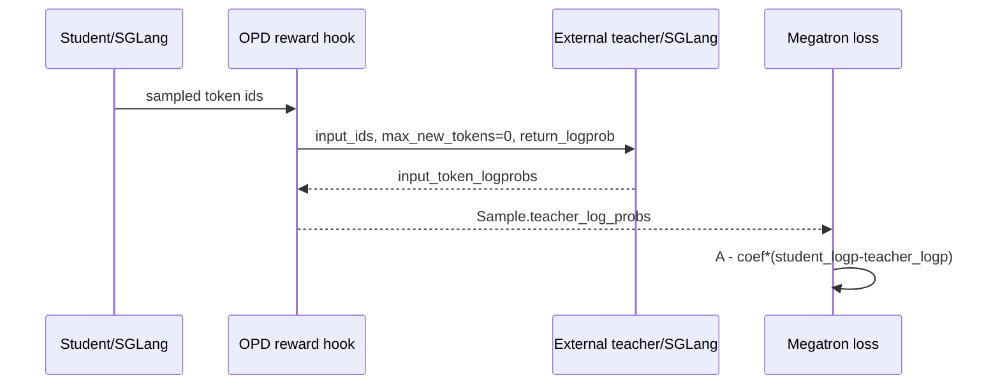

# slime 在策略蒸馏（OPD）实现分析

> **定位**：slime 段 1 实现机制 · On-Policy Distillation
> **源码基线**：`THUDM/slime@681b3adca54105d5ecd3fb822fa0dc58a427e0f9`
> **系列入口**：[[slime/index]]

## 1. 中心结论

slime 的 OPD 不是让 teacher 生成另一批轨迹，而是让**学生当前策略生成 token，固定 teacher 对同一前缀、同一 token 重新评分**，然后把采样得到的 reverse-KL 贡献直接减进基础 advantage。它因此可叠加在 GRPO、PPO、GSPO、REINFORCE++ 等 estimator 上；任务 reward 为零时就是纯蒸馏，非零时则是 RL + teacher regularization。[`on-policy-distillation.md:15-41`](https://github.com/THUDM/slime/blob/681b3adca54105d5ecd3fb822fa0dc58a427e0f9/docs/zh/advanced/on-policy-distillation.md#L15-L41)

两种 teacher mode 共享下游 `teacher_log_probs → advantage` 契约，但在不同阶段产生 logprob：SGLang teacher 在 rollout 阶段远程打分；Megatron teacher 在训练前向阶段本地打分。[`arguments.py:1120-1157`](https://github.com/THUDM/slime/blob/681b3adca54105d5ecd3fb822fa0dc58a427e0f9/slime/utils/arguments.py#L1120-L1157)

## 2. 数学对象与代码对象

对学生采样的 $a_t \sim \pi_\theta(\cdot|h_t)$，实现使用单 token Monte Carlo 贡献：

$$
\hat d_t = \log \pi_\theta(a_t|h_t)-\log \pi_T(a_t|h_t),
\qquad
\hat A_t=A_t-\lambda_{opd}\hat d_t.
$$

`apply_opd_kl_to_advantages` 逐 sample 取 student/teacher logprob，计算 `reverse_kl` 并原地修改 advantages，同时保留 `opd_reverse_kl` 用于日志。[`loss.py:663-701`](https://github.com/THUDM/slime/blob/681b3adca54105d5ecd3fb822fa0dc58a427e0f9/slime/backends/megatron_utils/loss.py#L663-L701)

这里有两个容易误读的点：

1. 单个采样 token 的 `student_logp - teacher_logp` 可以为负；只有对学生分布取完整期望的 KL 才非负。
2. teacher 差值不是独立加到最终 scalar loss，而是在基础 estimator 之后改 advantage；代码先完成 GRPO/PPO 等分支，再调用 OPD。[`loss.py:704-710`](https://github.com/THUDM/slime/blob/681b3adca54105d5ecd3fb822fa0dc58a427e0f9/slime/backends/megatron_utils/loss.py#L704-L710) [`loss.py:806-816`](https://github.com/THUDM/slime/blob/681b3adca54105d5ecd3fb822fa0dc58a427e0f9/slime/backends/megatron_utils/loss.py#L806-L816)

## 3. SGLang teacher：远程 scorer，而不是第二个 generator

SGLang 模式的 reward helper 把完整 `sample.tokens` 作为 `input_ids` 发送给 teacher，令 `temperature=0`、`max_new_tokens=0`，只请求输入 token logprob；多模态 sample 还会转发 image data。[`on_policy_distillation.py:8-29`](https://github.com/THUDM/slime/blob/681b3adca54105d5ecd3fb822fa0dc58a427e0f9/slime/rollout/on_policy_distillation.py#L8-L29)

后处理从 SGLang `input_token_logprobs` 中提取数值，去掉首个无前驱 token，再按每条 response length 从尾部裁剪，写入 `Sample.teacher_log_probs`。默认返回全零 task reward，蒸馏信号完全来自随后 advantage 修正。[`on_policy_distillation.py:32-67`](https://github.com/THUDM/slime/blob/681b3adca54105d5ecd3fb822fa0dc58a427e0f9/slime/rollout/on_policy_distillation.py#L32-L67)

该模式允许 teacher 与 student 架构不同、资源独立扩缩，但 token id 是直接传递的，所以 tokenizer、special-token 语义和词表索引必须兼容。官方文档也把这一点列为前提。[`on-policy-distillation.md:43-65`](https://github.com/THUDM/slime/blob/681b3adca54105d5ecd3fb822fa0dc58a427e0f9/docs/zh/advanced/on-policy-distillation.md#L43-L65)

## 4. Megatron teacher：同训练 runtime 内切换冻结权重

Megatron 模式初始化时把 teacher checkpoint 加载进 weights backuper；训练准备阶段切换到 teacher，复用 `compute_log_prob` 并以 `teacher_` 前缀写回 batch，然后切回 old actor 或 actor。[`actor.py:130-143`](https://github.com/THUDM/slime/blob/681b3adca54105d5ecd3fb822fa0dc58a427e0f9/slime/backends/megatron_utils/actor.py#L130-L143) [`actor.py:447-460`](https://github.com/THUDM/slime/blob/681b3adca54105d5ecd3fb822fa0dc58a427e0f9/slime/backends/megatron_utils/actor.py#L447-L460)

这一模式减少远程 RPC 和 token 协议差异，teacher 与训练侧 packing/CP 拓扑共享实现；代价是显存/主存占用更高，checkpoint 必须是兼容的 Megatron 格式和同架构模型。参数校验要求 teacher path 存在，并检查 checkpoint marker；SGLang 模式则明确禁止设置该路径。[`arguments.py:1780-1810`](https://github.com/THUDM/slime/blob/681b3adca54105d5ecd3fb822fa0dc58a427e0f9/slime/utils/arguments.py#L1780-L1810)

## 5. 两种模式如何汇合

| 阶段 | SGLang teacher | Megatron teacher | 统一契约 |
|---|---|---|---|
| 学生轨迹 | rollout actor 生成 | rollout actor 生成 | 同一批 on-policy token |
| teacher 打分 | rollout 阶段 HTTP | train 前向阶段 | response token logprob |
| 数据载体 | `Sample.teacher_log_probs` | batch `teacher_log_probs` | list of token tensors |
| advantage | 训练侧 | 训练侧 | 同一个 `apply_opd_kl_to_advantages` |
| 监控 | RPC/teacher 延迟 + OPD KL | extra forward + OPD KL | `opd_reverse_kl` |

RolloutManager 的 sample→train-data 转换会在字段存在时保留 `teacher_log_probs`。[`rollout.py:850-861`](https://github.com/THUDM/slime/blob/681b3adca54105d5ecd3fb822fa0dc58a427e0f9/slime/ray/rollout.py#L850-L861) 训练日志 reducer 又把它和 `opd_reverse_kl` 纳入 per-sample mean 的全局聚合，避免 DP/CP 分片后简单 rank mean 带来偏差。[`data.py:300-332`](https://github.com/THUDM/slime/blob/681b3adca54105d5ecd3fb822fa0dc58a427e0f9/slime/backends/megatron_utils/data.py#L300-L332)

## 6. 稳定性与训推一致性风险

### 6.1 三组长度必须一致

训练有效 response token 上的 student logprob、teacher logprob 与 loss mask 必须同长。SGLang helper 当前依赖“完整 token 输入后从尾部裁 response”这一假设；自定义模板、截断或多轮 observation 改写若破坏 token 序列，数值即使不报错也会错位。

### 6.2 teacher 不应参与 actor 权重提交

Megatron teacher 是冻结 checkpoint 的临时模型状态，不是 rollout actor。权重同步仍只提交 actor；扩展多模型 SGLang config 时也应保证 teacher/reward model 标为不更新，避免把学生参数误推给 teacher。

### 6.3 `opd_kl_coef` 改变的是 token advantage 尺度

系数过大不只是“loss 多一个 regularizer”，而是可能让大量 token advantage 翻转。应同时观察 task reward、基础 advantage、`opd_reverse_kl`、clip fraction、gradient norm，而不是只看总 loss。

### 6.4 纯蒸馏与混合目标要显式区分

仓库 helper 默认 task reward 为零；若业务需要 RL + OPD，必须在自定义后处理中合并真实 reward，不能直接沿用全零返回而误以为 GRPO reward 仍生效。源码注释也把“有任务 reward 时可在此加入”留给用户实现。[`on_policy_distillation.py:61-67`](https://github.com/THUDM/slime/blob/681b3adca54105d5ecd3fb822fa0dc58a427e0f9/slime/rollout/on_policy_distillation.py#L61-L67)

## 7. 模式选择

| 条件 | 推荐 |
|---|---|
| teacher 与 student 架构/规模不同 | SGLang teacher |
| teacher 很大，需要独立集群 | SGLang teacher |
| 追求最少协议差异、同架构 checkpoint 已有 | Megatron teacher |
| GPU/CPU memory 已非常紧 | 优先外部 teacher |
| teacher RPC 是 rollout 长尾主要来源 | 评估 Megatron teacher 或 teacher 批处理 |
| tokenizer 不能严格兼容 | 两种现成模式都不应直接使用，先设计 token 映射/蒸馏目标 |

## 8. 验收清单

- 在固定 sample 上核对 teacher endpoint 返回的 token id 与 `sample.tokens`；
- 断言 teacher/student logprob、response length、loss mask 同长；
- 记录纯 reward baseline、纯 OPD、混合目标三组曲线；
- 对 `opd_kl_coef` 做小范围 sweep，监控 advantage 符号比例与 grad norm；
- SGLang 模式记录 teacher queue/e2e latency，Megatron 模式记录额外 forward 时间与峰值显存；
- 初始 checkpoint 上分别验证 student/reference、student/teacher 的 logprob 差异是否符合预期。

## 9. 相关页面

- [[14_slime_megatron_training_analysis]]
- [[15_slime_loss_parallelism_analysis]]
- [[17_slime_train_inference_consistency_analysis]]
- [[31_slime_posttraining_stability_analysis]]
