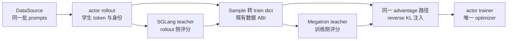
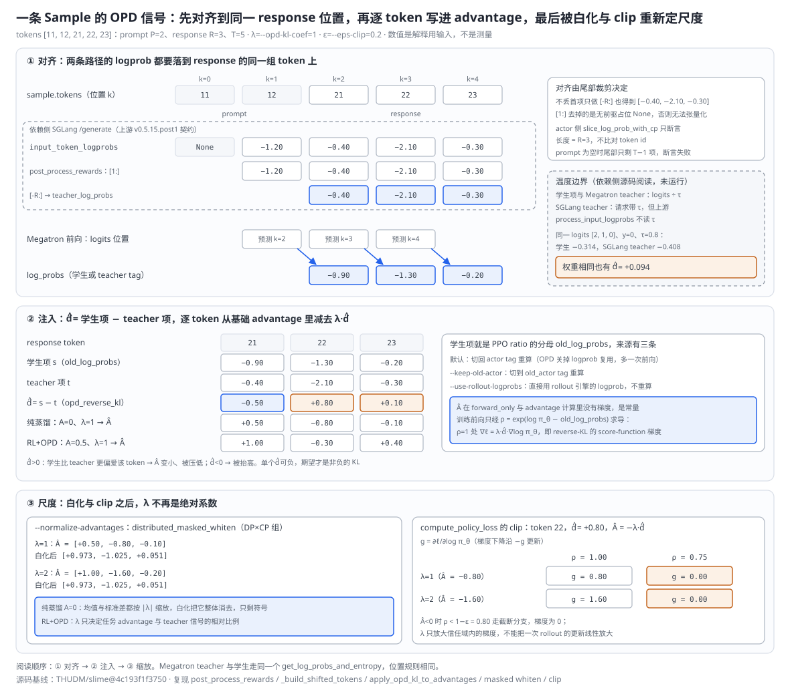
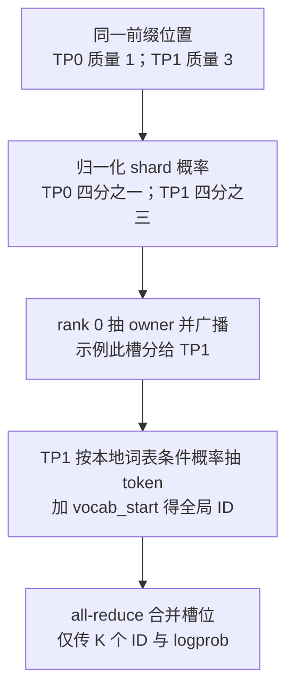

# slime On-Policy 蒸馏：让固定 teacher 加入同一条在线策略训练闭环

> **源码基线**：`THUDM/slime@4c193f1f37509cca70f0e88807a9305b70f63f4e`（`main`，2026-09-03）
> **源码基线**：`NVIDIA/Megatron-LM@1dcf0dafa884ad52ffb243625717a3471643e087`（slime `docker/Dockerfile` 钉定，2026-02-14）
> **源码基线**：`sgl-project/sglang@0b3bb0cbe31873994c9f989fddfe2f87ca839fdd`（`v0.5.15.post1`，2026-07-13）
> **主题**：先讲 teacher 的角色定位，再用一条 Sample 回放 logprob 对齐、逐 token advantage 注入与白化和 clip 的缩放，并推导注入 advantage 与 reverse-KL 梯度的关系。随后展开学生项来源轴、SGLang 与 Megatron 两种 teacher 放置和独立 Megatron teacher server，最后是代码路线、失败边界与配置契约。核心代码在 `slime/rollout/on_policy_distillation.py`、`slime/backends/megatron_utils/{actor,loss}.py` 与 `slime/backends/megatron_utils/server/`。
> **适用范围**：slime 的 OPD 接入、信号计算与 teacher 服务；OPD 的一般理论归后训练理论域，通用 Sample 语义、tag 切换、reducer 与 logprob 一致性分别归 Sample、Megatron 训练、loss 与训推一致性各页。
> **最近更新**：2026-09-17。覆盖 OPD 信号的最小回放与原理图、reverse-KL 梯度推导与备选取舍、学生项来源轴、teacher 温度与支持集边界、`--opd-teacher-ckpt-step` 与独立 teacher server。

## 1. 特性概览

### 1.1 问题：teacher 要评价学生访问到的状态，却不应拥有第二套数据系统

On-policy 蒸馏（OPD）训练的是学生自己生成的 response：在学生访问到的历史 $h_t$ 上，teacher 只评价学生实际采到的 token $a_t$，并不生成另一条轨迹。官方文档把学生放在 reverse-KL 的第一项，期望也取在学生分布上（`docs/en/advanced/on-policy-distillation.md` 的 How It Works 一节）。系统难题因此不是“再部署一个 teacher”，而是让 teacher 对 actor 刚采出的同一 prefix、同一 action 给出逐 token 信号，同时不复制 prompt 管道、rollout 身份、DP schedule、Megatron trainer 和 optimizer 生命周期。OPD 的形式化与它和 KL 约束 RL 的关系见 [[14_on_policy_distillation_analysis|OPD 主线理论页]]，散度方向的演进见 [[15_opd_divergence_and_objective_evolution_analysis|OPD 散度与目标演进]]。

系统要同时守住四个不变量：

| 不变量 | 必须成立的关系 | 若破坏会怎样 |
|---|---|---|
| on-policy 状态 | prefix 来自 actor rollout，而不是 teacher 数据集 | teacher 信号优化的是另一种状态分布 |
| action join | student/teacher logprob 指向同一个 token id 和 response 位置 | 差值不再是任何 KL 的 Monte Carlo 项 |
| 单一训练所有权 | 只有 actor 拥有 policy optimizer；teacher 只前向 | 第二个 trainer 会引入重复 schedule、更新和 checkpoint 语义 |
| 版本边界 | actor rollout 版本可识别，teacher 在实验中保持固定 | 信号变化无法区分来自学生更新还是 teacher 漂移 |

### 1.2 解决方法：只读评分角色 + 注入基础 advantage

slime 把 teacher 设计成一个只读评分角色，接入点落在已有边界上：

- **信号**：对每个 response token 算 $\widehat d_t=\log\pi_{\mathrm{old}}(a_t\mid h_t)-\log\pi_T(a_t\mid h_t)$，在估计器算完基础 advantage 之后原地改成 $\widehat A_t=A_t-\lambda\,\widehat d_t$（$\lambda$ 为 `--opd-kl-coef`）。它不是最终 loss 旁边的第二个 KL 项；为什么这样选见 §2.2。
- **数据 ABI**：两条现成路径最终都只向既有训练字典增加一个 response 对齐的 `teacher_log_probs`。`slime/utils/types.py::Sample` 为它留了字段，默认 converter 把它作为条件字段送进 train dict。
- **teacher 放置**：`--opd-type` 只接受 `sglang` 与 `megatron` 两个值（`slime/utils/arguments.py::add_on_policy_distillation_arguments` 的 `choices`）。SGLang teacher 在 rollout 侧把 selected-token logprob 写进 `Sample`；Megatron teacher 在 actor worker 内复用同一批 train data 做额外前向。仓内另有独立 Megatron teacher server（`slime/backends/megatron_utils/server/`），但其响应没有直接接到现成 OPD helper；它是第三种部署形态，不是第三个 CLI 枚举（§2.5.4）。


```mermaid
flowchart LR
    DS["DataSource<br/>同一批 prompts"] --> RO["actor rollout<br/>学生 token 与身份"]
    RO --> ST["SGLang teacher<br/>rollout 侧评分"]
    RO --> CV["Sample 转 train dict<br/>既有数据 ABI"]
    ST --> CV
    CV --> MT["Megatron teacher<br/>训练侧评分"]
    CV --> AD["同一 advantage 路径<br/>reverse KL 注入"]
    MT --> AD
    AD --> TR["actor trainer<br/>唯一 optimizer"]
```

> **设计分析**：这里的“teacher 是角色”不是说两种 teacher 都是同一种进程，而是说它们都只拥有一个职责——为已经确定身份的 student action 生产 logprob。数据取得、step 切分、loss mask、optimizer 和权重发布仍由原闭环所有者负责；teacher 不建立平行的 `DataSource → scheduler → trainer`。

下表是基于上述不变量的设计分析，不是项目文档声称做过的对比实验：

| 替代方案 | 表面收益 | 与 OPD 目标的冲突 | slime 当前选择 |
|---|---|---|---|
| offline distillation | teacher 先生成语料，学生按 SFT 训练，系统简单 | 状态与 action 都来自 teacher/静态语料，不是当前 actor 的访问分布 | actor 生成，teacher 只重评分 |
| 独立 teacher dataset/ETL | 可离线批量算 teacher logits | 需要用 token、样本和版本重新 join 两条数据流；actor 更新后离线信号迅速变旧 | logprob 附着在当前 `Sample` 或当前 train batch |
| reward-only teacher | 只传每条 response 一个 scalar，带宽小 | 丢掉逐 token“teacher 对实际 action 的相对偏好”，不能构造 sampled reverse-KL | 保留 response 对齐的 selected-token logprob |
| 单独 teacher trainer | 角色边界看似清晰 | 复制 DP/PP schedule、batch packing、模型输入变换与生命周期，却没有 teacher optimizer 工作 | 外部 scorer 或 actor 内只读 tag |

这种选择也解释了为什么 slime 不传 teacher 的全词表 logits：SGLang helper 只请求输入 token 的 logprob，Megatron forward 也只收集目标 token 的 response logprob；训练目标需要的是学生采样 action 的 Monte Carlo 项，而不是第二份 $T\times V$ 分布张量。Megatron-LM 自己的离线 logits 蒸馏走的是另一条“teacher 跑一遍、写稀疏 top-K 缓存”的路，见 [[38_megatron_logits_distillation_analysis|Megatron 离线 logits 蒸馏]]；该页分析的 `megatron/training/distillation/` 由 `277c4f804`（2026-06-12）引入，不在 slime 镜像钉定的 `1dcf0daf` 里，slime OPD 也不调用它。

### 1.3 收益、开销和约束

| 维度 | 直接收益 | 代价或边界 |
|---|---|---|
| 数据面 | 只多一个 `teacher_log_probs` 字段，复用 Sample、DP 切分、CP 切片与 transport | 字段按批次整体存在；混合“有/无 teacher”的批次不受支持（§4.2） |
| 目标 | 注入 advantage，在代码层面对 GRPO、PPO、GSPO、CISPO、REINFORCE++ 以及自定义 advantage 函数都生效 | 白化与 clip 之后 $\lambda$ 不再是绝对系数；GSPO、CISPO 下梯度语义不同（§2.2、§2.3） |
| SGLang teacher | teacher 可异构、可远大于学生，独立部署 | 每条 Sample 一次 teacher prefill/RPC 进入 rollout 长尾；输入 logprob 的温度语义与学生项不同（§2.5.1） |
| Megatron teacher | 输入、并行、温度与支持集与学生前向同构，无外部 RPC | 同架构 checkpoint；整份 teacher 参数的 pinned host memory；每步两次参数 restore 与一次额外 pipeline 前向 |
| 学生项 | 默认与 PPO ratio 分母是同一份 `old_log_probs` | OPD 关闭 logprob 复用，默认多一次学生前向；来源受 `--use-rollout-logprobs`、`--keep-old-actor` 影响（§2.4） |
| 版本 | actor rollout 有 `weight_versions` | teacher 没有端到端版本握手（§4.2） |

### 1.4 符号

| 符号 | 含义 |
|---|---|
| $h_t$、$a_t$ | response 第 $t$ 个位置的历史与学生采到的 token |
| $\pi_\theta$、$\pi_T$、$\mu$ | 正在训练的学生、固定 teacher、实际采样的行为策略（rollout 引擎） |
| $\pi_{\mathrm{old}}$ | 进入 PPO ratio 分母、也进入 $\widehat d_t$ 的学生项，来源见 §2.4 |
| $\widehat d_t$、$A_t$、$\widehat A_t$ | 单点 reverse-KL 差、估计器给出的基础 advantage、注入后的 advantage |
| $\lambda$、$\tau$、$\varepsilon$ | `--opd-kl-coef`、`--rollout-temperature`、`--eps-clip` |
| $P$、$R$、$T$ | prompt 长度、response 长度、$T=P+R$ |

## 2. OPD 信号详细方案

### 2.1 最小实例：一条 Sample 的对齐、注入与缩放

取一条 Sample：`sample.tokens = [11, 12, 21, 22, 23]`，prompt $P=2$、response $R=3$。数值是解释用输入，不是测量；下图每个结果都由 `tools/figs/svg/slime_opd_signal_figures.mjs` 按源码规则算出。



**① 对齐。** SGLang teacher 收到完整 token 序列，按上游 v0.5.15.post1 的契约返回长度为 $T$ 的 `meta_info.input_token_logprobs`：第 $k$ 项是 $\log p_T(x_k\mid x_{<k})$，第 0 项没有前驱，是占位 `None`（依赖侧：`SchedulerLogprobResultProcessor._process_input_token_logprobs` 写成 `[None] + input_token_logprobs[:-1]`）。本例为 `[None, −1.20, −0.40, −2.10, −0.30]`。`post_process_rewards` 先 `[1:]` 得 `[−1.20, −0.40, −2.10, −0.30]`，再按 `response_length` 取尾部 `[-3:]`，得到 `teacher_log_probs = [−0.40, −2.10, −0.30]`，分别对应 token 21、22、23。

对齐其实由尾部裁剪决定：不丢首项、直接 `[-3:]` 也得到同一组值。`[1:]` 去掉的是无前驱的 `None`，否则 `torch.tensor` 无法把列表转成张量。只有 prompt 为空时，丢首项后只剩 $T-1$ 个值，尾部裁剪拿不满 $R$ 项；这时 actor 侧的长度断言会失败。

Megatron 一侧走 `get_log_probs_and_entropy`：`_build_shifted_tokens` 令位置 $k$ 的目标是 $x_{k+1}$，`_extract_per_sample`（cp=1）取 logits 位置 $[P-1,\,T-1)$，即位置 1、2、3 分别预测 token 21、22、23。学生项和 Megatron teacher 共用这个函数，位置规则相同。本例学生项为 `[−0.90, −1.30, −0.20]`。

随 rollout 数据到达的数组在 actor 的 `_get_rollout_data` 里过关：`slice_log_prob_with_cp` 对 `rollout_log_probs` 与 SGLang 路径的 `teacher_log_probs` 逐条断言长度等于 $R$，再按 CP 布局切片。学生项重算与 Megatron teacher 不经这里，而是稍后在 `train_actor` 里由 `rollout_data.update` 并入，长度由同一个 `_extract_per_sample` 保证。对 SGLang 路径，这个长度断言是唯一的对齐守卫，它不比对 token id（§4.2）。

**② 注入。** `apply_opd_kl_to_advantages` 逐 sample 计算 `reverse_kl = student_log_probs[i] − teacher_log_probs[i]`，本例 $\widehat d$ = `[−0.50, +0.80, +0.10]`，并原地改写 advantage。纯蒸馏时示例 postprocess 返回的任务 reward 是 0.0，GRPO 的基础 advantage 为 0，于是 $\widehat A$ = `[+0.50, −0.80, −0.10]`：学生给 token 21 的概率比 teacher 低，被抬高；token 22 学生过分偏爱 teacher 不喜欢的 token，被压低。若自定义 postprocess 保留任务 reward、使该序列 $A=0.5$，则 $\widehat A$ = `[+1.00, −0.30, +0.40]`：两个信号相加，token 23 的 $\widehat d$ 为正，仍因任务 advantage 得到正值。`opd_reverse_kl` 只记日志，不参与计算。

**③ 缩放。** 开 `--normalize-advantages` 时，`distributed_masked_whiten` 在 DP×CP 组内按 mask 求均值与（Bessel 校正后的）方差。$\lambda=1$ 的 `[+0.50, −0.80, −0.10]` 与 $\lambda=2$ 的 `[+1.00, −1.60, −0.20]` 白化后都是 `[+0.973, −1.025, +0.051]`。`compute_policy_loss` 的 clip 作用在每个 token 的 ratio 上：token 22 的 $\widehat A=-0.80\lambda$，在 $\rho=1.00$ 时 $g=\partial\ell/\partial\log\pi_\theta$ 为 0.80（$\lambda=1$）或 1.60（$\lambda=2$）；假设同一轮 rollout 的前几个 optimizer step 已把它压到 $\rho=0.75<1-\varepsilon=0.80$，两种 $\lambda$ 的梯度都是 0。§2.3 解释这两个结果。

### 2.2 为什么注入 advantage 等于 reverse-KL 的梯度

**本页推导。** 在单个历史 $h$ 上，reverse-KL 为

$$
D_{\mathrm{KL}}\!\left(\pi_\theta(\cdot\mid h)\,\middle\|\,\pi_T(\cdot\mid h)\right)
=\sum_a \pi_\theta(a\mid h)\left[\log\pi_\theta(a\mid h)-\log\pi_T(a\mid h)\right].
$$

对 $\theta$ 求导，teacher 与 $\theta$ 无关，记 $d(a)=\log\pi_\theta(a\mid h)-\log\pi_T(a\mid h)$：

$$
\begin{aligned}
\nabla_\theta D_{\mathrm{KL}}
&=\sum_a \nabla_\theta\pi_\theta(a\mid h)\,d(a)+\sum_a \pi_\theta(a\mid h)\,\nabla_\theta\log\pi_\theta(a\mid h) \\
&=\mathbb{E}_{a\sim\pi_\theta}\!\left[d(a)\,\nabla_\theta\log\pi_\theta(a\mid h)\right]+\nabla_\theta\sum_a\pi_\theta(a\mid h) \\
&=\mathbb{E}_{a\sim\pi_\theta}\!\left[d(a)\,\nabla_\theta\log\pi_\theta(a\mid h)\right].
\end{aligned}
$$

第二行用了对数导数恒等式 $\nabla_\theta\pi_\theta=\pi_\theta\nabla_\theta\log\pi_\theta$，最后一项是 $\nabla_\theta 1=0$。所以 reverse-KL 的梯度是一个 score-function 估计：把 $d(a)$ **当作常量**，乘上采样 token 的 $\nabla\log\pi_\theta$。

slime 的 policy loss 恰好提供这个结构。`compute_policy_loss` 对每个 token 取 $\ell=\max\!\left(-\rho\widehat A,\,-\operatorname{clip}(\rho,1-\varepsilon,1+\varepsilon_{\mathrm{high}})\widehat A\right)$，其中 $\rho=\exp(\log\pi_\theta-\log\pi_{\mathrm{old}})$。$\widehat A$ 在 `forward_only` 和 `compute_advantages_and_returns` 里算出，那里的 logprob 不带梯度，所以它在训练前向里是常量。在 $\rho=1$ 且未截断时，$\partial\rho/\partial\theta=\rho\,\nabla_\theta\log\pi_\theta$，代入 $\widehat A_t=-\lambda\widehat d_t$ 得

$$
\begin{aligned}
\nabla_\theta\ell_t
&=-\widehat A_t\,\nabla_\theta\log\pi_\theta(a_t\mid h_t) \\
&=\lambda\,\widehat d_t\,\nabla_\theta\log\pi_\theta(a_t\mid h_t).
\end{aligned}
$$

它对 $a_t\sim\pi_\theta$ 的期望正是 $\lambda\,\nabla_\theta D_{\mathrm{KL}}$，梯度下降因此在减小 reverse-KL。注入 advantage 不需要新的 loss 键、reducer 或按估计器分支的代码：`compute_advantages_and_returns` 在估计器分支（含 `--custom-advantage-function-path`）之后、可选白化之前调用它，文档与 docstring 都称之为与估计器正交。这一步有四个成立条件（前三条为本页推导，第四条为按 loss 代码的分析）：

1. **逐位置而非整序列。** 整条 response 的 reverse-KL $\mathbb{E}_y\!\left[\sum_{t'}\widehat d_{t'}\right]$ 的梯度是 $\mathbb{E}\!\left[\sum_t\nabla\log\pi_\theta(a_t\mid h_t)\sum_{t'\ge t}\widehat d_{t'}\right]$，含“当前 action 改变后续状态的 KL”这一 reward-to-go 项。slime 在 token $t$ 上只放 $\widehat d_t$，对应把访问状态分布视为固定时 $\sum_t D_{\mathrm{KL},t}$ 的梯度（本页推导）。GRPO 路径的任务 advantage 是整序列常数，不影响这一点。序列级形式的推导见 [[14_on_policy_distillation_analysis|OPD 主线理论页]] §3.1。
2. **只在 $\rho\approx1$ 附近精确。** 一轮 rollout 会被切成多个 optimizer step，后面的 step 中 $\rho\neq1$，$\widehat d_t$ 却仍用 $\pi_{\mathrm{old}}$ 算出，不随 $\pi_\theta$ 更新。
3. **采样分布要对。** 期望要求 $a_t\sim\pi_\theta$；实际样本来自行为策略 $\mu$。§2.4 说明三种学生项来源分别把偏差放在哪里。
4. **token 级 ratio。** 上面的推导假设每个 token 有自己的 $\rho_t$，这对 grpo、ppo、REINFORCE++ 走的 `compute_policy_loss` 成立。GSPO 用 `compute_gspo_kl` 算序列级 ratio，同一序列所有 token 共享一个 $\rho$，每个 token 的 $\log\pi_\theta$ 拿到的是整条序列 $\widehat A$ 的掩码均值，逐 token 的 teacher 信用被压成序列平均。CISPO 走 `compute_cispo_loss`，即 $-\operatorname{sg}(\operatorname{clip}\rho)\,\widehat A\,\log\pi_\theta$，在 $\rho=1$ 处梯度与上式相同，但越过边界后仍有梯度。所以“与估计器正交”只在代码层面成立，梯度语义随估计器变化。

**被拒绝的备选：独立 KL loss 项。** 最直接的另一种做法，是沿用 slime 给 ref 用的 `--use-kl-loss` 路径：在 `policy_loss_function` 里把 `ref_log_probs` 换成 `teacher_log_probs`，令 `loss = pg_loss + λ · sum_of_sample_mean(compute_approx_kl(log_probs, teacher_log_probs, kl_loss_type))`。判据是**这个 loss 项的梯度在期望上等于什么**。它只经被积函数里的 $\log\pi_\theta$ 求导，没有 score-function 项；对 $a\sim\pi_\theta$ 取期望（本页推导，$r=\pi_T/\pi_\theta$）：

| `--kl-loss-type` | 逐 token 值 | 对 $\log\pi_\theta$ 的导数 | 期望梯度 |
|---|---|---|---|
| `k1` | $\log\pi_\theta-\log\pi_T$ | $1$ | $0$，没有学习信号 |
| `k2` | $\tfrac12(\log\pi_\theta-\log\pi_T)^2$ | $\log\pi_\theta-\log\pi_T$ | $\nabla D_{\mathrm{KL}}(\pi_\theta\,\|\,\pi_T)$ |
| `k3` / `low_var_kl` | $r-1-\log r$ | $1-r$ | $\nabla D_{\mathrm{KL}}(\pi_T\,\|\,\pi_\theta)$，方向变成 forward KL；`low_var_kl` 还截断到 $[-10,10]$ |

`--use-unbiased-kl` 再乘 $\exp(\log\pi_\theta-\log\pi_{\mathrm{old}})$，会补回 score-function 项，但结果又依赖所选估计量。于是独立 loss 项的梯度语义随 `--kl-loss-type` 与是否乘比值而变，默认 `k1` 甚至为零；它也不受 PPO clip 约束，并且用单独的 reducer 与系数跟 `pg_loss` 相加。注入 advantage 只有一种语义（reverse-KL 的 score-function 梯度），与任务信号共用 clip、reducer 和白化。代价是 §2.3 的尺度问题，以及只在 $\rho\approx1$ 附近精确。上述取舍的判据是本页分析；slime 源码只说明了“与估计器正交”，并引用 tinker cookbook 的实现。

两个语义边界需要分开：单个 $\widehat d_t$ 可以为负，非负的是对完整学生分布取期望的 KL；“纯蒸馏”也不是绕过 RL trainer，示例 helper 只是把任务 reward 置零，让同一 estimator、advantage、policy-loss 路径只剩 teacher 信号。官方文档对两点都有说明。另外，OPD 没有自己的估计量选项：`apply_opd_kl_to_advantages` 只算 `student − teacher`，`k1`/`k2`/`k3` 是 `--kl-loss-type`，属于对 ref 的 KL loss。

### 2.3 白化与 clip 之后，λ 不再是绝对系数

**白化。** `--normalize-advantages` 在 REINFORCE++ 两个估计器上是解析期强制项（`slime_validate_args` 的断言），其他估计器可选。`distributed_masked_whiten` 对注入后的 $\widehat A$ 做 $\widehat A'=(\widehat A-\mu_{\widehat A})/\sqrt{\sigma_{\widehat A}^2+\epsilon}$，$\epsilon=10^{-8}$。纯蒸馏时 $\widehat A=-\lambda\widehat d$，均值与标准差分别是 $-\lambda\mu_d$ 与 $\lvert\lambda\rvert\sigma_d$，于是

$$
\widehat A'\approx-\operatorname{sign}(\lambda)\,\frac{\widehat d-\mu_d}{\sigma_d}.
$$

$\lvert\lambda\rvert$ 被整体消去，只剩符号，这正是 §2.1 中两种 $\lambda$ 得到同一组白化值的原因。均值平移还有第二个后果：$\widehat d$ 低于批内均值的 token 即使 $\widehat d>0$ 也会得到正 advantage。RL+OPD 时 $\lambda$ 仍决定任务 advantage 与 teacher 信号的相对比例，但总尺度被白化重设。

**clip。** 以 `compute_policy_loss`（token 级 ratio）为例：$\widehat A<0$ 时，$\rho<1-\varepsilon$ 让 $-\operatorname{clip}(\rho)\widehat A$ 成为 `torch.maximum` 选中的分支，而它对 $\theta$ 没有梯度；$\widehat A>0$ 时对称地在 $\rho>1+\varepsilon_{\mathrm{high}}$ 截断。设了 `--eps-clip-c`（dual clip）时，$\widehat A<0$ 的 token 在 $\rho>$ `eps_clip_c` 后损失被封顶为 $-c\widehat A$，同样没有梯度。在这条路径上，增大 $\lambda$ 只放大仍在信任域内的 token 梯度，越界 token 的梯度为 0，一轮 rollout 的总更新不随 $\lambda$ 线性增长。CISPO 不同：`compute_cispo_loss` 只截断 stop-gradient 下的权重，越界 token 仍按边界权重得到与 $\lambda$ 成正比的梯度，λ 在那里更接近线性。GSPO 按序列级 ratio 整条截断。

**推断（未运行）。** 优化器是 Adam 时，梯度的整体尺度大体被二阶矩归一化吸收，$\lambda$ 对纯蒸馏步长的影响进一步变弱。因此 $\lambda$ 应理解为“teacher 信号相对任务 advantage 的权重”，而不是可跨配置比较的绝对强度。`--opd-kl-coef` 的类型是任意 `float`，没有 $\lambda\ge0$ 的检查；负值会把 penalty 变成鼓励偏离 teacher。

### 2.4 学生项来源：三条兄弟轴

`compute_advantages_and_returns` 取 `log_probs = rollout_log_probs if args.use_rollout_logprobs else rollout_data.get("log_probs")`，并把同一个变量作为 `student_log_probs` 交给 OPD。`policy_loss_function` 用同样的条件选 `old_log_probs`。所以 **$\widehat d_t$ 的学生项就是 PPO ratio 的分母**。`rollout_data["log_probs"]` 由哪份权重算出，则由 `MegatronTrainRayActor.train_actor` 决定：先 `_switch_model("old_actor" if keep_old_actor else "actor")`，再在“不用 rollout logprob、或要算 mismatch 指标”且不能复用训练前向时调用 `compute_log_prob`。OPD 把 `can_reuse_log_probs_in_loss` 置为假：复用路径要到训练前向里才补出 old logprob，而 OPD 必须在 advantage 之前拿到学生项。参数校验不禁止下表任何组合，`--keep-old-actor` 只和 `--release-train` 互斥。

| `--use-rollout-logprobs` | `--keep-old-actor` | `--get-mismatch-metrics` | 进入 `student − teacher` 的学生项 | 训练前的学生前向 |
|---|---|---|---|---|
| 否 | 否 | 任意 | `actor` tag 重算的 `log_probs` | 1 次 |
| 否 | 是 | 任意 | `old_actor` tag 重算的 `log_probs` | 1 次 |
| 是 | 任意 | 否 | `rollout_log_probs`（rollout 引擎采样时返回） | 0 次；开 `--keep-old-actor` 时仍做一次 `old_actor` restore |
| 是 | 任意 | 是 | 仍是 `rollout_log_probs`；重算的 `log_probs` 以 `train_log_probs` 传给 `--custom-tis-function-path` 指定的函数（`--get-mismatch-metrics` 要求设置它），该函数可改写 pg_loss 与 mask | 1 次 |

这些组合的含义（本页推导，按 `train.py` 与 `train_async.py` 的调用顺序推演，未运行）：

- **默认（actor 重算）。** 训练开始时 $\pi_{\mathrm{old}}=\pi_\theta$，$\widehat d_t$ 是精确的学生项，但 $a_t\sim\mu$。`train.py` 每步先训练再 `update_weights`，$\mu$ 与 actor 同一版本，剩下的只有数值、支持集与路由差异，归 [[17_slime_train_inference_consistency_analysis|训推一致性]]。`train_async.py` 在训练第 $k$ 步前已用上一版权重启动第 $k+1$ 轮生成，actor 比采样权重新一版：期望取在旧策略上，没有 importance 修正，除非另开 TIS。
- **`--use-rollout-logprobs`。** $\rho=\pi_\theta/\mu$ 把期望修回 $\pi_\theta$，但学生项换成了 $\log\mu$。期望梯度变为 $\lambda\left[\nabla D_{\mathrm{KL}}(\pi_\theta\,\|\,\pi_T)-\nabla D_{\mathrm{KL}}(\pi_\theta\,\|\,\mu)\right]$，第二项在 $\pi_\theta=\mu$ 时为 0，随训推差异增大。teacher 项与学生项还来自两个引擎（§2.5.1 的温度边界）。
- **`--keep-old-actor`。** `update_weights` 维护队列：`update_weights_interval == 1` 时先 `copy(rollout_actor → old_actor)`，再把当前 actor 备份成 `rollout_actor`；否则直接备份 `old_actor`。在 `train_async.py`（interval 1）下，`old_actor` 恰是生成本轮数据的那版权重，由训练引擎重算，避开引擎数值差。`train.py` 同样每步调用 `update_weights`，队列却让 `old_actor` 比实际采样权重再旧一版。仓内 examples、scripts 与 tests 都没有使用 `--keep-old-actor`。
- **学生项缺失。** `apply_opd_kl_to_advantages` 在 `student_log_probs is None` 时直接返回、不报错，缺 `teacher_log_probs` 才抛 `ValueError`。这个 `None` 守卫实际上是防御性的：开 `--use-rollout-logprobs` 而 Sample 没带 rollout logprob（例如自定义 rollout 函数）时，converter 不会写 `rollout_log_probs`。没有 critic 时，`compute_advantages_and_returns` 先在 `xs = log_probs or rollout_log_probs or values` 得到 `None`，迭代时抛 `TypeError`；有 critic 时 OPD 会静默跳过，但 `policy_loss_function` 从 `DataIterator.get_next` 取到 `rollout_log_probs=None`，随后在 `torch.cat(old_log_probs)` 报错。运行会在别处大声失败。默认 `generate` 总是请求 `return_logprob`。真正静默的情形是 `--disable-compute-advantages-and-returns`（§4.1）。

更一般的 staleness 理论见 [[25_on_policy_off_policy_staleness_analysis|on-policy 与 off-policy 的 staleness]]，slime 的同步与异步调度见 [[10_slime_end_to_end_iteration_analysis|端到端迭代]]。

### 2.5 teacher 放置的变体

变体集合的枚举依据是 `--opd-type` 的 `choices=["sglang", "megatron"]`。它控制 `slime/ray/placement_group.py::create_actor_model` 是否传 `with_opd_teacher=use_opd and opd_type == "megatron"`，以及参数校验要求哪组配置。兄弟轴有两条：一是独立 Megatron teacher server，它复用 slime 训练栈，但不是 `--opd-type` 的值（§2.5.4）；二是 critic 角色，`_apply_megatron_role_overrides` 对 critic 强制 `use_opd = False`。

#### 2.5.1 SGLang teacher：在 rollout 侧评分，再随 Sample 传给训练器

学生生成结束后，`generate_and_rm` 对尚未有 reward 的 Sample 调用 `async_rm`。配置了 `--custom-rm-path` 时，它每次动态加载 OPD 的 `reward_func`，把返回 JSON 暂存在 `sample.reward`。helper 发送完整 `sample.tokens`，设置 `max_new_tokens=0`、`return_logprob=True`、`logprob_start_len=0`，`sampling_params.temperature` 取 `args.rollout_temperature`。多模态 Sample 还会把图像经 `encode_image_for_rollout_engine` 编码后一起发送。因此外部 teacher 是 prefill scorer，不是第二个 generator。

`RolloutManager._convert_samples_to_train_data` 先调 `_post_process_rewards`；配置了 `--custom-reward-post-process-path` 时，它**整体替换**默认的组内 reward 归一，直接返回 OPD `post_process_rewards` 的结果。该函数按 §2.1 对齐后写入 `sample.teacher_log_probs`，并为纯蒸馏返回全零 scalar reward。要做 RL+OPD，源码注释要求用户在此合入任务 reward；默认 GRPO 的组内均值、标准差归一也要自己补上，因为默认路径已被绕过。

之后不再有 OPD 专用 transport：converter 把字段放进 train dict，`_split_train_data_by_dp` 像处理 token、mask 一样选出本 rank 的条目，`tensorize_rollout_data_for_training` 转成 contiguous CPU `float32` 张量，再通过 Ray object store 或 NIXL 送到 actor；actor 搬到 GPU 时由 `slice_log_prob_with_cp` 做长度断言与 CP 切片。

这条 placement 的收益是 teacher 可以使用不同架构并独立部署，只要它能评价学生的 token ids。官方文档因此把“大模型或不同架构 teacher”列为 SGLang 模式的场景，同时要求 tokenizer 与词表兼容。**由此可推断**，每条 Sample 新增的 teacher prefill/RPC 会让 teacher 队列进入 rollout 长尾。helper 每次新建 `aiohttp.ClientSession`，HTTP 错误经 `raise_for_status` 直接上抛；通用 `remote_rm` 则复用共享 session，并带最多 10 次退避重试，OPD helper 没有这些。

**温度边界（依赖侧，源码阅读，未运行）。** slime 侧能证明的是：`1da1bb19` 之后请求携带 rollout 温度，提交说明的意图是“按 rollout 温度而不是 0 评分”。但返回值来自 `input_token_logprobs`，上游 SGLang v0.5.15.post1 的 `LogitsProcessor.process_input_logprobs` 直接对未缩放的 logits 做 `log_softmax`，`LogitsMetadata.from_forward_batch` 不设置温度；温度只作用在采样与输出 logprob 上（例如 `python/sglang/srt/layers/utils/logprob.py::compute_spec_v2_logprobs`）。slime 的五个 `docker/patch/latest/sglang*.patch` 都不改这两个函数。按源码阅读，SGLang teacher 返回的是 $\tau=1$ 的 $\log\pi_T$，而学生项在 Megatron 里是 logits $\div\tau$（`get_log_probs_and_entropy`）。$\tau\ne1$ 时两边不在同一温度：图中同一 logits `[2, 1, 0]`、$y=0$、$\tau=0.8$，学生 −0.314、SGLang teacher −0.408，权重完全相同也有 $\widehat d=$ +0.094。示例脚本用 `--rollout-temperature 1`，不受影响；`tests/test_qwen2.5_0.5B_opd_sglang.py` 的自蒸馏配置用 `--rollout-temperature 0.8`，而该测试只验证流程跑通，不断言 $\widehat d\approx0$。（推断）若搭配同一 SGLang 版本，`1da1bb19` 之前请求温度为 0 的旧 helper 拿到的也是这组值。

**支持集边界。** SGLang teacher 返回全词表归一的 logprob；学生项在 `--rollout-top-p` $\ne1$ 时由 keep mask 在 rollout 保留集上重归一（归 [[17_slime_train_inference_consistency_analysis|训推一致性]]）。两者的归一化域不同。

#### 2.5.2 Megatron teacher：不经 Sample 传输，在同一训练批次上补齐字段

Megatron 模式不在 rollout 阶段生产 `Sample.teacher_log_probs`。`MegatronTrainRayActor.init` 在 `with_opd_teacher` 时调用 `load_other_checkpoint("teacher", args.opd_teacher_load)`：临时改写 `args.load`，强制 `no_load_optim`、`no_load_rng`、`finetune`，用 slime 的 `load_checkpoint` 载入，恢复原参数后把当前模型参数备份成 `teacher` tag。`TensorBackuper.backup` 为每个 tag 建 pinned CPU 参数副本，`restore` 把该 tag 拷回当前模型参数；所以“加载进训练”不是多驻留一份 GPU 模型。

`--opd-teacher-ckpt-step` 只在这里生效：非 `None` 时临时设 `args.ckpt_step`，Megatron `load_checkpoint` 经 `_load_base_checkpoint` 用它覆盖 `latest_checkpointed_iteration.txt` 记录的 iteration，载入后恢复原值。有两个细节来自同一段代码（后果为分析判断，未运行）：

- `load_other_checkpoint` 用 `is not None` 判断，`--opd-teacher-ckpt-step 0` 会把 `args.ckpt_step` 设成 0；而 Megatron `_load_base_checkpoint` 用 `if getattr(args, "ckpt_step", None)` 判断，0 不被视为 step，读 tracker 最新 iteration。它与不设不同，可用来切断对 `--ref-ckpt-step` 的继承。
- 不设它时，teacher 加载沿用当时 `args.ckpt_step` 的值；`slime_validate_args` 在 `--load` 不是 Megatron checkpoint 时会把 `args.ckpt_step` 设成 `--ref-ckpt-step`，于是 ref 的 step 可能被带到 teacher 目录上。需要固定 teacher step 时，应显式设置 `--opd-teacher-ckpt-step`。

每步训练时，`train_actor` 用同一个 `DataIterator` 依次切到可选 ref、teacher 和 `old_actor`/`actor`。teacher 调用与学生相同的 `compute_log_prob`，只是用 `teacher_` 前缀把输出写成 `teacher_log_probs`；开 routing replay 时 teacher 前向用 `fallthrough` 阶段，不记录也不消费路由。随后切回 actor 计算 advantage。`compute_log_prob` 继续走 Megatron 原生 forward-only pipeline：reset 同一 iterator、切到 eval、使用同一 packed token 输入与 response lengths，只在 PP 最后一个 stage 按 prefix 收集结果。因为同样传入 `use_rollout_top_p_replay=True`，Megatron teacher 的 logprob 与学生项一样按 $\tau$ 缩放，并在 `--rollout-top-p` $\ne1$ 时套用**学生**的 rollout 保留集重归一。

加载顺序带来一个状态细节（分析判断，未运行）：`load_other_checkpoint` 载入后，GPU 参数停在最后加载的 tag（teacher，开 `--keep-old-actor` 时是 old_actor），`_active_model_tag` 也随之改变。非 offload 模式下，要等首个 `train_actor` 的 `_switch_model` 才切回 actor；rollout 侧的权重提交读的是 CPU 上的 `actor` 备份，不受影响。tag 切换机制归 [[14_slime_megatron_training_analysis|Megatron 训练后端]]。

#### 2.5.3 同一实例在两种放置下

两种模式的统一契约不是“teacher 必须写 Sample”，而是 advantage 计算前 train dict 必须存在 response 对齐的 `teacher_log_probs`：

| 路径 | 生产位置 | 中间载体 | 汇合位置 | 温度 | 归一化域 | 固定 teacher 的手段 |
|---|---|---|---|---|---|---|
| SGLang teacher | rollout reward 阶段 | `Sample.teacher_log_probs` → CPU train dict → Ray/NIXL | actor 的 `rollout_data` | 按上游源码为 $\tau=1$（依赖侧） | 全词表 | 部署约定，slime 不校验 |
| Megatron teacher | actor advantage 前的 forward-only 阶段 | 同一 `DataIterator` 的 `teacher_log_probs` | actor 的 `rollout_data` | logits $\div\tau$ | 与学生项相同（含 top-p 保留集） | 一次 checkpoint load，训练后从不重新备份 `teacher` tag |

§2.1 的对齐步骤对两条路径都成立。差别在于 SGLang 路径多了 `[1:]` 与 `[-R:]`，而 Megatron 路径直接产出 $R$ 项。

> **设计分析**：SGLang 选择“远端模型自由度”，把 teacher prefill 和 logprob 运输放到 rollout 关键路径；Megatron 选择“输入与并行路径同构”，以同架构 checkpoint、host memory、参数 restore 和额外 pipeline forward 为代价。两者都没有再实现一遍 Sample identity、DP split 或 optimizer loop。

训练内 teacher 的最小配置摘自 `examples/on_policy_distillation/run-qwen3-8B-opd-megatron.sh`；模型结构、数据路径及并行参数仍需沿用该脚本并换成本地路径：

```bash
--advantage-estimator grpo
--use-opd
--opd-type megatron
--opd-kl-coef 1.0
--opd-teacher-load /root/Qwen3-8B_torch_dist
```

这个示例把原始 Qwen3-8B checkpoint 当 teacher 演示自蒸馏，不会启动独立 HTTP teacher server。中文文档 `docs/zh/advanced/on-policy-distillation.md` 的“两种教师模式”指的也是这两条现成 OPD 接入路径。SGLang 模式的官方示例 `examples/on_policy_distillation/run-qwen3-8B-opd.sh` 与 E2E 测试 `tests/test_qwen2.5_0.5B_opd_sglang.py` 都完整配置了三件套：`--custom-rm-path slime.rollout.on_policy_distillation.reward_func`、`--custom-reward-post-process-path slime.rollout.on_policy_distillation.post_process_rewards`、`--rm-url http://<teacher>/generate`，而不只是设置 `--use-opd`。

#### 2.5.4 第三种部署形态：独立 Megatron teacher server

如果希望 teacher 使用 Megatron 的 TP/PP/CP 前向并独立占用资源，`slime/backends/megatron_utils/server/megatron_server.py::launch` 会创建 `SampleManager` 与一组 `TeacherLogpRayActor`。`configure_megatron_server_args` 强制 `debug_train_only=True`、`use_opd=False`、`use_critic=False`、`keep_old_actor=False`，并用 `only_train_params_name_list=["nothing_to_train"]` 冻结参数，`validate_megatron_server_args` 再校验一遍。这是复用训练初始化与 forward-only 能力的只读评分组，没有执行学生 optimizer 的训练循环。

一个具体请求 `input_ids=[10,20,30]` 有两个有前驱的位置，分别为 token 20 和 30 评分。HTTP `/generate` 把它变成 response length 为 2、loss mask 为 `[1,1]` 的单条训练数据；`SampleManager.submit` 排入 pending，按 DP worker 取走后进入 inflight。每个 DP worker 由 `run_megatron_dp_models_loop_worker` 向本组 ranks 提交 `compute_logp`，最多保留 `pp_size+1` 个在途 batch；完成后合并 PP/CP/TP 输出并写回结果，HTTP 通过 `get_result` 取走结果后返回。完成前 HTTP 每 50 ms 轮询一次；客户端断开会标记 request 取消，已在计算的结果完成后丢弃，并不撤销 GPU forward。

| 请求字段 | 返回字段和形状 | 含义 |
|---|---|---|
| `input_ids`，长度 T | `request_id`、`log_probs`，长度 T−1 | 对输入中后 T−1 个 token 评分，没有首个无前驱占位项 |
| `sample_n=K`，默认 0 | 可选 `sampled_token_ids` / `sampled_log_probs`，T−1 × K | 在每个已有前缀处按分布采样 K 个候选，不是自回归生成 K 步 |
| `label_token_ids`，T−1 × M | 可选 `label_token_log_probs`，T−1 × M | 对每个位置显式列出的 M 个候选评分 |

`TeacherLogpRayActor.compute_logp` 在有采样或候选评分请求时选择 `_get_log_probs_and_optional_samples`，否则调用已有的 `compute_log_prob`。输出只由 PP 末段、CP/TP rank 0 提供，其余 ranks 参与前向或通信。服务的温度是服务进程自己的 `--rollout-temperature`（默认 1.0），请求体没有温度字段。**设计分析**：这使外部服务不必把每个位置的完整词表 materialize 后传回客户端，但增加了独立 teacher 资源、排队和接口适配成本。

采样也不 all-gather 完整词表。`sample_from_vocab_parallel_logits_without_full_gather` 先以全局 max/sum 计算各 TP shard 的概率质量，TP rank 0 据此抽“由哪个 shard 提供候选”，再由 owner 从本地词表抽样，并通过 all-reduce 合并 token id 与 logprob。下图用同一位置、两个 shard 的示意质量 1 和 3 说明为什么不能把两个 shard 当作等概率来源；这些是解释输入，不是性能测量。


```mermaid
flowchart TB
    A["同一前缀位置<br/>TP0 质量 1；TP1 质量 3"] --> B["归一化 shard 概率<br/>TP0 四分之一；TP1 四分之三"]
    B --> C["rank 0 抽 owner 并广播<br/>示例此槽分给 TP1"]
    C --> D["TP1 按本地词表条件概率抽 token<br/>加 vocab_start 得全局 ID"]
    D --> E["all-reduce 合并槽位<br/>仅传 K 个 ID 与 logprob"]
```

先选 shard、再选 shard 内 token，两级概率相乘恢复该 token 的全局概率；直接均匀选 shard 会改变采样分布。`get_label_token_log_probs_from_vocab_parallel_logits` 则收集指定 token 的 logits，再减去全局归一化项；两者都按 reduction chunk 控制临时计算量。

| 参数 | 基线默认值 | 约束或用途 |
|---|---|---|
| `--teacher-port` / `--teacher-warmup-port` | 7999 / 7999 | HTTP 服务与私有 warmup 端口；环境变量 `TEACHER_PORT`、`TEACHER_WARMUP_PORT` 可覆盖默认值 |
| `--teacher-warmup-timeout-s` | 3000 | warmup 超时，必须为正；环境变量 `TEACHER_WARMUP_TIMEOUT_S` 可覆盖默认值 |
| `--teacher-sample-reduction-chunk-size` / `--teacher-label-reduction-chunk-size` | 4096 / 4096 | TP reduction 的行分块，必须为正 |
| `--megatron-server-max-length` | 0 | 0 关闭长度限制；超限 `/generate` 返回 413；环境变量 `MEGATRON_SERVER_MAX_LENGTH` 可覆盖默认值 |
| `--megatron-server-update-timeout-s` | 3600 | 等待 queued/inflight 清空的默认超时，必须为正；请求体的 `timeout_s` 可覆盖；环境变量 `MEGATRON_SERVER_UPDATE_TIMEOUT_S` 可覆盖默认值 |
| `--megatron-server-warmup` / `--no-megatron-server-warmup` | 开启 | serving 前私有 HTTP warmup；环境变量 `MEGATRON_SERVER_WARMUP` 可覆盖默认值 |

上述 8 个配置字段全部来自 `slime/backends/megatron_utils/server/arguments.py::add_megatron_server_arguments`，并不统一以 `--megatron-server-*` 命名；其余模型与并行参数仍由通用解析器负责。

`/update_weights_from_disk` 接收 `model_path`（也兼容 `path`、`load`）。`--megatron-server-update-timeout-s` 的 help 文本写的是 `/update_from_disk`，实际注册的路由是 `/update_weights_from_disk`，以路由为准。HTTP 层置更新状态，拒绝新生成（503），等待 pending 与 inflight 都为 0，再向所有 teacher ranks 调用 `update_from_disk`；该方法通过 `load_other_checkpoint("actor", model_path)` 换入 teacher 组的当前模型。所有 ranks 返回后才更新服务侧 `args.load`/`args.ref_load`，并解除更新状态。相同路径已经载入时跳过；同一路径的并发请求合并到同一个 future，不同路径并发更新返回 409；等待排空超时返回 503，加载异常返回 500。源码没有实现失败后恢复整组旧参数的回滚，不能把返回错误当成旧 teacher 必然完整可用。

服务还暴露 `/healthz`、`/detect`、`/info`、`/get_loads`。`/healthz` 只返回 HTTP 层存活，不证明每个模型 rank 都能成功前向。`/generate` 会检查候选矩阵的长度与行宽，对空 token 等提交异常返回错误。

> [!important] 与现成 OPD helper 的边界
> `post_process_rewards` 读取 `meta_info.input_token_logprobs` 并丢首项；Megatron server 直接返回长度 T−1 的 `log_probs`，且响应里没有 `meta_info`。因此不能只把 `--rm-url` 改指这个 server，也不能再次照搬“丢首项”。需要自定义 reward/postprocess 适配响应并按 response span 裁剪，填入 `teacher_log_probs`；tokenizer、温度、teacher checkpoint 固定等约束仍需满足。该适配是接入工作，本基线没有在 helper 内自动完成。

### 2.6 整体开销

| 开销 | SGLang teacher | Megatron teacher | 独立 teacher server |
|---|---|---|---|
| 额外计算 | 每条 Sample 一次 teacher prefill（完整 $T$ 个 token） | 每个训练步一次 forward-only pipeline（覆盖整步数据） | 每个请求一次 forward-only，外加排队 |
| 学生侧 | 默认多一次学生前向（OPD 关闭 logprob 复用） | 同左 | 由接入方决定 |
| 内存 | 训练侧无；teacher 资源在训练 GPU 之外 | 一整份 teacher 参数的 pinned host memory | 独立 GPU 组 |
| 通信与 I/O | 每条 Sample 一次 HTTP；每个 token 4 字节 `float32` 随 train dict 传输 | 每步至少两次整模参数 CPU→GPU restore（切到 teacher、再切回学生；开 ref 或 `old_actor` 时更多） | HTTP 请求加 50 ms 轮询；更新时排空队列 |
| 时延位置 | rollout 长尾（推断） | 训练关键路径 | 调用方的 rollout 或 reward 阶段 |
| 运维 | teacher 版本与 tokenizer 由部署保证 | 同架构 checkpoint；teacher step 要显式固定 | 更新无回滚；`/healthz` 不证明可前向 |

advantage 注入本身只是 $O(R)$ 的逐 token 加减。所有路径共同的“隐形成本”是 §2.3 的尺度问题：$\lambda$ 需要按是否白化、是否混合任务 reward 分别调，结果不能跨配置直接比较。

## 3. 代码实现分析

### 3.1 角色状态归属：actor 更新，ref 可刷新，teacher 只读

| 角色 | 运行位置与所持状态 | 是否更新 | 是否发布到 rollout 侧 |
|---|---|---|---|
| actor | actor worker 的当前 Megatron model，拥有 optimizer | 每个有效 train step 更新，训练后 `backup("actor")` | 是，`create_weight_updater` 的 `weights_getter` 只读取 `actor` tag；提交协议见 [[16_slime_weight_sync_analysis|权重同步]] |
| ref | actor worker 内只读参数 tag | 可由 `--ref-update-interval` 周期性覆盖 | 否，只用于比较前向 |
| Megatron teacher | actor worker 内只读参数 tag | 训练后只备份 actor、可选刷新 ref，从不覆盖 teacher tag | 否，只在 advantage 前做额外前向 |
| `old_actor` / `rollout_actor` | `--keep-old-actor` 时的两个 tag | `update_weights` 里按队列更新（§2.4） | 否 |
| SGLang teacher | slime/Ray 训练资源之外的 HTTP server | slime 不拥有它的 optimizer 或更新协议 | 否，只返回 logprob；E2E 测试把 teacher GPU 从训练 GPU 中单独划出 |

创建 actor group 时，只有 `opd_type=megatron` 才把 `with_opd_teacher=True` 传给现有 actor `RayTrainGroup`；不额外申请 teacher placement group，也不创建第二个 Ray train group。worker 初始化仍只有一套 Megatron model、optimizer 与 scheduler，ref、teacher 和 old_actor checkpoint 都被加载成同一 model 槽位的备份 tag。

> **设计分析**：这是一种“共享 GPU 执行槽、分离 CPU 参数所有权”的角色复用。它避免 teacher 常驻第二份训练显存，但每轮 teacher forward 前后都有 CPU↔GPU 参数切换，并为完整 teacher tag 消耗 host pinned memory。角色切换、offload 和 Megatron-native 执行的通用机制由 [[14_slime_megatron_training_analysis|Megatron 训练后端]] 负责。

### 3.2 调用流程

```text
train.py / train_async.py
|-- RolloutManager.generate(rollout_id)                              slime/ray/rollout.py
|   |-- _get_rollout_data → generate_rollout → … → generate_and_rm   slime/rollout/sglang_rollout.py
|   |   `-- async_rm → [sglang] on_policy_distillation.reward_func    POST --rm-url；sample.reward = JSON
|   `-- _convert_samples_to_train_data
|       |-- _post_process_rewards → [sglang] post_process_rewards    [1:]、[-R:] → sample.teacher_log_probs；reward 0.0
|       |-- train_data["teacher_log_probs"]                           只看 samples[0]
|       `-- _split_train_data_by_dp → tensorize_rollout_data_for_training → ray.put
`-- RayTrainGroup.async_train → MegatronTrainRayActor.train
    |-- _get_rollout_data → slice_log_prob_with_cp                   长度 = R 断言 + CP 切片
    `-- train_actor
        |-- [ref]      _switch_model("ref") → compute_log_prob(store_prefix="ref_")
        |-- [megatron] _switch_model("teacher") → compute_log_prob(store_prefix="teacher_")
        |-- _switch_model("old_actor" | "actor") → compute_log_prob(store_prefix="")    use_rollout_logprobs 且无 mismatch 指标时跳过
        |   `-- forward_only → get_log_probs_and_entropy             logits ÷ τ；top-p keep mask
        |-- _switch_model("actor")
        |-- compute_advantages_and_returns
        |   |-- 估计器分支或 custom advantage
        |   |-- apply_opd_kl_to_advantages                           Â = A − λ·(student − teacher)
        |   `-- distributed_masked_whiten                            --normalize-advantages
        |-- log_rollout_data                                         rollout/opd_reverse_kl
        `-- train → policy_loss_function → compute_policy_loss       ratio 分母 = 同一学生项；clip
```

### 3.3 源码阅读路线

1. 参数与放置：`slime/utils/arguments.py::add_on_policy_distillation_arguments` / `slime_validate_args` / `_apply_megatron_role_overrides` → `slime/ray/placement_group.py::create_actor_model` → `slime/backends/megatron_utils/actor.py::MegatronTrainRayActor.init` / `MegatronTrainRayActor.load_other_checkpoint` → `slime/backends/megatron_utils/checkpoint.py::load_checkpoint` → Megatron `megatron/training/checkpointing.py::_load_base_checkpoint`（`ckpt_step`）→ `slime/utils/tensor_backper.py::TensorBackuper`。
2. SGLang teacher：`slime/rollout/sglang_rollout.py::generate_and_rm` → `slime/rollout/rm_hub/__init__.py::async_rm`（对照 `remote_rm`）→ `slime/rollout/on_policy_distillation.py::reward_func` → 上游 `python/sglang/srt/layers/logits_processor.py::LogitsProcessor.process_input_logprobs` 与 `python/sglang/srt/managers/scheduler_components/logprob_result_processor.py::SchedulerLogprobResultProcessor._process_input_token_logprobs` → `slime/ray/rollout.py::RolloutManager._post_process_rewards` → `slime/rollout/on_policy_distillation.py::post_process_rewards` → `slime/ray/rollout.py::RolloutManager._convert_samples_to_train_data` / `RolloutManager._split_train_data_by_dp` → `slime/observability/rollout_data_utils.py::tensorize_rollout_data_for_training`。
3. 训练侧汇合：`slime/backends/megatron_utils/actor.py::MegatronTrainRayActor._get_rollout_data` → `slime/backends/megatron_utils/cp_utils.py::slice_log_prob_with_cp` → `slime/backends/megatron_utils/actor.py::MegatronTrainRayActor.train_actor`（`can_reuse_log_probs_in_loss`）/ `MegatronTrainRayActor.compute_log_prob` → `slime/backends/megatron_utils/model.py::forward_only` → `slime/backends/megatron_utils/loss.py::get_log_probs_and_entropy` / `_build_shifted_tokens` / `_extract_per_sample` / `get_rollout_top_p_logprob_kwargs`。
4. 信号与目标：`slime/backends/megatron_utils/loss.py::compute_advantages_and_returns` → `slime/backends/megatron_utils/loss.py::apply_opd_kl_to_advantages` → `slime/utils/distributed_utils.py::distributed_masked_whiten` → `slime/backends/megatron_utils/loss.py::policy_loss_function` → `slime/utils/ppo_utils.py::compute_policy_loss` / `compute_approx_kl`（被拒绝的独立 KL loss 路径）→ `slime/observability/train_metric_utils.py::log_rollout_data`。
5. 学生项版本：`slime/backends/megatron_utils/actor.py::MegatronTrainRayActor.update_weights`（`old_actor` 与 `rollout_actor` 队列）→ `train.py` / `train_async.py` 主循环。
6. teacher server：`slime/backends/megatron_utils/server/arguments.py::add_megatron_server_arguments` / `configure_megatron_server_args` / `validate_megatron_server_args` → `slime/backends/megatron_utils/server/megatron_server.py::launch` / `_build_http_app` / `SampleManager` / `run_megatron_dp_models_loop_worker` → `slime/backends/megatron_utils/server/logprob_utils.py::TeacherLogpRayActor.compute_logp` / `TeacherLogpRayActor.update_from_disk` / `sample_from_vocab_parallel_logits_without_full_gather` / `get_label_token_log_probs_from_vocab_parallel_logits` → `tests/utils/test_megatron_server_arguments.py::test_configure_megatron_server_args_forces_teacher_only_mode`。
7. 文档、示例与测试：`docs/en/advanced/on-policy-distillation.md`、`docs/zh/advanced/on-policy-distillation.md` → `examples/on_policy_distillation/run-qwen3-8B-opd.sh`、`examples/on_policy_distillation/run-qwen3-8B-opd-megatron.sh` → `tests/test_qwen2.5_0.5B_opd_sglang.py::execute`。

原理图的复现与数值回归：`tools/figs/svg/slime_opd_signal_figures.mjs` 与 `tools/figs/svg/lib/slime_opd_signal_figures.test.mjs`。

## 4. 约束、失败模式与模式选择

### 4.1 配置约束与失败模式

`slime_validate_args` 要求 `--use-opd` 必须同时给 `--opd-type`；Megatron 模式必须给存在的 teacher checkpoint 路径（缺 `latest_checkpointed_iteration.txt` 只打日志），SGLang 模式禁止该路径，未开启 OPD 却设置 teacher path 也报错。Megatron checkpoint 还必须与 policy/ref 使用同架构参数布局（`--opd-teacher-load` 的 help），官方文档要求 Megatron `torch_dist` 或 `torch` 格式。

文档与实现有两处不一致，以源码为准：

- `--advantage-estimator` 的 help 写“Use --opd-kl-coef > 0 to enable OPD”，但 `--opd-kl-coef` 默认就是 1.0，真正的开关是 `--use-opd`。
- 官方文档称 Megatron teacher “在训练前向中”计算 logprob，实际是 advantage 之前单独的一次 forward-only 前向。

| 症状或条件 | 根因或选择 |
|---|---|
| teacher 架构不同或远大于 student | 选 SGLang；仍必须兼容 token ids，并承担 RPC/prefill 长尾 |
| teacher 与 student 同构，想避免外部 RPC | 选 Megatron；承担 pinned host memory、角色 restore 和额外 pipeline forward |
| `use_opd` 到训练时才报缺 `teacher_log_probs` | SGLang 模式只校验不应有 `--opd-teacher-load`，不校验 OPD custom RM、postprocess 与 `--rm-url` 是否配齐；loss 侧缺字段才在 `apply_opd_kl_to_advantages` 抛 `ValueError` |
| OPD 看起来没生效、也没报错 | `--disable-compute-advantages-and-returns` 关掉了整个函数，OPD 注入就在其中。学生项为 `None` 的静默返回只是防御性守卫，实际运行会在 advantage 或 loss 处报错（§2.4） |
| OPD 把任务 reward 意外清零 | 示例 postprocess 就是纯蒸馏实现，并且替换了默认组内归一；RL+OPD 必须自定义合入真实 reward |
| rollout 阶段在 `reward_func` 里报属性错误 | 开 `--group-rm`，或自定义 generate 返回 `list[Sample]` 时，奖励走 `slime/rollout/rm_hub/__init__.py::batched_async_rm`，它把整个 `samples` 列表交给 `--custom-rm-path` 函数；OPD 的 `reward_func` 按单个 Sample 读 `sample.tokens`，两者不兼容，需要批版本的 reward 函数 |
| 自蒸馏（同一权重）却有非零 `opd_reverse_kl` | SGLang teacher 且 $\tau\ne1$ 时的温度不一致（依赖侧推断）；或 `--rollout-top-p` $\ne1$ 时两侧归一化域不同 |
| 调大 $\lambda$ 没有效果 | 纯蒸馏开 `--normalize-advantages` 时 $\lvert\lambda\rvert$ 被白化消去；token 级 ratio 的 clip（及 `--eps-clip-c`）让越界 token 梯度为 0；CISPO 例外，GSPO 按序列截断（§2.3） |
| 系数方向异常 | parser 接受任意 `float`，负值会把 penalty 变成鼓励偏离 teacher |
| teacher 载入了意料之外的 step | 未设 `--opd-teacher-ckpt-step` 时沿用当前 `args.ckpt_step`（可能是 `--ref-ckpt-step`）；设为 0 时 Megatron 不视为 step、读 tracker 最新 iteration（§2.5.2） |

### 4.2 数据、token 与版本对齐：OPD 正确性的真正薄弱处

**SGLang teacher 必须与学生共享 token 语义。** helper 直接发送学生 token ids，只读取 SGLang 返回条目的 logprob 数值；它不比较返回的 token id，也不在 postprocess 里断言裁剪前后的长度。真正的 response 长度断言要到 actor 的 `slice_log_prob_with_cp` 才发生。

> **设计分析**：因此“同架构不是必须”不能误读成“任意 tokenizer 都可用”。只要词表索引、special token 或多模态 token 展开不一致，teacher 就在评价另一组符号；长度碰巧相同也可能静默地产生错误信号。启动前应以固定 Sample 对账 token ids 与逐位置 logprob，而不是只等长度断言。

**actor 有版本记录，teacher 没有端到端版本握手。** `Sample.weight_versions` 记录 rollout engine 返回的 actor 版本，允许 partial response 累积多个版本；`teacher_log_probs` 只是数值数组，没有对应的 teacher checkpoint 或版本字段。Megatron teacher 由一次 checkpoint load 固定；SGLang teacher 是 slime 不拥有的外部服务，项目文档把 teacher 定义为 fixed teacher，但 helper 的请求与响应不携带、也不校验 teacher 版本。

> **设计分析**：实验必须把 external teacher 的 checkpoint 与版本当作部署不变量；若热更新 server（例如独立 Megatron teacher server 的 `/update_weights_from_disk`），slime 当前的数据面无法证明一个 batch 内的 teacher logprob 来自同一版本。partial rollout 是否仍严格 on-policy，继承 [[12_slime_sample_datasource_analysis|Sample 与 DataSource]] 中 actor `weight_versions` 与 `loss_mask` 的语义；OPD 本身不会按版本自动屏蔽旧 span。

**训练输入接口假设 teacher 字段在整个批次中一致存在。** 默认 converter 只检查 `samples[0].teacher_log_probs is not None`，空列表也会进入该分支；首条不是 `None` 时，就把所有 Sample 的字段整体加入 train dict。`tensorize_rollout_data_for_training` 随后逐项转张量，因此混合“有 teacher/无 teacher”的批次不是受支持的稀疏表示。

> **设计分析**：默认 OPD 是批次级能力，不是逐 Sample 可选的插件。做按来源路由 teacher 或混合蒸馏时，应让所有参与 OPD 的 Sample 都产出等长字段，或接管 converter 与 advantage 逻辑，显式定义未蒸馏样本的 mask；不能只给部分 Sample 动态加属性。

`train_async.py` 不读取任何 OPD 参数，仓内也没有 OPD 与异步训练组合的测试；这个组合在代码上可达，语义按 §2.4 的学生项来源推断。

### 4.3 最小验收清单

1. 固定一条 Sample，逐位置核对 student token id、teacher 返回的 token id、response span 与两侧 logprob 长度。
2. 用同一权重做一次自蒸馏冒烟：$\widehat d$ 应接近 0；不接近时先查温度（SGLang 模式）与 `--rollout-top-p`。
3. 记录 actor rollout `weight_versions`，并把 external teacher 的 checkpoint 与版本、Megatron teacher 的 `--opd-teacher-ckpt-step` 固定到实验配置与日志。
4. 对比 task reward only、zero-reward OPD、RL+OPD 三条曲线，避免把示例的全零 reward 当成混合目标。
5. SGLang 模式分别观测 teacher 队列、prefill 与 RPC 长尾；Megatron 模式观测额外 forward、host pinned memory 与 restore 时间。
6. 对 $\lambda$ 从小值开始 sweep，同时记录是否开白化，观察基础 advantage、`opd_reverse_kl`、`pg_clipfrac` 与 gradient norm；reducer 的统计口径见 [[15_slime_loss_parallelism_analysis|loss 与并行归约]]，OPD 系数进入稳定性诊断的方式见 [[31_slime_posttraining_stability_analysis|后训练稳定性]]。

## 5. 配置契约

| 字段 | 类型 | 默认 | 契约 |
|---|---|---|---|
| `--use-opd` | flag | 关 | OPD 总开关；critic 角色被强制关闭 |
| `--opd-type` | `sglang` 或 `megatron` | `None` | `--use-opd` 时必填；决定 teacher 放置 |
| `--opd-kl-coef` | float | 1.0 | $\lambda$；不检查符号；白化与 clip 后不是绝对系数 |
| `--opd-teacher-load` | str | `None` | Megatron 模式必填且路径必须存在；SGLang 模式或未开 OPD 时禁止设置 |
| `--opd-teacher-ckpt-step` | int | `None` | 只在 Megatron teacher 加载时临时覆盖 `args.ckpt_step`；0 不被 Megatron 视为 step，读 tracker 最新 iteration，与不设不同，可切断对 `--ref-ckpt-step` 的继承；不设时沿用当前 `args.ckpt_step` |
| `--custom-rm-path` | str | `None` | SGLang 模式设为 `slime.rollout.on_policy_distillation.reward_func` |
| `--custom-reward-post-process-path` | str | `None` | SGLang 模式设为 `slime.rollout.on_policy_distillation.post_process_rewards`；替换默认组内 reward 归一 |
| `--rm-url` | str | `None` | SGLang teacher 的 `/generate` 地址；独立 Megatron teacher server 的响应格式不兼容现成 helper |
| `--rollout-temperature` | float | 1.0 | 学生项与 Megatron teacher 按它缩放 logits；SGLang teacher 请求携带它（返回值的温度语义见 §2.5.1） |
| `--use-rollout-logprobs` | flag | 关 | 学生项改用 rollout 引擎 logprob（§2.4） |
| `--keep-old-actor` | flag | 关 | 学生项改用 `old_actor` tag；与 `--release-train` 互斥 |
| `--normalize-advantages` | flag | 关 | 白化注入后的 advantage；REINFORCE++ 两个估计器强制开启 |
| `--eps-clip` / `--eps-clip-high` | float | 0.2 / 同 `--eps-clip` | 约束 OPD 信号能推动的每 token 更新幅度 |

OPD 自有的 5 个 CLI 字段全部列在上表；独立 teacher server 的 8 个字段在 §2.5.4；其余相邻字段的 owner 分别是 loss 页（估计器、白化、clip）与训推一致性页（rollout logprob、top-p）。

## Related Pages

- [[14_on_policy_distillation_analysis]] — OPD 的形式化、序列级 reverse-KL 梯度与“KL 约束 RL 特例”视角，本页 §2.2 的逐位置推导是它在 slime 实现上的特化。
- [[13_opd_infra_mechanism_analysis]] — 跨框架的 OPD 系统工作项（teacher 服务化、带宽、异步窗口），slime 的两种放置是其中两类实例。
- [[32_opd_framework_support_comparison]] — veRL、TRL、NeMo-RL 等框架的 OPD 支持对照，slime 条目的实现细节以本页为准。
- [[14_slime_megatron_training_analysis]] — actor/ref/teacher/old_actor 参数 tag、DataIterator、forward-only 与 optimizer 的权威机制页。
- [[15_slime_loss_parallelism_analysis]] — 注入后的 token advantage 如何进入 objective，以及 DP/CP/PP 下的 reducer 与白化口径。
- [[17_slime_train_inference_consistency_analysis]] — 温度、top-p 保留集与 rollout logprob 的一致性，决定学生项与 teacher 项是否可比。
- [[12_slime_sample_datasource_analysis]] — `teacher_log_probs` 所复用的 Sample、train dict、partial span 与 transport 契约。
