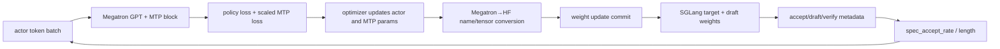

# slime 投机解码与在线 MTP 训练分析

> **定位**：slime 段 1 实现机制 · Speculative Decoding / Online MTP
> **源码基线**：`THUDM/slime@681b3adca54105d5ecd3fb822fa0dc58a427e0f9`
> **系列入口**：[[slime/index]]

## 1. 中心结论

slime 把 speculative decoding 分成两层：SGLang 负责 EAGLE/draft 的生成与 target verification；slime 负责在 RL 训练过程中**让 actor 自带的 MTP 层继续学习、随 actor 一起同步到 rollout，并持续监控接受率**。这样解决的不是静态推理中的 draft 质量，而是 RL 后 target policy 漂移导致的 draft/target 失配。

官方文档明确警告：随着 RL 更新，固定 draft 的通过率会下降，speculative decoding 甚至可能变成负收益；当前已支持在线训练模型内 MTP 层，但外部独立 draft model 的在线训练仍是 WIP。[`speculative-decoding.md:24-38`](https://github.com/THUDM/slime/blob/681b3adca54105d5ecd3fb822fa0dc58a427e0f9/docs/zh/advanced/speculative-decoding.md#L24-L38)

## 2. 静态投机解码：SGLang 参数透传

对已有 MTP 的模型，用户通过 `--sglang-speculative-algorithm EAGLE`、step、top-k 和 draft-token 数配置 SGLang；使用独立 draft checkpoint 时再提供 `--sglang-speculative-draft-model-path`。[`speculative-decoding.md:5-22`](https://github.com/THUDM/slime/blob/681b3adca54105d5ecd3fb822fa0dc58a427e0f9/docs/zh/advanced/speculative-decoding.md#L5-L22)

此时 slime 不重写 acceptance algorithm，而是依赖 `--sglang-*` 参数透传。它额外把 `enable_draft_weights_cpu_backup=True` 固定传给 SGLang，使训练阶段即便暂时没有 MTP 权重驻留也能保存/恢复 draft 权重；同一处还打开 serving metrics。[`sglang_engine.py:545-570`](https://github.com/THUDM/slime/blob/681b3adca54105d5ecd3fb822fa0dc58a427e0f9/slime/backends/sglang_utils/sglang_engine.py#L545-L570)

## 3. 在线 MTP 是一条跨平面的闭环

### 3.1 建模

`--enable-mtp-training` 要求 `--mtp-num-layers` 非空，默认 MTP loss scale 为 0.2。[`arguments.py:1506-1517`](https://github.com/THUDM/slime/blob/681b3adca54105d5ecd3fb822fa0dc58a427e0f9/slime/utils/arguments.py#L1506-L1517) [`arguments.py:1999-2000`](https://github.com/THUDM/slime/blob/681b3adca54105d5ecd3fb822fa0dc58a427e0f9/slime/utils/arguments.py#L1999-L2000) 模型 provider 调用 Megatron 的 `get_gpt_mtp_block_spec`，把生成的 block spec 注入 GPTModel。[`model_provider.py:219-232`](https://github.com/THUDM/slime/blob/681b3adca54105d5ecd3fb822fa0dc58a427e0f9/slime/backends/megatron_utils/model_provider.py#L219-L232)

### 3.2 训练

普通 forward 把当前 `batch["tokens"]` 同时作为 `mtp_labels`；combined 1F1B 路径则显式禁止 MTP training，说明该组合尚未建立正确调度语义。[`model.py:609-636`](https://github.com/THUDM/slime/blob/681b3adca54105d5ecd3fb822fa0dc58a427e0f9/slime/backends/megatron_utils/model.py#L609-L636)

训练结束后，Megatron 的 MTP loss tracker 按 microbatch 缩放，并在相应通信组做 sum/average reduction；slime 分 head 和总和记录 `mtp_i_loss` / `mtp_loss`。[`model.py:849-887`](https://github.com/THUDM/slime/blob/681b3adca54105d5ecd3fb822fa0dc58a427e0f9/slime/backends/megatron_utils/model.py#L849-L887)

### 3.3 参数命名与同步

MTP 不是“只保存在训练 checkpoint 里”。全局参数枚举专门识别 `mtp.layers.*`，处理 PP/VP/EP 后的全局层号和 expert offset，保证各 rank 最终生成一致的 HF 名称。[`common.py:172-219`](https://github.com/THUDM/slime/blob/681b3adca54105d5ecd3fb822fa0dc58a427e0f9/slime/backends/megatron_utils/update_weight/common.py#L172-L219)

Qwen3-Next 的 Megatron→HF converter 又处理 MTP wrapper 权重、`eh_proj` 半区交换和内部 transformer layer 映射。[`qwen3_next.py:6-39`](https://github.com/THUDM/slime/blob/681b3adca54105d5ecd3fb822fa0dc58a427e0f9/slime/backends/megatron_utils/megatron_to_hf/qwen3_next.py#L6-L39) 反向 HF→Megatron loader 也识别 `mtp.layers` 与 wrapper mapping，说明 checkpoint 初始化与在线提交两条方向都覆盖了 MTP。[`hf_to_megatron/qwen3_next.py:56-83`](https://github.com/THUDM/slime/blob/681b3adca54105d5ecd3fb822fa0dc58a427e0f9/slime/backends/megatron_utils/hf_to_megatron/qwen3_next.py#L56-L83)

## 4. 接受率如何进入训练观测

`Sample.SpecInfo` 累积 accepted/drafted token、verify 次数和 completion token 数，并派生接受率 $r_{\mathrm{accept}}$（`accept_rate`）与平均接受长度 $\ell_{\mathrm{accept}}$（`accept_length`）：

$$
\begin{aligned}
r_{\mathrm{accept}}
&=\frac{N_{\mathrm{accepted}}}{N_{\mathrm{drafted}}}, \\
\ell_{\mathrm{accept}}
&=\frac{N_{\mathrm{completion}}}{N_{\mathrm{verify}}}.
\end{aligned}
$$

[`types.py:153-188`](https://github.com/THUDM/slime/blob/681b3adca54105d5ecd3fb822fa0dc58a427e0f9/slime/utils/types.py#L153-L188)

partial rollout 不能直接采用某一次 SGLang response 的最终统计，所以 `append_response_tokens` 在每段完成时累计 metadata，而不是覆盖已有值。[`types.py:397-408`](https://github.com/THUDM/slime/blob/681b3adca54105d5ecd3fb822fa0dc58a427e0f9/slime/utils/types.py#L397-L408) rollout 日志最终按 sample 平均输出 `spec_accept_rate` 和 `spec_accept_length`。[`rollout.py:1500-1507`](https://github.com/THUDM/slime/blob/681b3adca54105d5ecd3fb822fa0dc58a427e0f9/slime/ray/rollout.py#L1500-L1507)

接受率只是必要指标，不是最终吞吐：draft 额外 forward、target verify batch、queueing、draft token 数和 target policy 形态都会改变收益。应同时观察 tokens/GPU/s、request latency 与 rollout wall time。

## 5. 稳定性门禁

### 5.1 截断样本的梯度归属

在 CI 模式下，slime 会检查全截断场景中只有名称含 `.mtp.` 的参数拥有非零梯度，同时要求至少一个 MTP 参数确有梯度；这防止 MTP-only loss 意外污染 actor 主干，或 MTP loss 根本没有接上。[`ci_utils.py:11-68`](https://github.com/THUDM/slime/blob/681b3adca54105d5ecd3fb822fa0dc58a427e0f9/slime/backends/megatron_utils/ci_utils.py#L11-L68)

### 5.2 loss 上界只是 CI smoke gate

`check_mtp_loss` 默认断言总 MTP loss 小于 1.0。[`ci_utils.py:71-84`](https://github.com/THUDM/slime/blob/681b3adca54105d5ecd3fb822fa0dc58a427e0f9/slime/backends/megatron_utils/ci_utils.py#L71-L84) 这是项目测试中的异常门槛，不应直接当作所有模型/数据的生产阈值；真实训练应建立自身 baseline、分位数和 acceptance correlation。

### 5.3 checkpoint 是启动前置条件

官方说明启用在线 MTP 前，HF→torch_dist 转换就必须包含 MTP layer。[`speculative-decoding.md:30-38`](https://github.com/THUDM/slime/blob/681b3adca54105d5ecd3fb822fa0dc58a427e0f9/docs/zh/advanced/speculative-decoding.md#L30-L38) 只在运行脚本加 `--mtp-num-layers`，但 checkpoint 不含对应权重，会把“在线适配”退化成错误初始化或加载失败。

## 6. 调参逻辑

| 观察 | 可能原因 | 下一步 |
|---|---|---|
| accept rate 持续下降 | MTP 跟不上 actor drift | 增大合理的 MTP loss scale、检查 MTP 权重是否同步 |
| MTP loss 下降但 accept 不升 | 训练目标/serving draft 不是同一权重或算法 | 核对 version、name mapping、SGLang draft config |
| accept 高但吞吐下降 | draft/verify 开销超过节省 | 降 num steps/draft tokens，直接看 wall time |
| 全截断 batch 主干仍有梯度 | loss mask 或 MTP-only 路径泄漏 | 复用 CI gradient gate 定位 |
| 更新后短暂抖动 | target/draft 版本提交不同步 | 把两者视为同一次 weight commit |

## 7. 明确边界

- 当前在线训练的是 actor 内 MTP 模块，不是任意外部 draft model；后者官方仍标 WIP。
- slime 只聚合 SGLang 给出的 spec metadata，不重新实现 acceptance kernel。
- combined 1F1B 与 MTP training 当前互斥。
- “accept rate 提高”不等于“端到端 rollout 更快”，必须用同 batch、同请求分布的 wall-clock A/B 验证。

## 8. 相关页面

- [[13_slime_sglang_rollout_engine_analysis]]
- [[16_slime_weight_sync_analysis]]
- [[30_slime_rollout_optimization_analysis]]
- [[31_slime_posttraining_stability_analysis]]
