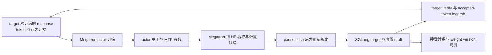

# slime 在线投机解码与 MTP：草稿模型必须与 actor 保持同一版本

> **slime 源码基线**：`THUDM/slime main@681b3adca54105d5ecd3fb822fa0dc58a427e0f9`（2026-08-12）
> **SGLang 核验基线**：`sgl-project/sglang v0.5.15.post1@0b3bb0cbe31873994c9f989fddfe2f87ca839fdd`；这是 slime 同一提交声明的当前 stable 组合。[`docker/README.md:3-8`](https://github.com/THUDM/slime/blob/681b3adca54105d5ecd3fb822fa0dc58a427e0f9/docker/README.md#L3-L8)
> **核验日期**：2026-08-18 · **系列**：[[02_engineering/04_posttrain_frameworks/slime/index|slime 源码分析]]
> **结论先行**：在线后训练里的投机解码不是给 rollout engine 多加一个推理开关，而是多引入了一份必须版本化的策略状态。slime 的选择是让 actor 内 MTP 层参加训练、参数转换和权重发布，使 draft 尽量追随不断变化的 target；SGLang 仍负责用 target logits 做验证并返回最终 token 及其 logprob。代价是 MTP checkpoint、模型映射、同步 transport、SGLang 字段版本和调度路径都成为正确性/性能边界；固定独立 draft 只解决启动时的推理配置，不能闭合在线更新回路。

本文严格区分两类话语：带 fixed-commit 定位符的是源码或同提交官方文档事实；标为“设计分析”或“跨仓推论”的内容是根据两个锁定仓库的调用链推导出的约束，不代表项目作者原话。

## 1. 真正的问题是两份模型状态的版本耦合

普通在线 RL 已经要维护训练 actor 与 rollout target 的发布边界。投机解码又增加 draft/MTP 状态：draft 负责便宜地提出候选，target 负责验证；项目文档明确指出，RL 推进后两者的采样分布会漂移，能通过验证的 draft token 会减少，投机执行甚至可能成为负收益。[`docs/en/advanced/speculative-decoding.md:24-28`](https://github.com/THUDM/slime/blob/681b3adca54105d5ecd3fb822fa0dc58a427e0f9/docs/en/advanced/speculative-decoding.md#L24-L28)

设第 $v$ 次发布后的 target 参数为 $\theta_v$，内置 MTP 参数为 $\phi_v$。在线闭环至少要区分两个不变量：

1. **提议状态新鲜度**：$\phi_v$ 应随 $\theta_v$ 训练并进入同一轮发布；否则 draft 逐轮陈旧，接受率下降，额外 draft forward 与 verify 开销不再有收益。
2. **训练证据归属**：最终 response token、行为 logprob、reward 与版本 metadata 必须描述 target 验证后的轨迹，而不能把“draft 提议过什么”误当成 actor 的行为证据。

第二点不等于声称任意 speculative 配置都严格保持某个抽象 target 分布。锁定的 SGLang EAGLE 路径确实先执行 target verify，再用 target logits 采样/验收，并从被接受位置的 target logits 计算返回 logprob；但它同时暴露 target-only acceptance threshold 与可选 rejection sampling，不同参数走不同 kernel。[`eagle_worker_v2.py:1543-1611`](https://github.com/sgl-project/sglang/blob/0b3bb0cbe31873994c9f989fddfe2f87ca839fdd/python/sglang/srt/speculative/eagle_worker_v2.py#L1543-L1611) [`eagle_utils.py:620-715`](https://github.com/sgl-project/sglang/blob/0b3bb0cbe31873994c9f989fddfe2f87ca839fdd/python/sglang/srt/speculative/eagle_utils.py#L620-L715) 因而本页只作源码能支持的窄结论：**训练消费的是 target verify 后的 token，并可消费从 target logits 计算的 accepted-token logprob**；不把它推广成所有算法、阈值和采样设置下的通用分布等价定理。[`logprob.py:295-333`](https://github.com/sgl-project/sglang/blob/0b3bb0cbe31873994c9f989fddfe2f87ca839fdd/python/sglang/srt/layers/utils/logprob.py#L295-L333)

### 1.1 为什么“常驻一个静态草稿模型服务”不够

静态独立 draft checkpoint 只在进程启动时给 SGLang 一份候选模型；slime 文档允许用 `--sglang-speculative-draft-model-path` 配置它，却同时把“外部 draft model 的训练”标为 WIP。[`docs/en/advanced/speculative-decoding.md:16-22`](https://github.com/THUDM/slime/blob/681b3adca54105d5ecd3fb822fa0dc58a427e0f9/docs/en/advanced/speculative-decoding.md#L16-L22) [`docs/en/advanced/speculative-decoding.md:36-38`](https://github.com/THUDM/slime/blob/681b3adca54105d5ecd3fb822fa0dc58a427e0f9/docs/en/advanced/speculative-decoding.md#L36-L38)

> **设计分析**：静态服务不会直接改变 target 验证结果的来源，但会让“为减少 target 工作而增加的 draft 工作”越来越无效。它的问题首先是在线收益退化，不应被夸大成“draft 自己决定了最终训练 token”。slime 选择模型内 MTP，是因为这份 draft 状态已经属于 actor checkpoint/optimizer/命名转换可覆盖的参数空间；任意外部 draft 则还需要独立的数据、optimizer、版本提交和恢复协议。

## 2. 一条闭环，而不是两个互不相干的开关



这条环路有三个平面：

| 层面 | 状态责任主体 | 本页关心的不变量 |
|---|---|---|
| 训练 | Megatron actor 中的主干与 MTP block | MTP 有 checkpoint 权重、收到辅助训练信号并参加 optimizer step |
| 发布 | slime 的 Megatron→HF 转换与 weight updater | 主干和 MTP 都被枚举、转换并送入同一版本窗口 |
| rollout | SGLang target worker、draft worker 与请求 metadata | draft 提议不取代 target verify；最终 token/logprob/版本可回到 `Sample` |

slime 不实现 EAGLE acceptance kernel。它通过反射 SGLang `ServerArgs`，把 `--sglang-*` 字段转成原生 server 参数；不在当前 SGLang dataclass 中的键会被警告并删除。[`sglang_engine.py:592-636`](https://github.com/THUDM/slime/blob/681b3adca54105d5ecd3fb822fa0dc58a427e0f9/slime/backends/sglang_utils/sglang_engine.py#L592-L636) 这解释了职责分界：slime 负责版本闭环和训练数据契约，具体 speculative 算法仍属于锁定的 SGLang 版本。

## 3. Rollout 配置：先区分“启用推测”与“在线训练 MTP”

### 3.1 只启用推测执行

对 checkpoint 已带 MTP 的模型，官方最小配置是：

```bash
--sglang-speculative-algorithm EAGLE
--sglang-speculative-num-steps 3
--sglang-speculative-eagle-topk 1
--sglang-speculative-num-draft-tokens 4
```

这些参数只配置 SGLang 如何 draft/verify；它们没有要求 Megatron 构造 MTP block，也没有打开 MTP loss。[`docs/en/advanced/speculative-decoding.md:5-14`](https://github.com/THUDM/slime/blob/681b3adca54105d5ecd3fb822fa0dc58a427e0f9/docs/en/advanced/speculative-decoding.md#L5-L14) 仓库示例还警告 speculative decoding 需要额外 GPU 显存，OOM 时应降低 SGLang 静态显存比例或关闭该能力。[`docs/en/examples/glm4.7-30B-A3B.md:84-101`](https://github.com/THUDM/slime/blob/681b3adca54105d5ecd3fb822fa0dc58a427e0f9/docs/en/examples/glm4.7-30B-A3B.md#L84-L101)

### 3.2 把 MTP 纳入在线训练

在线路径另外要求：

```bash
--mtp-num-layers 1
--enable-mtp-training
--mtp-loss-scaling-factor 0.2
```

`--mtp-num-layers` 决定训练模型是否构造 MTP block；`--enable-mtp-training` 决定 forward 是否传入 MTP labels；后者开启时前者必须非空，scale 默认 0.2。[`arguments.py:1506-1517`](https://github.com/THUDM/slime/blob/681b3adca54105d5ecd3fb822fa0dc58a427e0f9/slime/utils/arguments.py#L1506-L1517) [`arguments.py:1999-2000`](https://github.com/THUDM/slime/blob/681b3adca54105d5ecd3fb822fa0dc58a427e0f9/slime/utils/arguments.py#L1999-L2000)

三组参数必须同时理解：

| 组合 | 发生什么 | 缺口 |
|---|---|---|
| 只有 `sglang-speculative-*` | rollout 走 speculative execution | draft 可以工作，但 RL step 不会主动训练 MTP |
| 只有 `mtp-num-layers` | Megatron 构造并加载 MTP block | 没有 `enable-mtp-training` 时不会传 MTP labels；也没有要求 SGLang 启用推测 |
| 再加 `enable-mtp-training` | MTP 得到辅助训练信号 | 若 speculative 没开，训练了 MTP 但 rollout 不消费其加速能力 |
| 三者齐备 | 训练、同步、rollout 才可能闭环 | 仍须检查 checkpoint、模型转换和 transport 是否覆盖 draft |

官方 GLM 示例把 `mtp-num-layers` 解释为加载 MTP，另用 `enable-mtp-training` 打开更新，并明确支持范围取决于模型是否已有 MTP 权重转换。[`docs/en/examples/glm4.7-30B-A3B.md:103-122`](https://github.com/THUDM/slime/blob/681b3adca54105d5ecd3fb822fa0dc58a427e0f9/docs/en/examples/glm4.7-30B-A3B.md#L103-L122)

## 4. MTP 归 actor 所有：建模、训练与梯度证据

### 4.1 模型所有权由 `mtp_num_layers` 建立

model provider 在 `mtp_num_layers` 非空时调用 Megatron 的 `get_gpt_mtp_block_spec`，再把 block spec 作为 `GPTModel` 构造参数；因此 MTP 是训练 actor 模型树的一部分，不是 slime 旁挂的另一个 Ray actor。[`model_provider.py:200-232`](https://github.com/THUDM/slime/blob/681b3adca54105d5ecd3fb822fa0dc58a427e0f9/slime/backends/megatron_utils/model_provider.py#L200-L232)

这个所有权从 checkpoint 开始：官方文档要求 HF→torch-dist 转换时也带 `--mtp-num-layers 1`，否则在线任务没有可加载的 MTP 权重。[`docs/en/advanced/speculative-decoding.md:30-36`](https://github.com/THUDM/slime/blob/681b3adca54105d5ecd3fb822fa0dc58a427e0f9/docs/en/advanced/speculative-decoding.md#L30-L36) E2E 测试同样先用该参数转换 MiMo checkpoint，再在训练命令中同时启用 EAGLE 和 MTP training。[`tests/test_mimo_7B_mtp_only_grad.py:21-34`](https://github.com/THUDM/slime/blob/681b3adca54105d5ecd3fb822fa0dc58a427e0f9/tests/test_mimo_7B_mtp_only_grad.py#L21-L34) [`tests/test_mimo_7B_mtp_only_grad.py:90-109`](https://github.com/THUDM/slime/blob/681b3adca54105d5ecd3fb822fa0dc58a427e0f9/tests/test_mimo_7B_mtp_only_grad.py#L90-L109)

### 4.2 MTP 是辅助训练目标，不替代策略训练所需的数据

普通训练 forward 仍以 `batch["tokens"]` 驱动 actor；打开 MTP training 时，slime 额外把同一 tokens 作为 `mtp_labels` 传给 GPTModel。optimizer 随后对这一模型执行 step。[`model.py:576-641`](https://github.com/THUDM/slime/blob/681b3adca54105d5ecd3fb822fa0dc58a427e0f9/slime/backends/megatron_utils/model.py#L576-L641) [`model.py:656-680`](https://github.com/THUDM/slime/blob/681b3adca54105d5ecd3fb822fa0dc58a427e0f9/slime/backends/megatron_utils/model.py#L656-L680)

而 rollout 侧请求 `return_logprob=True`，从 SGLang response 的 `output_token_logprobs` 取最终 token id 与 logprob，再作为 trainable response 追加到 `Sample`。[`sglang_rollout.py:175-219`](https://github.com/THUDM/slime/blob/681b3adca54105d5ecd3fb822fa0dc58a427e0f9/slime/rollout/sglang_rollout.py#L175-L219) converter 把这些值放入 `rollout_log_probs`；训练是否直接把它作为 old-policy evidence 由 `use_rollout_logprobs` 决定，否则使用 Megatron 重算的 `log_probs`。[`rollout.py:828-830`](https://github.com/THUDM/slime/blob/681b3adca54105d5ecd3fb822fa0dc58a427e0f9/slime/ray/rollout.py#L828-L830) [`loss.py:729-746`](https://github.com/THUDM/slime/blob/681b3adca54105d5ecd3fb822fa0dc58a427e0f9/slime/backends/megatron_utils/loss.py#L729-L746)

> **设计分析**：MTP loss 的作用是改善候选器对 actor trajectory 的预测；policy loss/reward 的对象仍是 target verify 后进入 Sample 的 response。把 MTP 训练理解成“让 draft policy 直接产生 RL evidence”，会混淆辅助预测目标与行为策略证据。

### 4.3 测试证明了什么，又没有证明什么

CI 在全截断场景检查：非 MTP 参数的非零梯度数必须为 0，同时至少一个 MTP 参数必须有非零梯度；这证明 MTP loss 已接上，且主 policy loss 被 mask 后不会污染主干梯度。[`ci_utils.py:11-68`](https://github.com/THUDM/slime/blob/681b3adca54105d5ecd3fb822fa0dc58a427e0f9/slime/backends/megatron_utils/ci_utils.py#L11-L68) 它还用默认 1.0 作为 MTP loss smoke gate，但源码没有把它定义为跨模型生产阈值。[`ci_utils.py:71-84`](https://github.com/THUDM/slime/blob/681b3adca54105d5ecd3fb822fa0dc58a427e0f9/slime/backends/megatron_utils/ci_utils.py#L71-L84)

测试没有证明任意权重 transport 都会同时更新 SGLang draft，也没有证明更低 MTP loss 必然带来端到端吞吐提升；这两点需要分别审计同步路径和 wall-clock 指标。

## 5. 权重同步：MTP 参数进入发布列表，不代表所有传输方式都会更新草稿模型

### 5.1 先把训练参数翻译成 rollout 能加载的名字

训练参数枚举专门识别 `mtp.layers.*`，并在 PP/VP/EP 下修正全局层号与 expert offset；否则同一 MTP expert 在训练 shard 与 rollout shard 中会得到不一致名字。[`common.py:172-219`](https://github.com/THUDM/slime/blob/681b3adca54105d5ecd3fb822fa0dc58a427e0f9/slime/backends/megatron_utils/update_weight/common.py#L172-L219)

名字一致还不够，张量布局也可能不同。以 Qwen3-Next 为例，Megatron→HF converter 映射 MTP wrapper、交换 `eh_proj` 的两个半区，并复用普通层映射处理内部 transformer；HF→Megatron loader 做反向映射。[`megatron_to_hf/qwen3_next.py:6-39`](https://github.com/THUDM/slime/blob/681b3adca54105d5ecd3fb822fa0dc58a427e0f9/slime/backends/megatron_utils/megatron_to_hf/qwen3_next.py#L6-L39) [`hf_to_megatron/qwen3_next.py:56-77`](https://github.com/THUDM/slime/blob/681b3adca54105d5ecd3fb822fa0dc58a427e0f9/slime/backends/megatron_utils/hf_to_megatron/qwen3_next.py#L56-L77)

> **设计分析**：这就是“模型架构支持”不能退化成一个 MTP flag 的原因。没有双向名称/布局映射，训练侧可以产生梯度，rollout 侧却可能加载不到同一组参数，或加载成错误布局。

### 5.2 发布窗口与版本号

actor 按 transport 选择 updater：disk 使用 disk updater，colocate 使用 tensor updater，非 colocate 的 full+NCCL 使用 distributed updater。[`actor.py:151-179`](https://github.com/THUDM/slime/blob/681b3adca54105d5ecd3fb822fa0dc58a427e0f9/slime/backends/megatron_utils/actor.py#L151-L179) tensor 与 distributed 路径都先递增 `weight_version`，再 pause generation、flush cache、发送参数，最后 continue generation；这把更新变成一个禁止新请求穿过半版本的窗口。[`update_weight_from_tensor.py:276-331`](https://github.com/THUDM/slime/blob/681b3adca54105d5ecd3fb822fa0dc58a427e0f9/slime/backends/megatron_utils/update_weight/update_weight_from_tensor.py#L276-L331) [`update_weight_from_distributed.py:102-134`](https://github.com/THUDM/slime/blob/681b3adca54105d5ecd3fb822fa0dc58a427e0f9/slime/backends/megatron_utils/update_weight/update_weight_from_distributed.py#L102-L134)

锁定的 SGLang tensor 入口会把同一批 named tensors 先交给 draft runner，再交给 target runner；disk 和 IPC 入口也先更新 target、再显式更新 draft worker。[`eagle_worker_v2.py:1752-1785`](https://github.com/sgl-project/sglang/blob/0b3bb0cbe31873994c9f989fddfe2f87ca839fdd/python/sglang/srt/speculative/eagle_worker_v2.py#L1752-L1785) [`weight_updater.py:108-178`](https://github.com/sgl-project/sglang/blob/0b3bb0cbe31873994c9f989fddfe2f87ca839fdd/python/sglang/srt/managers/scheduler_components/weight_updater.py#L108-L178) 这为 colocate tensor/disk 路径提供了“同批 payload 覆盖两侧”的源码证据。

### 5.3 一个必须明确说明的传输能力缺口

锁定的 SGLang distributed 更新入口只调用 `tp_worker.update_weights_from_distributed`，没有调用 `draft_worker`；同一文件的 tensor 入口才会在 draft worker 与 target worker之间选择/转发。[`weight_updater.py:136-164`](https://github.com/sgl-project/sglang/blob/0b3bb0cbe31873994c9f989fddfe2f87ca839fdd/python/sglang/srt/managers/scheduler_components/weight_updater.py#L136-L164) 与之对应，slime 非 colocate full+NCCL 正是调用 `/update_weights_from_distributed`。[`update_weight_from_distributed.py:326-355`](https://github.com/THUDM/slime/blob/681b3adca54105d5ecd3fb822fa0dc58a427e0f9/slime/backends/megatron_utils/update_weight/update_weight_from_distributed.py#L326-L355)

> [!warning] 跨仓推论：非 colocate NCCL 的 online-MTP 覆盖缺口
> 在这两个锁定提交的组合上，仅凭现有调用链不能证明 distributed/NCCL 发布会刷新 EAGLE draft runner；相反，入口显示 target-only update。项目提供的 MTP-only E2E 命令使用 `--colocate`，没有覆盖这一组合。[`tests/test_mimo_7B_mtp_only_grad.py:111-139`](https://github.com/THUDM/slime/blob/681b3adca54105d5ecd3fb822fa0dc58a427e0f9/tests/test_mimo_7B_mtp_only_grad.py#L111-L139) 因此部署前应做版本/权重探针或补 E2E 测试，不能从“参数被 converter 枚举”推断“每种 transport 的 draft 都已更新”。

### 5.4 `post_process_weights` 不是 MTP 同步补丁

slime 的 `post_process_weights` endpoint 用于 compressed-tensors 的 restore-before-load 与 post-load quantization，只在对应 quant method 下于参数发送前后触发。[`update_weight_from_tensor.py:283-291`](https://github.com/THUDM/slime/blob/681b3adca54105d5ecd3fb822fa0dc58a427e0f9/slime/backends/megatron_utils/update_weight/update_weight_from_tensor.py#L283-L291) [`update_weight_from_tensor.py:322-330`](https://github.com/THUDM/slime/blob/681b3adca54105d5ecd3fb822fa0dc58a427e0f9/slime/backends/megatron_utils/update_weight/update_weight_from_tensor.py#L322-L330) endpoint 自身的 docstring 也只描述量化 hook。[`sglang_engine.py:454-470`](https://github.com/THUDM/slime/blob/681b3adca54105d5ecd3fb822fa0dc58a427e0f9/slime/backends/sglang_utils/sglang_engine.py#L454-L470)

所以 MTP 新鲜度来自“枚举→架构转换→实际更新 draft runner”的完整链，不来自笼统的 postprocess 调用。slime 还固定打开 `enable_draft_weights_cpu_backup`；该标志解决的是 memory-saver release/resume 时保存 draft 权重，不替代每轮在线发布。[`sglang_engine.py:544-570`](https://github.com/THUDM/slime/blob/681b3adca54105d5ecd3fb822fa0dc58a427e0f9/slime/backends/sglang_utils/sglang_engine.py#L544-L570) [`server_args.py:2587-2592`](https://github.com/sgl-project/sglang/blob/0b3bb0cbe31873994c9f989fddfe2f87ca839fdd/python/sglang/srt/server_args.py#L2587-L2592)

## 6. 请求记录与接受率：最终 token 链可靠，但指标接口已经变化

### 6.1 target verify 后的证据如何回到训练

SGLang 的 verify 函数执行 target forward，随后 `eagle_sample` 决定 accepted path；请求开启 logprob 时，它调用 `compute_spec_v2_logprobs`。[`eagle_worker_v2.py:1602-1642`](https://github.com/sgl-project/sglang/blob/0b3bb0cbe31873994c9f989fddfe2f87ca839fdd/python/sglang/srt/speculative/eagle_worker_v2.py#L1602-L1642) [`eagle_worker_v2.py:1665-1682`](https://github.com/sgl-project/sglang/blob/0b3bb0cbe31873994c9f989fddfe2f87ca839fdd/python/sglang/srt/speculative/eagle_worker_v2.py#L1665-L1682) tokenizer manager 还把 server 当前 `weight_version` 放进 response metadata。[`tokenizer_manager.py:1888-1895`](https://github.com/sgl-project/sglang/blob/0b3bb0cbe31873994c9f989fddfe2f87ca839fdd/python/sglang/srt/managers/tokenizer_manager.py#L1888-L1895)

slime 的 `Sample.append_response_tokens` 保存 token/logprob，并在 terminal response 时追加 `weight_version`；partial rollout 不是覆盖旧 metadata，而是累加 speculative 计数并保存多个版本边界。[`types.py:397-416`](https://github.com/THUDM/slime/blob/681b3adca54105d5ecd3fb822fa0dc58a427e0f9/slime/utils/types.py#L397-L416) 这让训练数据至少能回答“这段最终 response 由哪个 rollout target 版本返回”，但当前结构没有独立的 `draft_weight_version` 字段，不能仅靠 Sample 证明 draft 与 target 同版本。

> **设计分析**：一个单独的 target `weight_version` 是发布完成的审计证据，不是双模型一致性的充分证明。若 transport 可能只更新一侧，应增加 draft/target 双版本或权重 checksum 探针，而不是只看 request 成功。

### 6.2 接受率定义

slime 的 `SpecInfo` 期望累计 accepted draft token、proposed draft token、verify 次数与 completion token，并定义：

$$
\begin{aligned}
r_{\mathrm{accept}}
&=\frac{N_{\mathrm{accepted\ draft}}}{N_{\mathrm{proposed\ draft}}}, \\
\ell_{\mathrm{accept}}
&=\frac{N_{\mathrm{completion}}}{N_{\mathrm{verify}}}.
\end{aligned}
$$

实现对分母为 0 的情况返回 0，并在 partial 的多段 response 中累加原始计数。[`types.py:153-188`](https://github.com/THUDM/slime/blob/681b3adca54105d5ecd3fb822fa0dc58a427e0f9/slime/utils/types.py#L153-L188) rollout 日志再对每个 Sample 的 ratio/length 作等权平均，而不是先把全局计数求和后再算比值。[`rollout.py:1500-1507`](https://github.com/THUDM/slime/blob/681b3adca54105d5ecd3fb822fa0dc58a427e0f9/slime/ray/rollout.py#L1500-L1507)

因此 `spec_accept_rate` 是“平均 sample ratio”，长短请求权重相同；它不是全局 token-weighted acceptance。`spec_accept_length` 又包含每次 verify 的 bonus/completion token，不能与“accepted draft tokens per verify”混为一谈。锁定 SGLang 对这两个定义也作了同样区分。[`tokenizer_manager.py:2351-2368`](https://github.com/sgl-project/sglang/blob/0b3bb0cbe31873994c9f989fddfe2f87ca839fdd/python/sglang/srt/managers/tokenizer_manager.py#L2351-L2368)

### 6.3 锁定组合中的 metadata 字段不兼容

slime 读取 `spec_accept_token_num` 与 `spec_draft_token_num`；但锁定的 SGLang v0.5.15.post1 输出 `spec_num_correct_drafts` 与 `spec_num_proposed_drafts`，只保留了另一组 backward aliases `spec_accepted_drafts` / `spec_proposed_drafts`，没有 slime 所读的两个名字。[`types.py:168-172`](https://github.com/THUDM/slime/blob/681b3adca54105d5ecd3fb822fa0dc58a427e0f9/slime/utils/types.py#L168-L172) [`tokenizer_manager.py:2357-2372`](https://github.com/sgl-project/sglang/blob/0b3bb0cbe31873994c9f989fddfe2f87ca839fdd/python/sglang/srt/managers/tokenizer_manager.py#L2357-L2372)

> [!warning] 已核验的观测缺口
> 在未额外打补丁的这组基线上，$N_{\mathrm{accepted\ draft}}$ 与 $N_{\mathrm{proposed\ draft}}$ 会按缺省值累加为 0，因而 slime 的 `spec_accept_rate` 会是 0；`spec_verify_ct` 与 `completion_tokens` 字段仍匹配，所以 accept length 可继续累加。现有 unit test 只用 synthetic old keys 验证 gating，没有覆盖真实 SGLang metadata ABI。[`tests/test_sample.py:265-283`](https://github.com/THUDM/slime/blob/681b3adca54105d5ecd3fb822fa0dc58a427e0f9/tests/test_sample.py#L265-L283)

这意味着“接受率下降”在当前组合上不能直接作为 draft 漂移诊断，必须先修复/适配字段或直接读取 SGLang 原生指标。即使字段兼容，也应同时观察 rollout wall time、tokens/GPU/s、request latency 和显存；官方只承诺 drift 可能造成负收益，没有给出一个跨模型通用的接受率阈值。[`docs/en/advanced/speculative-decoding.md:24-28`](https://github.com/THUDM/slime/blob/681b3adca54105d5ecd3fb822fa0dc58a427e0f9/docs/en/advanced/speculative-decoding.md#L24-L28)

## 7. 约束、失败模式与验证顺序

| 症状或配置 | 源码支持的判断 | 应先验证什么 |
|---|---|---|
| 只有 speculative flags | inference path 已开，不能据此推断 MTP 在训练 | `mtp_num_layers`、`enable_mtp_training`、MTP loss/grad |
| checkpoint 不含 MTP | 在线路径缺少已训练初始化 | 转换命令与 HF→Megatron mapping |
| combined 1F1B + MTP training | 固定实现直接断言不兼容 | 改用普通 schedule；不要绕过断言 |
| 外部独立 draft | 可静态加载；在线训练仍是 WIP | 是否有独立 optimizer、同步与恢复协议 |
| 非 colocate full+NCCL | target update 有证据，draft update 无证据 | draft checksum/双版本与 E2E acceptance |
| `spec_accept_rate=0` | 可能是 metadata ABI，不一定真是零接受 | 对照 SGLang 原生计数键 |
| accept rate 高但 rollout 变慢 | rate 不是端到端吞吐 | 同 workload 的 wall-clock、显存与排队 |

combined 1F1B 的 forward path 对 `enable_mtp_training` 有显式断言，因为该 schedule 尚未接入 MTP labels/loss 语义。[`model.py:609-636`](https://github.com/THUDM/slime/blob/681b3adca54105d5ecd3fb822fa0dc58a427e0f9/slime/backends/megatron_utils/model.py#L609-L636)

一个最小而可信的上线验证顺序是：

1. **初始化**：确认 checkpoint 确有 MTP，模型家族的 HF↔Megatron 转换能 round-trip。
2. **训练**：先用截断 CI gate 证明 MTP 有梯度，再在正常 batch 观察 policy 与 MTP 两类 loss；slime 会按 head 和总和记录 MTP loss。[`model.py:849-887`](https://github.com/THUDM/slime/blob/681b3adca54105d5ecd3fb822fa0dc58a427e0f9/slime/backends/megatron_utils/model.py#L849-L887)
3. **发布**：在所选 transport 上验证 target 与 draft 都变化；不要用 target 的单一 version 字段替代双侧检查。
4. **证据**：核对 response token/logprob 来自 verify 后路径，并确认 Sample 中版本与 token span 对齐。
5. **观测**：先修 metadata ABI，再比较 acceptance、accept length 与端到端 wall time；仅在同请求分布和同采样参数下做 A/B。

## 8. 为什么只把 MTP 当成推理开关会失败

把 MTP 当成 `--sglang-speculative-algorithm EAGLE` 的同义词，会漏掉四个在线系统事实：

1. actor optimizer 必须拥有 MTP block，训练 forward 必须真正产生 MTP loss；
2. checkpoint 与架构 converter 必须能双向表示 MTP 参数；
3. weight commit 必须同时到达 SGLang target 与 draft，而不是只更新 target version；
4. rollout 仍要把 target verify 后的 token/logprob作为训练证据，并用可靠的接受指标判断 draft 是否值得运行。

> **设计分析**：静态推理优化问的是“这个草稿模型在当前目标模型上快不快”；在线后训练还要回答“每次 actor 更新后，谁训练草稿模型、谁发布它、谁证明目标/草稿模型版本一致、谁证明训练记录仍来自目标模型验证”。slime 已经实现了模型内 MTP 的大部分闭环，但固定基线仍有两个需要部署者主动验证的边界：分布式草稿模型更新和指标接口。忽略这些边界时，系统通常不会立即报出统一错误，更常见的是接受率悄悄下降、指标错误地变成零，或目标模型已经更新而草稿模型仍然陈旧。

## Related Pages

- [[10_slime_end_to_end_iteration_analysis]] — 把 rollout、训练与发布放回带策略版本边界的完整 iteration。
- [[13_slime_sglang_rollout_engine_analysis]] — 展开 request、partial response 与 SGLang server 生命周期，本页只聚焦 speculative metadata。
- [[14_slime_megatron_training_analysis]] — 解释 actor 模型、optimizer 和 pipeline schedule 的通用所有权。
- [[16_slime_weight_sync_analysis]] — 权重发布事务、拓扑转换与各 transport 的权威机制页。
- [[17_slime_train_inference_consistency_analysis]] — accepted-token logprob、采样设置与训练重算不一致的分层诊断。
- [[23_slime_model_architecture_extension_analysis]] — MTP 等新架构为何必须同时补注册、名称转换和张量布局。
- [[30_slime_rollout_optimization_analysis]] — acceptance、显存、排队与端到端吞吐之间的容量权衡。
