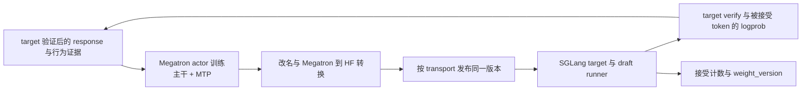
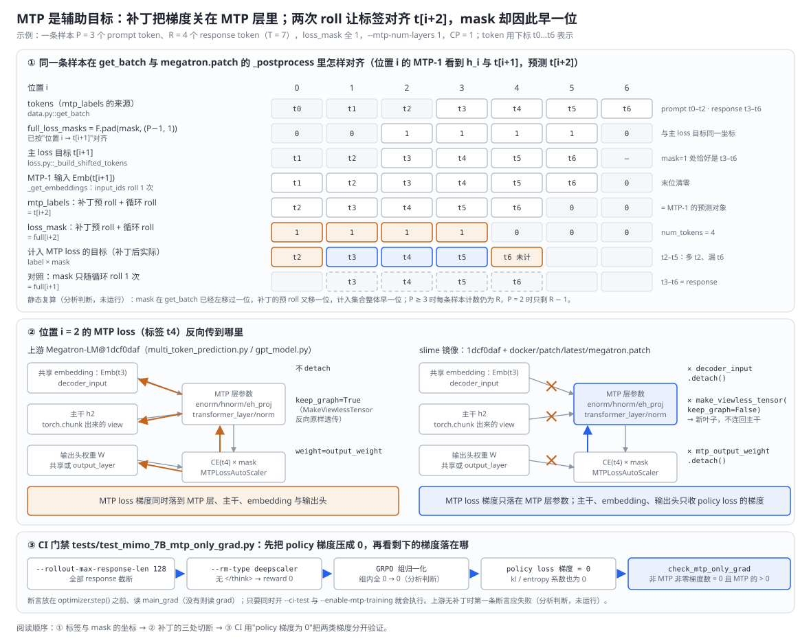
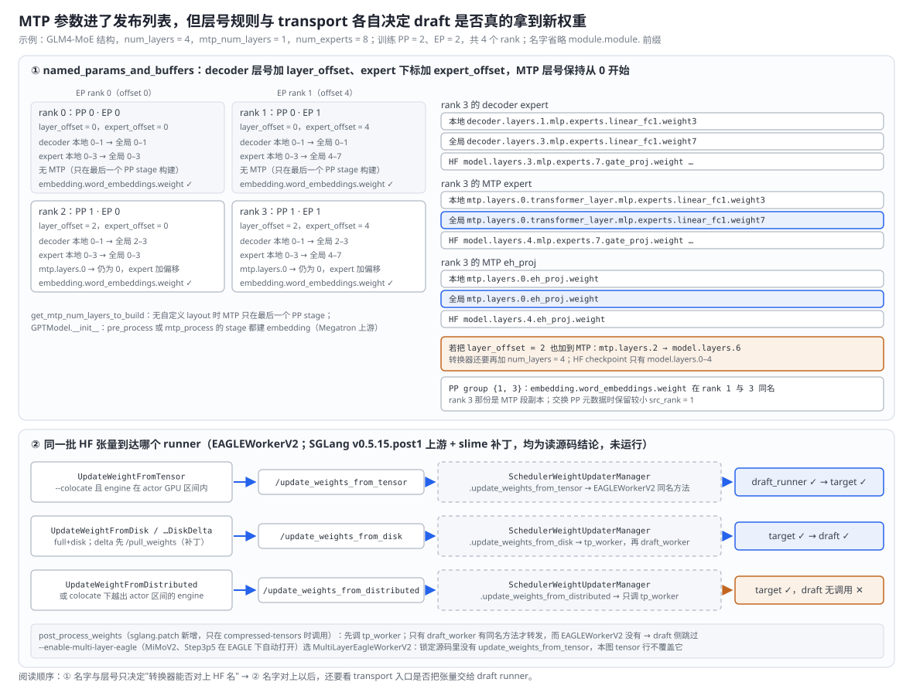
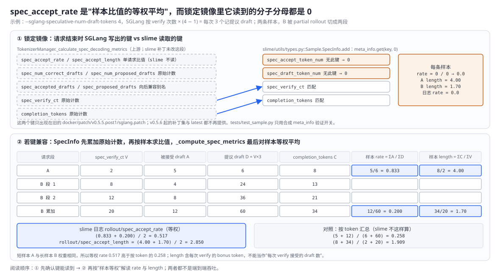

# slime 在线投机解码与 MTP：草稿模型必须与 actor 保持同一版本

> **源码基线**：`THUDM/slime@4c193f1f37509cca70f0e88807a9305b70f63f4e`（`main`，2026-09-03）
> **源码基线**：`NVIDIA/Megatron-LM@1dcf0dafa884ad52ffb243625717a3471643e087`（slime 镜像 `MEGATRON_COMMIT`，2026-02-14），镜像内叠加 slime `docker/patch/latest/megatron.patch`
> **源码基线**：`sgl-project/sglang@0b3bb0cbe31873994c9f989fddfe2f87ca839fdd`（`v0.5.15.post1`，2026-07-13），镜像内叠加 slime `docker/patch/latest/sglang*.patch`
> **主题**：在线 RL 里 draft 与 target 的版本耦合；启用推测与在线训练 MTP 的配置组合；Megatron 补丁中的 MTP 训练目标与梯度隔离；MTP 参数的改名、转换与各 transport 对 draft 的发布；target verify 后的训练证据与接受率指标。
> **适用范围**：slime 里模型内 MTP 从训练到 SGLang draft 的闭环；权重发布事务归 [[16_slime_weight_sync_analysis]]，训推数值一致性归 [[17_slime_train_inference_consistency_analysis]]，模型转换注册归 [[23_slime_model_architecture_extension_analysis]]。
> **最近更新**：2026-09-17。覆盖训练、发布、观测三个平面的最小实例与原理图，Megatron 补丁中的 MTP 机制，各 transport 对 draft 的覆盖，成本账本、调用树与源码阅读路线。

---

## 1. 特性概览

### 1.1 问题背景

投机解码让便宜的 draft 先提候选、target 一次前向并行验证；它只有在 draft 预测得足够准时才划算。在线后训练每轮都在改 target，slime 文档明确写出后果：RL 推进后两者的采样分布会漂移，通过验证的 draft token 变少，投机执行甚至可能成为负收益（`docs/en/advanced/speculative-decoding.md` 的 "Online SFT for the Draft Model" 一节）。设第 $v$ 次发布后的 target 参数为 $\theta_v$、模型内 MTP 参数为 $\phi_v$，在线闭环至少要守住两个不变量：**提议状态新鲜度**——$\phi_v$ 应随 $\theta_v$ 训练并进入同一轮发布，否则 draft 逐轮陈旧，额外的 draft forward 与 verify 开销不再有收益；**训练证据归属**——进入 `Sample` 的 response token、行为 logprob、reward 与版本 metadata 必须描述 target 验证后的轨迹，不能把"draft 提议过什么"当成 actor 的行为证据。第二点只是窄结论：锁定的 SGLang EAGLE 路径先做 target verify，再用 target logits 验收并计算被接受 token 的 logprob（§2.2.4），但它同时暴露 accept threshold 与可选 rejection sampling，本页不把它推广成"任意投机配置都严格保持 target 分布"的定理。

### 1.2 解决方法

slime 选择**模型内 MTP**，让 draft 状态落在 actor 自己的参数空间里：`--mtp-num-layers` 让 Megatron 在 actor 模型树里构造 MTP block；`--enable-mtp-training` 让训练前向把同一批 tokens 作为 `mtp_labels` 传进去；slime 镜像给 Megatron 打的 `megatron.patch` 负责把 MTP loss 的梯度关在 MTP 层里；权重发布时 MTP 参数与主干一起改名、转换成 HF 名字并送进同一次提交；SGLang 用 EAGLE 把 MTP 当 draft，target verify 后的 token 与 logprob 回到 `Sample`，接受计数汇总成 `rollout/spec_accept_rate` 与 `rollout/spec_accept_length`。带策略版本边界的完整一轮迭代见 [[10_slime_end_to_end_iteration_analysis]]。slime 不实现 EAGLE 的验收 kernel：`_compute_server_args` 遍历 SGLang `ServerArgs` 的 dataclass 字段，把 `args.sglang_<field>` 原样交给服务端，自己写死的键若不在该 dataclass 里就记日志后删掉；具体投机算法属于锁定的 SGLang 版本。

> **设计分析**：只配一个静态独立 draft（`--sglang-speculative-draft-model-path`）不会改变 target 验证结果的来源，它的问题是在线收益逐轮退化，不应被夸大成"draft 决定了训练 token"。选模型内 MTP，是因为这份状态已经被 actor 的 checkpoint、optimizer 和名称转换覆盖；外部 draft 还需要独立的数据、optimizer、版本提交与恢复协议，文档把它标为 WIP。


```mermaid
flowchart LR
    R[target 验证后的 response 与行为证据] --> T[Megatron actor 训练<br/>主干 + MTP]
    T --> C[改名与 Megatron 到 HF 转换]
    C --> P[按 transport 发布同一版本]
    P --> S[SGLang target 与 draft runner]
    S --> V[target verify 与被接受 token 的 logprob]
    V --> R
    S --> O[接受计数与 weight_version]
```

这条环路有三个平面，§2.1 各用一个最小实例复现：

| 平面 | 状态责任主体 | 不变量 |
|---|---|---|
| 训练 | Megatron `GPTModel` 里的主干与 `MultiTokenPredictionBlock` | MTP 有 checkpoint 权重、收到只作用于自身的辅助梯度、参加 optimizer step |
| 发布 | `named_params_and_buffers`、`convert_to_hf` 与所选 weight updater | 主干和 MTP 被枚举、转换成 HF 名字，并由 transport 交给 target 与 draft 两个 runner |
| rollout 与观测 | SGLang `EAGLEWorkerV2`、请求 metadata、`Sample` | draft 提议不取代 target verify；最终 token、logprob、版本与接受计数能回到 `Sample` |

### 1.3 收益、开销和约束

| 维度 | 直接收益 | 必付成本或边界 |
|---|---|---|
| 训练 | draft 跟随 actor 训练，缓解接受率随 RL 漂移 | 最后一个 PP stage 多一层 transformer 的前向/反向与一次词表投影的 CE；依赖 `megatron.patch`，上游 `GPTModel.forward` 没有 `mtp_kwargs` |
| 梯度隔离 | MTP 辅助目标不改变主干、embedding 与输出头的梯度 | 主干、embedding 与输出头只按 policy loss 更新，MTP 只能适应它们而不能反过来塑造表示（分析判断）；补丁静态复算下 mask 比 response 区间早一位（§2.1.1） |
| 发布 | MTP 随主干进入同一次提交，不另建版本协议 | 每次同步多转换一组参数；只有 tensor 与 disk 入口会更新 draft，NCCL 入口只更新 target（§2.1.2） |
| rollout | 同一 checkpoint 自带 draft，无需外部 draft 服务 | draft 权重、draft KV 与 CPU 备份占显存/主存，文档提示 OOM 时降低 `--sglang-mem-fraction-static` |
| 观测 | 每条样本累计接受计数，partial rollout 也能合并 | 锁定镜像里分子分母键读不到，`spec_accept_rate` 恒为 0；比值按样本等权平均，不是 token 加权 |

### 1.4 术语约定

| 术语 | 含义 |
|---|---|
| target / draft runner | SGLang 中服务主模型的 `tp_worker` 与 `EAGLEWorkerV2` 内部持有 MTP 权重的 `draft_runner` |
| MTP-$k$ | 第 $k$ 个 MTP 层（从 1 计）；MTP-1 在位置 $i$ 读主干 $h_i$ 与 $\mathrm{Emb}(t_{i+1})$，预测 $t_{i+2}$ |
| `full_loss_masks` | `get_batch` 把每条样本的 response `loss_mask` 左补 `prompt_length − 1`、右补 1 后拼接的整条流 mask，位置 $i$ 对应"预测 $t_{i+1}$" |
| roll | Megatron `roll_tensor`：按 `cu_seqlens` 在每条序列内左移一位、末位清零（CP>1 时跨 rank 交换边界） |
| weight_version | updater 维护的整数计数器，随更新请求交给 SGLang，再由请求 metadata 带回 `Sample.weight_versions` |
| accept rate / length | 每条样本累计 `被接受 draft / 提议 draft` 与 `completion_tokens / verify 次数`，再对样本等权平均 |

---

## 2. 详细方案

### 2.1 最小实例：三个平面各一个例子

三个例子分别对应训练、发布与观测三个平面。训练平面取一条 $P=3$、$R=4$ 的样本（$T=7$，token 记作 t0–t6，`loss_mask` 全 1，`--mtp-num-layers 1`，CP=1）；发布平面取 GLM4-MoE 结构的最小并行布局：4 层 decoder、1 层 MTP、8 个 routed expert，训练 PP=2、EP=2；观测平面取 `--sglang-speculative-num-draft-tokens 4` 下的两条样本，其中 B 被 partial rollout 切成两段。

#### 2.1.1 训练：标签、mask 与梯度切断



**输入与对齐。** `get_batch` 把 response `loss_mask` 做 `F.pad(mask, (prompt_length − 1, 1))`，得到 `full_loss_masks = [0, 0, 1, 1, 1, 1, 0]`：mask 为 1 的位置 2–5 恰好是"预测 t3–t6"的位置，和 `_build_shifted_tokens` 给主 loss 构造的目标 `t[i+1]` 同一坐标。`forward_step` 总是传 `labels=None`、`loss_mask=full_loss_masks`，开 `--enable-mtp-training` 时再加 `mtp_kwargs={"mtp_labels": tokens}`；SFT 走同一个 `train_one_step.forward_step`，同一份 `full_loss_masks` 也是它交给模型前向的 `loss_mask`（多段 mask 的构造见 [[28_slime_sft_path_and_loss_mask_analysis|SFT 与 loss mask]]）。补丁后的 `GPTModel._postprocess` 先把 `mtp_labels` roll 一次（tokens 变成下一 token 标签），给出的 `loss_mask` 也 roll 一次，进入逐层循环后两者再各 roll 一次。MTP-1 的输入由 `_get_embeddings` 把 `input_ids` roll 一次得到 $\mathrm{Emb}(t_{i+1})$，标签是 $t_{i+2}$，二者一致；mask 却变成 `full[i+2] = [1, 1, 1, 1, 0, 0, 0]`，`num_tokens = 4`。

| 行 | 位置 0–6 | 读法 |
|---|---|---|
| `full_loss_masks` | 0 0 1 1 1 1 0 | 已按"位置 $i$ → $t_{i+1}$"对齐 |
| `mtp_labels`（预 roll + 循环 roll） | t2 t3 t4 t5 t6 0 0 | 与 MTP-1 的预测对象 $t_{i+2}$ 一致 |
| `loss_mask`（预 roll + 循环 roll） | 1 1 1 1 0 0 0 | `num_tokens = 4` |
| 计入 MTP loss 的目标 | t2 t3 t4 t5 | 多了最后一个 prompt token t2，漏了最后一个 response token t6 |
| 对照：mask 只随循环 roll 一次 | t3 t4 t5 t6 | 正好是 response 区间 |

> **分析判断（静态复算，未运行）**：`full_loss_masks` 在 `get_batch` 里已经左移过一位，补丁的预 roll 又移一位，计入 MTP loss 的目标于是整体早一位：计入的目标是 t2–t5，而 response 区间是 t3–t6。roll 在序列边界清零，不会跨样本串位；影响是每个被训练段前面的一个 token 进入 MTP 目标、段内最后一个 token 不被训练。单段 response 时就是多一个 prompt token、漏掉最后一个 response token（常是结束符）；多轮 SFT 或 agent 样本的 mask 有多段为 1 时，每段都错一位，所以 SFT 与 MTP 训练同开时同样受影响。`num_tokens` 是 roll 后 mask 在整个 micro-batch 打包流上的和：`prompt_length ≥ 3` 时每条样本贡献的计数仍是 R；`prompt_length = 2` 时正确计数应为 R，双重 roll 却把第一个 mask 位移出序列，只剩 R−1。预 roll 由 `1278475e`（2025-11）加入，当时 mask 由 `build_loss_mask_for_mtp` 按 token 位置构造（`full_mask[prompt_len:] = resp_mask`），在 `27df7815` 之前两次 roll 正好把它对齐到 $t_{i+2}$；`27df7815`（2025-12）改为传已平移的 `full_loss_masks` 时没有去掉预 roll，错位由此产生（分析判断）。没有测试覆盖这一对齐。

**切断与反向。** 同一位置 $i=2$ 的 MTP loss（标签 t4）在上游 `Megatron-LM@1dcf0daf` 除了 MTP 层自身，还会回传到三处：`MultiTokenPredictionLayer._get_embeddings` 里 `decoder_input` 不 detach，主干 hidden 经 `make_viewless_tensor(..., keep_graph=True)`（`MakeViewlessTensor` 反向原样透传），输出层直接用 `output_weight`。`megatron.patch` 在三处切断：`decoder_input = decoder_input.detach()`；`keep_graph=True→False`，此时 `make_viewless_tensor` 对 view 输入走 `_kernel_make_viewless_tensor`，新建一个共享存储、`requires_grad=True` 的叶子张量（`MultiTokenPredictionBlock.forward` 用 `torch.chunk` 取出的主干 hidden 就是 view），不再连回主干；`_postprocess` 里新增 `mtp_output_weight = ….detach()` 并用它算 MTP logits。于是 MTP loss 的梯度只落在 MTP 层自己的 `enorm`、`hnorm`、`eh_proj`、`transformer_layer` 与 `final_layernorm` 上，主干、embedding 与输出头只收 policy loss 的梯度。上一 MTP 层到下一层的输入不是 view，多层 MTP 之间的反向仍然连通（分析判断，依据 `make_viewless_tensor` 对非 view 输入原样返回）。

**CI 证明的是什么。** `tests/test_mimo_7B_mtp_only_grad.py` 的 docstring 写明它验证 "MTP loss computation correctly isolates gradient flow to only the MTP layers"。它用 `--rollout-max-response-len 128` 让全部 response 截断、`--rm-type deepscaler`、GRPO 且 `--kl-loss-coef`、`--kl-coef`、`--entropy-coef` 全为 0。截断的回答没有 `</think>`，`get_deepscaler_rule_based_reward` 返回 0，组内奖励全 0，`_post_process_rewards` 组归一化后为 0，GRPO 优势为 0，policy loss 的梯度为 0（这条因果链是分析判断，测试只写"main model loss is zero"）。`full_loss_masks` 不受截断影响，MTP loss 仍非零。`train_one_step` 在 `--ci-test` 与 `--enable-mtp-training` 同开时、`optimizer.step()` 之前调用 `check_mtp_only_grad`：优先读分布式优化器的 `main_grad`，名字含 `.mtp.` 的算 MTP 参数，断言非 MTP 参数的非零梯度数为 0，且至少一个 MTP 参数有非零梯度。所以这条测试证明的是 **MTP loss 已接上，且它的梯度不进入非 MTP 参数**；它不证明主 policy loss 被 mask，也不证明标签与 mask 的对齐。若镜像不打补丁，MTP loss 会回传到主干与 embedding，第一条断言应当失败（分析判断，未运行）；更早地，上游 `GPTModel.forward` 没有 `mtp_kwargs` 形参，slime 这次调用本身就会因意外关键字失败。

#### 2.1.2 发布：改名规则与 transport 覆盖



**改名。** 4 层 decoder 均分到两个 PP stage，stage 1 的 `layer_offset = 2`；8 个 expert 均分到两个 EP rank，EP rank 1 的 `expert_offset = 8 × 1 // 2 = 4`。按 Megatron 的放置规则，MTP 只建在最后一个 PP stage（§2.2.2）。`named_params_and_buffers` 对 rank 3（PP 1、EP 1）的三个参数给出：

| 参数 | 本地名 | 全局名 | GLM4-MoE HF 名 |
|---|---|---|---|
| decoder expert | `decoder.layers.1.mlp.experts.linear_fc1.weight3` | `decoder.layers.3.mlp.experts.linear_fc1.weight7` | `model.layers.3.mlp.experts.7.gate_proj.weight` 与 `up_proj.weight` |
| MTP expert | `mtp.layers.0.transformer_layer.mlp.experts.linear_fc1.weight3` | `mtp.layers.0.transformer_layer.mlp.experts.linear_fc1.weight7` | `model.layers.4.mlp.experts.7.gate_proj.weight` 与 `up_proj.weight` |
| MTP 投影 | `mtp.layers.0.eh_proj.weight` | 不变 | `model.layers.4.eh_proj.weight` |

规则是：decoder 层号加 `layer_offset`；MTP 层号保持从 0 开始（源码注释 "MTP layer indices start from 0"），只有 MTP 内 `transformer_layer.mlp.experts` 的 expert 下标加 EP 偏移。原因在转换器：`convert_glm4moe_to_hf`（`convert_deepseekv3_to_hf` 同构）把 `mtp.layers.k` 映射到 `model.layers.{num_layers + k}`。若把 decoder 的 `layer_offset = 2` 也加到 MTP，`mtp.layers.2` 会被转成 `model.layers.6`，而 4+1 层的 HF checkpoint 只有 `model.layers.0–4`。名字里的 `module.module.` 前缀与 VLM 的 `language_model.` 前缀由同一函数保留。

**去重。** MTP 所在 stage 不是 `pre_process` 时，`GPTModel.__init__` 仍会建一份 embedding（MTP 要用它算 `decoder_input`），于是 PP group {1, 3} 里 rank 1 与 rank 3 都有 `embedding.word_embeddings.weight`。`_get_megatron_local_param_infos` 在 PP group 内 `all_gather_object` 元数据时同名保留较小 `src_rank`，这里是 src_rank = 1；随后 EP 交换只补缺失名字，并在全 world 上核对 name/shape/dtype 一致。`_get_megatron_full_params` 再按选定的 `src_rank` 在 PP group 内广播、`.experts.` 参数在 EP group 内广播，最后做 TP all-gather。发布来源因此由实际存在的参数与去重结果决定，不需要给 MTP 层号强加 decoder offset。

**transport 覆盖。** 名字对上以后，draft 是否拿到新权重取决于 slime 调用 SGLang 的哪个入口（依赖侧：读锁定上游源码与 slime 补丁，未运行）：

| slime updater | 入口 | SGLang 侧（v0.5.15.post1 + 补丁） | draft |
|---|---|---|---|
| `UpdateWeightFromTensor`（`--colocate`，engine 在 actor GPU 区间内） | `/update_weights_from_tensor` | `SchedulerWeightUpdaterManager.update_weights_from_tensor` 在有 draft worker 且请求未设 `disable_draft_model`（slime 不设）时交给 `EAGLEWorkerV2.update_weights_from_tensor`，同一批 named tensors 先给 `draft_runner`、再给 target | 更新 |
| `UpdateWeightFromDisk`、`UpdateWeightFromDiskDelta`（后者先经补丁提供的 `/pull_weights` 落到本地 checkpoint） | `/update_weights_from_disk` | `update_weights_from_disk` 先调 `tp_worker`，成功后调 `draft_worker.update_weights_from_disk` | 更新 |
| `UpdateWeightFromDistributed`，以及 colocate 下越出 actor GPU 区间、由 `UpdateWeightFromTensor` 走 NCCL 补发的 engine | `/update_weights_from_distributed` | `update_weights_from_distributed` 只调 `tp_worker`；slime 的五个 SGLang 补丁都没有改这个方法 | **没有调用** |

上游同文件的 IPC 入口也先 target 后 draft，但 slime 不调用 `/update_weights_from_ipc`。项目唯一的 MTP E2E 命令用 `--colocate`，没有覆盖 NCCL 组合。

> [!warning] 跨仓推论：NCCL 入口的在线 MTP 缺口
> 在 slime@4c193f1f 与它的镜像组合上，调用链显示 distributed/NCCL 发布只刷新 target runner，没有证据表明 EAGLE draft runner 会被更新。部署前应做 draft 权重探针或补 E2E 测试，不能从"参数被转换器枚举"推断"每种 transport 的 draft 都已更新"。

#### 2.1.3 观测：接受率怎样归约



SGLang 在请求结束时由 `TokenizerManager._calculate_spec_decoding_metrics` 写 metadata：提议 draft 数按 `spec_verify_ct × (speculative_num_draft_tokens − 1)` 计，本例每次 verify 提议 3 个。`Sample._apply_meta_info` 只在终止响应（带 `finish_reason`）且 `args.sglang_speculative_algorithm` 为真时调用 `SpecInfo.add`，partial rollout 的每一段各加一次原始计数。设样本 $s$ 的第 $g$ 段有被接受 draft $A_{s,g}$、提议 draft $D_{s,g}$、verify 次数 $V_{s,g}$、completion token $C_{s,g}$，slime 计算

$$
\begin{aligned}
r_s &= \frac{\sum_{g} A_{s,g}}{\sum_{g} D_{s,g}},\qquad
\ell_s = \frac{\sum_{g} C_{s,g}}{\sum_{g} V_{s,g}},\\
\bar r &= \frac{1}{N}\sum_{s=1}^{N} r_s,\qquad
\bar\ell = \frac{1}{N}\sum_{s=1}^{N} \ell_s ,
\end{aligned}
$$

分母为 0 时比值取 0。`_compute_spec_metrics` 输出 $\bar r$ 与 $\bar\ell$，经 `log_rollout_data` 加前缀成为 `rollout/spec_accept_rate` 与 `rollout/spec_accept_length`（eval 时是 `eval/<数据集>/…`）。

| 请求段 | $V$ | $A$ | $D=3V$ | $C$ | 样本 rate | 样本 length |
|---|---|---|---|---|---|---|
| A | 2 | 5 | 6 | 8 | 5/6 = 0.833 | 8/2 = 4.00 |
| B 段 1 | 8 | 4 | 24 | 13 | — | — |
| B 段 2 | 12 | 8 | 36 | 21 | — | — |
| B 累加 | 20 | 12 | 60 | 34 | 12/60 = 0.200 | 34/20 = 1.70 |

键兼容时，日志里的 rate 是 (0.833 + 0.200) / 2 = 0.517、length 是 (4.00 + 1.70) / 2 = 2.850；按 token 汇总则是 (5 + 12) / (6 + 60) = 0.258 与 (8 + 34) / (2 + 20) = 1.909。短样本 A 与长样本 B 权重相同，所以等权 rate 高于 token 加权值。length 含每次 verify 的 bonus token，不能当作"每次 verify 接受的 draft 数"；SGLang 自己的注释也区分了 "strict count, no bonus" 的 rate 与 "includes bonus token" 的 length。

**锁定镜像里键不兼容。** `SpecInfo.add` 读 `spec_accept_token_num` 与 `spec_draft_token_num`，但 SGLang v0.5.15.post1 写的是 `spec_num_correct_drafts`、`spec_num_proposed_drafts` 以及别名 `spec_accepted_drafts`、`spec_proposed_drafts`；`spec_verify_ct` 与 `completion_tokens` 两个键匹配。于是镜像里每条样本的分子分母都按缺省值累加为 0，`rollout/spec_accept_rate` 恒为 0，而本例的 length 仍是 2.850。slime 读的两个键只出现在旧的 `docker/patch/v0.5.5.post1/sglang.patch`（它在 `_calculate_spec_decoding_metrics` 里补过这两个键）；`v0.5.6` 起的补丁集与 `latest` 都不再提供，SGLang 的 `tokenizer_manager.py` 补丁块也没碰这段。`tests/test_sample.py::test_spec_info_only_updated_when_speculative_enabled` 只用合成的旧键验证开关，没有覆盖真实 metadata ABI。

### 2.2 从最小实例到整个闭环

#### 2.2.1 配置：启用推测与在线训练 MTP 是三组开关

对 checkpoint 已带 MTP 的模型，文档给的最小推测配置是 `--sglang-speculative-algorithm EAGLE`、`--sglang-speculative-num-steps 3`、`--sglang-speculative-eagle-topk 1`、`--sglang-speculative-num-draft-tokens 4`。这些只配置 SGLang 怎样 draft/verify，不要求 Megatron 构造 MTP，也不打开 MTP loss；GLM-4.7-30B-A3B 示例还警告投机解码需要额外 GPU 显存，OOM 时降低 `--sglang-mem-fraction-static` 或关闭投机。在线路径另外需要 `--mtp-num-layers 1`、`--enable-mtp-training`、`--mtp-loss-scaling-factor 0.2`：三者由 `add_mtp_training_arguments` 定义（`--mtp-num-layers` 默认 None 与 scale 默认 0.2 是对 Megatron 参数的 `reset_arg`），`slime_validate_args` 断言开训练时 `mtp_num_layers` 非空。

| 组合 | 源码行为 | 缺口 |
|---|---|---|
| 只有 `--sglang-speculative-*` | rollout 走投机执行；draft 用 checkpoint 自带的 MTP | RL 不训练 MTP，draft 逐轮陈旧 |
| 只有 `--mtp-num-layers` | Megatron 构造并加载 MTP；补丁后的 `_postprocess` 在 `mtp_labels is None` 时整段跳过 MTP 前向与 loss | 没有 MTP 梯度；也不要求 SGLang 开投机 |
| 再加 `--enable-mtp-training` | MTP 得到辅助训练信号 | 若没开投机，训练了 MTP 但 rollout 不消费 |
| 三者齐备 | 训练、发布、rollout 才可能闭环 | 仍要检查 checkpoint、转换器与 transport 是否覆盖 draft |

示例文档把 `--mtp-num-layers 1` 解释为从 checkpoint 加载 MTP，把 `--enable-mtp-training` 解释为打开 MTP 的梯度计算，"Without this flag, the MTP layer is loaded but frozen"，并说明支持范围取决于模型是否实现了 MTP 权重转换（如 MiMo、GLM-4.7）。源码能证明的是没有该开关时 MTP 不参加前向、没有梯度；这些参数仍在 optimizer 参数组里，是否受 weight decay 影响本页未核。仓库里两份完整配方都用 `--colocate`：`scripts/run-mimo-7B-rl-eagle.sh`（TP=2、EAGLE 3/1/4、MTP 训练）与 `scripts/run-glm4.7-30B-A3B.sh`（TP=2、PP=2、CP=2、EP=8、MTP 训练），后者正是 §2.1.2 改名规则要处理的 PP×EP 组合。

#### 2.2.2 模型所有权与 PP 放置

`_get_model_provider_func.model_provider` 在 `if args.mtp_num_layers:` 为真时调用 Megatron 的 `get_gpt_mtp_block_spec(config, transformer_layer_spec, use_transformer_engine=…, vp_stage=…)`，把结果作为 `mtp_block_spec` 交给 `GPTModel`；MTP 是训练 actor 模型树的一部分，不是另一个 Ray actor。这里没有探测函数签名，依赖侧必须接受 `vp_stage`；`Megatron-LM@1dcf0daf` 的签名满足这一点。

放置规则在 `1dcf0daf` 可核：`get_gpt_mtp_block_spec_for_backend` 调 `get_mtp_num_layers_to_build`，返回 0 时 spec 为 None、该 stage 不建 MTP。没有自定义 `--pipeline-model-parallel-layout` 时，只有 `is_pipeline_last_stage(ignore_virtual=False, vp_stage=…)` 为真的 stage 构建全部 `mtp_num_layers` 层，即最后一个 PP rank 的最后一个 virtual stage；有自定义 layout 时，某个 (pp, vp) 上的 MTP 层数必须等于 `mtp_num_layers` 或 0，否则断言失败，且 `get_gpt_mtp_block_spec_for_backend` 再断言所有 MTP 层在同一 stage。`GPTModel.__init__` 让 `pre_process or mtp_process` 的 stage 建 embedding，所以 PP>1 时 MTP stage 持有一份 embedding 副本（§2.1.2 的去重对象）。`megatron.patch` 没有改这些函数。Megatron 模型结构页对 MTP spec 装配的讲解分析的是更新的 `85902ef5`，字段（如 `mtp_model_layer`、`mtp_use_repeated_layer`）比镜像钉的 `1dcf0daf` 新，见 [[10_megatron_model_structure_analysis#2.3 结构变体与它们的选择条件|Megatron MTP spec 装配]]。

所有权从 checkpoint 开始：文档要求 HF→torch-dist 转换时也带 `--mtp-num-layers 1`，否则在线任务没有可加载的 MTP 权重；MTP E2E 测试的 `prepare` 正是这样转换 MiMo checkpoint，`execute` 再同时打开 EAGLE 与 MTP 训练。

#### 2.2.3 训练目标：Megatron 补丁里的 MTP 机制

镜像构建时 `docker/Dockerfile` 在 `MEGATRON_COMMIT=1dcf0daf…` 上无条件 `git apply megatron.patch --3way`（有冲突标记就失败），`megatron-sglang-aligned.patch` 文件存在即应用（`latest` 中存在；只改 `transformer_layer.py`，不涉及 MTP）；SGLang 补丁另有 `ENABLE_SGLANG_PATCH` 闸门。`megatron.patch` 与 MTP 训练相关的改动是：

| 位置 | 上游 `1dcf0daf` | 补丁后 | 作用 |
|---|---|---|---|
| `GPTModel.forward` / `_postprocess` 形参 | 无 `mtp_kwargs` | 新增 `mtp_kwargs`，取 `mtp_labels` | slime 不再依赖 `labels`（它传 `labels=None`） |
| `_postprocess` 的 MTP 分支条件 | `mtp_in_postprocess`；`mtp_num_layers is not None` 时 `labels.clone()` | 再要求 `mtp_labels is not None` | 不开训练时跳过 MTP 前向与 loss |
| 标签与 mask | `labels` 已是下一 token 标签；循环里各 roll 一次 | `mtp_labels`（tokens）与给定的 `loss_mask` 先各 roll 一次，循环里再各 roll 一次 | 标签对齐到 $t_{i+2}$；mask 的对齐见 §2.1.1 |
| 输出头 | `weight=output_weight` | `mtp_output_weight`（共享权重或 `output_layer.weight`）`.detach()` | MTP loss 不更新输出头与共享 embedding |
| `MultiTokenPredictionLayer._get_embeddings` | `decoder_input` 不 detach；`keep_graph=True`；无条件 roll `position_ids` | `decoder_input.detach()`；`keep_graph=False`；`position_ids` 为 None 时跳过 roll | 切断到 embedding 与主干的反向；slime 传 `position_ids=None` |
| `MultiTokenPredictionLayer._checkpointed_forward` | 把 kwargs 的值按位置交给 checkpoint | 只把张量交给 activation checkpoint，常量在闭包里重建 | 兼容 `--recompute-granularity full`（MTP E2E 打开了它） |

一个 micro-batch 的完整链是：`forward_step` 取 batch → `GPTModel.forward` 跑主干 → `_postprocess` 调 `MultiTokenPredictionBlock.forward` 逐层算 MTP hidden 并与主干 hidden 拼接 → 按层 roll 标签与 mask、用 detach 后的输出头算 CE（开 `fuse_linear_cross_entropy` 时不物化 logits）→ `MTPLossLoggingHelper.save_loss_to_tracker` 记录日志值 → `MTPLossAutoScaler.apply` 把 MTP loss 挂在主 hidden 上。反向时主 hidden 的梯度原样透传，MTP loss 的梯度按 `main_loss_backward_scale` 注入；上游 `megatron/core/pipeline_parallel/schedules.py::forward_step_calc_loss` 在非 per-token 模式下把它设成 `grad_scale / num_microbatches`。于是默认（未开 `--calculate-per-token-loss`）时一个 step 的 MTP 目标是

$$
\mathcal{L}_{\mathrm{MTP}}
=\frac{1}{M}\sum_{m=1}^{M}\frac{\lambda}{K}\sum_{k=1}^{K}
\frac{\sum_{i} c^{(m)}_{k,i}\,\mathrm{CE}^{(m)}_{k,i}}{\sum_{i} c^{(m)}_{k,i}},
$$

其中 $M$ 是本 step 的 micro-batch 数，$\lambda$ 是 `--mtp-loss-scaling-factor`，$K$ 是 MTP 层数，$c$ 是 roll 后的 mask。这是每个 DP×CP rank 上的目标，DDP 随后对各 rank 的梯度求平均（DP×CP 账本见 [[15_slime_loss_parallelism_analysis|Loss 与并行归一化]] §2.1.3）。这一项走 Megatron 的 `MTPLossAutoScaler`，不经过 slime 的 policy loss 归约器（[[15_slime_loss_parallelism_analysis]]），所以 $\lambda$ 不是与 policy loss 同一归一化口径下的精确相对权重（分析判断）。由于三处 detach，这两项梯度落在互不相交的参数集合上，$\lambda$ 实际只缩放 MTP 层自己的学习信号。之后照常 `optimizer.step()`。

日志在 `train` 里：开训练时读 `MTPLossLoggingHelper.tracker["values"]`（按 `reduce_group`、`avg_group` 做 all-reduce），乘 `1 / num_microbatches[step_id]`，写 `train/mtp_{k}_loss` 与总和 `train/mtp_loss`；`--ci-test` 时 `check_mtp_loss` 要求总和小于默认上限 1.0，这是 smoke gate，不是跨模型的生产阈值。combined 1F1B（`return_schedule_plan`）路径断言不能开 MTP 训练，因为 `build_schedule_plan` 没有 `mtp_kwargs` 语义。

测试没有证明任意 transport 都会同时更新 draft，也没有证明更低的 MTP loss 必然带来端到端吞吐提升；这两点要分别审计同步路径与墙钟指标。

#### 2.2.4 训练证据：target verify 之后才进入 `Sample`

SGLang 侧（上游源码，slime 补丁仅改 logprob 细节）：`EAGLEWorkerV2.verify` 先跑 target verify 前向，再由 `python/sglang/srt/speculative/eagle_utils.py::eagle_sample` 决定被接受路径；全 greedy 时走 `verify_tree_greedy_func`，否则按温度、top-k、top-p 得到 target 概率后调 `tree_speculative_sampling_target_only`，开 `speculative_use_rejection_sampling` 时换成 `chain_speculative_sampling_triton`，两者都带 `speculative_accept_threshold_single/acc`。请求要 logprob 时，`compute_spec_v2_logprobs` 在被接受位置的 target logits 上做（按温度缩放的）log_softmax。`sglang-top_p.patch` 给它加了 `accept_lens` 参数：`--rollout-top-p ≠ 1` 时 slime 在 `GenerateState` 里请求 `return_top_p_token_ids`，补丁返回 nucleus 候选集，并把 logprob 改成在"nucleus ∪ 被接受 token"上重归一化（注释说少数被接受 token 会落在自己的 nucleus 之外，强制保留以免得到 −inf），支持集重放的完整论证见 [[17_slime_train_inference_consistency_analysis]]。`TokenizerManager._handle_batch_output` 把服务端当前 `weight_version` 放进每个响应的 metadata。

slime 侧（请求、partial response 与 SGLang server 生命周期归 [[13_slime_sglang_rollout_engine_analysis]]）：`generate` 发 `return_logprob=True`，从 `meta_info["output_token_logprobs"]` 取最终 token id 与 logprob，调 `Sample.append_response_tokens` 作为可训练 response 追加；流式路径 `generate_streaming` 同样经 `append_response_tokens`，只在带 `finish_reason` 的块上更新终止信息。`_apply_meta_info` 在终止响应时追加 `weight_versions`，partial rollout 保存多个版本边界。`RolloutManager._convert_samples_to_train_data` 把 logprob 放进 `rollout_log_probs`；训练是否直接把它当 old policy，由 `--use-rollout-logprobs` 在 `compute_advantages_and_returns` 与 `policy_loss_function` 里决定，否则用 Megatron 重算的 `log_probs`。

> **设计分析**：MTP loss 改善的是候选器对 actor 轨迹的预测；policy loss 与 reward 的对象仍是 target verify 后进入 `Sample` 的 response。把 MTP 训练理解成"让 draft policy 直接产生 RL 证据"，会混淆辅助预测目标与行为策略证据。同样，单个 target `weight_version` 是发布完成的审计证据，不是双模型一致性的证明：`Sample` 没有独立的 draft 版本字段，若 transport 可能只更新一侧，应增加 draft/target 双版本或权重 checksum 探针。

#### 2.2.5 命名、转换与发布列表的覆盖面

`named_params_and_buffers` 是改名规则的唯一实现（`7fc5715c` 之后原 `_named_params_and_buffers_global` 改为此名，`_vanilla` 变体与 `translate_gpu_to_cpu` 分支已删除）。它对 `named_parameters()` 全量产出；对 `named_buffers()` 只放行名字含 `expert_bias` 的 buffer，上面写着 "TODO shall we handle (almost) all buffers"，且 buffer 分支只给 decoder 层号加偏移，MTP 名下的 `expert_bias` 原样产出。

名字一致还不够，张量布局也可能不同。带 MTP 分支的转换器（枚举依据：`slime/backends/megatron_utils/megatron_to_hf/` 与 `slime/backends/megatron_utils/hf_to_megatron/` 中匹配 `mtp.layers` 的函数）是：Megatron→HF 侧的 `deepseekv3`、`glm4moe`、`mimo`、`qwen3_5`、`qwen3_next` 五个模块（`processors/quantizer_fp8` 也识别 MTP 名）；HF→Megatron 侧的 `deepseek`、`glm`、`qwen`（MiMo 的 `model.mtp_layers`）、`qwen3_5`、`qwen3_next` 五个模块。前两族把 MTP 放在 `model.layers.{num_layers + k}`；MiMo 用 `model.mtp_layers.{k}`；Qwen3-Next 的 `_convert_mtp_layer` 把包装层映射到 `mtp.fc`、`mtp.pre_fc_norm_*`、`mtp.norm`，交换 `eh_proj` 的两个半区（Megatron 在 `_concat_embeddings` 里按 `[decoder_input; hidden]` 拼接），内部 transformer 复用普通层映射，`qwen3_next_hf_tensor` 做反向映射。

> **设计分析**：这就是"模型架构支持"不能退化成一个 MTP 开关的原因。没有双向名称与布局映射，训练侧可以产生梯度，rollout 侧却加载不到同一组参数，或加载成错误布局。转换注册与文件归属见 [[23_slime_model_architecture_extension_analysis]]。

#### 2.2.6 发布：哪些路径真正更新 draft

MTP 参数与主干进入同一次权重提交；pause、flush、搬运、continue 与版本号的完整协议见 [[16_slime_weight_sync_analysis]]。本节只核对 payload 是否到达 draft runner（§2.1.2 的表）。另有三条边界：

- **`post_process_weights` 不是 MTP 同步。** 这个端点由 `sglang.patch` 新增（上游 v0.5.15.post1 没有），slime 只在 `quantization_config["quant_method"]` 为 `compressed-tensors` 时于搬运前后各调一次（`UpdateWeightFromTensor.update_weights` 与 `UpdateWeightFromDistributed.update_weights`），做 restore-before-load 与 post-load 量化处理。补丁里的 `SchedulerWeightUpdaterManager.post_process_weights` 先调 `tp_worker`，只有 `draft_worker` 有同名方法时才转发；`EAGLEWorkerV2` 继承的 `BaseSpecWorker` 没有这个方法，补丁也没加，所以 EAGLE 的 draft 侧不会执行量化后处理（分析判断，未运行）。
- **draft 的 CPU 备份。** `_compute_server_args` 固定 `enable_draft_weights_cpu_backup=True`，注释是 "so that we run training without mtp weights"。按 SGLang `ServerArgs` 的字段说明，它在 release/resume 权重占用时把 draft 权重存到 CPU；只开推测、不训练 MTP 时，发布 payload 里没有 MTP，draft 靠这份备份在 offload 后恢复。它不替代每轮在线发布。
- **worker 选择轴。** SGLang `SpeculativeAlgorithm.create_worker` 对 EAGLE 默认选 `EAGLEWorkerV2`；`enable_multi_layer_eagle` 为真时选 `MultiLayerEagleWorkerV2`（`python/sglang/srt/arg_groups/overrides.py::_mimo_v2_overrides` 等对 MiMoV2、Step3p5 在 EAGLE 下自动打开）。后者在锁定源码里有 `update_weights_from_disk` 却没有 `update_weights_from_tensor`，tensor 入口会找不到方法（分析判断，未运行）；slime 的测试与配方使用的 MiMo-7B、GLM-4.7 不触发这条覆盖。

#### 2.2.7 可观测性的边界

§2.1.3 的键不兼容意味着"接受率下降"在锁定组合上不能直接当作 draft 漂移诊断：要么适配 `SpecInfo.add` 读 `spec_num_correct_drafts` / `spec_num_proposed_drafts`，要么直接看 SGLang 自己的 Prometheus 指标（`_compute_server_args` 固定打开 `enable_metrics`）。即使字段兼容，也应同时看 rollout 墙钟、tokens/GPU/s、请求延迟与显存；文档只承诺漂移可能造成负收益，没有给出跨模型通用的接受率阈值。容量层面的权衡见 [[30_slime_rollout_optimization_analysis]]。

### 2.3 变体与选择轴

| 选择轴 | 枚举依据 | 本页覆盖 |
|---|---|---|
| 投机 worker | SGLang `SpeculativeAlgorithm.create_worker`：DFlash、FrozenKV-MTP、EAGLE（`EAGLEWorkerV2` / `MultiLayerEagleWorkerV2`）、Standalone、NGRAM | 只讲 EAGLE + `EAGLEWorkerV2`；其他 worker 的 draft 更新未核，投机算法本身见 [[02_engineering/03_infer_frameworks/speculative_decoding/index\|投机解码]] |
| draft 来源 | 模型内 MTP；`--sglang-speculative-draft-model-path` 外部 draft | 外部 draft 只能静态加载，在线训练 WIP；外部 draft 的训练框架可参照 [[deepspec_codebase_analysis]] |
| MTP 训练开关 | `--mtp-num-layers` × `--enable-mtp-training` | §2.2.1 四种组合 |
| transport | `create_weight_updater`：delta+disk、full+disk、colocate tensor（含越界 engine 的 NCCL 补发）、full+NCCL | §2.1.2；只有 NCCL 入口不更新 draft |
| PP 布局 | 默认均分 / `--decoder-last-pipeline-num-layers` / 自定义 `--pipeline-model-parallel-layout` | MTP 只在最后一个 stage，或在自定义 layout 的单一 stage |
| 流水线 schedule | 普通 1F1B / combined 1F1B | combined 1F1B 断言不能开 MTP 训练 |
| 平台镜像 | `docker/Dockerfile`（`megatron.patch`）/ `docker/Dockerfile.gb10` / ROCm `Dockerfile.rocm*`（`docker/amd_patch/*/megatron.patch`） | GB10 镜像应用同一份 `docker/patch/latest/megatron.patch`，但钉的是另一个 Megatron 提交（`MEGATRON_COMMIT=3714d81d`），并安装 SGLang v0.5.9 且不打 slime 的 SGLang 补丁：训练侧结论大概率成立（未核），SGLang 侧结论（指标键、`post_process_weights` 转发、draft 更新）不覆盖；amd 补丁里没有 `mtp_kwargs` 与 detach 改动，本页结论不覆盖 ROCm 镜像 |

### 2.4 整体开销

| 维度 | 来源 | 评估状态 |
|---|---|---|
| 训练计算 | MTP 所在 stage 每个 micro-batch 多 $K$ 层 transformer 前向/反向、$K$ 次 embedding 查表与词表投影 CE | 源码可见，未测量 |
| 训练显存 | MTP 激活；非融合 CE 时 $K$ 份 $T\times V$ logits（开 `fuse_linear_cross_entropy` 可避免）；MTP 参数的 optimizer 状态（只要 `--mtp-num-layers` 非空就存在）；PP>1 时 MTP stage 的 embedding 副本 | 源码可见，未测量 |
| 流水线负载 | MTP 固定落在最后一个 PP stage，加重本就承担输出头与 loss 的 stage | 分析判断 |
| 发布 | 每次同步多枚举、转换与搬运 MTP 参数（约一层 decoder 加 `eh_proj` 的 $2H\times H$）；tensor 入口让 draft 与 target 两个 runner 各遍历一遍同一 payload | 源码可见，未测量 |
| rollout 显存与主存 | draft 权重与 draft KV；`enable_draft_weights_cpu_backup` 的 CPU 副本 | 文档提示 OOM；体量未测量 |
| rollout 计算 | 每次 verify 的 draft 前向与 target 并行验证；接受率低时可能为负收益 | 文档声明；本页无测量 |
| 兼容与运维 | 依赖 `megatron.patch`；NCCL 入口不更新 draft；指标键不兼容；combined 1F1B 不可用；只支持实现了 MTP 转换的模型族 | 源码与补丁 |

**总体代价与运行包络。** 在线 MTP 用"最后一个 PP stage 多一层辅助目标 + 每次同步多一组参数"换取 draft 跟随 actor，收益完全体现在 rollout 的 decode 墙钟上，而且只在接受率足够高、draft 开销足够小时为正。它能闭环的包络是：镜像打了 `megatron.patch`、模型族实现了双向 MTP 转换、transport 是 colocate tensor 或 disk、调度不是 combined 1F1B、worker 是 `EAGLEWorkerV2`。越出包络时系统通常不会统一报错：NCCL 发布下 draft 悄悄陈旧，指标键不兼容时接受率悄悄为 0，标签与 mask 早一位时 MTP loss 仍然正常下降。本页没有运行 slime、Megatron 或 SGLang，所有耗时与体量判断都是源码推断。

---

## 3. 代码实现分析

### 3.1 对象与所有权视图

| 对象 | 持有的状态 | 何时变化 | 谁消费 |
|---|---|---|---|
| Megatron `GPTModel.mtp`（`MultiTokenPredictionBlock`，最后一个 PP stage） | MTP 层参数；MTP stage 的 embedding 副本 | 每个 optimizer step；只收 MTP loss 梯度 | weight updater 枚举、checkpoint |
| `MTPLossLoggingHelper.tracker`（Megatron 类属性） | 按层累加的 MTP loss 日志值 | 每个 micro-batch 写入，`train` 读后清空 | `train/mtp_loss` 日志、`check_mtp_loss` |
| weight updater（`create_weight_updater` 选定） | `weight_version`、参数元数据桶、NCCL/IPC 连接 | 每次 `update_weights` 版本加一 | SGLang 更新入口 |
| SGLang `EAGLEWorkerV2` | `_draft_worker.draft_runner` 的 MTP 权重、target worker 引用 | tensor/disk 入口；NCCL 入口不触碰 | verify、draft 前向 |
| `Sample` | response token、`rollout_log_probs`、`weight_versions`、`spec_info` | 每段终止响应 | converter、`_compute_spec_metrics` |

### 3.2 调用流程

训练一个 step（依赖侧标注 `[Megatron]`，补丁改动标注 `[patch]`）：

```text
train_one_step(args, model, optimizer, ...)                      slime/backends/megatron_utils/model.py
|-- forward_backward_func(forward_step_func=forward_step, ...)   [Megatron] pipeline schedule
|   |-- forward_step(data_iterator, model)
|   |   |-- get_batch(...)                  -> tokens, packed_seq_params, full_loss_masks = F.pad(mask, (P-1, 1))
|   |   |-- [return_schedule_plan] assert not args.enable_mtp_training
|   |   `-- model(input_ids=tokens, labels=None, loss_mask=full_loss_masks,
|   |             mtp_kwargs={"mtp_labels": tokens})                  [patch] 新形参
|   |       `-- GPTModel.forward -> decoder -> GPTModel._postprocess     [Megatron][patch]
|   |           |-- [mtp_process and mtp_labels] MultiTokenPredictionBlock.forward
|   |           |   `-- MultiTokenPredictionLayer._get_embeddings        [patch] detach / keep_graph=False
|   |           |-- roll(mtp_labels), roll(loss_mask); mtp_output_weight.detach()   [patch]
|   |           `-- for k: roll, CE, save_loss_to_tracker, MTPLossAutoScaler.apply
|   |-- forward_step_calc_loss(output_tensor, loss_func)          [Megatron] 末 stage：slime loss_function
|   |   `-- MTPLossAutoScaler.set_loss_scale(grad_scale / num_microbatches)
|   `-- backward：MTPLossAutoScaler.backward 按该 scale 注入 MTP 梯度，只流进 MTP 层
|-- [ci_test and enable_mtp_training] check_mtp_only_grad(model, step_id)   slime/backends/megatron_utils/ci_utils.py
|-- optimizer.step()
`-- (train) MTPLossLoggingHelper.tracker -> train/mtp_{k}_loss, train/mtp_loss; [ci_test] check_mtp_loss
```

发布一次（以 colocate tensor 为主线，旁支为 disk 与 NCCL）：

```text
MegatronTrainRayActor.update_weights                      slime/backends/megatron_utils/actor.py
`-- UpdateWeightFromTensor.update_weights    slime/backends/megatron_utils/update_weight/update_weight_from_tensor.py
    |-- [compressed-tensors] post_process_weights(restore_weights_before_load=True)
    |-- HfWeightIteratorDirect.get_hf_weight_chunks       (构造时 _get_megatron_local_param_infos
    |   |                                                   -> named_params_and_buffers：改名、PP 去重)
    |   |-- _get_megatron_full_params                     PP/EP 广播 + TP all-gather
    |   `-- convert_to_hf                                 mtp.layers.k -> model.layers.{num_layers+k} 等
    |-- _send_hf_params
    |   |-- _send_to_colocated_engine -> SGLangEngine.update_weights_from_tensor
    |   |     -> [SGLang] SchedulerWeightUpdaterManager.update_weights_from_tensor
    |   |        -> EAGLEWorkerV2.update_weights_from_tensor: draft_runner, 然后 target
    |   `-- [use_distribute] update_weights_from_distributed -> SGLangEngine.update_weights_from_distributed
    |         -> [SGLang] SchedulerWeightUpdaterManager.update_weights_from_distributed: 只调 tp_worker
    `-- [compressed-tensors] post_process_weights(post_process_quantization=True)
          -> [patch] SchedulerWeightUpdaterManager.post_process_weights: tp_worker；draft 需有同名方法
旁支：UpdateWeightFromDisk / UpdateWeightFromDiskDelta -> update_weights_from_disk
      -> [SGLang] tp_worker.update_weights_from_disk, 然后 draft_worker.update_weights_from_disk
```

一条请求的证据与指标：

```text
generate(args, sample, sampling_params)                   slime/rollout/sglang_rollout.py
|-- POST /generate {return_logprob: True, custom_params.return_top_p_token_ids (top_p != 1)}
|     -> [SGLang] EAGLEWorkerV2.verify -> eagle_sample -> compute_spec_v2_logprobs  [top_p patch 重归一化]
|     -> [SGLang] TokenizerManager._handle_batch_output: weight_version
|        `-- [finished] _calculate_spec_decoding_metrics: spec_num_correct_drafts, spec_verify_ct, ...
`-- Sample.append_response_tokens(tokens, log_probs, meta_info)   slime/utils/types.py
    `-- _apply_meta_info: [终止 and sglang_speculative_algorithm] SpecInfo.add; weight_versions.append
RolloutManager._convert_samples_to_train_data -> rollout_log_probs          slime/ray/rollout.py
log_rollout_data -> compute_metrics_from_samples -> _compute_spec_metrics   slime/observability/rollout_metrics.py
```

### 3.3 源码阅读路线

1. **配置与选择**：`docs/en/advanced/speculative-decoding.md`（"Accelerating Inference with Speculative Decoding"、"Online SFT for the Draft Model"）→ `docs/en/examples/glm4.7-30B-A3B.md`（"MTP Speculative Decoding (Inference Acceleration)"、"MTP Training"）→ `slime/utils/arguments.py::get_slime_extra_args_provider.add_slime_arguments.add_mtp_training_arguments` → `slime/utils/arguments.py::slime_validate_args` → `slime/backends/sglang_utils/sglang_engine.py::_compute_server_args` → `scripts/run-mimo-7B-rl-eagle.sh`、`scripts/run-glm4.7-30B-A3B.sh`。
2. **构造与放置**：`slime/backends/megatron_utils/model_provider.py::_get_model_provider_func.model_provider` → Megatron `megatron/core/models/gpt/gpt_layer_specs.py::get_gpt_mtp_block_spec_for_backend` → `megatron/core/transformer/multi_token_prediction.py::get_mtp_num_layers_to_build` → `megatron/core/models/gpt/gpt_model.py::GPTModel.__init__`。
3. **训练目标**：`slime/backends/megatron_utils/data.py::get_batch` → `slime/backends/megatron_utils/model.py::train_one_step.forward_step` → `docker/Dockerfile`（`MEGATRON_COMMIT`、Patches 段）→ `docker/patch/latest/megatron.patch`（`GPTModel.forward`、`GPTModel._postprocess`、`MultiTokenPredictionLayer._get_embeddings`、`MultiTokenPredictionLayer._checkpointed_forward`）→ Megatron `megatron/core/transformer/multi_token_prediction.py::roll_tensor`、`MTPLossAutoScaler`、`megatron/core/utils.py::make_viewless_tensor` → `megatron/core/pipeline_parallel/schedules.py::forward_step_calc_loss` → `slime/backends/megatron_utils/model.py::train`。
4. **CI 门禁**：`tests/test_mimo_7B_mtp_only_grad.py::prepare`、`execute` → `slime/backends/megatron_utils/ci_utils.py::check_mtp_only_grad`、`check_mtp_loss` → `slime/rollout/rm_hub/deepscaler.py::get_deepscaler_rule_based_reward` → `slime/ray/rollout.py::RolloutManager._post_process_rewards`。
5. **改名与转换**：`slime/backends/megatron_utils/update_weight/__init__.py::create_weight_updater` → `slime/backends/megatron_utils/update_weight/hf_weight_iterator_direct.py::_get_megatron_local_param_infos`、`_get_megatron_full_params` → `slime/backends/megatron_utils/update_weight/common.py::named_params_and_buffers` → `slime/backends/megatron_utils/megatron_to_hf/glm4moe.py::convert_glm4moe_to_hf`、`slime/backends/megatron_utils/megatron_to_hf/qwen3_next.py::_convert_mtp_layer` → `slime/backends/megatron_utils/hf_to_megatron/qwen3_next.py::qwen3_next_hf_tensor`。
6. **发布入口**：`slime/backends/megatron_utils/update_weight/update_weight_from_tensor.py::UpdateWeightFromTensor.connect_rollout_engines`、`UpdateWeightFromTensor.update_weights` → `slime/backends/megatron_utils/update_weight/update_weight_from_distributed.py::update_weights_from_distributed`、`post_process_weights` → SGLang `python/sglang/srt/managers/scheduler_components/weight_updater.py::SchedulerWeightUpdaterManager.update_weights_from_tensor`、`.update_weights_from_disk`、`.update_weights_from_distributed` → `python/sglang/srt/speculative/eagle_worker_v2.py::EAGLEWorkerV2.update_weights_from_tensor`、`.update_weights_from_disk` → `docker/patch/latest/sglang.patch`（`SchedulerWeightUpdaterManager.post_process_weights`、`BaseTpWorker.post_process_weights`）→ `python/sglang/srt/server_args.py::ServerArgs.enable_draft_weights_cpu_backup`。
7. **rollout 证据**：`slime/rollout/sglang_rollout.py::GenerateState.__init__`、`generate` → SGLang `python/sglang/srt/speculative/eagle_worker_v2.py::EAGLEWorkerV2.verify` → `python/sglang/srt/speculative/eagle_utils.py::eagle_sample` → `python/sglang/srt/layers/utils/logprob.py::compute_spec_v2_logprobs` 与 `docker/patch/latest/sglang-top_p.patch` → `python/sglang/srt/managers/tokenizer_manager.py::TokenizerManager._handle_batch_output` → `slime/utils/types.py::Sample.append_response_tokens`、`Sample._apply_meta_info` → `slime/rollout/sglang_streaming_rollout.py::generate_streaming` → `slime/ray/rollout.py::RolloutManager._convert_samples_to_train_data` → `slime/backends/megatron_utils/loss.py::compute_advantages_and_returns`、`policy_loss_function`。
8. **接受率**：`python/sglang/srt/managers/tokenizer_manager.py::TokenizerManager._calculate_spec_decoding_metrics` → `slime/utils/types.py::Sample.SpecInfo` → `slime/observability/rollout_metrics.py::_compute_spec_metrics`、`compute_metrics_from_samples`、`log_rollout_data` → `tests/test_sample.py::test_spec_info_only_updated_when_speculative_enabled` → `docker/patch/v0.5.5.post1/sglang.patch`（历史键）。
9. **选择轴**：SGLang `python/sglang/srt/speculative/spec_info.py::SpeculativeAlgorithm.create_worker` → `python/sglang/srt/arg_groups/overrides.py::_mimo_v2_overrides` → `python/sglang/srt/speculative/multi_layer_eagle_worker_v2.py::MultiLayerEagleWorkerV2` → `docker/amd_patch/latest/megatron.patch`。
10. **原理图复现**：`tools/figs/svg/slime_mtp_figures.mjs` 与 `tools/figs/svg/lib/slime_mtp_figures.test.mjs`。

---

## 4. 约束、失败模式与验证顺序

| 症状或配置 | 源码支持的判断 | 应先验证什么 |
|---|---|---|
| 只有 `--sglang-speculative-*` | 推理路径已开，不能据此推断 MTP 在训练 | `mtp_num_layers`、`enable_mtp_training`、`train/mtp_loss` 与 MTP 梯度 |
| checkpoint 不含 MTP | 在线路径缺少已训练初始化 | 转换命令是否带 `--mtp-num-layers`，HF→Megatron 映射 |
| 镜像的 Megatron 补丁不含 MTP 改动（如 ROCm 的 `docker/amd_patch/*/megatron.patch`） | 上游 `1dcf0daf` 的 `GPTModel.forward` 不收 `mtp_kwargs`；即使绕过，MTP loss 也会回传到主干 | 镜像补丁来源；`check_mtp_only_grad` |
| combined 1F1B + MTP 训练 | `forward_step` 直接断言不兼容 | 改用普通 schedule，不要绕过断言 |
| 自定义 PP layout 把 MTP 拆到多个 stage | Megatron 断言"全有或全无"且必须同一 stage | layout 字符串 |
| MTP 目标与 response 区间错一位 | 补丁对已左移的 `full_loss_masks` 再 roll 一次（§2.1.1，静态复算） | 用一条短样本打印 roll 后的 mask 与标签 |
| 外部独立 draft | 可静态加载；在线训练 WIP | 是否有独立 optimizer、同步与恢复协议 |
| full+NCCL，或 colocate 下越界 engine | target 更新有证据，draft 更新无调用 | draft checksum、双版本或 E2E acceptance |
| `--enable-multi-layer-eagle`（含 MiMoV2 自动打开）+ colocate | `MultiLayerEagleWorkerV2` 没有 `update_weights_from_tensor` | 先在该 worker 上跑一次 tensor 同步 |
| `rollout/spec_accept_rate = 0` | 锁定镜像的 metadata 键不兼容，不一定真是零接受 | 对照 SGLang 原生键或 Prometheus 指标 |
| accept rate 高但 rollout 变慢 | rate 是样本等权比值，不是吞吐 | 同 workload 的墙钟、显存与排队 |

一个最小而可信的上线验证顺序：

1. **初始化**：确认 checkpoint 确有 MTP，模型族的 HF↔Megatron 转换能 round-trip，镜像打了 `megatron.patch`。
2. **训练**：先用截断的 CI 门禁证明 MTP 有梯度且不外泄，再在正常 batch 上观察 policy loss 与 `train/mtp_{k}_loss`；顺手用一条短样本核对 MTP 标签与 mask 的对齐。
3. **发布**：在所选 transport 上验证 target 与 draft 都变化；不要用 target 的单一版本字段替代双侧检查。
4. **证据**：核对 response token/logprob 来自 verify 后路径，`Sample.weight_versions` 与 token 段对齐。
5. **观测**：先修 metadata 键，再比较 acceptance、accept length 与端到端墙钟；只在同请求分布、同采样参数下做 A/B。

---

## 5. 发展趋势

> [!note] 推断
> 本节只引用基线里实际存在的 WIP 声明与 TODO 作为锚点，不构成项目路线图；其余是本页推断。

两个锚点都指向同一处：**在线闭环目前只对"模型内 MTP"闭合，闭合面之外的两块还写着未完成。**

- **外部草稿模型的在线训练是官方声明的 WIP。** speculative-decoding 文档在给出 `--mtp-num-layers`、`--enable-mtp-training`、`--mtp-loss-scaling-factor` 三件套之后，最后一句是 "Training external draft models is still a WIP."。这与 §1.2 的判断一致：`--sglang-speculative-draft-model-path` 能静态加载独立 draft，但没有配套的数据、optimizer、版本提交与恢复协议。**由此可推断**，把 SpecForge 之类外部 draft 接入在线 RL，需要使用者自己补齐这条链。
- **发布列表里的 buffer 覆盖面悬而未决。** `named_params_and_buffers` 对参数全量产出，对 buffer 只放行 `expert_bias`，并留着 "TODO shall we handle (almost) all buffers"（`7fc5715c` 删掉 vanilla 变体后这是唯一一处）。**由此可推断**：若某个模型族的 MTP 侧带非 `expert_bias` 的有状态 buffer，当前发布路径不会传它，源码把它标为待定，而不是论证为安全。

必须同时说清楚没有锚点的部分：NCCL 入口不更新 draft、`post_process_weights` 不转发到 EAGLE draft、以及 MTP mask 的一位错位，在基线里都没有对应的 TODO 或 issue 引用；metadata 键不兼容只有一个历史线索——slime 曾在 `v0.5.5.post1` 补丁里自己补过这两个键，后续补丁集没有延续。这些都只是可核验的现状，不能写成"已在修复中"。

## Related Pages

- [[14_slime_megatron_training_analysis]] — actor 模型、`get_batch` 打包与 optimizer step 的通用所有权，本页的 MTP 训练挂在它的训练步上。
- [[16_slime_weight_sync_analysis]] — 权重发布事务、拓扑重组与各 transport 的权威机制页，本页只核对 payload 是否到达 draft。
- [[17_slime_train_inference_consistency_analysis]] — 被接受 token 的 logprob、top-p 支持集重放与训练重算的一致性分层诊断。
- [[23_slime_model_architecture_extension_analysis]] — MTP 等新架构为何必须同时补注册、名称转换和张量布局。
- [[30_slime_rollout_optimization_analysis]] — acceptance、显存、排队与端到端吞吐之间的容量权衡。
- [[02_engineering/03_infer_frameworks/speculative_decoding/index|投机解码]] — MTP、EAGLE3 到 DFlash、DSpark 的草稿器演进与验证原理。
- [[10_megatron_model_structure_analysis]] — Megatron 如何把最后一层 decoder spec 包成 MTP 层（分析基线 `85902ef5`，比镜像钉的 `1dcf0daf` 新）。
