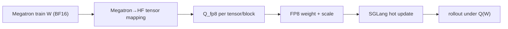

# slime 低精度训练与 Rollout 实现分析

> **定位**：slime 段 1 实现机制 · FP8 / INT4 / KV Cache / Quantized Sync
> **源码基线**：`THUDM/slime@681b3adca54105d5ecd3fb822fa0dc58a427e0f9`
> **系列入口**：[[slime/index]]

## 1. 中心结论：先区分三条精度轴

slime 的“低精度”不是一个总开关，而是三条可独立组合的轴：

1. **训练计算与参数精度**：Megatron BF16 或 experimental FP8 training；
2. **rollout 权重精度**：SGLang 读取 FP8/INT4 HF checkpoint，权重更新时重新量化；
3. **KV cache 精度**：例如 SGLang `fp8_e4m3` KV，只影响 serving cache。

把这三者混为一谈会直接误判训推一致性。例如 BF16 train + FP8 rollout 意味着 optimizer 状态和训练主权重仍是 BF16/FP32 体系，但 rollout 每轮看到的是量化投影 $Q(W)$；FP8 KV 又不会改变提交给 engine 的模型权重。

官方在当前基线给出的成熟度是：BF16 train + FP8 rollout stable，FP8 KV stable 但依赖 SGLang/GPU stack，INT4 rollout/QAT beta，FP8 train + rollout experimental。[`low-precision.md:1-16`](https://github.com/THUDM/slime/blob/681b3adca54105d5ecd3fb822fa0dc58a427e0f9/docs/zh/advanced/low-precision.md#L1-L16)

## 2. 推荐生产路径：BF16 train → FP8 rollout

启动时，`--hf-checkpoint` 指向带 `quantization_config` 的 FP8 HF checkpoint；训练仍从 Megatron BF16/torch_dist checkpoint 初始化。转换工具会把 `quant_method=fp8`、E4M3、dynamic activation 和可选 block size 写进 `config.json`。[`convert_hf_to_fp8.py:185-196`](https://github.com/THUDM/slime/blob/681b3adca54105d5ecd3fb822fa0dc58a427e0f9/tools/convert_hf_to_fp8.py#L185-L196) [`convert_hf_to_fp8.py:236-243`](https://github.com/THUDM/slime/blob/681b3adca54105d5ecd3fb822fa0dc58a427e0f9/tools/convert_hf_to_fp8.py#L236-L243)

Actor 初始化 weight updater 时读取 HF config 中的量化配置，因而“训练端以什么精度保存”与“提交给 rollout 时怎样编码”被分离。[`actor.py:175-181`](https://github.com/THUDM/slime/blob/681b3adca54105d5ecd3fb822fa0dc58a427e0f9/slime/backends/megatron_utils/actor.py#L175-L181)

Megatron→HF processor 按 `quant_method` 分流到 FP8 或 compressed-tensors；未知量化方法则原样透传 BF16，意味着“config 可读”不等于“slime 已实现该格式的在线更新”。[`processors/__init__.py:6-22`](https://github.com/THUDM/slime/blob/681b3adca54105d5ecd3fb822fa0dc58a427e0f9/slime/backends/megatron_utils/megatron_to_hf/processors/__init__.py#L6-L22)

FP8 processor 只对明确列出的 attention、MLP、MoE、linear-attention 权重做量化；blockwise 路径产生 FP8 weight + inverse scale，per-tensor 路径产生 weight + scale，其余参数保持原精度。[`quantizer_fp8.py:10-30`](https://github.com/THUDM/slime/blob/681b3adca54105d5ecd3fb822fa0dc58a427e0f9/slime/backends/megatron_utils/megatron_to_hf/processors/quantizer_fp8.py#L10-L30) [`quantizer_fp8.py:65-113`](https://github.com/THUDM/slime/blob/681b3adca54105d5ecd3fb822fa0dc58a427e0f9/slime/backends/megatron_utils/megatron_to_hf/processors/quantizer_fp8.py#L65-L113)

该路径节省 rollout 显存、weight-transfer bytes 和部分 GEMM 成本，但引入结构性 mismatch：训练 loss 基于 $W$，采样分布基于 $Q(W)$。应通过 rollout/train logprob 对齐指标量化其影响，而不是假设 FP8 “足够接近”。

## 3. FP8 KV cache 是独立 serving 旋钮

`--sglang-kv-cache-dtype fp8_e4m3` 通过 SGLang 参数透传开启，只改变 KV 存储与相关 kernel，不改变 Megatron 训练精度。[`low-precision.md:44-52`](https://github.com/THUDM/slime/blob/681b3adca54105d5ecd3fb822fa0dc58a427e0f9/docs/zh/advanced/low-precision.md#L44-L52)

项目还为 GLM-5 对齐路径集中定义 `DSA_KV_FP8_QAT` 与 block size，并让 train/rollout 共享一组确定性 kernel 环境；这说明 KV QAT 不只是 dtype 字符串，还可能要求训练侧用相同量化误差建模。[`alignment/env.py:19-55`](https://github.com/THUDM/slime/blob/681b3adca54105d5ecd3fb822fa0dc58a427e0f9/slime/backends/megatron_utils/alignment/env.py#L19-L55)

## 4. FP8 training：存储、计算、提交仍是不同阶段

若启用 `fp8_param_gather`，model provider 在 TransformerEngine `fp8_model_init` context 内构建模型，并尽量保留高精度初始化值；依赖不可用时直接失败。[`model_provider.py:183-198`](https://github.com/THUDM/slime/blob/681b3adca54105d5ecd3fb822fa0dc58a427e0f9/slime/backends/megatron_utils/model_provider.py#L183-L198)

Ray actor 默认设置 `NVTE_FP8_BLOCK_SCALING_FP32_SCALES=1`，保证 block scale 使用 FP32 的环境约束在各训练 actor 一致。[`actor_group.py:64-71`](https://github.com/THUDM/slime/blob/681b3adca54105d5ecd3fb822fa0dc58a427e0f9/slime/ray/actor_group.py#L64-L71)

官方实现说明是：TE Linear/GroupLinear 在 FP8 context 中执行；权重更新时先回到 BF16 表示，再按 rollout checkpoint 量化；保存训练 checkpoint 时也回到 BF16。未启用 param gather 时，权重通常仍以 BF16 存储，只在 GEMM 时转换。[`low-precision.md:82-93`](https://github.com/THUDM/slime/blob/681b3adca54105d5ecd3fb822fa0dc58a427e0f9/docs/zh/advanced/low-precision.md#L82-L93)

`fp8_param_gather` 与常见 CPU Adam offload 的冲突是当前明确限制。因此“FP8 training 更省显存”不能脱离 optimizer 方案讨论：参数存储省下的空间可能以放弃 CPU Adam 路径为代价。

## 5. INT4 rollout 与 QAT

INT4 converter 把 group size、4 bit、对称性、ignore rules 和 `compressed-tensors` 格式写入 HF config。[`convert_hf_to_int4_direct.py:245-270`](https://github.com/THUDM/slime/blob/681b3adca54105d5ecd3fb822fa0dc58a427e0f9/tools/convert_hf_to_int4_direct.py#L245-L270)

在线权重转换对非忽略的二维 weight 执行 fake quant、scale/zero-point 计算和 INT4→INT32 packing，输出 `weight_packed / weight_scale / weight_shape` 等 SGLang 可加载字段。[`quantizer_compressed_tensors.py:233-263`](https://github.com/THUDM/slime/blob/681b3adca54105d5ecd3fb822fa0dc58a427e0f9/slime/backends/megatron_utils/megatron_to_hf/processors/quantizer_compressed_tensors.py#L233-L263) [`quantizer_compressed_tensors.py:266-293`](https://github.com/THUDM/slime/blob/681b3adca54105d5ecd3fb822fa0dc58a427e0f9/slime/backends/megatron_utils/megatron_to_hf/processors/quantizer_compressed_tensors.py#L266-L293)

distributed update 对 compressed-tensors 还有额外事务：pause/flush 后先让 engine 恢复可加载表示，发送新权重，再做 post-load quantization，最后 continue generation。[`update_weight_from_distributed.py:102-134`](https://github.com/THUDM/slime/blob/681b3adca54105d5ecd3fb822fa0dc58a427e0f9/slime/backends/megatron_utils/update_weight/update_weight_from_distributed.py#L102-L134)

官方通过 `OPEN_TRAINING_INT4_FAKE_QAT_FLAG` 和 group size 打开训练侧 fake QAT，并明确标 beta。[`low-precision.md:95-125`](https://github.com/THUDM/slime/blob/681b3adca54105d5ecd3fb822fa0dc58a427e0f9/docs/zh/advanced/low-precision.md#L95-L125) 当前 slime 仓库可见 CUDA fake-INT4 kernel、量化转换器与启动脚本；训练时由环境变量触发的具体 Linear/optimizer 注入位于其 Megatron/运行时依赖路径，而不是此仓库内一个独立的 slime Python 注册器。因此评审 QAT 不能只看 slime 主仓库，还要锁定实际安装的 Megatron fork/镜像版本。

## 6. 训推一致性：量化提交改变了比较对象

在 BF16→FP8/INT4 rollout 中，应区分：

| 比较 | 回答的问题 |
|---|---|
| Megatron $W$ vs Megatron reload $W$ | 训练 checkpoint 是否自洽 |
| HF-converted $W$ vs Megatron $W$ | 名称/transpose/concat 是否正确 |
| SGLang $Q(W)$ vs 离线 $Q(W)$ | 在线量化和启动 checkpoint 是否一致 |
| rollout logprob vs train logprob | 量化 + kernel + batching 的总 mismatch |
| update 前后 engine version | 是否所有 rank 原子切到同一 $Q(W_{t+1})$ |

量化误差和权重陈旧不能合并为一个 KL 数字解释。前者在同 version 下存在，后者来自提交时序；诊断时要同时记录 weight version 和 quantization config hash。

## 7. 稳定性检查清单

- 固定每个 checkpoint 的 `quantization_config`，不在训练中途静默改变 block/group size；
- 对 zero block、极小 scale、NaN/Inf 和忽略模块做转换单测；
- 更新前后抽样核对 weight/scale/shape 三元组；
- 记录 FP8/INT4 rollout 与 BF16 rollout 的 response、KL、reward 和吞吐 A/B；
- FP8 KV 单独 A/B，避免把 cache 误差归因于 weight quantization；
- INT4 post-process 必须包含在 pause/flush/continue 事务内；
- FP8 training 同时监控 grad norm、loss scale、overflow、checkpoint reload 和 optimizer 兼容性；
- GPU stack、TransformerEngine、SGLang 与 Megatron 版本应作为实验配置固化。

## 8. 相关页面

- [[16_slime_weight_sync_analysis]]
- [[17_slime_train_inference_consistency_analysis]]
- [[30_slime_rollout_optimization_analysis]]
- [[31_slime_posttraining_stability_analysis]]
