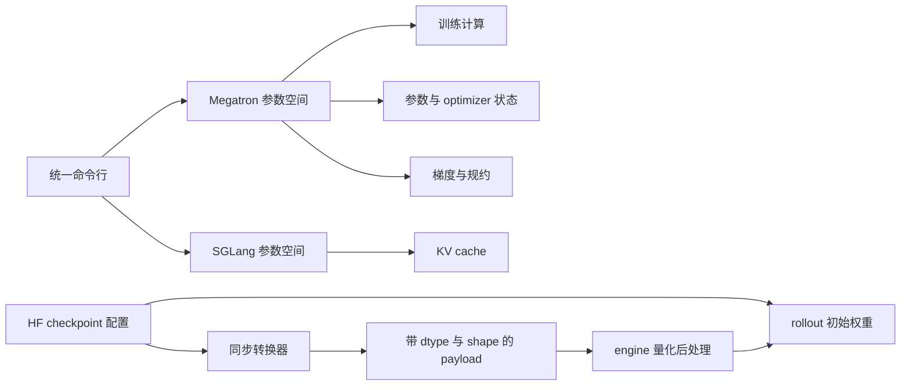

# slime 低精度训推分析：精度不是一个开关

> **源码基线**：slime `main@681b3adca54105d5ecd3fb822fa0dc58a427e0f9`
> **文档基线**：同一提交下 `docs/zh/advanced/low-precision.md` 与 `docs/zh/developer_guide/debug.md`
> **核验日期**：2026-08-18 · **系列**：[[02_engineering/04_posttrain_frameworks/slime/index|slime 源码分析]]
> **结论先行**：slime 没有把“低精度”收敛成一个全局 dtype，而是让训练计算、训练参数与 optimizer 主状态、梯度/规约、同步 payload、rollout 常驻权重、KV cache、engine 量化后处理分别由 Megatron、TransformerEngine、slime 转换层和 SGLang 拥有。这样做不是配置冗余：七个阶段受不同的数值误差、显存目标、checkpoint 可恢复性和 loader ABI 约束。代价是组合空间变大，必须按轴验证；收益是可以保留高精度优化状态，同时只压缩 rollout 或 KV 的容量瓶颈。
> **叙事顺序**：本页按五拍组织——背景 → 为什么这么设计（含被否掉的替代）→ 实现思路与细节 → 约束 → 发展趋势。
> **最近更新**：2026-08-27。按五拍重排章节顺序；机制正文与既有引用未改——既有引用**未**重新核验，故上方**核验日期**不变；本次新增的引用均已在该基线下逐条打开核对。

本文把源码事实与设计分析分开：带 fixed-commit 定位符的是该基线的实现、测试或项目文档；“由此可推断”“设计上可以理解为”表示根据实现边界作出的分析判断，不代表项目作者原话。权重同步的 pause/flush/version 协议由 [[16_slime_weight_sync_analysis]] 负责，训推 logprob 的分层归因与阈值由 [[17_slime_train_inference_consistency_analysis]] 负责；本页只解释量化表示如何进入这两条链路。

## 1. 问题：一个 dtype 回答不了七个问题

项目文档把 BF16 training + FP8 rollout、FP8 KV cache、INT4 rollout/QAT、FP8 training 分别列出成熟度，并把第一种作为当前生产推荐、后两类分别标为 Beta 与 Experimental。这张表本身已经说明它们不是同一个开关的四个名字。[`docs/zh/advanced/low-precision.md:3-16`](https://github.com/THUDM/slime/blob/681b3adca54105d5ecd3fb822fa0dc58a427e0f9/docs/zh/advanced/low-precision.md#L3-L16)

| 精度环节 | 责任组件 | 它决定什么 | 主要误差或兼容性代价 |
|---|---|---|---|
| 训练计算 | Megatron + TransformerEngine | forward/backward 的 Linear、GroupLinear GEMM 是否进入 FP8 recipe | 算子舍入、scale 更新、kernel/硬件支持；embedding 与 LM head 不随之自动变成 FP8。[`low-precision.md:82-89`](https://github.com/THUDM/slime/blob/681b3adca54105d5ecd3fb822fa0dc58a427e0f9/docs/zh/advanced/low-precision.md#L82-L89) |
| 训练参数与 master/optimizer 状态 | Megatron optimizer + TransformerEngine | 参数是否以 BF16 常驻、是否启用 FP8 param gather、主权重与 moments 如何放置 | 更新可恢复性和 optimizer 兼容；`fp8_param_gather` 需要 TE 的 `fp8_model_init`，且项目文档明确其与常用 CPU Adam offload 路径冲突。[`model_provider.py:183-198`](https://github.com/THUDM/slime/blob/681b3adca54105d5ecd3fb822fa0dc58a427e0f9/slime/backends/megatron_utils/model_provider.py#L183-L198) [`low-precision.md:89-93`](https://github.com/THUDM/slime/blob/681b3adca54105d5ecd3fb822fa0dc58a427e0f9/docs/zh/advanced/low-precision.md#L89-L93) |
| 梯度与规约 | Megatron | 梯度累计、all-reduce、attention softmax 等是否保留 FP32 | 累加/规约误差与梯度显存、通信字节；官方 FP8 recipe 仍独立开启 FP32 gradient all-reduce 和 FP32 attention softmax。[`run-qwen3-30b-a3b-fp8.sh:133-141`](https://github.com/THUDM/slime/blob/681b3adca54105d5ecd3fb822fa0dc58a427e0f9/scripts/low_precision/run-qwen3-30b-a3b-fp8.sh#L133-L141) |
| 权重传输表示 | slime Megatron→HF processor + updater | 发送的是 BF16 tensor，还是 FP8 weight/scale、INT4 packed weight/scale/shape | payload 字节、转换临时显存、命名/shape/dtype ABI；发送接口把每个 tensor 的 dtype 与 shape 显式交给 engine。[`update_weight_from_distributed.py:153-175`](https://github.com/THUDM/slime/blob/681b3adca54105d5ecd3fb822fa0dc58a427e0f9/slime/backends/megatron_utils/update_weight/update_weight_from_distributed.py#L153-L175) [`sglang_engine.py:414-438`](https://github.com/THUDM/slime/blob/681b3adca54105d5ecd3fb822fa0dc58a427e0f9/slime/backends/sglang_utils/sglang_engine.py#L414-L438) |
| rollout 常驻权重 | SGLang loader，由 HF `quantization_config` 描述 | engine 最终以何种 weight schema 执行 rollout | behavior policy 所见的是转换后的表示；FP8 processor 只量化白名单层，其余参数原样保留。[`quantizer_fp8.py:31-91`](https://github.com/THUDM/slime/blob/681b3adca54105d5ecd3fb822fa0dc58a427e0f9/slime/backends/megatron_utils/megatron_to_hf/processors/quantizer_fp8.py#L31-L91) |
| KV cache | SGLang ServerArgs | attention 历史状态以何种 dtype 常驻 | cache 容量、attention 数值与 SGLang/GPU stack 支持；它不改变 Megatron 训练精度。[`low-precision.md:44-52`](https://github.com/THUDM/slime/blob/681b3adca54105d5ecd3fb822fa0dc58a427e0f9/docs/zh/advanced/low-precision.md#L44-L52) |
| 量化后处理 | SGLang loader hook，由 slime 编排调用 | compressed-tensors 更新前恢复可加载状态、更新后重新建立运行时量化表示 | engine 内部状态必须与 loader schema 匹配；该步骤只对 compressed-tensors 分支触发。[`update_weight_from_distributed.py:102-134`](https://github.com/THUDM/slime/blob/681b3adca54105d5ecd3fb822fa0dc58a427e0f9/slime/backends/megatron_utils/update_weight/update_weight_from_distributed.py#L102-L134) |

> **设计分析**：这七个精度环节分别由不同组件负责，并不表示它们可以任意组合。例如 FP8 rollout 的数据格式受 HF checkpoint 约束，`fp8_param_gather` 又受优化器实现约束。分开讨论的意义是先找对责任组件和故障范围，再判断某个具体组合是否已被当前依赖栈实现。

## 2. 为什么这么设计：为什么不选三个直观替代方案

### 2.1 一个全局 dtype 开关

**直觉**：设置 `--dtype fp8`，训练、同步、rollout 与 KV 全部跟随。

**为什么不成立**：slime 实际上独立解析 Megatron 和 SGLang 参数；HF `quantization_config` 又走第三条配置通道。[`arguments.py:1600-1643`](https://github.com/THUDM/slime/blob/681b3adca54105d5ecd3fb822fa0dc58a427e0f9/slime/utils/arguments.py#L1600-L1643) 训练 FP8 只覆盖 TE 的部分层，FP8 rollout 需要 weight + scale schema，KV dtype 则是 ServerArgs。一个值无法同时表达“FP8 GEMM + BF16 参数 + FP32 规约 + FP8 rollout weight + 独立 KV dtype”这种合法组合。[`low-precision.md:82-93`](https://github.com/THUDM/slime/blob/681b3adca54105d5ecd3fb822fa0dc58a427e0f9/docs/zh/advanced/low-precision.md#L82-L93) [`low-precision.md:44-52`](https://github.com/THUDM/slime/blob/681b3adca54105d5ecd3fb822fa0dc58a427e0f9/docs/zh/advanced/low-precision.md#L44-L52)

### 2.2 直接用 rollout 量化格式训练

**直觉**：既然 engine 要 FP8/INT4，就让 optimizer 直接更新同一份 packed 权重，省掉转换。

**为什么不成立**：固定基线的 HF→Megatron FP8 reader 会读取 weight 与 inverse scale、反量化到 BF16，再复制到目标 parameter dtype；它没有让 Megatron parameter 保持 rollout 的 block-FP8 schema。[`hf_to_megatron/common.py:33-57`](https://github.com/THUDM/slime/blob/681b3adca54105d5ecd3fb822fa0dc58a427e0f9/slime/backends/megatron_utils/hf_to_megatron/common.py#L33-L57) [`hf_to_megatron/common.py:146-167`](https://github.com/THUDM/slime/blob/681b3adca54105d5ecd3fb822fa0dc58a427e0f9/slime/backends/megatron_utils/hf_to_megatron/common.py#L146-L167) INT4 rollout payload更是 packed weight + scale + shape；官方 QAT recipe 选择 BF16/Megatron checkpoint 加 fake-QAT 环境，而非让 optimizer 直接更新 packed INT32 tensor。[`run-qwen3-30B-A3B-int4.sh:29-35`](https://github.com/THUDM/slime/blob/681b3adca54105d5ecd3fb822fa0dc58a427e0f9/scripts/low_precision/run-qwen3-30B-A3B-int4.sh#L29-L35) [`run-qwen3-30B-A3B-int4.sh:138-145`](https://github.com/THUDM/slime/blob/681b3adca54105d5ecd3fb822fa0dc58a427e0f9/scripts/low_precision/run-qwen3-30B-A3B-int4.sh#L138-L145)

> **设计分析**：fake QAT 的作用是在可微训练表示中暴露量化误差；它不是把 rollout loader 的 packed storage 变成 optimizer-native 参数。两者解决的问题不同。

### 2.3 假设低精度只改变显存

**直觉**：bit width 更小，只需重新估算显存。

**为什么不成立**：FP8 引入 scale 计算与额外 tensor，INT4 引入 rounding、packing、ignore rules 和 engine postprocess；这些都会改变同步 payload、更新关键路径与 loader 兼容边界。[`quantizer_fp8.py:94-113`](https://github.com/THUDM/slime/blob/681b3adca54105d5ecd3fb822fa0dc58a427e0f9/slime/backends/megatron_utils/megatron_to_hf/processors/quantizer_fp8.py#L94-L113) [`quantizer_compressed_tensors.py:233-293`](https://github.com/THUDM/slime/blob/681b3adca54105d5ecd3fb822fa0dc58a427e0f9/slime/backends/megatron_utils/megatron_to_hf/processors/quantizer_compressed_tensors.py#L233-L293) [`update_weight_from_distributed.py:102-134`](https://github.com/THUDM/slime/blob/681b3adca54105d5ecd3fb822fa0dc58a427e0f9/slime/backends/megatron_utils/update_weight/update_weight_from_distributed.py#L102-L134)

三个方案被否掉之后，剩下的问题就是“分轴之后每一轴归谁、怎么传、代价记在哪本账上”：分轴的约束来源见第 3 节，配置通道见第 4 节，同步转换见第 5 节，数值与容量账本见第 6 节，约束与失败模式见第 7 节。

## 3. 约束如何逼出分轴设计

### 3.1 训练 checkpoint 与 rollout checkpoint 承担不同职责

`--hf-checkpoint` 用来初始化 SGLang、提供 tokenizer 和 Megatron→HF 转换所需的模型身份；帮助文本还明确指出，训练开始前会用 Megatron 参数更新 SGLang，因此该 HF 目录不必携带最新训练权重。[`arguments.py:304-325`](https://github.com/THUDM/slime/blob/681b3adca54105d5ecd3fb822fa0dc58a427e0f9/slime/utils/arguments.py#L304-L325) 相对地，`--ref-load` 在没有 `--load` 时成为训练初始 checkpoint；训练 checkpoint 是否保存 optimizer state 又决定能否恢复训练。[`arguments.py:840-865`](https://github.com/THUDM/slime/blob/681b3adca54105d5ecd3fb822fa0dc58a427e0f9/slime/utils/arguments.py#L840-L865)

官方低精度 recipe 因而同时指定 FP8 HF checkpoint 与 BF16/torch_dist training checkpoint，而不是让一个路径兼任两种 ABI。[`run-qwen3-30b-a3b-fp8.sh:30-39`](https://github.com/THUDM/slime/blob/681b3adca54105d5ecd3fb822fa0dc58a427e0f9/scripts/low_precision/run-qwen3-30b-a3b-fp8.sh#L30-L39)

> **设计分析**：训练侧需要 optimizer 可恢复状态和可微更新表示；rollout 侧需要 loader 可识别、常驻更小、kernel 可执行的表示。把 checkpoint 路径拆开，比要求一种格式同时满足两组目标更直接。

### 3.2 “低精度”不能抹掉高精度累加边界

slime 在 Megatron 参数默认化时令 `bf16 = not fp16`，而训练计算、optimizer、梯度规约的其余选项仍由 Megatron parser 接收。[`arguments.py:147-165`](https://github.com/THUDM/slime/blob/681b3adca54105d5ecd3fb822fa0dc58a427e0f9/slime/backends/megatron_utils/arguments.py#L147-L165) 官方 FP8 training 脚本把 `--bf16`、FP8 recipe、CPU optimizer offload、precision-aware optimizer、FP32 gradient all-reduce 分别列在不同参数组中。[`run-qwen3-30b-a3b-fp8.sh:86-116`](https://github.com/THUDM/slime/blob/681b3adca54105d5ecd3fb822fa0dc58a427e0f9/scripts/low_precision/run-qwen3-30b-a3b-fp8.sh#L86-L116) [`run-qwen3-30b-a3b-fp8.sh:133-141`](https://github.com/THUDM/slime/blob/681b3adca54105d5ecd3fb822fa0dc58a427e0f9/scripts/low_precision/run-qwen3-30b-a3b-fp8.sh#L133-L141)

这意味着“FP8 training”在该 recipe 中描述的是特定 GEMM 路径，不等于“参数、梯度、optimizer state、softmax 全部 FP8”。项目文档也明确限定：只有 TE Linear/GroupLinear 使用 FP8，embedding 和 LM head 保持原精度；未开 param gather 时权重仍以 BF16 存储。[`low-precision.md:82-93`](https://github.com/THUDM/slime/blob/681b3adca54105d5ecd3fb822fa0dc58a427e0f9/docs/zh/advanced/low-precision.md#L82-L93)

### 3.3 rollout loader 的格式契约比 dtype 名更严格

FP8 不只是把 tensor cast 为八位：blockwise 路径输出 FP8 weight 与 inverse scale，per-tensor 路径输出 FP8 weight 与 scale，并只接受 E4M3 + dynamic activation schema。[`quantizer_fp8.py:10-15`](https://github.com/THUDM/slime/blob/681b3adca54105d5ecd3fb822fa0dc58a427e0f9/slime/backends/megatron_utils/megatron_to_hf/processors/quantizer_fp8.py#L10-L15) [`quantizer_fp8.py:94-113`](https://github.com/THUDM/slime/blob/681b3adca54105d5ecd3fb822fa0dc58a427e0f9/slime/backends/megatron_utils/megatron_to_hf/processors/quantizer_fp8.py#L94-L113)

INT4 更不是一个 `torch.int4` tensor：在线 converter 生成 `weight_packed`、`weight_scale`、`weight_shape`，非对称方案还会生成 zero point；group size、对称性和 ignore rules 都来自 checkpoint 的 compressed-tensors 配置。[`quantizer_compressed_tensors.py:266-293`](https://github.com/THUDM/slime/blob/681b3adca54105d5ecd3fb822fa0dc58a427e0f9/slime/backends/megatron_utils/megatron_to_hf/processors/quantizer_compressed_tensors.py#L266-L293)

> **设计分析**：因此兼容性的最小单位不是“FP8”或“INT4”这个标签，而是完整的 `{参数名, shape, dtype, scale 布局, ignore 集, 后处理}` schema。只比较 bit width 会漏掉最常见的 loader 失败。

## 4. 配置如何传到各自负责的组件

### 4.1 两个参数解析器先各自解析，再合并到同一命名空间

slime 先用独立 parser 解析 SGLang 参数，再让 Megatron parser 忽略未知的 `--sglang-*` 参数，最后把两个 namespace 合并并分别校验。[`arguments.py:1600-1643`](https://github.com/THUDM/slime/blob/681b3adca54105d5ecd3fb822fa0dc58a427e0f9/slime/utils/arguments.py#L1600-L1643) SGLang 的原生 `ServerArgs` 会被包装成 `--sglang-` 前缀，字段名也变成 `sglang_*`，避免与训练参数同名碰撞。[`sglang_utils/arguments.py:38-118`](https://github.com/THUDM/slime/blob/681b3adca54105d5ecd3fb822fa0dc58a427e0f9/slime/backends/sglang_utils/arguments.py#L38-L118)

engine 启动时，`model_path` 来自 `args.hf_checkpoint`；随后所有匹配 `ServerArgs` 的 `args.sglang_*` 字段才进入 server kwargs。因此 `--sglang-kv-cache-dtype` 属于 rollout server，而不是训练 dtype 的别名。[`sglang_engine.py:523-565`](https://github.com/THUDM/slime/blob/681b3adca54105d5ecd3fb822fa0dc58a427e0f9/slime/backends/sglang_utils/sglang_engine.py#L523-L565) [`sglang_engine.py:592-600`](https://github.com/THUDM/slime/blob/681b3adca54105d5ecd3fb822fa0dc58a427e0f9/slime/backends/sglang_utils/sglang_engine.py#L592-L600)

### 4.2 HF `quantization_config` 同时约束启动和后续同步

FP8 转换工具把 `activation_scheme=dynamic`、`fmt=e4m3`、`quant_method=fp8` 和可选 block/scale 格式写入输出 `config.json`。[`convert_hf_to_fp8.py:185-196`](https://github.com/THUDM/slime/blob/681b3adca54105d5ecd3fb822fa0dc58a427e0f9/tools/convert_hf_to_fp8.py#L185-L196) INT4 工具则写入 4-bit group quant、对称性、ignore rules、packed format 与 `compressed-tensors` 方法。[`convert_hf_to_int4_direct.py:238-270`](https://github.com/THUDM/slime/blob/681b3adca54105d5ecd3fb822fa0dc58a427e0f9/tools/convert_hf_to_int4_direct.py#L238-L270)

训练 actor 读取同一个 HF config，并把其中的 `quantization_config` 交给选定的 weight updater。[`actor.py:151-181`](https://github.com/THUDM/slime/blob/681b3adca54105d5ecd3fb822fa0dc58a427e0f9/slime/backends/megatron_utils/actor.py#L151-L181) 同步 converter 先完成 Megatron→HF 名称/布局转换，再按 `quant_method` 分派 FP8 或 compressed-tensors processor；未知方法会原样透传 BF16 tensor。[`megatron_to_hf/__init__.py:23-33`](https://github.com/THUDM/slime/blob/681b3adca54105d5ecd3fb822fa0dc58a427e0f9/slime/backends/megatron_utils/megatron_to_hf/__init__.py#L23-L33) [`processors/__init__.py:6-22`](https://github.com/THUDM/slime/blob/681b3adca54105d5ecd3fb822fa0dc58a427e0f9/slime/backends/megatron_utils/megatron_to_hf/processors/__init__.py#L6-L22)

> **设计分析**：HF checkpoint 在这里不只是冷启动权重，它还是 rollout loader 与在线同步之间的格式清单。启动 checkpoint 和在线更新若使用不同量化 schema，即使二者都叫“FP8”，也不构成同一运行时契约。

### 4.3 三种官方示例实际启用的是不同精度环节

| 官方示例 | 训练计算/存储 | 梯度与规约 | rollout 权重 | KV cache | 后处理 |
|---|---|---|---|---|---|
| BF16 train + FP8 rollout | 训练保持 BF16/torch_dist | 可独立选择 FP32 规约 | HF config 驱动在线 FP8 conversion | 独立可选 | FP8 processor 直接产出 weight + scale |
| FP8 train + FP8 rollout | TE FP8 GEMM；param gather 可选，未开时参数仍 BF16 | 仍可保留 FP32 规约 | 训练权重先回到 BF16 表示，再按 rollout schema 量化 | 独立可选 | 与 rollout checkpoint 的 FP8 schema一致 |
| BF16 train + INT4 fake QAT + INT4 rollout | 训练 checkpoint 仍与 rollout INT4 checkpoint 分离；fake QAT 由 runtime env 开启 | 官方脚本仍启用 FP32 规约 | packed INT4 + scale + shape | 独立可选 | load 前 restore、load 后 quantization postprocess |

表中 FP8 train 的转换与 checkpoint 行为来自项目实现说明；INT4 recipe 同时给出 INT4 `--hf-checkpoint`、Megatron `--ref-load`、CPU optimizer offload、FP32 gradient all-reduce 和 fake-QAT 环境变量。[`low-precision.md:82-93`](https://github.com/THUDM/slime/blob/681b3adca54105d5ecd3fb822fa0dc58a427e0f9/docs/zh/advanced/low-precision.md#L82-L93) [`run-qwen3-30B-A3B-int4.sh:29-35`](https://github.com/THUDM/slime/blob/681b3adca54105d5ecd3fb822fa0dc58a427e0f9/scripts/low_precision/run-qwen3-30B-A3B-int4.sh#L29-L35) [`run-qwen3-30B-A3B-int4.sh:93-104`](https://github.com/THUDM/slime/blob/681b3adca54105d5ecd3fb822fa0dc58a427e0f9/scripts/low_precision/run-qwen3-30B-A3B-int4.sh#L93-L104) [`run-qwen3-30B-A3B-int4.sh:119-145`](https://github.com/THUDM/slime/blob/681b3adca54105d5ecd3fb822fa0dc58a427e0f9/scripts/low_precision/run-qwen3-30B-A3B-int4.sh#L119-L145)

## 5. 同步转换：传输格式不是训练存储格式

以 distributed updater 为例，训练参数先按 TP/EP 规则 gather 成可转换 tensor，再调用 `convert_to_hf`；buffer 大小按转换后各 tensor 的 `numel × element_size` 计算，说明 bucket 和传输成本取决于生成出的混合 dtype payload，而不是一个全局训练 dtype。[`update_weight_from_distributed.py:153-175`](https://github.com/THUDM/slime/blob/681b3adca54105d5ecd3fb822fa0dc58a427e0f9/slime/backends/megatron_utils/update_weight/update_weight_from_distributed.py#L153-L175)

FP8 processor 只处理明确列出的 attention/MLP/MoE/linear-attention weight；scale 字段、embedding、norm、bias 等不会被同一规则盲目量化。[`quantizer_fp8.py:31-91`](https://github.com/THUDM/slime/blob/681b3adca54105d5ecd3fb822fa0dc58a427e0f9/slime/backends/megatron_utils/megatron_to_hf/processors/quantizer_fp8.py#L31-L91) INT4 processor 则对未被 ignore、以 `.weight` 结尾且至少二维的参数打包，其余 tensor 原样进入结果。[`quantizer_compressed_tensors.py:266-293`](https://github.com/THUDM/slime/blob/681b3adca54105d5ecd3fb822fa0dc58a427e0f9/slime/backends/megatron_utils/megatron_to_hf/processors/quantizer_compressed_tensors.py#L266-L293)

由此可推断，传输字节数更接近下式，而不是“参数量乘一个统一 bit width”：

$$
B_{\mathrm{sync}}
=\sum_{j\in\mathcal P} n_j b_j / 8
+B_{\mathrm{scale}}
+B_{\mathrm{shape}}
+B_{\mathrm{zero\ point}}.
$$

其中 $\mathcal P$ 是实际发送的 payload tensor 集合，$n_j$ 与 $b_j$ 分别是第 $j$ 个 tensor 的元素数和位宽；后三项只在相应量化 schema 中存在。源码实际按每个 tensor 的元素数与元素字节数累积 bucket，engine RPC 也逐 tensor 携带 dtype/shape。[`update_weight_from_distributed.py:167-174`](https://github.com/THUDM/slime/blob/681b3adca54105d5ecd3fb822fa0dc58a427e0f9/slime/backends/megatron_utils/update_weight/update_weight_from_distributed.py#L167-L174) [`sglang_engine.py:414-438`](https://github.com/THUDM/slime/blob/681b3adca54105d5ecd3fb822fa0dc58a427e0f9/slime/backends/sglang_utils/sglang_engine.py#L414-L438)

compressed-tensors 还要求 load 前后的 engine hook：更新前请求恢复权重，发送结束后请求量化 postprocess，之后才允许继续 generation。[`update_weight_from_distributed.py:102-134`](https://github.com/THUDM/slime/blob/681b3adca54105d5ecd3fb822fa0dc58a427e0f9/slime/backends/megatron_utils/update_weight/update_weight_from_distributed.py#L102-L134) 本页只把它视为“量化 schema 完成所需的转换阶段”；其原子提交语义见 [[16_slime_weight_sync_analysis]]。

## 6. 数值与容量：每个旋钮只改变部分账本

一个有用的容量模型是把训练与 rollout 分开：

$$
\begin{aligned}
M_{\mathrm{train}}
&=M_{\mathrm{param}}+M_{\mathrm{master/optimizer}}+M_{\mathrm{grad}}+M_{\mathrm{activation}}+M_{\mathrm{temporary}}, \\
M_{\mathrm{rollout}}
&=M_{\mathrm{weight}}+M_{\mathrm{KV}}+M_{\mathrm{workspace}}+M_{\mathrm{temporary}}.
\end{aligned}
$$

这是分析模型，不是源码里的精确 profiler 公式。它揭示了三个容易混淆的后果：

1. **FP8 training compute 不必降低训练参数常驻项。** 未启用 `fp8_param_gather` 时，文档明确说 TE 权重以 BF16 存储，只在 GEMM/GroupGEMM 时转换为 FP8；因此它首先改变计算 kernel 与临时量化，而不是自动消除 master/optimizer 或 gradient 项。[`low-precision.md:82-93`](https://github.com/THUDM/slime/blob/681b3adca54105d5ecd3fb822fa0dc58a427e0f9/docs/zh/advanced/low-precision.md#L82-L93)
2. **FP32 gradient reduction 会保留单独的容量与带宽成本。** 官方 FP8 与 INT4 recipes 都在低精度计算/rollout 之外显式开启 `--accumulate-allreduce-grads-in-fp32`；降低 weight 位宽并不会改写这个选择。[`run-qwen3-30b-a3b-fp8.sh:133-141`](https://github.com/THUDM/slime/blob/681b3adca54105d5ecd3fb822fa0dc58a427e0f9/scripts/low_precision/run-qwen3-30b-a3b-fp8.sh#L133-L141) [`run-qwen3-30B-A3B-int4.sh:119-127`](https://github.com/THUDM/slime/blob/681b3adca54105d5ecd3fb822fa0dc58a427e0f9/scripts/low_precision/run-qwen3-30B-A3B-int4.sh#L119-L127)
3. **KV FP8 只压缩 rollout 的 cache 项。** 项目把它定义为 `--sglang-` 参数，并明确说不会改变 Megatron 训练精度；实际收益依赖 SGLang 版本与 GPU stack。[`low-precision.md:44-52`](https://github.com/THUDM/slime/blob/681b3adca54105d5ecd3fb822fa0dc58a427e0f9/docs/zh/advanced/low-precision.md#L44-L52)

数值上，训练更新发生在训练表示 $W_t$ 上，而量化 rollout 运行在由 checkpoint schema 决定的投影 $Q_c(W_t)$ 上：

$$
W_t^{\mathrm{rollout}}=Q_c\!\left(W_t^{\mathrm{train}}\right),
$$

其中 $c$ 包含 block/group size、scale 格式、ignore rules 和后处理约定。这个表达式只说明比较对象不同，不声称任何固定精度损失。FP8 实现按 block 或 tensor 计算 scale 并 clamp/cast，INT4 实现会 round、pack 并附带 scale/shape，因此 $Q_c$ 不是恒等映射。[`quantizer_fp8.py:94-113`](https://github.com/THUDM/slime/blob/681b3adca54105d5ecd3fb822fa0dc58a427e0f9/slime/backends/megatron_utils/megatron_to_hf/processors/quantizer_fp8.py#L94-L113) [`quantizer_compressed_tensors.py:233-293`](https://github.com/THUDM/slime/blob/681b3adca54105d5ecd3fb822fa0dc58a427e0f9/slime/backends/megatron_utils/megatron_to_hf/processors/quantizer_compressed_tensors.py#L233-L293)

## 7. 约束与失败模式：组合合法不等于实现兼容

| 失败模式 | 形成原因 | 应检查哪个精度环节 |
|---|---|---|
| HF config 声称一种量化法，在线 updater 却不支持 | processor 对未知 `quant_method` 直接透传 BF16；“config 可读”不等于“在线更新已实现”。[`processors/__init__.py:6-22`](https://github.com/THUDM/slime/blob/681b3adca54105d5ecd3fb822fa0dc58a427e0f9/slime/backends/megatron_utils/megatron_to_hf/processors/__init__.py#L6-L22) | rollout schema + transport |
| 把“FP8 rollout”理解成全模型 FP8 | FP8 processor 只量化匹配的层，其他参数原样返回。[`quantizer_fp8.py:31-91`](https://github.com/THUDM/slime/blob/681b3adca54105d5ecd3fb822fa0dc58a427e0f9/slime/backends/megatron_utils/megatron_to_hf/processors/quantizer_fp8.py#L31-L91) | rollout 常驻权重 |
| INT4 ignore list 漏掉非 Linear 的二维 weight | 在线量化器会产生 loader 不消费的量化名字；项目 debug 文档记录了 MoE gate 被静默跳过、权重保持全零的具体故障。[`debug.md:57-69`](https://github.com/THUDM/slime/blob/681b3adca54105d5ecd3fb822fa0dc58a427e0f9/docs/zh/developer_guide/debug.md#L57-L69) | schema + 后处理 |
| 全零 FP8 block 产生零 scale | converter 必须把 block max clamp 到至少 `1e-12`；对应单测要求无 NaN/Inf 且零块反量化仍为零。[`convert_hf_to_fp8.py:39-73`](https://github.com/THUDM/slime/blob/681b3adca54105d5ecd3fb822fa0dc58a427e0f9/tools/convert_hf_to_fp8.py#L39-L73) [`test_block_fp8_zero_block.py:38-60`](https://github.com/THUDM/slime/blob/681b3adca54105d5ecd3fb822fa0dc58a427e0f9/tests/test_block_fp8_zero_block.py#L38-L60) | converter 数值 |
| 打开 `fp8_param_gather` 后沿用 CPU Adam offload | 文档明确当前需要 TE FusedAdam；model provider 缺少 `fp8_model_init` 时也会直接失败。[`low-precision.md:89-93`](https://github.com/THUDM/slime/blob/681b3adca54105d5ecd3fb822fa0dc58a427e0f9/docs/zh/advanced/low-precision.md#L89-L93) [`model_provider.py:183-198`](https://github.com/THUDM/slime/blob/681b3adca54105d5ecd3fb822fa0dc58a427e0f9/slime/backends/megatron_utils/model_provider.py#L183-L198) | 参数/master storage |
| 把 FP8 KV 当成 weight quantization | 它经 `--sglang-` ServerArgs 进入 engine，只改变 rollout cache 路径，且依赖 SGLang/GPU stack。[`low-precision.md:44-52`](https://github.com/THUDM/slime/blob/681b3adca54105d5ecd3fb822fa0dc58a427e0f9/docs/zh/advanced/low-precision.md#L44-L52) | KV cache |
| compressed-tensors 更新后漏做 postprocess | updater 只在该 quant method 下调用 restore 与 quantization postprocess；漏掉会让 engine 停留在不完整的运行时表示。[`update_weight_from_distributed.py:102-134`](https://github.com/THUDM/slime/blob/681b3adca54105d5ecd3fb822fa0dc58a427e0f9/slime/backends/megatron_utils/update_weight/update_weight_from_distributed.py#L102-L134) | 后处理 |

## 8. 验证策略：按精度环节设置门禁，而不是只看一次 loss

1. **静态配置 gate**：记录训练 checkpoint、HF checkpoint、`quant_method`、block/group size、scale format、ignore rules、FP8 recipe、param gather、gradient reduction 和 KV dtype。HF converter 会把这些量化字段写入 `config.json`，actor 又从该 config 构造 updater，因此配置审计应以落盘后的 config 为准。[`convert_hf_to_fp8.py:185-240`](https://github.com/THUDM/slime/blob/681b3adca54105d5ecd3fb822fa0dc58a427e0f9/tools/convert_hf_to_fp8.py#L185-L240) [`actor.py:175-181`](https://github.com/THUDM/slime/blob/681b3adca54105d5ecd3fb822fa0dc58a427e0f9/slime/backends/megatron_utils/actor.py#L175-L181)
2. **转换器 gate**：对零块、极值、非整 block/group shape、ignore regex、量化/非量化混合字段分别做单测；当前仓库已有 zero-block NaN 与 roundtrip gate，但这不等价于覆盖全部 schema。[`test_block_fp8_zero_block.py:38-75`](https://github.com/THUDM/slime/blob/681b3adca54105d5ecd3fb822fa0dc58a427e0f9/tests/test_block_fp8_zero_block.py#L38-L75)
3. **payload ABI gate**：逐层核对输出参数名、dtype、shape，以及 FP8 scale 或 INT4 packed/scale/shape 是否成组出现；engine API本身就是按 names/dtypes/shapes 接收更新。[`sglang_engine.py:414-438`](https://github.com/THUDM/slime/blob/681b3adca54105d5ecd3fb822fa0dc58a427e0f9/slime/backends/sglang_utils/sglang_engine.py#L414-L438)
4. **训练状态 gate**：分别验证训练 checkpoint reload、optimizer state reload、FP8 param gather 依赖与 gradient dtype；不要用 rollout 成功替代训练可恢复性。`--no-save-optim` 的帮助文本明确说明省略 optimizer state 会禁用训练恢复。[`arguments.py:857-865`](https://github.com/THUDM/slime/blob/681b3adca54105d5ecd3fb822fa0dc58a427e0f9/slime/utils/arguments.py#L857-L865)
5. **运行时容量门槛**：分别记录训练峰值、同步转换峰值、rollout 权重常驻量、KV cache 占用和后处理时延；只有这样才能判断某个低精度环节是否真正缓解了瓶颈。源码按转换后张量的实际字节数分桶，说明同步成本不能由训练参数 dtype 直接推出。[`update_weight_from_distributed.py:167-175`](https://github.com/THUDM/slime/blob/681b3adca54105d5ecd3fb822fa0dc58a427e0f9/slime/backends/megatron_utils/update_weight/update_weight_from_distributed.py#L167-L175)
6. **行为 gate**：在配置、版本和样本固定后，再比较量化与非量化 rollout 的行为；本页不规定 KL/logprob 阈值，因为阈值必须按模型、kernel 和 recipe 标定。分层定位方法见 [[17_slime_train_inference_consistency_analysis]]。

## 9. 发展趋势

> [!note] 推断
> 本节只引用固定基线里实际存在的 TODO 作为锚点，不构成项目路线图；锚点原文附定位符，判断部分是本页推断。

三个锚点都不指向“再加一种量化格式”，而是指向**当前这几条默认线是临时的、在等上游**：

- **强制 BF16 的默认值被标注为等 Megatron 的 FP8 支持。** `_set_default_megatron_args` 里 `args.bf16 = not args.fp16` 这一行上方的原文是 “TODO: maybe change this after megatron has good fp8 support”。[`megatron_utils/arguments.py:150-151`](https://github.com/THUDM/slime/blob/681b3adca54105d5ecd3fb822fa0dc58a427e0f9/slime/backends/megatron_utils/arguments.py#L150-L151) 第 3.2 节据此说明“训练存储默认落在 BF16”，**由此可推断**：这不是一个经过论证的数值选择，而是等待上游能力的占位默认；FP8 训练当前只能通过 TE recipe 覆盖部分 GEMM，第 6 节所说“FP8 training compute 不必降低参数常驻项”正是这个占位默认的直接后果。
- **optimizer-CPU-offload 与 checkpoint 保存的冲突挂在上游 bug 上。** 同一函数里 `args.dist_ckpt_save_pre_mcore_014 = True` 的注释原文是 “TODO: revisit this when megatron(dev) have solved the optimizer-cpu-offload ckpt saving bug”。[`megatron_utils/arguments.py:164-165`](https://github.com/THUDM/slime/blob/681b3adca54105d5ecd3fb822fa0dc58a427e0f9/slime/backends/megatron_utils/arguments.py#L164-L165) 这与第 7 节“打开 `fp8_param_gather` 后沿用 CPU Adam offload”的失败模式是同一族问题：低精度 recipe 常与 CPU optimizer offload 搭配，而 offload 与 dist-checkpoint 保存路径的兼容目前靠一个向后兼容开关兜住。**由此可推断**，第 8 节第 4 条“训练状态 gate”不能省——可恢复性在这条线上还没有稳定到可以默认信任。
- **另一条转换入口还没有接上量化。** `postprocess_hf_param` 顶上写着 “TODO unify w/ `convert_to_hf`”，函数体内 `remove_padding` 之后紧跟 “TODO support quant” 就直接返回。[`megatron_to_hf/__init__.py:15-19`](https://github.com/THUDM/slime/blob/681b3adca54105d5ecd3fb822fa0dc58a427e0f9/slime/backends/megatron_utils/megatron_to_hf/__init__.py#L15-L19) 该函数在固定基线的 `slime/` 与 `tools/` 中没有任何调用点（`git grep postprocess_hf_param` 只命中定义处与 `docker/npu_patch/slime.patch` 的 diff 上下文）。**由此可推断**：第 4.2 与第 5 节所述的 `convert_to_hf` → `quantize_params` 是固定基线里唯一带量化的转换链，任何走 `postprocess_hf_param` 的派生分支（如 NPU patch）都要自己补量化。

反面同样要写清楚：INT4/QAT 的 Experimental 状态、FP8 KV 的可用性、compressed-tensors 之外的量化方法，在固定基线里只有成熟度表述，**没有**任何 TODO、deprecation 或 issue 引用可以支撑“下一步会怎样”。[`low-precision.md:3-16`](https://github.com/THUDM/slime/blob/681b3adca54105d5ecd3fb822fa0dc58a427e0f9/docs/zh/advanced/low-precision.md#L3-L16) 这几项因此只能按现状使用，不能按趋势规划。

## Related Pages

- [[14_slime_megatron_training_analysis]] — 训练 actor 如何把 Megatron-native model、optimizer 与 checkpoint 生命周期封装起来。
- [[16_slime_weight_sync_analysis]] — 本页的量化 payload 如何进入 pause、传输、提交与 resume 协议。
- [[17_slime_train_inference_consistency_analysis]] — 当训练表示与 rollout 量化表示不同时，如何分层定位 logprob 差异。
- [[31_slime_posttraining_stability_analysis]] — 低精度 NaN、异常 scale 与其他训练稳定性信号如何纳入统一防线。
