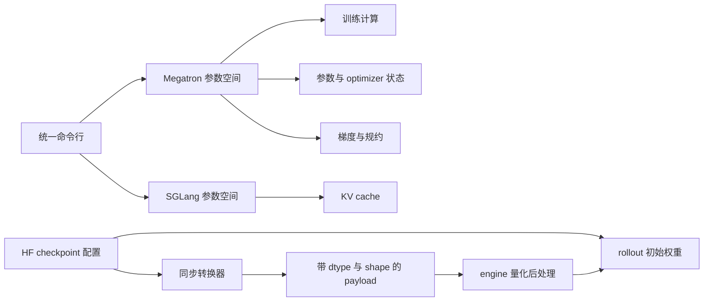
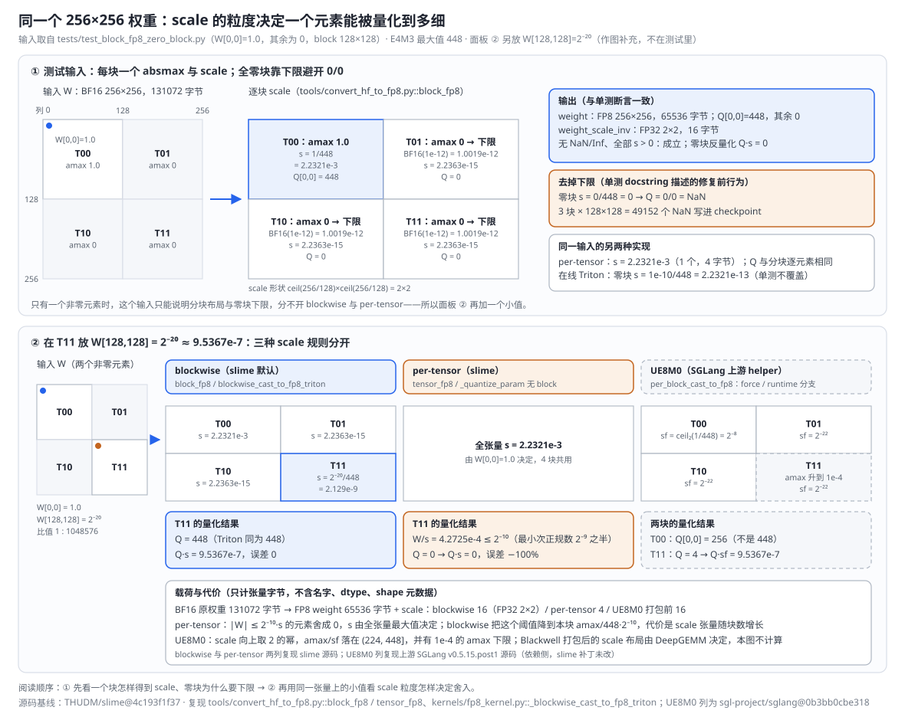
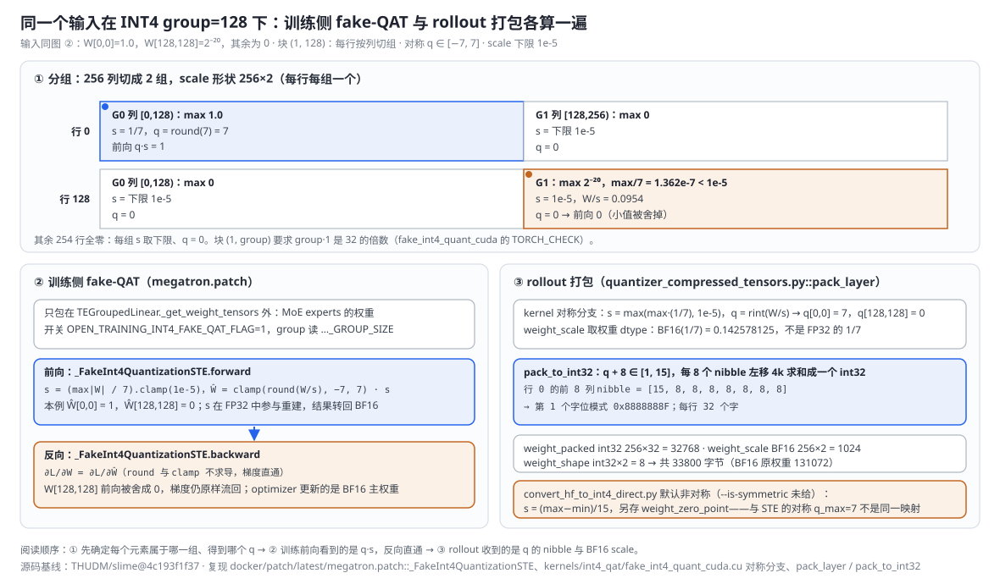

# slime 低精度训推分析：精度不是一个开关

> **源码基线**：`THUDM/slime@4c193f1f37509cca70f0e88807a9305b70f63f4e`（`main`，2026-09-03）
> **源码基线**：`NVIDIA/Megatron-LM@1dcf0dafa884ad52ffb243625717a3471643e087`（slime `docker/Dockerfile` 钉定，2026-02-14）
> **源码基线**：`sgl-project/sglang@0b3bb0cbe31873994c9f989fddfe2f87ca839fdd`（`v0.5.15.post1`，2026-07-13）
> **主题**：先划分训练计算、参数存储、梯度规约、同步载荷、rollout 权重、KV cache 与引擎后处理七个精度环节，再用同一个 256×256 权重重放 FP8 分块与 per-tensor 量化、在线同步的 UE8M0 scale 分支、INT4 fake-QAT 与 rollout 打包。随后讲 KV cache 与 FP8 训练、离线转换工具的产出与消费路线，最后是成本账、失败模式与验证门禁。
> **适用范围**：slime 在 Megatron 训练表示与 SGLang rollout 表示之间的量化 schema、转换与 QAT；暂停、传输与版本提交协议归 [[16_slime_weight_sync_analysis|权重同步]]，logprob 分层归因归 [[17_slime_train_inference_consistency_analysis|训推一致性]]，Megatron↔HF 名称映射归 [[23_slime_model_architecture_extension_analysis|模型架构扩展]]。
> **最近更新**：2026-09-17。用测试里的 256×256 权重重放 FP8 分块/per-tensor/UE8M0 与 INT4 分组量化，补齐 fake-QAT 数值语义、compressed-tensors 在线量化只支持 INT4 的冲突和转换工具的消费路线。

大规模 MoE RL 的 rollout 受显存与权重同步带宽限制，训练侧却需要可恢复的高精度 optimizer 状态和稳定的梯度累加。slime 的做法不是一个全局 dtype，而是让七个精度环节分别由 Megatron/TransformerEngine、slime 转换层与 SGLang 负责：训练保持 BF16（可选 FP8 GEMM），每次同步时按 `--hf-checkpoint` 里的 `quantization_config` 把 BF16 权重重新量化成 rollout schema（FP8 weight+scale，或 INT4 packed weight+scale+shape），INT4 另在训练前向里用 fake-QAT 预先暴露量化误差。收益是只压缩真正的容量瓶颈；代价是每次同步都要付量化计算，组合空间变大，每个 schema 都要单独验证。

本文区分三类证据：slime 源码在 4c193f1f 可直接核对；Megatron 与 SGLang 的行为若来自 slime 自带补丁（`docker/patch/latest/*.patch`，`docker/Dockerfile` 以 `PATCH_VERSION=latest` 应用）会写明补丁名；若来自上游源码则标“上游 SGLang v0.5.15.post1”，只描述本页读过的函数；TransformerEngine、DeepGEMM、llmcompressor、compressed-tensors 内部未读，只能按其接口合同描述。“分析判断”标出根据实现边界作出的推断。

## 1. 问题：一个 dtype 回答不了七个问题

项目文档 `docs/zh/advanced/low-precision.md` 按成熟度列出四条路径：

| 路径 | 文档状态 | 文档给出的用途 |
|---|---|---|
| BF16 training + FP8 rollout/inference | Stable | 大规模 MoE RL 的默认推荐路径 |
| SGLang rollout FP8 KV cache | Stable，取决于 SGLang 版本与 GPU stack | 用 `--sglang-kv-cache-dtype fp8_e4m3` 扩 KV 容量 |
| INT4 rollout / INT4 QAT | Beta | rollout 显存或吞吐压力很高、目标模型路径已验证时 |
| FP8 training + FP8 rollout | Experimental | 研究训推不一致和吞吐；仍有 optimizer/checkpoint 限制 |

这四个名字对应的不是同一个开关，而是下表中不同环节的组合：

| 精度环节 | 责任组件 | 它决定什么 | 主要误差或兼容性代价 |
|---|---|---|---|
| 训练计算 | Megatron + TransformerEngine | forward/backward 的 TE `Linear`/`GroupLinear` GEMM 是否进入 FP8 recipe；INT4 fake-QAT 是否包住 expert 权重；GLM-5 对齐环境下是否按 rollout 的块 FP8 重建部分权重（§6.1） | 算子舍入、scale 更新、kernel/硬件支持；文档写明 embedding 与 LM head 保持原精度 |
| 训练参数与 master/optimizer 状态 | Megatron optimizer + TransformerEngine | 参数是否 BF16 常驻、是否开 FP8 param gather | `--fp8-param-gather` 需要 TE `fp8_model_init`（`slime/backends/megatron_utils/model_provider.py::_get_model_provider_func` 缺失时直接报错），文档称它与常用 CPU Adam offload 冲突 |
| 梯度与规约 | Megatron | 梯度累加、all-reduce、attention softmax 是否保留 FP32 | 官方 FP8 与 INT4 recipe 都独立打开 `--accumulate-allreduce-grads-in-fp32` 与 `--attention-softmax-in-fp32` |
| 权重传输表示 | slime Megatron→HF converter + updater | 发送 BF16，还是 FP8 weight/scale、INT4 packed/scale/shape | payload 字节、转换临时显存、名字/shape/dtype ABI；RPC 逐 tensor 携带 dtype 与 shape |
| rollout 常驻权重 | SGLang loader，由 HF `quantization_config` 描述 | 引擎以何种 schema 执行 rollout | 行为策略看到的是量化后的表示；在线 FP8 只量化白名单层 |
| KV cache | SGLang `ServerArgs` | attention 历史以何种 dtype 常驻 | 容量与 attention 数值；GLM-5 另有训练侧 KV-QAT（§6.1） |
| 量化后处理 | slime 编排，接口来自 `docker/patch/latest/sglang.patch` | compressed-tensors 更新前恢复可加载形状、更新后重建运行时表示 | 只对 compressed-tensors 触发；引擎内部布局必须与 loader schema 匹配 |

> **设计分析**：七个环节分属不同组件，并不表示可以任意组合。FP8 rollout 的格式受 HF checkpoint 约束，`fp8_param_gather` 受 optimizer 实现约束，compressed-tensors 在线量化只实现了 INT4（§5.4）。分开讨论的意义是先找对责任组件和故障范围，再判断某个组合是否已被当前依赖栈实现。


```mermaid
flowchart LR
    CLI["统一命令行"] --> MP["Megatron 参数空间"]
    CLI --> SP["SGLang 参数空间"]
    HF["HF checkpoint 配置"] --> RL["rollout 初始权重"]
    HF --> CV["同步转换器"]
    MP --> TC["训练计算"]
    MP --> TS["参数与 optimizer 状态"]
    MP --> GR["梯度与规约"]
    CV --> WT["带 dtype 与 shape 的 payload"]
    WT --> PP["engine 量化后处理"]
    PP --> RL
    SP --> KV["KV cache"]
```

整体收益与代价先列在这里，后文逐项展开：收益是 rollout 权重常驻量与同步字节减半（FP8）或降到约四分之一（INT4），训练仍保留 BF16 主参数与 FP32 规约；代价是每次同步都在训练侧做一次 gather + 量化，量化 schema 必须和 checkpoint、在线 converter、引擎 kernel 三处一致，而仓库只有一个 FP8 零块单测和一个参数解析单测守住这条链。

## 2. 为什么不选三个直观替代方案

### 2.1 一个全局 dtype 开关

直觉是设 `--dtype fp8`，训练、同步、rollout 与 KV 全部跟随。slime 实际上用三条互不相同的配置通道：`slime/utils/arguments.py::parse_args` 先用独立 parser 解析 SGLang 参数（`slime/backends/sglang_utils/arguments.py::add_sglang_arguments` 把 `ServerArgs` 包成 `--sglang-*`），再让 Megatron parser 忽略这些未知参数，最后合并 namespace 分别校验；HF `quantization_config` 是第三条通道。一个值无法同时表达“FP8 GEMM + BF16 参数 + FP32 规约 + FP8 rollout weight + 独立 KV dtype”这种合法组合，拒绝它的判据是：这些环节的误差和兼容约束落在不同组件里。

### 2.2 直接用 rollout 量化格式训练

直觉是让 optimizer 直接更新 engine 使用的 packed 权重，省掉转换。源码没有这条路：HF→Megatron 读取器 `slime/backends/megatron_utils/hf_to_megatron/common.py::SafetensorReader.get_tensor` 遇到 1 字节 tensor 且存在 `*_scale_inv` 时，按写死的 128×128 块反量化到 BF16，再由 `load_model_hf_weights` 复制到参数 dtype；INT4 packed 权重根本没有 `.weight` 名字可读。官方 INT4 recipe 因此同时给出 INT4 `--hf-checkpoint` 与 BF16 torch_dist `--ref-load`，并用 fake-QAT 环境变量在训练前向里模拟量化（§5.1）。

> **设计分析**：fake-QAT 让可微的 BF16 训练表示“看到”量化误差，但 optimizer 更新的仍是 BF16 主权重。舍弃“直接训 packed 权重”的判据是：round/clamp 不可导，而 packed int32 也无法承载 Adam 的小步更新。

### 2.3 假设低精度只改变显存

FP8 带来 scale 张量与额外的量化计算，INT4 带来 group、round、pack、ignore 规则和引擎后处理；这些都改变同步 payload、更新关键路径和 loader 兼容边界（§4、§5）。只按 bit width 估算显存会漏掉最常见的失败：名字、shape、scale 布局与后处理对不上。因此兼容性的最小单位不是“FP8”或“INT4”这个标签，而是完整的 `{参数名, shape, dtype, 块/group 形状与 scale 布局, 对称性, ignore 集, 后处理}` schema（分析判断）。

## 3. 最小例子：一个 256×256 权重怎样变成 FP8 weight + scale

### 3.1 分块、逐块 scale 与零块下限

`tests/test_block_fp8_zero_block.py::test_block_fp8_all_zero_block_has_no_nan` 构造一个 BF16 的 256×256 零矩阵，只令 `weight[0, 0] = 1.0`，再调用 `tools/convert_hf_to_fp8.py::block_fp8(weight, (128, 128))`。按 128×128 切块后得到 2×2 个块 $B_{ij}$，每块一个 scale：

$$
\begin{aligned}
a_{ij} &= \max\Bigl(\max_{(r,c)\in B_{ij}} \lvert W_{rc}\rvert,\ \epsilon\Bigr), \qquad s_{ij}=\frac{a_{ij}}{448}, \\
Q_{rc} &= \operatorname{cast}_{\mathrm{E4M3}}\bigl(\operatorname{clip}(W_{rc}/s_{ij},-448,448)\bigr), \qquad \widehat W_{rc}=Q_{rc}\,s_{ij}.
\end{aligned}
$$

448 是 `float8_e4m3fn` 的最大值，$\epsilon$ 是下限。对测试输入逐块代入：

1. 块 T00 的 absmax 为 1.0，`s = 1/448 ≈ 2.2321e-3`，`Q[0,0] = 448`，其余元素为 0。
2. 另外三块全零。`block_fp8` 在 BF16 上执行 `clamp(min=1e-12)`，BF16 舍入后为 `1.0019e-12`，转 FP32 除以 448 得 `s = 2.2363e-15`，块内 `0/s = 0`。
3. 输出 `weight` 为 FP8 256×256，`weight_scale_inv` 为 FP32 2×2（形状 $\lceil M/B\rceil\times\lceil N/B\rceil$），载荷 `65536 + 16` 字节，原 BF16 为 131072 字节。

去掉下限就是这个单测 docstring 描述的修复前行为：零块 scale 为 0，`0/0 = NaN`，三块共 `49152` 个 NaN 被写进 checkpoint。测试断言无 NaN/Inf 且全部 scale 为正；`test_block_fp8_zero_block_roundtrips_to_zero` 断言零块反量化仍为 0；`test_block_fp8_nonzero_blocks_unaffected` 用随机矩阵只检查最大误差小于 0.5。



四个实现各有自己的下限，而单测只覆盖离线工具：

| 实现 | 下限写法 | 零块 scale |
|---|---|---|
| `tools/convert_hf_to_fp8.py::block_fp8` / `tensor_fp8` / `channel_fp8` | BF16/原 dtype 上 `clamp(min=1e-12)` | `2.2363e-15`（本例） |
| 在线 `slime/backends/megatron_utils/kernels/fp8_kernel.py::_blockwise_cast_to_fp8_triton` | FP32 上 `max(absmax, eps)`，`eps=1e-10` | `1e-10/448 = 2.2321e-13` |
| 在线 per-tensor（`slime/backends/megatron_utils/megatron_to_hf/processors/quantizer_fp8.py::_quantize_param` 无 block 分支） | 与 `tensor_fp8` 同式 | 全张量为零时才触发 |
| UE8M0（上游 SGLang `python/sglang/srt/layers/quantization/fp8_utils.py::per_block_cast_to_fp8`） | `clamp(1e-4)` 后向上取 2 的幂 | `sf = 2^-22` |

`weight_scale_inv` 这个名字容易误导：两条 slime 分块路径写入的都是 `absmax/448`，反量化是乘它而不是除它；它与引擎 kernel 的解释必须一致，不能只凭字段名取倒数。

### 3.2 为什么分块：同一张量上的一个小值

只有一个非零元素时，blockwise 与 per-tensor 得到的 `Q` 逐元素相同（per-tensor 的 `s` 也是 `2.2321e-3`，只存 1 个 FP32、4 字节），测试输入分不开两者。于是在块 T11 再放一个 `W[128,128] = 2^-20 ≈ 9.5367e-7`（作图补充，不在测试里）：

- **blockwise**：T11 自己的 `s = 2^-20/448 ≈ 2.129e-9`，`Q = 448`，`Q·s` 与原值相等，误差 0。在线 Triton kernel 对这个块给出同一个 `Q`。
- **per-tensor**：`tools/convert_hf_to_fp8.py::tensor_fp8` 与 `_quantize_param` 的无 block 分支只有一个由全张量最大值决定的 $s=1/448$，`W/s = 4.2725e-4`。E4M3 最小正次正规数是 $2^{-9}$，就近舍入时 $\lvert W\rvert/s\le 2^{-10}$ 的元素都变成 0，于是 `Q = 0`，这个块的信息全部丢失（误差 −100%）。

一般地，per-tensor 把“舍成 0”的阈值定在 $2^{-10}\cdot a_{\mathrm{tensor}}/448$，blockwise 把它降到每块自己的 $2^{-10}\cdot a_{ij}/448$。E4M3 的正规数刻度按相对精度分布，所以动态范围不大时两者误差相近；一旦某块的量级比全张量最大值小四个数量级以上（本例相差 1048576 倍），per-tensor 就进入次正规区甚至直接清零。blockwise 的代价是 scale 张量随块数增长（每块 4 字节 FP32），kernel 必须按块索引 scale，而且块形状成了 schema 的一部分：HF→Megatron 读取器写死 128，UE8M0 helper 断言 `[128, 128]`。

### 3.3 UE8M0：scale 向上取 2 的幂（依赖侧 helper）

强制或运行时要求 UE8M0 时，slime 调用上游 SGLang 的 `quant_weight_ue8m0`（断言 BF16 输入与 `[128, 128]` 块），其中 `per_block_cast_to_fp8` 先把 absmax clamp 到 1e-4，再由 `ceil_to_ue8m0` 把 $a/448$ 向上取成 2 的幂。同一输入下，T00 的 `sf = 2^-8`，`Q[0,0] = 256` 而不是 448；T11 的 absmax 被抬到 1e-4，`sf = 2^-22`，`Q = 4`，恰好精确还原 $2^{-20}$。向上取整保证 $a/\mathrm{sf}\in(224,448]$ 不溢出，代价是每块最多浪费一半码距。上述函数属于上游 SGLang v0.5.15.post1（slime 补丁未改该文件）；打包成 Blackwell 布局的 `transform_scale_ue8m0` 调用 DeepGEMM 的 layout 函数，本页不计算其结果。

## 4. 在线同步：FP8 schema 怎样进入每一次权重更新

### 4.1 HF `quantization_config` 是在线 converter 的格式清单

engine 启动时 `slime/backends/sglang_utils/sglang_engine.py::_compute_server_args` 以 `args.hf_checkpoint` 为 `model_path`，再把与 `ServerArgs` 字段同名的 `args.sglang_*` 填入，所以 `--sglang-kv-cache-dtype` 属于 rollout server。训练侧 `slime/backends/megatron_utils/actor.py::MegatronTrainRayActor.init` 读取同一 HF 目录的 config，把 `quantization_config` 交给 `slime/backends/megatron_utils/update_weight/__init__.py::create_weight_updater`。`--hf-checkpoint` 的帮助文本说明训练开始前总会用 Megatron 参数覆盖 SGLang，因此 HF 目录只需架构一致、不必是最新权重；训练初始权重来自 `--load`，没有 Megatron 格式的 `--load` 时 `slime_validate_args` 回落到 `--ref-load`。

分派发生在 `slime/backends/megatron_utils/megatron_to_hf/processors/__init__.py::quantize_params`：`fp8` → `quantize_params_fp8`；`compressed-tensors` → `quantize_params_compressed_tensors`（源码注释 “only int4 at the moment”）；其他 `quant_method`（注释举例 mxfp4）原样透传 BF16。

> **设计分析**：HF checkpoint 在这里不只是冷启动权重，它还是 rollout loader 与在线同步之间的格式清单。启动 checkpoint 与在线更新若用不同 schema，即使都叫“FP8”，也不构成同一运行时契约。

### 4.2 调用路径

以 NCCL 全量同步为例（其余 updater 的选择与提交语义见 [[16_slime_weight_sync_analysis|权重同步]]）：

```text
UpdateWeightFromDistributed.update_weights
|-- [compressed-tensors] post_process_weights(restore_weights_before_load=True)   # §5.4
|-- _iter_non_expert_chunks / _iter_expert_chunks      # TP/EP all-gather，按转换后字节分桶
|   `-- convert_to_hf(args, model_name, name, param, quantization_config)
|       |-- model.visual.* 直接返回（不量化）
|       |-- remove_padding                              # 只截 embedding / output_layer 的词表 padding
|       |-- _convert_to_hf_core                         # 名称与布局映射，归模型架构扩展页
|       `-- quantize_params -> quantize_params_fp8
|           `-- _quantize_param(name, weight, weight_block_size, transform_ue8m0, force_ue8m0_scale)
|-- _update_bucket_weights_from_distributed -> SGLangEngine.update_weights_from_distributed(names, dtypes, shapes)
`-- [compressed-tensors] post_process_weights(post_process_quantization=True)
```

`quantize_params_fp8` 只接受 `fmt=e4m3` 与 `activation_scheme=dynamic`，并且只量化 Megatron 名白名单：普通 attention/MLP、shared experts 与 routed experts 的 `linear_fc1/fc2`、MLA 的 q/q-down/q-up/kv-down/kv-up projection、DSA indexer 的 `wq_b`/`wk`、linear attention 的 `in_proj_qkv`/`in_proj_z`/`out_proj`；MTP 层先剥去 `transformer_layer.` 再套同一规则（MTP 层号见 [[21_slime_speculative_decoding_mtp_analysis|投机解码与 MTP]]）；routed experts 转换出的 `*_scale` 被跳过。其余参数原样返回。离线工具则相反，是按 key 子串排除的黑名单（§7.1）；两套规则覆盖面不同，是否兼容取决于 SGLang 依据 `modules_to_not_convert` 为哪些层建 FP8 参数（依赖侧，本页未逐模型核对）。

### 4.3 scale 分支的变体集合

变体由 `slime/backends/megatron_utils/megatron_to_hf/processors/quantizer_fp8.py::_quantize_param` 的条件和调用方传入的 `transform_ue8m0` 共同决定：

| `weight_block_size` | `--force-fp8-ue8m0-scale` | `should_deepgemm_weight_requant_ue8m0` | `transform_ue8m0` | 产出 |
|---|---|---|---|---|
| 无 | 任意 | 不求值 | 任意 | per-tensor：FP8 + 1 个 FP32 `weight_scale` |
| 有 | 否 | 假或 helper 不可导入 | 任意 | slime Triton：FP32 `weight_scale_inv`，值为 `absmax/448` |
| 有 | 是 | 假 | 任意 | UE8M0 量化，scale 保持 FP32 块布局（2 的幂） |
| 有 | 是 | helper 不可导入 | 任意 | `slime/backends/megatron_utils/sglang.py` 已把 `quant_weight_ue8m0` 置为 `None`，调用时 `TypeError` |
| 有 | 任意 | 真 | `True` | UE8M0 量化，再经 `transform_scale_ue8m0` 打包成 DeepGEMM 布局 |
| 有 | 任意 | 真 | `False` | UE8M0 量化，scale 保持 FP32 块布局 |

`transform_ue8m0` 是一条兄弟选择轴：`slime/backends/megatron_utils/hf_checkpoint_saver.py::save_hf_model_to_path` 构造 `HfWeightIteratorDirect` 时固定传 `False`，它同时服务 `--save-hf` 导出与 `--update-weight-transport disk` 的全量同步（`UpdateWeightFromDisk.update_weights`）；NCCL（`UpdateWeightFromDistributed`）、colocate（`UpdateWeightFromTensor`）与继承 NCCL 迭代器的 delta 模式都用默认 `True`。源码没有注释说明全量落盘为什么保留 FP32 块布局；v0.3.1 及更早版本在运行时要求 UE8M0 时，落盘路径同样会打包 scale。

**未决问题：delta 模式遇到 UE8M0 打包。** delta 模式（`slime/backends/megatron_utils/update_weight/update_weight_from_disk_delta.py::UpdateWeightFromDiskDelta`）虽然也经磁盘让引擎 `update_weights_from_disk`，却复用 NCCL 路径的 `_iter_non_expert_chunks`/`_iter_expert_chunks`，因此 `transform_ue8m0` 为默认 `True`：运行时要求 UE8M0 时，它按字节 diff 并发布的是打包后的 scale；而 `_capture_baseline` 用 `--hf-checkpoint` 里的原始张量（FP32 块布局）播种快照，`xor` 编码又要求新旧字节等长。上游 SGLang v0.5.15.post1 的加载侧对两种布局的处理因层而异：`python/sglang/srt/layers/quantization/fp8_utils.py::requant_block_scale_ue8m0_for_deepgemm` 首次加载时把 128×128 块 scale 就地 requant 并标 `format_ue8m0`，`python/sglang/srt/layers/linear.py` 的合并层块 scale 切分在参数已标 `format_ue8m0` 时改用 `block_n = 1`，DeepSeek 权重加载器则在多次加载时先 `inverse_transform_scale_ue8m0`；`docker/patch/latest/sglang-pull_weights.patch` 不涉及 scale 布局。delta 发布的打包 scale 能否被磁盘重载正确接受、快照与新字节是否等长，本页没有核实到结论；在 Blackwell 上组合 delta 与 block-FP8 前应先做 §10 的 payload ABI gate。传输与提交语义见 [[16_slime_weight_sync_analysis|权重同步]]。

`should_deepgemm_weight_requant_ue8m0` 来自上游 SGLang `python/sglang/srt/model_loader/utils.py`，由 `slime/backends/megatron_utils/sglang.py` 在训练 actor 进程导入并求值；它要求 `ENABLE_JIT_DEEPGEMM` 与 `DEEPGEMM_SCALE_UE8M0`，后者在 `python/sglang/srt/layers/deep_gemm_wrapper/configurer.py` 等于“JIT DeepGEMM 且 SM100（Blackwell）”。`--force-fp8-ue8m0-scale` 的帮助文本说 Blackwell 打包“由 rollout runtime 要求控制”，而源码的判断发生在训练进程、看的是训练侧 GPU 与环境；两者只在训推同构时一致（分析判断）。`tests/test_megatron_argument_validation.py::test_force_fp8_ue8m0_scale_argument` 只验证参数默认值与开启值，不验证量化结果。

还有一处逐层不对称。slime 调用 `should_deepgemm_weight_requant_ue8m0(weight_block_size=...)` 时不传 `output_dtype` 与 `weight_shape`，于是跳过了上游的逐层检查（BF16 输出、行数是 64 的倍数、列数是 128 的倍数）；上游 docstring 明确警告，缺少这些检查时 scale 会被转成 UE8M0，而 GEMM 回落到期望 FP32 scale 的 Triton。加载侧 `python/sglang/srt/layers/quantization/fp8_utils.py::requant_block_scale_ue8m0_for_deepgemm` 另外要求该层选中 DeepGEMM runner 且块为 `[128, 128]`。因此在 Blackwell 上，slime 可能为某个加载侧仍保持 FP32 scale 的层发送打包后的 UE8M0 scale（分析判断，未运行）。

### 4.4 同步字节账

`_iter_non_expert_chunks` 用转换后各 tensor 的 `numel × element_size` 累加分桶，engine RPC 逐 tensor 携带 dtype 与 shape。由此可推断，传输字节数更接近：

$$
B_{\mathrm{sync}}
=\sum_{j\in\mathcal P} n_j b_j / 8
+B_{\mathrm{scale}}
+B_{\mathrm{shape}}
+B_{\mathrm{zero\ point}}.
$$

$\mathcal P$ 只含实际发送的主 weight / packed-weight tensor，$n_j$ 与 $b_j$ 是第 $j$ 个 tensor 的元素数与位宽；后三项只在对应 schema 中存在。§3 的 256×256 例子：BF16 为 131072 字节，FP8 分块为 `65536 + 16`，per-tensor 为 `65536 + 4`，INT4（§5.2）为 `32768 + 1024 + 8 = 33800`。

## 5. INT4：训练侧 fake-QAT 与 rollout 打包

### 5.1 fake-QAT 的数值语义（Megatron 补丁）

INT4 fake-QAT 不在 slime Python 包里，而在 slime 自带的 `docker/patch/latest/megatron.patch` 对 `megatron/core/extensions/transformer_engine.py` 的改动中。补丁新增 `_FakeInt4QuantizationSTE`，并覆盖 `TEGroupedLinear._get_weight_tensors`：当 `OPEN_TRAINING_INT4_FAKE_QAT_FLAG=1` 时，把每个权重换成 `fake_int4_quantization_ste(w, group_size)`，group 取 `OPEN_TRAINING_INT4_GROUP_SIZE`（默认 128）。对第 $r$ 行第 $g$ 组 $G_g$（块形状 `(1, group_size)`，即每行按列切组）：

$$
\begin{aligned}
s_{r,g} &= \max\Bigl(\tfrac{1}{7}\max_{c\in G_g}\lvert W_{rc}\rvert,\ 10^{-5}\Bigr), \\
q_{rc} &= \operatorname{clip}\bigl(\operatorname{round}(W_{rc}/s_{r,g}),\,-7,\,7\bigr), \qquad \widehat W_{rc}=q_{rc}\,s_{r,g}, \\
\frac{\partial L}{\partial W_{rc}} &= \frac{\partial L}{\partial \widehat W_{rc}}.
\end{aligned}
$$

前向是对称 INT4（$q_{\max}=7$，不用 −8），scale 在 FP32 中计算并参与重建，结果转回权重 dtype；`round` 是 torch 的四舍六入五成双。反向 `backward` 原样返回 `grad_output`，这就是 straight-through estimator：round 与 clip 的导数几乎处处为 0，若按真实导数回传，权重永远收不到梯度；STE 让 BF16 主权重照常更新，而前向损失已经包含量化误差。补丁还把 `main_grad` 属性从输入转到输出。

作用范围只有 MoE experts。上游 `TEGroupedLinear.__init__` 断言 `is_expert`（`NVIDIA/Megatron-LM@1dcf0daf` 的 `megatron/core/extensions/transformer_engine.py`），而 `megatron/core/extensions/transformer_engine_spec_provider.py::TransformerEngineSpecProvider.grouped_mlp_modules` 只有在 `--moe-grouped-gemm`、TE grouped linear 可用且未选 legacy 实现时才返回 `TEGroupedMLP` 及其 `TEColumnParallelGroupedLinear`/`TERowParallelGroupedLinear`；Qwen3-30B-A3B 的模型脚本 `scripts/models/qwen3-30B-A3B.sh` 带 `--moe-grouped-gemm`。attention、dense MLP 与 shared experts 不经过 fake-QAT。TE `GroupedLinear` 的前向是否经 `_get_weight_tensors` 取权重属于 TransformerEngine 的依赖合同，本页未读 TE 源码。Megatron MoE 实现的选择与成本见 [[39_megatron_moe_training_optimization_analysis|Megatron MoE 训练优化]]（该页基线 `85902ef5` 晚于镜像钉定的 `1dcf0daf`）。

### 5.2 rollout 打包：同一个输入的 q、scale 与 int32

在线 `slime/backends/megatron_utils/megatron_to_hf/processors/quantizer_compressed_tensors.py::pack_layer` 与离线 `tools/convert_hf_to_int4_direct.py::pack_layer` 是两份相同的代码：先调用 CUDA 扩展 `fake_int4_quant_cuda`，得到逐元素整数与逐组 scale（对称分支 $s=\max(\max\lvert W\rvert\cdot\tfrac17,\,10^{-5})$、$q=\operatorname{rint}(W/s)$；非对称分支 $s=\max((\max-\min)/15,\,10^{-5})$、$z=\operatorname{clip}(-\operatorname{rint}(\min/s),0,15)$、$q=\operatorname{rint}(W/s)+z$），反量化后由 `quantize` 再 round/clamp 成 int8（非对称为 uint8），最后 `pack_to_int32` 对称时加 8 偏移、每 8 个 4-bit nibble 左移 $4k$ 求和成一个 int32。输出名是 `weight_packed`、`weight_scale`、`weight_shape`，非对称再加 `weight_zero_point`。



沿用 §3.2 的输入（`W[0,0]=1.0`，`W[128,128]=2^-20`），group 取 128：

1. 每行 256 列切成 2 组，scale 形状 256×2。行 0 的 G0 最大值为 1.0，`s = 1/7`，`q = 7`，fake-QAT 前向重建为 1.0。
2. 全零组 scale 取下限 1e-5，`q = 0`。行 128 的 G1 最大值 $2^{-20}$ 除以 7 约 1.362e-7，小于下限，于是 $s=10^{-5}$、`W/s = 0.0954`、`q = 0`：前向把这个小值舍成 0，而反向梯度仍原样流回该元素。
3. rollout 打包得到同样的 q，但 `weight_scale` 按权重 dtype（BF16）存储，1/7 被存成 `0.142578125`；scale 下限同样会被 BF16 舍入。
4. 行 0 前 8 列的 nibble 为 `[15, 8, 8, 8, 8, 8, 8, 8]`，拼成的第一个字位模式为 `0x8888888F`；每行 32 个字。
5. 载荷：`weight_packed` int32 256×32、`weight_scale` BF16 256×2、`weight_shape` int32×2，合计 `32768 + 1024 + 8 = 33800` 字节，约为 BF16 的四分之一。

### 5.3 训练与 rollout 看到的是否是同一个 INT4

当 checkpoint 为对称、group 与 `OPEN_TRAINING_INT4_GROUP_SIZE` 相同时，STE 前向与 rollout 打包使用同一公式（$q_{\max}=7$、下限 1e-5、`(1, group)` 分组、偶数舍入），所以 q 相同。但两边是两份实现（Python 补丁与 CUDA kernel），scale 精度也不同：STE 用 FP32 scale 重建，rollout 的 `weight_scale` 是 BF16；仓库没有测试断言两边逐位一致（分析判断）。GLM-5 论文所述“训练与离线量化共用一个 kernel、逐位一致”的做法，在开源基线里对应的是这两份同式实现，见 [[26_glm5_low_precision_chip_deepdive|GLM-5 低精度链]]。

有三处配置冲突源码不拦截：

- **group 不一致**：环境变量 group 与 checkpoint `config_groups.group_0.weights.group_size` 各自被读取，slime 没有比较两者。
- **对称性不一致**：`tools/convert_hf_to_int4_direct.py` 的 `--is-symmetric` 是 `store_true`，默认写 `symmetric: false`，而 STE 只有对称分支。
- **文档快速开始与默认值冲突**：`docs/zh/advanced/low-precision.md` 的 INT4 快速开始只给 `--model-dir/--save-dir`，得到的是 group 32、非对称 checkpoint；同一节却建议 Qwen3-30B-A3B 等模型把 `OPEN_TRAINING_INT4_GROUP_SIZE` 设为 128。以源码为准，按文档原样执行时训练前向模拟的映射与 rollout 实际使用的映射不同（分析判断，未运行）；官方 recipe 所用 INT4 checkpoint 的生成参数不在仓库中。

### 5.4 compressed-tensors 在线量化只支持 INT4

`quantize_params_compressed_tensors` 只读取 `group_0.weights` 的 `group_size`、`symmetric` 和顶层 `ignore`，不读 `num_bits`、`type`、`strategy`，对每个未被忽略、以 `.weight` 结尾且至少二维的参数一律调用 4-bit `pack_layer`。而仓库的两个转换工具都能产出 compressed-tensors 格式的非 INT4 checkpoint：

- `tools/convert_hf_to_fp8.py --strategy channel` 写 `quant_method: compressed-tensors`、`format: float-quantized`、`num_bits: 8`、`type: float`、`strategy: channel`、`group_size: None`。
- `tools/convert_hf_to_int4.py --quant-type W8A16` 通过 llmcompressor 生成 8-bit 权重 schema（输出格式由 llmcompressor 决定，依赖侧）。

这两种 checkpoint 可以作为 SGLang 启动权重，但训练开始前的首次同步会走 INT4 打包：`group_size` 为 `None` 时 `pack_layer` 无法构造 `(1, group_size)` 块而报错，即使给出 group 也会发出 4-bit 名字与布局，与 checkpoint 的 8-bit schema 不符（分析判断，未运行）。结论是：以 compressed-tensors 在线训练时只支持 INT4 group 量化。

compressed-tensors 还需要引擎两端的钩子。`UpdateWeightFromDistributed.update_weights` 与 `UpdateWeightFromTensor.update_weights` 在暂停窗口内先调 `post_process_weights(restore_weights_before_load=True)`，发送结束再调 `post_process_quantization=True`。这两个 RPC 的服务端来自 `docker/patch/latest/sglang.patch`：补丁新增 `/post_process_weights` 端点和 `ModelRunner.post_process_weights`，逐 module 调 `restore_weights_before_loading` 与 `process_weights_after_loading`，并给 `CompressedTensorsLinearMethod`/`CompressedTensorsFusedMoEMethod` 加上转发。上游 v0.5.15.post1 只有 `CompressedTensorsWNA16MoE.restore_weights_before_loading` 实现了“把 Marlin 重排过的参数 resize 回原形状”，其他 scheme 的 restore 是空操作；这与 INT4 只量化 routed experts 的默认 ignore 规则相吻合（分析判断）。未打 SGLang 补丁的镜像（`ENABLE_SGLANG_PATCH=0`）没有这个端点。

### 5.5 kernel 与平台边界

`slime/backends/megatron_utils/megatron_to_hf/processors/quantizer_compressed_tensors.py` 与 `tools/convert_hf_to_int4_direct.py` 导入不到 `fake_int4_quant_cuda` 时把它设为 `None`，`pack_layer` 却无条件调用它，没有 CPU 或纯 PyTorch fallback。扩展本身检查输入为二维且在 CUDA 设备上，并要求 `block_m * block_n` 是 32 的倍数，所以 group 必须是 32 的倍数；`pack_layer` 的 `view` 还要求列数能被 group 整除。`slime/backends/megatron_utils/kernels/int4_qat/setup.py` 检测 `torch.version.hip`，ROCm 下改用 hipcc 与 `PYTORCH_ROCM_ARCH`，kernel 源码也为 AMD 平台替换了 reduce 原语，因此扩展可以在 ROCm 上编译。镜像层面仍不对称：`docker/Dockerfile` 在安装 slime 后 `pip install` 该扩展，`docker/Dockerfile.rocm*` 不安装，`docker/amd_patch/latest/megatron.patch` 也没有 fake-QAT 改动。

## 6. KV cache 与 FP8 训练

### 6.1 KV cache 精度与训练侧 KV-QAT

`--sglang-kv-cache-dtype fp8_e4m3` 经 `--sglang-` 前缀进入 `ServerArgs`，只改变 rollout cache。训练侧另有一个独立开关：`slime/backends/megatron_utils/alignment/env.py::alignment_env(kv_fp8_qat=True)` 设置 `DSA_KV_FP8_QAT=1` 与 `DSA_KV_FP8_QAT_BLOCK_SIZE=128`，`slime_plugins/models/glm5/glm5.py::_fake_quant_fp8_kv_cache` 据此在 GLM-5 DSA 前向里对 key 调用 `_DSAKVFP8QAT`。该函数用上游 SGLang 的 `quantize_k_cache`/`dequantize_k_cache` 做量化再反量化，要求 BF16 且末两维为 `(1, 576)`，block size 不是 128 时报错，反向直通梯度。在 4c193f1f，`alignment_env` 只被 `tests/test_glm52_6layer_deterministic_e2e.py` 调用（`kv_cache_dtype == "fp8_e4m3"` 时开启）。所以“KV FP8 与训练无关”只对单独的 ServerArgs 开关成立。

同一个 `alignment_env` 还设置 `MEGATRON_USE_SGLANG_SPARSE_MLA=1` 与 `MEGATRON_USE_SGLANG_FP8_INDEXER=1`，由此打开训练前向里的另一条块 FP8 路径：`slime_plugins/models/glm5/glm5.py::_get_fp8_aligned_absorb_weight` 把 `linear_kv_up_proj` 的权重用 §3 的同一组量化器（`DEEPGEMM_SCALE_UE8M0` 为真时用上游 `quant_weight_ue8m0`，否则用 `blockwise_cast_to_fp8_triton`，块 128×128）量化再 `block_quant_dequant` 回 BF16，经 `_SGLangAbsorbWeightSTE` 让前向使用重建值、梯度直通到原权重；`slime/backends/megatron_utils/alignment/deepgemm_forward.py::_deepgemm_linear` 与 `slime/backends/megatron_utils/alignment/deepgemm_moe_forward.py` 的 DeepGEMM 前向层也在训练侧复现 rollout 的块 FP8（Blackwell 上含 `requant_weight_ue8m0`）。这些路径的目的、门禁与反向设计归 [[17_slime_train_inference_consistency_analysis|训推一致性]]。

### 6.2 FP8 训练：recipe、参数存储与规约

FP8 训练的实现说明来自项目文档：打开 `--fp8-format e4m3 --fp8-recipe blockwise` 后，TE 层在 FP8 context 中构建，只有 TE `Linear`/`GroupLinear` 用 FP8 GEMM；未开 `--fp8-param-gather` 时权重仍以 BF16 存储；同步时 Megatron 先反量化到 BF16，slime 再按 rollout schema 量化；保存 checkpoint 时反量化回 BF16 torch_dist。Megatron 侧 recipe 变体（`delayed`/`tensorwise`/`blockwise`/`mxfp8`）与 param gather 的后处理见 [[23_megatron_precision_cudagraph_fusion_analysis|Megatron 低精度与算子融合]]；该页基线 `85902ef5` 晚于镜像钉定的 `1dcf0daf`。

`NVTE_FP8_BLOCK_SCALING_FP32_SCALES` 不需要手动配置：`slime/ray/actor_group.py::RayTrainGroup._allocate_gpus_for_actor` 为每个训练 actor 注入 driver 环境里的值，缺省为 `"1"`，`--train-env-vars` 可覆盖；两个 FP8 recipe 仍在 runtime env 里显式写了它，与文档“slime 默认为 Ray actors 设置为 1”一致。

slime 在 `slime/backends/megatron_utils/arguments.py::_set_default_megatron_args` 中令 `args.bf16 = not args.fp16`，训练计算、optimizer 与梯度规约的其余选项仍由 Megatron parser 接收。“FP8 training”在 recipe 中描述的是 GEMM 路径，不等于参数、梯度、optimizer state、softmax 全部 FP8。

### 6.3 容量模型

把训练与 rollout 分开写：

$$
\begin{aligned}
M_{\mathrm{train}}
&=M_{\mathrm{param}}+M_{\mathrm{master/optimizer}}+M_{\mathrm{grad}}+M_{\mathrm{activation}}+M_{\mathrm{temporary}}, \\
M_{\mathrm{rollout}}
&=M_{\mathrm{weight}}+M_{\mathrm{KV}}+M_{\mathrm{workspace}}+M_{\mathrm{temporary}}.
\end{aligned}
$$

这是分析模型，不是源码里的 profiler 公式。它揭示三个容易混淆的后果：

1. **FP8 training compute 不必降低训练参数常驻项。** 未开 param gather 时它先改变 GEMM kernel 与临时量化，不自动消除 master/optimizer 或 gradient 项。
2. **FP32 梯度规约保留自己的容量与带宽成本。** 降低 rollout 权重位宽不会改写 `--accumulate-allreduce-grads-in-fp32`。
3. **KV dtype 只改 rollout，KV-QAT 才改训练前向。** 两者是两个开关。

数值上，训练更新发生在 $W_t$ 上，rollout 运行在由 checkpoint schema 决定的投影上：

$$
W_t^{\mathrm{rollout}}=Q_c\left(W_t^{\mathrm{train}}\right),
$$

其中 $c$ 包含块或 group 形状、对称性、scale 格式、ignore 规则与后处理约定。§3 与 §5 的例子说明 $Q_c$ 不是恒等映射：同一个 $2^{-20}$ 在分块 FP8 下保留、在 per-tensor FP8 与 INT4 group 下被舍成 0。这个式子不声称任何固定精度损失，logprob 层面的归因见 [[17_slime_train_inference_consistency_analysis|训推一致性]]。

## 7. 转换工具：离线产出什么、哪条路径能消费

### 7.1 工具产出与消费路线

“在线同步”指 §4、§5 的 converter 能否对该 schema 做每步更新；“HF→Megatron”指把该目录直接作为 `--load`/`--ref-load` 或交给 `tools/convert_hf_to_torch_dist.py`（二者都走 `SafetensorReader`）。导入与导出的整体路线表在 [[02_slime_quickstart_and_configuration_guide|快速上手与配置]]。

| 工具 | 产出 schema | rollout `--hf-checkpoint` | 在线同步 | HF→Megatron 读取 |
|---|---|---|---|---|
| `tools/convert_hf_to_fp8.py --strategy block --block-size 128 128` | `quant_method: fp8`、`weight_block_size`、`modules_to_not_convert`；`*.weight_scale_inv` 为 FP32 `absmax/448` | 可用 | 支持（Triton 或 UE8M0 分支） | 支持：按 128 块反量化 |
| 同上，`--scale-fmt ue8m0` | 只在 config 里多写 `scale_fmt: ue8m0`，scale 数值仍是 `absmax/448`，不是 2 的幂 | 可用；上游 SGLang v0.5.15.post1 只用该字段决定是否打印 Blackwell 精度告警 | 与 block 相同 | 与 block 相同 |
| 同上，非 128 的 `--block-size` | 同 block，块形状不同 | 取决于 SGLang kernel（依赖侧） | Triton 分支支持；UE8M0 分支断言 128 | 读取器写死 128，块布局会错位且无报错（分析判断） |
| `--strategy tensor` | `quant_method: fp8`、无 `weight_block_size`；`*.weight_scale` 1 个元素 | 可用 | 支持（per-tensor 分支） | 不反量化：没有 `_scale_inv`，FP8 数值被直接转成参数 dtype（分析判断） |
| `--strategy channel` | compressed-tensors `float-quantized`，8-bit float、`strategy: channel` | 取决于 SGLang scheme（依赖侧） | **不支持**（§5.4） | 同 tensor，不反量化 |
| `tools/convert_hf_to_int4_direct.py` | compressed-tensors `pack-quantized`，`num_bits: 4`、`strategy: group`、默认 `group_size: 32`、默认 `symmetric: false`；默认 ignore 规则按 Qwen/GLM 式 MoE 命名，只留 routed experts | 可用 | 支持（同一套 `pack_layer`） | 不支持：没有 `.weight`，需另备 BF16 torch_dist |
| `tools/convert_hf_to_int4.py --quant-type W4A16` | llmcompressor `oneshot` + `GPTQModifier` 产出，ignore 规则同上 | 可用 | 形式上可走 INT4 打包，但首次同步即用 minmax round 覆盖 GPTQ 校准过的权重（分析判断） | 不支持 |
| `tools/convert_hf_to_int4.py --quant-type W8A16` | 同上，8-bit | 取决于 SGLang scheme | **不支持**（§5.4） | 不支持 |
| `tools/fp8_cast_bf16.py` | 把带 `*_scale_inv` 的块 FP8 反量化为 BF16（块 128 写死在 `weight_dequant` 默认参数里，没有命令行选项），从 index 删去 scale；无 `_scale_inv` 的 FP8 权重告警后原样保留；`config.json` 原样复制 | 需先删去仍在的 `quantization_config`（分析判断） | 不适用 | 支持（已是 BF16） |
| `tools/convert_k2_thinking_int4_to_bf16.py` | 只把 routed experts 的 gate/up/down `weight_packed/scale/shape` 按对称 `q·scale` 反量化为 BF16（`compressed_tensors.unpack_from_int32`，group 取 config，缺省 128）；其余 tensor 原样保留；`.json`（除 index）、`.py`、`tokenizer*` 原样复制，`model.safetensors.index.json` 按输出文件重新生成 | 同上 | 不适用 | 可作为 torch_dist 转换的输入（分析判断） |
| `--save-hf`（训练中导出） | `save_hf_model_to_path`：沿用 `--hf-checkpoint` 的 `quantization_config`，`transform_ue8m0=False` | 与源 checkpoint 相同 schema | 不适用 | 同对应 schema |

几条工具级约束：

- `tools/convert_hf_to_fp8.py --strategy block` 不带 `--block-size` 时 `block_fp8(weight, None)` 在取 `block_size[0]` 处报错；带 `--block-size` 的 `tensor`/`channel` 仍按整张量或逐通道计算 scale，却把它命名成 `weight_scale_inv`（`tensor` 还会在 config 里写 `weight_block_size`），名字、布局与 schema 不一致。
- `tools/convert_hf_to_fp8.py::process_file` 的排除规则是 key 子串黑名单（`layernorm`、`embed`、`router`、`mlp.gate.`、`norm`、`lm_head`、`eh_proj`、`weights_proj`、`conv1d`、`A_log`、`dt_bias`、`in_proj_a`、`in_proj_b`），与在线白名单不是同一集合（§4.2）。
- `tools/convert_hf_to_int4.py` 把 `--quant-group-size`（帮助文本 “GPTQ Group Size”，默认 32）传给 `GPTQModifier(block_size=...)`。按 llmcompressor 的公开接口，`block_size` 是 GPTQ 每轮处理的列数，group 大小由 `W4A16`/`W8A16` scheme 预设决定；本机没有 llmcompressor 源码，未核实。
- INT4 在线量化读 `ignore` 时漏掉非 Linear 的二维权重会静默出错：`docs/zh/developer_guide/debug.md` 记录了 MoE `mlp.gate.weight` 被量化成 SGLang 不以该名加载的字段、`load_weights` 跳过后 gate 全零的故障，修法是把 `re:.*mlp\\.gate\\..*` 加入 ignore。
- `save_hf_model_to_path` 拒绝输出目录等于 `--hf-checkpoint`（`tests/utils/test_hf_checkpoint_saver.py::test_save_hf_model_to_path_rejects_origin_checkpoint`），要求 `--hf-checkpoint` 是本地目录，并在写入前清空目标目录已有的权重文件。`--save-hf` 按 `save_hf.format(rollout_id=...)` 生成路径，参数校验不强制包含 `{rollout_id}`；不带时每次保存覆盖同一目录。

### 7.2 三个官方 recipe 的最小差异

| 官方示例 | 训练计算/存储 | 梯度与规约 | rollout 权重 | KV cache | 后处理 |
|---|---|---|---|---|---|
| BF16 train + FP8 rollout | BF16/torch_dist | 可独立选 FP32 规约 | HF config 驱动的在线 FP8 转换 | 独立可选 | 无，FP8 processor 直接产出 weight + scale |
| FP8 train + FP8 rollout（`scripts/low_precision/run-qwen3-30b-a3b-fp8.sh`） | TE FP8 GEMM；param gather 可选，未开时参数仍 BF16 | 仍开 FP32 规约与 FP32 softmax | 训练权重先回到 BF16，再按 rollout schema 量化 | 独立可选 | 无 |
| BF16 train + INT4 fake-QAT + INT4 rollout（`scripts/low_precision/run-qwen3-30B-A3B-int4.sh`） | BF16 torch_dist `--ref-load` 与 INT4 `--hf-checkpoint` 分离；expert 权重经 fake-QAT | 仍开 FP32 规约与 FP32 softmax | packed INT4 + scale + shape | 独立可选 | 加载前 restore、加载后 quantization postprocess |

以下是追加到完整训练命令的配置片段，不是可独立运行的任务。两个 FP8 recipe（`scripts/low_precision/run-qwen3-30b-a3b-fp8.sh`、`scripts/low_precision/run-qwen3-4b-fp8.sh`）在 `set -ex` 之后 `source "${SCRIPT_DIR}/../scripts/models/..."`，解析到不存在的 `scripts/scripts/models/`，按 4c193f1f 原样运行会在这一行退出；四个 INT4 recipe 用的是正确的 `../models/`。以源码为准，FP8 recipe 需改成 `../models/` 才能跑，文档仍把它们列为快速开始示例。

**BF16 训练 + FP8 rollout**：沿用 BF16 训练 checkpoint，把推理配置指向带 FP8 schema 的 HF checkpoint；如需 FP8 KV，另传 `--sglang-kv-cache-dtype fp8_e4m3`。

```bash
--ref-load /path/to/model_torch_dist
--hf-checkpoint /path/to/model-fp8-hf
```

**FP8 训练 + FP8 rollout**：在前一组基础上追加 TE recipe；`NVTE_FP8_BLOCK_SCALING_FP32_SCALES=1` 已由训练 actor 默认注入（§6.2）。`--fp8-param-gather` 仍是独立选项，不能忽略 CPU Adam 限制。

```bash
--fp8-format e4m3
--fp8-recipe blockwise
--accumulate-allreduce-grads-in-fp32
```

**INT4 fake-QAT + INT4 rollout**：训练加载 BF16 torch_dist checkpoint，`--hf-checkpoint` 指向 INT4 HF checkpoint；以下是 `scripts/low_precision/run-qwen3-30B-A3B-int4.sh` 的 Ray runtime env 子集（Kimi-K2-Thinking recipe 用 group 32）。group 必须与 checkpoint 的 `group_size` 一致，且 checkpoint 应为对称量化（§5.3）。

```json
{"env_vars": {"OPEN_TRAINING_INT4_FAKE_QAT_FLAG": "1", "OPEN_TRAINING_INT4_GROUP_SIZE": "128"}}
```

这些环境变量只被 `docker/patch/latest/megatron.patch` 打进去的 `TEGroupedLinear._get_weight_tensors` 消费；给未打补丁的 Megatron 设置它们不能证明 QAT 已生效。

## 8. 端到端生命周期与成本账

以 BF16 训练 + INT4 rollout 的一步为例，把前面几节串起来：

1. **启动**：SGLang 按 `--hf-checkpoint` 的 compressed-tensors schema 加载 INT4 权重；训练 actor 从 `--ref-load` 加载 BF16，并读取同一 config 构造 updater。
2. **训练前向/反向**：expert 权重经 STE 变成 $q\cdot s$ 参与前向，反向直通到 BF16 主权重；FP32 规约后 optimizer 更新。
3. **同步**：暂停引擎 → `restore_weights_before_load` → 逐参数 gather、名称映射、`pack_layer` 打包 → 按字节分桶发送 → `post_process_quantization` → 恢复生成（提交语义归权重同步页）。
4. **rollout**：引擎用新的 packed 权重生成，行为策略即 $Q_c(W_t)$；与训练前向的差异进入训推一致性页的分层归因。

FP8 路径相同，只是第 2 步没有 INT4 fake-QAT（可选 TE FP8 GEMM；GLM-5 对齐环境下部分层按 §6.1 在前向复现 rollout 的块 FP8），第 3 步走 §4.3 的 scale 分支且没有 restore/postprocess。

| 成本维度 | 由谁支付 | 大小或性质 | 证据状态 |
|---|---|---|---|
| rollout 权重常驻 | SGLang | FP8 约为 BF16 的 1/2 加 scale；INT4 约 1/4 加 scale（256×256 例子：65552 与 33800 对 131072 字节） | 由 schema 推算 |
| 同步带宽 | updater 分桶 | 与上一行同比例；scale、shape、zero point 另计 | 源码按实际字节分桶 |
| 同步时计算 | 训练 actor | 每参数一次 gather + 量化（Triton kernel、UE8M0 helper 或 INT4 CUDA 扩展），与训练步串行 | 未测量 |
| 引擎后处理 | SGLang | compressed-tensors 每次同步两次遍历全模型 module | 未测量 |
| 训练前向 | fake-QAT | expert 权重每次前向做分组 max/round/clamp，额外 FP32 临时张量 | 未测量 |
| 训练显存 | Megatron | BF16 主参数、optimizer 状态与 FP32 规约不因 rollout 量化而减少 | 源码与文档 |
| 精度 | rollout 行为策略 | 小块或小组被舍成 0（§3.2、§5.2），INT4 scale 以 BF16 存储 | 由公式推算，未测 KL/logprob |
| 工程与运维 | 用户 | 需要匹配 checkpoint schema、环境变量、补丁镜像与 CUDA/ROCm 扩展 | 源码与 Dockerfile |

## 9. 约束与失败模式：组合合法不等于实现兼容

| 失败模式 | 形成原因与证据 | 检查哪个环节 |
|---|---|---|
| HF config 声称一种量化法，在线 updater 却不支持 | `quantize_params` 对未知 `quant_method` 直接透传 BF16；“config 可读”不等于“在线更新已实现” | rollout schema + 传输 |
| compressed-tensors 的 FP8 channel 或 W8A16 checkpoint 用于训练 | 在线路径只实现 INT4 打包，不读 `num_bits/type/strategy`（§5.4） | schema |
| 把“FP8 rollout”理解成全模型 FP8 | 在线只量化白名单层，其余原样发送 | rollout 常驻权重 |
| per-tensor FP8 把小量级块舍成 0 | 单一 scale 由全张量 absmax 决定，$\lvert W\rvert/s\le 2^{-10}$ 即为 0（§3.2） | 量化粒度 |
| 全零 FP8 块产生零 scale | 各实现各自 clamp（§3.1 表）；单测只覆盖离线工具 | converter 数值 |
| INT4 ignore list 漏掉非 Linear 的二维权重 | 量化出 loader 不消费的名字，gate 静默全零（debug 文档） | schema + 后处理 |
| fake-QAT 与 checkpoint 的 group 或对称性不一致 | 环境变量与 config 分别读取，不做比较；direct 转换器默认非对称（§5.3） | 训练表示 vs rollout 表示 |
| 开了 `--force-fp8-ue8m0-scale`，SGLang 的 UE8M0 helper 却导入失败 | 兼容层把 `quant_weight_ue8m0` 置为 `None`，`_quantize_param` 仍调用它，首次同步 `TypeError`（§4.3） | scale 格式 |
| INT4 扩展未安装 | `fake_int4_quant_cuda = None` 后仍被调用，无 fallback；ROCm 镜像不安装（§5.5） | 平台 |
| 训练与推理 GPU 架构不同却依赖 UE8M0 自动判断 | `should_deepgemm_weight_requant_ue8m0` 在训练进程求值（§4.3） | scale 格式 |
| 非 128 块的 FP8 checkpoint 直接作为 `--load`/`--ref-load` | `SafetensorReader.get_tensor` 写死 128，块布局错位（§7.1） | HF→Megatron |
| 打开 `fp8_param_gather` 后沿用 CPU Adam offload | 文档要求 TE FusedAdam；缺 `fp8_model_init` 时模型构造直接失败 | 参数/master 存储 |
| 把 FP8 KV 当成 weight quantization | 它经 `--sglang-` ServerArgs 进入引擎，只改 rollout cache | KV cache |
| compressed-tensors 更新后漏做后处理，或镜像未打 SGLang 补丁 | 钩子与端点来自 `docker/patch/latest/sglang.patch`，只对该 quant method 调用 | 后处理 |

## 10. 验证策略：按精度环节设置门禁，而不是只看一次 loss

1. **静态配置 gate**：记录训练 checkpoint、HF checkpoint、`quant_method`、块/group 形状、对称性、`scale_fmt`、ignore 规则、FP8 recipe、param gather、梯度规约、KV dtype、`OPEN_TRAINING_INT4_*` 与 `--force-fp8-ue8m0-scale`。converter 把量化字段写进 `config.json`，actor 又从该 config 构造 updater，审计应以落盘 config 为准，并核对它与环境变量一致。
2. **转换器 gate**：对零块、极值、非整除块/group、ignore 正则、量化与非量化混合字段分别做单测。当前仓库只有 `tests/test_block_fp8_zero_block.py`（离线工具的零块与随机矩阵误差），在线 Triton、UE8M0、INT4 打包与 STE 都没有数值测试。
3. **payload ABI gate**：逐层核对输出名、dtype、shape，以及 FP8 scale 或 INT4 packed/scale/shape 是否成组出现；引擎 API 就是按 names/dtypes/shapes 接收更新。Blackwell 上还要逐层核对 slime 发送的 scale 布局（打包 UE8M0 或 FP32 块）与加载侧该层实际保持的布局一致，§4.3 的逐层不对称只是推断、未运行验证。
4. **训练状态 gate**：分别验证训练 checkpoint reload、optimizer state reload、FP8 param gather 依赖与梯度 dtype；不要用 rollout 成功替代训练可恢复性。`--no-save-optim` 的帮助文本明确说明省略 optimizer state 会禁用训练恢复。
5. **运行时容量 gate**：分别记录训练峰值、同步转换峰值、rollout 权重常驻量、KV cache 占用与后处理时延；同步成本按转换后张量的实际字节计算，不能由训练参数 dtype 直接推出。
6. **行为 gate**：配置、版本与样本固定后，再比较量化与非量化 rollout 的行为；本页不规定 KL/logprob 阈值，阈值必须按模型、kernel 与 recipe 标定，分层定位方法见 [[17_slime_train_inference_consistency_analysis|训推一致性]]。

## 11. 发展趋势

> [!note] 推断
> 本节只引用 4c193f1f 中实际存在的 TODO 与结构性缺口作为锚点，不构成项目路线图；判断部分是本页推断。

- **强制 BF16 的默认值被标注为等待 Megatron 的 FP8 支持。** `_set_default_megatron_args` 中 `args.bf16 = not args.fp16` 上方的注释是 “TODO: maybe change this after megatron has good fp8 support”。由此可推断，训练存储默认落在 BF16 是等待上游能力的占位，FP8 训练目前只能通过 TE recipe 覆盖部分 GEMM，§6.3 的“FP8 training compute 不必降低参数常驻项”正是它的直接后果。
- **optimizer CPU offload 与 checkpoint 保存的冲突挂在上游 bug 上。** 同一函数里 `args.dist_ckpt_save_pre_mcore_014 = True` 的注释是 “TODO: revisit this when megatron(dev) have solved the optimizer-cpu-offload ckpt saving bug”。`scripts/low_precision/` 下除 Qwen3-4B FP8 外的 recipe 都搭配 `--optimizer-cpu-offload`，其 checkpoint 兼容靠这个开关兜住，所以 §10 的训练状态 gate 不能省。
- **量化转换只剩一个入口。** `slime/backends/megatron_utils/megatron_to_hf/__init__.py::convert_to_hf` 是唯一带量化的 Megatron→HF 入口；曾经存在、带 “TODO support quant” 的 `postprocess_hf_param` 已被删除，只剩 `docker/npu_patch/slime.patch` 的 diff 上下文仍引用它，这类派生分支需要自行补量化。
- **compressed-tensors 在线量化停在 INT4。** 注释 “only int4 at the moment” 与 §5.4 的冲突说明，FP8 channel、W8A16 目前只有离线产出、没有在线更新；是否补齐没有 issue 或 TODO 可引用。

反面同样要写清楚：INT4/QAT 的 Beta 状态、FP8 KV 的可用性、mxfp4 等其他量化方法，在 4c193f1f 里只有成熟度表述或透传注释，没有 TODO、deprecation 或 issue 能支撑“下一步会怎样”，只能按现状使用。

## 源码阅读路线

按阅读顺序，路径均相对各自仓库根目录：

1. **精度环节与文档**：`docs/zh/advanced/low-precision.md` → `slime/utils/arguments.py::parse_args`（`--hf-checkpoint`、`--save-hf`、`--no-save-optim`、`--force-fp8-ue8m0-scale` 在 `get_slime_extra_args_provider`）→ `slime/backends/sglang_utils/arguments.py::add_sglang_arguments` → `slime/backends/sglang_utils/sglang_engine.py::_compute_server_args` → `slime/backends/megatron_utils/arguments.py::_set_default_megatron_args`。
2. **FP8 最小例子**：`tests/test_block_fp8_zero_block.py::test_block_fp8_all_zero_block_has_no_nan` / `::test_block_fp8_zero_block_roundtrips_to_zero` / `::test_block_fp8_nonzero_blocks_unaffected` → `tools/convert_hf_to_fp8.py::block_fp8` / `::tensor_fp8` / `::channel_fp8` → `slime/backends/megatron_utils/kernels/fp8_kernel.py::blockwise_cast_to_fp8_triton` / `::_blockwise_cast_to_fp8_triton`。
3. **在线 FP8 同步**：`slime/backends/megatron_utils/actor.py::MegatronTrainRayActor.init` → `slime/backends/megatron_utils/update_weight/__init__.py::create_weight_updater` → `slime/backends/megatron_utils/update_weight/update_weight_from_distributed.py::UpdateWeightFromDistributed.update_weights` / `._iter_non_expert_chunks` → `slime/backends/megatron_utils/megatron_to_hf/__init__.py::convert_to_hf` → `slime/backends/megatron_utils/megatron_to_hf/processors/padding_remover.py::remove_padding` → `slime/backends/megatron_utils/megatron_to_hf/processors/__init__.py::quantize_params` → `slime/backends/megatron_utils/megatron_to_hf/processors/quantizer_fp8.py::quantize_params_fp8` / `::_quantize_param` → `slime/backends/sglang_utils/sglang_engine.py::SGLangEngine.update_weights_from_distributed`。
4. **UE8M0 分支**：`slime/backends/megatron_utils/sglang.py`（兼容导入）→ `slime/backends/megatron_utils/hf_checkpoint_saver.py::save_hf_model_to_path`（`transform_ue8m0=False`）→ `slime/backends/megatron_utils/update_weight/hf_weight_iterator_direct.py::HfWeightIteratorDirect` → `slime/backends/megatron_utils/update_weight/update_weight_from_disk.py::UpdateWeightFromDisk.update_weights` → `tests/test_megatron_argument_validation.py::test_force_fp8_ue8m0_scale_argument`；上游 `sgl-project/sglang@0b3bb0cbe318`：`python/sglang/srt/layers/quantization/fp8_utils.py::quant_weight_ue8m0` / `::per_block_cast_to_fp8` / `::ceil_to_ue8m0` / `::transform_scale_ue8m0`、`python/sglang/srt/model_loader/utils.py::should_deepgemm_weight_requant_ue8m0`、`python/sglang/srt/layers/deep_gemm_wrapper/configurer.py`（`DEEPGEMM_SCALE_UE8M0`）、`python/sglang/srt/configs/model_config.py`（`scale_fmt` 告警）。
5. **INT4 fake-QAT**：`docker/Dockerfile`（`PATCH_VERSION`、补丁应用顺序、`int4_qat` 安装）→ `docker/patch/latest/megatron.patch`（`megatron/core/extensions/transformer_engine.py` 的 `_FakeInt4QuantizationSTE`、`fake_int4_quantization_ste`、`TEGroupedLinear._get_weight_tensors`）→ `NVIDIA/Megatron-LM@1dcf0daf`：`megatron/core/extensions/transformer_engine_spec_provider.py::TransformerEngineSpecProvider.grouped_mlp_modules`、`megatron/core/extensions/transformer_engine.py::TEGroupedLinear` → `scripts/low_precision/run-qwen3-30B-A3B-int4.sh`、`scripts/models/qwen3-30B-A3B.sh`。
6. **INT4 打包与后处理**：`slime/backends/megatron_utils/megatron_to_hf/processors/quantizer_compressed_tensors.py::quantize_params_compressed_tensors` / `::pack_layer` / `::quantize` / `::pack_to_int32` → `slime/backends/megatron_utils/kernels/int4_qat/fake_int4_quant_cuda.cu::fake_int4_quant_cuda` → `slime/backends/megatron_utils/kernels/int4_qat/setup.py` → `slime/backends/megatron_utils/update_weight/update_weight_from_distributed.py::post_process_weights` → `slime/backends/megatron_utils/update_weight/update_weight_from_tensor.py::UpdateWeightFromTensor.update_weights` → `docker/patch/latest/sglang.patch`（`/post_process_weights`、`ModelRunner.post_process_weights`、`CompressedTensorsLinearMethod.restore_weights_before_loading`）→ 上游 `python/sglang/srt/layers/quantization/compressed_tensors/schemes/compressed_tensors_wNa16_moe.py::CompressedTensorsWNA16MoE.restore_weights_before_loading` → `docker/Dockerfile.rocm`、`docker/amd_patch/latest/megatron.patch` → `docs/zh/developer_guide/debug.md`（INT4 ignore 一节）。
7. **KV 与 FP8 训练**：`slime/backends/megatron_utils/alignment/env.py::alignment_env` → `slime_plugins/models/glm5/glm5.py::_fake_quant_fp8_kv_cache` / `::_DSAKVFP8QAT` → `tests/test_glm52_6layer_deterministic_e2e.py` → `slime/ray/actor_group.py::RayTrainGroup._allocate_gpus_for_actor` → `slime/backends/megatron_utils/model_provider.py::_get_model_provider_func` → `scripts/low_precision/run-qwen3-30b-a3b-fp8.sh`、`scripts/low_precision/run-qwen3-4b-fp8.sh`（二者 `source` 的模型脚本路径多了一层 `scripts/`，见 §7.2）→ `slime_plugins/models/glm5/glm5.py::_get_fp8_aligned_absorb_weight` / `::_SGLangAbsorbWeightSTE` → `slime/backends/megatron_utils/alignment/deepgemm_forward.py::_deepgemm_linear`。
8. **转换工具与 HF 读取**：`tools/convert_hf_to_fp8.py::process_file` / `::convert_fp8` → `tools/convert_hf_to_int4_direct.py::convert_int4` / `::parse_args` → `tools/convert_hf_to_int4.py::main` → `tools/fp8_cast_bf16.py::main` / `::weight_dequant` → `tools/convert_k2_thinking_int4_to_bf16.py::convert_file` / `::_dequantize_tensor` → `slime/backends/megatron_utils/hf_to_megatron/common.py::SafetensorReader.get_tensor` / `::load_model_hf_weights` → `slime/backends/megatron_utils/checkpoint.py::_load_checkpoint_hf` → `tools/convert_hf_to_torch_dist.py` → `slime/backends/megatron_utils/actor.py::MegatronTrainRayActor.save_model` → `tests/utils/test_hf_checkpoint_saver.py::test_save_hf_model_to_path_rejects_origin_checkpoint`。

图的数值由 `tools/figs/svg/slime_fp8_block_figures.mjs` 按上述函数复现生成，`tools/figs/svg/lib/slime_fp8_block_figures.test.mjs` 检查图与正文引用的数值一致。

## Related Pages

- [[16_slime_weight_sync_analysis]] — 量化 payload 怎样进入暂停、传输、提交与恢复协议，以及各 updater 的选择。
- [[17_slime_train_inference_consistency_analysis]] — 训练表示与 rollout 量化表示不同时，怎样分层定位 logprob 差异。
- [[14_slime_megatron_training_analysis]] — 训练 actor 如何封装 Megatron 模型、optimizer 与 checkpoint 生命周期。
- [[31_slime_posttraining_stability_analysis]] — 低精度 NaN、异常 scale 与其他训练稳定性信号如何纳入统一防线。
- [[17_vllm_quantization_analysis]] — vLLM 侧 pack、scale、post-load 与 kernel 怎样解释同一批低精度字节，可对照 SGLang 的加载侧。
- [[23_megatron_precision_cudagraph_fusion_analysis]] — Megatron 的 FP8 recipe 变体、param gather 与量化参数同步（基线晚于 slime 镜像钉定版本）。
- [[26_glm5_low_precision_chip_deepdive]] — GLM-5 论文的 INT4 QAT 与 FP8 rollout 主线，与本页开源基线实现对照。
