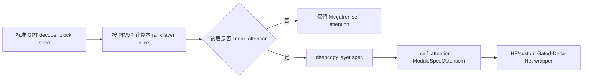

# slime 新模型架构扩展机制分析

> **定位**：slime 段 1 实现机制 · Model Architecture Extension
> **源码基线**：`THUDM/slime@681b3adca54105d5ecd3fb822fa0dc58a427e0f9`
> **系列入口**：[[slime/index]]

## 1. 中心结论

slime 对 Megatron 尚未原生支持的新模型提供两条扩展路径：

1. 用 `--custom-model-provider-path` 替换整个 Megatron model provider；
2. 保留标准 GPT/MoE/PP 骨架，只在 `ModuleSpec` 阶段把特殊子模块换成 Hugging Face 或自定义实现，并补齐 HF↔Megatron 权重映射。

第二条以 Qwen3-Next 的 Gated-Delta-Net 为样例，核心取舍是：**用较少侵入快速获得模型语义，但被替换模块本身不做 TP，而是在 TP/CP ranks 上重复计算**。这不是“HF 模型自动获得全部 Megatron 并行能力”；外层 PP/MoE/训练调度可复用，黑盒模块内部的张量并行仍需显式实现。官方文档也把无 module-TP 列为当前限制。[`arch-support-beyond-megatron.md:1-34`](https://github.com/THUDM/slime/blob/681b3adca54105d5ecd3fb822fa0dc58a427e0f9/docs/zh/advanced/arch-support-beyond-megatron.md#L1-L34)

## 2. 两条扩展路径

| 路径 | 替换范围 | 适合场景 | 主要责任 |
|---|---|---|---|
| custom model provider | 整个 GPTModel 构造 | 架构骨架也不同、需完全控制 | pre/post process、VP、critic head、checkpoint、sync |
| ModuleSpec surgery | 某些 layer/submodule | 大部分仍是标准 GPT/MoE，仅局部新算子 | wrapper、并行边界、双向权重映射 |

参数层允许通过 import path 注入 `custom_model_provider`，约定 `pre_process / post_process / vp_stage` 签名。[`arguments.py:226-236`](https://github.com/THUDM/slime/blob/681b3adca54105d5ecd3fb822fa0dc58a427e0f9/slime/utils/arguments.py#L226-L236) loader 兼容不接收 `vp_stage` 的旧函数，并在 critic 的 post-process stage 自动替换 scalar output layer。[`model_provider.py:92-116`](https://github.com/THUDM/slime/blob/681b3adca54105d5ecd3fb822fa0dc58a427e0f9/slime/backends/megatron_utils/model_provider.py#L92-L116)

这层接口解决“怎样构造训练模型”，但不会自动生成 rollout 转换器。新模型若要进入完整 RL loop，仍需让 Megatron checkpoint、HF startup checkpoint 和每轮 Megatron→HF weight update 三者闭合。

## 3. Qwen3-Next：ModuleSpec 替换链

`get_qwen3_next_spec` 先取得标准 decoder block spec，根据当前 PP/VP stage 计算要实例化的局部层区间，再读取 HF config 的 `layer_types`；只有 linear-attention 层被 deepcopy 并替换 `self_attention`，full-attention 层保留原生 Megatron 实现。[`qwen3_next.py:207-243`](https://github.com/THUDM/slime/blob/681b3adca54105d5ecd3fb822fa0dc58a427e0f9/slime_plugins/models/qwen3_next.py#L207-L243)

这种“局部替换”比重写完整 GPTModel 更容易保留 embedding、MoE、pipeline stage、loss 和 optimizer 体系，也把新架构风险限制在少数层。

## 4. HF wrapper 如何跨越 Megatron 并行边界

`HuggingfaceAttention` 继承 `MegatronModule`，加载 HF config，并固定使用 FlashAttention 2 配置。[`hf_attention.py:63-87`](https://github.com/THUDM/slime/blob/681b3adca54105d5ecd3fb822fa0dc58a427e0f9/slime_plugins/models/hf_attention.py#L63-L87) 真正关键的是 forward 前后的 layout 处理：

- sequence parallel 输入先 gather 成完整序列；
- context parallel 输入用自定义 all-gather 重建完整 sequence；
- 调用黑盒 `hf_forward`；
- 再按 CP 的双端 chunk 规则切回局部序列；
- 最后 scatter 回 sequence parallel layout。[`hf_attention.py:100-169`](https://github.com/THUDM/slime/blob/681b3adca54105d5ecd3fb822fa0dc58a427e0f9/slime_plugins/models/hf_attention.py#L100-L169)

自定义 `_AllGatherForDuplicatedComputation` 的 backward 只返回本 rank 对应 gradient slice，不执行默认 reduce-scatter。原因是黑盒模块的权重与完整输入在各 rank 上重复，若再把相同梯度求和，会人为放大 world-size 倍。[`hf_attention.py:40-60`](https://github.com/THUDM/slime/blob/681b3adca54105d5ecd3fb822fa0dc58a427e0f9/slime_plugins/models/hf_attention.py#L40-L60)

这揭示了当前限制的真实成本：

$$
\text{module compute/memory per TP group}\approx TP\_size\times\text{single-module cost},
$$

而不是把 module 权重和 GEMM 真正 sharding。Attention 占比小时可能可接受；新模块若占主体计算，重复开销会迅速吞掉 Megatron 的扩展收益。

## 5. 特殊模块仍需适配 packed/varlen 语义

Qwen3-Next wrapper 不是直接原样调用 HF decoder layer。它构造带 varlen 支持的 `Qwen3NextGatedDeltaNet`，从 `PackedSeqParams.cu_seqlens_q` 取得 packed sequence 边界，再送入 linear attention。[`qwen3_next.py:24-43`](https://github.com/THUDM/slime/blob/681b3adca54105d5ecd3fb822fa0dc58a427e0f9/slime_plugins/models/qwen3_next.py#L24-L43) [`qwen3_next.py:190-204`](https://github.com/THUDM/slime/blob/681b3adca54105d5ecd3fb822fa0dc58a427e0f9/slime_plugins/models/qwen3_next.py#L190-L204)

所以“封装 HF 模块”仍要求理解训练数据布局：padding-free packed batch、CP chunk 顺序、SP tensor layout 和 dtype。只要其中一个边界错位，模型可能正常 forward，却把跨样本 token 混入状态递推。

## 6. 权重映射是功能的一部分，不是收尾脚本

### 6.1 HF→Megatron：初始化和 checkpoint reload

Qwen3-Next loader 对特殊 linear-attention 参数做 direct mapping；标准 attention 的 Q/K/V 则根据 GQA group 和 head dimension 重排、拼接成 Megatron QKV 表示。未覆盖的参数直接抛 `KeyError`，避免静默漏权重。[`hf_to_megatron/qwen3_next.py:10-53`](https://github.com/THUDM/slime/blob/681b3adca54105d5ecd3fb822fa0dc58a427e0f9/slime/backends/megatron_utils/hf_to_megatron/qwen3_next.py#L10-L53)

### 6.2 Megatron→HF：每轮 rollout 权重提交

反向 converter 还要处理 embedding、lm_head、norm、MoE experts，以及 MTP wrapper/内部 layer 的命名与 tensor 变换。[`megatron_to_hf/qwen3_next.py:44-95`](https://github.com/THUDM/slime/blob/681b3adca54105d5ecd3fb822fa0dc58a427e0f9/slime/backends/megatron_utils/megatron_to_hf/qwen3_next.py#L44-L95)

如果只实现 HF→Megatron，首轮训练能启动，但 SGLang 后续收不到正确的新权重；只实现 Megatron→HF，则训练 checkpoint 无法可靠初始化。新架构的完成定义必须是双向 round-trip 与在线同步都通过。

## 7. 当前源码边界与官方表述的精确化

官方文档称该方法可保留模型并行、MoE 和 pipeline 调度等关键能力。[`arch-support-beyond-megatron.md:24-28`](https://github.com/THUDM/slime/blob/681b3adca54105d5ecd3fb822fa0dc58a427e0f9/docs/zh/advanced/arch-support-beyond-megatron.md#L24-L28) 源码支持更精确的解释：

- 外层 decoder block、PP layer slicing、MoE path 和训练 schedule 仍由 Megatron 管理；
- 被替换模块通过 gather/scatter 接入 SP/CP，但模块内部不 TP-shard；
- Qwen3-Next spec 当前断言 `pipeline_model_parallel_layout is None`，自定义 pipeline layout 尚不支持。[`qwen3_next.py:218-225`](https://github.com/THUDM/slime/blob/681b3adca54105d5ecd3fb822fa0dc58a427e0f9/slime_plugins/models/qwen3_next.py#L218-L225)

因此这是“保留外层并行骨架”，不是“黑盒模块天然支持全部并行组合”。

## 8. 新架构接入清单

1. 固定 HF config、tokenizer、special tokens 和 SGLang 可加载模型类；
2. 决定整 model provider 还是局部 ModuleSpec 替换；
3. 明确模块输入输出 layout、packed/varlen、SP/CP/TP 行为；
4. 实现 HF→Megatron mapping，并检查所有参数恰好消费一次；
5. 实现 Megatron→HF mapping，覆盖 PP/EP/VP 的全局名称；
6. 做 tensor-level round-trip、短序列 logits、gradient 与 checkpoint reload 对齐；
7. 验证每轮 weight sync 后 rollout version 和 logprob；
8. 对目标 TP/CP/PP/EP 组合跑真实 GPU gate；
9. 若黑盒模块成本显著，评估回归 Megatron 原生 TP 实现。

## 9. 相关页面

- [[14_slime_megatron_training_analysis]]
- [[16_slime_weight_sync_analysis]]
- [[17_slime_train_inference_consistency_analysis]]
- [[22_slime_low_precision_training_rollout_analysis]]
