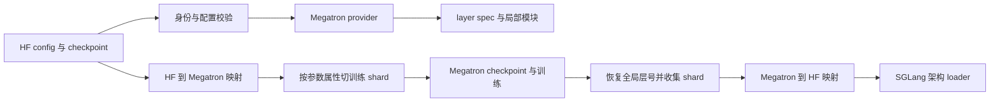

# slime 模型架构扩展分析：把“同一模型”翻译成两套引擎都能执行的语义

> **源码基线**：slime `main@681b3adca54105d5ecd3fb822fa0dc58a427e0f9`
> **推理端核验基线**：SGLang `d6ef68881e263812d4901f632786015005c4d050`
> **文档/示例基线**：slime 同一提交下 `docs/{zh,en}/advanced/arch-support-beyond-megatron.md`、`docs/zh/examples/qwen3-next-80B-A3B.md`
> **核验日期**：2026-08-18 · **系列**：[[02_engineering/04_posttrain_frameworks/slime/index|slime 源码分析]]
> **结论先行**：在 slime 中，“支持一个新架构”不是注册一个 PyTorch 类，而是建立 **HF/SGLang 语义 ↔ Megatron 语义** 的双向映射：两侧必须对模型身份、配置、层结构、参数名字与融合方式、TP/PP/EP 切分、checkpoint 以及在线更新后的可加载名称达成同一个解释。Qwen3-Next 证明局部 `ModuleSpec` 替换可以快速复用 Megatron 外层训练骨架；代价是扩展面横跨构造、权重转换和推理 loader，且黑盒模块内部不会自动获得 TP。
> **叙事顺序**：本页按五拍组织——背景 → 为什么这么设计（含被否掉的替代）→ 实现思路与细节 → 约束 → 发展趋势。
> **最近更新**：2026-08-27。按五拍重排章节顺序，并补写第 5 拍（发展趋势）；机制正文与既有引用未改——既有引用**未**重新核验，故上方**核验日期**不变；本次新增的引用均已在该基线下逐条打开核对。

本文把带 fixed-commit 定位符的内容视为源码或项目文档事实；使用“由此可推断”“设计上可以理解为”的段落是分析判断，不代表项目作者原话。权重发布的 pause、flush、version 和 transport 协议归 [[16_slime_weight_sync_analysis]]；MTP draft/main 耦合归 [[21_slime_speculative_decoding_mtp_analysis]]，本页只说明架构映射必须向这些路径提供什么。

## 1. 问题不是“Megatron 缺一个类”，而是两套模型语义不等形

同一组逻辑权重，在训练侧与推理侧有四类结构差异：

| 需要对齐的模型信息 | HF / SGLang 侧 | Megatron 侧 | 映射缺失后的失败 |
|---|---|---|---|
| 身份 | `config.model_type`、config 类名、`architectures` | `--spec` 或 custom provider、Megatron args | 选错 loader / converter，或推理 class 无法解析 |
| 结构 | HF layer type 与未融合模块 | `GPTModel`、`ModuleSpec`、本 rank 的 PP/VP layer slice | 层种类或全局层号错位 |
| 参数 | `q_proj/k_proj/v_proj`、`gate_proj/up_proj` 等 checkpoint 名 | fused QKV、fused GLU、每 expert 参数及 wrapper 前缀 | 名称存在但 tensor 语义不等价 |
| 分区 | SGLang 自己的 TP/EP loader | Megatron TP/PP/EP/VP shard 与参数属性 | shard 顺序、拼接维度或 expert 归属错误 |

slime 的 HF→Megatron 入口按 `config.model_type` 从显式 `_LOADERS` 表选函数；Megatron→HF 入口却把 HF config 类名或 `--model-name` 规范化后走另一组 family 分支；SGLang 又按 `architectures` 解析执行类。[`hf_to_megatron/__init__.py:12-43`](https://github.com/THUDM/slime/blob/681b3adca54105d5ecd3fb822fa0dc58a427e0f9/slime/backends/megatron_utils/hf_to_megatron/__init__.py#L12-L43) [`megatron_to_hf/__init__.py:41-66`](https://github.com/THUDM/slime/blob/681b3adca54105d5ecd3fb822fa0dc58a427e0f9/slime/backends/megatron_utils/megatron_to_hf/__init__.py#L41-L66) [`registry.py:19-36`](https://github.com/sgl-project/sglang/blob/d6ef68881e263812d4901f632786015005c4d050/python/sglang/srt/models/registry.py#L19-L36) [`registry.py:61-91`](https://github.com/sgl-project/sglang/blob/d6ef68881e263812d4901f632786015005c4d050/python/sglang/srt/models/registry.py#L61-L91)

因此至少有三个身份键需要一致但不相同：

1. `model_type` 决定 HF checkpoint 能否导入 Megatron；
2. config 类名或显式 `model_name` 决定训练权重导出成哪套 HF 名称；
3. `architectures` 决定 SGLang 实例化哪个 loader。

actor 确实从 `AutoConfig` 的类型名生成默认 `model_name`，而 `--model-name` 是显式覆盖点。[`actor.py:86-96`](https://github.com/THUDM/slime/blob/681b3adca54105d5ecd3fb822fa0dc58a427e0f9/slime/backends/megatron_utils/actor.py#L86-L96) [`actor.py:175-181`](https://github.com/THUDM/slime/blob/681b3adca54105d5ecd3fb822fa0dc58a427e0f9/slime/backends/megatron_utils/actor.py#L175-L181) [`arguments.py:318-326`](https://github.com/THUDM/slime/blob/681b3adca54105d5ecd3fb822fa0dc58a427e0f9/slime/utils/arguments.py#L318-L326)

> **设计分析**：新增一个 model class 只解决“某一侧怎样 forward”；复制一个 `MODEL_ARGS` 文件只描述“Megatron 应构造多大、怎样并行的模型”。两者都没有定义上述三个身份键，也没有定义 fused tensor 如何往返，所以最多让构造阶段更晚地失败，不能构成完整支持。

### 1.1 双向映射的完成条件

设 $W_{\mathrm{HF}}$ 是 HF 逻辑 state dict，$T_{\mathrm{M}}$ 是 Megatron 的 TP/PP/EP/VP 拓扑，$\mathcal{S}_{\mathrm{H\to M}}$ 表示改名、融合并切成训练 shard，$\mathcal{R}_{\mathrm{M\to H}}$ 表示收集训练 shard、恢复全局名并拆成推理权重。对受支持参数，核心不变量是：

$$
\mathcal{R}_{\mathrm{M\to H}}
\left(
\mathcal{S}_{\mathrm{H\to M}}\left(W_{\mathrm{HF}};T_{\mathrm{M}}\right);T_{\mathrm{M}}
\right)
=W_{\mathrm{HF}}.
$$

这只是必要条件；输出名称还必须被 SGLang 的目标架构 loader 接受。Qwen3-Next 的 SGLang loader 会把 checkpoint 的 Q/K/V、gate/up 和 GDN 投影名装入自己的 fused 参数，并对普通参数按名称查找。[`qwen3_next.py:1116-1133`](https://github.com/sgl-project/sglang/blob/d6ef68881e263812d4901f632786015005c4d050/python/sglang/srt/models/qwen3_next.py#L1116-L1133) [`qwen3_next.py:1189-1255`](https://github.com/sgl-project/sglang/blob/d6ef68881e263812d4901f632786015005c4d050/python/sglang/srt/models/qwen3_next.py#L1189-L1255)

## 2. 为什么这么设计：三个直观替代方案都不够

### 2.1 在中央入口堆叠一个巨型条件分支

把所有架构塞进一个 switch 的优点是身份分派显式、未知模型立即失败；固定基线的 HF→Megatron registry 与 Megatron→HF family chain 已经体现了这种可审计性。[`hf_to_megatron/__init__.py:12-43`](https://github.com/THUDM/slime/blob/681b3adca54105d5ecd3fb822fa0dc58a427e0f9/slime/backends/megatron_utils/hf_to_megatron/__init__.py#L12-L43) [`megatron_to_hf/__init__.py:41-66`](https://github.com/THUDM/slime/blob/681b3adca54105d5ecd3fb822fa0dc58a427e0f9/slime/backends/megatron_utils/megatron_to_hf/__init__.py#L41-L66)

> **设计分析**：若再把 provider、spec、SGLang architecture 和所有 tensor 规则集中到同一个 switch，每次加模型都要修改核心文件，局部 plugin 的价值会消失；但完全去掉显式 registry 又会失去“支持范围可枚举、未知身份 fail-fast”的收益。更合理的方向是统一 manifest/registry 的身份元数据，具体构造与转换仍由插件函数实现，而不是一个不断增长的实现 switch。

### 2.2 只靠反射机制注册类或函数

反射适合 provider/spec，因为调用签名足以表达“怎样构造”；当前实现甚至检查 custom provider 是否接收 `vp_stage`。[`model_provider.py:96-108`](https://github.com/THUDM/slime/blob/681b3adca54105d5ecd3fb822fa0dc58a427e0f9/slime/backends/megatron_utils/model_provider.py#L96-L108) 但反射无法从类结构可靠推导 QKV 的 GQA 交错、GLU 一对二拆分、PP 全局 offset、EP expert offset 或参数的 partition stride；这些都是当前转换器和参数 attrs 中的显式知识。[`hf_to_megatron/qwen3_next.py:37-48`](https://github.com/THUDM/slime/blob/681b3adca54105d5ecd3fb822fa0dc58a427e0f9/slime/backends/megatron_utils/hf_to_megatron/qwen3_next.py#L37-L48) [`update_weight/common.py:172-232`](https://github.com/THUDM/slime/blob/681b3adca54105d5ecd3fb822fa0dc58a427e0f9/slime/backends/megatron_utils/update_weight/common.py#L172-L232)

### 2.3 把训练分片直接映射到推理分片

直连可以省掉 full tensor reconstruction，但只有在训练/推理两边名称、fusion、TP/EP partition 和 rank ownership 同构时才成立。固定实现恰恰先跨 PP/EP 恢复 source、再按 regular TP 或 expert TP 收集 full param，最后才转成 HF 名称。[`hf_weight_iterator_direct.py:62-123`](https://github.com/THUDM/slime/blob/681b3adca54105d5ecd3fb822fa0dc58a427e0f9/slime/backends/megatron_utils/update_weight/hf_weight_iterator_direct.py#L62-L123) [`update_weight/common.py:15-57`](https://github.com/THUDM/slime/blob/681b3adca54105d5ecd3fb822fa0dc58a427e0f9/slime/backends/megatron_utils/update_weight/common.py#L15-L57)

> **设计分析**：direct shard mapping 不是永远错误，而是需要一份比当前 converter 更强的“训练 shard → 推理 shard”拓扑证明。没有这份证明时，先恢复逻辑 full tensor 再交给推理 loader，虽然多一次收集/拼接，却把架构语义与 transport topology 解耦，失败也更容易定位。

## 3. 扩展面：一个架构要同时接入哪些位置

| 扩展位置 | 固定基线中的接入点 | 必须守住的不变量 |
|---|---|---|
| 配置 | HF config 校验 Megatron args | hidden/head/layer/FFN/norm/RoPE 等结构量一致 |
| 构造 | `--custom-model-provider-path` 或 `--spec` | pre/post process、PP/VP stage 与角色输出正确 |
| 层 wiring | `ModuleSpec` 替换 | 全局 layer type 映射到本 PP/VP slice |
| 导入 | `_LOADERS[model_type]` | 每个 Megatron 参数取得正确完整 HF tensor |
| 切分 | 参数的 TP attrs 与 expert 名称 | fusion 后按正确 group、dim、stride 取 shard |
| 导出 | family converter | PP/EP 全局编号、TP gather、融合拆分可逆 |
| 推理 | HF 资产与 SGLang loader | 架构 class、参数名、shape 和 fusion 规则可消费 |
| 验证 | mapping / layout / E2E tests | 失败尽量前移，不让首轮更新才暴露 |

配置校验不是“参数看起来差不多”即可：parser 从 HF config 对比 hidden size、attention heads、layer count、dense/MoE FFN、embedding tie、norm epsilon 与 RoPE base，不同就汇总后抛错。[`arguments.py:93-144`](https://github.com/THUDM/slime/blob/681b3adca54105d5ecd3fb822fa0dc58a427e0f9/slime/backends/megatron_utils/arguments.py#L93-L144) 但这张校验表不覆盖所有架构字段；例如 Qwen3-Next 的 linear/full attention 排布是在 spec 内再读取 `layer_types` 或按 interval 推导。[`qwen3_next.py:227-242`](https://github.com/THUDM/slime/blob/681b3adca54105d5ecd3fb822fa0dc58a427e0f9/slime_plugins/models/qwen3_next.py#L227-L242)

## 4. 两种模型构造接入点：替换整个 provider，或只替换局部 spec

### 4.1 custom provider 解决“骨架不同”

`--custom-model-provider-path` 让外部函数接管模型构造；wrapper 兼容不带 `vp_stage` 的旧 provider，并在 critic 的 post-process stage 换成 scalar output layer。[`arguments.py:226-236`](https://github.com/THUDM/slime/blob/681b3adca54105d5ecd3fb822fa0dc58a427e0f9/slime/utils/arguments.py#L226-L236) [`model_provider.py:92-116`](https://github.com/THUDM/slime/blob/681b3adca54105d5ecd3fb822fa0dc58a427e0f9/slime/backends/megatron_utils/model_provider.py#L92-L116)

这条路适合 embedding、decoder、输出或多模态骨架都不同的模型；代价是 provider 必须主动遵守 PP/VP 的 pre/post process 语义。源码只负责调用它，并不会从返回的 Python class 推导参数转换或推理兼容性。

### 4.2 custom spec 解决“外层骨架相同、局部算子不同”

默认 provider 把 `--spec` 反射成函数，以 `(args, config, vp_stage)` 调用；返回 `ModuleSpec` 时仍由标准 `GPTModel` 负责 embedding、decoder 容器、pipeline stage 和输出。[`model_provider.py:131-181`](https://github.com/THUDM/slime/blob/681b3adca54105d5ecd3fb822fa0dc58a427e0f9/slime/backends/megatron_utils/model_provider.py#L131-L181) [`model_provider.py:200-237`](https://github.com/THUDM/slime/blob/681b3adca54105d5ecd3fb822fa0dc58a427e0f9/slime/backends/megatron_utils/model_provider.py#L200-L237)

官方架构扩展文档把这种路径概括为“在 Spec 阶段替换模块，并在 wrapper 中对齐并行布局”；同时明确被替换模块自身暂不支持 TP，TP 重要时应回到 Megatron 原生实现。[`arch-support-beyond-megatron.md:9-28`](https://github.com/THUDM/slime/blob/681b3adca54105d5ecd3fb822fa0dc58a427e0f9/docs/zh/advanced/arch-support-beyond-megatron.md#L9-L28) [`arch-support-beyond-megatron.md:30-34`](https://github.com/THUDM/slime/blob/681b3adca54105d5ecd3fb822fa0dc58a427e0f9/docs/zh/advanced/arch-support-beyond-megatron.md#L30-L34)

> [!note] 文档表述需要按源码收窄
> 文档说 wrapper 内部直接调用“原生 `Qwen3NextAttention`”；固定基线的 linear-attention 路径实际实例化的是项目内 `Qwen3NextGatedDeltaNet`，该实现按 HF 代码改造并加入 varlen backend，`Qwen3NextAttention` 只被导入并用来检查依赖是否存在。[`qwen3_next.py:14-25`](https://github.com/THUDM/slime/blob/681b3adca54105d5ecd3fb822fa0dc58a427e0f9/slime_plugins/models/qwen3_next.py#L14-L25) [`qwen3_next.py:176-204`](https://github.com/THUDM/slime/blob/681b3adca54105d5ecd3fb822fa0dc58a427e0f9/slime_plugins/models/qwen3_next.py#L176-L204)

## 5. 端到端追踪：Qwen3-Next 从 HF checkpoint 到下一轮 SGLang

### 5.1 入口不是一个开关，而是一组绑定配置

官方 `MODEL_ARGS` 同时声明 custom spec、attention head/group/dim、48 层、MoE 512 experts 和 Qwen 特有 gate；这说明 spec 只负责局部 wiring，Megatron config 仍须完整描述其余骨架。[`scripts/models/qwen3-next-80B-A3B.sh:16-39`](https://github.com/THUDM/slime/blob/681b3adca54105d5ecd3fb822fa0dc58a427e0f9/scripts/models/qwen3-next-80B-A3B.sh#L16-L39) [`scripts/models/qwen3-next-80B-A3B.sh:41-58`](https://github.com/THUDM/slime/blob/681b3adca54105d5ecd3fb822fa0dc58a427e0f9/scripts/models/qwen3-next-80B-A3B.sh#L41-L58)

官方示例随后复用同一 `MODEL_ARGS` 调用 `convert_hf_to_torch_dist.py`，而不是把 HF 文件直接当成 Megatron distributed checkpoint。[`qwen3-next-80B-A3B.md:65-78`](https://github.com/THUDM/slime/blob/681b3adca54105d5ecd3fb822fa0dc58a427e0f9/docs/zh/examples/qwen3-next-80B-A3B.md#L65-L78) 转换工具先用同一个 provider 建模，再执行 `load_hf_weights`，最后保存 Megatron checkpoint；这把“架构构造”和“权重语义”绑定在同一次转换中。[`convert_hf_to_torch_dist.py:107-129`](https://github.com/THUDM/slime/blob/681b3adca54105d5ecd3fb822fa0dc58a427e0f9/tools/convert_hf_to_torch_dist.py#L107-L129)

运行时 checkpoint loader 也显式区分两条启动路径：有 Megatron tracker 或 `iter_*` 目录时走 distributed checkpoint，否则进入 HF loader 并调用同一个 `load_hf_weights`。[`checkpoint.py:95-131`](https://github.com/THUDM/slime/blob/681b3adca54105d5ecd3fb822fa0dc58a427e0f9/slime/backends/megatron_utils/checkpoint.py#L95-L131) 因而 HF 初始化与 Megatron resume 虽然使用不同存储格式，却必须构造出同一参数语义。

### 5.2 spec 必须先把全局 layer type 投影到本地 PP/VP slice

`get_qwen3_next_spec` 先构造标准 decoder-block spec，再用 `get_num_layers_to_build` 和 `get_transformer_layer_offset` 求当前 PP/VP stage 的局部层数与全局 offset；只有 `layer_types[layer_id + offset]` 为 linear attention 的层才 deepcopy 并替换 `self_attention`。[`qwen3_next.py:207-243`](https://github.com/THUDM/slime/blob/681b3adca54105d5ecd3fb822fa0dc58a427e0f9/slime_plugins/models/qwen3_next.py#L207-L243)

这里的 seam 与不变量是：**HF 的全局第 $l$ 层，必须对应 Megatron 当前 stage 中的同一逻辑第 $l$ 层**。固定实现对 `pipeline_model_parallel_layout` 直接断言不支持，因此自定义 layout 会在构造时失败，而不是被静默误切。[`qwen3_next.py:220-225`](https://github.com/THUDM/slime/blob/681b3adca54105d5ecd3fb822fa0dc58a427e0f9/slime_plugins/models/qwen3_next.py#L220-L225)

### 5.3 wrapper 适配执行布局，但没有让内部模块 TP-shard

Qwen3-Next GDN 明确接收 packed batch 的 `cu_seqlens`，把它传给 short convolution 与 chunk gated-delta kernel，避免不同 sequence 在状态递推中串接。[`qwen3_next.py:108-162`](https://github.com/THUDM/slime/blob/681b3adca54105d5ecd3fb822fa0dc58a427e0f9/slime_plugins/models/qwen3_next.py#L108-L162) wrapper 在调用它之前 gather SP 与 CP sequence，之后按 CP 双端 chunk 规则切回并 scatter 到 SP。[`hf_attention.py:88-169`](https://github.com/THUDM/slime/blob/681b3adca54105d5ecd3fb822fa0dc58a427e0f9/slime_plugins/models/hf_attention.py#L88-L169)

自定义 all-gather 的 backward 只返回本 rank gradient slice，不做 reduce-scatter；源码给出的原因是完整输入和权重在 ranks 上重复，若把相同梯度再求和会放大 world size 倍。[`hf_attention.py:40-60`](https://github.com/THUDM/slime/blob/681b3adca54105d5ecd3fb822fa0dc58a427e0f9/slime_plugins/models/hf_attention.py#L40-L60)

> **设计分析**：这里复用的是 Megatron 的外层 PP、MoE 与 schedule，不是把 GDN 内部计算自动切成 TP。局部黑盒替换适合“特殊模块占比较小、先求正确可用”的扩展；特殊模块成为主耗时时，重复计算和显存会成为回归原生 Megatron 实现的信号。

### 5.4 HF→Megatron：名称、fusion 与 shard 是一个连续操作

`qwen3_next_hf_tensor` 对 linear-attention 参数直接按对应 HF 名读取；对 full-attention 的 `linear_qkv`，它按 KV groups、query heads 与 head dim 重排 Q，再与 K/V 交错拼成 Megatron 表示；未知 layer 参数抛 `KeyError`。[`hf_to_megatron/qwen3_next.py:10-53`](https://github.com/THUDM/slime/blob/681b3adca54105d5ecd3fb822fa0dc58a427e0f9/slime/backends/megatron_utils/hf_to_megatron/qwen3_next.py#L10-L53) 顶层函数另处理 embedding/output/norm、decoder 与 MTP wrapper 的名字；无法识别的顶层参数同样失败。[`hf_to_megatron/qwen3_next.py:56-83`](https://github.com/THUDM/slime/blob/681b3adca54105d5ecd3fb822fa0dc58a427e0f9/slime/backends/megatron_utils/hf_to_megatron/qwen3_next.py#L56-L83)

得到完整 Megatron tensor 后，公共 loader 才读取目标 parameter 的 `tensor_model_parallel`、`parallel_mode`、`partition_dim` 与 `partition_stride` 决定是否切 shard；expert 参数改用 expert-TP group，fused GLU 先分别切 gate/up。[`hf_to_megatron/common.py:86-134`](https://github.com/THUDM/slime/blob/681b3adca54105d5ecd3fb822fa0dc58a427e0f9/slime/backends/megatron_utils/hf_to_megatron/common.py#L86-L134) shard 后还会与目标 parameter shape 严格比较才 copy。[`hf_to_megatron/common.py:146-167`](https://github.com/THUDM/slime/blob/681b3adca54105d5ecd3fb822fa0dc58a427e0f9/slime/backends/megatron_utils/hf_to_megatron/common.py#L146-L167)

所以参数属性不是性能提示，而是序列化 ABI：同名 full tensor 在错误的 dim/stride 或错误的 TP group 上切分，会成为另一组数值。

### 5.5 Megatron→HF：先恢复全局语义，再交给 SGLang loader

训练模型的本地 layer index 不能直接作为 HF layer index。公共枚举器先用 PP/VP offset 恢复 decoder 全局层号，再用 EP rank 给 expert 编号加 offset；非 expert 和 expert 最终都生成跨 ranks 一致的 global name。[`update_weight/common.py:172-232`](https://github.com/THUDM/slime/blob/681b3adca54105d5ecd3fb822fa0dc58a427e0f9/slime/backends/megatron_utils/update_weight/common.py#L172-L232)

随后参数元数据记录 TP attrs 与 source rank，并在 PP/EP ranks 交换、排序，断言所有 ranks 看到的 name/shape/dtype 相同。[`hf_weight_iterator_direct.py:163-235`](https://github.com/THUDM/slime/blob/681b3adca54105d5ecd3fb822fa0dc58a427e0f9/slime/backends/megatron_utils/update_weight/hf_weight_iterator_direct.py#L163-L235) iterator 恢复 PP/EP 可见性、重新挂回 TP attrs、all-gather full params，然后逐参数调用 family converter。[`hf_weight_iterator_direct.py:62-123`](https://github.com/THUDM/slime/blob/681b3adca54105d5ecd3fb822fa0dc58a427e0f9/slime/backends/megatron_utils/update_weight/hf_weight_iterator_direct.py#L62-L123) [`hf_weight_iterator_direct.py:49-59`](https://github.com/THUDM/slime/blob/681b3adca54105d5ecd3fb822fa0dc58a427e0f9/slime/backends/megatron_utils/update_weight/hf_weight_iterator_direct.py#L49-L59)

Qwen3-Next 反向 converter 将 fused QKV 拆回 `q_proj/k_proj/v_proj`，将 fused expert/shared-expert GLU 拆成 gate/up，并让 GDN 参数使用 checkpoint 原名；无法识别的名称最终抛 `ValueError`。[`megatron_to_hf/qwen3_next.py:72-166`](https://github.com/THUDM/slime/blob/681b3adca54105d5ecd3fb822fa0dc58a427e0f9/slime/backends/megatron_utils/megatron_to_hf/qwen3_next.py#L72-L166) [`megatron_to_hf/qwen3_next.py:168-194`](https://github.com/THUDM/slime/blob/681b3adca54105d5ecd3fb822fa0dc58a427e0f9/slime/backends/megatron_utils/megatron_to_hf/qwen3_next.py#L168-L194)

这批 `(HF name, full tensor)` 才是在线更新和 raw HF checkpoint saver 共同消费的架构语义。checkpoint saver 还复制初始 HF 目录中的非权重资产，并拒绝重复 HF tensor 名；也就是说“权重可导出”和“目录可被 HF/SGLang 启动”是两层要求。[`hf_checkpoint_saver.py:329-349`](https://github.com/THUDM/slime/blob/681b3adca54105d5ecd3fb822fa0dc58a427e0f9/slime/backends/megatron_utils/hf_checkpoint_saver.py#L329-L349) [`hf_checkpoint_saver.py:151-175`](https://github.com/THUDM/slime/blob/681b3adca54105d5ecd3fb822fa0dc58a427e0f9/slime/backends/megatron_utils/hf_checkpoint_saver.py#L151-L175)

SGLang 启动时直接以 `args.hf_checkpoint` 为 `model_path`，并用它的 config/architecture 建模；所以在线导出的名字必须继续匹配这个已启动 loader，而不能只对某个独立 HF class “看起来合理”。[`sglang_engine.py:536-563`](https://github.com/THUDM/slime/blob/681b3adca54105d5ecd3fb822fa0dc58a427e0f9/slime/backends/sglang_utils/sglang_engine.py#L536-L563)

在线更新如何暂停请求、刷新 cache、传输并提交 version 不在此展开；本页的边界是：架构扩展必须让该协议拿到 SGLang loader 能消费的名字与 tensor。发送接口本身只携带 names/dtypes/shapes 或 serialized named tensors，不会替架构纠正语义。[`sglang_engine.py:262-285`](https://github.com/THUDM/slime/blob/681b3adca54105d5ecd3fb822fa0dc58a427e0f9/slime/backends/sglang_utils/sglang_engine.py#L262-L285) [`sglang_engine.py:414-438`](https://github.com/THUDM/slime/blob/681b3adca54105d5ecd3fb822fa0dc58a427e0f9/slime/backends/sglang_utils/sglang_engine.py#L414-L438)

## 6. 约束与失败时点：从早期显式到晚期隐蔽

| 阶段 | 已有保护 | 仍可能漏到后面的问题 |
|---|---|---|
| 参数解析 | HF config 与主要 Megatron args 不同会报错 | layer pattern、特殊 projection 等未进入通用校验表 |
| 构造 | provider/spec import、custom PP layout 断言 | 某层数值语义错误但 shape 正确 |
| HF 初始加载 | 未知 model type、未知参数、shape mismatch | 双向映射不是严格逆但单向 shape 可过 |
| 训练 forward | packed `cu_seqlens` 与 layout path 实际执行 | 只在特定 TP/CP/PP/EP 组合发生的错位 |
| 首次权重导出 | 未知 Megatron name 抛错、ranks 间 metadata 断言 | HF 名合法但不是 SGLang loader 期望的 fusion 语义 |
| SGLang reload | loader 按 name/shape 装入参数 | 数值排列错误通常要 logits 对齐或 rollout 才暴露 |

源码测试证明通用 HF config 校验会拒绝 MoE FFN mismatch，并拒绝不支持模型使用 all-gather CP。[`test_megatron_argument_validation.py:113-145`](https://github.com/THUDM/slime/blob/681b3adca54105d5ecd3fb822fa0dc58a427e0f9/tests/test_megatron_argument_validation.py#L113-L145) 但这些保护不能替代架构级数值测试。

## 7. 现有测试覆盖了什么，没覆盖什么

固定基线有三类与本架构直接相关的证据：

1. mapping round-trip 参数化测试覆盖 Qwen3-Next 的一组 full-attention fused QKV，断言 `Megatron → HF → Megatron` 后逐元素相同；同文件还锁定 `_LOADERS` 的显式支持集合。[`test_hf_to_megatron.py:79-163`](https://github.com/THUDM/slime/blob/681b3adca54105d5ecd3fb822fa0dc58a427e0f9/tests/test_hf_to_megatron.py#L79-L163) [`test_hf_to_megatron.py:322-342`](https://github.com/THUDM/slime/blob/681b3adca54105d5ecd3fb822fa0dc58a427e0f9/tests/test_hf_to_megatron.py#L322-L342)
2. linear-attention 单测把两个 packed sequences 的 `cu_seqlens` 注入 GDN，断言 backend 原样收到边界且输出 shape 不变。[`test_qwen3_linear_attention_cu_seqlens.py:120-190`](https://github.com/THUDM/slime/blob/681b3adca54105d5ecd3fb822fa0dc58a427e0f9/tests/test_qwen3_linear_attention_cu_seqlens.py#L120-L190)
3. 官方示例提供真实 HF→torch_dist 转换与单机/多机启动路径，但它是使用文档，不等同于 CI 对 full architecture 的覆盖。[`qwen3-next-80B-A3B.md:65-97`](https://github.com/THUDM/slime/blob/681b3adca54105d5ecd3fb822fa0dc58a427e0f9/docs/zh/examples/qwen3-next-80B-A3B.md#L65-L97)

> **未覆盖缺口**：在 `tests/` 中检索 Qwen3-Next，只发现上述 mapping 与 `cu_seqlens` 测试；固定基线没有一个 Qwen3-Next 命名的端到端测试去同时覆盖完整参数集合、真实 TP/CP/PP/EP、Megatron checkpoint reload、在线更新后的 SGLang load 以及 logits 对齐。这是源码树检索得到的覆盖结论，不是项目对可靠性的声明。

一个新架构的最小测试梯度应是：

1. config/identity：三个身份键都能选到预期实现，错误身份 fail-fast；
2. per-parameter round-trip：direct、fused QKV、fused GLU、expert 与特殊模块逐类可逆；
3. partition：至少覆盖目标 TP/PP/EP，检查 global layer/expert id 与 shard 重组；
4. execution：packed 多序列 forward/backward 与未切基线对齐；
5. checkpoint：HF→Megatron、Megatron resume、Megatron→raw HF 都能重载；
6. rollout：SGLang startup 与一次在线更新后 logits/logprob 在允许误差内一致。

后两项的发布事务与一致性诊断分别由 [[16_slime_weight_sync_analysis]] 和 [[17_slime_train_inference_consistency_analysis]] 定义；本页只要求新架构进入这些 gate。

## 8. 实际扩展清单：按不变量实现，而不是按文件模仿

1. **钉住身份**：记录 HF `model_type`、默认 config 类名、`architectures` 与必要的 `--model-name` 覆盖。
2. **校准 config**：把所有会改变 shape、层排布、norm/RoPE、MoE 与特殊算子的字段纳入 Megatron args 或专用校验。
3. **选择构造 seam**：骨架变化用 custom provider；局部变化用 spec，并明确 PP/VP layer offset。
4. **定义执行布局**：逐个特殊模块写清 packed、SP、CP、TP 的输入输出和 backward 语义。
5. **实现 HF→Megatron**：先做逻辑改名/fusion，再让目标 parameter attrs 决定 shard；未知参数必须失败。
6. **实现 Megatron→HF**：先恢复 PP/EP 全局名和 full tensor，再做 unfusion；输出必须匹配目标 SGLang loader。
7. **接通持久化**：HF 初始化、Megatron resume、raw HF save 使用同一语义映射，而不是三套近似脚本。
8. **分层测试**：mapping 单测前移名字/shape 错误，真实 topology 与 rollout gate 捕获数值排列错误。

这张清单解释了为什么“复制另一个模型的 `MODEL_ARGS`”危险：它能复制数值配置，却复制不了目标架构独有的身份、层型、参数变换与 loader 契约。只有当双向映射、分区属性和推理消费端同时闭合时，模型才真正进入 slime 的在线训练闭环。

## 9. 发展趋势：导出侧仍有两处被源码自己标记的未完成项

本拍只写在固定基线中能直接读到锚点的在途改动，不写没有源码依据的路线图。

1. **Megatron→HF 的后处理入口尚未与主转换函数统一，也不处理量化。** `postprocess_hf_param` 只做 vocab padding 移除就返回；函数上方标着 `TODO unify w/ convert_to_hf`，函数体内另标 `TODO support quant`。[`megatron_to_hf/__init__.py:15-19`](https://github.com/THUDM/slime/blob/681b3adca54105d5ecd3fb822fa0dc58a427e0f9/slime/backends/megatron_utils/megatron_to_hf/__init__.py#L15-L19) 在固定基线的 `slime/` 下检索这个名字，除定义处外没有其他调用点，因此它当前是一条与 `convert_to_hf` 并行、尚未合流的导出后处理路径。
2. **TP 收集阶段的 unfusion 规则仍硬编码 GLU 假设。** all-gather 之后的拼接对 `partition_stride` 直接断言：只允许 1，或 `linear_fc1` 上的 2；紧随其后的注释是 `TODO: check only GLU is used.`，随后无条件把 `linear_fc1` 的权重/偏置按 chunk-2 重排。[`update_weight/common.py:44-51`](https://github.com/THUDM/slime/blob/681b3adca54105d5ecd3fb822fa0dc58a427e0f9/slime/backends/megatron_utils/update_weight/common.py#L44-L51)

> [!note] 推断
> 上面两条待办注释与断言本身是源码事实。由它们推出的方向——导出后处理会向“单一入口且量化感知”收敛，以及 fused-FFN 布局不同于 GLU 的新架构必须先放宽 `partition_stride` 断言并推广 unfusion 规则——是本页依据当前代码结构作出的推断；源码只标记了待办，没有陈述计划、优先级或时间。

## Related Pages

- [[14_slime_megatron_training_analysis]] — provider/spec 构造出的模型如何进入 Megatron actor、pipeline schedule 与训练执行。
- [[16_slime_weight_sync_analysis]] — 本页产出的 HF 命名 tensor 如何通过版本化提交协议发布到 rollout engines。
- [[17_slime_train_inference_consistency_analysis]] — 双向映射 shape 正确后，如何继续定位 logits、routing 与 kernel 层的一致性。
- [[21_slime_speculative_decoding_mtp_analysis]] — MTP 参数和 draft/main 版本耦合的完整机制，本页不重复展开。
- [[22_slime_low_precision_training_rollout_analysis]] — 量化 config 与导出 processor 怎样给架构映射增加 dtype、scale 和 loader 约束。
- [[19_slime_rollout_backend_extension_analysis]] — 当目标推理 backend 不是 SGLang 时，架构映射还必须满足哪套 backend 协议。
