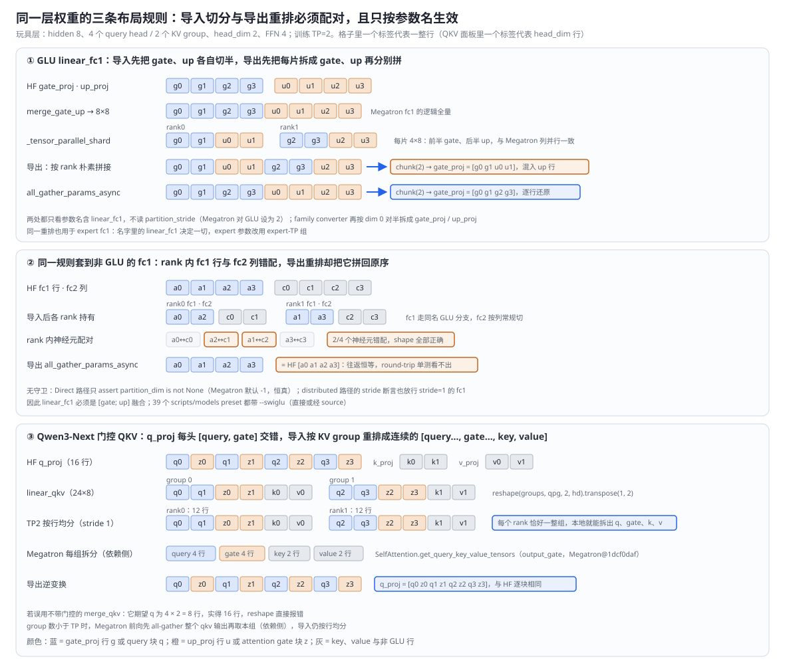
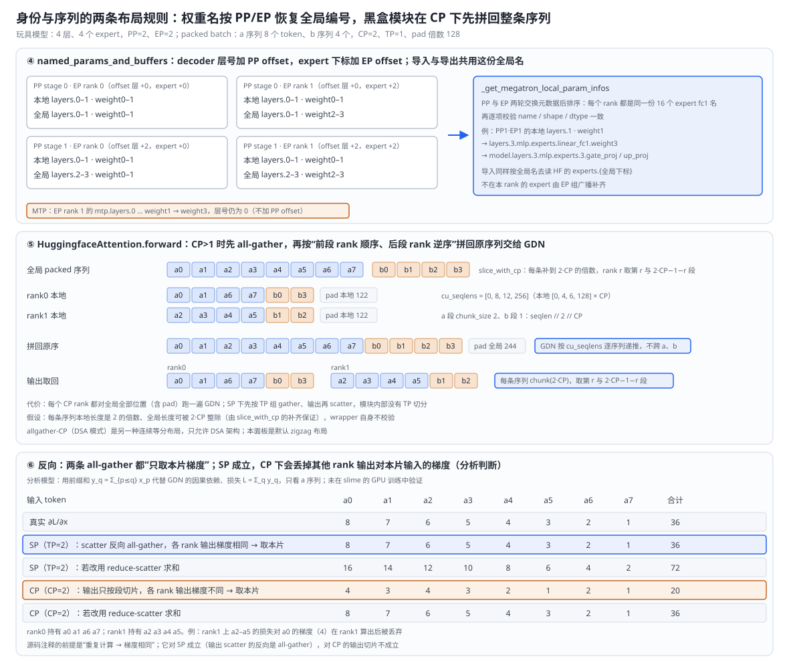
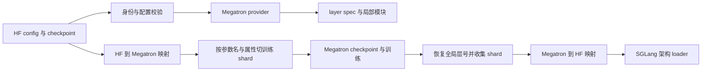

# slime 模型架构扩展分析：把“同一模型”翻译成两套引擎都能执行的语义

> **源码基线**：`THUDM/slime@4c193f1f37509cca70f0e88807a9305b70f63f4e`（`main`，2026-09-03）
> **源码基线**：`NVIDIA/Megatron-LM@1dcf0dafa884ad52ffb243625717a3471643e087`（`dev`，2026-02-14）
> **源码基线**：`sgl-project/sglang@0b3bb0cbe31873994c9f989fddfe2f87ca839fdd`（`v0.5.15.post1`，2026-07-13）
> **主题**：模型身份与 HF↔Megatron 双向映射的问题，GLU、门控 QKV、PP/EP 命名与 CP 重组四条布局规则的最小重放；构造侧变体、`--qwen-gdn-backend` 与模型支持矩阵；Qwen3-Next 从 HF checkpoint 到下一轮 SGLang 的追踪，以及约束、成本、测试与扩展清单。核心代码在 `slime_plugins/models/` 与 `slime/backends/megatron_utils/` 的 `model_provider.py`、`hf_to_megatron/`、`megatron_to_hf/`、`update_weight/`。
> **适用范围**：模型构造、权重名与张量布局映射、模型支持范围；发布协议见 [[16_slime_weight_sync_analysis|权重同步]]，MTP 见 [[21_slime_speculative_decoding_mtp_analysis|投机解码与 MTP]]，视觉路径见 [[26_slime_multimodal_vlm_path_analysis|多模态 VLM]]。
> **最近更新**：2026-09-17。覆盖构造变体的枚举、四条布局规则的生成图重放、模型支持矩阵、硬约束与成本账。

在 slime 中，“支持一个新架构”不是注册一个 PyTorch 类，而是建立 **HF/SGLang 语义 ↔ Megatron 语义** 的双向映射：两侧必须对模型身份、配置、层结构、参数名字与融合方式、TP/PP/EP/CP 切分、checkpoint 以及在线更新后的可加载名称达成同一个解释。Qwen3-Next 证明局部 `ModuleSpec` 替换可以快速复用 Megatron 外层训练骨架；代价是扩展面横跨构造、权重转换和推理 loader，且黑盒模块内部不会自动获得 TP。

本文中 slime 源码、项目文档与测试是在上面的 slime 基线读到的事实；Megatron 侧（slime `docker/Dockerfile` 的 `MEGATRON_COMMIT` 钉住的提交，加 `docker/patch/latest/megatron.patch`）与 SGLang 侧（镜像底座 `v0.5.15.post1`，本页引用的文件不被 slime 的 SGLang 补丁改动）属于依赖，按“上游契约”或“补丁”标注；写“分析判断”的段落是本页推断，不是项目作者原话。

## 1. 特性概览

### 1.1 问题：同一组权重，两套模型语义

同一组逻辑权重，在训练侧与推理侧有四类结构差异：

| 需要对齐的模型信息 | HF / SGLang 侧 | Megatron 侧 | 映射缺失后的失败 |
|---|---|---|---|
| 身份 | `config.model_type`、config 类名、`architectures` | `--spec` 或 custom provider、Megatron args | 选错 loader / converter，或推理 class 无法解析 |
| 结构 | HF layer type 与未融合模块 | `GPTModel`、`ModuleSpec`、本 rank 的 PP/VP layer slice | 层种类或全局层号错位 |
| 参数 | `q_proj/k_proj/v_proj`、`gate_proj/up_proj` 等 checkpoint 名 | fused QKV、fused GLU、每 expert 参数及 wrapper 前缀 | 名称存在但 tensor 语义不等价 |
| 分区 | SGLang 自己的 TP/EP loader | Megatron TP/PP/EP/CP 分片与参数属性 | shard 顺序、拼接维度或 expert 归属错误 |

slime 的 HF→Megatron 入口 `load_hf_weights` 按 `config.model_type` 从显式 `_LOADERS` 表选函数，未知类型抛 `ValueError`；Megatron→HF 入口 `_convert_to_hf_core` 却把 HF config 类名或 `--model-name` 规范化（转小写、去掉 `_` 与 `-`）后按 family 子串顺序匹配，未匹配抛 `ValueError`；SGLang 又按 `architectures` 解析执行类。因此至少有三个身份键需要一致但不相同：

1. `model_type` 决定 HF checkpoint 能否导入 Megatron；
2. config 类名或显式 `model_name` 决定训练权重导出成哪套 HF 名称；
3. `architectures` 决定 SGLang 实例化哪个 loader。

actor 在 `MegatronTrainRayActor.init` 构造 weight updater 时，默认用 `type(self.hf_config).__name__.lower()` 作 `model_name`，`--model-name` 是显式覆盖点；官方 run 脚本里只有 `run-minimax-m2.sh` 传了 `--model-name minimax_m2`。第三个键在 SGLang 上游（`v0.5.15.post1`）的 `get_model_architecture` 里解析：`architectures` 中没有一个原生注册的类时，它改走 Transformers 后端（`resolve_transformers_arch`），并不在身份不匹配时立即失败——这是上游契约，slime 不控制这一步，也不检查它选中了哪个实现。

> **设计分析**：新增一个 model class 只解决“某一侧怎样 forward”；复制一个 `MODEL_ARGS` 文件只描述“Megatron 应构造多大、怎样并行的模型”。两者都没有定义上述三个身份键，也没有定义 fused tensor 如何往返，所以最多让构造阶段更晚地失败，不能构成完整支持。

### 1.2 解决形态

slime 的做法是把一个架构拆成四个可以分别实现、分别失败的接入点：

- **身份**：导入用 `_LOADERS` 精确表，导出用 `_convert_to_hf_core` 的 family 分支，都显式可枚举；
- **构造**：默认 provider 反射 `--spec` 指定的函数，函数可以返回局部替换后的层 spec，也可以返回整个 model provider；另有 `--custom-model-provider-path` 接管全部构造；
- **权重语义**：导入先由 family loader 把 HF 名改写并融合成 Megatron 的**逻辑全量 tensor**，再由公共分片函数按目标参数的属性与参数名切成本 rank 的 shard；导出反过来，先恢复全局名与全量 tensor，再交给 family converter 拆回 HF 名；
- **执行布局**：替换进来的 HF 模块（如 Qwen3-Next 的 Gated DeltaNet）由包装层负责 SP/CP 的收集与切回，模块本身不做 TP。

### 1.3 收益、代价与约束

| 维度 | 直接收益 | 代价或边界 |
|---|---|---|
| 支持范围可枚举 | `_LOADERS` 17 个键、导出 11 个 family 分支，未知身份 fail-fast | 两张表按不同身份键分派，必须人工保持一致 |
| 局部替换复用骨架 | Qwen3-Next、Qwen3.5 只替换 linear-attention 层，PP、MoE、schedule 仍用 Megatron | 替换模块内无 TP、CP 下每个 rank 算整条序列；CP>1 时反向丢跨 rank 梯度项并逐层叠加（§2.6，分析判断） |
| 逻辑全量为中介 | 训练拓扑与 HF 布局解耦，torch_dist 可以换并行布局加载 | 每次导出要 all-gather 并多拷贝一次；导入每个 rank 都读全量再切 |
| 名称驱动的布局规则 | 一条 `linear_fc1` 规则覆盖 dense 与 expert 的 GLU | 规则不读 `partition_stride`，非 GLU 的 fc1 会被静默错配（§2.2） |
| 构造可插拔 | 12 个 preset 通过 plugin 构造，其余走 Megatron 默认 | 部分 plugin 依赖 `megatron.patch` 加的参数；custom provider 没有任何 preset 使用 |

### 1.4 双向映射的完成条件

设 $W_{\mathrm{HF}}$ 是 HF 逻辑 state dict，$T_{\mathrm{M}}$ 是 Megatron 的 TP/PP/EP/VP 拓扑，$\mathcal{S}_{\mathrm{H\to M}}$ 表示改名、融合并切成训练 shard，$\mathcal{R}_{\mathrm{M\to H}}$ 表示收集训练 shard、恢复全局名并拆成推理权重。对受支持参数，核心不变量是：

$$
\mathcal{R}_{\mathrm{M\to H}}
\left(
\mathcal{S}_{\mathrm{H\to M}}\left(W_{\mathrm{HF}};T_{\mathrm{M}}\right);T_{\mathrm{M}}
\right)
=W_{\mathrm{HF}}.
$$

这只是必要条件，有两处不够：其一，往返恒等不保证中间的训练 shard 与 Megatron 前向的列并行语义一致（§2.2 就是往返恒等、训练却错配的例子）；其二，输出名称还必须被 SGLang 的目标架构 loader 接受。Qwen3-Next 的 SGLang loader（上游 `Qwen3NextForCausalLM.load_weights`）用 `stacked_params_mapping` 把 checkpoint 的 `q_proj/k_proj/v_proj`、`gate_proj/up_proj` 与 GDN 投影名装入自己的融合参数，其余参数按名称查 `params_dict`。

## 2. 最小实例：一个玩具层走完四条布局规则

下面用同一个玩具层重放构造与转换里最容易错的四个布局规则：hidden 8、4 个 query head / 2 个 KV group、head_dim 2、FFN 4、4 个 expert、4 层；权重面板（§2.1–§2.4）用 TP=2、PP=2、EP=2。序列面板（§2.5–§2.6）用一个 packed batch：a 序列 8 个 token、b 序列 4 个 token，CP=2、TP=1（§2.6 的 SP 对照另设 TP=2）。两张图的每个数字都由生成器按源码规则计算。



### 2.1 GLU linear_fc1：切分与重排都只认参数名

HF 的 `gate_proj`、`up_proj` 各是 4×8，用 g0–g3、u0–u3 代表各自四个整行。导入时 family loader 用 `merge_gate_up` 按 dim 0 拼成 Megatron `linear_fc1` 的逻辑全量 8×8，公共函数 `_tensor_parallel_shard` 看到名字里有 `linear_fc1.weight` 就先把全量对半分成 gate、up，再各自按 TP 切：rank0 拿 `[g0 g1 u0 u1]`，rank1 拿 `[g2 g3 u2 u3]`。

导出时如果把两片直接按 rank 拼接，得到 `[g0 g1 u0 u1 g2 g3 u2 u3]`，family converter（如 `convert_qwen2_to_hf`）按 dim 0 对半一拆，`gate_proj` 就成了 `[g0 g1 u0 u1]`，混入了 up 行。`all_gather_params_async` 对 `linear_fc1` 特判：先把每片 `chunk(2)`，再按“全部 gate 半、全部 up 半”拼接，得到 `[g0 g1 g2 g3 u0 u1 u2 u3]`，converter 才能逐行还原。GLM4 dense 直接导出融合的 `gate_up_proj`，但同样依赖这个 `[gate; up]` 顺序。

**为什么切法是对的**：Megatron 的 GLU 用列并行，每个 rank 本地的 fc1 输出先按半拆成 gate 与 up，再逐元素门控，所以 rank 内行必须是“自己那一半 gate 接自己那一半 up”；Megatron 在 `MLP.__init__` 里为此把 GLU 的 fc1 `partition_stride` 设为 2（依赖侧，1dcf0daf）。列并行与行并行怎样成对使用、SwiGLU 为何不需要跨 rank 交换通道，见 [[12_megatron_tp_analysis|Megatron TP 切分]]（该页分析的是更新的 `85902ef5`，slime 镜像钉的是其祖先 `1dcf0daf`，此处结论不受影响）。slime 自己的实现并不读 `partition_stride`：单测 `test_raw_loader_shards_swiglu_and_grouped_moe_fc2` 用 8×3 的 fc1、显式传 `partition_stride=1`，断言 rank1 仍拿第 2–3 行与第 6–7 行。expert 的 fc1 走同一条名字规则，只是分片组换成 expert-TP 组；grouped expert 的 fc2 若标成 `partition_dim=0`，两处都改按 dim 1 切（源码注释称这是 Megatron grouped MoE 的 bug）。

### 2.2 同一规则遇到非 GLU 的 fc1：一条没有守卫的硬约束

把同一条名字规则套到一个非 GLU 的 fc1（行 a0–a3）和它配对的 fc2（列 c0–c3）上：fc1 命中 `linear_fc1` 分支，rank0 拿 `[a0 a2]`、rank1 拿 `[a1 a3]`；fc2 走通用分支按列常规切，rank0 拿 `[c0 c1]`、rank1 拿 `[c2 c3]`。rank 内神经元于是按 a2↔c1、a1↔c2 配对，4 个神经元里有 2 个错配，shape 却全部正确。导出时 `all_gather_params_async` 的重排又把 `[a0 a2]`、`[a1 a3]` 拼回 `[a0 a1 a2 a3]`，与 HF 完全相同——往返恒等，映射单测看不出训练前向已经错了（分析判断，由两处切分规则推出）。

源码里没有任何守卫拦住这一点：

- 默认的 Direct 导出路径 `all_gather_params_async` 只 `assert partition_dim is not None`（断言信息却写着 `partition_stride != 1 is not supported`）。Megatron 的 `set_defaults_if_not_set_tensor_model_parallel_attributes` 给每个参数补 `partition_dim=-1`，`_get_megatron_local_param_infos` 记录属性时也默认 -1，这条断言恒真；
- NCCL 非共卡路径用的 `all_gather_param` 有 `assert partition_stride == 1 or (partition_stride == 2 and "linear_fc1" in name)`，它挡住的是“非 fc1 参数用了 stride 2”或 stride 大于 2，stride 为 1 的非 GLU fc1 照样放行；Direct 路径连这条也没有，stride 不合法的参数会被直接按 `partition_dim` 拼接；
- 导入侧 `_tensor_parallel_shard` 同样只看名字；各 family converter 也无条件把 fc1 对半拆成 gate/up。

Direct 路径服务于共卡张量更新（`UpdateWeightFromTensor`）、磁盘更新与 raw HF 保存（都经 `save_hf_model_to_path`）；`all_gather_param` 只服务非共卡 NCCL 更新（`UpdateWeightFromDistributed`），选择由 `create_weight_updater` 决定，协议细节见 [[16_slime_weight_sync_analysis|权重同步]]。所以当前的真实边界是：**`linear_fc1` 必须是按 dim 0 融合的 `[gate; up]`**。`scripts/models/` 下 39 个 preset 全部直接或经 `source` 带 `--swiglu`，现有支持集合都满足它；一个 FFN 不是 GLU 的新架构，必须先同时改导入、导出两处名字规则和 converter，而不能指望断言报错。

### 2.3 Qwen3-Next 门控 QKV：×2 与按 KV group 交错

Qwen3-Next 的 full-attention 层带 attention output gate：HF `q_proj` 每个头输出 `[query, gate]` 两段，所以 4 个头、head_dim 2 时是 16 行，用 q0 z0 q1 z1 q2 z2 q3 z3 表示（一个标签 2 行）；这个每头交错的顺序是 HF/SGLang 侧契约，SGLang 上游 `Qwen3HybridAttentionDecoderLayer.forward_prepare_native` 正是把每头 `view` 后 `chunk(2)` 成 q 与 gate。`k_proj`、`v_proj` 各 2 个 KV 头。

`_qwen3_next_layer_tensor` 对 `linear_qkv` 做 `q.reshape(groups, queries_per_group, 2, head_dim).transpose(1, 2).flatten(1, 3)`，再与 K、V 按组拼接，得到 24×8 的 `linear_qkv`：group 0 为 `[q0 q1 z0 z1 k0 v0]`，group 1 为 `[q2 q3 z2 z3 k1 v1]`。Megatron 前向在每组内按 query 4 行、gate 4 行、key 2 行、value 2 行拆开（依赖侧 `SelfAttention.get_query_key_value_tensors`，`attention_output_gate` 为真时）。TP=2 按行均分时每个 rank 恰好 12 行、一整组，本地就能拆出 q、gate、k、v；group 数小于 TP 时 Megatron 前向会先 all-gather 整个 qkv 输出再取本组（依赖侧），导入仍按行均分。注意力输出门怎样并进 `linear_qkv` 的行布局，见 [[10_megatron_model_structure_analysis|Megatron 模型结构]]（同样是更新的 `85902ef5` 基线）。

导出时 `convert_qwen3_next_to_hf` 做逆变换：`view(groups, -1, head_dim, hidden)`，按 `[2·queries_per_group, 1, 1]` 拆出 q、k、v，再把 q `reshape(groups, 2, queries_per_group, …).transpose(1, 2)` 摊平，`q_proj` 回到 `[q0 z0 q1 z1 q2 z2 q3 z3]`。这组形状正是 `test_hf_and_megatron_mappings_round_trip` 的 qwen3_next 用例（hidden 8、4 头、2 组、head_dim 2，`linear_qkv` 24×8）。Qwen3.5 的 `slime/backends/megatron_utils/hf_to_megatron/qwen3_5.py` 有同样的 `_merge_qkv`，由 `test_raw_qkv_loader_is_inverse_of_exporter` 锁定。

这里的失败是显式的：若误用不带门控的公共 `merge_qkv`，它期望 q 为 4 × 2 = 8 行，实得 16 行，`reshape` 直接报错。另一处不对称值得记住：导出 `linear_qkv.bias` 的分支按 `[queries_per_group·head_dim, head_dim, head_dim]` 切，没有乘 2，门控模型一旦带 QKV bias 就会在 `torch.split` 时报错；官方 Qwen3-Next preset 带 `--disable-bias-linear`，这条分支不可达（分析判断）。



### 2.4 PP/EP：本地编号先变成全局名

训练模型里每个 PP stage 的 decoder 层都从 0 编号，每个 EP rank 的 expert 参数也从 `weight0` 编号，这些本地编号不能直接当 HF 名。`named_params_and_buffers` 给 decoder 层号加 `get_transformer_layer_offset` 算出的 PP/VP offset，给 expert 下标加 `ep_rank * num_experts // ep_size`：4 层、4 个 expert、PP=2、EP=2 时，PP stage 1 · EP rank 1 的本地 `layers.1 … weight1` 变成 `decoder.layers.3.mlp.experts.linear_fc1.weight3`，再由 converter 写成 `model.layers.3.mlp.experts.3.gate_proj` / `up_proj`。MTP 层号从 0 起、不加 PP offset，只有 expert 下标加 EP offset：EP rank 1 的 `mtp.layers.0 … weight1` 变成 `weight3`。

导出侧 `_get_megatron_local_param_infos` 先在 PP 组、再在 EP 组交换元数据（PP 上同名参数保留较小的 `src_rank`），排序后在 gloo 组上逐项断言 name/shape/dtype 一致，于是四个 rank 都拿到同一份 16 个 expert fc1 名；`_get_megatron_full_params` 再按 `src_rank` 做 PP、EP 广播补齐不在本 rank 的参数，挂回 TP 属性后才 all-gather。导入侧 `load_model_hf_weights` 遍历的也是这份全局名，所以每个 rank 按全局下标去读 HF 的 `experts.{E}`。

**为什么要先全局化**：HF 名与训练拓扑无关，本地编号却随 PP/EP 布局变化。以全局名为中介，同一份 torch_dist 可以换布局加载——GLM-5.2 示例文档就用 `EP=16` 转换、`EP=32` 训练。本地/全局 expert 身份在 Megatron 侧由谁裁决，见 [[14_megatron_ep_analysis|Megatron EP]]（基线同样更新）。

### 2.5 CP：HF 黑盒模块前后的两段重组

默认 CP 布局是 zigzag：`get_batch` 用 `slice_with_cp` 把每条序列补到 2·CP 的倍数后切成 2·CP 段，rank r 拿第 r 段与第 2·CP−1−r 段；本例 rank0 本地为 `[a0 a1 a6 a7 b0 b3]`，rank1 为 `[a2 a3 a4 a5 b1 b2]`。拼接后再补到 `TP × --data-pad-size-multiplier`（默认 128）的倍数，本例 TP=1，本地补 122 个 pad，这段 pad 也作为一条“序列”记入 `cu_seqlens`，并乘 CP 成全局长度 `[0, 8, 12, 256]`。zigzag 为什么让因果注意力负载均衡，见 [[13_megatron_cp_analysis|Megatron CP]]。

HF 的 Gated DeltaNet 是按序列递推的，不能消费 zigzag 的两个半段。`HuggingfaceAttention.forward` 因此在 CP>1 时先 all-gather 所有 rank 的本地 hidden，再对每条序列取 `chunk_size = seqlen // 2 // CP`（a 为 2、b 为 1），把各 rank 的前段按 rank 顺序、后段按 rank **逆序**拼接，恰好还原 `[a0 … a7 b0 … b3]`；GDN 收到 `cu_seqlens` 后在 a、b 边界重置状态。出口处对每条序列 `chunk(2·CP)`，rank r 取第 r 与第 2·CP−1−r 块，拿回与输入相同的本地布局。SP 开启时，这一步之前还有一次 TP 组上的 `gather_from_sequence_parallel_region`，出口再 `scatter_to_sequence_parallel_region`。

包装层自己不校验长度：它假设每条序列的本地长度能被 2 整除、全局长度能被 2·CP 整除，这由 `slice_with_cp` 的补齐保证。更新的 Megatron 为原生 GDN 提供了 `linear_cp_mode` 这类线性注意力 CP 数据面（见上面的 CP 页），与这里的“收集整条序列”是不同路线。`--allgather-cp` 是另一种连续等分布局，只允许 DSA 架构，归 [[14_slime_megatron_training_analysis|Megatron 训练]]。

### 2.6 反向：SP 下成立的“只取本片”，在 CP 下会丢梯度项（分析判断）

两次 all-gather 的反向都刻意不做 reduce-scatter：SP 那次传 `tensor_parallel_output_grad=False`，反向只 split；CP 那次用 `_AllGatherForDuplicatedComputation`，反向只返回 `grads[rank]`。docstring 给出的理由是：gather 之后的计算在各 rank 上重复，完整输入与权重相同，梯度也相同，reduce-scatter 会把 `world_size` 份相同梯度加起来。

这个前提对 SP 成立：出口的 `scatter_to_sequence_parallel_region` 在反向做 all-gather（Megatron `_ScatterToSequenceParallelRegion.backward`），每个 TP rank 拿到的输出梯度都是完整的，重复计算的输入梯度确实相同，取本片即正确。对 CP 不成立：出口只是按块切片，反向不做通信，rank r 的输出梯度只在它拿回的位置上非零，各 rank 算出的输入梯度 $G_r$ 互不相同，真实的本片梯度是 $\sum_k G_k$ 在本片上的值，而“取本片”只留下 $G_r$ 那一项。

图中面板 ⑥ 用前缀和 $y_q=\sum_{p\le q}x_p$、损失 $L=\sum_q y_q$ 代替 GDN 的因果依赖，只看 a 序列：真实梯度是 `[8 7 6 5 4 3 2 1]`，合计 36；SP（TP=2）取本片仍是 36，若改用 reduce-scatter 会翻倍成 72；CP=2 取本片得到 `[4 3 4 3 2 1 2 1]`，合计只有 20，改用 reduce-scatter 才回到 36。例如 rank1 上 a2–a5 的损失对 a0 的梯度（4）在 rank1 算出后被丢弃。按 `slime_plugins/models/hf_attention.py` 的切片与拼接逻辑逐行转写成单进程 torch 模拟（用因果前缀均值代替 GDN）也得到同样结论：前向输出与不切分时一致，“取本片”的输入梯度与参考不等，reduce-scatter 求和与参考相等。

缺项会逐层叠加。单看一个 GDN 层：**如果它收到的输出梯度是完整的**，它自身参数的梯度只依赖前向激活与各 rank 的输出梯度，Megatron DDP 在 `dp_cp_group` 上规约参数梯度后仍然完整（依赖侧）；但它传给下层的输入梯度已经缺项，而 slime 与 Megatron 都只对参数梯度做规约，没有别的通信补回这些项。按 `get_qwen3_next_spec` 的默认 interval 4（`(i + 1) % 4 == 0` 为 full attention），Qwen3-Next preset 的 48 层里有 36 层是 GDN（按 HF config；缺省回退 interval 4），只有**最上面一个 GDN 层**收到完整的输出梯度；它下面的每个 GDN 层收到的输出梯度都已缺项，自身参数梯度随之出错，其输入端以下的全部参数——下面各层的 attention、MoE、norm 直到 embedding——梯度都不完整。所以 CP>1 训练 Qwen3-Next/Qwen3.5 时，受影响的是几乎整个模型的梯度，而不只是某一层（分析判断）。

这个算子来自 `478b8070`（#1748，标题为 “resolve SP/CP gradient inflation in FLA (linear attention) layers”），它把原来的 `dist.nn.all_gather` 换成了 `_AllGatherForDuplicatedComputation`，同时给 SP gather 加上 `tensor_parallel_output_grad=False`。PyTorch 公开契约里 `dist.nn.all_gather` 的反向是 reduce-scatter 求和（非 NCCL 后端用 all-to-all 加求和模拟），按上面的代数它对 CP 本来是正确的；提交标题所说的“CP 梯度膨胀”与这笔梯度账相矛盾，膨胀只在 SP 上成立（分析判断）。对应的修法是：SP 保留 split，CP 那次 gather 改回 reduce-scatter 求和的反向。这一判断没有在 slime 的 GPU 训练中验证：`run-qwen3-next-80B-A3B.sh` 与 `run-qwen3.5-27B.sh` 默认 `CP_SIZE=4`，CI 里 `test_qwen3.6_35B_A3B_pd_mooncake` 以 CP=2、TP=2 加 SP 跑 qwen3.5-35B-A3B preset，但 `--ci-test` 在训练步里检查的是 train/rollout logprob 差、首步 KL 这类前向量，不检查 CP 下的梯度等价。

## 3. 为什么这么设计：四个直观替代方案都不够

### 3.1 在中央入口堆叠一个巨型条件分支

把所有架构塞进一个 switch 的优点是身份分派显式、未知模型立即失败；`_LOADERS` 与 `_convert_to_hf_core` 的 family chain 已经体现了这种可审计性，`test_loader_scope_stays_explicit` 还把 17 个键锁进测试。

> **设计分析**：若再把 provider、spec、SGLang architecture 和所有 tensor 规则集中到同一个 switch，每次加模型都要修改核心文件，局部 plugin 的价值会消失；但完全去掉显式 registry 又会失去“支持范围可枚举、未知身份 fail-fast”的收益。更合理的方向是统一 manifest/registry 的身份元数据，具体构造与转换仍由插件函数实现，而不是一个不断增长的实现 switch。

### 3.2 只靠反射机制注册类或函数

反射适合 provider/spec，因为调用签名足以表达“怎样构造”：wrapper 检查 custom provider 是否接收 `vp_stage`，默认 provider 检查 spec 的返回值是否是带 `pre_process` 参数的可调用对象。但反射无法从类结构可靠推导 QKV 的门控交错、GLU 一对二拆分、PP 全局 offset、EP expert offset 或参数的分片规则；§2 的四条规则都是 converter、公共分片函数和参数 attrs 里的显式知识。

### 3.3 把训练分片直接映射到推理分片

直连可以省掉 full tensor reconstruction，但只有在训练/推理两边名称、fusion、TP/EP partition 和 rank ownership 同构时才成立。Direct 路径的顺序正相反：先跨 PP/EP 恢复 source，再按 regular TP 或 expert TP 收集 full param，最后才转成 HF 名称。

> **设计分析**：direct shard mapping 不是永远错误，而是需要一份比当前 converter 更强的“训练 shard → 推理 shard”拓扑证明。没有这份证明时，先恢复逻辑 full tensor 再交给推理 loader，虽然多一次收集/拼接，却把架构语义与 transport topology 解耦，失败也更容易定位。

### 3.4 回到 Megatron 原生模块

官方文档 `arch-support-beyond-megatron.md` 把“TP 很重要时回到侵入式修改 Megatron 原生实现”作为替代方案。钉住的 Megatron `1dcf0daf` 其实已经有原生 `megatron/core/ssm/gated_delta_net.py::GatedDeltaNet`，它给卷积、`A_log`、`dt_bias` 等参数打了 TP 属性，把 SP、CP 规模计入序列长度，并经 `get_gated_delta_net_module_spec` 接入 experimental attention variant。但它的 `forward` 在收到 `packed_seq_params` 时直接 `raise NotImplementedError("GDN does not support packed sequence for now.")`，而 slime 的训练 batch 总是 packed THD 格式：`slime/backends/megatron_utils/arguments.py::validate_args` 固定 `variable_seq_lengths=True`，`get_batch` 总是构造 `PackedSeqParams`。slime 的 `get_qwen3_next_spec` 与 `get_qwen3_5_spec` 没有选用它，而是用自带 varlen `cu_seqlens` 支持的 HF 改写版（类 docstring 即 “with varlen support”）。

> **设计分析**：源码没有写明取舍理由；按上面的事实，钉住版本的原生 GDN 无法消费 slime 的 packed batch，这是“回到原生实现”在本基线上走不通的直接原因。即使上游补齐 packed 支持，换成原生模块也需要另写一套参数名与布局映射，并证明它与 HF checkpoint 等价，本页没有核对两者布局是否兼容。HF 改写版的收益是参数名与 HF checkpoint 一一对应（导入导出都按原名透传），代价是 §2.5–§2.6 与 §7 的重复计算、无 TP 和 CP 反向风险；特殊模块成为主耗时或 CP 规模变大时，这笔账会偏向原生实现。

## 4. 扩展面与构造变体

### 4.1 一个架构要同时接入哪些位置


```mermaid
flowchart LR
    HF["HF config 与 checkpoint"] --> ID["身份与配置校验"]
    ID --> MP["Megatron provider"]
    MP --> SP["layer spec 与局部模块"]
    HF --> HM["HF 到 Megatron 映射"]
    HM --> SH["按参数名与属性切训练 shard"]
    SH --> CK["Megatron checkpoint 与训练"]
    CK --> GS["恢复全局层号并收集 shard"]
    GS --> MH["Megatron 到 HF 映射"]
    MH --> SG["SGLang 架构 loader"]
```

| 扩展位置 | 本基线中的接入点 | 必须守住的不变量 |
|---|---|---|
| 配置 | HF config 校验 Megatron args | hidden/head/layer/FFN/norm/RoPE 等结构量一致 |
| 构造 | `--custom-model-provider-path` 或 `--spec` | pre/post process、PP/VP stage 与角色输出正确 |
| 层 wiring | `ModuleSpec` 替换 | 全局 layer type 映射到本 PP/VP slice；构造签名接受 Megatron 传入的参数 |
| 导入 | `_LOADERS[model_type]` | 每个 Megatron 参数取得正确完整 HF tensor |
| 切分 | 参数的 TP attrs 与参数名 | fusion 后按正确 group、dim 取 shard（§2.1–§2.3） |
| 导出 | family converter | PP/EP 全局编号、TP gather、融合拆分可逆 |
| 推理 | HF 资产与 SGLang loader | 架构 class、参数名、shape 和 fusion 规则可消费 |
| 验证 | mapping / layout / E2E tests | 失败尽量前移，不让首轮更新才暴露 |

配置校验不是“参数看起来差不多”即可：`megatron_parse_args` 调 `_hf_validate_args`，先在存在 `text_config` 时解包语言子配置，再对比 hidden size、attention heads、layer count、dense/MoE FFN、shared expert FFN、embedding tie、norm epsilon 与 RoPE base（优先取 `rope_parameters` 里的值），不同就汇总后抛 `AssertionError`；全 MoE 模型跳过 dense `intermediate_size`。但这张校验表不覆盖所有架构字段，例如 Qwen3-Next 的 linear/full attention 排布是在 spec 内再读取 `layer_types` 或按 `full_attention_interval` 推导。另外，离线转换工具 `tools/convert_hf_to_torch_dist.py` 直接调用 Megatron 的 `parse_args`，不经过 `megatron_parse_args`，**转换时不做这份 HF config 校验**；配置不一致只会在 `load_model_hf_weights` 以 shape 不匹配（`ValueError`）或未知参数名（`KeyError`）的形式暴露。

转换工具的参数解析是严格的（未知参数报错），而训练入口用 `ignore_unknown_args=True`。Qwen3-Next 与 Qwen3.5 的 preset 带 `--use-gated-attention`，这个参数只由 `megatron.patch` 注册（没有其他读取方），真正打开门控的是对应 Megatron `TransformerConfig.attention_output_gate` 的 `--attention-output-gate`；因此这两类 preset 的转换依赖打过补丁的 Megatron。为兼容更新版 Megatron 在构造 attention 时多传的 `name` 参数，qwen3_next、qwen3_5 的 `Attention` 与 glm5 的 `DSAMLASelfAttention` 都接受并忽略它；钉住的 `1dcf0daf` 只传 `config`、`layer_number`、`pg_collection` 与 CP>1 时的 `cp_comm_type`。

### 4.2 构造变体：从两个选择点枚举

变体集合的依据是源码自己的两个选择点：

1. `slime/backends/megatron_utils/model_provider.py::_get_model_provider_func` 的分支：有 `--custom-model-provider-path` 时整段交给外部函数；否则有 `--spec` 时反射调用 `spec(args, config, vp_stage)`，返回值若是带 `pre_process` 参数的可调用对象就当作 model provider，否则当作层 spec 交给 `GPTModel`；没有 `--spec` 时，`--num-experts` 非空选 `get_gpt_decoder_block_spec`，否则按 `--transformer-impl` 选 TE 或 local 层 spec。三条路径都被 `wrap_model_provider_with_freeze` 包住（参数冻结归 [[14_slime_megatron_training_analysis|Megatron 训练]]）。
2. `scripts/models/*.sh` 里的 `--spec` 绑定：39 个 preset 中 11 个用 `--spec` 绑定了 5 个 plugin 函数，`qwen3.5-35B-A3B-vl.sh` 另用 `MODEL_ARGS[1]`、`MODEL_ARGS[2]` 把继承来的 spec 改成 provider，其余 27 个走 Megatron 默认；GLM-5.2 的 6 层门禁测试不 source preset，而是直接传 `--spec slime_plugins.models.glm5.glm5 get_glm5_spec`。

| 变体 | 选择条件 | 构造什么 | 绑定的 preset | 边界或依赖 | 细节归属 |
|---|---|---|---|---|---|
| Megatron 默认 | 无 `--spec`、无 custom provider | `GPTModel` + 原生层 | 27 个 | — | [[10_megatron_model_structure_analysis\|Megatron 模型结构]] |
| custom provider | `--custom-model-provider-path` | 外部函数返回整模型；签名含 `vp_stage` 才传；critic 换标量输出层 | 无 preset、无测试使用；转换工具也注册了该参数 | 源码不从返回类推导转换或推理兼容性 | §4.4 |
| `glm4.get_glm_spec` | preset 绑定 | TE 层 spec 加 post-self-attn、post-mlp norm | glm4-9B、glm4-32B | 这两个参数与 `TransformerConfig` 字段来自 `megatron.patch`，上游 `1dcf0daf` 没有 | 本页 |
| `minimax_m2.get_minimax_m2_layer_spec` | preset 绑定 | 每层 `self_attention` 换成 `MiniMaxM2SelfAttention`：QK norm 覆盖全部 head 维，TP>1 时先 gather、norm 后 scatter | minimax-m2 | 每层 attention 多一次 TP gather 与 scatter（分析判断） | 本页 |
| `qwen3_next.get_qwen3_next_spec`、`qwen3_5.get_qwen3_5_spec` | preset 绑定 | `layer_types` 为 linear_attention 的层换成 HF 改写的 GDN 包装层；full attention 仍是 Megatron 门控 attention | 1 个、5 个 | 断言不支持自定义 PP layout；模块无 TP；GDN kernel 由 `--qwen-gdn-backend` 选择 | §2.5–§2.6、§4.3、§5 |
| `glm5.glm5.get_glm5_spec` | preset 绑定 | 每层 `self_attention` 换成 `DSAMLASelfAttention`（MLA + DSA indexer），从 HF config 读 `index_n_heads`、`index_head_dim`、`index_topk_freq`、`index_skip_topk_offset` | glm5-744B-A40B、glm5.2-744B-A40B | 跨层 index sharing 时每个 PP stage 必须从计算层开始，否则 `AssertionError`；`--allgather-cp` 只允许 DSA 架构 | [[14_slime_megatron_training_analysis\|Megatron 训练]]、[[17_slime_train_inference_consistency_analysis\|训推一致性]] |
| `qwen3_5_vl.get_qwen3_5_vl_model_provider` | vl preset 改绑 | spec 返回 provider：语言模型 + replicated ViT，处理 packed MRoPE | qwen3.5-35B-A3B-vl | checkpoint 无 `vision_config` 时抛 `ValueError` | [[26_slime_multimodal_vlm_path_analysis\|多模态 VLM]] |

同一问题上还有几条兄弟选择轴，不在上表展开：`--qwen-gdn-backend` 在 GDN 模块内部选 kernel（§4.3）；`--mtp-num-layers` 让默认 provider 用 `get_gpt_mtp_block_spec` 把**层 spec**（包括 plugin 返回的层 spec）包进 MTP block，spec 返回 provider 或 custom provider 时这一步由那个 provider 自己负责，MTP 机制归 [[21_slime_speculative_decoding_mtp_analysis|投机解码与 MTP]]；`--allgather-cp`、`--freeze-indexer` 与冻结名单归 [[14_slime_megatron_training_analysis|Megatron 训练]]。GLM-5 DSA 模块内部（sparse MLA、indexer、tilelang 前后向、跨层 index sharing）目前没有专门的分析页，本页只登记构造入口与约束，论文侧的设计动机见 [[20_glm5_architecture_deepdive|GLM-5 架构深挖]]。`slime_plugins/models/` 下另有 `hf_attention.py`（包装层基类）、`qwen_gdn_backend.py`（kernel 选择）、`qwen3_5_vl_utils.py`（VLM 辅助函数），以及 `flash_dot_product_attention.py`、`learnable_softmax_attention.py` 两个在仓内没有任何引用的模块。

### 4.3 `--qwen-gdn-backend`：fla 与 flashqla

`--qwen-gdn-backend` 在 `slime/utils/arguments.py` 的训练参数组注册，`choices=["fla", "flashqla"]`，默认 `fla`。读取方只有两个：`Qwen3NextGatedDeltaNet.__init__` 与 `Qwen3_5GatedDeltaNet.__init__` 用 `getattr(args, "qwen_gdn_backend", "fla")` 取值，交给 `slime_plugins/models/qwen_gdn_backend.py::get_chunk_gated_delta_rule` 返回 `chunk_gated_delta_rule` 实现：

- `fla` 从 `fla.ops.gated_delta_rule` 导入，缺包抛 `ImportError`；
- `flashqla` 从 `flash_qla` 导入，缺包抛 `ImportError`，随后 `_validate_flashqla_runtime` 要求 PyTorch ≥ 2.8、CUDA 可用、GPU 计算能力 ≥ SM90、CUDA ≥ 12.8，不满足抛 `RuntimeError`；前向时对 q、k、v、g、beta 额外做 `contiguous()`。

选择发生在构造期，失败也在构造期，不会等到第一步训练。官方 run 脚本都没有传这个参数；`docs/zh/developer_guide/install_flashqla.md` 说明标准 CUDA 12 镜像与 `build_conda.sh` 默认安装 FlashQLA，CUDA 13 镜像因 TileLang 版本冲突不装，GB10 镜像需显式 `INSTALL_FLASHQLA=1`。单测 `test_linear_attention_forwards_cu_seqlens_to_chunk_kernel` 对 qwen3_next、qwen3_5 各参数化 `fla` 与 `flashqla` 两种，断言选中的 backend 与 `cu_seqlens` 原样传给 kernel。

### 4.4 custom provider、局部 spec 与“spec 返回 provider”

**custom provider 解决“骨架不同”。** `--custom-model-provider-path` 让外部函数接管模型构造，parser help 给出的签名是 `custom_model_provider(pre_process, post_process, vp_stage=None) -> GPTModel`；wrapper 兼容不带 `vp_stage` 的旧 provider，并在 critic 的 post-process stage 换成标量输出层。这条路适合 embedding、decoder、输出或多模态骨架都不同的模型；代价是 provider 必须主动遵守 PP/VP 的 pre/post process 语义。源码只负责调用它，并不会从返回的 Python class 推导参数转换或推理兼容性。

**局部 spec 解决“外层骨架相同、局部算子不同”。** 默认 provider 把 `--spec` 反射成函数，返回 `ModuleSpec` 时仍由标准 `GPTModel` 负责 embedding、decoder 容器、pipeline stage 和输出。官方文档 `docs/zh/advanced/arch-support-beyond-megatron.md` 把这条路径概括为“在 Spec 阶段替换模块，并在 wrapper 中对齐并行布局”，同时明确被替换模块自身暂不支持 TP。

> [!note] 文档表述需要按源码收窄
> 文档说 wrapper 内部直接调用 HuggingFace 原生的 `Qwen3NextAttention`；本基线的 linear-attention 路径实际实例化的是项目内 `Qwen3NextGatedDeltaNet`，该实现按 HF 代码改造并加入 varlen `cu_seqlens` 与可选 kernel backend，`Qwen3NextAttention` 只被导入并用来检查依赖是否存在。那段检查写作 `if Qwen3NextAttention is None`，但导入失败时名字根本未定义，实际抛出的是 `NameError` 而不是它想给的安装提示。

**spec 也可以返回完整 model provider。** 若 spec 函数返回可调用对象且其签名包含 `pre_process`，框架立即以 `pre_process/post_process/vp_stage` 调用它并返回模型，critic 时同样换输出层。这与 `--custom-model-provider-path` 是不同的配置入口，却同样能替换整套模型：Qwen3.5-VL 的 preset 复用语言模型参数，再把 spec 换成 `get_qwen3_5_vl_model_provider`。只寻找 custom-provider CLI 会漏掉这个实际构造入口。

### 4.5 导入/导出支持矩阵

下面列的是**注册与分派覆盖**，不是每个模型所有规模、量化和并行组合都通过 E2E 的保证。导入按 HF `model_type` 精确匹配；导出先将 `model_name` 转小写、去下划线和连字符，再按 family 子串顺序匹配。模块并不与族一一同名：llama、qwen2/qwen3、qwen MoE、mimo、minimax_m2 的导入都在 `qwen.py`，glm_moe_dsa、kimi_k2 的导入在 `deepseek.py`，所以表里写完整的 `路径::函数`。

| HF model_type / family | HF→Megatron | Megatron→HF |
|---|---|---|
| `deepseek_v3` / `deepseek_v32` | `slime/backends/megatron_utils/hf_to_megatron/deepseek.py::deepseek_hf_tensor` | `slime/backends/megatron_utils/megatron_to_hf/deepseekv3.py::convert_deepseekv3_to_hf` |
| `glm4_moe_lite` / `glm_moe_dsa` / `kimi_k2` | `slime/backends/megatron_utils/hf_to_megatron/deepseek.py::deepseek_hf_tensor` | `slime/backends/megatron_utils/megatron_to_hf/deepseekv3.py::convert_deepseekv3_to_hf`；优先于一般 glm4 分支 |
| `glm4` | `slime/backends/megatron_utils/hf_to_megatron/glm.py::glm4_hf_tensor` | `slime/backends/megatron_utils/megatron_to_hf/glm4.py::convert_glm4_to_hf` |
| `glm4_moe` | `slime/backends/megatron_utils/hf_to_megatron/glm.py::glm4_moe_hf_tensor` | `slime/backends/megatron_utils/megatron_to_hf/glm4moe.py::convert_glm4moe_to_hf` |
| `llama` | `slime/backends/megatron_utils/hf_to_megatron/qwen.py::qwen_hf_tensor` | `slime/backends/megatron_utils/megatron_to_hf/llama.py::convert_llama_to_hf` |
| `mimo` | `slime/backends/megatron_utils/hf_to_megatron/qwen.py::mimo_hf_tensor` | `slime/backends/megatron_utils/megatron_to_hf/mimo.py::convert_mimo_to_hf` |
| `minimax_m2` | `slime/backends/megatron_utils/hf_to_megatron/qwen.py::minimax_m2_hf_tensor` | `slime/backends/megatron_utils/megatron_to_hf/minimax_m2.py::convert_minimax_m2_to_hf`（在 family 链的第一位） |
| `qwen2` / `qwen3` | `slime/backends/megatron_utils/hf_to_megatron/qwen.py::qwen_hf_tensor` | `slime/backends/megatron_utils/megatron_to_hf/qwen2.py::convert_qwen2_to_hf` |
| `qwen2_moe` / `qwen3_moe` | `slime/backends/megatron_utils/hf_to_megatron/qwen.py::qwen_moe_hf_tensor` | `slime/backends/megatron_utils/megatron_to_hf/qwen3moe.py::convert_qwen3moe_to_hf` |
| `qwen3_5` / `qwen3_5_moe` | `slime/backends/megatron_utils/hf_to_megatron/qwen3_5.py::qwen3_5_hf_tensor` | `slime/backends/megatron_utils/megatron_to_hf/qwen3_5.py::convert_qwen3_5_to_hf` |
| `qwen3_next` | `slime/backends/megatron_utils/hf_to_megatron/qwen3_next.py::qwen3_next_hf_tensor` | `slime/backends/megatron_utils/megatron_to_hf/qwen3_next.py::convert_qwen3_next_to_hf` |
| Qwen3-VL family | `_LOADERS` 没有对应 `qwen3_vl` 条目 | `slime/backends/megatron_utils/megatron_to_hf/qwen3_vl.py::convert_qwen3vl_to_hf` |

表覆盖 `_LOADERS` 的 17 个键和导出的 11 个 family 分支。存在导出器不自动意味着可从 HF 直接初始化；Qwen3-VL 的不对称尤其不能用 Qwen3.5-VL 的示例消除，两者模型身份与构造路径不同。导出前 `convert_to_hf` 会先剥掉 `module.` 前缀，`model.visual.` 开头的视觉参数原名透传，其余参数移除 vocab padding 后才进 family 分支；设了 `--q-lora-rank` 时，`q_a_proj` 与 `kv_a_proj_with_mqa` 会被缓存到成对出现再一起输出（注释：兼容 SGLang 实现）。

文档与实现有一处冲突：`docs/zh/get_started/quick_start.md` 仍要求转换 Kimi-K2 前把 `config.json` 的 `"model_type": "kimi_k2"` 改成 `"deepseek_v3"`，而 `_LOADERS` 已经直接登记了 `kimi_k2`，以源码为准无需修改。GLM-5.2 的示例文档写明开源 config 为 `model_type: glm_moe_dsa` 并映射到 DeepSeek-V3.2 loader，与表一致；`deepseek_hf_tensor` 导入 DSA indexer 的 `wk.weight` 时会交换两半（`test_deepseek_mapping_handles_kimi_and_dsa_layouts`）。HF checkpoint 若是块 FP8，`SafetensorReader.get_tensor` 在读到同名 `_scale_inv` 时按 128×128 块乘回 scale、转成 bf16 再交给映射，低精度的其余细节归 [[22_slime_low_precision_training_rollout_analysis|低精度训练与 rollout]]。

MTP 的专门导入逻辑分布在 `deepseek_hf_tensor`、`glm4_moe_hf_tensor`、`mimo_hf_tensor`、`qwen3_next_hf_tensor`、`qwen3_5_hf_tensor`；对应导出在 `convert_deepseekv3_to_hf`、`convert_glm4moe_to_hf`、`convert_mimo_to_hf`、`convert_qwen3_next_to_hf`、`convert_qwen3_5_to_hf`。这里的“有分支”仍只证明名字/布局可表达，是否训练并发布 draft 继续按 [[21_slime_speculative_decoding_mtp_analysis|投机解码与 MTP]] 验证。

### 4.6 模型支持矩阵：preset、plugin 与 CI 门禁

`ls scripts/models/*.sh` 得 39 个 preset，`ls scripts/run-*.sh` 得 23 个 run 脚本（用到 19 个不同 preset；`scripts/low_precision/` 另有 6 个低精度 run 脚本，归低精度页）。下表按 §4.5 的转换族归行：kimi 与 GLM-5.2 的 `model_type` 有仓内文档为证，其余 preset 归入哪一行是按 run 脚本里的 checkpoint 名与 `MODEL_ARGS` 结构（如 `--multi-latent-attention`）判断的（分析判断，HF config 属依赖侧）。CI 列只列 `.github/workflows/pr-test.yml` 里 source 了该 preset 的 GPU E2E 测试，这些 job 靠 PR label（`run-ci-megatron`、`run-ci-sglang-config`、`run-ci-precision`、`run-ci-ckpt`）或手动触发；§8 的映射与布局单测在每个 PR 都跑的 `cpu-unittest` job 里。

| 转换族 | `scripts/models` preset | 构造 plugin | `run-*.sh` | GPU E2E 门禁 |
|---|---|---|---|---|
| deepseek 系（含 `glm4_moe_lite`、`glm_moe_dsa`、`kimi_k2`） | deepseek-v3、deepseek-v3-20layer、deepseek-v3-5layer、moonlight、kimi-k2、kimi-k2-thinking、glm4.7-30B-A3B、glm5-744B-A40B、glm5.2-744B-A40B（9） | 两个 glm5 绑 `get_glm5_spec`，其余默认 | deepseek-r1、moonlight-16B-A3B、kimi-k2-Instruct、kimi-k2-Thinking、glm4.7-30B-A3B、glm5-744B-A40B、glm5.2-744B-A40B（7） | `test_moonlight_16B_A3B`、`test_moonlight_16B_A3B_r3`、`test_glm4.7_30B_A3B_pd_mooncake`；GLM-5.2 6 层的 `test_glm52_6layer_deterministic_e2e`、`test_glm52_layerwise_zero_e2e` 直接传 spec |
| `glm4` | glm4-9B、glm4-32B（2） | `get_glm_spec` | glm4-9B（1） | `test_quick_start_glm4_9B` |
| `glm4_moe` | glm4.5-106B-A12B、glm4.5-355B-A32B（2） | 默认 | glm4.7-355B-A32B（1，source glm4.5-355B preset） | 无 |
| `llama` | llama3.1-8B-Instruct、llama3.2-3B-Instruct、llama3.2-3B-Instruct-amd（3） | 默认 | 无 | 无 |
| `mimo` | mimo-7B-rl（1） | 默认 | mimo-7B-rl-eagle（1） | `test_mimo_7B_mtp_only_grad` |
| `minimax_m2` | minimax-m2（1） | `get_minimax_m2_layer_spec` | minimax-m2（1） | 无 |
| `qwen2` / `qwen3` | qwen2.5-0.5B、1.5B、3B、7B、32B；qwen3-0.6B、1.7B、4B、4B-Instruct-2507、8B、14B、32B（12） | 默认 | qwen2.5-0.5B-gb10-smoke、qwen2.5-0.5B-reproducibility、qwen3-4B、qwen3-4B-amd、qwen3-4B-base-sft、qwen3-32B（6） | qwen2.5-0.5B：debug 回放与 dump、fanout、fully-async、OPD 及 sglang-config 四项；qwen3-0.6B：parallel check；qwen3-4B：ckpt、三项 PPO、external PD、streaming |
| `qwen2_moe` / `qwen3_moe` | qwen3-30B-A3B、qwen3-235B-A22B（2） | 默认 | qwen3-30B-A3B、qwen3-235B-A22B、qwen3-235B-A22B-sft（3） | `test_qwen3_30B_A3B`、`test_qwen3_30B_A3B_r3` |
| `qwen3_5` / `qwen3_5_moe` | qwen3.5-0.8B、4B、9B、27B、35B-A3B、35B-A3B-vl（6） | 5 个绑 `get_qwen3_5_spec`，vl 改绑 `get_qwen3_5_vl_model_provider` | qwen3.5-27B、qwen3.5-35B-A3B-sft（2） | qwen3.5-0.8B：`test_full_disk_weight_update`、`test_release_train`、两项 gsm8k short；qwen3.5-35B-A3B：`test_qwen3.6_35B_A3B_pd_mooncake` |
| `qwen3_next` | qwen3-next-80B-A3B（1） | `get_qwen3_next_spec` | qwen3-next-80B-A3B（1） | 无 |
| Qwen3-VL | 无 | — | 无 | 无 |

两个 r3（rollout routing replay）门禁 `test_qwen3_30B_A3B_r3` 与 `test_moonlight_16B_A3B_r3` 传 `--use-rollout-routing-replay`，它们的非 r3 同伴分别传 `--use-routing-replay` 或不传；路由回放机制归 [[17_slime_train_inference_consistency_analysis|训推一致性]]。有 preset 不等于有门禁：glm4.5、llama、minimax-m2、qwen3-next 与 kimi 没有 GPU E2E 测试。

## 5. 端到端追踪：Qwen3-Next 从 HF checkpoint 到下一轮 SGLang

### 5.1 入口不是一个开关，而是一组绑定配置

官方 `scripts/models/qwen3-next-80B-A3B.sh` 同时声明 custom spec、16 个 attention head / 2 个 query group / 256 的 head dim、48 层、512 experts（top-10、每层 MoE）以及 Qwen 特有的 `--attention-output-gate`、`--moe-shared-expert-gate`；这说明 spec 只负责局部 wiring，Megatron config 仍须完整描述其余骨架。

官方示例 `docs/zh/examples/qwen3-next-80B-A3B.md` 随后复用同一 `MODEL_ARGS` 调用 `tools/convert_hf_to_torch_dist.py`，而不是把 HF 文件直接当成 Megatron distributed checkpoint；转换工具先用同一个 provider 建模，再执行 `load_hf_weights`，最后保存 Megatron checkpoint，把“架构构造”和“权重语义”绑定在同一次转换中。运行时 `load_checkpoint` 也显式区分两条启动路径：`--load` 目录有 `latest_checkpointed_iteration.txt` 或名为 `iter_XXXXXXX` 时走 distributed checkpoint，否则进入 `_load_checkpoint_hf` 并调用同一个 `load_hf_weights`。因而 HF 初始化与 Megatron resume 虽然使用不同存储格式，却必须构造出同一参数语义。

```text
tools/convert_hf_to_torch_dist.py::main
|-- megatron.training.training.get_model(get_model_provider_func(args))
|   `-- model_provider.py::wrap_model_provider_with_freeze.wrapped_provider
|       `-- model_provider.py::_get_model_provider_func.model_provider
|           |-- slime_plugins/models/qwen3_next.py::get_qwen3_next_spec
|           |   `-- ModuleSpec(Attention) 替换 linear_attention 层
|           `-- GPTModel(transformer_layer_spec=...)
|-- hf_to_megatron/__init__.py::load_hf_weights        (_LOADERS["qwen3_next"])
|   `-- hf_to_megatron/common.py::load_model_hf_weights
|       |-- update_weight/common.py::named_params_and_buffers   (全局名)
|       |-- hf_to_megatron/qwen3_next.py::qwen3_next_hf_tensor  (逻辑全量)
|       `-- hf_to_megatron/common.py::shard_mcore_tensor -> _tensor_parallel_shard
`-- megatron.training.checkpointing.save_checkpoint
```

### 5.2 spec 必须先把全局 layer type 投影到本地 PP/VP slice

`get_qwen3_next_spec` 先构造标准 decoder-block spec（无 `--num-experts` 时把 `moe_layer_freq` 置零，仍走 block spec，且固定 `use_transformer_engine=True`），再用 `get_num_layers_to_build` 和 `get_transformer_layer_offset` 求当前 PP/VP stage 的局部层数与全局 offset；只有 `layer_types[layer_id + offset]` 为 `linear_attention` 的层才 deepcopy 并替换 `self_attention`。HF config 没有 `layer_types` 时按 `full_attention_interval`（默认 4）推导：第 4、8、… 层为 full attention。

这里的 seam 与不变量是：**HF 的全局第 $l$ 层，必须对应 Megatron 当前 stage 中的同一逻辑第 $l$ 层**。实现对 `pipeline_model_parallel_layout` 直接断言不支持，因此自定义 layout 会在构造时失败，而不是被静默误切。

### 5.3 wrapper 适配执行布局，但没有让内部模块 TP-shard

Qwen3-Next GDN 明确接收 packed batch 的 `cu_seqlens`，把它传给 short convolution 与 chunk gated-delta kernel，避免不同 sequence 在状态递推中串接；kernel 由 §4.3 的 `--qwen-gdn-backend` 选。wrapper 在调用它之前 gather SP 与 CP sequence，之后按 CP 双端 chunk 规则切回并 scatter 到 SP，逐步重放见 §2.5，反向的风险见 §2.6。

> **设计分析**：这里复用的是 Megatron 的外层 PP、MoE 与 schedule，不是把 GDN 内部计算自动切成 TP。局部黑盒替换适合“特殊模块占比较小、先求正确可用”的扩展；特殊模块成为主耗时时，重复计算和显存会成为回归原生 Megatron 实现的信号（§3.4）。

### 5.4 HF→Megatron：名称、fusion 与 shard 是一个连续操作

`qwen3_next_hf_tensor` 先剥掉 wrapper 前缀，embedding/output/final norm 走公共 `_direct_tensor`；MTP wrapper 的 `eh_proj`、`enorm`、`hnorm`、`final_layernorm` 映射到 HF 的 `mtp.fc`、`mtp.pre_fc_norm_*`、`mtp.norm`，其中 `eh_proj` 交换两半列；无法识别的顶层参数抛 `KeyError`。层内参数由 `_qwen3_next_layer_tensor` 处理：linear-attention 的 `linear_attn.*` 与门控 attention 的 `self_attn.*` 在 `_DIRECT_ATTENTION` 集合里，按对应 HF 名直接读；full-attention 的 `linear_qkv` 按 §2.3 做门控交错；其余 attention 与 MoE 参数复用 qwen 的公共函数；未知层参数抛 `KeyError`。

得到完整 Megatron tensor 后，`load_model_hf_weights` 才调 `shard_mcore_tensor`：目标参数没有 `tensor_model_parallel` 或 `parallel_mode` 为 `duplicated` 时不切；expert 参数改用 expert-TP 组；fused GLU 按 §2.1 先分 gate/up；其余参数按 `partition_dim` 与 `partition_stride` 取块。词表参数先按 `padded_vocab_size` 补齐；critic 的单列输出层跳过加载。shard 后与目标 parameter shape 严格比较，不等抛 `ValueError`，相等才 copy。

所以参数属性与参数名不是性能提示，而是序列化 ABI：同名 full tensor 在错误的 dim 或错误的 TP group 上切分，会成为另一组数值。

### 5.5 Megatron→HF：先恢复全局语义，再交给 SGLang loader

```text
actor.py::MegatronTrainRayActor.init
`-- update_weight/__init__.py::create_weight_updater(model_name=配置类名或 --model-name)
update_weight_from_tensor.py::UpdateWeightFromTensor.update_weights      (共卡)
`-- hf_weight_iterator_direct.py::HfWeightIteratorDirect.get_hf_weight_chunks
    |-- _get_megatron_local_param_info_buckets -> _get_megatron_local_param_infos
    |   `-- update_weight/common.py::named_params_and_buffers
    |-- _get_megatron_full_params            (PP/EP 广播 -> 挂回 TP 属性)
    |   `-- update_weight/common.py::all_gather_params_async
    `-- _convert_to_hf_named_tensors
        `-- megatron_to_hf/__init__.py::convert_to_hf -> _convert_to_hf_core
            `-- megatron_to_hf/qwen3_next.py::convert_qwen3_next_to_hf
`-- sglang_engine.py::SGLangEngine.update_weights_from_tensor  -> SGLang loader（上游）
```

训练模型的本地 layer index 不能直接作为 HF layer index，§2.4 已重放公共枚举器怎样生成跨 ranks 一致的 global name；元数据收集、交换、排序与断言，以及 PP/EP 广播和 all-gather 的顺序见上面的调用树。Qwen3-Next 反向 converter 将 fused QKV 拆回 `q_proj/k_proj/v_proj`，将 fused expert/shared-expert GLU 拆成 gate/up，shared expert 的 `gate_weight` 映射到 `shared_expert_gate.weight`，让 GDN 参数使用 checkpoint 原名；无法识别的名称最终抛 `ValueError`。GDN 参数没有 TP 属性，Megatron 给它们补的默认值是非 TP，导出时直接取 `param.data` 不做 gather。

这批 `(HF name, full tensor)` 才是在线更新和 raw HF checkpoint saver 共同消费的架构语义。`save_hf_model_to_path` 拒绝输出目录与 `--hf-checkpoint` 相同，复制初始 HF 目录中的非权重资产（`_copy_hf_assets`），`_SafetensorShardWriter.write` 遇到重复 HF tensor 名抛 `ValueError`；也就是说“权重可导出”和“目录可被 HF/SGLang 启动”是两层要求。

SGLang 启动时 `_compute_server_args` 直接以 `args.hf_checkpoint` 为 `model_path`，并用它的 config/architecture 建模；所以在线导出的名字必须继续匹配这个已启动 loader，而不能只对某个独立 HF class “看起来合理”。在线更新如何暂停请求、刷新 cache、传输并提交 version 不在此展开，见 [[16_slime_weight_sync_analysis|权重同步]]；本页的边界是：架构扩展必须让该协议拿到 SGLang loader 能消费的名字与 tensor。发送接口 `update_weights_from_distributed` 只携带 names/dtypes/shapes，`update_weights_from_tensor` 只携带序列化的 named tensors，不会替架构纠正语义。目标推理 backend 不是 SGLang 时，还要满足 [[19_slime_rollout_backend_extension_analysis|rollout backend 扩展]] 定义的协议。

## 6. 约束与失败时点

| 阶段 | 已有保护 | 仍可能漏到后面的问题 |
|---|---|---|
| 参数解析 | 训练入口的 HF config 与主要 Megatron args 不同会报错 | 离线转换不做这份校验；layer pattern、特殊 projection 等未进入通用校验表 |
| 构造 | provider/spec import、custom PP layout 断言、GLM-5 PP 切分断言、GDN backend 运行时检查 | 某层数值语义错误但 shape 正确 |
| HF 初始加载 | 未知 model type、未知参数、shape mismatch | 双向映射不是严格逆但单向 shape 可过；非 GLU fc1 的切分错配 |
| 训练 forward/backward | packed `cu_seqlens` 与 layout path 实际执行 | 只在特定 TP/CP/PP/EP 组合发生的错位；CP>1 时 HF 黑盒模块传给下层的输入梯度缺项，除最上面一个 GDN 层及其之上的参数外，梯度逐层不完整（§2.6，分析判断） |
| 首次权重导出 | 未知 Megatron name 抛错、ranks 间 metadata 断言 | HF 名合法但不是 SGLang loader 期望的 fusion 语义 |
| SGLang reload | loader 按 name/shape 装入参数；架构不认识时上游改走 Transformers 后端 | 数值排列错误通常要 logits 对齐或 rollout 才暴露 |

硬约束与证据：

| 前提 | 源码边界 | 违反时的行为 |
|---|---|---|
| `linear_fc1` 是按 dim 0 融合的 `[gate; up]` | `_tensor_parallel_shard`、`all_gather_params_async`、`all_gather_param` 都只按名字套 GLU 规则 | 无守卫；TP>1 时 fc1 行与 fc2 列错配，往返恒等（§2.2，分析判断） |
| 非 fc1 参数 `partition_stride` 为 1，fc1 至多为 2 | 仅 `slime/backends/megatron_utils/update_weight/common.py::all_gather_param` 断言；Direct 路径只断言恒真的 `partition_dim is not None` | NCCL 非共卡路径 `AssertionError`；共卡、磁盘与 raw HF 保存路径静默按 dim 拼接 |
| HF config 结构量与 Megatron args 一致 | `slime/backends/megatron_utils/arguments.py::_hf_validate_args`（仅训练入口） | 训练启动 `AssertionError`；离线转换在加载时以 shape `ValueError` 暴露 |
| Qwen3-Next/Qwen3.5 不用自定义 PP layout | `get_qwen3_next_spec`、`get_qwen3_5_spec` 的 `assert config.pipeline_model_parallel_layout is None` | 构造期 `AssertionError` |
| GLM-5 跨层 index sharing 时每个 PP stage 从计算层开始 | `get_glm5_spec` | 构造期 `AssertionError`，信息给出源计算层号 |
| `--allgather-cp` 且 CP>1 只用于 DSA 架构 | `slime/backends/megatron_utils/arguments.py::_validate_allgather_cp_supported`（`DeepseekV32ForCausalLM`、`GlmMoeDsaForCausalLM`） | 解析期 `ValueError` |
| 身份与参数名受支持 | `load_hf_weights`、family loader、`_convert_to_hf_core` 与各 converter | 未知 model type 或导出 family `ValueError`；未知导入参数 `KeyError`；未知导出参数 `ValueError` |
| 切片后 shape 与目标参数相同 | `load_model_hf_weights` | `ValueError`，报出 HF 与 Megatron 两个 shape |
| 所有 rank 看到同一份参数元数据 | `_get_megatron_local_param_infos` | name/shape/dtype 不一致时 `AssertionError` |
| flashqla 运行环境满足版本要求 | `slime_plugins/models/qwen_gdn_backend.py::_validate_flashqla_runtime` | 构造期 `RuntimeError`；缺包 `ImportError` |
| HF 保存目录不同于输入、tensor 名不重复 | `save_hf_model_to_path`、`_SafetensorShardWriter.write` | `ValueError` |
| CP 包装层的序列长度可被 2·CP 整除 | 由 `slice_with_cp` 补齐保证，`HuggingfaceAttention.forward` 只断言 `packed_seq_params` 非空 | 包装层自身不校验 |
| 门控模型不带 QKV bias 导出 | `convert_qwen3_next_to_hf` 的 bias 分支按无门控切 | `torch.split` 报错；官方 preset 禁用 bias，不可达（分析判断） |

源码测试证明通用 HF config 校验会拒绝 MoE FFN mismatch（`test_hf_validate_checks_moe_intermediate_size`），并拒绝非 DSA 模型在 CP>1 时使用 all-gather CP（`test_allgather_cp_rejects_non_dsa_cp_models`）。但这些保护不能替代架构级数值测试。

## 7. 成本账

以下成本均为结构性推导，本基线没有给出测量值（分析判断）。

| 代价 | 发生位置 | 与收益的关系 |
|---|---|---|
| 实现面 | 每个新架构至少改动 plugin 与 preset、`hf_to_megatron/` 与 `_LOADERS`、`megatron_to_hf/` 与 `_convert_to_hf_core` 三处，外加测试；glm4 这类还依赖 `megatron.patch` | 换来可枚举的支持范围与局部替换的复用 |
| 导入的 I/O 与内存 | 每个 rank 对每个参数都读逻辑全量再切片；块 FP8 checkpoint 先整块反量化成 bf16 | 换来与训练拓扑无关的 HF 布局 |
| 导出的通信与拷贝 | 每次发布：元数据在 gloo 组 `all_gather_object` 并逐项校验，PP/EP 广播全量参数，TP all-gather 后 fc1 重排再拼接（源码 TODO 自承多一次拷贝），converter 再切分 | 换来“先全量、后转换”的可定位性（§3.3）；分桶与传输开销归权重同步页 |
| HF 黑盒模块的计算与显存 | GDN 参数在每个 TP rank 完整复制，SP 下每个 TP rank 对 gather 后的整段序列算一遍；CP 下每个 rank 都对全局全部位置（含 pad）算一遍，并保留整条序列的激活 | 换来参数名与 HF 一一对应、无需新写 TP 版本 |
| 正确性风险 | CP>1 时“只取本片”的反向缺少跨 rank 输入梯度项，并经下层 GDN 逐层叠加：Qwen3-Next 的 36 个 GDN 层（按 HF config；缺省回退 interval 4）中只有最上面一个收到完整输出梯度，其输入端以下的全部参数梯度不完整（§2.6，分析判断，未在 GPU 上验证） | 与 SP 路径共用“重复计算、梯度相同”的前提；CP 规模越大，单层缺项占比越大（本例 CP=2 时 a 序列梯度合计 20 对 36） |
| 额外通信 | minimax_m2 每层 attention 为全维 QK norm 做 TP gather 与 scatter | 换来与 HF 一致的全维 norm 语义 |
| 运维负担 | `--use-gated-attention` 等参数依赖打补丁的 Megatron；flashqla 有 PyTorch、CUDA、GPU 架构三重版本门槛 | 换来与镜像一致的最短接入路径与可选的 kernel 加速 |

合在一起：局部替换把“新架构能跑”的边际成本压到三组函数加一个 preset，但把计算、显存与正确性成本转移到了执行布局上。它适用于特殊模块占比小、TP 不关键、CP 规模不大的模型；一旦 GDN 这类模块成为主耗时或需要大 CP，就应回到原生实现或先补齐 CP 反向的等价性验证。

## 8. 现有测试覆盖了什么，没覆盖什么

本基线有四类与架构扩展直接相关的证据：

1. `tests/test_hf_to_megatron.py`：`test_hf_and_megatron_mappings_round_trip` 参数化 9 个用例（qwen3、qwen3_moe、mimo、minimax_m2、deepseek_v32、deepseek_v3 的 MTP expert、glm4、glm4_moe、qwen3_next），断言 `Megatron → HF → Megatron` 逐元素相同；`test_loader_scope_stays_explicit` 锁定 `_LOADERS` 的 17 个键；`test_reader_dequantizes_block_scaled_fp8` 锁定块 FP8 反量化。
2. `tests/test_qwen3_5_vl_native.py`：`test_raw_qkv_loader_is_inverse_of_exporter` 锁定 Qwen3.5 门控 QKV 的往返；`test_raw_loader_shards_swiglu_and_grouped_moe_fc2` 锁定 fc1 的 GLU 切分与 grouped expert fc2 的 dim 修正。
3. `tests/test_qwen3_linear_attention_cu_seqlens.py::test_linear_attention_forwards_cu_seqlens_to_chunk_kernel`：对 qwen3_next 与 qwen3_5 各参数化 `fla`、`flashqla`，把两个 packed sequences 的 `cu_seqlens` 注入 GDN，断言选中的 backend、kernel 原样收到边界且输出 shape 不变。
4. 官方示例提供真实 HF→torch_dist 转换与单机/多机启动路径，§4.6 的 GPU E2E 门禁覆盖部分 preset；它们是使用文档与集成测试，不等同于对每个架构的数值等价证明。

上面三个单测文件都在每个 PR 运行的 `cpu-unittest` job 里。

> **未覆盖缺口**：在 `tests/` 中检索 Qwen3-Next，只发现上述 mapping 与 `cu_seqlens` 单测，没有一个 Qwen3-Next 命名的 GPU 端到端测试；同一 GDN 包装层在 Qwen3.5 的 E2E（含 CP=2 的 `test_qwen3.6_35B_A3B_pd_mooncake`）里跑过，但那里的 `--ci-test` 断言只看 logprob 差、首步 KL 这类前向量。没有测试检查非 GLU fc1 的切分、HF 黑盒模块在 CP 下的梯度等价、在线更新后的 SGLang load 与 logits 对齐是否对 Qwen3-Next 成立。这是源码树检索得到的覆盖结论，不是项目对可靠性的声明。

一个新架构的最小测试梯度应是：

1. config/identity：三个身份键都能选到预期实现，错误身份 fail-fast；
2. per-parameter round-trip：direct、fused QKV、fused GLU、expert 与特殊模块逐类可逆；
3. partition：至少覆盖目标 TP/PP/EP，检查 global layer/expert id 与 shard 重组，并对照 Megatron 前向的列并行语义，而不只看往返；
4. execution：packed 多序列 forward/backward 与未切基线对齐，CP>1 时比较输入梯度；
5. checkpoint：HF→Megatron、Megatron resume、Megatron→raw HF 都能重载；
6. rollout：SGLang startup 与一次在线更新后 logits/logprob 在允许误差内一致。

后两项的发布事务与一致性诊断分别由 [[16_slime_weight_sync_analysis|权重同步]] 和 [[17_slime_train_inference_consistency_analysis|训推一致性]] 定义；本页只要求新架构进入这些 gate。

## 9. 实际扩展清单：按不变量实现，而不是按文件模仿

1. **钉住身份**：记录 HF `model_type`、默认 config 类名、`architectures` 与必要的 `--model-name` 覆盖；确认 SGLang 原生注册了该架构，否则上游会改走 Transformers 后端。
2. **校准 config**：把所有会改变 shape、层排布、norm/RoPE、MoE 与特殊算子的字段纳入 Megatron args 或专用校验；记住离线转换不做 HF config 校验。
3. **选择构造 seam**：在 `slime_plugins/models/` 实现 provider/spec，在 `scripts/models/` 绑定 `MODEL_ARGS`；骨架变化也可由 spec 返回 provider，局部变化才返回 layer spec，并明确 PP/VP layer offset。替换模块的构造签名要接受 Megatron 传入的 `config`、`layer_number`、`pg_collection`、`cp_comm_type`（更新版 Megatron 还传 `name`）。
4. **定义执行布局**：逐个特殊模块写清 packed、SP、CP、TP 的输入输出和 backward 语义；CP 下确认输出梯度是否各 rank 相同，再决定 gather 的反向是取本片还是 reduce-scatter。
5. **实现 HF→Megatron**：在 `hf_to_megatron/` 新建或复用 family loader，并登记 `_LOADERS`；先做逻辑改名/fusion，再让目标 parameter attrs 与参数名决定 shard；FFN 不是 GLU 时同步修改 `linear_fc1` 的名字规则；未知参数必须失败。
6. **实现 Megatron→HF**：在 `megatron_to_hf/` 编写 converter，并登记 `_convert_to_hf_core`（注意 family 子串的先后顺序）；先恢复 PP/EP 全局名和 full tensor，再做 unfusion；输出必须匹配目标 SGLang loader。
7. **接通持久化**：HF 初始化、Megatron resume、raw HF save 使用同一语义映射，而不是三套近似脚本。
8. **分层测试**：扩充 `tests/test_hf_to_megatron.py`、相应模型 packed-layout 单测及实际训练示例；mapping 单测前移名字/shape 错误，真实 topology 与 rollout gate 捕获数值排列错误。

这张清单解释了为什么“复制另一个模型的 `MODEL_ARGS`”危险：它能复制数值配置，却复制不了目标架构独有的身份、层型、参数变换与 loader 契约。只有当双向映射、分区属性和推理消费端同时闭合时，模型才真正进入 slime 的在线训练闭环。

### 9.1 发展趋势：源码自己标记的未完成项

本节只写在基线中能直接读到锚点的在途痕迹，不写没有源码依据的路线图。

1. **导出只剩一个入口，但仍带着“优化”待办。** `slime/backends/megatron_utils/megatron_to_hf/__init__.py` 里只有 `convert_to_hf` 一个导出入口，依次做前缀剥离、视觉参数透传、vocab padding 移除、family 转换与量化处理（`transform_ue8m0` 参数一路传到 `quantize_params`）；仓内已不存在另一条并行的后处理函数。`convert_to_hf` 与 `_convert_to_hf_core` 上方仍标着 `TODO optimize code details` / `TODO optimize`，`_cached_tensors` 是模块级字典。
2. **TP 收集阶段的 unfusion 规则仍硬编码 GLU 假设。** `all_gather_param` 与 `all_gather_params_async` 两处都保留 `TODO: check only GLU is used.` 和“多一次拷贝”的 TODO，随后无条件把 `linear_fc1` 的权重/偏置按 chunk-2 重排；Direct 路径连 stride 断言都没有（§2.2）。
3. **插件在追随更新版 Megatron 的构造约定。** 三个替换 attention 类为更新版 Megatron 加了 `name` 参数，`slime/backends/megatron_utils/arguments.py` 对 `vocab_size_with_padding` 的新旧导入路径做了回退，并在参数缺失时补 `enable_gloo_process_groups=True`；而钉住的 Megatron 已经自带原生 `GatedDeltaNet`，只是还不支持 packed sequence（§3.4）。

> [!note] 推断
> 上面几条待办注释、断言与兼容代码本身是源码事实。由它们推出的方向——导出路径会向“单一入口且布局规则显式化”收敛，FFN 布局不同于 GLU 的新架构必须先把名字规则换成按属性判定，以及随着 Megatron 原生线性注意力成熟、GDN 这类模块有可能迁回原生实现——是本页依据当前代码结构作出的推断；源码只标记了待办，没有陈述计划、优先级或时间。

## 10. 源码阅读路线

1. 身份与配置：`slime/backends/megatron_utils/actor.py::MegatronTrainRayActor.init`（`model_name` 默认值）→ `slime/utils/arguments.py`（`--model-name`、`--custom-model-provider-path`、`--qwen-gdn-backend`）→ `slime/backends/megatron_utils/arguments.py::megatron_parse_args` / `_hf_validate_args` / `_validate_allgather_cp_supported` → `slime/backends/megatron_utils/hf_to_megatron/__init__.py::_LOADERS` / `load_hf_weights` → `slime/backends/megatron_utils/megatron_to_hf/__init__.py::convert_to_hf` / `_convert_to_hf_core` → SGLang 上游 `python/sglang/srt/model_loader/utils.py::get_model_architecture` → `python/sglang/srt/models/registry.py::_ModelRegistry.resolve_model_cls`。
2. 构造变体：`slime/backends/megatron_utils/model_provider.py::get_model_provider_func` / `_get_model_provider_func` / `wrap_model_provider_with_freeze` → `scripts/models/*.sh`（`--spec` 绑定）→ `slime_plugins/models/glm4.py::get_glm_spec` → `slime_plugins/models/minimax_m2.py::get_minimax_m2_layer_spec` / `MiniMaxM2SelfAttention` → `slime_plugins/models/qwen3_next.py::get_qwen3_next_spec` / `Attention` / `Qwen3NextGatedDeltaNet` → `slime_plugins/models/qwen3_5.py::get_qwen3_5_spec` / `Qwen3_5GatedDeltaNet` → `slime_plugins/models/qwen_gdn_backend.py::get_chunk_gated_delta_rule` / `_validate_flashqla_runtime` → `slime_plugins/models/glm5/glm5.py::get_glm5_spec` / `DSAMLASelfAttention` → `slime_plugins/models/qwen3_5_vl.py::get_qwen3_5_vl_model_provider` → `docker/patch/latest/megatron.patch`（`get_gpt_layer_with_transformer_engine_spec` 的 post-norm 参数、`--use-gated-attention`）→ `docs/zh/advanced/arch-support-beyond-megatron.md`、`docs/zh/developer_guide/install_flashqla.md`。
3. 执行布局：`slime/backends/megatron_utils/data.py::get_batch` → `slime/backends/megatron_utils/cp_utils.py::slice_with_cp` → `slime_plugins/models/hf_attention.py::HuggingfaceAttention.forward` / `_AllGatherForDuplicatedComputation` → Megatron 依赖侧 `megatron/core/tensor_parallel/mappings.py::_ScatterToSequenceParallelRegion` / `_GatherFromSequenceParallelRegion`。
4. 导入：`tools/convert_hf_to_torch_dist.py::main` / `get_args` → `slime/backends/megatron_utils/checkpoint.py::load_checkpoint` / `_is_megatron_checkpoint` / `_load_checkpoint_hf` → `slime/backends/megatron_utils/hf_to_megatron/common.py::load_model_hf_weights` / `SafetensorReader.get_tensor` / `shard_mcore_tensor` / `_tensor_parallel_shard` / `merge_qkv` / `merge_gate_up` → `slime/backends/megatron_utils/hf_to_megatron/qwen3_next.py::qwen3_next_hf_tensor` / `_qwen3_next_layer_tensor` → `slime/backends/megatron_utils/hf_to_megatron/qwen3_5.py::_merge_qkv` → `slime/backends/megatron_utils/hf_to_megatron/deepseek.py::deepseek_hf_tensor`。
5. 导出：`slime/backends/megatron_utils/update_weight/__init__.py::create_weight_updater` → `slime/backends/megatron_utils/update_weight/common.py::named_params_and_buffers` / `all_gather_params_async` / `all_gather_param` → `slime/backends/megatron_utils/update_weight/hf_weight_iterator_direct.py::HfWeightIteratorDirect.get_hf_weight_chunks` / `_get_megatron_local_param_infos` / `_get_megatron_full_params` → `slime/backends/megatron_utils/update_weight/update_weight_from_tensor.py::UpdateWeightFromTensor.update_weights`、`slime/backends/megatron_utils/update_weight/update_weight_from_distributed.py::UpdateWeightFromDistributed` → `slime/backends/megatron_utils/megatron_to_hf/qwen3_next.py::convert_qwen3_next_to_hf` → `slime/backends/megatron_utils/megatron_to_hf/qwen2.py::convert_qwen2_to_hf` → `slime/backends/megatron_utils/hf_checkpoint_saver.py::save_hf_model_to_path` / `_SafetensorShardWriter.write` / `_copy_hf_assets` → `slime/backends/sglang_utils/sglang_engine.py::_compute_server_args` / `SGLangEngine.update_weights_from_tensor` / `SGLangEngine.update_weights_from_distributed` → SGLang 上游 `python/sglang/srt/models/qwen3_next.py::Qwen3NextForCausalLM.load_weights` / `Qwen3HybridAttentionDecoderLayer.forward_prepare_native`。
6. Megatron 依赖侧：`megatron/core/transformer/mlp.py::MLP.__init__`（GLU 的 `fc1_stride`）→ `megatron/core/tensor_parallel/layers.py::set_defaults_if_not_set_tensor_model_parallel_attributes` → `megatron/core/transformer/attention.py::SelfAttention.get_query_key_value_tensors` → `megatron/core/transformer/transformer_layer.py::TransformerLayer.__init__`（attention 构造参数）→ `megatron/core/models/gpt/experimental_attention_variant_module_specs.py::get_gated_delta_net_module_spec` → `megatron/core/ssm/gated_delta_net.py::GatedDeltaNet.forward`（packed sequence 抛 `NotImplementedError`）。
7. 测试与门禁：`tests/test_hf_to_megatron.py::test_hf_and_megatron_mappings_round_trip` / `test_loader_scope_stays_explicit` / `test_deepseek_mapping_handles_kimi_and_dsa_layouts` / `test_reader_dequantizes_block_scaled_fp8` → `tests/test_qwen3_5_vl_native.py::test_raw_qkv_loader_is_inverse_of_exporter` / `test_raw_loader_shards_swiglu_and_grouped_moe_fc2` → `tests/test_qwen3_linear_attention_cu_seqlens.py::test_linear_attention_forwards_cu_seqlens_to_chunk_kernel` → `tests/test_megatron_argument_validation.py::test_hf_validate_checks_moe_intermediate_size` / `test_allgather_cp_rejects_non_dsa_cp_models` → `.github/workflows/pr-test.yml`（`cpu-unittest`、`e2e-test-megatron`）→ `tests/test_qwen3_30B_A3B_r3.py`、`tests/test_moonlight_16B_A3B_r3.py`、`tests/test_qwen3.6_35B_A3B_pd_mooncake.py`、`tests/test_glm52_6layer_deterministic_e2e.py` → `docs/zh/get_started/quick_start.md`（Kimi-K2 转换说明）、`docs/zh/examples/glm5.2-744B-A40B.md`、`docs/zh/examples/qwen3-next-80B-A3B.md`。

## Related Pages

- [[14_slime_megatron_training_analysis]] — provider/spec 构造出的模型如何进入 Megatron actor 与 pipeline schedule，以及 `--allgather-cp`、参数冻结等 GLM-5 DSA 相关的训练配置。
- [[16_slime_weight_sync_analysis]] — 本页产出的 HF 命名 tensor 如何按 updater 类型通过版本化提交协议发布到 rollout engines。
- [[17_slime_train_inference_consistency_analysis]] — 双向映射 shape 正确后，如何继续定位 logits、routing 与 kernel 层的一致性，含 GLM-5 对齐门禁。
- [[21_slime_speculative_decoding_mtp_analysis]] — MTP 参数和 draft/main 版本耦合的完整机制，本页只列转换分支。
- [[26_slime_multimodal_vlm_path_analysis]] — Qwen3.5-VL provider 的图像载荷、视觉特征、packed MRoPE 与模型转换边界。
- [[10_megatron_model_structure_analysis]] — Megatron 的 spec 插槽机制与结构变体本身，是理解 `--spec` 替换点的前置页（分析基线较新）。
- [[12_megatron_tp_analysis]] — Column/Row 并行如何成对使用，解释 §2.1–§2.2 的 fc1/fc2 切分为何必须配对（分析基线较新）。
