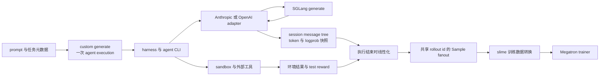

# slime Agent 工作流分析：把树状执行压成线性训练片段

> **源码基线**：slime `main@681b3adca54105d5ecd3fb822fa0dc58a427e0f9`
> **文档基线**：同一提交下 `docs/{zh,en}/get_started/{agent,customization}.md` 与 `examples/{coding_agent_rl,multi_agent,search-r1,retool}`
> **核验日期**：2026-08-18 · **系列**：[[02_engineering/04_posttrain_frameworks/slime/index|slime 源码分析]]
> **结论先行**：Agent rollout 的自然形态是带工具、副作用、subagent 分支和 context compact 的**执行树**，Megatron trainer 的自然形态却是带 token、mask、reward 和 behavior metadata 的**线性片段批次**。slime 没有让 trainer 理解消息协议或 sandbox，而是把 agent runtime 留在 custom rollout 数据面：adapter 捕获 serving 实际采样的 token，`TrajectoryManager` 暂存每个 session 的消息树，执行结束时才线性化为共享 `rollout_id` 的 `list[Sample]`。代价是轨迹所有权、reward 分配、取消与外部副作用恢复都必须在 rollout 侧明确处理；trainer 只保证片段统计不把一次 execution 重复计数，并不会替 agent runtime 修复语义错误。

本文把带 fixed-commit 定位符的内容视为源码或官方文档事实；“**设计分析**”与“**由此可推断**”是依据实现边界作出的判断，不代表项目作者原话。

## 1. 根问题：执行是树，训练是线

官方 roadmap 把多轮工具调用、sandbox、subagent、context compact 和 test-based reward 都归为 agent workflow；推荐先用 `--custom-generate-function-path` 把一次执行转成 `Sample`，只有默认 prompt × sample 编排无法表达跨 rollout 队列或完全异步工作流时，才替换整个 `--rollout-function-path`。[`docs/zh/get_started/agent.md:1-27`](https://github.com/THUDM/slime/blob/681b3adca54105d5ecd3fb822fa0dc58a427e0f9/docs/zh/get_started/agent.md#L1-L27)

两侧对象并不等价：

| 维度 | agent execution 必须保留 | trainer 实际消费 |
|---|---|---|
| 控制流 | 多轮、tool call、subagent、分支、compact、retry | 每条 row 的 token 序列与 response span |
| 状态 | message history、session、workspace、进程、外部服务 | `tokens`、`response_length`、`loss_mask`、reward |
| 身份 | 一次任务、一个 session、多个 root-to-leaf path | 多个 `Sample`，但仍需一个逻辑 `rollout_id` |
| 行为证据 | serving 实际采样 token 与逐 token logprob | 与 response token 严格对齐的 behavior metadata |
| 成败 | tool/env/test 的外部结果，可能已产生副作用 | 数值 reward、过滤状态与训练统计单位 |

trainer 侧的转换结果明确是平铺 dict：token rows、response lengths、rewards、loss masks、rollout ids 等；它不接收 message node、tool event 或 sandbox handle。[`slime/ray/rollout.py:749-797`](https://github.com/THUDM/slime/blob/681b3adca54105d5ecd3fb822fa0dc58a427e0f9/slime/ray/rollout.py#L749-L797) 官方 customization 文档也把 agent loop 与 Samples-to-train-data conversion 分成不同扩展点。[`docs/en/get_started/customization.md:32-47`](https://github.com/THUDM/slime/blob/681b3adca54105d5ecd3fb822fa0dc58a427e0f9/docs/en/get_started/customization.md#L32-L47) 通用 `Sample`、三层数据契约和 nested shape 的权威说明见 [[12_slime_sample_datasource_analysis]]；本页只解释 agent execution 如何到达那条边界。

### 1.1 五个不能在压缩时丢失的不变量

1. **动作来源**：可训练 token 必须是 rollout model 实际采样的 ids，而不是最终文本的事后重分词结果。官方 agent 文档把 adapter 的 contract 概括为 message history in、sampled tokens out。[`docs/en/get_started/agent.md:29-36`](https://github.com/THUDM/slime/blob/681b3adca54105d5ecd3fb822fa0dc58a427e0f9/docs/en/get_started/agent.md#L29-L36)
2. **动作与观察边界**：模型输出可以训练；system/user/template/tool/environment 内容只能作为上下文。`_SampleBuilder` 对 prompt tail 写 mask 0，对本轮 output 写 mask 1；共享分支重放的旧 output 也改作 mask 0 context。[`slime/agent/trajectory.py:193-229`](https://github.com/THUDM/slime/blob/681b3adca54105d5ecd3fb822fa0dc58a427e0f9/slime/agent/trajectory.py#L193-L229)
3. **执行身份**：一次 execution 即使拆成多个 fragments，也只能占一个 rollout 统计单位；`Sample.rollout_id` 的注释就是为 compact/subagent siblings 定义这一身份。[`slime/utils/types.py:93-106`](https://github.com/THUDM/slime/blob/681b3adca54105d5ecd3fb822fa0dc58a427e0f9/slime/utils/types.py#L93-L106)
4. **树的唯一训练所有权**：一个被多个 leaf 共享的模型 response 只能在首个 leaf 训练一次，其他 leaf 只可把它当 context，否则共享祖先会重复贡献梯度。[`slime/agent/trajectory.py:46-82`](https://github.com/THUDM/slime/blob/681b3adca54105d5ecd3fb822fa0dc58a427e0f9/slime/agent/trajectory.py#L46-L82)
5. **外部副作用边界**：命令执行、workspace 修改和测试结果不能靠 HTTP 重试假装幂等；sandbox contract 显式携带 `idempotent` 提示，非幂等 RPC 在瞬时故障后不自动重放。[`slime/agent/sandbox.py:27-59`](https://github.com/THUDM/slime/blob/681b3adca54105d5ecd3fb822fa0dc58a427e0f9/slime/agent/sandbox.py#L27-L59) [`slime/agent/sandbox.py:237-271`](https://github.com/THUDM/slime/blob/681b3adca54105d5ecd3fb822fa0dc58a427e0f9/slime/agent/sandbox.py#L237-L271)

> **设计分析**：这五个不变量解释了 agent runtime 为什么留在 rollout，而不是塞进 trainer。trainer 可以稳定地优化 token action，却既不应拥有 session message tree，也无法回滚已经执行的 shell 命令、检索请求或代码修改；把两者合并只会让分布式训练 ABI 同时承担协议兼容、环境生命周期和梯度计算三种变化速度完全不同的职责。

## 2. 边界在哪里：runtime 拥有执行，adapter 拥有证据，trainer 只拥有片段

| 所有者 | 保存什么 | 明确不保存什么 |
|---|---|---|
| harness / example | agent CLI、任务 prompt、workspace、工具与评分流程 | token-level loss 统计 |
| protocol adapter | session、in-flight turns、协议翻译、SGLang sampled ids/logprobs | SWE task 规则与训练 batch |
| `TrajectoryManager` | per-session message tree、generated/routing-only node、token drift、leaf linearization | 工具执行与 serving 资源 |
| stock rollout / trainer boundary | nested `Sample`、共享 `rollout_id`、flatten、train dict | message tree 与 sandbox handle |

`BaseHarness` 的接口只接收 workdir、session id、adapter URL、time budget 和 prompt；workspace preparation 与 scoring 明确留给 example 层。[`slime/agent/harness/common.py:42-104`](https://github.com/THUDM/slime/blob/681b3adca54105d5ecd3fb822fa0dc58a427e0f9/slime/agent/harness/common.py#L42-L104) `BaseAdapter` 则拥有 per-session store、inflight set、closed set 和一个内部含多棵 session tree 的 `TrajectoryManager`。[`slime/agent/adapters/common.py:127-175`](https://github.com/THUDM/slime/blob/681b3adca54105d5ecd3fb822fa0dc58a427e0f9/slime/agent/adapters/common.py#L127-L175)

> **设计分析**：adapter 不是“另一个 agent framework”。它是 agent 客户端与 rollout server 之间的证据采集器：对外维持客户端熟悉的消息协议，对内把每一次模型调用还原成 trainer 能审计的 token action。agent 的计划、tool loop 和终止条件仍由 harness/client 决定。

## 3. Adapter：为什么不能只保存最终回答

### 3.1 会话亲和不是训练身份

`open_session` 要求一次 agent run 使用唯一 sid，并保存 sampling defaults 与 context cap；`finish_session` 先 drain in-flight 请求，再消费消息树、填充人类可读的 decoded response，第二次调用返回空；`drop_session` 则是无结果清理。[`slime/agent/adapters/common.py:208-281`](https://github.com/THUDM/slime/blob/681b3adca54105d5ecd3fb822fa0dc58a427e0f9/slime/agent/adapters/common.py#L208-L281)

每一 turn 会把相同 sid 放入 `X-SMG-Routing-Key`，请求体携带已经渲染的 `input_ids` 与 `return_logprob=True`；返回 token ids 和 logprobs直接取自 `output_token_logprobs`。[`slime/agent/adapters/common.py:442-518`](https://github.com/THUDM/slime/blob/681b3adca54105d5ecd3fb822fa0dc58a427e0f9/slime/agent/adapters/common.py#L442-L518) 这使 consistent-hashing router 可以尽量复用多轮 prefix cache，但 sid 只解决 serving affinity；fanout 的训练统计身份仍由 `rollout_id` 解决。router、worker 与 request lifecycle 的完整机制见 [[13_slime_sglang_rollout_engine_analysis]]。

### 3.2 消息协议只负责重放一致性，token snapshot 才是训练事实

Anthropic adapter 把 system/user/tool/assistant blocks 归一化成 chat-template messages；tool-use 的 wire id 被丢弃，参数保留为 dict，以便下一轮客户端回放时可按消息 dict 相等挂回同一树节点。[`slime/agent/adapters/anthropic.py:78-141`](https://github.com/THUDM/slime/blob/681b3adca54105d5ecd3fb822fa0dc58a427e0f9/slime/agent/adapters/anthropic.py#L78-L141) OpenAI adapter 同样删除每轮新生成的 correlation id，并把 JSON 字符串参数归一化成 dict；否则语义相同的 echo 也会被识别成新分支。[`slime/agent/adapters/openai.py:79-163`](https://github.com/THUDM/slime/blob/681b3adca54105d5ecd3fb822fa0dc58a427e0f9/slime/agent/adapters/openai.py#L79-L163)

固定提交还有一个协议边界：roadmap 把 OpenAI adapter 描述为同时面向 Chat Completions 与 Responses API，但实现只注册 `/v1/chat/completions`，模块注释明确把 `/v1/responses` 排除在外。[`docs/en/get_started/agent.md:31-36`](https://github.com/THUDM/slime/blob/681b3adca54105d5ecd3fb822fa0dc58a427e0f9/docs/en/get_started/agent.md#L31-L36) [`slime/agent/adapters/openai.py:1-12`](https://github.com/THUDM/slime/blob/681b3adca54105d5ecd3fb822fa0dc58a427e0f9/slime/agent/adapters/openai.py#L1-L12) 因而在该基线上接 Codex-style client，应以 Chat Completions wire contract 为准，不能仅凭 roadmap 假定 Responses endpoint 已实现。

然而，回复文本只用于 agent 客户端和最终可读 sidecar。真正进入 `TurnRecord` 的是该 turn 的 `prompt_ids`、`output_ids`、finish reason 和 output logprobs。[`slime/agent/trajectory.py:28-38`](https://github.com/THUDM/slime/blob/681b3adca54105d5ecd3fb822fa0dc58a427e0f9/slime/agent/trajectory.py#L28-L38) coding-agent README 也明确指出 decoded `response` 不会被重新 tokenize 来恢复训练序列。[`examples/coding_agent_rl/README.md:142-159`](https://github.com/THUDM/slime/blob/681b3adca54105d5ecd3fb822fa0dc58a427e0f9/examples/coding_agent_rl/README.md#L142-L159)

> **为什么不只存 final text**：final text 会丢掉中间 tool-call action、每 turn 的 behavior logprob、分支共享关系与 context compact 前的可训练 response。即使文本看起来相同，chat template、special token、whitespace 与 tool block 重渲染也可能改变 token ids；这时用 `decode → encode` 得到的是“相似文本的另一条 tokenization”，不是 behavior policy 实际采取的 action。该风险不是假设：trajectory builder 专门为 TITO 与 chat-template drift 实现了 realign/fork。[`slime/agent/trajectory.py:141-191`](https://github.com/THUDM/slime/blob/681b3adca54105d5ecd3fb822fa0dc58a427e0f9/slime/agent/trajectory.py#L141-L191)

### 3.3 “客户端收到”才算一次已提交 turn

adapter 先把协议响应 flush 给客户端，只有 flush 成功后才调用 `record_turn`；连接在生成后、响应前断开时不会记录一个客户端从未见过的 assistant turn。[`slime/agent/adapters/common.py:340-390`](https://github.com/THUDM/slime/blob/681b3adca54105d5ecd3fb822fa0dc58a427e0f9/slime/agent/adapters/common.py#L340-L390) 若 SGLang 请求被 cancel、client error 或 timeout 打断，adapter 会 best-effort 调 `/abort_request` 释放对应 request id，避免孤儿 generation 一直占用 KV slot。[`slime/agent/adapters/common.py:470-511`](https://github.com/THUDM/slime/blob/681b3adca54105d5ecd3fb822fa0dc58a427e0f9/slime/agent/adapters/common.py#L470-L511)

> **设计分析**：这里的提交点不是“模型已经算出 token”，而是“agent 客户端已经观察到这次 action”。否则服务端轨迹会包含客户端历史中不存在的 turn，下一轮重放既无法挂回同一消息树，也可能训练一个从未影响环境的动作。

## 4. 消息树如何变成 Sample fanout

### 4.1 树有两类 node，只有一类能训练

`MessageNode` 区分 generated assistant node 与 routing-only node。前者持有 `TurnRecord`，后者包括 system/user/tool、外部回放但非本 adapter 生成的 assistant，以及被 rewrite-merge 降级的旧 assistant；后者只负责让后续请求找到路径。[`slime/agent/trajectory.py:46-82`](https://github.com/THUDM/slime/blob/681b3adca54105d5ecd3fb822fa0dc58a427e0f9/slime/agent/trajectory.py#L46-L82)

因此四类 token 的 mask 不是按 role 名机械决定，而是按**可证明的生成来源**决定：

| token 来源 | 在 Sample 中的作用 | mask |
|---|---|---:|
| 首轮 system/user/template prompt | 建立状态，未由 policy 采样 | response mask 之外 |
| 后续 user/tool/environment/template prompt tail | 维持真实上下文 | 0 |
| 本 adapter 捕获的 fresh model output | policy action，带 sampled logprob | 1 |
| sibling path 重放的共享 output、foreign assistant、realign 后无法证明来源的 span | 只作上下文，防止重复或错误 credit | 0 |

`append_turn` 与 `_align_to_prompt` 实际执行这套 mask 规则。[`slime/agent/trajectory.py:193-229`](https://github.com/THUDM/slime/blob/681b3adca54105d5ecd3fb822fa0dc58a427e0f9/slime/agent/trajectory.py#L193-L229) 分支测试进一步固定了 clean tool loop 中 tool token 为 context、两个 leaf 共享的 assistant response 只在第一个 leaf 训练一次。[`tests/test_agent/test_trajectory_manager_branching.py:402-419`](https://github.com/THUDM/slime/blob/681b3adca54105d5ecd3fb822fa0dc58a427e0f9/tests/test_agent/test_trajectory_manager_branching.py#L402-L419) [`tests/test_agent/test_trajectory_manager_branching.py:481-503`](https://github.com/THUDM/slime/blob/681b3adca54105d5ecd3fb822fa0dc58a427e0f9/tests/test_agent/test_trajectory_manager_branching.py#L481-L503)

### 4.2 Message fork 与 token fork 是两层不同判断

`record_turn` 先按 role 与 message dict equality 寻找挂载点，再把新 prompt suffix 和本轮 assistant leaf 接入树。[`slime/agent/trajectory.py:283-305`](https://github.com/THUDM/slime/blob/681b3adca54105d5ecd3fb822fa0dc58a427e0f9/slime/agent/trajectory.py#L283-L305) 到 linearization 阶段，每个 root-to-leaf chain 才按 token prefix 分成 builder：无 drift 就延伸，短且只落在最近 response 的 drift 可以 realign，较早或较大分歧则开启新 builder；共享 generated node 由 `response_trained` 保证只被首个 leaf claim。[`slime/agent/trajectory.py:456-502`](https://github.com/THUDM/slime/blob/681b3adca54105d5ecd3fb822fa0dc58a427e0f9/slime/agent/trajectory.py#L456-L502)

**由此可推断**，源码并不理解“这个 fork 是 subagent”还是“这是 context compact”。它只看到消息历史分歧与 token provenance 分歧；subagent/compact 是 agent runtime 的语义标签，tree manager 提供的是通用的分支保真与线性化机制。官方文档把 divergence 对应到 subagent 与 auto-compaction，是对该机制的应用解释。[`examples/coding_agent_rl/README.md:5-15`](https://github.com/THUDM/slime/blob/681b3adca54105d5ecd3fb822fa0dc58a427e0f9/examples/coding_agent_rl/README.md#L5-L15)

### 4.3 execution 到 Sample：树只在 rollout 侧存在

`get_trajectory` 枚举每个 routing leaf，把 chain 转成一个或多个 Sample，然后消费整个 sid；`to_sample` 复制 base sample 的 task identity，把 `rollout_id` 设为 base rollout id 或 base sample index，并只导出首轮 prompt 之后的 response mask/logprob span。[`slime/agent/trajectory.py:234-261`](https://github.com/THUDM/slime/blob/681b3adca54105d5ecd3fb822fa0dc58a427e0f9/slime/agent/trajectory.py#L234-L261) [`slime/agent/trajectory.py:307-344`](https://github.com/THUDM/slime/blob/681b3adca54105d5ecd3fb822fa0dc58a427e0f9/slime/agent/trajectory.py#L307-L344)

custom generate 返回的 `list[Sample]` 会在 stock `generate_and_rm_group` 外再包一层，形成 prompt × rollout × fragments 的 nested output；RolloutManager 在 flatten 前要求深层 siblings 的 `rollout_id` 全部存在且相同。[`slime/rollout/sglang_rollout.py:297-327`](https://github.com/THUDM/slime/blob/681b3adca54105d5ecd3fb822fa0dc58a427e0f9/slime/rollout/sglang_rollout.py#L297-L327) [`slime/ray/rollout.py:941-970`](https://github.com/THUDM/slime/blob/681b3adca54105d5ecd3fb822fa0dc58a427e0f9/slime/ray/rollout.py#L941-L970) flatten 后消息树和嵌套层级都消失，trainer 只靠 `rollout_id` 恢复“这些 rows 属于同一次 execution”的关系。

### 4.4 Reward 分配与 rollout 统计是两条独立契约

若一次 execution 的总 reward 是 $R$，拆成 $K$ 个 fragments 时，“守恒分配”的常见写法是：

$$
r_k=\frac{R}{K},\qquad \sum_{k=1}^{K}r_k=R.
$$

官方 customization 文档把它写成常见 pattern，而非框架自动行为。[`docs/en/get_started/customization.md:87-117`](https://github.com/THUDM/slime/blob/681b3adca54105d5ecd3fb822fa0dc58a427e0f9/docs/en/get_started/customization.md#L87-L117) 固定提交的 `TrajectoryManager` 实际采用另一种 credit assignment：完整 reward 赋给每个 emitted Sample，因此原始片段 reward 的和是 $KR$。[`slime/agent/trajectory.py:307-344`](https://github.com/THUDM/slime/blob/681b3adca54105d5ecd3fb822fa0dc58a427e0f9/slime/agent/trajectory.py#L307-L344) 分支测试也显式断言两个 fork/leaf 都各自拿完整 1.0。[`tests/test_agent/test_trajectory_manager_branching.py:769-807`](https://github.com/THUDM/slime/blob/681b3adca54105d5ecd3fb822fa0dc58a427e0f9/tests/test_agent/test_trajectory_manager_branching.py#L769-L807)

> [!contradiction] 固定提交内的文档与实现不一致
> coding-agent README 声称 per-trajectory reward 会按 `reward / K` 分到 chains；但 `generate()` 把完整 reward 传入 `finish_session`，后者再交给上述“每个 Sample 完整赋值”的 manager，没有额外除以 $K$。[`examples/coding_agent_rl/README.md:182-186`](https://github.com/THUDM/slime/blob/681b3adca54105d5ecd3fb822fa0dc58a427e0f9/examples/coding_agent_rl/README.md#L182-L186) [`examples/coding_agent_rl/generate.py:237-268`](https://github.com/THUDM/slime/blob/681b3adca54105d5ecd3fb822fa0dc58a427e0f9/examples/coding_agent_rl/generate.py#L237-L268) 本页以源码与测试为准：当前默认是“每片段完整 outcome reward”，需要守恒时调用方必须显式除以 $K$。

共享 `rollout_id` 解决的是另一件事：DP schedule 按 rollout id 分组、以 rollout 数而非 fragment 数决定 step 数；converter 又为同 rollout 汇总全部 mask token 数，供 per-rollout reducer 使用。[`slime/utils/dp_schedule.py:82-150`](https://github.com/THUDM/slime/blob/681b3adca54105d5ecd3fb822fa0dc58a427e0f9/slime/utils/dp_schedule.py#L82-L150) [`slime/ray/rollout.py:799-814`](https://github.com/THUDM/slime/blob/681b3adca54105d5ecd3fb822fa0dc58a427e0f9/slime/ray/rollout.py#L799-L814) E2E fanout 测试把完整链固定为 custom generate fanout → nested id validation → rollout-aware step split → rollout denominator。[`tests/test_qwen2.5_0.5B_fanout_short.py:1-39`](https://github.com/THUDM/slime/blob/681b3adca54105d5ecd3fb822fa0dc58a427e0f9/tests/test_qwen2.5_0.5B_fanout_short.py#L1-L39)

> **设计分析**：统计去重不会替你选择 credit assignment。共享 `rollout_id` 防止 $K$ 个 fragments 被当成 $K$ 次 execution；`reward / K` 还是完整 $R$ 则决定每个分支看到什么任务信号。前者是 trainer ABI，后者是 agent 算法语义。

## 5. 一条 coding-agent execution 的端到端追踪

下面沿官方 `examples/coding_agent_rl` 的真实入口追踪一次训练 rollout；这是“树状执行 → 线性 Sample”的完整闭环，而不只是 adapter 局部调用。

| 步骤 | 所有权与状态变化 | 固定提交证据 |
|---:|---|---|
| 1 | stock rollout 调 per-sample custom generate；example 从 base `Sample` 读取 image、workdir、problem 与 grader metadata | [`examples/coding_agent_rl/generate.py:182-192`](https://github.com/THUDM/slime/blob/681b3adca54105d5ecd3fb822fa0dc58a427e0f9/examples/coding_agent_rl/generate.py#L182-L192) |
| 2 | example 生成稳定 session id，adapter 注册 sampling defaults 与整段 context budget | [`examples/coding_agent_rl/generate.py:194-200`](https://github.com/THUDM/slime/blob/681b3adca54105d5ecd3fb822fa0dc58a427e0f9/examples/coding_agent_rl/generate.py#L194-L200) |
| 3 | 启动新 agent sandbox，准备 workspace，再由 Claude Code 或 Codex harness 运行 CLI；harness 通过 adapter URL 反向请求 rollout model | [`examples/coding_agent_rl/generate.py:201-213`](https://github.com/THUDM/slime/blob/681b3adca54105d5ecd3fb822fa0dc58a427e0f9/examples/coding_agent_rl/generate.py#L201-L213) |
| 4 | 每次 CLI message request 经协议 adapter 渲染为 `input_ids`、调用 SGLang、把 sampled ids/logprobs 记录进 sid 对应 message tree | [`slime/agent/adapters/common.py:318-390`](https://github.com/THUDM/slime/blob/681b3adca54105d5ecd3fb822fa0dc58a427e0f9/slime/agent/adapters/common.py#L318-L390) |
| 5 | agent 在 sandbox 中读写代码并运行工具；结束后 example 只提取 git diff，排除 problem statement 与 harness 自身文件 | [`examples/coding_agent_rl/swe.py:227-233`](https://github.com/THUDM/slime/blob/681b3adca54105d5ecd3fb822fa0dc58a427e0f9/examples/coding_agent_rl/swe.py#L227-L233) |
| 6 | agent sandbox 已退出后，grader 在第二个 clean sandbox 应用 diff 并跑指定测试；reward 只由 patch 在干净环境的结果产生 | [`examples/coding_agent_rl/swe.py:239-287`](https://github.com/THUDM/slime/blob/681b3adca54105d5ecd3fb822fa0dc58a427e0f9/examples/coding_agent_rl/swe.py#L239-L287) |
| 7 | `finish_session` drain in-flight turns，按 leaf/builders 线性化，输出一个或多个共享 rollout id 的 Samples；example 添加 exit-code metadata | [`examples/coding_agent_rl/generate.py:237-268`](https://github.com/THUDM/slime/blob/681b3adca54105d5ecd3fb822fa0dc58a427e0f9/examples/coding_agent_rl/generate.py#L237-L268) |
| 8 | stock rollout 保留 nested fanout，分别补 reward 或接受 example 已填 reward；RolloutManager 验证 id 后 flatten 并转成 trainer dict | [`slime/rollout/sglang_rollout.py:254-280`](https://github.com/THUDM/slime/blob/681b3adca54105d5ecd3fb822fa0dc58a427e0f9/slime/rollout/sglang_rollout.py#L254-L280) [`slime/ray/rollout.py:687-701`](https://github.com/THUDM/slime/blob/681b3adca54105d5ecd3fb822fa0dc58a427e0f9/slime/ray/rollout.py#L687-L701) |
| 9 | 无论成功、超时或异常，finally 都 drop adapter session；异常路径返回 `remove_sample=True` 且全零 mask 的 ABORTED placeholder | [`examples/coding_agent_rl/generate.py:270-333`](https://github.com/THUDM/slime/blob/681b3adca54105d5ecd3fb822fa0dc58a427e0f9/examples/coding_agent_rl/generate.py#L270-L333) |

CPU-only E2E 测试只替换 tokenizer、sandbox、SGLang 和 agent CLI 四个外部边缘，真实运行 generate orchestration、adapter HTTP、tree building、workspace/diff/eval 与 harness transport；它验证生成 Sample 的 mask/logprob 对齐以及 clean-eval reward。[`tests/test_agent/test_agent_rollout_cpu.py:1-9`](https://github.com/THUDM/slime/blob/681b3adca54105d5ecd3fb822fa0dc58a427e0f9/tests/test_agent/test_agent_rollout_cpu.py#L1-L9) [`tests/test_agent/test_agent_rollout_cpu.py:175-194`](https://github.com/THUDM/slime/blob/681b3adca54105d5ecd3fb822fa0dc58a427e0f9/tests/test_agent/test_agent_rollout_cpu.py#L175-L194)

## 6. 四个直观替代方案为什么会破坏契约

| 替代方案 | 看似简单之处 | 丢失或扭曲什么 | slime 的选择 |
|---|---|---|---|
| 只存 final text | 一条字符串即可评分和落盘 | 中间 action、logprob、tool context、分支与 compact 前片段全部消失 | 每 turn 保存 token snapshot，结束时才 decode response sidecar |
| 对每次 response 文本重新 tokenize | 不要求 serving 返回 token metadata | chat template、whitespace、special/tool token 会漂移，无法证明 action provenance | SGLang 返回 sampled ids/logprobs；drift span只作 context或 fork |
| 把完整 message tree 发给 trainer | 不需要 rollout 侧 linearize | trainer 必须理解协议 node、外部 observation、tree dedup 和动态分支，batch ABI随 agent runtime 演化 | tree 由 `TrajectoryManager` 独占，边界只输出 Samples |
| 每个 leaf 当独立 rollout | flatten 最直接 | 一个 execution 的 step 数、loss 分母和共享祖先 credit 随分支数变化 | siblings 共享 `rollout_id`，共享 response 只训练一次 |

这些不是纯粹的风格偏好。源码在三个位置把选择变成门禁：adapter 从 `output_token_logprobs` 取 ids/logprobs，[`slime/agent/adapters/common.py:496-518`](https://github.com/THUDM/slime/blob/681b3adca54105d5ecd3fb822fa0dc58a427e0f9/slime/agent/adapters/common.py#L496-L518) tree linearizer对 shared response 去重，[`slime/agent/trajectory.py:456-477`](https://github.com/THUDM/slime/blob/681b3adca54105d5ecd3fb822fa0dc58a427e0f9/slime/agent/trajectory.py#L456-L477) nested validator拒绝缺失或不一致的 sibling rollout ids。[`slime/ray/rollout.py:941-970`](https://github.com/THUDM/slime/blob/681b3adca54105d5ecd3fb822fa0dc58a427e0f9/slime/ray/rollout.py#L941-L970)

## 7. 官方示例的边界：它们不是同一种 agent runtime

| 示例 | 执行拓扑与 token 处理 | 它证明什么 | 不应外推什么 |
|---|---|---|---|
| Search-R1 | 单 Sample 内手写 search loop；默认开启 logprob 时直接取 SGLang ids/logprobs，search observation 本地 tokenize 后 mask 0 | 最小“模型 action → tool observation → 下一 turn”模板 | 关闭 logprob 后会走 response text 后处理与重分词路径，因此不再具有 adapter 的 exact-token provenance 保证。[`examples/search-r1/generate_with_search.py:197-248`](https://github.com/THUDM/slime/blob/681b3adca54105d5ecd3fb822fa0dc58a427e0f9/examples/search-r1/generate_with_search.py#L197-L248) |
| ReTool | 单 Sample 内的 code-interpreter loop；每轮按剩余 context clamp generation，tool observation也裁到同一 hard cap并 mask 0 | retry state hygiene、工具注册、context budget 是 rollout 责任 | 明确断言不支持 stock partial rollout；不能把它当成任意中断可续的 agent runtime。[`examples/retool/generate_with_retool.py:215-275`](https://github.com/THUDM/slime/blob/681b3adca54105d5ecd3fb822fa0dc58a427e0f9/examples/retool/generate_with_retool.py#L215-L275) [`examples/retool/generate_with_retool.py:299-374`](https://github.com/THUDM/slime/blob/681b3adca54105d5ecd3fb822fa0dc58a427e0f9/examples/retool/generate_with_retool.py#L299-L374) |
| Multi-agent | 并发 solver，再并发 rewriter，最后 selector；每次模型调用生成一个独立 Sample，`_emit` 将所有阶段 stamp 为输入 sample index 的同一 rollout id | 一个 execution 可以显式产出许多训练 rows，reward也可按 agent role调整 | 它不维护共享 message tree，也不做共享祖先 token dedup；这些 agent 是独立 prompt 调用，不等同于 adapter 的 subagent branch。[`examples/multi_agent/agent_system.py:198-228`](https://github.com/THUDM/slime/blob/681b3adca54105d5ecd3fb822fa0dc58a427e0f9/examples/multi_agent/agent_system.py#L198-L228) [`examples/multi_agent/agent_system.py:239-296`](https://github.com/THUDM/slime/blob/681b3adca54105d5ecd3fb822fa0dc58a427e0f9/examples/multi_agent/agent_system.py#L239-L296) |
| Coding-agent RL | CLI 使用 Anthropic/OpenAI adapter，per-session tree 捕获多轮、subagent/compact divergence；真实 sandbox 改代码，第二 clean sandbox评分 | 完整 execution、外部副作用、tree linearization、fanout 与 test reward 的闭环 | 当前固定提交不自动 reward/K；也没有把任意外部副作用持久化成可重放事务 |

还有一个固定基线边界：list-returning custom generate 与默认 per-sample RM 路径兼容；但 fanout E2E 测试明确记录 `--group-rm` 仍假设 flat group，和 nested fanout 组合会把 `list[list[Sample]]` 传给单 Sample RM 并崩溃。[`tests/test_qwen2.5_0.5B_fanout_short.py:74-87`](https://github.com/THUDM/slime/blob/681b3adca54105d5ecd3fb822fa0dc58a427e0f9/tests/test_qwen2.5_0.5B_fanout_short.py#L74-L87) **由此可推断**，选择示例不能只看“是否多轮”：还要看它是单 Sample 内手写 loop、显式多 agent fanout，还是有 message-tree ownership 的外部 agent runtime。

## 8. 取消、恢复与外部副作用：三种 durability 不能混为一谈

### 8.1 模型请求：可取消，但不承诺轨迹续跑

adapter 关闭 sid 时先标记 closed，等待 in-flight turns，超时后取消剩余 task；`finish_session` 消费已有 tree，`drop_session` 则直接清理。[`slime/agent/adapters/common.py:225-281`](https://github.com/THUDM/slime/blob/681b3adca54105d5ecd3fb822fa0dc58a427e0f9/slime/agent/adapters/common.py#L225-L281) coding-agent 的 wall-clock timeout不会把半棵树交给 trainer，而是返回 remove-sample 的 ABORTED placeholder并在 finally drop sid。[`examples/coding_agent_rl/generate.py:270-333`](https://github.com/THUDM/slime/blob/681b3adca54105d5ecd3fb822fa0dc58a427e0f9/examples/coding_agent_rl/generate.py#L270-L333)

**由此可推断**，当前 coding-agent example 的恢复单位是“重新调度整条 sample”，不是从持久化 message-tree checkpoint 接续。普通 SGLang partial Sample、engine drain 与 server recovery 是另一套协议，见 [[13_slime_sglang_rollout_engine_analysis]] 与 [[18_slime_fault_tolerance_observability_analysis]]。

### 8.2 长命令：保存完成标记，不重放非幂等 shell

`exec_and_wait` 不维持一个长 HTTP stream，而是把命令 detached 启动、输出写文件、退出码写 done marker，再通过短的幂等轮询等待；spawn 还用每次调用的 lock dir 去重同一 transport retry。[`slime/agent/sandbox.py:82-145`](https://github.com/THUDM/slime/blob/681b3adca54105d5ecd3fb822fa0dc58a427e0f9/slime/agent/sandbox.py#L82-L145) 对应测试同时验证“同一逻辑 tag 的下一次调用必须真的重跑”和“同一次 spawn RPC 的 transport replay 不得双执行”。[`tests/test_agent/test_sandbox_exec_and_wait.py:125-161`](https://github.com/THUDM/slime/blob/681b3adca54105d5ecd3fb822fa0dc58a427e0f9/tests/test_agent/test_sandbox_exec_and_wait.py#L125-L161)

### 8.3 Workspace 副作用：隔离与评分，不是分布式事务

agent sandbox 退出后即被 kill；grader 在第二个 clean sandbox 只应用提取出的 diff，因此训练 reward 不依赖 agent 运行时留下的隐藏 workspace 状态。[`slime/agent/sandbox.py:281-307`](https://github.com/THUDM/slime/blob/681b3adca54105d5ecd3fb822fa0dc58a427e0f9/slime/agent/sandbox.py#L281-L307) [`examples/coding_agent_rl/swe.py:239-287`](https://github.com/THUDM/slime/blob/681b3adca54105d5ecd3fb822fa0dc58a427e0f9/examples/coding_agent_rl/swe.py#L239-L287)

> **设计分析**：clean evaluator 解决的是 test cheating 与评分可复现性，不是外部世界的 exactly-once。Search API、浏览器、远端数据库或真实提交若产生 sandbox 外副作用，slime 当前 agent contract 没有通用 side-effect journal、补偿事务或幂等 key；接入方必须在 tool/environment 层自行提供。

## 9. 读实现时最容易混淆的四条边界

1. **session id ≠ rollout id**：前者维持协议会话与 serving affinity，后者定义训练统计身份。[`slime/utils/types.py:93-106`](https://github.com/THUDM/slime/blob/681b3adca54105d5ecd3fb822fa0dc58a427e0f9/slime/utils/types.py#L93-L106) [`slime/utils/types.py:148-149`](https://github.com/THUDM/slime/blob/681b3adca54105d5ecd3fb822fa0dc58a427e0f9/slime/utils/types.py#L148-L149)
2. **message equality ≠ token provenance**：消息相等决定树挂载，token prefix 与 drift 决定能否延续同一个训练 builder。[`slime/agent/trajectory.py:352-368`](https://github.com/THUDM/slime/blob/681b3adca54105d5ecd3fb822fa0dc58a427e0f9/slime/agent/trajectory.py#L352-L368) [`slime/agent/trajectory.py:169-229`](https://github.com/THUDM/slime/blob/681b3adca54105d5ecd3fb822fa0dc58a427e0f9/slime/agent/trajectory.py#L169-L229)
3. **fanout 去重 ≠ reward 均分**：共享 id 让 step/loss按一次 rollout 统计，reward 数值仍由 agent workflow决定。[`slime/ray/rollout.py:799-814`](https://github.com/THUDM/slime/blob/681b3adca54105d5ecd3fb822fa0dc58a427e0f9/slime/ray/rollout.py#L799-L814) [`slime/agent/trajectory.py:307-344`](https://github.com/THUDM/slime/blob/681b3adca54105d5ecd3fb822fa0dc58a427e0f9/slime/agent/trajectory.py#L307-L344)
4. **sandbox restart ≠ execution replay**：进程与文件可以隔离重建，但外部 API 副作用和半完成 message tree 不会自动恢复；coding-agent timeout 路径会丢弃 sid 并输出 ABORTED placeholder。[`examples/coding_agent_rl/generate.py:270-333`](https://github.com/THUDM/slime/blob/681b3adca54105d5ecd3fb822fa0dc58a427e0f9/examples/coding_agent_rl/generate.py#L270-L333)

## Related Pages

- [[12_slime_sample_datasource_analysis]] — `Sample` identity、nested fanout、flatten 与训练 dict 的权威数据契约。
- [[13_slime_sglang_rollout_engine_analysis]] — session routing key、SGLang request、partial/abort 与 engine lifecycle 的服务侧机制。
- [[15_slime_loss_parallelism_analysis]] — shared `rollout_id` 进入 per-rollout reducer 后如何保持 DP/CP 下的统计口径。
- [[18_slime_fault_tolerance_observability_analysis]] — 区分 request、engine、data source 与训练阶段的恢复范围。
- [[19_slime_rollout_backend_extension_analysis]] — custom generate、完整 rollout function 与 external backend 分别替换哪一层协议。
- [[30_slime_rollout_optimization_analysis]] — agent 多轮长上下文、sandbox P99 与 serving 并发如何共同决定有效样本吞吐。
