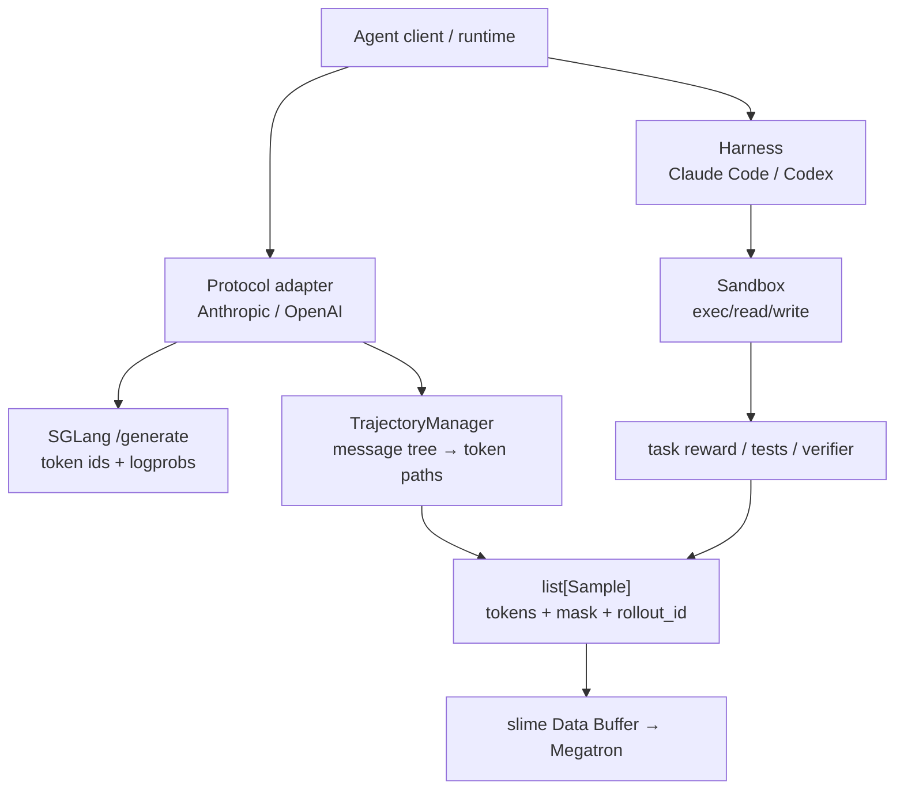

# slime Agent 工作流与官方样例实现分析

> **定位**：slime 段 1 实现机制 · Agentic RL / Tool / Sandbox / Fan-out
> **源码基线**：`THUDM/slime@681b3adca54105d5ecd3fb822fa0dc58a427e0f9`
> **系列入口**：[[slime/index]]

## 1. 中心结论

slime 不把 agent runtime 塞进 trainer，而是要求任意 agent workflow 最终交付一个可训练的 token contract：**模型实际采样的 token id 与 logprob 保留为 trainable span，tool/environment/template token 作为 context 但 `loss_mask=0`，分支轨迹用共享 `rollout_id` 的多个 `Sample` 表达**。

官方 agent 路线图把 custom generate 定位为首选入口，只有默认 prompt×sample 编排无法表达跨 rollout 队列、完全异步等行为时才替换整个 rollout function。[`agent.md:19-27`](https://github.com/THUDM/slime/blob/681b3adca54105d5ecd3fb822fa0dc58a427e0f9/docs/zh/get_started/agent.md#L19-L27)

## 2. Agent 接入的分层架构

| 层 | 责任 | 不负责 |
|---|---|---|
| adapter | 把 Anthropic/OpenAI 消息协议翻译成 SGLang token 请求 | 决定任务 reward |
| trajectory | 保存分支、处理 TITO drift、线性化成 Sample | 执行工具 |
| harness | 安装/配置/运行 agent CLI | SWE workspace 与评分 |
| sandbox | 最小 async exec/read/write 协议与长任务 transport | 解释 agent 轨迹 |
| example/task | 数据解析、环境准备、tool/reward/test | 修改 trainer kernel |

## 3. 最重要的正确性契约：训练 token 不能从文本重分词恢复

adapter 对每一 turn 使用渲染后的 `input_ids` 请求 SGLang，并强制 `return_logprob=True`；返回时直接从 `output_token_logprobs` 同时取 token id 与 logprob。[`adapters/common.py:442-501`](https://github.com/THUDM/slime/blob/681b3adca54105d5ecd3fb822fa0dc58a427e0f9/slime/agent/adapters/common.py#L442-L501)

`Sample.append_response_tokens` 把这条规则做成运行时门禁：trainable token 没有 logprob 会报错，非 trainable token 反而禁止传真实 logprob并自动补零，同时维护 response length、loss mask 和 top-p metadata 对齐。[`types.py:253-314`](https://github.com/THUDM/slime/blob/681b3adca54105d5ecd3fb822fa0dc58a427e0f9/slime/utils/types.py#L253-L314)

这比 `decode(output) → 拼接消息 → tokenizer.encode()` 更可靠，因为 chat template、空格、special token 和 tool block 都可能让 TITO（token-in/token-out）往返产生漂移。训练目标应来自 serving 实际采样 token，而不是事后猜测。

## 4. 多轮、分支与 context compact

### 4.1 Message tree，而不是单条 append-only list

`TrajectoryManager` 按 session 建消息树；每个生成的 assistant node 保存 `TurnRecord(prompt_ids, output_ids, logprobs, finish_reason)`，routing-only 的 system/user/tool 节点只负责挂载历史。共享祖先 response 只在第一个 leaf path 训练一次，其他 sibling 重新出现时 mask 为 0。[`trajectory.py:28-82`](https://github.com/THUDM/slime/blob/681b3adca54105d5ecd3fb822fa0dc58a427e0f9/slime/agent/trajectory.py#L28-L82)

### 4.2 TITO drift 分三类

builder 把新 prompt 与已有 token 比较：完全前缀一致则 CLEAN；仅最近 response span 的短漂移则 REALIGN 并把覆盖部分 mask 为 0；更早或更大的分歧则 FORK，新建训练片段。[`trajectory.py:130-158`](https://github.com/THUDM/slime/blob/681b3adca54105d5ecd3fb822fa0dc58a427e0f9/slime/agent/trajectory.py#L130-L158) [`trajectory.py:169-224`](https://github.com/THUDM/slime/blob/681b3adca54105d5ecd3fb822fa0dc58a427e0f9/slime/agent/trajectory.py#L169-L224)

### 4.3 fan-out 身份与 reward

线性化时每个 builder 产生一个 `Sample`，沿用 base sample 的 `rollout_id`；response mask/logprob 只覆盖首轮 prompt 之后的区域。[`trajectory.py:234-261`](https://github.com/THUDM/slime/blob/681b3adca54105d5ecd3fb822fa0dc58a427e0f9/slime/agent/trajectory.py#L234-L261) 每个 leaf 可产生多个 sample，结果 reward 默认完整赋给每个训练片段而非均分；调用方必须确认这正是希望的 credit assignment。[`trajectory.py:307-344`](https://github.com/THUDM/slime/blob/681b3adca54105d5ecd3fb822fa0dc58a427e0f9/slime/agent/trajectory.py#L307-L344)

## 5. 会话亲和与 serving 优化

adapter 把稳定 `session_id` 放进 `X-SMG-Routing-Key`，让 consistent-hashing router 尽量把同一多轮会话送到同一 worker，复用 prefix cache。[`adapters/common.py:470-484`](https://github.com/THUDM/slime/blob/681b3adca54105d5ecd3fb822fa0dc58a427e0f9/slime/agent/adapters/common.py#L470-L484) 官方同时建议 agent workload 评估 PD 分离、SGLang config 和投机/低精度，因为多轮请求具有长 context、重尾时延和多模型服务需求。[`agent.md:55-65`](https://github.com/THUDM/slime/blob/681b3adca54105d5ecd3fb822fa0dc58a427e0f9/docs/zh/get_started/agent.md#L55-L65)

请求取消/超时时，adapter 还会尽力调用 `/abort_request` 释放 SGLang slot，避免孤儿 generation 持续占 KV cache。[`adapters/common.py:502-510`](https://github.com/THUDM/slime/blob/681b3adca54105d5ecd3fb822fa0dc58a427e0f9/slime/agent/adapters/common.py#L502-L510)

## 6. 官方样例分别证明什么

### 6.1 Search-R1：最小多轮 tool loop

模型输出 token 直接记为 trainable，搜索 observation token 追加为 non-trainable；若收集 logprob，则 observation 补零并断言整体长度一致。[`generate_with_search.py:202-253`](https://github.com/THUDM/slime/blob/681b3adca54105d5ecd3fb822fa0dc58a427e0f9/examples/search-r1/generate_with_search.py#L202-L253) 它适合作为“生成→解析 tool call→环境 observation→再生成”的最小模板。

### 6.2 ReTool：工具注册、sandbox 与上下文预算

ReTool 启动每次重试时先清理旧 response/logprob/top-p 状态，随后每一轮按剩余 context budget clamp `max_new_tokens`；工具输出也会裁剪到训练侧最大上下文。[`generate_with_retool.py:215-268`](https://github.com/THUDM/slime/blob/681b3adca54105d5ecd3fb822fa0dc58a427e0f9/examples/retool/generate_with_retool.py#L215-L268) [`generate_with_retool.py:321-378`](https://github.com/THUDM/slime/blob/681b3adca54105d5ecd3fb822fa0dc58a427e0f9/examples/retool/generate_with_retool.py#L321-L378) 它比 Search-R1 多展示了 retry state hygiene、tool registry、context hard cap 与 tool-use reward。

### 6.3 Multi-agent：一个 prompt 产生多个训练 sample

custom generate 动态加载 agent system，返回 `list[Sample]` 并随机打乱；这证明 fan-out 是数据契约而不是 trainer 特例。[`rollout_with_multi_agents.py:8-33`](https://github.com/THUDM/slime/blob/681b3adca54105d5ecd3fb822fa0dc58a427e0f9/examples/multi_agent/rollout_with_multi_agents.py#L8-L33) 生产实现仍必须确保 sibling `rollout_id` 和 reward reducer 语义正确。

### 6.4 Coding-agent RL：真实 CLI、双 sandbox、test reward

每条 sample 创建稳定 session、启动独立 sandbox、准备 workspace、运行可替换 harness、提取 git diff；agent sandbox 退出后，再在新的 evaluator sandbox 应用 diff 和跑测试，最后把 reward 合并进 trajectory samples。[`coding_agent_rl/generate.py:182-245`](https://github.com/THUDM/slime/blob/681b3adca54105d5ecd3fb822fa0dc58a427e0f9/examples/coding_agent_rl/generate.py#L182-L245)

Harness 基类只约定 install CLI、write config、launch/wait，task-specific workspace 和 scoring 留在 example 层；仓库提供 Claude Code 与 Codex 实现。[`harness/common.py:1-14`](https://github.com/THUDM/slime/blob/681b3adca54105d5ecd3fb822fa0dc58a427e0f9/slime/agent/harness/common.py#L1-L14) [`harness/common.py:57-104`](https://github.com/THUDM/slime/blob/681b3adca54105d5ecd3fb822fa0dc58a427e0f9/slime/agent/harness/common.py#L57-L104)

Sandbox protocol 刻意很小：async lifecycle、exec、read、write，并用 `idempotent` 提示 transport retry 是否安全。[`sandbox.py:1-59`](https://github.com/THUDM/slime/blob/681b3adca54105d5ecd3fb822fa0dc58a427e0f9/slime/agent/sandbox.py#L1-L59) 对长任务，`exec_and_wait` 采用 detached process + done marker + 短轮询，避免 HTTP/2 长连接断开后无从判断非幂等命令是否执行。[`sandbox.py:82-145`](https://github.com/THUDM/slime/blob/681b3adca54105d5ecd3fb822fa0dc58a427e0f9/slime/agent/sandbox.py#L82-L145)

## 7. 示例选择指南

| 需求 | 起点 |
|---|---|
| 一个搜索/检索工具，多轮交互 | Search-R1 |
| Python 工具、上下文硬预算、tool reward | ReTool |
| 一个 prompt 分裂为多个 agent/sample | Multi-agent |
| 外部 agent CLI、真实代码修改、test reward | Coding-agent RL |
| 长尾生成不等待最慢样本 | fully_async example + custom generate |
| 已有 Anthropic/OpenAI agent runtime | 对应 protocol adapter + TrajectoryManager |

## 8. 稳定性与 credit-assignment 风险

- **token provenance**：模型 token 必须取自 SGLang response；tool text 才可本地 tokenize 且 mask=0。
- **重试污染**：ABORTED/PARTIAL sample 再用前要清理旧 token/logprob/metadata。
- **context overflow**：每轮 generation 和随后 observation 都要计入同一 hard cap。
- **分支重复训练**：共享 ancestor response 只能训练一次，其他 path 只能作 context。
- **fan-out reward**：当前 trajectory manager 给每片段完整 outcome reward；需结合 loss reducer 判断是否造成重复 credit。
- **sandbox 幂等性**：网络重试不应重复执行修改 workspace、提交或测试等非幂等命令。
- **长尾**：sandbox boot、tool service 和 evaluator 比 decode 更可能决定 P99；应分别记录耗时。
- **版本一致性**：长 agent session 要记录每次 SGLang response 的 weight version，避免同一 trajectory 跨 actor 版本。

## 9. 相关页面

- [[12_slime_sample_datasource_analysis]]
- [[13_slime_sglang_rollout_engine_analysis]]
- [[19_slime_rollout_backend_extension_analysis]]
- [[30_slime_rollout_optimization_analysis]]
- [[31_slime_posttraining_stability_analysis]]
