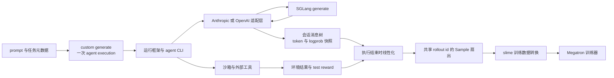
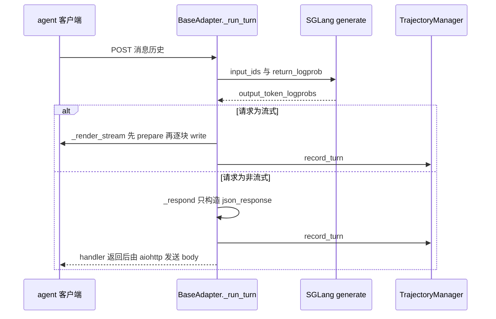
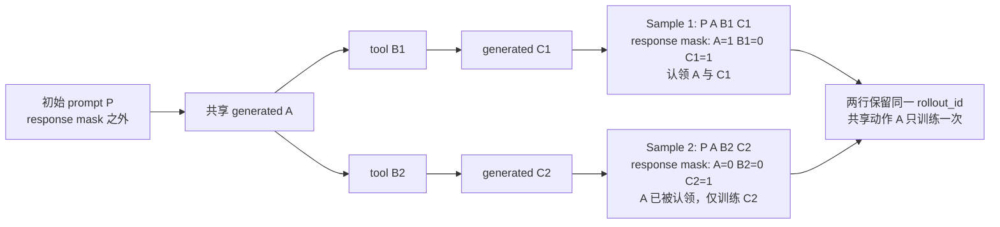
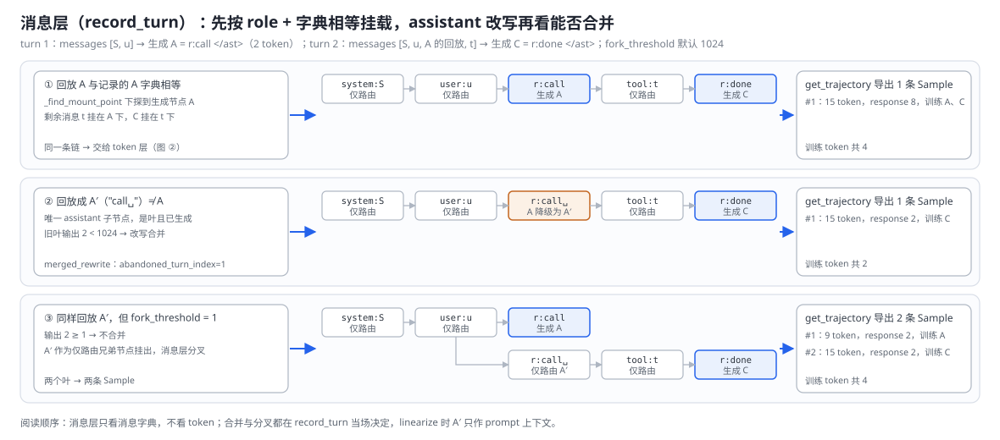
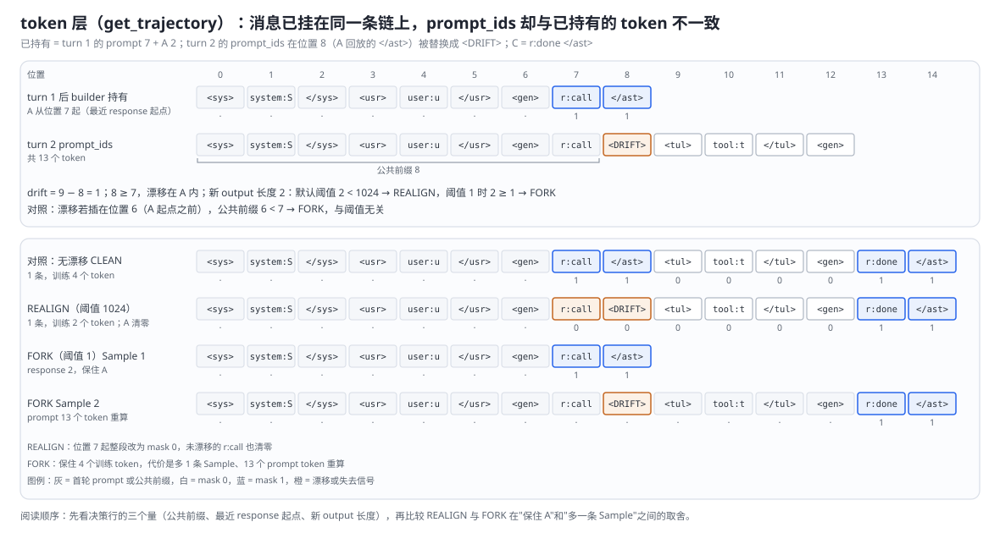

# slime Agent 工作流分析：把树状执行压成线性训练片段

> **源码基线**：`THUDM/slime@4c193f1f37509cca70f0e88807a9305b70f63f4e`（`main`，2026-09-03）
> **源码基线**：`sgl-project/sglang@0b3bb0cbe31873994c9f989fddfe2f87ca839fdd`（`v0.5.15.post1`，2026-07-13）
> **主题**：Agent 执行树与训练片段之间的数据契约、职责边界，以及协议适配层如何提交一次交互轮次、如何中止在途生成。随后是消息层挂载与 token 层漂移两层判断、线性化扇出与 reward 口径。最后是 coding-agent 示例的端到端生命周期与超时出口、其他官方示例，以及取消、恢复、外部副作用与成本约束。
> **适用范围**：agent 工作流从协议请求到 `list[Sample]` 的数据路径；`Sample` 契约、展平与 reward 归一化见 [[12_slime_sample_datasource_analysis|Sample 与 DataSource]]，路由与引擎级中止见 [[13_slime_sglang_rollout_engine_analysis|SGLang rollout 引擎]]，按 rollout 分步见 [[14_slime_megatron_training_analysis|Megatron 训练]]，图文多轮见 [[26_slime_multimodal_vlm_path_analysis|多模态 VLM 路径]]。
> **最近更新**：2026-09-17。覆盖流式与非流式下的轮次提交点、经 router worker 扇出的请求中止、消息层改写合并与 token 漂移对齐的两层原理图、coding-agent 的超时出口与成本账。

Agent rollout 的自然形态是带工具、副作用、subagent 分支和上下文压缩的**执行树**，Megatron 训练器需要的却是带 token、mask、reward 和行为策略元数据的**线性片段批次**。slime 没有让训练器理解消息协议或沙箱，而是把 agent 运行时留在自定义 rollout 的数据路径中：适配层捕获推理服务实际采样的 token，`TrajectoryManager` 暂存每个会话的消息树，执行结束时才线性化为共享 `rollout_id` 的 `list[Sample]`。收益是训练器 ABI 不随 agent 协议演化，可训练 token 的来源可以审计；代价是轨迹状态归属、交互轮次的提交点、token 漂移时丢弃哪些训练信号、reward 分配、取消与外部副作用恢复都必须在 rollout 侧明确处理。训练器只保证片段统计不会把一次逻辑执行重复计数，并不会替 agent 运行时修复语义错误。

下文“**设计分析**”“**由此可推断**”与“（分析判断）”是依据实现边界作出的判断，不代表项目作者原话；依赖库内部行为一律标为上游契约或未核。源码与测试锚点集中在文末的源码阅读路线。

## 1. 根问题：执行是树，训练是线

官方 agent 路线图（`docs/en/get_started/agent.md`、`docs/zh/get_started/agent.md`）把多轮工具调用、sandbox、subagent、context compact 和 test-based reward 都归为 agent workflow；推荐先用 `--custom-generate-function-path` 把一次执行转成 `Sample`，只有默认 prompt × sample 编排无法表达跨 rollout 队列或完全异步工作流时，才替换整个 `--rollout-function-path`。两个扩展点分别替换哪一层，见 [[19_slime_rollout_backend_extension_analysis|rollout 后端扩展]]。

两侧对象并不等价：

| 信息类别 | agent 逻辑执行必须保留什么 | 训练器实际读取什么 |
|---|---|---|
| 控制流 | 多轮、工具调用、subagent、分支、上下文压缩与重试 | 每条样本行的 token 序列与 response 区间 |
| 运行状态 | 消息历史、会话、工作区、进程和外部服务 | `tokens`、`response_length`、`loss_mask`、reward |
| 标识关系 | 一次任务、一个会话、多条从根到叶的路径 | 多个 `Sample`，但仍共用一个逻辑 `rollout_id` |
| 行为策略记录 | 推理服务实际采样的 token 与逐 token logprob | 与 response token 严格对齐的行为策略元数据 |
| 任务结果 | 工具、环境和测试的外部结果，可能已经产生副作用 | 数值 reward、过滤状态与训练统计单位 |

训练器侧收到的是 `RolloutManager._convert_samples_to_train_data` 展平后的输入字典：`tokens`、`response_lengths`、`rewards`、`raw_reward`、`truncated`、`sample_indices`、`rollout_ids`、`loss_masks` 与 `rollout_mask_sums`；它不接收消息节点、工具事件或沙箱句柄。官方定制文档（`docs/en/get_started/customization.md`）也把 agent 循环（`--custom-generate-function-path`）与 Sample 到训练数据的转换（`--custom-convert-samples-to-train-data-path`）定义为不同扩展点。通用 `Sample`、三层数据约定和嵌套结构见 [[12_slime_sample_datasource_analysis|Sample 与 DataSource]]；本页只解释 agent 逻辑执行如何到达该边界。

### 1.1 五个不能在压缩时丢失的不变量

1. **动作来源**：可训练 token 必须是 rollout model 实际采样的 ids，而不是最终文本的事后重分词结果。官方 agent 文档把 adapter 的契约概括为 message history in、sampled tokens out。
2. **动作与观察边界**：模型输出可以训练；system/user/template/tool/environment 内容只能作为上下文。`_SampleBuilder.append_turn` 对 prompt tail 写 mask 0，对本轮 output 写 mask 1；共享分支重放的旧 output 也改作 mask 0 上下文。
3. **逻辑执行标识**：一次逻辑执行即使拆成多个训练片段，也只能占一个 rollout 统计单位；`Sample.rollout_id` 的字段注释就是为 compact/subagent 的同组片段定义这一标识。
4. **共享节点只训练一次**：一个被多个叶节点共享的模型 response 只能在首个叶节点训练一次，其他叶节点只能把它当作上下文，否则共享祖先会重复贡献梯度；状态位是 `MessageNode.response_trained`。
5. **外部副作用边界**：命令执行、workspace 修改和测试结果不能靠 HTTP 重试假装幂等；`Sandbox` 协议显式携带 `idempotent` 提示，`E2BSandbox._rpc_retry` 对非幂等 RPC 在瞬时故障后直接抛出，不自动重放。

> **设计分析**：这五个不变量解释了 agent runtime 为什么留在 rollout，而不是塞进 trainer。trainer 可以稳定地优化 token action，却既不应拥有 session message tree，也无法回滚已经执行的 shell 命令、检索请求或代码修改；把两者合并只会让分布式训练 ABI 同时承担协议兼容、环境生命周期和梯度计算三种变化速度完全不同的职责。

## 2. 为什么这么设计：四个直观替代方案为什么会破坏契约

| 替代方案 | 看似简单之处 | 丢失或扭曲什么 | slime 的选择 |
|---|---|---|---|
| 只存 final text | 一条字符串即可评分和落盘 | 中间 action、logprob、tool context、分支与 compact 前片段全部消失 | 每轮保存 token snapshot，结束时才 decode response sidecar |
| 对每次 response 文本重新 tokenize | 不要求 serving 返回 token metadata | chat template、whitespace、special/tool token 会漂移，无法证明 action provenance | SGLang 返回 sampled ids/logprobs；漂移段只作上下文或另开片段 |
| 把完整 message tree 发给 trainer | 不需要 rollout 侧 linearize | trainer 必须理解协议节点、外部 observation、tree dedup 和动态分支，batch ABI 随 agent runtime 演化 | tree 由 `TrajectoryManager` 独占，边界只输出 Samples |
| 每个 leaf 当独立 rollout | flatten 最直接 | 一个 execution 的 step 数、loss 分母和共享祖先 credit 随分支数变化 | siblings 共享 `rollout_id`，共享 response 只训练一次 |

这些不是纯粹的风格偏好。源码在三个位置把选择变成门禁：`call_sglang_generate` 只从 `meta_info.output_token_logprobs` 取 ids 与 logprobs；`TrajectoryManager._split_chain_into_builders` 用 `response_trained` 对共享 response 去重；`slime/observability/rollout_data_utils.py::validate_rollout_id_annotated` 在嵌套深度 ≥ 2 且同组片段多于一个时，拒绝缺失或不一致的 sibling `rollout_id`（单个片段的列表不检查）。

## 3. 职责边界：运行时负责执行，适配层记录证据，训练器只读取训练片段


```mermaid
flowchart LR
    DS["prompt 与任务元数据"] --> CG["custom generate<br/>一次 agent execution"]
    CG --> HR["运行框架与 agent CLI"]
    HR --> SB["沙箱与外部工具"]
    HR --> AD["Anthropic 或 OpenAI 适配层"]
    AD --> SG["SGLang generate"]
    SG --> AD
    AD --> TM["会话消息树<br/>token 与 logprob 快照"]
    SB --> EV["环境结果与 test reward"]
    TM --> LX["执行结束时线性化"]
    EV --> LX
    LX --> FO["共享 rollout id 的 Sample 扇出"]
    FO --> CV["slime 训练数据转换"]
    CV --> TR["Megatron 训练器"]
```

| 责任主体 | 保存什么 | 明确不保存什么 |
|---|---|---|
| harness / example | agent CLI、任务 prompt、workspace、工具与评分流程 | token-level loss 统计 |
| 协议适配层 `BaseAdapter` | `store`（每个 sid 的 `Session`：采样默认值与 `max_context_tokens`）、`inflight` 任务集、`closed` 集、`_sid_turn_count`，以及协议转换 | SWE 任务规则与训练批次 |
| `TrajectoryManager` | 每个 sid 一棵 `MessageNode` 树（`_trees`）、轮次计数、生成节点的 `TurnRecord` 与 `response_trained` | 工具执行与推理服务资源 |
| 默认 rollout / 训练器边界 | 嵌套 `Sample`、共享 `rollout_id`、展平结果与训练输入字典 | 消息树与沙箱句柄 |

本页的变体按源码自己的选择点枚举：协议由 `BaseAdapter._register_routes` 的子类实现决定，`AnthropicAdapter` 注册 `/v1/messages` 与恒返回 `input_tokens=0` 的 `/v1/messages/count_tokens`，`OpenAIAdapter` 只注册 `/v1/chat/completions`；harness 与适配器的配对由 `examples/coding_agent_rl/generate.py::_AGENTS` 按 `SWE_AGENT`（`claude_code` | `codex`）选择；响应形态由请求体 `stream` 为 `True` 或 `Accept` 含 `text/event-stream` 选择；token 层的结果由 `DriftKind`（`CLEAN` / `REALIGN` / `FORK`）枚举。示例层的变体集合见第 7 节。

`BaseHarness.run` 只接收 workdir、session id、adapter URL、time budget 和 prompt，依次执行 `ensure_agent_user`、`write_config`、`launch_and_wait`；workspace 准备与评分明确留给 example 层。

> **设计分析**：适配层不是“另一个 agent 框架”，而是 agent 客户端与 rollout 服务之间的采样记录器：对外维持客户端熟悉的消息协议，对内把每次模型调用还原成训练器可以审计的 token 动作。agent 的计划、工具循环和终止条件仍由运行框架或客户端决定。

## 4. 适配层：一次交互轮次如何被记录

### 4.1 会话亲和不是训练身份

`open_session` 要求一次 agent run 使用唯一 sid，并保存 sampling defaults 与 context cap；`finish_session` 先经 `shutdown_session` 把 sid 放进 `closed`、等待 in-flight 请求（默认 5 秒，超时取消），再消费消息树、填充人类可读的 decoded response，第二次调用返回空；`drop_session` 是无结果清理。

sid 的解析规则按协议不同：Anthropic 依次取 `Authorization: Bearer`、`X-Api-Key`，OpenAI 依次取 `Authorization: Bearer`、请求体 `metadata.session_id`、`user`；都没有时落到 `"default"`。所有缺 sid 的请求因此共用一棵 `"default"` 树，并且不带路由键。

每一轮 `call_sglang_generate` 以新的 `rid = uuid4().hex` 向 `{sglang_url}/generate` 发送已经渲染的 `input_ids` 与 `return_logprob=True`，sid 不是 `"default"` 时放入 `X-SMG-Routing-Key`；返回的 token ids 与 logprobs 直接取自 `output_token_logprobs`。路由键能否换来 prefix cache 亲和取决于 router 策略，属于 [[13_slime_sglang_rollout_engine_analysis|SGLang rollout 引擎]] 的范围；sid 只解决 serving affinity，fanout 的训练统计身份仍由 `rollout_id` 解决。

采样参数按 `_sampling_params` 的顺序合并：基础值（`skip_special_tokens=False`、`spaces_between_special_tokens=False`、`no_stop_trim=True`、`max_new_tokens=4096`）被 `open_session` 的 sampling defaults 覆盖；请求体里的 `max_tokens` 类键只能调低 `max_new_tokens`；请求体里的 `temperature`、`top_p`、`top_k` 与 stop 键则直接覆盖默认值，不经过 slime 参数解析阶段的校验。于是 logprob 仍与实际采样一致，但实际采样温度未必是 `--rollout-temperature`；Claude Code 或 Codex 是否发送这些字段属于依赖侧，本页未核。行为概率与训练侧概率的一致性问题见 [[17_slime_train_inference_consistency_analysis|训推一致性]]。

### 4.2 消息协议只保证交互可对齐，token 快照才是训练依据

`AnthropicAdapter` 的 `_translate_messages` 把 system/user/tool/assistant blocks 归一化成 chat-template messages，`_fold_mid_list_system_into_user` 先把列表中间的 system 消息折进相邻 user 消息；tool-use 的 wire id 被丢弃，参数保留为 dict，以便下一轮客户端回放时可按消息 dict 相等挂回同一树节点。`OpenAIAdapter` 同样删除每轮新生成的 correlation id，并把 JSON 字符串参数归一化成 dict；否则语义相同的回放也会被识别成新分支。OpenAI 的 `_build_reply_parts` 还让写进树里的 `manager_message` 与发给客户端的 wire message 刻意不同，目的是匹配客户端下一轮的回放：`manager_message` 不含 `reasoning_content` 文本（reasoning 的 token ids 仍在训练 token 里）；有 tool call 时 wire 的 content 为 `None`、`manager_message` 为空串，没有文本时两边也是 `None` 对空串。函数注释把“只保留第一个 tool call”也列为两者的差异，但代码对 `wire_tool_calls` 与 `manager_tool_calls` 同样取 `[:1]`，两边都只保留第一个调用，以代码为准；于是模型即使在采样 token 里输出了多个并行 tool call，客户端也只看到并执行第一个，其余调用留在训练 token 里却从未影响环境（分析判断）。`AnthropicAdapter` 的 `_build_reply_parts` 不做这种截断。

路线图与实现在协议面上并不一致：`docs/en/get_started/agent.md` 把 `OpenAIAdapter` 描述为同时面向 Chat Completions 与 Responses API，但实现只注册 `/v1/chat/completions`，`slime/agent/adapters/openai.py` 的模块注释也明确把 `/v1/responses` 排除在外。以源码为准：接入 Codex 一类客户端应按 Chat Completions 的 wire 契约。

回复文本只用于 agent 客户端和最终可读 sidecar。真正进入 `TurnRecord` 的是该轮的 `prompt_ids`、`output_ids`、`finish_reason`、`output_log_probs` 与 `ill_formed`；`examples/coding_agent_rl/README.md` 的 String-in, Token-out 一节也明确指出 decoded `response` 不会被重新 tokenize 来恢复训练序列。

> **为什么不只存 final text**：final text 会丢掉中间 tool-call action、每轮的 behavior logprob、分支共享关系与 context compact 前的可训练 response。即使文本看起来相同，chat template、special token、whitespace 与 tool block 重渲染也可能改变 token ids；这时用 `decode → encode` 得到的是“相似文本的另一条 tokenization”，不是 behavior policy 实际采取的 action。该风险不是假设：`_SampleBuilder` 的类注释把 TITO 往返与 chat-template 重渲染列为漂移来源，并为此实现了 5.2 节的 REALIGN / FORK。GLM-5 论文把同一原则称为 token-in-token-out 网关，论文层面的描述见 [[25_glm5_training_stability_deepdive|GLM-5 训练稳定性]]；论文网关的内部实现未开源，不能与本仓代码逐项对应（分析判断）。

`slime/agent/parsing.py::parse_model_output` 将文本分成 reasoning、visible text 与 tool uses。模型专属 reasoning/tool parser 委托 SGLang，slime 负责组织结果：tool 参数 JSON 解码失败时保留 `_raw_arguments` 并置 `ill_formed=True`；只有 tool parser 的 `parse_non_stream` 调用异常被捕获、记录并继续 fallback；reasoning parser 的构造与调用、`FunctionCallParser` 构造和 `has_tool_call` 均不在这段 try 内，异常可能向外传播。捕获分支也不自动把所有异常标成 ill-formed。没有解析出 tool call 且 schema 存在时，再用 XML fallback，且只接受 schema 内工具名；reasoning parser 没有切出 reasoning 但正文含 `</think>` 时，按第一个 `</think>` 手工切分。因而 `ill_formed` 是明确的 JSON 参数错误标记，不是完整的协议合法性判定。解析在 `record_turn` 之前执行，解析异常会让这一轮既不记录、也不触发中止（生成已经完成）。SGLang parser 内部在本页证据范围之外。

### 4.3 轮次的提交点：流式先写出再记录，非流式先记录再发送

`BaseAdapter._run_turn` 的顺序是：`closed` 与轮数上限守卫 → `_translate` → `_render_token_ids` → `call_sglang_generate` → decode 与 `parse_model_output` → `_build_reply` → `_respond` → 调试回调 → `TrajectoryManager.record_turn` → 返回响应对象。两个协议子类的 `_respond` 都按 `stream` 分支：流式走 `_render_stream`，先 `await out.prepare(request)` 发出响应头，再逐块 `await out.write(...)` 写完全部 SSE 事件，最后返回；非流式只执行 `web.json_response(...)` 构造响应对象，不做任何网络 I/O，body 要等 handler 返回之后由 aiohttp 发送。


```mermaid
sequenceDiagram
    participant CL as agent 客户端
    participant AD as BaseAdapter._run_turn
    participant SG as SGLang generate
    participant TM as TrajectoryManager
    CL->>AD: POST 消息历史
    AD->>SG: input_ids 与 return_logprob
    SG-->>AD: output_token_logprobs
    alt 请求为流式
        AD->>CL: _render_stream 先 prepare 再逐块 write
        AD->>TM: record_turn
    else 请求为非流式
        AD->>AD: _respond 只构造 json_response
        AD->>TM: record_turn
        AD-->>CL: handler 返回后由 aiohttp 发送 body
    end
```

`_run_turn` 在调用 `_respond` 处的代码注释写的是“先 flush 响应再记录轨迹，断连会让 `_respond` 抛异常，不会记录客户端从未收到的轮次”。这一保证只对流式成立；非流式分支的 `_respond` 不可能因断连抛异常，注释与实现不一致，以实现为准。按客户端断连被察觉的时刻展开：

| 断连被察觉的时刻 | 流式 | 非流式 |
|---|---|---|
| 等待 `call_sglang_generate` 期间，且 runner 开启 `handler_cancellation=True` | handler 协程被取消 → 第 4.4 节的中止 → 重新抛出，不记录 | 同左 |
| SGLang 已返回、响应字节写出之前 | `prepare` 或 `write` 抛 `ConnectionResetError` → 返回 499，不记录；抛 `CancelledError` → 重新抛出，不记录 | `_respond` 正常返回，`record_turn` 照常执行；随后 aiohttp 发送失败，**客户端从未收到这一轮** |
| runner 未开启 `handler_cancellation` | 生成跑完，写出时才发现断连 → 不记录 | 生成跑完并记录 |

表中 aiohttp 侧的两条行为——`handler_cancellation` 为真时断连会取消 handler 协程、向已关闭连接写入会抛连接重置异常——是 aiohttp 的公开契约，slime 未钉 aiohttp 版本，本页未核其内部；流式的“写出成功”也只说明数据交给了传输层，不等于客户端已经解析（分析判断）。

非流式时被记录却未送达的轮次会留在树里（分析判断，依据树的挂载规则）：它是一个生成叶；客户端若带着同样的历史重试，新 assistant 叶会挂在同一节点下成为兄弟，`_try_merge_assistant_rewrite` 因为 prompt 消息已全部匹配而不介入，孤儿叶随后导出自己的 Sample，mask 为 1 并拿到完整 reward（`tests/test_agent/test_trajectory_manager_branching.py::test_1_5_assistant_message_fork` 固定了同一前缀下两个 assistant 叶各自导出训练片段）；客户端若不再继续，孤儿轮次就是这条链的最后一个训练动作。两种情况都会训练一个从未影响环境的动作。

哪些客户端走流式：`examples/coding_agent_rl/README.md` 写明 claude-code “receives streamed text/thinking/tool-use blocks”，这是 slime 文档的陈述，CLI 实际发出的请求未核；Codex（`wire_api="chat"`）是否流式，slime 没有说明。`tests/test_agent/test_adapters.py` 同时覆盖了非流式与流式两条记录路径，但没有测试断连与记录顺序。

同一 pipeline 上的其他守卫：

| 条件 | 行为 | 边界 |
|---|---|---|
| sid 已在 `closed` 中 | 返回 503 `session closed` | `closed` 与 `_sid_turn_count` 在会话结束后都不清理，`open_session` 也不移除，同一 sid 复用时请求会一直被拒 |
| 超过 `max_turns_per_sid` | 返回 429 `rate_limit_error`（`test_max_turns_per_sid_returns_429`） | coding 示例不设置，默认无上限 |
| `max_context_tokens > 0` 且 prompt 已达上限 | 不调 SGLang，返回空输出、`finish_reason="length"` 的 `TurnRecord`，客户端看到 `max_tokens`（Anthropic）或 `length`（OpenAI），这一轮照常记录 | 未达上限时 `max_new_tokens` 被夹到剩余上下文 |
| SGLang 返回状态码 ≥ 400 | 抛 `RuntimeError`，不在中止分支内，直接向外传播，不记录 | 不发中止请求 |
| 单轮生成 900 秒没有读到数据 | `ClientTimeout(sock_read=900)` 超时进入中止分支 | 非流式 `/generate` 只在结束时返回 body，所以单轮生成超过约 15 分钟就会被适配层中止（按 aiohttp 超时契约，分析判断） |

> **设计分析**：流式分支的提交点是“agent 客户端已经可以观察到这次 action”，否则服务端轨迹会包含客户端历史中不存在的轮次，下一轮重放既无法挂回同一消息树，也可能训练一个从未影响环境的动作。非流式分支要得到同一保证，需要在 `record_turn` 之前自己 `prepare` 并写出响应，例如把 JSON 也按 `StreamResponse` 写出；当前基线没有这样做。

### 4.4 中止在途生成：经 router 的 worker 列表扇出

`call_sglang_generate` 捕获 `CancelledError`、`aiohttp.ClientError`、`asyncio.TimeoutError` 后调用 `_abort_sglang_request(sglang_url, rid)`，再重新抛出。中止分三步：先 `GET {sglang_url}/workers`；返回 404 时把 `sglang_url` 当作单个 worker，直接 `POST /abort_request {"rid": rid}`；否则从响应 `workers[].url` 取出所有 worker 地址，并发向每个 worker 发同样的 `POST`。每个请求用 5 秒 `ClientTimeout(total=5)`，单个 worker 的失败被吞掉，整体失败（`/workers` 非 404 错误、响应不是 dict、连接失败）只记 warning，然后照常把原异常抛出。v0.3.2 及更早版本直接向 `sglang_url` 发 `/abort_request` 并静默吞掉所有异常。

依赖侧的契约边界：

- **slime 源码证明的**：中止请求带着本轮唯一的 `rid` 发给 router 登记的每一个 worker；中止是在处理取消的 except 分支里同步等待完成的，最多多花一次 `/workers` 查询加 N 个 `POST` 的时间；失败不影响异常传播。
- **上游 SGLang `v0.5.15.post1` 源码中的契约**：`python/sglang/srt/entrypoints/http_server.py::abort_request` 调 `TokenizerManager.abort_request(rid)`；在 `tokenizer_worker_num == 1` 时，不认识的 rid 直接返回，所以向不持有该请求的 worker 扇出是无害的空操作；多 tokenizer worker 时请求会下发到 scheduler，scheduler 侧的匹配本页未展开。slime 的 `docker/patch/latest/sglang*.patch` 没有改动这条路径。
- **未核的**：同 tag 的 `sgl-model-gateway/src/server.rs` 注册了 GET `/workers`，路由表中没有 `/abort_request`，与这次改为按 worker 扇出的动机相符；但镜像里实际运行的 router 版本本页未核，旧写法是否确实无法释放 KV 只能作为分析判断。

rollout 级的整轮中止（`slime/rollout/sglang_rollout.py::abort`）是另一条路径，见第 8.1 节与 [[13_slime_sglang_rollout_engine_analysis|SGLang rollout 引擎]]。

## 5. 消息树如何扇出成多个 Sample

### 5.1 树中有两类节点，只有生成节点可以训练

`MessageNode` 区分 generated assistant node 与 routing-only node。前者持有 `TurnRecord`，后者包括 system/user/tool、外部回放但非本适配器生成的 assistant，以及被 rewrite-merge 降级的旧 assistant；后者只负责让后续请求找到路径。

因此四类 token 的 mask 不是按 role 名机械决定，而是按**可证明的生成来源**决定：

| token 来源 | 在 Sample 中的作用 | mask |
|---|---|---:|
| 首轮 system/user/template prompt | 建立状态，未由 policy 采样 | response mask 之外 |
| 后续 user/tool/environment/template prompt tail | 维持真实上下文 | 0 |
| 本适配器捕获的 fresh model output | policy action，带 sampled logprob | 1 |
| sibling path 重放的共享 output、foreign assistant、realign 后无法证明来源的 span | 只作上下文，防止重复或错误 credit | 0 |

`_SampleBuilder.append_turn` 与 `_align_to_prompt` 实际执行这套 mask 规则。分支测试 `test_1_2_clean_multiturn_with_tool` 固定了 clean tool loop 中 tool token 为上下文，`test_1_6_tool_fork_shared_assistant` 固定了两个 leaf 共享的 assistant response 只在第一个 leaf 训练一次。

下面假定无 token drift，且先枚举 C1 叶：同一 generated 节点 A 只能被一条 Sample 认领训练信号，第二条路径仍保留其 token 作为上下文。

<!-- Figure spec: Shared generated A branches through tool B1/B2 to generated C1/C2. First leaf claims A+C1; second keeps A mask0 and trains C2. Both preserve rollout_id; prompt excluded from response mask. -->


```mermaid
flowchart LR
    P["初始 prompt P<br/>response mask 之外"] --> A["共享 generated A"]
    A --> B1["tool B1"]
    A --> B2["tool B2"]
    B1 --> C1["generated C1"]
    B2 --> C2["generated C2"]
    C1 --> S1["Sample 1: P A B1 C1<br/>response mask: A=1 B1=0 C1=1<br/>认领 A 与 C1"]
    C2 --> S2["Sample 2: P A B2 C2<br/>response mask: A=0 B2=0 C2=1<br/>A 已被认领，仅训练 C2"]
    S1 --> R["两行保留同一 rollout_id<br/>共享动作 A 只训练一次"]
    S2 --> R
```

图的顺序由 leaf 枚举决定：先处理另一叶时，A 的训练信号会落在另一行，但不得在两行重复计入。linearization 只保留 token/mask/identity，消息树本身不传入 trainer。

### 5.2 两层判断：消息层决定挂在哪，token 层决定哪些 token 还能训练

树的形状与训练片段的边界由两层彼此独立的判断决定，分别在不同时刻、比较不同的东西：

| 层 | 何时执行 | 比较什么 | 决定什么 |
|---|---|---|---|
| 消息层 | 每轮 `record_turn`：`_find_mount_point` → `_try_merge_assistant_rewrite` → `_mount_prompt_messages` → `_attach_assistant_leaf` | 每条消息的 role 与 dict 相等 | 挂载点、改写合并还是分叉，也就是树形 |
| token 层 | `finish_session` 时的 `get_trajectory`：每条根到叶的链交给 `_split_chain_into_builders` | 已持有 token 与新一轮 `prompt_ids` 的公共前缀 | CLEAN 延续、REALIGN 改写，还是 FORK 另开一个 builder，也就是片段边界与 mask |

分支测试文件的模块注释也按这两层组织用例：LAYER 1 只看消息身份，token ids 与树形无关；LAYER 2 只看 token 前缀。

**最小例子**沿用分支测试的语义 token：turn 1 的 messages 是 `[S, u]`，渲染成 7 个 prompt token `<sys> system:S </sys> <usr> user:u </usr> <gen>`，生成 A = `r:call </ast>` 共 2 个 token；turn 2 的 messages 是 `[S, u, A 的回放, t]`，生成 C = `r:done </ast>`。`<gen>` 与 assistant 起始 token 同 id，所以 turn 1 的 prompt 加 A 正好是 turn 2 prompt 的前缀。



**消息层。** 客户端回放的 A 与记录的叶节点 dict 相等时，`_find_mount_point` 一路下探到生成节点 A，t 挂在 A 下、C 挂在 t 下，一条链交给 token 层。客户端若把 A 改写成 A′（例如多出一个空格），第一个不匹配的消息是 assistant，`_try_merge_assistant_rewrite` 在同时满足以下条件时合并：`fork_threshold > 0`；挂载点恰好一个 assistant 子节点；该子节点是叶、带 `TurnRecord`、输出长度小于阈值。合并把旧叶的 `turn` 清空、message 换成 A′，写入 `merged_rewrite`（本例 `abandoned_turn_index=1`、`abandoned_response_tokens=2`），然后从这个降级节点继续挂载。于是链上只剩 C 一个生成节点，导出 1 条只训练 C 的 Sample（`test_3_1_rewrite_merge_absorbs_short`）。任一条件不满足——阈值取 1 使 2 ≥ 1（`test_3_2_rewrite_merge_long_forks`）、阈值为 0（`test_3_3_rewrite_merge_threshold_zero_forks`）、挂载点有多个 assistant 子节点（记 warning，`test_3_4_rewrite_merge_ambiguous_forks`）、或旧叶已经有子节点——A′ 就以仅路由兄弟节点挂出，树有两个叶，A 与 C 各导出一条 Sample。

合并的理由写在函数注释里：harness 轻微重渲染旧 assistant 时，若总是分叉，原生成轮次会成为一个“死胡同叶”并仍然导出自己的训练 Sample；合并只是清理，分叉始终是安全的；超过阈值的长 response 被认为带有足够的真实信号，值得分叉后单独训练。被拒绝的两个替代是“总是分叉”（把一个已被客户端放弃的分支当独立片段训练，并放大片段数 K）与“总是合并”（不可逆地销毁长 response 的 `TurnRecord`），判据就是旧叶输出长度与阈值的比较。



**token 层。** 消息全部相等、树上只有一条链时，`prompt_ids` 仍可能与已持有的 token 不同：chat template 重渲染 assistant 消息（例如 OpenAI 的 `manager_message` 不含 reasoning 文本）、whitespace 或 special token 的往返，都会让回放段的 token 与采样时不同（漂移出现在哪个位置取决于模板，分析判断）。`classify_token_drift` 只用三个量判断：公共前缀 `realign_at`、`drift = len(tokens) − realign_at`、最近 response 起点 `last_response_start_idx`，再加上新一轮的 `len(output_ids)`。

图中 turn 2 的 `prompt_ids` 在位置 8（A 回放的 `</ast>`）被替换成 `<DRIFT>`：已持有 9 个 token，公共前缀 8，drift = 9 − 8 = 1；最近 response 起点 7，8 ≥ 7 说明漂移落在 A 内；新 output 长度 2 < 1024，于是走 REALIGN。`_align_to_prompt` 把位置 7 起的整段尾部换成 turn 2 prompt 的对应尾部（6 个 token），mask 与 logprob 全部清零，再追加 C。导出的 Sample `response_length=8`、`loss_mask=[0,0,0,0,0,0,1,1]`，logprob 前 6 位为 0；无漂移的 CLEAN 对照是 `loss_mask=[1,1,0,0,0,0,1,1]`，训练 token 从 4 个降到 2 个，而且未漂移的 `r:call` 也被清零（`test_2_4_drift_case_B1_short_replaces`）。同一漂移在阈值取 1 时 2 ≥ 1，走 FORK：旧 builder 保留 P + A 导出第一条 Sample，新 builder 从空开始，把 turn 2 的全部 13 个 prompt token 当作不进 loss 的前缀，只训练 C（`test_2_5_drift_case_B1_long_forks`）。漂移若插在位置 6（A 起点之前），公共前缀 6 < 7，与阈值无关一律 FORK（`test_2_3_drift_case_A_forks`）；漂移落在更早一轮的 response 内同样 FORK（`test_2_7_drift_case_B2_earlier_turn_forks`）。

为什么 REALIGN 清零整段最近 response，而不是只替换分歧后缀：一旦回放与采样时的 token 有分歧，这段 response 就不再能证明是模型采样出的原样动作，README 称之为“不对来源无法证明的 token 反传”；分支测试 2.4 的注释也写明整段存活区间都要作为上下文重新提供。REALIGN 与 FORK 的取舍是：REALIGN 保持一个连续的 builder，不多出样本行，也不重算前缀，代价是丢掉最近 response 的训练信号，而且该 response 已被本叶的 `response_trained` 认领，其他叶也不会再训练它；FORK 保住 A 的训练信号，代价是多一条 Sample，并把整段 prompt 作为上下文再前向一次。

阈值比较的是**新一轮**的输出长度，`test_4_6_drift_B1_threshold_boundary` 的注释写明这是有意与合并层对齐，且相等时分叉。两层用同一个旋钮，但比较对象不同：合并层看被放弃的旧叶，token 层看新一轮输出；被 REALIGN 清零的旧 response 本身可以很长，只要新一轮输出少于 1024 个 token，它就会整段失去训练信号。源码没有说明为什么 token 层不按旧 response 长度判断（分析判断）。阈值由 `TrajectoryManager(fork_threshold_tokens=None)` 取默认 1024，`BaseAdapter(fork_threshold_tokens=...)` 原样转交，coding 示例从环境变量 `SLIME_FORK_MERGE_MAX_RESPONSE_TOKENS` 读取；阈值 ≤ 0 时合并关闭，token 层的 `len(output_ids) < 0` 也永不成立，任何漂移都 FORK（`test_2_6_drift_case_B1_threshold_zero_forks`）。

**由此可推断**，源码并不理解“这个 fork 是 subagent”还是“这是 context compact”。它只看到消息历史分歧与 token provenance 分歧；subagent/compact 是 agent runtime 的语义标签，tree manager 提供的是通用的分支保真与线性化机制。官方 README 与 `AnthropicAdapter` 模块注释把 prompt 前缀分歧对应到 subagent 派发与 auto-compaction，是对该机制的应用解释。

### 5.3 从逻辑执行到 Sample：消息树只存在于 rollout 侧

`get_trajectory` 枚举每个 routing leaf，把链转成一个或多个 Sample，然后消费整个 sid；`_chain_to_samples` 只保留 `has_trained_response()` 为真的 builder，并给每条 Sample 的 metadata 加上 `truncated`（链上最后一个生成轮次 `finish_reason == "length"`）、`use_tool`、`ill_formed`。`_SampleBuilder.to_sample` 只复制 base sample 的 `index`、`group_index`、`prompt`、`label`，把 `rollout_id` 设为 base rollout id 或 base sample index，并只导出首轮 prompt 之后的 response mask/logprob span；base sample 的 metadata 不复制，只带 `extra_metadata`。

`finish_session` 把会话的 `max_context_tokens` 作为 `max_sample_tokens` 传入，`to_sample` 在 token 行超长时截断 tokens、loss mask 与 logprob，状态仍是 `COMPLETED`。由于每轮的 `max_new_tokens` 已被夹到剩余上下文，这种截断主要发生在 4.3 节“prompt 已达上限”的空输出轮次之后，被截掉的通常是不计 loss 的上下文尾部（分析判断）。`examples/coding_agent_rl/README.md` 写的是 `--rollout-max-context-len` 只在生成时执行、导出“不因长度丢弃片段”：片段确实不丢，但 token 行会被截断，文档没有写这一点。

自定义生成函数返回的 `list[Sample]` 会在默认 `generate_and_rm_group` 外再包一层，形成 `prompt × rollout × 训练片段` 的嵌套输出；`RolloutManager._get_rollout_data` 先调 `validate_rollout_id_annotated`，再逐层展平。展平后，消息树和嵌套层级都会消失，训练器只靠 `rollout_id` 恢复“这些样本行属于同一次逻辑执行”的关系。

### 5.4 Reward 如何分配，与 rollout 如何计数是两件事

若一次 execution 的总 reward 是 $R$，拆成 $K$ 个 fragments 时，“守恒分配”的常见写法是：

$$
r_k=\frac{R}{K},\qquad \sum_{k=1}^{K}r_k=R.
$$

`docs/en/get_started/customization.md` 把它写成常见 pattern，而非框架自动行为。`TrajectoryManager.get_trajectory` 实际采用另一种 credit assignment：完整 reward 赋给每个导出的 Sample，因此原始片段 reward 的和是 $KR$。分支测试 `test_2_8_fork_reward_split` 与 `test_2_9_two_leaves_reward_split` 显式断言两个 fork/leaf 都各自拿完整 1.0。

> [!contradiction] 文档与实现不一致
> `examples/coding_agent_rl/README.md` 的 Fan-out Semantics 一节声称 per-trajectory reward 会按 `reward / K` 分到 chains；但 `examples/coding_agent_rl/generate.py::generate` 把完整 reward 传入 `finish_session`，后者再交给上述“每个 Sample 完整赋值”的 manager，没有额外除以 $K$。另有第三方证据：`tests/test_agent/test_agent_rollout_cpu.py::test_generate_produces_trained_samples` 注释仍说 evenly split，并断言所有 samples 的 reward 和等于 1.0；若该 fixture 只产生一片段，它不能区分两种分配规则，多片段时则与完整赋值冲突。当前行为由 `TrajectoryManager.get_trajectory` 与分支测试的逐片段断言确定：每片段完整 outcome reward。需要守恒时调用方必须显式除以 $K$，不能把这条 CPU 测试称为已经覆盖多片段均分。

reward 进入 advantage 之前还有一道默认归一化，它同样不看 `rollout_id`：`RolloutManager._post_process_rewards` 只在 reward 条数恰好等于 `n_samples_per_prompt × rollout_batch_size` 时按 prompt 分组，否则把整批当作一组；规则的完整说明归 [[12_slime_sample_datasource_analysis|Sample 与 DataSource]]。coding 示例的每个 sample 任务至少返回一条 Sample，所以只要有任何一次执行扇出（K > 1），条数就超过乘积，默认 GRPO 归一化随之退化为整批一组；官方启动脚本 `examples/coding_agent_rl/run_qwen36_35b_a3b_swe_8nodes.sh` 使用 `--advantage-estimator grpo` 且未配置 `--custom-reward-post-process-path`（分析判断：该组合下扇出会改变基线的分组口径）。`tests/test_qwen2.5_0.5B_fanout_short.py` 的注释点明了这一回退，并用 `--custom-reward-post-process-path fanout_test_helpers.grpo_normalize_by_group_index` 按 `group_index` 恢复分组。

共享 `rollout_id` 解决的是另一件事：DP schedule 的分组与 step 规则归 [[14_slime_megatron_training_analysis|Megatron 训练]]；converter 为同 rollout 汇总全部 mask token 数得到 `rollout_mask_sums`，供 per-rollout reducer 使用，见 [[15_slime_loss_parallelism_analysis|loss 与并行归约]]。E2E fanout 测试把完整链固定为 custom generate fanout → `validate_rollout_id_annotated` → 按 rollout 分步 → rollout 分母。

> **设计分析**：统计去重不会替你选择 credit assignment。共享 `rollout_id` 防止 $K$ 个 fragments 被当成 $K$ 次 execution；`reward / K` 还是完整 $R$、以及按什么分组做 reward 归一化，决定每个分支看到什么任务信号。前者是 trainer ABI，后者是 agent 算法语义。

## 6. 一次 coding-agent 逻辑执行的端到端追踪

下面沿官方 `examples/coding_agent_rl` 的真实入口追踪一次训练 rollout；这是“树状执行 → 线性 Sample”的完整闭环，而不只是适配层局部调用。

| 步骤 | 责任主体与状态变化 | 完成信号 |
|---:|---|---|
| 1 | stock rollout 的 `generate_and_rm_group` 给缺 `session_id` 的 Sample 填 uuid4，再调 per-sample custom generate；example 从 base `Sample` 读取 image、workdir、problem 与 grader metadata | `swe.get_metadata` 与 `swe.evaluability_check` 通过 |
| 2 | `_session_id` 优先沿用 `sample.session_id`，否则生成 `cagent-{instance_id}-{index}-{group_index}`；适配器注册 sampling defaults 与整段 context budget | `open_session` 返回 |
| 3 | 在 `rollout_guard_sec` 守卫内启动 agent 沙箱、安装 CLI、准备 workspace，由 Claude Code 或 Codex harness 运行 CLI；CLI 通过 adapter URL 反向请求 rollout model | `exec_and_wait` 读到退出码，或预算到时返回 −1 |
| 4 | 每次 CLI 请求经 `_run_turn` 渲染为 `input_ids`、调用 SGLang、把 sampled ids/logprobs 记录进 sid 对应的消息树 | 流式在写出后、非流式在发送前 `record_turn`（第 4.3 节） |
| 5 | agent 在沙箱中读写代码并运行工具；结束后 `swe.git_diff` 只提取 git diff，排除 `PROBLEM_STATEMENT.md` 与 `.harness/` | 离开 `boot_agent_sandbox` 时 `E2BSandbox.__aexit__` kill 沙箱 |
| 6 | grader 在第二个 clean 沙箱应用 diff 并跑指定测试；reward 只由 patch 在干净环境的结果产生 | `swe.run_evaluation` 返回 reward 与是否干净应用 |
| 7 | `finish_session` 等待 in-flight 轮次，按 leaf/builder 线性化，输出一个或多个共享 rollout id 的 Samples；example 添加 `agent_exit_code` metadata | 返回非空 `list[Sample]` |
| 8 | stock rollout 保留嵌套 fanout；列表里 reward 已填，`generate_and_rm` 筛出的待打分样本为空，RM 不改写任何 reward；`RolloutManager` 验证 id 后展平并转成 trainer dict | `_convert_samples_to_train_data` 返回 |
| 9 | 进入 `try` 之后，无论成功、超时或异常，finally 都 `drop_session(wait_timeout=30)` 再 `sleep(10)`；异常与外层超时返回 ABORTED 占位。缺 image/workdir 或不可评估的样本在 `try` 之前就返回占位，不经过 finally | generate 返回 |

调用树（`⇢` 表示跨进程或跨线程的异步交接）：

```text
slime/rollout/sglang_rollout.py::generate_and_rm_group（缺 session_id 时填 uuid4）
`-- generate_and_rm →[未声明 abort_mode="request"] _run_server_abort_generate
    `-- examples/coding_agent_rl/generate.py::generate
        |-- _AdapterService(args)（单例：tokenizer、适配器、run_app_in_thread 起 HTTP 线程）
        |-- swe.get_metadata / swe.evaluability_check →[缺 image/workdir 或不可评] _abort_result
        |-- _session_id → BaseAdapter.open_session
        |-- asyncio.timeout(rollout_guard_sec)
        |   |-- boot_agent_sandbox → E2BSandbox.__aenter__ → HARNESS_CLS().install_cli
        |   |   |-- swe.prepare_workspace
        |   |   |-- BaseHarness.run → ensure_agent_user → write_config → launch_and_wait
        |   |   |   `-- run_agent → exec_and_wait → _await_done_marker（到时返回 -1，不杀进程）
        |   |   |       ⇢ 沙箱内 CLI → BaseAdapter._run_turn × N → call_sglang_generate → record_turn
        |   |   `-- swe.git_diff；退出时 E2BSandbox.__aexit__ kill
        |   |-- swe.run_evaluation → _grade_scaleswe / _grade_swebench（第二个 E2BSandbox）
        |   |-- [evaluation] _eval_result
        |   `-- BaseAdapter.finish_session → shutdown_session → TrajectoryManager.get_trajectory
        |       `-- [空列表] _abort_result("adapter_session_empty")
        |-- except TimeoutError → _abort_result("wall_clock_timeout")
        |-- except Exception → _abort_result("exception:<类型名>")
        `-- finally → BaseAdapter.drop_session(wait_timeout=30) → asyncio.sleep(10)
slime/ray/rollout.py::RolloutManager._get_rollout_data → validate_rollout_id_annotated → 展平
`-- RolloutManager._convert_samples_to_train_data → _post_process_rewards → rollout_mask_sums
```

CPU-only E2E 测试 `tests/test_agent/test_agent_rollout_cpu.py` 只替换 tokenizer、E2B 沙箱、SGLang `/generate` 和 agent CLI 四个外部边缘，真实运行 generate orchestration、适配器 HTTP、tree building、workspace/diff/eval 与 harness transport；它验证生成 Sample 的 mask/logprob 对齐以及 clean-eval reward，`test_generate_aborts_on_empty_trajectory` 覆盖空树的 ABORTED 出口，`test_codex_openai_rollout_closes_loop` 覆盖 Codex + OpenAI 协议链。

### 6.1 Harness 的配置落在哪里

两个 harness 共用 `SLIME_AGENT_NODE_TARBALL` 安装 Node；Claude Code 用 `SLIME_AGENT_CC_TARBALL`，Codex 用 `SLIME_AGENT_CODEX_TARBALL` 安装 CLI。`*_EXTRA_ARGS` 追加命令参数，`SLIME_AGENT_CC_EXTRA_ENVS` / `SLIME_AGENT_CODEX_EXTRA_ENVS` 读取 JSON 并最后覆盖环境。Claude Code 以 `claude -p <prompt> --permission-mode bypassPermissions --output-format stream-json --include-partial-messages --include-hook-events --verbose` 启动，把 adapter URL 放到 `ANTHROPIC_BASE_URL`、sid 放到 `ANTHROPIC_AUTH_TOKEN`、模型标签放到 `ANTHROPIC_MODEL`；`--output-format stream-json` 描述的是 CLI 自身的标准输出格式，不能据此断定它发给适配器的请求是否流式。Codex 以 `codex exec --skip-git-repo-check <prompt>` 启动，sid 放到 `OPENAI_API_KEY`、同时导出 `OPENAI_BASE_URL`，并在沙箱 TOML 的 `[model_providers.slime]` 内写死当前 adapter 的 `/v1` URL、`env_key="OPENAI_API_KEY"`、`wire_api="chat"`（模块注释说明 Codex 只对默认 OpenAI provider 读取环境变量里的 base URL）。这些是固定基线的 harness 协议，不是当今 Codex 产品配置指南。

以下是 `examples/coding_agent_rl/generate.py::generate` 的缩减调用形状，省略 workspace 准备、clean grading 与失败出口；`reward` 必须来自实际评分：

```python
adapter.open_session(sid, sampling_defaults=sampling_params, max_context_tokens=context_cap)
try:
    async with asyncio.timeout(rollout_guard_sec):
        exit_code = await harness.run(sb, workdir=workdir, session_id=sid,
                                      adapter_url=adapter_url, time_budget_sec=budget, prompt=task_prompt)
        samples = await adapter.finish_session(sid, base_sample=base_sample, reward=reward)
finally:
    await adapter.drop_session(sid, wait_timeout=30)
```

HTTP 适配器由 `slime/agent/aiohttp_threaded.py::run_app_in_thread` 放进 daemon thread 的独立事件循环，调用线程等监听完成并取得实际端口。coding example 传 `handler_cancellation=True`，使客户端断连取消 handler 并触发第 4.4 节的中止；其注释说明否则被取消客户端留下的在途 `/generate` 会与下一次 `release_memory_occupation` 竞争并触发空闲断言。`AppHandle.stop` 用 `run_coroutine_threadsafe` 等 runner cleanup，再停 loop、join thread。`FilteredAccessLogger` 跳过 HEAD 和不超过 120 秒的成功请求，所以没有访问日志不证明请求未发生。

### 6.2 超时与失败出口：只有外层守卫返回 ABORTED

`SweConfig.from_env` 定义两层时间：内层 `agent_time_budget_sec`（`SWE_AGENT_TIME_BUDGET_SEC`，默认 1800）只限制沙箱里的 CLI；外层 `rollout_guard_sec`（`SWE_ROLLOUT_GUARD_SEC`，未设置或为 0 时取 agent + eval + 180，默认 1800 + 600 + 180 = 2580）包住启动、workspace、agent、diff、评分与线性化。两层超时的结局完全不同：

| 出口 | 触发 | `generate` 返回 | 进入训练批次的样子 |
|---|---|---|---|
| 缺 image/workdir、不可评估 | `get_metadata` / `evaluability_check`，发生在 `open_session` 之前 | `_abort_result`：ABORTED 占位 | 见下文 |
| 内层时间预算到时 | `_await_done_marker` 返回 `EXIT_TIME_BUDGET_EXCEEDED = -1`；不杀掉仍在运行的 CLI 进程 | **照常** git diff、评分、`finish_session`，返回半棵树线性化出的 `COMPLETED` Samples，metadata `agent_exit_code=-1`，只记 warning | 正常训练，reward 由部分补丁的评分决定 |
| CLI 非零退出 | 同上 | 同上，`agent_exit_code` 为 CLI 退出码 | 正常训练 |
| 外层守卫超时 | `asyncio.timeout` 抛 `TimeoutError`，记录 pending 任务诊断 | `_abort_result("wall_clock_timeout")` | 见下文 |
| 任意异常 | 沙箱启动重试耗尽、评分异常等 | `_abort_result("exception:<类型名>")` | 见下文 |
| 树为空 | `finish_session` 返回 `[]` | `_abort_result("adapter_session_empty")` | 见下文 |
| 超出上下文上限 | `to_sample` 截断 token 行 | 截断后的 Samples，状态仍 `COMPLETED` | 正常训练 |
| 评估模式 | `evaluation=True` | `_eval_result`：`COMPLETED` 占位、`remove_sample=True`，不调用 `finish_session`（树在 finally 里被丢弃） | 只用于评估指标 |

内层预算到时后 CLI 仍在沙箱里运行，直到 `git_diff` 完成、离开 `boot_agent_sandbox` 时沙箱被 kill；这段时间里 CLI 发出的轮次仍会按第 4.3 节被记录，kill 切断的在途轮次按断连处理（分析判断，沙箱被 kill 后 TCP 连接多快断开取决于 E2B 侧）。

ABORTED 占位是 `tokens=[0,0]`、`response_length=1`、`loss_mask=[0]`、`reward=0.0`、`remove_sample=True` 的单元素列表。默认同步 rollout 里，`generate_and_rm` 看到列表含 ABORTED 就跳过 RM 直接返回；`generate_rollout_async` 不按状态过滤，这一组仍进入 `data`；converter 因 `remove_sample` 把 loss mask 清零，但这一行仍在批次里，reward 0.0 仍参与 reward 归一化——`--rollout-sample-filter-path` 的帮助文本明确写了 `remove_sample` 不决定是否参与 advantage 归一化。fully-async rollout 的 `_make_done_cb` 用 `getattr(s, "status", None)` 检查组内元素是否 ABORTED，但扇出返回时组内元素是 `list[Sample]`，这个检查看不到嵌套的 ABORTED，占位不会被重新排队（分析判断，由两处源码组合推出，没有测试覆盖）。

## 7. 官方示例的边界：它们使用的不是同一种 agent 运行时

变体集合按 `examples/` 下实现多轮、工具或多 agent 生成的入口枚举：`search-r1`、`retool`、`multi_agent`、`tau-bench`、`strands_sglang` 与 `coding_agent_rl`。同目录还有两个相关示例由别的页面负责：图文多轮 `geo3k_vlm_multi_turn` 见 [[26_slime_multimodal_vlm_path_analysis|多模态 VLM 路径]]；替换整个 rollout function 的 `fully_async` 见 [[10_slime_end_to_end_iteration_analysis|端到端迭代]]。

| 示例 | 执行拓扑与 token 处理 | 它证明什么 | 不应外推什么 |
|---|---|---|---|
| Search-R1（`examples/search-r1/generate_with_search.py::generate`） | 单 Sample 内手写 search loop；默认 `return_logprob=True` 时直接取 SGLang ids/logprobs，search observation 本地 tokenize 后 mask 0 | 最小“模型 action → tool observation → 下一轮”模板 | 关闭 logprob 后走 response text 后处理与重分词路径，不再具有适配层的 exact-token provenance 保证；入口断言不支持 partial rollout |
| ReTool（`examples/retool/generate_with_retool.py::generate`） | 单 Sample 内的 code-interpreter loop；每轮按剩余 context 夹紧生成长度，tool observation 也裁到同一上限并 mask 0 | retry state hygiene、工具注册、context budget 是 rollout 责任 | 明确断言不支持 stock partial rollout；不能把它当成任意中断可续的 agent runtime |
| Multi-agent（`examples/multi_agent/rollout_with_multi_agents.py::generate_with_multi_agents` → `examples/multi_agent/agent_system.py::run_agent_system`） | 并发 solver，再并发 rewriter，最后 selector；每次模型调用生成一个独立 Sample，`_emit` 把所有阶段 stamp 为输入 sample index 的同一 rollout id | 一个 execution 可以显式产出许多训练 rows，reward 也可按 agent role 调整 | 它不维护共享 message tree，也不做共享祖先 token dedup；这些 agent 是独立 prompt 调用，不等同于适配层的 subagent branch |
| Coding-agent RL（`examples/coding_agent_rl/generate.py::generate`） | CLI 使用 Anthropic/OpenAI 适配层，per-session tree 捕获多轮、subagent/compact divergence；真实沙箱改代码，第二个 clean 沙箱评分 | 完整 execution、外部副作用、tree linearization、fanout 与 test reward 的闭环 | 当前基线不自动 reward/K；也没有把任意外部副作用持久化成可重放事务 |

`examples/multi_agent/agent_system.py::run_agent_system` 中 `reward_adjustment` 的实际操作是乘 `reward_weight`，尽管注释写“bonus/penalty”；selector 成功与否选择 `correct_reward_weight/incorrect_reward_weight`，部分早退失败也对 solver/rewriter 乘失败权重。这是按阶段/结果重加权，不是框架自动均分 reward。

Tau-bench 的 `examples/tau-bench/generate_with_tau.py::generate` 把 `sample.prompt` 解释成 task index，创建带 user simulator 的环境，经 `agent_factory` 调 `asolve`，再由 `res_to_sample` 把 `InteractionResult` 的 tokens、reward、loss_mask 等转成 Sample，显式拒绝 partial rollout。环境规则和用户模拟依赖外部 tau-bench/LiteLLM；本页仅核验 slime 的调用及转换边界，没有把外部环境正确性当成已验证事实。

Strands 示例的 README 固定安装 `strands-sglang==0.4.2`。本地 `examples/strands_sglang/generate_with_strands.py::generate` 创建 `SGLangModel`、`ToolLimiter(max_tool_iters=5)` 和带 Python 工具的 Agent，调用 `invoke_async`，从 `model.rollout` 取 token_ids、mask、logprobs，按 initial prompt 长度裁出 response；失败标为 TRUNCATED，明确拒绝 partial，不应预先 apply chat template 造成重复包装。TITO 捕获本身是依赖库契约，未在本仓核验内部实现；仓内 Python 工具只是本机子进程，README 明确没有隔离。

还有一个基线边界：list-returning custom generate 与默认 per-sample RM 路径兼容；但 `tests/test_qwen2.5_0.5B_fanout_short.py` 的注释明确记录 `--group-rm` 仍假设 flat group，和 nested fanout 组合会把 `list[list[Sample]]` 传给单 Sample RM 并崩溃。**由此可推断**，选择示例不能只看“是否多轮”：还要看它是单 Sample 内手写 loop、显式多 agent fanout，还是有 message-tree ownership 的外部 agent runtime。

## 8. 约束：取消、恢复与外部副作用，三类持久化语义不能混为一谈

### 8.1 模型请求：可取消，但不承诺轨迹续跑

适配层层面：关闭 sid 时先标记 closed，等待 in-flight 轮次，超时后取消剩余 task；被取消的轮次按第 4.4 节中止 SGLang 请求；`finish_session` 消费已有 tree，`drop_session` 直接清理。

rollout 层面：默认同步 rollout 凑够一轮后调用 `slime/rollout/sglang_rollout.py::abort`。v0.3.2 之后（`4c1ab402`），它区分自定义生成函数是否声明 `abort_mode = "request"`：声明者的 task 被直接取消并标为 ABORTED；未声明者计入 `active_server_generations`，由 router `/workers` 列表上的 `abort_servers_until_idle` 做 server 级中止，随后等待所有 pending 任务返回。`examples/coding_agent_rl/generate.py::generate` 没有声明 `abort_mode`，走 server 级路径；被中止的 SGLang 请求如何返回、agent 客户端随后怎么反应属于依赖侧，本页未核；整轮中止的语义归 [[13_slime_sglang_rollout_engine_analysis|SGLang rollout 引擎]]。若同时开启 `--partial-rollout`，`abort` 会对在途组的每个成员取 `.status`，扇出组的成员是 `list[Sample]`，于是抛 `AttributeError`；coding 示例的启动脚本不开 partial，这一组合的边界记录在 [[12_slime_sample_datasource_analysis|Sample 与 DataSource]]。

恢复单位：当前 coding-agent 示例没有持久化的 message-tree checkpoint，超时或异常的执行只留下第 6.2 节的 ABORTED 占位；默认同步 rollout 不会重新调度这条 sample，占位以零 mask 行留在本轮批次里，同一 prompt 只有在 DataSource 或 rollout function 另行回收时才会再跑一遍，而且是从头重跑。普通 SGLang partial Sample、engine drain 与 server recovery 是另一套协议，见 [[18_slime_fault_tolerance_observability_analysis|容错与可观测性]]。

### 8.2 长命令：保存完成标记，不重放非幂等 shell

`exec_and_wait` 不维持一个长 HTTP stream，而是把命令 detached 启动、输出写文件、退出码写 done marker，再通过 5 秒一次的短幂等轮询等待；spawn 前先用一次独立 RPC 清掉上一次调用的状态，spawn 本身用每次调用的 lock dir 去重同一 transport retry。对应测试 `test_same_tag_reinvocation_actually_reruns` 与 `test_transport_retry_of_the_spawn_stays_deduped` 同时验证“同一逻辑 tag 的下一次调用必须真的重跑”和“同一次 spawn RPC 的 transport replay 不得双执行”。预算耗尽时 `_await_done_marker` 只返回 −1，不终止 detached 进程。

`E2BSandbox` 是对 `e2b.AsyncSandbox` 的适配：默认 lifetime 3600 秒、RPC retries 6、size `md`，由 `SLIME_AGENT_SANDBOX_LIFETIME_SEC`、`SLIME_AGENT_SANDBOX_RPC_RETRIES`、`SLIME_AGENT_E2B_SANDBOX_SIZE` 覆盖；`SLIME_AGENT_SANDBOX_IMAGE_METADATA_KEY` 指明网关用哪项 metadata 选择 image，未设置时 `__aenter__` 直接报错。`__aenter__` 将 image/size 元数据传给外部 SDK 创建服务，退出时 kill。`_rpc_retry` 只对识别出的瞬态传输错误且 `idempotent=True` 的操作重试，指数 backoff 封顶 32 秒；外部 SDK 的创建、路由和隔离实现不属于本仓证据。

### 8.3 工作区副作用：隔离与评分不等于分布式事务

agent 沙箱退出后即被 kill；grader 在第二个 clean 沙箱只应用提取出的 diff，`swe.run_evaluation` 的注释把这称为 no-test-cheating 保证，因此训练 reward 不依赖 agent 运行时留下的隐藏 workspace 状态。

> **设计分析**：clean evaluator 解决的是 test cheating 与评分可复现性，不是外部世界的 exactly-once。Search API、浏览器、远端数据库或真实提交若产生沙箱外副作用，slime 当前 agent 契约没有通用 side-effect journal、补偿事务或幂等 key；接入方必须在 tool/environment 层自行提供。

### 8.4 成本账与运行包络

| 维度 | 花在哪里 | 边界或量级 | 证据状态 |
|---|---|---|---|
| 沙箱 | 每个 sample 创建 agent 沙箱与 clean 评分沙箱各一次；启动并发 `SWE_BOOT_CONCURRENCY=16`；`SWE_BOOT_RETRIES=2` 是总尝试次数（`range(boot_retries)`），不是额外重试次数 | 沙箱创建耗时与 P99 未在仓内测量 | 源码事实，耗时未测 |
| 固定尾延迟 | `generate` 的 finally 在 `drop_session` 之后 `asyncio.sleep(10)` | 进入 `try` 的每条 sample 多占 10 秒 slot；在 `try` 之前返回的缺 image/workdir、不可评估样本不付这 10 秒；源码没有注释原因 | 源码事实 |
| 每轮 CPU | `_render_token_ids` 每轮对整段历史重新 `apply_chat_template`，再 decode 与解析输出 | 随轮数 × 上下文长度增长 | 分析判断 |
| 会话内存 | 每个 `TurnRecord` 保存该轮完整 `prompt_ids` | 一个会话持有约“轮数 × 上下文”个 Python int，直到 `finish_session` 或 `drop_session` | 字段是源码事实，量级是分析判断 |
| 线性化 | 每个叶一条链，逐 builder 比较公共前缀，共享祖先在每个叶重复拼接 | 约“叶数 × 链长 × 上下文” | 分析判断 |
| 每轮网络 | 每轮新建 `aiohttp.ClientSession`；`sock_read=900` | 单轮 900 秒无数据即中止 | 源码事实 |
| 中止 | `/workers` 查询加 N 个 worker `POST`，每个请求 5 秒超时 | 失败只记 warning | 源码事实 |
| 训练 token | 每个片段都携带自己的完整上下文；FORK 多一行并重算整段 prompt；REALIGN 不多行但清零最近 response | 训练前向 token 数随片段数 K 与上下文长度增长 | 分析判断 |
| reward 口径 | 每片段完整 reward；扇出时默认 GRPO 归一化退化为整批一组 | 片段 reward 之和为 $KR$ | 源码事实 |
| 吞吐 | 长尾轮次与沙箱延迟 | 见 [[30_slime_rollout_optimization_analysis|rollout 优化]] | — |

运行包络：`--rollout-max-response-len` 作为每轮的 `max_new_tokens` 进入 sampling defaults（README 的 New Arguments 一节），`--rollout-max-context-len` 成为会话的 `max_context_tokens`，每轮夹紧剩余上下文、导出时截断 token 行；`fork_threshold` 默认 1024 同时控制改写合并与 REALIGN；内层 agent 预算 1800 秒、外层守卫 2580 秒、单轮读超时 900 秒。**合计开销**（分析判断）：一次 coding-agent 执行至少付出两次沙箱创建、一段 CLI 墙钟时间、每轮一次全量模板渲染与一次 SGLang 生成、10 秒固定尾延迟，再乘以片段数 K 的训练前向；这些成本换来的是可审计的 token provenance 与 clean-eval reward，而不是 exactly-once 的外部副作用。

## 9. 读实现时最容易混淆的六条边界

1. **session id ≠ rollout id**：前者维持协议会话与 serving affinity（`Sample.session_id` 的字段注释写的是 consistent hashing 路由），后者定义训练统计身份（`Sample.rollout_id`）。
2. **message equality ≠ token provenance**：消息相等决定树挂载（`_find_mount_point`、`_try_merge_assistant_rewrite`），token 前缀与漂移决定能否延续同一个训练 builder（`classify_token_drift`、`_align_to_prompt`）。
3. **扇出去重 ≠ reward 均分**：共享 id 让训练步和 loss 按一次 rollout 统计（`rollout_mask_sums`），reward 数值仍由 agent 工作流决定（`get_trajectory` 完整赋值）。
4. **重启沙箱 ≠ 回放逻辑执行**：进程与文件可以隔离重建，但外部 API 副作用和只完成一部分的消息树不会自动恢复；coding-agent 外层超时会丢弃 sid 并输出 ABORTED 占位。
5. **SGLang 已返回 ≠ 客户端已收到**：非流式请求在发送响应之前就已 `record_turn`（第 4.3 节）。
6. **内层时间预算到时 ≠ ABORTED**：CLI 超出 `agent_time_budget_sec` 后照常评分，并把半棵树导出为 `COMPLETED` Samples；只有外层 `rollout_guard_sec` 返回 ABORTED（第 6.2 节）。

## 10. 源码阅读路线

1. 契约与扩展点：`docs/en/get_started/agent.md`、`docs/zh/get_started/agent.md`（Agent Runtime Adapters）→ `docs/en/get_started/customization.md`（`--custom-generate-function-path`、reward / K pattern）→ `slime/utils/types.py::Sample`（`rollout_id`、`session_id`、`remove_sample`）→ `slime/utils/arguments.py`（`--custom-generate-function-path` 帮助中的 `abort_mode`、`--rollout-sample-filter-path` 帮助）。
2. 一次交互轮次：`slime/agent/adapters/common.py::BaseAdapter.open_session` / `shutdown_session` / `finish_session` / `drop_session` / `_check_turn_cap` / `_run_turn` → `_render_token_ids` → `_sampling_params` → `call_sglang_generate` → `_abort_sglang_request` → `slime/agent/adapters/anthropic.py::AnthropicAdapter._respond`、`_render_stream`、`_translate_messages`、`_build_reply_parts`、`_request_session_id`、`_fold_mid_list_system_into_user` → `slime/agent/adapters/openai.py::OpenAIAdapter._respond`、`_render_stream`、`_translate_messages`、`_build_reply_parts`、`_request_session_id` → `slime/agent/parsing.py::parse_model_output` / `parse_tool_uses` / `parse_xml_tool_uses` → `tests/test_agent/test_adapters.py::test_anthropic_messages_nonstream_records_token_segments`、`test_openai_chat_completions_nonstream_records_token_segments`、`test_anthropic_messages_streams_blocks`、`test_openai_chat_completions_streams_chunks_until_done`、`test_max_turns_per_sid_returns_429`。
3. 依赖侧中止契约（`sgl-project/sglang@0b3bb0cb`）：`python/sglang/srt/entrypoints/http_server.py::abort_request` → `python/sglang/srt/managers/tokenizer_manager.py::TokenizerManager.abort_request`；`sgl-model-gateway/src/server.rs` 的 worker 路由表（GET `/workers`）。
4. 消息树与两层判断：`slime/agent/trajectory.py::TrajectoryManager.record_turn` → `_find_mount_point` → `_try_merge_assistant_rewrite` → `_mount_prompt_messages` → `_attach_assistant_leaf` → `get_trajectory` → `_chain_to_samples` → `_split_chain_into_builders` → `_SampleBuilder.classify_token_drift` / `append_turn` / `_align_to_prompt` / `has_trained_response` / `to_sample` → `tests/test_agent/test_trajectory_manager_branching.py::test_1_5_assistant_message_fork`、`test_1_6_tool_fork_shared_assistant`、`test_1_7_token_only_drift_no_fork`、`test_2_3_drift_case_A_forks`、`test_2_4_drift_case_B1_short_replaces`、`test_2_5_drift_case_B1_long_forks`、`test_2_6_drift_case_B1_threshold_zero_forks`、`test_2_7_drift_case_B2_earlier_turn_forks`、`test_2_8_fork_reward_split`、`test_3_1_rewrite_merge_absorbs_short`、`test_3_2_rewrite_merge_long_forks`、`test_3_4_rewrite_merge_ambiguous_forks`、`test_3_6_tree_fork_plus_token_drift`、`test_4_6_drift_B1_threshold_boundary`；原理图的复现与数值测试在 `tools/figs/svg/slime_agent_turn_figures.mjs` 与 `tools/figs/svg/lib/slime_agent_turn_figures.test.mjs`。
5. 扇出进入训练：`slime/rollout/sglang_rollout.py::generate_and_rm_group` / `generate_and_rm` / `_run_server_abort_generate` / `_run_request_abortable_generate` / `abort` / `generate_rollout_async` → `slime/ray/rollout.py::RolloutManager._get_rollout_data` / `_post_process_rewards` / `_convert_samples_to_train_data` → `slime/observability/rollout_data_utils.py::validate_rollout_id_annotated` → `slime/rollout/fully_async_rollout.py`（`_make_done_cb`）→ `tests/test_qwen2.5_0.5B_fanout_short.py`。
6. coding-agent 生命周期：`examples/coding_agent_rl/generate.py::SweConfig.from_env` / `_AdapterService` / `boot_agent_sandbox` / `generate` / `_session_id` / `_abort_result` / `_eval_result` → `slime/agent/aiohttp_threaded.py::run_app_in_thread` / `AppHandle.stop` / `FilteredAccessLogger` → `slime/agent/harness/common.py::BaseHarness.run` / `run_agent` → `slime/agent/harness/claude_code.py::ClaudeCodeHarness.launch_and_wait` → `slime/agent/harness/codex.py::CodexHarness.write_config` / `launch_and_wait` → `examples/coding_agent_rl/swe.py::prepare_workspace` / `git_diff` / `run_evaluation` / `_grade_scaleswe` → `examples/coding_agent_rl/README.md`（环境变量表、String-in Token-out、Fan-out Semantics）→ `examples/coding_agent_rl/run_qwen36_35b_a3b_swe_8nodes.sh` → `tests/test_agent/test_agent_rollout_cpu.py::test_generate_produces_trained_samples`、`test_generate_aborts_on_empty_trajectory`、`test_codex_openai_rollout_closes_loop`。
7. 沙箱：`slime/agent/sandbox.py::Sandbox` → `exec_and_wait` → `_await_done_marker`（`EXIT_TIME_BUDGET_EXCEEDED`）→ `E2BSandbox._rpc_retry` / `__aenter__` / `__aexit__` / `exec` → `tests/test_agent/test_sandbox_exec_and_wait.py::test_same_tag_reinvocation_actually_reruns`、`test_transport_retry_of_the_spawn_stays_deduped`。
8. 其他示例：`examples/search-r1/generate_with_search.py::generate` → `examples/retool/generate_with_retool.py::generate` → `examples/multi_agent/rollout_with_multi_agents.py::generate_with_multi_agents` → `examples/multi_agent/agent_system.py::run_agent_system` → `examples/tau-bench/generate_with_tau.py::generate` / `res_to_sample` → `examples/strands_sglang/generate_with_strands.py::generate` → `examples/strands_sglang/README.md`。

## Related Pages

- [[12_slime_sample_datasource_analysis]] — `Sample` 标识、嵌套扇出、展平、reward 归一化与训练输入字典的数据约定。
- [[13_slime_sglang_rollout_engine_analysis]] — session 路由键、SGLang 请求、整轮中止与 engine 生命周期的服务侧机制。
- [[15_slime_loss_parallelism_analysis]] — 共享 `rollout_id` 进入 per-rollout reducer 后如何保持 DP/CP 下的统计口径。
- [[19_slime_rollout_backend_extension_analysis]] — custom generate、完整 rollout function 与 external backend 分别替换哪一层协议。
- [[18_verl_agent_loop_reward_runtime_analysis]] — verl 的 AgentLoop/RewardLoop 如何把多轮工具交互归一成训练字段，可对照 slime 的适配层与消息树。
- [[24_agentic_rl_algorithm_analysis]] — agentic RL 的数据单位、credit 与失败语义，是本页工程边界背后的算法问题。
- [[24_glm5_agentic_rl_deepdive]] — GLM-5 论文中基于 slime 的 agentic RL 基础设施与 SWE 环境，属于论文层面的描述。
