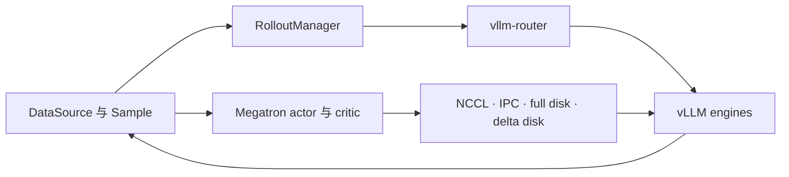
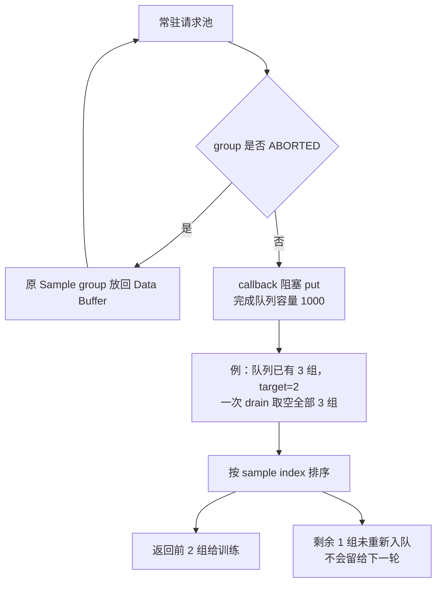

# vime 对 slime 的 vLLM 后端替换与支持度分析

> **定位**：slime 段 2 深潜 · vLLM Backend Derivative / Support Audit
> **源码基线**：`vllm-project/vime@8144096e3f4fb0fb670c37b8f2d84015f7e92320`
> **上游对照基线**：`THUDM/slime@681b3adca54105d5ecd3fb822fa0dc58a427e0f9`
> **基线提交时间**：2026-08-03T16:52:35+08:00
> **核验日期**：2026-08-18
> **系列入口**：[[02_engineering/04_posttrain_frameworks/slime/index|slime RL 后训练框架]]
> **最近更新**：2026-09-10。新增核验：队列与批次截断、Bridge/映射差异、参数迁移与证据分级；其余既有引用本轮只做定位检查，不冒充全部重新语义审阅。

## 1. 背景：中心结论

vime 不是给 slime 动态安装的一个 vLLM 插件，而是由 slime 派生、把默认 rollout 栈系统性改写为 **vLLM + vllm-router** 的独立框架。它保留了 Megatron 训练、DataSource/Data Buffer、`Sample`、算法/loss、custom generation 和 agent workflow 等大部分上层契约，同时重写了 rollout 参数、server/router 生命周期、请求协议、权重更新与 vLLM 专属运维路径。官方 README 对自身的定义也是“保留 slime 训练栈与数据生成设计，默认采用 vLLM + router”；上游 slime README 同样把它称为由 vLLM 项目维护的派生框架，而不是主仓库内置 backend。[`README_zh.md:8-17`](https://github.com/vllm-project/vime/blob/8144096e3f4fb0fb670c37b8f2d84015f7e92320/README_zh.md#L8-L17) [`README_zh.md:42-50`](https://github.com/vllm-project/vime/blob/8144096e3f4fb0fb670c37b8f2d84015f7e92320/README_zh.md#L42-L50) [`README_zh.md:126-128`](https://github.com/THUDM/slime/blob/681b3adca54105d5ecd3fb822fa0dc58a427e0f9/README_zh.md#L126-L128)

本文把证据分为三层：带 fixed-commit 定位符的是**源码事实**；明确写“官方文档”的是同一提交中的项目说明；写“由此可推断”“设计上可以理解为”的段落是根据约束、失败路径和测试覆盖作出的**分析判断**，不代表作者原话。

因此，最准确的关系是：

> slime 是 **SGLang-native**；vime 是 **vLLM-native**。二者都允许替换数据生成函数，但都没有提供一个可在运行时选择任意 rollout engine 的稳定 backend registry。

本页的 P1–P4 是不同证据维度，不是逐级累计的分数，也不是性能排名。判据与实际证据分开列出：

| 证据层 | 本页判据 | 在固定基线能确认什么 |
|---|---|---|
| P1 接口 | 存在参数入口、解析器与运行消费者 | vLLM CLI、router CLI、拓扑 YAML、external/custom rollout 均有对应代码 |
| P2 功能路径 | 能追到输入、处理与返回，并标出依赖 | generate→reward→train→weight update 路径存在；依赖镜像、硬件与服务协议，本轮未实跑 |
| P3 正确性约束 | 有字段校验、错误分支或针对性测试 | token/logprob、multimodal、routing 与更新屏障有约束；缺 logprob 补零、top-p adapter 和内容校验仍是缺口 |
| P4 运行证据 | 区分 CI 配置、已观测运行记录与实测结果 | 固定仓库有 GPU CI/镜像与平台说明；本页没有新增 GPU 运行记录或性能测量 |

这意味着：已有 slime 工作流若主要依赖 Megatron、DataSource、custom rollout 与通用 RL loss，迁移到 vime 的成本通常可控；若依赖 SGLang 专属 API、kernel、一致性工具或尚未在 vLLM 中实现的 serving 特性，就不是“改几个参数”而是功能重建。

## 2. 为什么这么设计：为什么只替换 `generate()` 不够

上游 slime 确实会动态加载整轮 rollout 函数；sample 级 `--custom-generate-function-path` 的参数说明也明确把它定位成替换示例 rollout 内部的 `generate(args, sample, sampling_params)`，服务于多轮或 function calling。[`slime/ray/rollout.py:465-495`](https://github.com/THUDM/slime/blob/681b3adca54105d5ecd3fb822fa0dc58a427e0f9/slime/ray/rollout.py#L465-L495) [`slime/utils/arguments.py:477-483`](https://github.com/THUDM/slime/blob/681b3adca54105d5ecd3fb822fa0dc58a427e0f9/slime/utils/arguments.py#L477-L483)

但同一控制面把 engine actor 固定为 `SGLangEngine`，默认请求固定走 SGLang `/generate` 并把完整 SGLang `meta_info` 交给 `Sample`；这些都不属于 custom generate hook 的所有权。[`slime/ray/rollout.py:188-220`](https://github.com/THUDM/slime/blob/681b3adca54105d5ecd3fb822fa0dc58a427e0f9/slime/ray/rollout.py#L188-L220) [`slime/rollout/sglang_rollout.py:152-219`](https://github.com/THUDM/slime/blob/681b3adca54105d5ecd3fb822fa0dc58a427e0f9/slime/rollout/sglang_rollout.py#L152-L219)

因此换 backend 至少要同时闭合四条契约：

| 必须接入的环节 | 必须回答的问题 | 只换 `generate()` 的后果 |
|---|---|---|
| 部署与生命周期 | 谁分配 GPU、启动服务/路由器、表达普通/PD/EPD/多模型拓扑 | 有请求客户端，却没有受控的可用推理引擎 |
| 请求与轨迹 | token、logprob、多模态占位、请求中止和路由元数据如何进入 `Sample` | 文本能返回，训练行为数据却可能错位或缺失 |
| 权重提交 | Megatron 分片如何变成推理分片，更新中怎样避免暴露半个版本 | rollout 继续使用旧权重，或请求跨过未完成的提交状态 |
| 故障与恢复 | 谁负责探活、终止 actor、重建通信组，以及恢复到哪个版本 | 推理引擎重启后仍没有当前 actor 权重 |

> **分析判断**：一个直观方案是先定义 SGLang/vLLM 共用、只包含公共能力的 `InferenceEngine`。但 PD/EPD、路由器注册、sleep tag、请求中止、权重传输会话和响应元数据都属于引擎专有能力；过早统一只会把这些差异变成大量能力判断分支。vime 选择派生仓库级替换，获得较完整的 vLLM 能力，代价是要重复维护控制面衔接代码，并同时跟随两个上游演进。

## 3. 软件架构：复用上半部，替换生成与提交边界

README 把架构拆为 Megatron training、vLLM + router rollout 和 Data Buffer 三块；参数层则把输入分成 Megatron 原生参数、`--vllm-*` server 参数、`--router-*` 路由参数以及 vime 自身的编排参数，默认 rollout 函数是 `vime.rollout.vllm_rollout.generate_rollout`。[`README_zh.md:46-50`](https://github.com/vllm-project/vime/blob/8144096e3f4fb0fb670c37b8f2d84015f7e92320/README_zh.md#L46-L50) [`README_zh.md:60-68`](https://github.com/vllm-project/vime/blob/8144096e3f4fb0fb670c37b8f2d84015f7e92320/README_zh.md#L60-L68)

源码中的责任边界更具体：

| 系统部分 | 保留或替换 | vime 中的责任代码 | 关键变化 |
|---|---|---|---|
| 主循环 | 近似保留 | `train.py`、`train_async.py` | 仍是 generate → train → update；对象名改成 vime |
| 数据层 | 大量保留 | `vime/utils/types.py`、`rollout/data_source.py` | `Sample`、分组、缓冲区和钩子继续作为上层交换对象 |
| 训练层 | 大量保留并继续演进 | `backends/megatron_utils/` | Megatron actor/critic、loss、并行、桥接与模型插件 |
| rollout 控制层 | **重写** | `ray/rollout.py`、`backends/vllm_utils/` | `VLLMEngine`、vllm-router、vLLM 配置、外部服务发现 |
| 请求数据路径 | **重写** | `rollout/vllm_rollout.py` | `/inference/v1/generate`、vLLM 响应与多模态渲染 |
| 权重提交路径 | **深度改写** | `update_weight/*`、`VLLMEngine` | vLLM 原生 NCCL/IPC、磁盘重载与草稿模型更新会话 |

`RolloutManager` 仍动态加载 DataSource、整轮 rollout、评估、reward post-process 与 train-data conversion hook，说明 slime 的上层扩展契约确实被保留下来；但 server 启动固定调用 `start_rollout_servers`，`ServerGroup` 固定创建 `VLLMEngine`，没有 `backend=...` 分派器。[`vime/ray/rollout.py:410-443`](https://github.com/vllm-project/vime/blob/8144096e3f4fb0fb670c37b8f2d84015f7e92320/vime/ray/rollout.py#L410-L443) [`vime/ray/rollout.py:143-242`](https://github.com/vllm-project/vime/blob/8144096e3f4fb0fb670c37b8f2d84015f7e92320/vime/ray/rollout.py#L143-L242)

这种关系在 driver 中也很直接：upstream 注释是“rollout manager with sglang engines”，vime 对应位置改为“with vLLM engines”，而 generate → train → update 的阶段顺序基本不变。[`train.py:13-30`](https://github.com/THUDM/slime/blob/681b3adca54105d5ecd3fb822fa0dc58a427e0f9/train.py#L13-L30) [`train.py:13-30`](https://github.com/vllm-project/vime/blob/8144096e3f4fb0fb670c37b8f2d84015f7e92320/train.py#L13-L30)

所以 vime 证明的是 **通过派生替换 backend 可行**，不是 slime/vime 已经共同拥有一个可热插拔的多后端抽象。

> [!warning] 归因边界
> “slime 的数据/训练契约可被 vime 复用”不等于“slime 主仓库提供 vLLM backend”。本页的 `VLLMEngine`、vllm-router、vLLM 请求、NCCL transfer engine 与本地 patch 均只归因于固定基线的 **vime**。

## 4. vLLM 参数与拓扑支持

### 4.1 原生参数不是手工维护的白名单

vime 暂时 monkey-patch argparse，把 vLLM `AsyncEngineArgs` 与 `FrontendArgs` 的选项自动加上 `--vllm-` 前缀；训练编排负责的 model、seed、TP、host/port 等字段被显式排除。router 参数直接由 `RouterArgs.add_cli_args` 以 `--router-` 前缀注入。[`vime/backends/vllm_utils/arguments.py:10-45`](https://github.com/vllm-project/vime/blob/8144096e3f4fb0fb670c37b8f2d84015f7e92320/vime/backends/vllm_utils/arguments.py#L10-L45) [`vime/backends/vllm_utils/arguments.py:46-105`](https://github.com/vllm-project/vime/blob/8144096e3f4fb0fb670c37b8f2d84015f7e92320/vime/backends/vllm_utils/arguments.py#L46-L105)

优点是新 vLLM flag 通常不需要 vime 再逐项抄写；代价是 CLI ABI 会跟随 vLLM 版本变化，不能脱离依赖基线谈兼容。`--vllm-config`、legacy `--prefill-num-servers` 与 external engines 三条拓扑入口互斥，源码在参数校验阶段直接拒绝组合使用。[`vime/backends/vllm_utils/arguments.py:108-146`](https://github.com/vllm-project/vime/blob/8144096e3f4fb0fb670c37b8f2d84015f7e92320/vime/backends/vllm_utils/arguments.py#L108-L146)

### 4.1.1 从 SGLang 配置迁移的对应入口

这张表对应的是配置目的，**不是等价数值转换**。原生选项由固定镜像的 parser 决定；YAML 内也要改成 vLLM 字段。

| slime 配置目的与入口 | vime 中核实的入口 | 需要重新确认的含义 |
|---|---|---|
| `--sglang-mem-fraction-static` 控制服务显存预算 | `--vllm-gpu-memory-utilization`，如 `scripts/run-qwen3-4B.sh` | 两引擎预算口径不同，不能按相同比例保证相同余量 |
| `--sglang-server-concurrency` | `--vllm-server-concurrency`，`add_vllm_arguments` | 客户端并发门，与引擎原生调度上限分开 |
| `--sglang-config` | `--vllm-config`，`VllmConfig` | model/group 结构相似，override 键由不同 parser 消费 |
| SGLang router 地址 | `--vllm-router-ip` / `--vllm-router-port` | 地址入口与原生 `--router-*` 策略前缀分开 |
| SGLang 多个 speculative flags | `--vllm-speculative-config` JSON，如 `scripts/run-glm4.7-30B-A3B.sh` | method、draft 与 token 数按 vLLM 配置；不是逐 flag 更换前缀 |
| `--rollout-num-gpus-per-engine` | 同名编排参数 | vime 从 engine GPU 数构造 TP 等 server 设置，不支持任意透传被跳过的 TP 参数 |

锚点：`vime/backends/vllm_utils/arguments.py::{add_vllm_arguments,add_vllm_router_arguments}`、`vllm_engine.py::_compute_server_args`；完整请求与权重协议还须按第 5–6 节迁移。

### 4.2 服务与路由器生命周期需要完整适配，不只是封装 HTTP 请求

`VLLMEngine` 把 vLLM `ServeSubcommand` 放进独立子进程，等待 `/health` 后才完成初始化；每个 regular/prefill/decode worker 再注册到 vllm-router，prefill 额外上报 bootstrap port，encoder worker 则不注册到语言模型 router。[`vime/backends/vllm_utils/vllm_engine.py:37-98`](https://github.com/vllm-project/vime/blob/8144096e3f4fb0fb670c37b8f2d84015f7e92320/vime/backends/vllm_utils/vllm_engine.py#L37-L98) [`vime/backends/vllm_utils/vllm_engine.py:197-226`](https://github.com/vllm-project/vime/blob/8144096e3f4fb0fb670c37b8f2d84015f7e92320/vime/backends/vllm_utils/vllm_engine.py#L197-L226)

基础 server 参数还主动设置 processed logprobs、prompt token details、load tracking，并从单个 engine 的 GPU 数反推出 TP，同时允许 PP/DP；多节点时强制 vLLM 走 multiprocessing executor。[`vime/backends/vllm_utils/vllm_engine.py:512-585`](https://github.com/vllm-project/vime/blob/8144096e3f4fb0fb670c37b8f2d84015f7e92320/vime/backends/vllm_utils/vllm_engine.py#L512-L585)

### 4.3 `--vllm-config` 的真实能力边界

配置对象支持每模型一个 router，以及 `regular`、`prefill`、`decode`、`placeholder`、`encoder` 五类 server group；group 可以覆盖 GPU 数、每 engine GPU 数和 vLLM 参数。`update_weights` 未显式填写时，以有效 model path 是否等于 actor 的 `hf_checkpoint` 自动推断。[`vime/backends/vllm_utils/vllm_config.py:11-47`](https://github.com/vllm-project/vime/blob/8144096e3f4fb0fb670c37b8f2d84015f7e92320/vime/backends/vllm_utils/vllm_config.py#L11-L47) [`vime/backends/vllm_utils/vllm_config.py:50-106`](https://github.com/vllm-project/vime/blob/8144096e3f4fb0fb670c37b8f2d84015f7e92320/vime/backends/vllm_utils/vllm_config.py#L50-L106)

运行时会为每个模型建立 router 与 group，并用全局递增端口游标避免多个模型的延迟绑定产生端口串扰；随后把 `{model_name: router}` 写到 `args.vllm_model_routers`，custom rollout 可通过 `get_model_url` 定向访问 actor、reference 或 reward model。[`vime/ray/rollout.py:1094-1127`](https://github.com/vllm-project/vime/blob/8144096e3f4fb0fb670c37b8f2d84015f7e92320/vime/ray/rollout.py#L1094-L1127) [`vime/ray/rollout.py:1275-1288`](https://github.com/vllm-project/vime/blob/8144096e3f4fb0fb670c37b8f2d84015f7e92320/vime/ray/rollout.py#L1275-L1288)

但多模型支持需要分成两档：

- **强支持**：一个在线 actor + 多个冻结 reference/reward 模型；每个模型独立 router，冻结模型可拥有不同 checkpoint。
- **明确受限**：多个 `update_weights: true` 模型。`RolloutManager._get_updatable_server()` 只返回第一个，并在注释中写明 multi-model weight update 尚未支持。[`vime/ray/rollout.py:522-550`](https://github.com/vllm-project/vime/blob/8144096e3f4fb0fb670c37b8f2d84015f7e92320/vime/ray/rollout.py#L522-L550)

### 4.4 PD 与 Encoder-Prefill 解耦

PD 使用 vLLM `NixlConnector`，prefill 是 KV producer，decode 是 KV consumer；vllm-router 接收两组静态 URL。不同 group 可使用不同 TP/PP/DP，因此能按 prefill 计算密集、decode 带宽密集的差异独立配比。[`vime/backends/vllm_utils/vllm_engine.py:589-601`](https://github.com/vllm-project/vime/blob/8144096e3f4fb0fb670c37b8f2d84015f7e92320/vime/backends/vllm_utils/vllm_engine.py#L589-L601) [`vime/ray/rollout.py:1252-1273`](https://github.com/vllm-project/vime/blob/8144096e3f4fb0fb670c37b8f2d84015f7e92320/vime/ray/rollout.py#L1252-L1273)

固定基线又加入了 encoder disaggregation：先启动 encoder groups、收集端点，再把 `encoder_urls` 与 `language_only` 注入 regular/prefill consumers；多模态请求在正式 generate 前先 `prime_encoder`。这是代码层已闭环、但文档尚未完全追平的新能力。[`vime/ray/rollout.py:1197-1240`](https://github.com/vllm-project/vime/blob/8144096e3f4fb0fb670c37b8f2d84015f7e92320/vime/ray/rollout.py#L1197-L1240) [`vime/rollout/vllm_rollout.py:117-141`](https://github.com/vllm-project/vime/blob/8144096e3f4fb0fb670c37b8f2d84015f7e92320/vime/rollout/vllm_rollout.py#L117-L141)

## 5. 请求协议与训练数据正确性

### 5.1 必须完整保留输入和输出 token

默认路径不把文本响应重新 tokenize，而是向 `/inference/v1/generate` 发送 `token_ids`，要求 vLLM 返回生成 token ids 与逐 token logprob，再直接追加到 `Sample`。server 被固定为 `logprobs_mode=processed_logprobs`，与训练侧使用的采样后 logprob 语义匹配。[`vime/rollout/vllm_rollout.py:327-349`](https://github.com/vllm-project/vime/blob/8144096e3f4fb0fb670c37b8f2d84015f7e92320/vime/rollout/vllm_rollout.py#L327-L349) [`vime/rollout/vllm_rollout.py:385-447`](https://github.com/vllm-project/vime/blob/8144096e3f4fb0fb670c37b8f2d84015f7e92320/vime/rollout/vllm_rollout.py#L385-L447) [`vime/backends/vllm_utils/vllm_engine.py:564-576`](https://github.com/vllm-project/vime/blob/8144096e3f4fb0fb670c37b8f2d84015f7e92320/vime/backends/vllm_utils/vllm_engine.py#L564-L576)

这比 OpenAI text-only 兼容层更适合 RL：response length、loss mask、old logprob 和路由元数据都锚定同一 token 序列。不过当前解析在 vLLM 没返回 logprob 时会用全 0 填充，而不是 fail-fast；如果训练启用 `--use-rollout-logprobs`，应把“logprob 非空且长度严格相等”列为外部验收门禁。[`vime/rollout/vllm_rollout.py:397-409`](https://github.com/vllm-project/vime/blob/8144096e3f4fb0fb670c37b8f2d84015f7e92320/vime/rollout/vllm_rollout.py#L397-L409)

### 5.2 多模态不是绕回文本协议

多模态路径先请求 `/v1/chat/completions/render` 得到 vLLM 的 feature payload，再把 feature placeholder 重新对齐到 vime 训练侧的 canonical prompt tokens，最后仍调用 token-based generate。若 placeholder 长度、offset 或 token 子序列无法对齐会直接报错，而不是静默使用两个 tokenizer 视图。[`vime/rollout/vllm_rollout.py:237-268`](https://github.com/vllm-project/vime/blob/8144096e3f4fb0fb670c37b8f2d84015f7e92320/vime/rollout/vllm_rollout.py#L237-L268) [`vime/rollout/vllm_rollout.py:281-324`](https://github.com/vllm-project/vime/blob/8144096e3f4fb0fb670c37b8f2d84015f7e92320/vime/rollout/vllm_rollout.py#L281-L324) [`vime/rollout/vllm_rollout.py:350-383`](https://github.com/vllm-project/vime/blob/8144096e3f4fb0fb670c37b8f2d84015f7e92320/vime/rollout/vllm_rollout.py#L350-L383)

### 5.3 路由亲和与行为策略元数据的支持程度不同

每个 sample group 自动分配 session id；使用 consistent-hash policy 时，请求通过 `x-session-id` 固定到同一 worker，从而让多轮 agent 更可能命中已有 prefix cache。[`vime/rollout/vllm_rollout.py:355-359`](https://github.com/vllm-project/vime/blob/8144096e3f4fb0fb670c37b8f2d84015f7e92320/vime/rollout/vllm_rollout.py#L355-L359) [`vime/rollout/vllm_rollout.py:523-553`](https://github.com/vllm-project/vime/blob/8144096e3f4fb0fb670c37b8f2d84015f7e92320/vime/rollout/vllm_rollout.py#L523-L553)

MoE routing replay 已形成源码闭环：vime 解码 vLLM 返回的 base64 routed-expert array，`Sample` 校验 token × layer × top-k 元素数，Megatron actor 再按 layer 注入 replay state。[`vime/rollout/vllm_rollout.py:433-445`](https://github.com/vllm-project/vime/blob/8144096e3f4fb0fb670c37b8f2d84015f7e92320/vime/rollout/vllm_rollout.py#L433-L445) [`vime/utils/types.py:352-395`](https://github.com/vllm-project/vime/blob/8144096e3f4fb0fb670c37b8f2d84015f7e92320/vime/utils/types.py#L352-L395) [`vime/backends/megatron_utils/actor.py:297-341`](https://github.com/vllm-project/vime/blob/8144096e3f4fb0fb670c37b8f2d84015f7e92320/vime/backends/megatron_utils/actor.py#L297-L341)

top-p replay 则只完成了两端、没有闭合中间 adapter：`GenerateState` 在 top-p 不为 1 时设置 `custom_params.return_top_p_token_ids`，但 `_build_inference_sampling_params` 没有把 `custom_params` 写进请求，response parser 也没有把 top-p 字段放进传给 `Sample` 的 `meta`；`Sample` 虽已有 ids/offsets 解码与长度校验，默认 vLLM 路径在该基线仍不能称为端到端支持。[`vime/rollout/vllm_rollout.py:155-168`](https://github.com/vllm-project/vime/blob/8144096e3f4fb0fb670c37b8f2d84015f7e92320/vime/rollout/vllm_rollout.py#L155-L168) [`vime/rollout/vllm_rollout.py:213-234`](https://github.com/vllm-project/vime/blob/8144096e3f4fb0fb670c37b8f2d84015f7e92320/vime/rollout/vllm_rollout.py#L213-L234) [`vime/rollout/vllm_rollout.py:397-447`](https://github.com/vllm-project/vime/blob/8144096e3f4fb0fb670c37b8f2d84015f7e92320/vime/rollout/vllm_rollout.py#L397-L447) [`vime/utils/types.py:13-36`](https://github.com/vllm-project/vime/blob/8144096e3f4fb0fb670c37b8f2d84015f7e92320/vime/utils/types.py#L13-L36)

### 5.4 自定义生成函数与整轮 rollout 仍可替换

每条 sample 可使用自己的 `generate_function_path`，否则回退到全局 custom generate 或默认 vLLM generate；custom function 仍可返回一个或多个 `Sample`，reward 可以逐样本或按 group 计算。[`vime/rollout/vllm_rollout.py:452-515`](https://github.com/vllm-project/vime/blob/8144096e3f4fb0fb670c37b8f2d84015f7e92320/vime/rollout/vllm_rollout.py#L452-L515) [`vime/rollout/vllm_rollout.py:523-562`](https://github.com/vllm-project/vime/blob/8144096e3f4fb0fb670c37b8f2d84015f7e92320/vime/rollout/vllm_rollout.py#L523-L562)

默认整轮 rollout 继续使用 first-completed、oversampling、dynamic filter、abort 与 partial sample 回收，并在返回前调用 sample filter/all-samples hook。[`vime/rollout/vllm_rollout.py:615-707`](https://github.com/vllm-project/vime/blob/8144096e3f4fb0fb670c37b8f2d84015f7e92320/vime/rollout/vllm_rollout.py#L615-L707) 因此 agent、tool use 或自定义 RM 多数属于“上层复用”；直接调用 SGLang endpoint、SGLang streaming chunk 或 SGLang meta 字段的旧代码则必须改写。

## 6. 权重同步：vime 最深的 vLLM 适配面

训练 actor 根据 mode/transport 与 colocate 状态选择四条路径：

| 路径 | 使用条件 | vLLM 侧机制 | 支持判断 |
|---|---|---|---|
| full + NCCL | disaggregated 默认 | vLLM `NCCLWeightTransferEngine` | **强**；支持异构 engine GPU 数与 PP 分阶段发送 |
| full + tensor IPC | colocate | packed CUDA IPC handles | **强**；专用于同机同 GPU 共置 |
| full + disk | external/异构文件系统 | 写 HF checkpoint 后 collective reload | **强但慢**；依赖共享盘或 post-write hook |
| delta + disk | 低带宽/跨集群 | byte delta + zstd + checksum + local reload | **条件支持**；不支持 colocate，只支持 disk transport |

选择逻辑在 actor 初始化时硬编码：delta 必须走 disk 且禁止 colocate；full disk、colocate IPC、disaggregated NCCL 分别落入三个 updater。[`vime/backends/megatron_utils/actor.py:150-181`](https://github.com/vllm-project/vime/blob/8144096e3f4fb0fb670c37b8f2d84015f7e92320/vime/backends/megatron_utils/actor.py#L150-L181)

### 6.1 NCCL/IPC 提交事务

NCCL updater 直接使用 vLLM 原生 `NCCLWeightTransferEngine`。一次提交执行 pause generation → flush prefix cache → start update session → 分 bucket 发送 → finish session → quantization post-process → resume；MTP 在线训练还会打开独立 draft weight update session。[`vime/backends/megatron_utils/update_weight/update_weight_from_distributed.py:18-48`](https://github.com/vllm-project/vime/blob/8144096e3f4fb0fb670c37b8f2d84015f7e92320/vime/backends/megatron_utils/update_weight/update_weight_from_distributed.py#L18-L48) [`vime/backends/megatron_utils/update_weight/update_weight_from_distributed.py:141-186`](https://github.com/vllm-project/vime/blob/8144096e3f4fb0fb670c37b8f2d84015f7e92320/vime/backends/megatron_utils/update_weight/update_weight_from_distributed.py#L141-L186)

NCCL group 的 world size 是一个 trainer sender 加所有 rollout engine GPU，支持每个 engine 不同 GPU 数；bucket 发送前还用 Ray lock 防止通信并发造成 NCCL deadlock。[`vime/backends/megatron_utils/update_weight/update_weight_from_distributed.py:374-414`](https://github.com/vllm-project/vime/blob/8144096e3f4fb0fb670c37b8f2d84015f7e92320/vime/backends/megatron_utils/update_weight/update_weight_from_distributed.py#L374-L414) [`vime/backends/megatron_utils/update_weight/update_weight_from_distributed.py:415-444`](https://github.com/vllm-project/vime/blob/8144096e3f4fb0fb670c37b8f2d84015f7e92320/vime/backends/megatron_utils/update_weight/update_weight_from_distributed.py#L415-L444)

colocate IPC 也遵循 pause/flush/start/finish/resume，只是 tensor payload 换成各训练 rank 的 CUDA IPC handle，并在 Gloo group 中聚合元数据。[`vime/backends/megatron_utils/update_weight/update_weight_from_tensor.py:245-306`](https://github.com/vllm-project/vime/blob/8144096e3f4fb0fb670c37b8f2d84015f7e92320/vime/backends/megatron_utils/update_weight/update_weight_from_tensor.py#L245-L306) [`vime/backends/megatron_utils/update_weight/update_weight_from_tensor.py:353-384`](https://github.com/vllm-project/vime/blob/8144096e3f4fb0fb670c37b8f2d84015f7e92320/vime/backends/megatron_utils/update_weight/update_weight_from_tensor.py#L353-L384)

### 6.2 磁盘全量/增量更新不只是“保存再加载”

full disk 以 `weight_vNNNNNN` 目录发布 HF checkpoint，并允许 object-store-backed 文件系统通过 custom post-write hook 建立跨主机可见性；真正 reload 由 Ray train group 在写入完成后发起。[`vime/backends/megatron_utils/update_weight/update_weight_from_disk.py:17-45`](https://github.com/vllm-project/vime/blob/8144096e3f4fb0fb670c37b8f2d84015f7e92320/vime/backends/megatron_utils/update_weight/update_weight_from_disk.py#L17-L45) [`vime/backends/megatron_utils/update_weight/update_weight_from_disk.py:64-94`](https://github.com/vllm-project/vime/blob/8144096e3f4fb0fb670c37b8f2d84015f7e92320/vime/backends/megatron_utils/update_weight/update_weight_from_disk.py#L64-L94)

delta 首次调用只捕获与 engine base 一致的快照；之后对每个 HF tensor 做 byte diff、zstd 压缩、checksum，原子写入版本目录，让每个 engine host pull、校验、应用并 reload。它降低的是 wire/file-system bytes，不改变每次提交仍需 pause/flush/reload 的事实。[`vime/backends/megatron_utils/update_weight/update_weight_from_disk_delta.py:30-37`](https://github.com/vllm-project/vime/blob/8144096e3f4fb0fb670c37b8f2d84015f7e92320/vime/backends/megatron_utils/update_weight/update_weight_from_disk_delta.py#L30-L37) [`vime/backends/megatron_utils/update_weight/update_weight_from_disk_delta.py:81-124`](https://github.com/vllm-project/vime/blob/8144096e3f4fb0fb670c37b8f2d84015f7e92320/vime/backends/megatron_utils/update_weight/update_weight_from_disk_delta.py#L81-L124) [`vime/backends/megatron_utils/update_weight/update_weight_from_disk_delta.py:169-189`](https://github.com/vllm-project/vime/blob/8144096e3f4fb0fb670c37b8f2d84015f7e92320/vime/backends/megatron_utils/update_weight/update_weight_from_disk_delta.py#L169-L189)

### 6.3 当前最重要的正确性缺口

`VLLMEngine` 会在成功接收更新后记录 `weight_version`，未更新就读取会报错；但 `check_weights()` 当前明确返回 `supported: false`。因此 `--check-weight-update-equal` 在 vime 下不会像名字暗示的那样执行逐 tensor 等价比较。[`vime/backends/vllm_utils/vllm_engine.py:324-355`](https://github.com/vllm-project/vime/blob/8144096e3f4fb0fb670c37b8f2d84015f7e92320/vime/backends/vllm_utils/vllm_engine.py#L324-L355) [`train.py:26-30`](https://github.com/vllm-project/vime/blob/8144096e3f4fb0fb670c37b8f2d84015f7e92320/train.py#L26-L30)

full disk 的 CI 路径会读取所有 engine version 并拒绝版本不一致，但“同 version”仍不等于“tensor 内容相等”。[`vime/ray/actor_group.py:227-269`](https://github.com/vllm-project/vime/blob/8144096e3f4fb0fb670c37b8f2d84015f7e92320/vime/ray/actor_group.py#L227-L269) 生产验收应另加固定参数抽样 hash、短 prompt logits 对齐或保存后 round-trip 检查。

## 7. 同步、异步与稳定性支持

下图只重放 vime 完成队列的超量消费反例；同步与 one-stage async 的顺序分别见 7.1–7.2。

<!-- Figure spec: TB queue counterexample. target2, completed3, capacity1000 blocking put, drain all3, sort and return2 versus one unreturned group with no requeue. Separate aborted-original-object recycle. No latency scaling. -->

三种方式移动的是“等待哪一批 generation 完成”的边界，不是删除权重提交协议：同步完全串行；one-stage async 让下一批生成与当前批训练重叠，但提交前仍等待 future；完全异步把长期请求池与单次训练批解耦，中止组必须回收而不能直接训练。

### 7.1 同步路径：样本使用哪个策略版本最清楚

同步 driver 先推一次初始 actor 权重；每轮严格 generate → train/save → update weights，offload rollout 时再分 weights 与 KV/CUDA graph 两阶段 onload。这里不会让一条 rollout 请求跨越权重提交。[`train.py:17-33`](https://github.com/vllm-project/vime/blob/8144096e3f4fb0fb670c37b8f2d84015f7e92320/train.py#L17-L33) [`train.py:48-91`](https://github.com/vllm-project/vime/blob/8144096e3f4fb0fb670c37b8f2d84015f7e92320/train.py#L48-L91)

### 7.2 one-stage async：允许阶段重叠，仍保留提交屏障

`train_async.py` 让 generate N+1 与 train N 重叠，但明确禁止 colocate；到 `update_weights_interval` 时先等待下一轮 generation future，再更新权重，避免请求中途换版本。[`train_async.py:9-26`](https://github.com/vllm-project/vime/blob/8144096e3f4fb0fb670c37b8f2d84015f7e92320/train_async.py#L9-L26) [`train_async.py:31-70`](https://github.com/vllm-project/vime/blob/8144096e3f4fb0fb670c37b8f2d84015f7e92320/train_async.py#L31-L70)

### 7.3 完全异步：有界完成队列不是版本差门禁

该函数替换叠加在 `train_async.py` 之上，保持常驻 thread + asyncio pool。与本页上游对照提交的 slime 存在三个实际差异：

| 边界 | vime `8144096e` | slime `681b3adc` |
|---|---|---|
| 完成队列 | `queue.Queue(maxsize=1000)`，callback 使用阻塞 `put` | 无界 `queue.Queue()`；以 active<C 且 completed<C 两个独立条件做软回压 |
| 消费 | `get_completed_groups()` 一次取空，再把排序结果截为 `[:target]` | 只取当前还需要的 group 数，多余完成组保留 |
| 容量含义 | queue 满时 callback 可阻塞后台事件循环；容量不是最大策略陈旧度 | 容量软阈值也不是版本差门禁 |

由第二行可直接推出一个反例：target=2 时若一次取出 3 组，vime 返回排序后的前 2 组，多出的一组没有重新入队；不能把上游“多余组留到下轮”的保证套到本页。证据：两仓 `rollout/fully_async_rollout.py::AsyncRolloutWorker.{__init__,get_completed_groups,_make_done_cb}` 与 `_generate_rollout_async`。

ABORTED group 的源码处理是把原 Sample 列表重新交给 Data Buffer，callback 没有清空 tokens/response；官方示例称暂不支持 partial continuation，但这不证明返回后一定从空响应重跑。实际重新生成仍受各仓 helper 的 token 复用条件制约。两者均无全局 exactly-once 或最大版本差保证；vime 示例也不支持 eval。

### 7.4 容错只覆盖由 vime 管理的 rollout 引擎

health monitor 在 engine onload 后按周期请求 `/health`，失败时杀死对应多节点 engine 的全部 Ray actors并把槽位置空；下一次权重更新前恢复 updatable server，再重新连接 updater 和推送正确权重。[`vime/utils/health_monitor.py:105-177`](https://github.com/vllm-project/vime/blob/8144096e3f4fb0fb670c37b8f2d84015f7e92320/vime/utils/health_monitor.py#L105-L177) [`vime/backends/megatron_utils/actor.py:567-605`](https://github.com/vllm-project/vime/blob/8144096e3f4fb0fb670c37b8f2d84015f7e92320/vime/backends/megatron_utils/actor.py#L567-L605)

external engines 不属于这个故障域：它们的 recover/offload/onload 都是 no-op，并明确记录 fault tolerance 不支持；vime 只负责发现、校验、router 注册和权重调用。[`vime/backends/vllm_utils/external.py:186-217`](https://github.com/vllm-project/vime/blob/8144096e3f4fb0fb670c37b8f2d84015f7e92320/vime/backends/vllm_utils/external.py#L186-L217) [`vime/backends/vllm_utils/external.py:230-292`](https://github.com/vllm-project/vime/blob/8144096e3f4fb0fb670c37b8f2d84015f7e92320/vime/backends/vllm_utils/external.py#L230-L292)

## 8. 训练、算法、低精度与模型支持度

### 8.1 Megatron 与 RL 算法：继承度高，但不是静态复制

训练侧仍提供 GRPO、GSPO、CISPO、PPO、REINFORCE++ 及 baseline variant；OPD 作为与 advantage estimator 正交的 penalty 注入。源码的 advantage dispatch 和 policy loss 分支仍位于 Megatron loss 实现，而不是 vLLM server。`vime/backends/megatron_utils/loss.py::compute_advantages_and_returns` [`vime/backends/megatron_utils/loss.py:971-988`](https://github.com/vllm-project/vime/blob/8144096e3f4fb0fb670c37b8f2d84015f7e92320/vime/backends/megatron_utils/loss.py#L971-L988)

模型构建支持三条路线：custom model provider、Megatron Bridge 从 HF config 构建、传统 Megatron `ModuleSpec`。Bridge 模式显式回填训练并行、数值、recompute、offload、FP8 和 attention backend 配置，说明 vime 不只是沿用旧 slime model scripts，也在维护自己的 Megatron 兼容层。[`vime/backends/megatron_utils/model_provider.py:61-130`](https://github.com/vllm-project/vime/blob/8144096e3f4fb0fb670c37b8f2d84015f7e92320/vime/backends/megatron_utils/model_provider.py#L61-L130) [`vime/backends/megatron_utils/model_provider.py:135-195`](https://github.com/vllm-project/vime/blob/8144096e3f4fb0fb670c37b8f2d84015f7e92320/vime/backends/megatron_utils/model_provider.py#L135-L195)

Bridge 构建的具体顺序是 `AutoBridge.from_hf_pretrained` → config patch → `to_megatron_provider(load_weights=False)` → `_apply_bridge_runtime_config` → `finalize` → `provide`。这里明确不在 provider 构建时加载权重；HF checkpoint 载入在 `checkpoint.py::_load_checkpoint_hf`，且断言 mode 为 bridge。运行配置只复制白名单：TP/PP/EP/CP、recompute、offload、FP8、attention 等训练设置，不能用 args 默认模型形状覆盖 HF config。PP 路径还把调用方的 `pg_collection` 交给 provider；critic 则替换输出层为标量。

**双向映射不是完全同源的登记表。** slime 的 `hf_to_megatron/__init__.py::_LOADERS` 是本地 HF 导入 registry；vime 在所审 `vime/` 与 `tools/` 树中没有该表，HF 导入走 Bridge。导出侧两仓都有 `megatron_to_hf/__init__.py::_convert_to_hf_core` 的名字分派：Llama、Qwen、DeepSeek、GLM 等分支相似，但 vime 另有 `gpt_oss`、`gemma4` 分支；相同函数名不证明所有 tensor 规则相同。

| 路径 | 具体入口 | 核验边界 |
|---|---|---|
| vime HF 导入 | `checkpoint.py::_load_checkpoint_hf` → `bridge.load_hf_weights` | 依赖 Bridge 注册、patch 与模型支持；不能照搬 slime 的 `_LOADERS` 集合 |
| direct 导出 | `megatron_to_hf/__init__.py::convert_to_hf` | remove padding → 模型分派 → quantize；完整模型支持仍需逐参数覆盖 |
| Bridge 导出 | `HfWeightIteratorBridge.get_hf_weight_chunks` | conversion tasks 以 `vp_stages.<stage>.<name>` 绑定当前权重，export 后 postprocess、quantize、分 chunk；文件中的量化 TODO 已不能覆盖实际调用事实 |
| Bridge 全量保存 | `hf_checkpoint_saver.py::save_hf_model_bridge_to_path` | 专用 `bridge.save_hf_pretrained`，不同于 direct 保存分支 |

但 README 的“继承 slime 广泛模型支持”应理解为方向性声明，不是全称保证。真实可用集合是三个条件的交集：

1. Megatron provider/Bridge 能构建和训练；
2. Megatron → HF/vLLM weight mapping 能覆盖参数；
3. 当前 vLLM 版本能 serve 该模型、量化和并行拓扑。

任何一层缺失都不能仅凭 slime 已支持该模型而推导 vime 已支持。

### 8.2 speculative decoding 与在线 MTP

vime 通过 `--vllm-speculative-config` 直接使用 vLLM 的 MTP/EAGLE 等 speculative 配置；在线 MTP 训练时，target 权重更新后再单独选择 draft model 并发送同一轮转换后的 MTP 权重。外部独立 draft model 的训练仍标记 WIP。[`docs/zh/advanced/speculative-decoding.md:1-28`](https://github.com/vllm-project/vime/blob/8144096e3f4fb0fb670c37b8f2d84015f7e92320/docs/zh/advanced/speculative-decoding.md#L1-L28) [`docs/zh/advanced/speculative-decoding.md:30-44`](https://github.com/vllm-project/vime/blob/8144096e3f4fb0fb670c37b8f2d84015f7e92320/docs/zh/advanced/speculative-decoding.md#L30-L44) [`vime/backends/megatron_utils/update_weight/update_weight_from_distributed.py:161-185`](https://github.com/vllm-project/vime/blob/8144096e3f4fb0fb670c37b8f2d84015f7e92320/vime/backends/megatron_utils/update_weight/update_weight_from_distributed.py#L161-L185)

这一能力依赖 vime 镜像对 vLLM 增加 `start_draft_weight_update` 协议和 draft model target 切换，不能假设任意 pip vLLM 版本都具备。[`docker/patch/latest/vllm.patch:1-30`](https://github.com/vllm-project/vime/blob/8144096e3f4fb0fb670c37b8f2d84015f7e92320/docker/patch/latest/vllm.patch#L1-L30) [`docker/patch/latest/vllm.patch:83-95`](https://github.com/vllm-project/vime/blob/8144096e3f4fb0fb670c37b8f2d84015f7e92320/docker/patch/latest/vllm.patch#L83-L95)

### 8.3 低精度成熟度要分四档

官方文档把 BF16 training + FP8 rollout 列为 Stable 推荐路径，FP8 KV cache 为依赖 vLLM/GPU stack 的 Stable，INT4 rollout/QAT 为 Beta，FP8 training + rollout 为 Experimental；FP8 param gather 还与常见 CPU Adam offload 冲突。[`docs/zh/advanced/low-precision.md:9-16`](https://github.com/vllm-project/vime/blob/8144096e3f4fb0fb670c37b8f2d84015f7e92320/docs/zh/advanced/low-precision.md#L9-L16) [`docs/zh/advanced/low-precision.md:82-93`](https://github.com/vllm-project/vime/blob/8144096e3f4fb0fb670c37b8f2d84015f7e92320/docs/zh/advanced/low-precision.md#L82-L93)

权重同步侧会读取 HF checkpoint 的 quantization config；compressed-tensors INT4/FP4 在更新前恢复可加载状态，发送后再触发 vLLM quantization post-process。[`vime/backends/megatron_utils/update_weight/update_weight_from_distributed.py:141-185`](https://github.com/vllm-project/vime/blob/8144096e3f4fb0fb670c37b8f2d84015f7e92320/vime/backends/megatron_utils/update_weight/update_weight_from_distributed.py#L141-L185) 因此“低精度 rollout 可启动”与“热更新后仍保持正确 scale/layout”应分开验收。

## 9. 依赖与平台：推荐镜像也是支持基线的一部分

quick start 明确提示 vime 可能包含 vLLM/Megatron 临时 patch，因此强烈建议使用官方镜像。[`docs/zh/get_started/quick_start.md:5-8`](https://github.com/vllm-project/vime/blob/8144096e3f4fb0fb670c37b8f2d84015f7e92320/docs/zh/get_started/quick_start.md#L5-L8) 固定基线的 Dockerfile 以 `vllm-openai:v0.25.1` 为底座，钉住 Megatron commit，再应用 Megatron Bridge、Megatron 与 vLLM patch；普通 `requirements.txt` 只声明 `vllm-router>=0.1.15`，没有安装 vLLM 本体。[`docker/Dockerfile:1-8`](https://github.com/vllm-project/vime/blob/8144096e3f4fb0fb670c37b8f2d84015f7e92320/docker/Dockerfile#L1-L8) [`docker/Dockerfile:87-107`](https://github.com/vllm-project/vime/blob/8144096e3f4fb0fb670c37b8f2d84015f7e92320/docker/Dockerfile#L87-L107) [`docker/Dockerfile:125-154`](https://github.com/vllm-project/vime/blob/8144096e3f4fb0fb670c37b8f2d84015f7e92320/docker/Dockerfile#L125-L154) [`requirements.txt:19-24`](https://github.com/vllm-project/vime/blob/8144096e3f4fb0fb670c37b8f2d84015f7e92320/requirements.txt#L19-L24)

vLLM patch 至少补了 abort in-flight requests 与 draft weight update；前者被 partial/fully-async rollout 的 abort 流程直接调用。[`docker/patch/latest/vllm.patch:31-95`](https://github.com/vllm-project/vime/blob/8144096e3f4fb0fb670c37b8f2d84015f7e92320/docker/patch/latest/vllm.patch#L31-L95) [`vime/backends/vllm_utils/server_control.py:1-24`](https://github.com/vllm-project/vime/blob/8144096e3f4fb0fb670c37b8f2d84015f7e92320/vime/backends/vllm_utils/server_control.py#L1-L24)

硬件支持也不是一个“CUDA 可用”布尔值：

| 平台 | 官方状态 | 本页判断 |
|---|---|---|
| H100/H200 | 完整 CI，官方推荐生产 | **最强支持基线** |
| GB/B200/B300 | 文档称“完全支持”，同页又注明 B 卡暂无 CI 保护 | **功能声明强，但证据弱于 H 系列，需业务回归** |
| A100/A800 | 可运行但暂不维护 | **机会性兼容** |
| AMD | 独立 ROCm Docker/tutorial | **独立平台路径，不能继承 NVIDIA 结论** |
| Ascend | 单独 `ascend` 分支与教程 | **非当前 main 同基线支持** |

官方的 NVIDIA/Ascend/AMD说明见 [`docs/zh/get_started/quick_start.md:9-35`](https://github.com/vllm-project/vime/blob/8144096e3f4fb0fb670c37b8f2d84015f7e92320/docs/zh/get_started/quick_start.md#L9-L35)。Buildkite 的 CPU tests 是 always-on，而 GPU suites 经过手动 gate 选择；所以“仓库有 GPU test”不等于每个提交自动跑全部 GPU topology。[`.buildkite/pipeline.yml`](https://github.com/vllm-project/vime/blob/8144096e3f4fb0fb670c37b8f2d84015f7e92320/.buildkite/pipeline.yml#L1-L18) [`.buildkite/pipeline.yml`](https://github.com/vllm-project/vime/blob/8144096e3f4fb0fb670c37b8f2d84015f7e92320/.buildkite/pipeline.yml#L139-L165)

## 10. 官方文档与源码差异审计

> [!contradiction]
> `vllm-config` 文档在 worker type 表中只列 `regular/prefill/decode/placeholder`，固定基线源码已经接受并实现 `encoder`；这是代码领先于文档，不应据旧表判断 EPD 不支持。[`docs/zh/advanced/vllm-config.md:54-70`](https://github.com/vllm-project/vime/blob/8144096e3f4fb0fb670c37b8f2d84015f7e92320/docs/zh/advanced/vllm-config.md#L54-L70) [`vime/backends/vllm_utils/vllm_config.py:11-47`](https://github.com/vllm-project/vime/blob/8144096e3f4fb0fb670c37b8f2d84015f7e92320/vime/backends/vllm_utils/vllm_config.py#L11-L47)

> [!contradiction]
> 文档的 group override 示例仍使用 `mem_fraction_static`、`context_length`、`chunked_prefill_size`、`enable_torch_compile` 等 SGLang 风格字段；源码却把 override 原样归一化后交给 vLLM Serve argparse。实际配置应使用当前 vLLM 字段，例如 `gpu_memory_utilization`、`max_model_len`、`enable_chunked_prefill`、`compilation_config`，并以固定镜像中的 vLLM CLI 为准。[`docs/zh/advanced/vllm-config.md:244-265`](https://github.com/vllm-project/vime/blob/8144096e3f4fb0fb670c37b8f2d84015f7e92320/docs/zh/advanced/vllm-config.md#L244-L265) [`vime/backends/vllm_utils/vllm_engine.py:642-672`](https://github.com/vllm-project/vime/blob/8144096e3f4fb0fb670c37b8f2d84015f7e92320/vime/backends/vllm_utils/vllm_engine.py#L642-L672)

> [!contradiction]
> 文档写“只有 `update_weights: true` 的模型接收更新”容易被理解为支持任意多个在线更新模型；源码只选择第一个 updatable server。当前可靠模式是一套在线 actor 加若干冻结模型，不是 multi-actor joint training。[`docs/zh/advanced/vllm-config.md:17-22`](https://github.com/vllm-project/vime/blob/8144096e3f4fb0fb670c37b8f2d84015f7e92320/docs/zh/advanced/vllm-config.md#L17-L22) [`vime/ray/rollout.py:522-550`](https://github.com/vllm-project/vime/blob/8144096e3f4fb0fb670c37b8f2d84015f7e92320/vime/ray/rollout.py#L522-L550)

> [!contradiction]
> external-engine 导航文档把 `delta + NCCL` 列为可用的验证路径，但固定基线的 actor 初始化对 delta 同时断言 transport 必须为 disk，并禁止 colocate。因此本页以实际 dispatch 为准：当前支持的是 `delta + disk`，文档中的 `delta + NCCL` 不能作为可运行能力承诺。[`docs/zh/advanced/external-rollout-engines.md:9-18`](https://github.com/vllm-project/vime/blob/8144096e3f4fb0fb670c37b8f2d84015f7e92320/docs/zh/advanced/external-rollout-engines.md#L9-L18) [`vime/backends/megatron_utils/actor.py:150-173`](https://github.com/vllm-project/vime/blob/8144096e3f4fb0fb670c37b8f2d84015f7e92320/vime/backends/megatron_utils/actor.py#L150-L173)

这些差异说明 vime 仍处于快速演进阶段。评估新特性时应按“文档入口 → 参数 → 运行时责任代码 → 测试/CI → 当前限制”逐层核验，不能只看 README 的功能列表。

## 11. 约束与支持矩阵：能力边界和选型结论

| 能力 | 可追踪实现状态（非实测评级） | 代码/运维边界 |
|---|---|---|
| slime Megatron 训练主链 | 训练路径存在 | 仍只有 Megatron train backend；Bridge/custom provider 扩大模型入口 |
| vLLM 本地 managed rollout | 原生实现路径存在 | server/router/health/offload/update 全闭环；依赖固定 vLLM 版本 |
| vLLM external engines | 实现存在，边界见右列 | discovery、sanity check、router、weight update 可用；生命周期和容错归外部系统 |
| vLLM 原生参数透传 | 实现路径存在 | 自动从 vLLM parser 生成；版本升级可能改变 CLI ABI |
| 多模型 serving | 冻结辅助模型路径存在 | 每模型独立 router；只支持第一个在线更新模型 |
| PD disaggregation | 条件实现：NIXL/RDMA | prefill/decode 可异构 TP；需要 vLLM/router/网络栈共同验证 |
| Encoder-Prefill disaggregation | **新功能，条件支持** | 代码与单元测试已存在，文档覆盖滞后；应单独跑 VLM E2E |
| token/logprob 契约 | 实现存在，边界见右列 | token-in/token-out；缺 logprob 时补 0 是风险点 |
| multimodal rollout | 实现存在，边界见右列 | render + canonical placeholder 对齐；模型/processor/EPD 组合仍需 E2E |
| top-p replay | **默认路径未闭合** | 有 request state 和 `Sample` 解码结构，但 request/response adapter 未传递对应字段 |
| MoE routing replay | 实现存在，边界见右列 | response 解码、`Sample` 形状校验与 Megatron replay 已闭合；依赖 vLLM 扩展元数据 |
| NCCL full weight sync | 实现路径存在 | vLLM native transfer engine；pause/flush/version session 完整 |
| colocate IPC sync | 条件实现：同步 driver | `train_async.py` 明确禁止 colocate |
| full disk sync | 实现路径存在；I/O 约束 | 适合 external/异构集群；需共享文件系统一致性设计 |
| delta disk sync | **条件支持** | 仅 disk、非 colocate；第一轮只建立 baseline |
| tensor weight equality check | **缺失** | `check_weights` 明确 unsupported；version check 不能替代内容校验 |
| deterministic inference | **条件支持** | per-group seed + `VLLM_BATCH_INVARIANT`；仍需 Megatron/kernel/env 全链确定性 |
| one-stage async | 实现路径存在 | generation/train overlap；weight commit 前 drain future |
| fully async rollout | **条件支持** | 有独立实现与 example；不支持 eval，中断后原对象重新入队；存在超量 drain 丢弃边界 |
| rollout fault tolerance | 实现存在，边界见右列 | managed engine 可 kill/recover/reconnect；trainer/cluster/external 不在覆盖内 |
| speculative + online MTP | 实现存在，边界见右列 | vLLM config + draft update patch；外部 draft training WIP |
| BF16 train + FP8 rollout | **Stable 推荐** | quantization config 与热更新 mapping 必须匹配 |
| INT4/QAT | **Beta** | compressed-tensors post-process；模型与硬件组合需专项验证 |
| FP8 train + rollout | **Experimental** | optimizer/checkpoint/offload 仍有限制 |
| 任意第三 rollout backend | **未提供正式插件层** | 与 slime 一样需要派生/重写 control、protocol、weight sync 与 health |

最终选型建议：

1. **明确要 vLLM 生态**：优先直接评估 vime，不建议在 slime 主仓库里只替换 `generate()` 后自行补齐生命周期与权重同步。
2. **已有 slime 训练配方**：先迁移 Megatron/model/data 参数，再逐项替换 SGLang flag、custom endpoint、metadata 与一致性工具；不要整段复制旧 rollout args。
3. **生产部署**：以官方 Docker 中的 vLLM/Megatron/patch 组合为可复现基线，再增加业务模型的 generate、weight refresh、logit/hash、fault recovery 四组验收。
4. **多模型场景**：当前按“一个更新 actor + 多个冻结服务”设计；多个在线更新模型应视为待开发能力。
5. **研究新 backend**：vime 不是新的通用 engine adapter。若目标不是 vLLM，仍要实现参数/config、server lifecycle、request/abort、router、memory、weight commit、health 与 metrics 七个适配面。

## Related Pages

- [[19_slime_rollout_backend_extension_analysis]] — 解释为什么 vime 证明的是派生替换，而不是 slime 主仓库热插拔
- [[13_slime_sglang_rollout_engine_analysis]] — 与 vime 的 vLLM 请求、router 和生命周期逐面比较
- [[16_slime_weight_sync_analysis]] — 对照 slime/SGLang 的四类权重 transport 与提交事务
- [[17_slime_train_inference_consistency_analysis]] — 衔接 weight、token、distribution、kernel 四层一致性模型
- [[21_slime_speculative_decoding_mtp_analysis]] — 对照 speculative decoding 与在线 MTP 的上游实现
- [[22_slime_low_precision_training_rollout_analysis]] — 对照 BF16/FP8/INT4 三条精度轴
- [[30_slime_rollout_optimization_analysis]] — 判断 vLLM/PD/async/FP8 分别优化哪一段 rollout 成本
