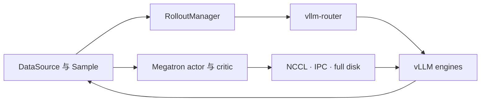
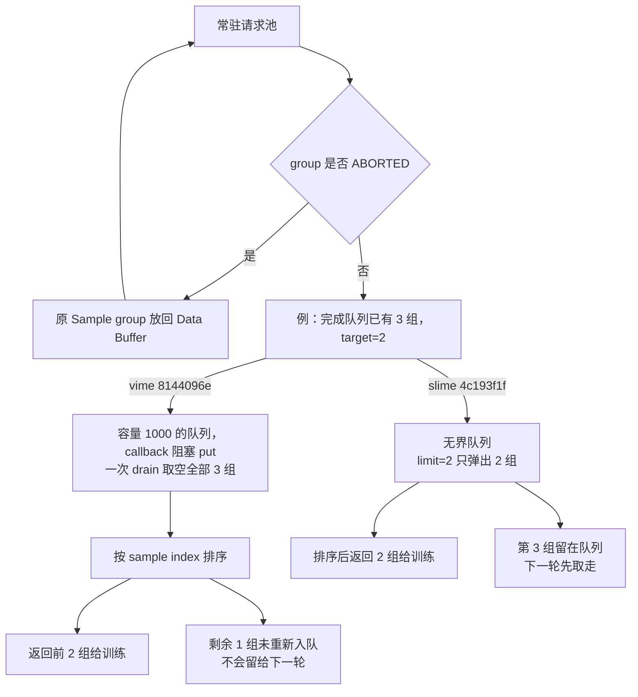

# vime 对 slime 的 vLLM 后端替换与支持度分析

> **源码基线**：`vllm-project/vime@8144096e3f4fb0fb670c37b8f2d84015f7e92320`（`main`，2026-08-03）
> **源码基线**：`THUDM/slime@8ef1fb47e72bf533402526fb51af11fab12c45b5`（`main`，2026-05-09）
> **源码基线**：`THUDM/slime@4c193f1f37509cca70f0e88807a9305b70f63f4e`（`main`，2026-09-03）
> **主题**：先交代 vime 与 slime 的谱系、同步方式和证据分层，再按 slime 后端适配面逐项标出 vime 复用、改写或缺失的部分。随后依次审计 vLLM 参数与拓扑、请求协议与训练数据、权重同步、同步与异步驱动、训练与模型转换、镜像与平台、文档与源码差异，最后给出带“承袭 / 新增 / 改写”列的支持矩阵与选型建议。核心代码在 vime 的 `vime/backends/vllm_utils/`、`vime/rollout/vllm_rollout.py` 与 `vime/backends/megatron_utils/update_weight/`。
> **适用范围**：只审计 vime 相对 slime 的 vLLM 派生实现；新后端适配面的定义归 [[19_slime_rollout_backend_extension_analysis|slime 后端扩展]]，slime 自身的 SGLang 机制归各 slime 机制页，vLLM 引擎内部归 [[02_engineering/03_infer_frameworks/vllm/index|vLLM]]。
> **最近更新**：2026-09-17。覆盖 vime 与 slime 的分叉和同步谱系、各项能力的承袭/新增/改写归属、按 slime 适配面清单的 vime 实现状态，以及 delta 同步与量化后处理的支持状态。

## 1. 背景：vime 是什么，以及怎样判断“是 vime 的”

vime 不是给 slime 动态安装的一个 vLLM 插件，而是从 slime 分叉、把默认 rollout 栈系统性改写为 **vLLM + vllm-router** 的独立仓库。vime 的 README 把自己定义为“保留 slime 训练栈与数据生成设计，默认以 vLLM（配合 vllm-router）作为 rollout 后端”；slime 的 `README_zh.md` 在生态一节同样把它列为由 vLLM 项目维护、基于 slime 的派生框架，而不是主仓库内置 backend。

**谱系决定归因。** 页头三条基线分工如下：vime@8144096e 是被审计对象；slime@8ef1fb47 是 vime 与 slime 的 merge-base，即分叉点，用来判定承袭关系；slime@4c193f1f 是 slime 域当前基线，用来对照 slime 此后的变化。vime 历史中的 slime 部分止于 `8ef1fb47`（2026-05-09），随后在 2026-05-16 合入 vLLM 后端分支；此后 slime 的变化不是再 merge 进来，而是以压缩后的 sync/port 提交逐批移植，例如 `d16d1dc8`（sync slime #2014..#2125，2026-06-29）与 `8d8f2558`（weekly sync through slime #2185，2026-07-14），外加 `f2755327` 这类零星补同步。分叉点到固定基线共有 164 个 first-parent 提交，标题含 sync、port、mirror 等字样的约 46 个（关键词计数，只作量级参考）。因此“vime 里有而 slime@4c193f1f 里没有”的东西，未必是 vime 新增：它可能是 slime 后来删掉或修掉、vime 尚未同步的旧状态。本页对每项能力用四个标签归因：

| 标签 | 判据 |
|---|---|
| **承袭** | slime 在分叉点 `8ef1fb47` 已有，vime 基本原样保留（含只改名） |
| **承袭（同步）** | slime 分叉后才加入，vime 经 sync/port 提交移植 |
| **改写** | slime 有 SGLang 版对应物，vime 为 vLLM 重写 |
| **新增** | slime 在分叉点与当前对照基线都没有对应物，只在 vime |

本文把证据分为三层：列在源码阅读路线里的是固定提交上的**源码事实**；明确写“文档”的是同一提交中的项目说明；标“分析判断”的是根据约束、失败路径和测试覆盖作出的推断，不代表作者原话。vLLM 与 vllm-router 内部行为只按其公开接口描述，属于依赖侧契约，本页未按镜像中的 vLLM v0.25.1 源码逐项核对。

> slime 是 **SGLang-native**；vime 是 **vLLM-native**。二者都允许替换数据生成函数，但都没有提供一个可在运行时选择任意 rollout engine 的稳定 backend registry。

本页的 P1–P4 是不同证据维度，不是逐级累计的分数，也不是性能排名：

| 证据层 | 本页判据 | 在固定基线能确认什么 |
|---|---|---|
| P1 接口 | 存在参数入口、解析器与运行消费者 | vLLM CLI、router CLI、拓扑 YAML、external/custom rollout 均有对应代码 |
| P2 功能路径 | 能追到输入、处理与返回，并标出依赖 | generate→reward→train→weight update 路径存在；依赖镜像、硬件与服务协议，本页未实跑 |
| P3 正确性约束 | 有字段校验、错误分支或针对性测试 | token/logprob、multimodal、routing 与更新屏障有约束；缺 logprob 补零、top-p adapter、量化后处理与内容校验仍是缺口 |
| P4 运行证据 | 区分 CI 配置、已观测运行记录与实测结果 | 固定仓库有 GPU CI/镜像与平台说明；本页没有新增 GPU 运行记录或性能测量 |

已有 slime 工作流若主要依赖 Megatron、DataSource、custom rollout 与通用 RL loss，迁移到 vime 的成本通常可控；若依赖 SGLang 专属 API、补丁端点、一致性工具或尚未在 vLLM 适配层闭合的特性，就不是“改几个参数”而是功能重建（分析判断）。

## 2. 为什么只替换 `generate()` 不够

slime 确实会动态加载整轮 rollout 函数，`--custom-generate-function-path` 也只承诺替换示例 rollout 内部的 `generate(args, sample, sampling_params)`。但同一控制面把 engine actor 固定为 `SGLangEngine`，默认请求固定走 SGLang `/generate` 并把 SGLang `meta_info` 交给 `Sample`；部署、router 注册、取消、显存、权重发布、健康检测和观测都不属于 custom generate 的所有权。slime 侧从调用点反推出的完整义务清单见 [[19_slime_rollout_backend_extension_analysis#6. 新后端必须承接的适配面|slime 后端扩展的适配面清单]]，本页不再另列，只在第 3.3 节标出 vime 对每一项的实现状态。

> **分析判断**：一个直观方案是先定义 SGLang/vLLM 共用、只包含公共能力的 `InferenceEngine`。但 PD/EPD、路由器注册、sleep tag、请求中止、权重传输会话和响应元数据都属于引擎专有能力；过早统一只会把这些差异变成大量能力判断分支。vime 选择派生仓库级替换，获得较完整的 vLLM 能力，代价是要重复维护控制面衔接代码，并以移植提交跟随 slime 与 vLLM 两个上游。

## 3. 软件架构：复用上半部，替换生成与提交边界

```mermaid
flowchart LR
    D["DataSource 与 Sample"] --> M["RolloutManager"]
    M --> V["vllm-router"]
    V --> E["vLLM engines"]
    E --> D
    D --> T["Megatron actor 与 critic"]
    T --> W["NCCL · IPC · full disk"]
    W --> E
```

README 把架构拆为 Megatron training、vLLM + router rollout 和 Data Buffer 三块；参数分为 Megatron 原生参数、`--vllm-*` server 参数、`--router-*` 路由参数（外加 `--vllm-router-ip/port` 这类“router 在哪”的编排参数）以及 vime 自身的编排参数，默认 rollout 函数是 `vime.rollout.vllm_rollout.generate_rollout`。

### 3.1 责任边界与归属

| 系统部分 | 在 vime 中 | 归属 | vime 中的责任代码与关键变化 |
|---|---|---|---|
| 主循环 | 近似保留 | 承袭 | `train.py`、`train_async.py`；仍是 generate → train → update，注释从“with sglang engines”改为“with vLLM engines” |
| 数据层 | 大量保留 | 承袭 | `vime/utils/types.py::Sample`（top-p 与 routed-experts 校验逻辑与 slime 同源）、`vime/rollout/data_source.py` |
| 训练层 | 大量保留 | 承袭，局部新增 | `vime/backends/megatron_utils/`；Megatron Bridge 模型路径承袭自 slime，`_apply_bridge_runtime_config` 为 vime 新增 |
| rollout 控制层 | **重写** | 改写 | `vime/ray/rollout.py`、`vime/backends/vllm_utils/`：`VLLMEngine`、vllm-router、`VllmConfig`、外部服务发现 |
| 请求数据路径 | **重写** | 改写 | `vime/rollout/vllm_rollout.py`：`/inference/v1/generate`、vLLM 响应解析与多模态渲染 |
| 权重提交路径 | **深度改写** | 改写（选择逻辑与分桶承袭） | `update_weight/*` 与 `VLLMEngine`：vLLM 原生 NCCL/IPC 更新会话、`/collective_rpc` 磁盘重载、草稿模型更新会话 |

`vime/ray/rollout.py::RolloutManager.__init__` 仍动态加载 DataSource、整轮 rollout、评估、reward post-process 与 train-data conversion 函数，说明 slime 的上层扩展契约被原样保留；但 `start_rollout_servers` 固定走 vLLM 分支，`ServerGroup.start_engines` 固定 `ray.remote(VLLMEngine)`，没有 `backend=...` 分派器。所以 vime 证明的是 **通过派生替换 backend 可行**，不是 slime/vime 已经共同拥有一个可热插拔的多后端抽象。

> [!warning] 归因边界
> “slime 的数据/训练契约可被 vime 复用”不等于“slime 主仓库提供 vLLM backend”。本页的 `VLLMEngine`、vllm-router 接入、vLLM 请求、NCCL transfer engine 与 `docker/patch/latest/vllm.patch` 只归因于 vime；而拓扑编排、多模型、EPD 启动顺序、fully-async 队列、Bridge 模型路径等是 vime 从 slime 承袭的结构，不能算作 vime 的新能力或 vime 独有的缺口。

### 3.2 固定基线落后于 slime 的部分

vime 基线最后一次整批同步截至 slime #2185（`680824dd`，2026-07-07）。之后 slime 的若干变化不在 vime 中，读者对照两仓时最容易把它们误读成“vime 的差异”：

| slime 变化 | slime 提交 | 在 vime@8144096e 的表现 |
|---|---|---|
| 更新器暴露每个 engine 的并行配置（EP 定向路由） | `6d485c42`（#2220，2026-07-19） | `get_updatable_engines_and_lock` 只返回 GPU 数与偏移 |
| 修复 fully-async 一次取空完成队列后截断丢组 | `7e02052e`（#2238，2026-08-12） | 仍是有界队列加整体取空再截断（第 7.3 节） |
| 内置 mbridge、移除 megatron-bridge，改用 `hf_to_megatron` 加载表 | `f655e13d`（#2251，2026-08-04） | 仍走 Megatron Bridge 导入导出（第 8.1 节） |
| external 文档删除过时的 `delta + nccl` 推荐行 | `1a3fb0a6`（#2312，2026-08-24） | 文档仍保留该行（第 10 节） |
| custom generate 可声明请求级 `abort_mode` | `4c1ab402`（#2272，2026-09-03） | 只有 server 级中止 |

### 3.3 按 slime 适配面清单逐项的 vime 状态

下表的适配面名称与编号取自 [[19_slime_rollout_backend_extension_analysis#6. 新后端必须承接的适配面|slime 后端扩展的适配面清单]]，只写 vime 特有的状态。

| 适配面 | vime 的实现 | 归属 | 状态与边界 |
|---|---|---|---|
| ① 参数与部署配置 | `vime/backends/vllm_utils/arguments.py::add_vllm_arguments` 包装 `AsyncEngineArgs` 与 `FrontendArgs`（含参数组）为 `--vllm-*`；`vime/backends/vllm_utils/vllm_config.py::VllmConfig`；`vime/backends/vllm_utils/vllm_engine.py::_compute_server_args` | 改写（前缀包装模式与 YAML 结构承袭） | 实现存在；CLI ABI 随 vLLM 版本变化 |
| ② 外部发现 | `vime/backends/vllm_utils/external.py::apply_external_engine_info_to_args`，先试 `/server_info?config_format=json` 并归一化字段 | 承袭（同步，slime #2016）+ 改写 | 实现存在；派生 `rollout_num_gpus` 与 worker 类型的逻辑同 slime |
| ③ 部署与生命周期 | `VLLMEngine.init` → `launch_server_process` 在子进程内调用 vLLM `ServeSubcommand.cmd`，轮询 `/health` 就绪；`shutdown` | 改写 | 实现存在 |
| ④ router 与 worker 注册 | 普通模型动态 `POST /workers`；PD 模型改为收集 prefill/decode URL 后再以静态列表启动 router；encoder 不注册 | 改写 | 实现存在；注册 API 属 vllm-router 契约 |
| ⑤ 请求与响应元数据 | `vime/rollout/vllm_rollout.py::generate` 发 token ids 到 `/inference/v1/generate`，自行把 `choices` 转成 slime 形状的 `meta_info` | 改写 | logprob 缺失时补 0；不写 `weight_version`；top-p 保留集未闭合（第 5 节） |
| ⑥ 取消与排空 | `vime/rollout/vllm_rollout.py::abort` → `vime/backends/vllm_utils/server_control.py::abort_inflight_requests` 对每个 worker 发 `/abort_requests`，按固定间隔重扫 | 改写（`/abort_requests` 由 `vllm.patch` 提供） | 实现存在；不轮询负载确认排空 |
| ⑦ 拓扑暴露 | `RolloutServer.engine_gpu_counts/engine_gpu_offsets`，`_get_updatable_server` 只取第一个 | 承袭 | 缺 slime 后来加入的并行配置（第 3.2 节） |
| ⑧ 显存生命周期 | `release_memory_occupation` → `/sleep?level=2`，`resume_memory_occupation` → `/wake_up`，丢弃 vLLM 不认识的 tag | 改写 | 实现存在；offload 时自动打开 vLLM sleep mode |
| ⑨ 权重发布与校验 | NCCL/IPC 走 vLLM `start_weight_update` → `update_weights` → `finish_weight_update` 会话；磁盘走 `/collective_rpc reload_weights`；`pull_weights` 调用的接收端不存在 | 改写 | `post_process_weights` 为空操作，`check_weights` 返回 unsupported，版本号由代理本地记录（第 6 节） |
| ⑩ 健康检测与恢复 | `vime/utils/health_monitor.py::RolloutHealthMonitor` 调 `VLLMEngine.health_generate`，实际请求 `/health`；恢复与重连链承袭 | 承袭 + 改写 | `/health` 只证明服务存活，不像 slime 的 `/health_generate` 那样走一次生成（分析判断，依据两者端点名与 vLLM 公开语义） |
| ⑪ 观测与剖析 | `vime/ray/rollout.py::_compute_vllm_request_perf_metrics` 等从响应构造指标；`start_profile/stop_profile` | 改写 | 指标字段以 vLLM 返回为准，与 slime 的 SGLang/补丁字段不一一对应 |

## 4. vLLM 参数与拓扑支持

### 4.1 原生参数不是手工维护的白名单

vime 在注册期临时替换 `parser.add_argument` 与 `parser.add_argument_group`，把 vLLM `AsyncEngineArgs` 与 `FrontendArgs` 的选项自动加上 `--vllm-` 前缀；训练编排负责的 model、seed、TP、nnodes、host/port 等字段被显式跳过。router 参数由 `RouterArgs.add_cli_args(use_router_prefix=True)` 以 `--router-` 前缀注入，均衡阈值默认值（abs 10、rel 1.2）与 slime 相同。这一包装模式承袭自 slime 的 `--sglang-` 包装器，vime 把它扩到了参数组与 frontend 参数（改写）。

优点是新 vLLM flag 通常不需要 vime 再逐项抄写；代价是 CLI ABI 会跟随 vLLM 版本变化，不能脱离依赖基线谈兼容。`--vllm-config`、legacy `--prefill-num-servers` 与 external engines 三条拓扑入口由 `vime/backends/vllm_utils/arguments.py::validate_args` 断言互斥。

### 4.1.1 从 SGLang 配置迁移的对应入口

这张表对应的是配置目的，**不是等价数值转换**。原生选项由固定镜像的 parser 决定；YAML 内也要改成 vLLM 字段。

| slime 配置目的与入口 | vime 中核实的入口 | 需要重新确认的含义 |
|---|---|---|
| `--sglang-mem-fraction-static` 控制服务显存预算 | `--vllm-gpu-memory-utilization`，如 vime 的 `scripts/run-qwen3-4B.sh` | 两引擎预算口径不同，不能按相同比例保证相同余量 |
| `--sglang-server-concurrency` | `--vllm-server-concurrency`（`add_vllm_arguments`，默认 512） | 客户端并发门，与引擎原生调度上限分开 |
| `--sglang-config` | `--vllm-config`，`VllmConfig` | model/group 结构相同，override 键由不同 parser 消费 |
| SGLang router 地址 | `--vllm-router-ip` / `--vllm-router-port` | 地址入口与原生 `--router-*` 策略前缀分开 |
| SGLang 多个 speculative flags | `--vllm-speculative-config` JSON，如 vime 的 `scripts/run-glm4.7-30B-A3B.sh` | method、draft 与 token 数按 vLLM 配置；不是逐 flag 更换前缀 |
| `--rollout-num-gpus-per-engine` | 同名编排参数 | vime 在 `_resolve_parallel_sizes` 中按每 engine GPU 数除以 PP×DP 得到 TP，被跳过的 TP 参数不能透传 |
| `--router-policy consistent_hashing` 的会话亲和 | `--router-policy consistent_hash` | 请求头从 `X-SMG-Routing-Key` 换成 `x-session-id`（第 5.3 节） |

### 4.2 服务与路由器生命周期需要完整适配，不只是封装 HTTP 请求

`VLLMEngine` 把 vLLM `ServeSubcommand` 放进独立子进程，等待 `/health` 返回 200 后才完成初始化。普通模型的 regular worker 初始化后向 vllm-router 注册；PD 模型不在 init 时注册，而是等所有 engine 启动后收集 prefill/decode URL，再以静态列表启动 router（第 4.4 节）；encoder worker 不注册到语言模型 router。

`_compute_server_args` 固定设置 `logprobs_mode=processed_logprobs`、`enable_prompt_tokens_details` 与 `enable_server_load_tracking`，按 colocate 与否把 `weight_transfer_config` 设为 IPC 或 NCCL，从每 engine GPU 数与 PP×DP 反推出 TP；多节点时设置 `master_addr/master_port`、以 `mp` 作为数据并行与分布式执行后端，非 0 节点以 headless 启动。

### 4.3 `--vllm-config` 的真实能力边界

`vime/backends/vllm_utils/vllm_config.py` 支持每模型一个 router，以及 `regular`、`prefill`、`decode`、`placeholder`、`encoder` 五类 server group；group 可以覆盖 GPU 数、每 engine GPU 数和 vLLM 参数。`update_weights` 未显式填写时，以有效 model path 是否等于 actor 的 `hf_checkpoint` 自动推断。这些配置结构（含五类 worker type 与自动推断）在 slime 分叉点的 `slime/backends/sglang_utils/sglang_config.py` 中已经存在，vime 只做了改名（承袭）。

运行时为每个模型建立 router 与 group，并把 `{model_name: router}` 写到 `args.vllm_model_routers`，custom rollout 可通过 `vime/rollout/vllm_rollout.py::get_model_url` 定向访问 actor、reference 或 reward model（承袭）。vime 新增的是**跨模型单调的端口游标**：slime 按模型重置端口游标，vime 在 `start_rollout_servers` 的注释中记录了原因——engine init 延迟等待，后一个模型分配端口时前一个模型尚未绑定，空闲端口探测会发出重复端口，两个模型的请求串扰后表现为 vLLM 500 “start_weight_update must be called before update_weights”。

多模型支持需要分成两档：

- **强支持**（分析判断）：一个在线 actor + 多个冻结 reference/reward 模型；每个模型独立 router，冻结模型可拥有不同 checkpoint。
- **明确受限**：多个 `update_weights: true` 模型。`RolloutManager._get_updatable_server` 只返回第一个，docstring 写明 multi-model weight update 尚未支持。这一限制原样承袭自 slime，slime 当前对照基线仍然如此。

### 4.4 PD 与 Encoder-Prefill 解耦

PD 使用 vLLM `NixlConnector`：prefill 的 `kv_role` 是 `kv_producer`，decode 是 `kv_consumer`；prefill/decode 子进程还会拿到 NIXL side channel 的 host 与端口。vllm-router 以 PD 模式、两组静态 URL 启动。不同 group 可以按各自的每 engine GPU 数得到不同 TP，因此能按 prefill 计算密集、decode 带宽密集的差异独立配比。slime 的 PD 走 SGLang 自己的 disaggregation 参数与动态 worker 注册，两者只共享“prefill/decode group”的配置结构（改写）。

**EPD 的编排是承袭的，vLLM 数据面是固定基线提交本身加入的。** slime 在分叉前的 `6f113130`（2026-03-11）已为 SGLang 加入 encoder worker type 与两阶段启动：先启动 encoder 组、收集端点，再把 `encoder_urls` 与 `language_only` 注入 regular/prefill 组，日志写“EPD phase 1 done”。vime 从分叉起就带着这套结构。vime 的固定基线提交 `8144096e`（#370，“add vLLM encoder-prefill disaggregation”）把它接到 vLLM 上：为 encoder、regular、prefill 注入 `ec_transfer_config`（`ECExampleConnector`，共享存储路径 `/dev/shm/vime-ec-<uuid>`），encoder 关闭 prefix caching，把 `args.vllm_model_encoder_endpoints` 暴露给请求路径，多模态请求在 render 前先调 `prime_encoder`，并加入 `tests/test_qwen2.5_vl_3B_ep_disaggregation.py`。因此准确的说法是“vime 在基线提交把承袭的 EPD 编排改写到 vLLM 上”，而不是“vime 又新增了 encoder disaggregation”。

## 5. 请求协议与训练数据正确性

### 5.1 必须完整保留输入和输出 token

默认路径不把文本响应重新 tokenize：`vime/rollout/vllm_rollout.py::generate` 向 `/inference/v1/generate` 发送 `token_ids`，采样参数由 `_build_inference_sampling_params` 映射（固定 `logprobs=1`），从 `choices[0]` 取生成 token ids 与逐 token logprob，再自行拼出 `finish_reason`、`prompt_tokens`、`completion_tokens`、`cached_tokens` 与 `routed_experts` 组成的 `meta_info`，交给承袭自 slime 的 `Sample.append_response_tokens`。server 固定 `logprobs_mode=processed_logprobs`，本页判断它对应训练侧需要的“采样处理后的 logprob”语义（分析判断，属 vLLM 契约）。

这比 OpenAI text-only 兼容层更适合 RL：response length、loss mask、old logprob 和路由元数据都锚定同一 token 序列。但有两处 vime 自己引入的缺口（新增）：

- vLLM 没返回 logprob，或某项不是 dict 时，解析用 `0.0` 填充而不是 fail-fast；slime 的 SGLang 路径在缺 `output_token_logprobs` 时 token 与 logprob 同时为空。训练若启用 `--use-rollout-logprobs`，应把“logprob 非空且长度严格相等”列为外部验收门禁。
- 拼出的 `meta_info` 不含 `weight_version`，所以 vime 的 Sample 不会累积 `weight_versions`，[[17_slime_train_inference_consistency_analysis|训推一致性]] 六层阶梯中 L0 权重快照这一层的版本钩子在 vime 默认路径上缺席。

### 5.2 多模态不是绕回文本协议

多模态路径先对 encoder 调 `prime_encoder`（配置了 EPD 时），再请求 `/v1/chat/completions/render` 得到 vLLM 的 feature payload；`_align_mm_feature_placeholders_to_tokens` 把 feature placeholder 重新对齐到 vime 训练侧的 canonical prompt tokens，最后仍调用 token-based generate。若 placeholder 长度、offset 或 token 子序列无法对齐会直接抛 `ValueError`，而不是静默使用两个 tokenizer 视图。slime 的 SGLang 路径是直接把文本与图片交给 SGLang 展开（改写，render 与对齐为 vime 新增）。

### 5.3 路由亲和与行为策略元数据的支持程度不同

每个 sample group 自动分配 session id（承袭）；router 策略为 `consistent_hash` 时，请求带 `x-session-id` 固定到同一 worker，让多轮 agent 更可能命中已有 prefix cache（改写：slime 用 `consistent_hashing` 与 `X-SMG-Routing-Key`）。

MoE routing replay 在源码上闭环：vime 把 vLLM 返回的 base64 `.npy` routed-expert 数组解码后放进 `meta_info`（改写），`Sample` 按 token × layer × top-k 校验元素数、Megatron actor 按 layer 注入 replay 状态（两者承袭）。vime 构造的 meta 不带 `routed_experts_start_len`，partial 续生成时这段元数据按“从头开始”处理，是否与 vLLM 返回的范围一致本页未核（分析判断）。

top-p replay 只完成了两端、没有闭合中间 adapter：`GenerateState` 在 top-p 不为 1 时设置 `custom_params.return_top_p_token_ids`，但 `_build_inference_sampling_params` 没有把 `custom_params` 写进请求，响应解析也没有把 top-p 字段放进 `meta`；`Sample` 虽有承袭来的 ids/offsets 解码与长度校验，默认 vLLM 路径在该基线仍不能称为端到端支持。slime 侧这项能力依赖 `sglang-top_p.patch`，vime 没有对应的 vLLM 补丁。

### 5.4 自定义生成函数与整轮 rollout 仍可替换

每条 sample 可使用自己的 `generate_function_path`，否则回退到全局 custom generate 或默认 vLLM generate；custom function 仍可返回一个或多个 `Sample`，reward 可以逐样本或按 group 计算。默认整轮 rollout 继续使用 first-completed、oversampling、dynamic filter、abort 与 partial sample 回收，并在返回前调用 sample filter/all-samples hook。这些编排承袭自 slime（vime 的 `ae5d6b04` 明确以“align vllm_rollout.py with slime sglang_rollout.py”为目标）。差异在取消：vime 的 `abort` 在有在途任务时对每个 worker 发 `/abort_requests`，并在排空期间每隔固定间隔重扫，以截断多轮 agent 在首次中止后才发出的请求；slime 用 `/abort_request` 并轮询负载直到归零。因此 agent、tool use 或自定义 RM 多数属于“上层复用”；直接调用 SGLang endpoint、SGLang streaming chunk 或 SGLang meta 字段的旧代码则必须改写。

## 6. 权重同步：vime 最深的 vLLM 适配面

训练 actor 在 `vime/backends/megatron_utils/actor.py::MegatronTrainRayActor.init` 中按 mode × transport × colocate 选择 updater，这段选择逻辑承袭自 slime（slime 后来在 `7e4ac3be` 把它抽成 `create_weight_updater`）。下表“支持判断”一列是本页的分析判断，不是项目的官方分级：

| 路径 | 使用条件 | vLLM 侧机制 | 归属 | 支持判断 |
|---|---|---|---|---|
| full + NCCL | disaggregated 默认 | vLLM `NCCLWeightTransferEngine` 与更新会话 | 改写（分桶、Ray 锁、异构 engine GPU 数承袭） | **强**；支持异构 engine GPU 数与 PP 分阶段发送 |
| full + tensor IPC | colocate | packed CUDA IPC handles 与更新会话 | 改写 | **强**；专用于同机同 GPU 共置 |
| full + disk | external/异构文件系统 | 写 HF checkpoint 后 `/collective_rpc` 调 `reload_weights` | 承袭（同步，slime #2021）+ 改写重载 | **强但慢**；依赖共享盘或 post-write hook；不能配本地 checkpoint 目录（见下） |
| delta + disk | 低带宽/跨集群 | 训练端代码仍在，接收端缺失 | 承袭（同步，slime #2089） | **已禁用**：参数校验直接抛 `NotImplementedError` |

**delta 同步在 vime 基线不可用。** `vime/utils/arguments.py::_validate_update_weight_args` 在 `--update-weight-mode=delta` 时抛出“unverified on vime+vLLM and is disabled”；`vime/utils/disk_delta.py` 的注释说明原因：vime 客户端调用的 `/pull_weights` 接收端没有被当前 vLLM 镜像补丁安装，`docker/patch/latest/vllm.patch` 新增的 HTTP 端点只有 `/abort_requests` 与 `/start_draft_weight_update`。同一个缺失还影响 full + disk：`vime/ray/actor_group.py::RayTrainGroup._reload_rollout_weights_from_disk` 在设置了 `--update-weight-local-checkpoint-dir` 时会先对每个 engine 调 `pull_weights`，而参数校验没有拦截这一组合（分析判断：该组合会在首次同步时因端点不存在而失败，未运行验证）。slime 中这条端点由 `sglang-pull_weights.patch` 提供，归属见 [[16_slime_weight_sync_analysis|权重同步]]。

### 6.1 NCCL/IPC 提交事务

NCCL updater 直接使用 vLLM 原生 `NCCLWeightTransferEngine`。一次提交执行 pause（`/pause?mode=keep`）→ 重置 prefix cache → 量化前处理 → `start_weight_update` → 分 bucket 发送 → `finish_weight_update` → 量化后处理 → resume；在线 MTP 训练且 speculative method 为 `mtp` 时，还会用 `start_draft_weight_update` 再开一次草稿模型更新会话。NCCL group 的 world size 是一个 trainer sender 加所有 rollout engine GPU，支持每个 engine 不同 GPU 数；bucket 发送前用 Ray lock 防止通信并发造成 NCCL deadlock（这两点承袭自 slime 分叉点）。

colocate IPC 同样遵循 pause/flush/start/finish/resume，只是 tensor payload 换成各训练 rank 的 CUDA IPC handle，由 slot leader 在 Gloo 组上 `all_gather_object` 聚合后发给共卡 engine，发送后 `torch.cuda.ipc_collect` 回收句柄。

**量化前后处理在 vime 中是空操作。** 两个 updater 在 `compressed-tensors` 量化配置下都会调用 `post_process_weights`，但 `vime/backends/vllm_utils/vllm_engine.py::VLLMEngine.post_process_weights` 直接返回 `{"ok": True, "noop": True}`，该空实现从 vime 首个 vLLM 版本起就存在。slime 中对应端点由 `sglang.patch` 新增并真正执行。vLLM 的 `finish_weight_update` 或 `reload_weights` 是否自行完成 INT4/FP4 的布局恢复与后处理，属于 vLLM 契约，vime 源码无法证明（第 8.3 节）。

### 6.2 磁盘全量更新不只是“保存再加载”

full disk 以 `weight_vNNNNNN` 目录发布 HF checkpoint，每个写入 rank 自己建目录以适配非 POSIX 共享文件系统，并允许 object-store-backed 文件系统通过 `--custom-update-weight-post-write-path` 钩子建立跨主机可见性；真正 reload 由 `RayTrainGroup._reload_rollout_weights_from_disk` 在写入完成后发起：pause → flush → 每个 engine `update_weights_from_disk`（vime 中实为 `/collective_rpc` 的 `reload_weights`）→ continue。它降低的是对 NCCL 连通性的要求，不改变每次提交仍需 pause/flush/reload 的事实。

delta 的训练端实现（首次只捕获与 engine base 一致的快照，之后逐 HF tensor 字节 diff、zstd 压缩、checksum、原子写入版本目录）随 slime 同步进入 vime，但如上所述在固定基线被参数校验禁用。

### 6.3 当前最重要的正确性缺口

`check_weights()` 明确返回 `supported: false`，所以 `train.py` 在 `--check-weight-update-equal` 下调用的 `check_weights("compare")` 不会像名字暗示的那样执行逐 tensor 等价比较。

版本核对也比 slime 弱。full disk 的 CI 分支与 slime 相同：`--ci-test` 时读取所有 engine 的 `get_weight_version` 并拒绝不一致。但 `VLLMEngine.get_weight_version` 返回的是代理 actor 在 `update_weights_from_disk`、`update_weights_from_distributed` 等 HTTP 调用成功后**本地记下**的版本号，从未更新时读取会抛错；它不向 vLLM 查询服务端状态。因此这项检查证明的是“每个代理都收到了成功返回”，而不是“服务端已加载该版本”，更不是“tensor 内容相等”。生产验收应另加固定参数抽样 hash、短 prompt logits 对齐或保存后 round-trip 检查（分析判断）。

## 7. 同步、异步与稳定性支持

下图用同一个反例（target=2，完成队列里已有 3 组）并排重放 vime 基线的实现与 slime 修复后的实现；同步与 one-stage async 的顺序分别见 7.1–7.2。

<!-- Figure spec: TB queue counterexample on one shared input: target2 with 3 completed groups. Lane vime 8144096e: capacity1000 blocking put, drain all 3, sort, return 2, one group lost with no requeue. Lane slime 4c193f1f after PR 2238: unbounded queue, get_completed_groups limit2 pops 2, returns 2, third group stays queued for next rollout. Shared aborted-original-object recycle branch. No latency scaling. -->

```mermaid
flowchart TB
    F0["常驻请求池"] --> CHECK{"group 是否 ABORTED"}
    CHECK -->|是| RET["原 Sample group 放回 Data Buffer"]
    RET --> F0
    CHECK -->|否| Q["例：完成队列已有 3 组，target=2"]
    Q -->|vime 8144096e| V1["容量 1000 的队列，callback 阻塞 put<br/>一次 drain 取空全部 3 组"]
    V1 --> VS["按 sample index 排序"]
    VS --> V3["返回前 2 组给训练"]
    VS --> LOST["剩余 1 组未重新入队<br/>不会留给下一轮"]
    Q -->|slime 4c193f1f| S1["无界队列<br/>limit=2 只弹出 2 组"]
    S1 --> S3["排序后返回 2 组给训练"]
    S1 --> KEEP["第 3 组留在队列<br/>下一轮先取走"]
```

三种方式移动的是“等待哪一批 generation 完成”的边界，不是删除权重提交协议：同步完全串行；one-stage async 让下一批生成与当前批训练重叠，但提交前仍等待 future；完全异步把长期请求池与单次训练批解耦，中止组必须回收而不能直接训练。

### 7.1 同步路径：样本使用哪个策略版本最清楚

`train.py::train` 先推一次初始 actor 权重；每轮严格 generate → train/save → update weights，offload rollout 时再分 weights 与 KV/CUDA graph 两阶段 onload。这里不会让一条 rollout 请求跨越权重提交（承袭）。

### 7.2 one-stage async：允许阶段重叠，仍保留提交屏障

`train_async.py::train` 让 generate N+1 与 train N 重叠，但开头断言不支持 colocate；到 `update_weights_interval` 时先等待下一轮 generation future，再更新权重，避免请求中途换版本（承袭）。

### 7.3 完全异步：有界完成队列不是版本差门禁

`vime/rollout/fully_async_rollout.py::generate_rollout_fully_async` 叠加在 `train_async.py` 之上，保持常驻 thread + asyncio pool。它来自 slime #1920（`f0bce74a`，2026-05-18，分叉之后），由 vime `e857e3a6` 移植；上图的反例在 slime 原始实现中同样存在，slime 在 `7e02052e`（#2238，2026-08-12）才修复，时间晚于 vime 基线。所以下表的左右两列是“同一实现修复前后”，不是“vime 与 slime 的设计差异”：

| 边界 | vime `8144096e`（= slime #1920 原始实现） | slime `4c193f1f`（#2238 修复后） |
|---|---|---|
| 完成队列 | `queue.Queue(maxsize=1000)`，callback 使用阻塞 `put` | 无界 `queue.Queue()`（注释说明 put 运行在事件循环线程内，不能阻塞）；以 active<C 且队列长度<C 两个条件做软回压 |
| 消费 | `get_completed_groups()` 一次取空，再把排序结果截为 `[:target]` | `get_completed_groups(limit=target-已收集)` 只取还需要的组，多余完成组保留 |
| 容量含义 | queue 满时 callback 可阻塞后台事件循环；容量不是最大策略陈旧度 | 软阈值也不是版本差门禁 |
| 反例：target=2、队列已有 3 组 | 取空 3 组，返回前 2 组，第 3 组丢失 | 只弹出 2 组并返回，第 3 组留在队列，下一轮先被取走 |

由第二行可直接推出反例：target=2 时若一次取出 3 组，vime 返回排序后的前 2 组，多出的一组没有重新入队；同一输入在修复后的实现中，`get_completed_groups(limit=2)` 只弹出 2 组，第 3 组已完成生成与打分，留在队列里供下一轮使用。证据：vime@8144096e 的 `vime/rollout/fully_async_rollout.py` 与 slime@4c193f1f 的 `slime/rollout/fully_async_rollout.py` 中的 `AsyncRolloutWorker.__init__`、`AsyncRolloutWorker.get_completed_groups`、`AsyncRolloutWorker._make_done_cb` 与 `_generate_rollout_async`。

ABORTED group 的源码处理是把原 Sample 列表重新交给 Data Buffer，callback 没有清空 tokens/response；官方示例称暂不支持 partial continuation，但这不证明返回后一定从空响应重跑。实际重新生成仍受各仓 helper 的 token 复用条件制约。两者均无全局 exactly-once 或最大版本差保证；两仓示例都不支持 eval。

### 7.4 容错只覆盖由 vime 管理的 rollout 引擎

`vime/utils/health_monitor.py::RolloutHealthMonitor` 在 engine onload 后按周期调用 `health_generate`，vime 中它请求的是 vLLM `/health`；失败时对该多节点 engine 的全部 Ray actor 先 `shutdown` 再 `ray.kill`，并把槽位置空；下一次权重更新前恢复可更新 server，再重新连接 updater 并推送当前权重。监控、置空与恢复重连链承袭自 slime，探活端点是改写。

external engines 不属于这个故障域：`vime/backends/vllm_utils/external.py::ExternalRolloutServer` 的 recover/offload/onload 都是 no-op，recover 明确告警 fault tolerance 不支持；vime 只负责发现、校验、router 注册和权重调用（承袭（同步）+ 改写）。

## 8. 训练、算法、低精度与模型支持度

### 8.1 Megatron 与 RL 算法：继承度高，Bridge 路径是 slime 的旧形态

训练侧仍提供 GRPO、GSPO、CISPO、PPO、REINFORCE++ 及 baseline variant；OPD 作为与 advantage estimator 正交的 penalty 注入。advantage dispatch 和 policy loss 分支仍位于 `vime/backends/megatron_utils/loss.py::compute_advantages_and_returns`，而不是 vLLM server（承袭）。

模型构建支持三条路线：custom model provider、Megatron Bridge 从 HF config 构建、传统 Megatron `ModuleSpec`。Bridge 构建顺序是 `AutoBridge.from_hf_pretrained` → `patch_auto_bridge_hf_config` → `to_megatron_provider(load_weights=False)` → `_apply_bridge_runtime_config` → `finalize` → `provide`。这里明确不在 provider 构建时加载权重；HF checkpoint 载入在 `vime/backends/megatron_utils/checkpoint.py::_load_checkpoint_hf`，且断言 mode 为 bridge。`_apply_bridge_runtime_config` 把 TP/PP/EP/CP、recompute、offload、FP8、attention 等训练设置按白名单回填到 provider，是 vime 新增（`6cefd846`，2026-07-15）；PP 路径还把调用方的 `pg_collection` 交给 provider；critic 则替换输出层为标量。

**Bridge 本身不是 vime 自建的兼容层。** slime 分叉点已经有 Bridge 模型路径（`slime/backends/megatron_utils/model.py` 的 `AutoBridge` 分支与 `slime/backends/megatron_utils/update_weight/hf_weight_iterator_bridge.py`，分别来自 slime `cb4972d6` 与 `f574d0ae`，都早于分叉）；slime 在 vime 基线之后的 `f655e13d`（#2251）内置 mbridge、移除 megatron-bridge，并改用 `slime/backends/megatron_utils/hf_to_megatron/__init__.py::_LOADERS` 做 HF 导入。所以两仓现在的导入路径不同，是 slime 前进了一步，而 vime 仍停在 Bridge。导出侧两仓都有 `vime/backends/megatron_utils/megatron_to_hf/__init__.py::_convert_to_hf_core` 与 `slime/backends/megatron_utils/megatron_to_hf/__init__.py::_convert_to_hf_core` 的名字分派；vime 的 `gpt_oss` 分支在分叉点的 slime 中就有，`gemma4` 分支来自 slime `e734ee75`（#2135）经同步移植，二者都在 slime #2251 中从 `megatron_to_hf/` 删除。相同函数名不证明所有 tensor 规则相同。

| 路径 | 具体入口 | 核验边界 |
|---|---|---|
| vime HF 导入 | `vime/backends/megatron_utils/checkpoint.py::_load_checkpoint_hf` → `bridge.load_hf_weights` | 依赖 Bridge 注册、`vime_plugins.megatron_bridge` 与 `megatron_bridge.patch`；不能照搬 slime 当前的 `_LOADERS` 集合 |
| direct 导出 | `vime/backends/megatron_utils/megatron_to_hf/__init__.py::convert_to_hf` | remove padding → 模型分派 → quantize；完整模型支持仍需逐参数覆盖 |
| Bridge 导出 | `vime/backends/megatron_utils/update_weight/hf_weight_iterator_bridge.py::HfWeightIteratorBridge.get_hf_weight_chunks` | conversion tasks 以 `vp_stages.<stage>.<name>` 绑定当前权重，export 后 postprocess、quantize、分 chunk；文件中的量化 TODO 已不能覆盖实际调用事实 |
| Bridge 全量保存 | `vime/backends/megatron_utils/hf_checkpoint_saver.py::save_hf_model_bridge_to_path` | 专用 `bridge.save_hf_pretrained`，不同于 direct 保存分支；该函数来自 slime `a096428f`（#2021）、所在文件来自 slime `def718c7`，均经 vime `d16d1dc8` 等同步移植，slime 已在 #2251 删除该函数 |

README 的“继承 slime 广泛模型支持”应理解为方向性声明，不是全称保证。真实可用集合是三个条件的交集：

1. Megatron provider/Bridge 能构建和训练；
2. Megatron → HF/vLLM weight mapping 能覆盖参数；
3. 当前 vLLM 版本能 serve 该模型、量化和并行拓扑。

任何一层缺失都不能仅凭 slime 已支持该模型而推导 vime 已支持。

### 8.2 speculative decoding 与在线 MTP

vime 通过 `--vllm-speculative-config` 直接使用 vLLM 的 MTP/EAGLE 等 speculative 配置；在线 MTP 训练（`--enable-mtp-training` 且 method 为 `mtp`）时，target 权重更新会话结束后，再以 `start_draft_weight_update` 开启草稿模型会话发送同一轮转换后的权重。vime 的 `docs/zh/advanced/speculative-decoding.md` 写明外部独立 draft model 的训练仍在 WIP，并推荐 TorchSpec 与 vllm-project/speculators 训练 draft。

这一能力依赖 vime 镜像对 vLLM 增加的 `start_draft_weight_update` 协议与 draft target 切换（`docker/patch/latest/vllm.patch`，vime `99a3f2c9`，#351），不能假设任意 pip vLLM 版本都具备。slime 的对应路径依赖 SGLang 的 draft 权重 CPU 备份与补丁转发，机制归 [[21_slime_speculative_decoding_mtp_analysis|投机解码与 MTP]]（改写）。

### 8.3 低精度成熟度要分四档

vime 文档把 BF16 training + FP8 rollout 列为 Stable 推荐路径，FP8 KV cache 为依赖 vLLM/GPU stack 的 Stable，INT4 rollout/QAT 为 Beta，FP8 training + rollout 为 Experimental；FP8 param gather 需要 TransformerEngine `FusedAdam`，与常见 CPU Adam offload 冲突。这张成熟度表来自 slime `106ec33f`（#1988，2026-05-30）的文档，经 vime `7198547c` 移植后替换了引擎名（承袭（同步））；因此它是 slime 在 SGLang 上的分级被搬到 vLLM 上，不是 vime 针对 vLLM 独立评定的结果（分析判断）。slime 侧的低精度机制归 [[22_slime_low_precision_training_rollout_analysis|低精度训练与 rollout]]。

权重同步侧会读取 HF checkpoint 的 quantization config，训练端按它量化后再发送；但如第 6.1 节所述，vime 对 `compressed-tensors` 调用的前后处理在 engine 代理上是空操作。因此“低精度 rollout 可启动”“热更新后仍保持正确 scale/layout”应分开验收，后者在 vime 中完全依赖 vLLM 自身的更新会话语义。

## 9. 依赖与平台：推荐镜像也是支持基线的一部分

vime 的 `docs/zh/get_started/quick_start.md` 提示 vime 可能包含 vLLM/Megatron 临时 patch，强烈建议使用官方镜像（这句提示承袭自 slime 的 quick start）。vime 的 `docker/Dockerfile` 以 `vllm/vllm-openai:v0.25.1-ubuntu2404` 为底座，钉住与 slime 相同的 `MEGATRON_COMMIT=1dcf0dafa884`，另钉 Megatron-Bridge `07d61e15` 并应用 `megatron_bridge.patch`，再应用 `megatron.patch` 与 `vllm.patch`；`requirements.txt` 只声明 `vllm-router>=0.1.15`，没有安装 vLLM 本体。`megatron_bridge.patch` 与 `vllm.patch` 是 vime 新增，slime 分叉点的 `docker/patch/latest/` 只有 `megatron.patch` 与 `sglang.patch`。

`vllm.patch` 包含两个 HTTP 端点和一处 MoE all2all 缓冲尺寸修正：`/abort_requests`（空列表时中止全部在途请求，vime `7e67282f` 引入），被 `vime/backends/vllm_utils/server_control.py::abort_inflight_requests` 在 partial/fully-async 的中止流程中调用；`start_draft_weight_update`（含引擎协议、`AsyncLLM` 与 worker 侧实现）；以及 `vllm/model_executor/layers/fused_moe/all2all_utils.py::maybe_make_prepare_finalize` 中，FlashInfer NVL one-sided kernel 分支的 `max_num_tokens` 从调度器的 `max_num_batched_tokens` 改为 `moe.max_num_tokens`。补丁没有 `/pull_weights`（第 6 节）。

硬件支持也不是一个“CUDA 可用”布尔值：

| 平台 | 官方状态 | 本页判断（分析判断） |
|---|---|---|
| H100/H200 | 完整 CI，官方推荐生产 | **最强支持基线** |
| GB200/GB300/B200 系列 | 文档称“完全支持”，同页又注明 B 卡暂无 CI 保护 | **功能声明强，但证据弱于 H 系列，需业务回归** |
| A100/A800 | 可运行但暂不维护 | **机会性兼容** |
| AMD | 独立 ROCm 教程；vime `c0ed6d83` 在 Buildkite 上加入 ROCm GPU CI | **独立平台路径，不能继承 NVIDIA 结论** |
| Ascend | 单独 `ascend` 分支与教程 | **非当前 main 同基线支持** |

H/B 卡与 CI 保护的措辞承袭自 slime 的 quick start，GB200/GB300、A100/A800 与 Ascend 分支的说明是 vime 增补。CI 方面，vime 的 `.buildkite/pipeline.yml` 让 CPU 任务常驻运行，GPU 套件经人工 block step 放行；所以“仓库有 GPU test”不等于每个提交自动跑全部 GPU topology。Buildkite 流水线是 vime 新增，slime 使用 GitHub Actions。

## 10. 官方文档与源码差异审计

以下差异里，前三条的文档文字在 slime 分叉点的 `docs/zh/advanced/sglang-config.md` 中逐字存在，vime 只做了引擎名替换；它们反映的是承袭文档未随 vLLM 改写而更新，不能据此推断 vime 自身的演进速度。

> [!contradiction]
> vime 的 `docs/zh/advanced/vllm-config.md` 在 worker type 表中只列 `regular/prefill/decode/placeholder`，源码 `VllmConfig` 接受并实现 `encoder`。slime 的 `sglang-config.md` 在分叉点与当前对照基线同样只列四类，是承袭下来的文档滞后。不应据旧表判断 EPD 不支持。

> [!contradiction]
> 文档的 group override 示例仍使用 `mem_fraction_static`、`context_length`、`chunked_prefill_size`、`enable_torch_compile`，这些是 slime 文档里正确的 SGLang 字段；而 vime 的 `_compute_server_args` 把 override 键归一化后原样放进 vLLM serve 参数。实际配置应使用当前 vLLM 字段，例如 `gpu_memory_utilization`、`max_model_len`、`enable_chunked_prefill`、`compilation_config`，并以固定镜像中的 vLLM CLI 为准。

> [!contradiction]
> 文档写“只有 `update_weights: true` 的模型会接收来自训练的权重更新”，容易被理解为支持任意多个在线更新模型；源码 `_get_updatable_server` 只选择第一个。当前可靠模式是一套在线 actor 加若干冻结模型，不是 multi-actor joint training。这句文档与这段实现在 slime 中完全相同。

> [!contradiction]
> vime 的 `docs/zh/advanced/external-rollout-engines.md` 推荐表仍有 `delta + nccl` 一行，并称 `/pull_weights` “随 vime 的 vllm patch 提供”。源码中 delta 模式在参数校验阶段整体禁用，`vllm.patch` 也没有 `/pull_weights`；vime 自己的 `docs/zh/advanced/delta-weight-sync.md` 已注明 delta 路径被 `NotImplementedError` 拒绝。该文档由 slime `9c0751f1`（#2022，分叉之后）引入、经 vime `d16d1dc8` 移植，slime 在 `1a3fb0a6`（#2312）删除了 `delta + nccl` 行，时间晚于 vime 基线。同一文档中启动外部服务的示例仍写 `python -m vllm.launch_server --model-path`，是从 SGLang 命令机械替换的写法；vime 自己启动服务用的是 vLLM `ServeSubcommand`。

评估新特性时应按“文档入口 → 参数 → 运行时责任代码 → 测试/CI → 当前限制”逐层核验，不能只看 README 的功能列表；对 vime 还要多问一句：这段文档或代码是 vime 为 vLLM 写的，还是从 slime 移植而来。

## 11. 约束与支持矩阵：能力边界和选型结论

| 能力 | 可追踪实现状态（非实测评级） | 归属 | 代码/运维边界 |
|---|---|---|---|
| slime Megatron 训练主链 | 训练路径存在 | 承袭 | 仍只有 Megatron train backend；Bridge/custom provider 扩大模型入口 |
| vLLM 本地 managed rollout | 原生实现路径存在 | 改写 | server/router/health/offload/update 闭环；依赖固定 vLLM 版本 |
| vLLM external engines | 实现存在，边界见右列 | 承袭（同步）+ 改写 | discovery、sanity check、router、weight update 可用；生命周期和容错归外部系统 |
| vLLM 原生参数透传 | 实现路径存在 | 改写 | 自动从 vLLM parser 生成；版本升级可能改变 CLI ABI |
| 多模型 serving | 冻结辅助模型路径存在 | 承袭；跨模型端口游标为新增 | 每模型独立 router；只支持第一个在线更新模型 |
| PD disaggregation | 条件实现：NIXL/RDMA | 改写 | prefill/decode 可按组配 TP；静态 URL router；需要 vLLM/router/网络栈共同验证 |
| Encoder-Prefill disaggregation | **条件支持** | 编排承袭；vLLM 数据面改写于基线提交 #370 | 有 E2E 测试文件；文档 worker 表承袭 slime 的滞后；应单独跑 VLM E2E |
| token/logprob 契约 | 实现存在，边界见右列 | 改写；补 0 为新增缺口 | token-in/token-out；缺 logprob 时补 0；不记录 `weight_version` |
| multimodal rollout | 实现存在，边界见右列 | 改写 | render + canonical placeholder 对齐；模型/processor/EPD 组合仍需 E2E |
| top-p replay | **默认路径未闭合** | Sample 侧承袭；vLLM adapter 未完成 | 有 request state 和 `Sample` 解码结构，但 request/response adapter 未传递对应字段 |
| MoE routing replay | 实现存在，边界见右列 | 校验与 replay 承袭；解码改写 | response 解码、`Sample` 形状校验与 Megatron replay 已闭合；依赖 vLLM 扩展元数据 |
| NCCL full weight sync | 实现路径存在 | 改写 | vLLM native transfer engine；pause/flush/更新会话完整 |
| colocate IPC sync | 条件实现：同步 driver | 改写 | `train_async.py` 明确禁止 colocate |
| full disk sync | 实现路径存在；I/O 约束 | 承袭（同步）+ 改写 | 适合 external/异构集群；需共享文件系统一致性设计；不能配本地 checkpoint 目录 |
| delta disk sync | **已禁用** | 承袭（同步） | 参数校验抛 `NotImplementedError`；接收端 `/pull_weights` 不在 vLLM 补丁中 |
| 量化权重热更新后处理 | **代理层空操作** | 改写后缺失 | `post_process_weights` 返回 noop；正确性依赖 vLLM 更新会话语义 |
| tensor weight equality check | **缺失** | 改写后缺失 | `check_weights` 明确 unsupported；版本号由代理本地记录，不能替代内容校验 |
| deterministic inference | **条件支持** | seed 方案承袭；环境变量改写 | 按组内样本序号派生 seed + `VLLM_BATCH_INVARIANT`；仍需 Megatron/kernel/env 全链确定性 |
| one-stage async | 实现路径存在 | 承袭 | generation/train overlap；weight commit 前 drain future |
| fully async rollout | **条件支持** | 承袭（同步），未含 slime 后续修复 | 不支持 eval，中断后原对象重新入队；存在超量 drain 丢组边界 |
| rollout fault tolerance | 实现存在，边界见右列 | 承袭 + 探活改写 | managed engine 可 kill/recover/reconnect；探活只打 `/health`；trainer/cluster/external 不在覆盖内 |
| speculative + online MTP | 实现存在，边界见右列 | 改写 | vLLM config + draft update patch；外部 draft training WIP |
| BF16 train + FP8 rollout | **Stable（文档分级）** | 文档承袭（同步） | quantization config 与热更新 mapping 必须匹配 |
| INT4/QAT | **Beta（文档分级）** | 文档承袭（同步） | compressed-tensors 后处理在代理层为空操作；模型与硬件组合需专项验证 |
| FP8 train + rollout | **Experimental（文档分级）** | 文档承袭（同步） | optimizer/checkpoint/offload 仍有限制 |
| 任意第三 rollout backend | **未提供正式插件层** | 与 slime 相同 | 同样需要派生或重写 [[19_slime_rollout_backend_extension_analysis#6. 新后端必须承接的适配面|全部适配面]] |

最终选型建议（分析判断）：

1. **明确要 vLLM 生态**：优先直接评估 vime，不建议在 slime 主仓库里只替换 `generate()` 后自行补齐生命周期与权重同步。
2. **已有 slime 训练配方**：先迁移 Megatron/model/data 参数，再逐项替换 SGLang flag、custom endpoint、metadata 与一致性工具；不要整段复制旧 rollout args；依赖 delta 同步、本地 checkpoint pull 或 top-p 重放的配方目前不能直接迁移。
3. **生产部署**：以官方 Docker 中的 vLLM/Megatron/patch 组合为可复现基线，再增加业务模型的 generate、weight refresh、logit/hash、fault recovery 四组验收；量化 rollout 必须单独验证热更新后的数值。
4. **多模型场景**：当前按“一个更新 actor + 多个冻结服务”设计；多个在线更新模型应视为待开发能力（两仓相同）。
5. **研究新 backend**：vime 不是新的通用 engine adapter。若目标不是 vLLM，仍要逐项实现 [[19_slime_rollout_backend_extension_analysis#6. 新后端必须承接的适配面|slime 后端扩展的适配面清单]]；第 3.3 节可作为“一个完整派生实现各面做到什么程度”的参照。
6. **跟踪漂移**：vime 以移植提交跟随 slime，基线之后 slime 的修复（第 3.2 节）需要确认已同步再下结论。

## 12. 源码阅读路线

每条前缀标明所属仓库与提交；无前缀的仓库根文件（`train.py`、`docs/`、`docker/`）在两仓同名，务必按前缀区分。

1. 谱系：slime@8ef1fb47 为 vime@8144096e 与 slime/main 的 merge-base → vime `d257a09e`（合入 vLLM 后端）→ vime `d16d1dc8`、`8d8f2558`、`f2755327`（同步提交）→ vime `8144096e`（EPD vLLM 化）→ slime@4c193f1f 中的 `6d485c42`、`f655e13d`、`7e02052e`、`1a3fb0a6`、`4c1ab402`。
2. 定位与入口：vime@8144096e `README_zh.md`（定位、参数说明）→ slime@4c193f1f `README_zh.md`（生态中的 vime 条目）→ vime@8144096e `train.py::train`、`train_async.py::train`。
3. 控制面与拓扑：vime@8144096e `vime/ray/rollout.py::RolloutManager.__init__` / `_get_updatable_server` / `get_updatable_engines_and_lock` / `start_rollout_servers` / `ServerGroup.start_engines` → `vime/backends/vllm_utils/vllm_config.py::ServerGroupConfig` / `ModelConfig.resolve` → `vime/backends/vllm_utils/arguments.py::add_vllm_arguments` / `add_vllm_router_arguments` / `validate_args`；对照 slime@8ef1fb47 `slime/ray/rollout.py::start_rollout_servers`（“EPD phase 1”）与 `slime/backends/sglang_utils/sglang_config.py::ServerGroupConfig`。
4. 引擎外观：vime@8144096e `vime/backends/vllm_utils/vllm_engine.py::launch_server_process` / `_run_vllm_server` / `_wait_server_healthy` / `_compute_server_args` / `_build_subprocess_env` / `VLLMEngine._register_to_router` / `health_generate` / `release_memory_occupation` / `resume_memory_occupation` / `pause_generation` / `update_weights_from_disk` / `get_weight_version` / `post_process_weights` / `check_weights` / `pull_weights`。
5. 请求数据面：vime@8144096e `vime/rollout/vllm_rollout.py::GenerateState` / `_build_inference_sampling_params` / `generate` / `prime_encoder` / `_align_mm_feature_placeholders_to_tokens` / `generate_and_rm_group` / `abort` → `vime/backends/vllm_utils/server_control.py::abort_inflight_requests` → `vime/utils/types.py::Sample._apply_meta_info` → `tests/test_qwen2.5_vl_3B_ep_disaggregation.py`。
6. 权重同步：vime@8144096e `vime/backends/megatron_utils/actor.py::MegatronTrainRayActor.init`（updater 选择）→ `vime/backends/megatron_utils/update_weight/update_weight_from_distributed.py::UpdateWeightFromDistributed.update_weights` / `_update_bucket_weights_from_distributed` / `connect_rollout_engines_from_distributed` / `post_process_weights` → `vime/backends/megatron_utils/update_weight/update_weight_from_tensor.py::UpdateWeightFromTensor.update_weights` → `vime/backends/megatron_utils/update_weight/update_weight_from_disk.py::UpdateWeightFromDisk.update_weights` → `vime/ray/actor_group.py::RayTrainGroup._reload_rollout_weights_from_disk` → `vime/utils/arguments.py::_validate_update_weight_args` → `vime/utils/disk_delta.py`（模块注释）→ `docker/patch/latest/vllm.patch`（`/abort_requests`、`/start_draft_weight_update`）。
7. 异步与容错：vime@8144096e `vime/rollout/fully_async_rollout.py::AsyncRolloutWorker.__init__` / `get_completed_groups` / `_make_done_cb` 与 `_generate_rollout_async` ↔ slime@4c193f1f `slime/rollout/fully_async_rollout.py` 同名符号 → vime@8144096e `vime/utils/health_monitor.py::RolloutHealthMonitor._check_engine_health` / `_kill_engine` → `vime/backends/vllm_utils/external.py::apply_external_engine_info_to_args` / `ExternalRolloutServer`。
8. 训练与模型：vime@8144096e `vime/backends/megatron_utils/loss.py::compute_advantages_and_returns` → `vime/backends/megatron_utils/model_provider.py::_get_model_provider_func` / `_apply_bridge_runtime_config` → `vime/backends/megatron_utils/checkpoint.py::_load_checkpoint_hf` → `vime/backends/megatron_utils/megatron_to_hf/__init__.py::_convert_to_hf_core` → `vime/backends/megatron_utils/hf_checkpoint_saver.py::save_hf_model_bridge_to_path`；对照 slime@4c193f1f `slime/backends/megatron_utils/hf_to_megatron/__init__.py::_LOADERS`。
9. 文档、镜像与 CI：vime@8144096e `docs/zh/advanced/vllm-config.md`、`docs/zh/advanced/external-rollout-engines.md`、`docs/zh/advanced/delta-weight-sync.md`、`docs/zh/advanced/speculative-decoding.md`、`docs/zh/advanced/low-precision.md`、`docs/zh/get_started/quick_start.md`、`docker/Dockerfile`、`requirements.txt`、`.buildkite/pipeline.yml`；对照 slime@8ef1fb47 `docs/zh/advanced/sglang-config.md`、`docs/zh/get_started/quick_start.md`。

## Related Pages

- [[19_slime_rollout_backend_extension_analysis]] — 新后端适配面的唯一清单，本页第 3.3 节按它逐项标注 vime 状态。
- [[13_slime_sglang_rollout_engine_analysis]] — slime 的 SGLang 请求、router、abort 与 partial 状态机，是 vime 请求数据面改写的对照原型。
- [[16_slime_weight_sync_analysis]] — slime 四类权重 transport、`/pull_weights` 补丁与提交事务，对照 vime 中被禁用的 delta 与空操作的后处理。
- [[17_slime_train_inference_consistency_analysis#1.2 六层一致性阶梯 L0–L5|六层一致性阶梯]] — slime 训推一致性的 L0–L5 六层；对照看 vime：L0 既不记录 `weight_version` 也没有等值检查（`check_weights` 返回 unsupported），L2 top-p 保留集未闭合，L3 routing replay 闭合，L4 的对齐替换层与补丁没有 vime 对应物，批不变只剩改写后的 `VLLM_BATCH_INVARIANT`（仅在 `--vllm-enable-deterministic-inference` 时由 `vime/backends/vllm_utils/vllm_engine.py::_build_subprocess_env` 设置）。
- [[30_slime_rollout_optimization_analysis]] — 判断 vLLM、PD、async 与 FP8 分别优化哪一段 rollout 成本时，以 slime 的成本分解为参照。
- [[30_rl_framework_comparison]] — 工业后训练框架横向对比，可把 vime 这种派生实现放在 slime 列的上下文中阅读。
- [[02_engineering/03_infer_frameworks/vllm/index|vLLM]] — vime 所依赖的 vLLM 服务、权重更新与 PD 机制的推理框架侧入口。
