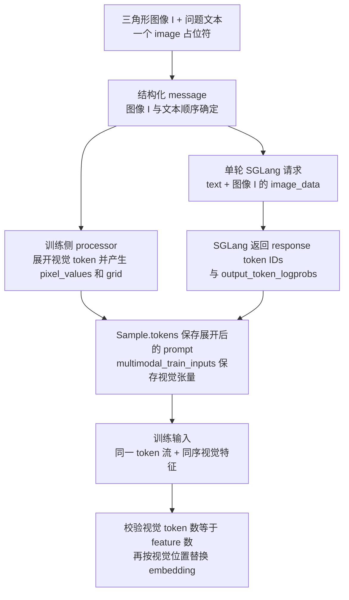
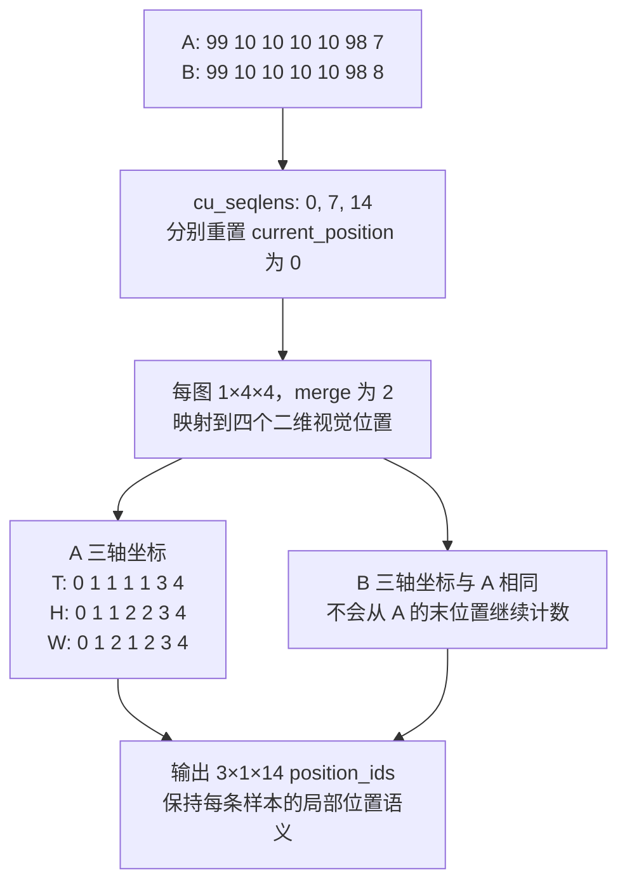

# slime 多模态路径：让图像、视觉 token 与训练特征保持同一顺序

> **源码基线**：`THUDM/slime@681b3adca54105d5ecd3fb822fa0dc58a427e0f9`（`main`，2026-08-12）
> **主题**：跟踪数据集中的图像进入 Sample、SGLang 请求和 Megatron 训练的两条表示路径，再解释 Qwen3.5-VL 的视觉特征注入与 packed 位置编码。
> **适用范围**：默认单轮图像 rollout、geo3k 多轮示例及 Qwen3.5-VL 原生模型；不把字段存在推断为任意音频、视频或模型均可训练。
> **最近更新**：2026-09-10。新增多模态规范归属页，按冻结源码核实数据、模型和示例边界。

多模态训练的关键不是让 `Sample` 多携带一张图，而是保证推理看到的图、token 流中的视觉位置、训练注入的特征三者对应。slime 保存原始媒体与处理后训练张量两种表示：推理可按自身 processor 展开图像，训练则沿既有 train dict 携带视觉张量。这样的分工复用普通 RL 主循环，但要求两边的模板、processor 与视觉 token 布局一致；只传文本或只传图片都不能建立这个对应关系。

## 1. 先看一条普通图像样本

用一条示意 JSONL 记录说明字段如何衔接；实际 geo3k 脚本读取 Parquet，二者都经 `slime/utils/data.py::read_file` 进入 `Dataset`。

```json
{"problem":"<image>图中角 A 是多少度？","images":["/data/triangle.png"],"answer":"60"}
```

与之对应的参数片段是：

```bash
--input-key problem
--label-key answer
--multimodal-keys '{"image":"images"}'
--apply-chat-template
```

`_build_messages` 把 problem 包成 user message，将 `<image>` 按出现顺序换成 `images` 列表里的媒体项，再保留文本片段。图像少于占位符、或消费完占位符后还有图像剩余，均有断言；已经是 list-of-content 的 message 则告警并跳过字符串替换。因此“数据列有 images”不等于“模型已经收到图像”，占位符和内容结构仍须正确。

`Dataset` 先保留结构化 message 给 `process_vision_info` 提取媒体，再按 `apply_chat_template` 生成 `Sample.prompt`。默认请求的 CI 分支要求 prompt 为字符串。`load_processor` 尝试 HF `AutoProcessor`，对返回 tokenizer 或不合格 processor 的情况再尝试 GLM-4V fallback；它可以最终返回 `None`，并非所有 checkpoint 都有可用视觉 processor。

## 2. 为什么保留原始图像和训练张量两份表示

| Sample 字段 | 保存什么 | 默认路径中的用途 |
|---|---|---|
| `multimodal_inputs` | 原始图像/视频等媒体容器 | processor 输入；默认图像请求编码成 `image_data` |
| `multimodal_train_inputs` | processor 输出中的视觉 tensor，如 `pixel_values`、`image_grid_thw` | converter → DP 数据 → GPU → model forward |
| `multimodal_train_input_id` | 可选字符串标识 | 本基线默认上述链路没有消费它，不能据此承诺自动缓存去重 |
| `tokens` | 展开后的 prompt ids 与追加的 response ids | 训练序列、response 边界及视觉位置的对应依据 |

**设计分析**：若仅保存原始图像，每次训练还要重做 processor，并把其版本和预处理误差带入训练消费时点；若只保存训练 tensor，推理端又未必接受同一私有特征格式。现有分工分别满足 SGLang 的媒体输入接口与 Megatron 模型的 tensor 参数接口，代价是媒体编码、processor 计算和训练数据传输都仍存在。

`build_processor_kwargs` 让文本 `input_ids` 保持列表形式，媒体输出请求 PyTorch tensor。`process_vision_info` 优先调用 `qwen_vl_utils` 并传入 processor 的 patch size，失败后回退到通用图像提取；通用 fallback 返回 `videos=None`，没有自动补齐音频/视频的任意处理能力。外部 processor 和 vision kernel 的内部数值实现不属于本页已核实的源码范围。

## 3. 单轮 rollout：两条表示在 Sample 处汇合

`sglang_rollout.py::_prepare_prompt_ids` 先检查是否已有 tokens：只有同时存在处理后训练输入，或根本没有原始多模态内容时，才直接复用。否则在有 processor 和媒体的条件下重新处理 prompt，取 `input_ids[0]`，并把除 `input_ids/attention_mask` 外的输出保存为 `multimodal_train_inputs`。这是为了避免只缓存了文本 token、却没有图像特征时误判为准备完成。

图 1 以第 1 节同一张三角形图为输入，展示两条表示路径及它们必须一致的接点。



这里的关键区别是：`generate` 在有 images 时发送 **`text=sample.prompt` 加 `image_data`**，让 SGLang 自己展开视觉占位符；没有 images 才发送 `input_ids=prompt_ids`。图片经 `encode_image_for_rollout_engine` 转 RGB、编码 PNG data URI。训练侧保存的是本地 processor 生成的 prompt ids，响应 token 则取 `meta_info.output_token_logprobs` 中的 token id，随后由 `Sample.append_response_tokens` 追加。因此图 1 的两个 processor 路径必须使用兼容配置；HTTP 成功不能证明两边视觉展开长度已经对齐。

默认 helper 的图像分支没有因为 `sample.tokens` 已有历史就改为发送整段历史 token ids，不能直接据通用 partial 机制推导任意图像续跑都正确。交互式多轮示例显式维护历史，并且拒绝 `partial_rollout`，见第 6 节。通用 Sample 状态/身份归 [[12_slime_sample_datasource_analysis]]，并发、abort 和组回收归 [[13_slime_sglang_rollout_engine_analysis]]。

## 4. 从 train dict 到视觉 embedding：保顺序比有字段更重要

`RolloutManager._convert_samples_to_train_data` 在任一 Sample 有视觉训练输入时，保留整批 `multimodal_train_inputs` 列表，包括纯文本条目的 `None`。DP 分发按同一样本索引取条目，tensorize 把 tensor/NumPy 载荷变为 CPU tensor；actor 再把其中的 tensor 搬到 GPU。`megatron_utils/data.py::get_batch` 在当前 micro-batch 内按 key 沿 dim 0 拼接非空字典；`model.py` 在 logprob forward 和训练 forward 都把结果展开到 `forward_kwargs`。

假设一个 micro-batch 的样本 A 有图像特征 I，样本 B 有图像特征 J：视觉 key 按样本顺序拼成 I→J，packed tokens 也必须是 A→B；若只对 token 排序而不重排媒体条目，特征总数可能仍然相等，却会注入到错误样本。通用调度如何保持逐样本字段一起移动见 [[14_slime_megatron_training_analysis]]；这里的拼接只支持可沿第 0 维拼接的对应 tensor，不能当作任意 metadata 合并器。

Qwen3.5-VL 的 `--spec` 返回完整 model provider，构造 `Qwen3_5VLModel`：语言部分为 Megatron `GPTModel`，视觉塔由 HF 类构造，仅在 `pre_process` stage 存在，并在 TP ranks 上复制。`_load_vision_model` 显式将视觉参数标记为非 TP shard，防止 exporter 再按 TP 拼大这些权重。

在 `_inject_vision_embeddings` 中，模型先得到普通 token embeddings，再用原始 pixel/grid 调用视觉塔。它根据完整 packed ids 找到每个视觉 token 的位置，检查数量与视觉输出行数相同，建立“完整序列位置 → feature 行号”映射，再按当前 CP rank 的局部 token indices 选择对应 feature。若局部视觉 mask 与本地 ids 不同则报错。替换完成后才进行可选 SP scatter；这避免把“图像在第几个样本”误当成“图像在本 CP 分片的第几个 token”。

### 4.1 packed MRoPE 必须在每条样本重新计数

普通一维 position id 无法表达图像的时/高/宽结构；把两条样本拼在一起后继续累加，又会让第二条样本受到第一条图像尺寸影响。`build_packed_mrope_position_ids` 按 `cu_seqlens` 切开每条样本，分别从 0 构建文本和视觉三轴坐标，再写回 packed 结果。

图 2 重放仓内 `test_packed_mrope_resets_positions_for_each_sample` 的最小例子：两个长度为 7 的样本，各含 4 个视觉 token；图像 grid 为 1×4×4，spatial merge size 为 2。token 99/10/98 是测试输入中的示意 ID，并非模型真实词表常量。



图中四个视觉 token 分别获得同一时间坐标和 2×2 高宽坐标，后续文本从视觉区域后的坐标继续；第二条样本重放相同规则。模型的 `Qwen3_5MultimodalRotaryEmbedding` 再交错时/高/宽频段。源码还会拒绝 grid 不足、未消费 grid、视觉 token 数量不符或非 packed 输入；CP helper 要求每条 packed 序列长度可被 `2 * cp_size` 整除。

## 5. 权重转换也必须覆盖视觉塔

Qwen3.5 的 HF loader 对 `model.visual.*` 直接读取原名，对语言模型剥去 `language_model.` 后做 QKV/GLU 等映射；导出入口 `convert_to_hf` 对去 wrapper 后的 `model.visual.*` 直接透传，其余语言参数进入 Qwen3.5 converter。因此视觉塔既在模型中被正确构造，也必须有正确名字与 TP 属性才能随 actor 保存/发布。

仓内另有 `megatron_to_hf/qwen3_vl.py::convert_qwen3vl_to_hf`，能把 `vision_model.*` 转为 `model.visual.*` 并映射语言权重，但 HF 导入 registry 没有 `qwen3_vl` 键。它与 Qwen3.5-VL 路径不能混称为同一支持范围。逐模型导入/导出矩阵由 [[23_slime_model_architecture_extension_analysis]] 统一维护。

## 6. 两个 geo3k 示例改变了什么

| 项目 | 单轮 `examples/geo3k_vlm/run_geo3k_qwen35.sh` | 多轮 `examples/geo3k_vlm_multi_turn/run_geo3k_vlm_multi_turn.py` |
|---|---|---|
| 输入 | `problem` / `answer`，`{"image":"images"}`，chat template | 相同键约定，使用 processed 数据集 |
| batch | 64 prompts × 8 samples，global batch 512 | 相同 batch 数 |
| 生成 | 默认 helper，temperature 0.8，response 上限 4096 | 自定义 generate，temperature 1，累计 budget 4096 |
| 奖励 | `--rm-type deepscaler` | `--rm-type math` 与交互环境 |
| GPU/并行 | 默认 8 GPU，TP2/EP8/PP1/CP1，micro-batch 1，共置 | 默认 8 GPU，TP2/EP 为 GPU 数，PP1/CP1，micro-batch 1，共置 |
| 推理配置 | mem fraction 0.7，另启用 EAGLE | mem fraction 0.6，自定义多轮 history；未启用该组 EAGLE 参数 |
| eval | 每 20 rollout 评估，单 prompt 一次采样 | 示例 eval 参数被注释 |

多轮替换的具体配置是：

```bash
--custom-generate-function-path examples.geo3k_vlm_multi_turn.rollout.generate
--custom-config-path examples/geo3k_vlm_multi_turn/geo3k_vlm_multi_turn_config.yaml
```

```yaml
max_turns: 3
rollout_interaction_env_path: examples.geo3k_vlm_multi_turn.env_geo3k
```

该示例的设计意图是每轮发送累计 `sample.tokens` 与累计图像；模型回答以 trainable span 追加，环境观测以非 trainable span 追加，后者也消耗 context budget。新观测的视觉张量先暂存在列表，最终 `_merge_multimodal_train_inputs` 每 key 只 concat 一次，避免每轮反复复制已经累积的所有 tensor；非 tensor 字段被忽略。`finally` 尝试关闭环境，`partial_rollout` 则在入口直接断言不支持。这个示例说明多轮需要同时维护 token、mask、媒体与训练特征，不能只在普通 helper 外多写一个循环。

> [!contradiction] 多轮示例在冻结基线存在实际接口冲突
> `_append_to_sample` 对非空环境 observation 传入全零 `log_probs`，同时设置 `trainable=False`；但 `Sample.append_response_tokens` 明确拒绝非 trainable tokens 带任何非 None 的 `log_probs`。因此第一次非空环境观测会抛 `ValueError`，不能把上述设计路径当成已经跑通的配方。适配层应对该分支传 `log_probs=None`，由 Sample 按非训练片段契约自行补零；本轮只记录并解释该冲突，没有修改 slime 示例代码。

## 7. 验证边界与源码阅读路线

最小核验应先用单图单样本对账占位符、展开后的视觉 token 数和 feature 数，再用两条不同图像样本检查 packing 顺序，最后检查 CP/SP 与在线权重更新。既有 `tests/test_qwen3_5_vl_native.py` 覆盖 packed MRoPE 重置、unused grid 失败、CP 双端索引、QKV 往返和视觉原名加载；这些 CPU 级断言不等价于真实视觉塔与 SGLang 的端到端数值一致。本轮文档核验未运行 GPU 训练或推理。

| 阅读目的 | 固定基线源码锚点 |
|---|---|
| 记录 → Sample | `slime/utils/data.py::{_build_messages,Dataset}`；`slime/utils/types.py::{Sample,MultimodalTypes}` |
| 媒体处理 | `slime/utils/processing_utils.py::{load_processor,process_vision_info,build_processor_kwargs,encode_image_for_rollout_engine}` |
| 单轮双表示 | `slime/rollout/sglang_rollout.py::{_prepare_prompt_ids,generate}` |
| 训练传输与拼接 | `slime/ray/rollout.py::{_tensorize_rollout_data_for_training,RolloutManager._convert_samples_to_train_data,RolloutManager._split_train_data_by_dp}`；`slime/backends/megatron_utils/data.py::get_batch` |
| 模型/视觉注入 | `slime_plugins/models/qwen3_5_vl.py::{get_qwen3_5_vl_model_provider,Qwen3_5VLModel._inject_vision_embeddings,Qwen3_5VLModel.forward}` |
| 位置/CP 对齐 | `slime_plugins/models/qwen3_5_vl_utils.py::{build_packed_mrope_position_ids,get_packed_cp_local_indices}`；`tests/test_qwen3_5_vl_native.py` |
| 多轮维护 | `examples/geo3k_vlm_multi_turn/rollout.py::{generate,_append_to_sample,_merge_multimodal_train_inputs}` |

## Related Pages

- [[12_slime_sample_datasource_analysis]] — 统一 Sample 身份、response span、mask 和 train dict 契约。
- [[13_slime_sglang_rollout_engine_analysis]] — 解释媒体请求所复用的并发生成、奖励和回收主循环。
- [[14_slime_megatron_training_analysis]] — 解释 DP 分发、packed batch、前向和训练生命周期。
- [[23_slime_model_architecture_extension_analysis]] — 维护 provider/spec 与双向转换的模型支持边界。
- [[24_slime_agent_workflow_examples_analysis]] — 对照工具/环境观测如何进入多轮轨迹和训练 mask。
- [[27_slime_evaluation_path_analysis]] — 解释单轮示例所配置的评估数据与调度入口。
