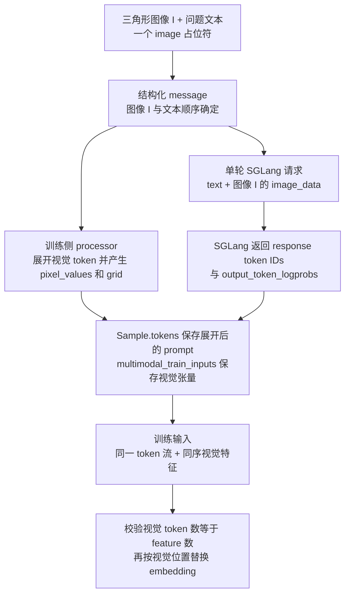
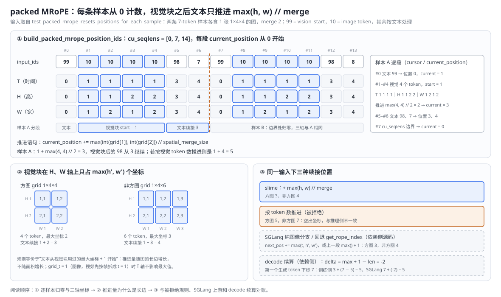
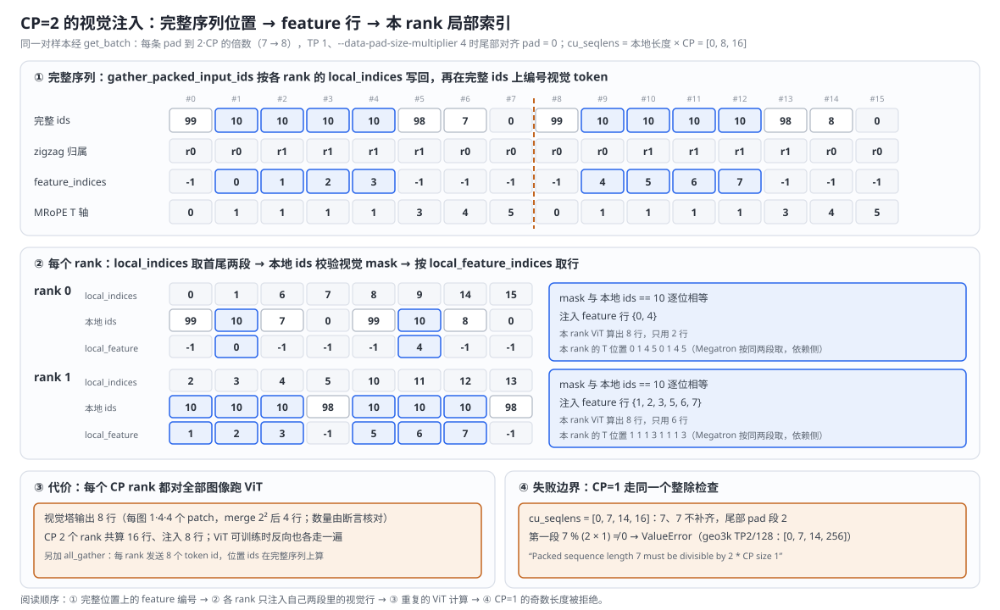

# slime 多模态路径：让图像、视觉 token 与训练特征保持同一顺序

> **源码基线**：`THUDM/slime@4c193f1f37509cca70f0e88807a9305b70f63f4e`（`main`，2026-09-03）
> **源码基线**：`NVIDIA/Megatron-LM@1dcf0dafa884ad52ffb243625717a3471643e087`（slime `docker/Dockerfile` 的 `MEGATRON_COMMIT`，2026-02-14）
> **源码基线**：`sgl-project/sglang@0b3bb0cbe31873994c9f989fddfe2f87ca839fdd`（`v0.5.15.post1`，2026-07-13）
> **主题**：先跟踪一条图像记录进入 Sample、SGLang 请求和训练 train dict 的两种表示，以及 EPD 部署里 slime 负责的启动顺序；再讲 Qwen3.5-VL 的 packed MRoPE 位置规则和 CP 下的视觉特征注入。之后是视觉塔的权重转换、两个 geo3k 示例、成本账与验证边界。
> **适用范围**：默认单轮图像 rollout、geo3k 多轮示例与 Qwen3.5-VL 原生模型；通用 Sample 契约见 [[12_slime_sample_datasource_analysis|Sample 与数据源]]，逐模型 spec 与双向转换矩阵见 [[23_slime_model_architecture_extension_analysis|模型架构扩展]]，encoder worker 类型与外部 engine 发现见 [[19_slime_rollout_backend_extension_analysis|rollout 后端扩展]]。
> **最近更新**：2026-09-17。页面现在覆盖 MRoPE 推进规则的推导、CP 视觉注入的逐 rank 重放、EPD 启动顺序、多模态成本账和 CP=1 的整除边界。

多模态训练的关键不是让 `Sample` 多带一张图，而是让三样东西对应上：推理看到的图、token 流里的视觉位置、训练时注入的特征。slime 为此保存两种表示：原始媒体交给 SGLang 按自己的 processor 展开，处理后的视觉张量沿既有 train dict 送进 Megatron。这样可以复用普通 RL 主循环，但要求两边的模板、processor 与视觉 token 布局一致；只传文本或只传图片都建立不了这种对应。

这套分工的收益是 rollout、打分、DP 分发和训练入口都不必为多模态另写一套。代价落在重复的视觉计算上：rollout 侧每个样本各跑一次 processor，SGLang 再编码一次，训练侧每个 TP rank、每个 CP rank 还要各自跑一遍完整视觉塔，详见第 7 节的成本账。约束主要有三条：两侧的视觉 token 展开和位置规则必须一致；Qwen3.5-VL 原生模型只接受 packed 输入；当前基线下 CP=1 会拒绝奇数长度的 packed 序列（第 4.2 节）。

## 1. 先看一条普通图像样本

用一条示意 JSONL 记录说明字段如何衔接；实际 geo3k 脚本读取 Parquet，二者都经 `slime/utils/data.py::read_file` 进入 `Dataset`。

```json
{"problem":"<image>图中角 A 是多少度？","images":["/data/triangle.png"],"answer":"60"}
```

与之对应的参数片段是：

```bash
--input-key problem
--label-key answer
--multimodal-keys '{"image":"images"}'
--apply-chat-template
```

`_build_messages` 把 problem 包成 user message，将 `<image>` 按出现顺序换成 `images` 列表里的媒体项，再保留文本片段。占位符多于图像、或替换完还有图像剩余，都会触发断言；已经是 list-of-content 的 message 则告警并跳过字符串替换。因此“数据列有 images”不等于“模型已经收到图像”，占位符和内容结构仍须正确。占位符名单来自 `MultimodalTypes`（image、video、audio），登记了名字不等于默认训练路径支持该模态。

`Dataset` 先保留结构化 message 给 `process_vision_info` 提取媒体，再按 `apply_chat_template` 生成 `Sample.prompt`。这一步在构造数据集时对每条记录都执行，所以整个数据集的图像在 `RolloutDataSource` 初始化时就被读入内存；`get_samples` 再为每个 prompt 的 `n_samples_per_prompt` 个样本各 `deepcopy` 一份。默认请求的 CI 分支要求 prompt 为字符串。`load_processor` 尝试 HF `AutoProcessor`，返回 tokenizer 或不合格 processor 时再尝试 GLM-4V fallback；它最终可以返回 `None`，并非所有 checkpoint 都有可用的视觉 processor。

设置 `--rollout-max-prompt-len`（或由 `--rollout-max-context-len` 派生）时，`filter_long_prompt` 会对每条多模态样本再跑一次 processor 来量长度。它把模板化之后的字符串 `sample.prompt` 传给 `process_vision_info`，而不是 message 列表；`tests/test_filter_long_prompt.py` 把 `process_vision_info` 整个替换成桩函数，只验证保序。若 `qwen_vl_utils` 对字符串抛错，slime 的回退 `_extract_images_from_messages` 会逐字符迭代并调用 `.get`，抛出 `AttributeError`，过滤直接崩溃；只有 `qwen_vl_utils` 不抛错的分支（可能返回空图、从而少算视觉 token）取决于依赖库，本页未核实。两个 geo3k 脚本都没有设置这两个参数。

## 2. 为什么保留原始图像和训练张量两份表示

| Sample 字段 | 保存什么 | 默认路径中的用途 |
|---|---|---|
| `multimodal_inputs` | 原始图像/视频等媒体容器 | processor 输入；默认图像请求编码成 `image_data` |
| `multimodal_train_inputs` | processor 输出中的视觉 tensor，如 `pixel_values`、`image_grid_thw` | converter → DP 数据 → GPU → model forward |
| `multimodal_train_input_id` | 可选字符串标识 | 基线里只有字段声明，没有任何消费方，不能据此承诺自动缓存去重 |
| `tokens` | 展开后的 prompt ids 与追加的 response ids | 训练序列、response 边界及视觉位置的对应依据 |

**设计分析**：若只保存原始图像，训练时还要重做 processor，把 processor 版本和预处理误差带到训练消费的时点；若只保存训练 tensor，推理端又未必接受同一份私有特征格式。现有分工分别满足 SGLang 的媒体输入接口与 Megatron 模型的 tensor 参数接口，判据是两端各自的输入契约；代价是媒体编码、processor 计算和训练数据传输都仍然存在。

`build_processor_kwargs` 让文本 `input_ids` 保持列表形式，媒体输出请求 PyTorch tensor，并关掉 `return_mm_token_type_ids`。训练 forward 会把 `multimodal_train_inputs` 的所有键原样展开成模型参数，`Qwen3_5VLModel.forward` 再把不认识的键经 `**kwargs` 交给 Megatron `GPTModel`，所以 processor 多返回一个键就可能在训练时变成意外参数（分析判断）。`process_vision_info` 优先调用 `qwen_vl_utils` 并传入 processor 的 patch size，失败后回退到通用图像提取；通用 fallback 返回 `videos=None`，不会自动补齐音频/视频处理能力。外部 processor 和视觉 kernel 的内部数值实现不在本页核实范围内。

## 3. 单轮 rollout：两条表示在 Sample 处汇合

`slime/rollout/sglang_rollout.py::_prepare_prompt_ids` 先检查是否已有 tokens：只有同时存在处理后训练输入，或根本没有原始多模态内容时，才直接复用。否则在有 processor 和媒体的条件下重新处理 prompt，取 `input_ids[0]`，并把除 `input_ids/attention_mask` 外的输出保存为 `multimodal_train_inputs`。这样可以避免“只缓存了文本 token、没有图像特征”被误判为准备完成。

图 1 以第 1 节同一张三角形图为输入，展示两条表示路径和它们必须一致的接点。


```mermaid
flowchart TD
    A["三角形图像 I + 问题文本<br/>一个 image 占位符"] --> B["结构化 message<br/>图像 I 与文本顺序确定"]
    B --> C["训练侧 processor<br/>展开视觉 token 并产生 pixel_values 和 grid"]
    B --> D["单轮 SGLang 请求<br/>text + 图像 I 的 image_data"]
    C --> E["Sample.tokens 保存展开后的 prompt<br/>multimodal_train_inputs 保存视觉张量"]
    D --> F["SGLang 返回 response token IDs<br/>与 output_token_logprobs"]
    F --> E
    E --> G["训练输入<br/>同一 token 流 + 同序视觉特征"]
    G --> H["校验视觉 token 数等于 feature 数<br/>再按视觉位置替换 embedding"]
```

关键区别在于：`generate` 在有 images 时发送 **`text=sample.prompt` 加 `image_data`**，让 SGLang 自己展开视觉占位符；没有 images 才发送 `input_ids=prompt_ids`。图片经 `encode_image_for_rollout_engine` 转 RGB、编码成 PNG data URI。训练侧保存的是本地 processor 生成的 prompt ids，响应 token 取 `meta_info.output_token_logprobs` 中的 token id，再由 `Sample.append_response_tokens` 追加。因此图 1 的两条 processor 路径必须使用兼容配置；HTTP 成功不能证明两边视觉展开的长度已经对齐。

**依赖边界。** slime 源码能证明的只到“发出了什么请求、拿回哪些 token”。SGLang 侧的解码、resize、视觉 token 展开和视觉编码属于依赖：上游 `QwenVLImageProcessor.process_mm_data_async` 负责加载媒体并组织 processor 输出，MRoPE 位置按三级顺序取得：先 `_get_precomputed_mrope_from_output` 读 processor 已算好的位置，没有时对纯图像请求（单轮 geo3k 即此类）走 `_compute_image_only_mrope_positions_from_offsets`，仍不成立才回退 `MRotaryEmbedding.get_rope_index`（`compute_mrope_positions` 只是 `Scheduler._maybe_compute_mrope_positions` 在位置缺失时的兜底）；slime 镜像的 `docker/patch/latest/sglang.patch` 把该函数里的 `load_mm_data` 改回 `legacy_load_mm_data`（`docker/Dockerfile` 在 `ENABLE_SGLANG_PATCH=1` 时应用）。本页只读了这些入口和第 4.1 节用到的位置规则，没有逐行核对 SGLang 内部的 resize 与视觉编码。

默认 helper 的图像分支始终发送原始 `sample.prompt`，不因为 `sample.tokens` 里已有历史 response 就改发整段 token。开启 `--partial-rollout` 后，被 abort 且已有 response 的样本会回队续跑；此时 SGLang 从 prompt 重新生成，新 token 却被接在旧 response 之后，训练序列不再对应行为分布（分析判断，依据是 `generate` 的 payload 分支与 `abort` 的回收条件）。交互式多轮示例显式维护历史，并直接拒绝 `partial_rollout`，见第 6 节。通用 Sample 状态和身份见 [[12_slime_sample_datasource_analysis|Sample 与数据源]]，并发、abort 和组回收见 [[13_slime_sglang_rollout_engine_analysis|SGLang rollout 引擎]]。

### 3.1 EPD 部署：把 SGLang 侧视觉编码拆到 encoder worker

`--sglang-config` 的 server group 可以声明 `worker_type: encoder`（`ServerGroupConfig` 的合法值之一）。只要某个模型带 encoder 组，`start_rollout_servers` 就改走 `slime/backends/sglang_utils/disaggregation.py::start_epd_server_groups`，启动顺序分两步：

1. 先只启动 encoder 组，`ray.get` 等它们初始化完成，再逐个取 URL。encoder engine 以 `encoder_only=True` 启动（`slime/backends/sglang_utils/sglang_engine.py::_compute_server_args`），`SGLangEngine._register_to_router` 对 encoder 直接返回，不注册到 router。
2. 再启动其余组：prefill 与 regular 组的 overrides 里注入 `language_only=True` 与收集到的 `encoder_urls`；decode 组不注入。LLM engine 初始化时因此已经拿到远程编码目标。

`tests/utils/test_sglang_config.py::TestZeroGpuRolloutConfig::test_start_rollout_servers_waits_for_epd_encoder_before_non_encoder` 锁住了这个顺序和注入字段。slime 这一侧的请求形状不变，仍然是 `text + image_data` 发给 router；language-only engine 如何向 encoder 取视觉嵌入属于 SGLang 上游契约，本页没有读其实现。EPD 移动的只是 SGLang 侧的视觉编码，训练侧 ViT 的开销（第 7 节）不受影响。`RolloutServer.engines` 汇总所有组，包括 encoder；视觉塔被训练更新后，encoder-only engine 怎样接收新权重，本页没有逐路径核对，权重推送面见 [[16_slime_weight_sync_analysis|权重同步]]。GPU 偏移与端口分配见 [[11_slime_ray_control_plane_analysis|Ray 控制面]]，external 模式下 `encoder_only` 的推断与“外部 EPD 需自行编排”见 [[19_slime_rollout_backend_extension_analysis|rollout 后端扩展]]。

## 4. 从 train dict 到视觉 embedding：保顺序比有字段更重要

`RolloutManager._convert_samples_to_train_data` 只要任一 Sample 有视觉训练输入，就保留整批 `multimodal_train_inputs` 列表，包括纯文本条目的 `None`。`_split_train_data_by_dp` 按同一个样本索引取条目，`slime/observability/rollout_data_utils.py::tensorize_rollout_data_for_training` 把 tensor/NumPy 载荷变成 CPU tensor；`MegatronTrainRayActor._get_rollout_data` 再把本 DP 分区所有视觉 tensor 提前搬到 GPU。CP rank 按不含 CP 的 DP rank 取数据，所以同一 DP 组里的每个 CP rank 拿到的是同一份分区。`slime/backends/megatron_utils/data.py::get_batch` 在当前 micro-batch 内按 key 沿 dim 0 拼接非空字典；`slime/backends/megatron_utils/model.py` 的 `forward_only` 与 `train_one_step` 两个 `forward_step` 都把结果展开进 `forward_kwargs`。

假设一个 micro-batch 里样本 A 有图像特征 I，样本 B 有图像特征 J：视觉 key 按样本顺序拼成 I→J，packed tokens 也必须是 A→B。若只对 token 排序而不重排媒体条目，特征总数可能仍然相等，却会注入到错误的样本。通用调度怎样让逐样本字段一起移动见 [[14_slime_megatron_training_analysis|Megatron 训练]]；这里的拼接只支持能沿第 0 维拼接的对应 tensor，不能当作任意 metadata 合并器。

Qwen3.5-VL 的 `--spec` 返回的是完整 model provider：`scripts/models/qwen3.5-35B-A3B-vl.sh` 复用语言模型参数，只把 spec 换成 `slime_plugins.models.qwen3_5_vl get_qwen3_5_vl_model_provider`，`slime/backends/megatron_utils/model_provider.py::_get_model_provider_func` 识别到返回值带 `pre_process` 参数后直接用它构造模型。`Qwen3_5VLModel` 的语言部分是 Megatron `GPTModel`，视觉塔由 HF 类构造，只在 `pre_process` stage 存在，并在每个 TP rank 上各有一份完整副本。`_load_vision_model` 把视觉参数显式标为非 TP shard，防止 exporter 再按 TP 拼大这些权重。TP 副本之间没有额外的同步代码；它们保持一致依赖于各 TP rank 输入相同、Megatron TP 通信让 embedding 梯度在各 rank 相同（分析判断，属于 Megatron TP 的依赖侧契约）。

`Qwen3_5VLModel.forward` 的顺序是：`gather_packed_input_ids` 在 CP 组上 all_gather 本地 ids、重建完整 packed 序列 → 在 `pre_process` stage 调 `_inject_vision_embeddings` 得到 `decoder_input` → 在完整序列上调 `build_packed_mrope_position_ids` → 把 `decoder_input` 与位置交给 `GPTModel`。下面两小节分别重放位置规则和注入索引。

### 4.1 packed MRoPE：逐样本归零，视觉块之后只推进长边

普通一维 position id 表达不了图像的时/高/宽结构；把两条样本拼在一起后继续累加，又会让第二条样本受第一条图像尺寸影响。`build_packed_mrope_position_ids` 按 `cu_seqlens` 切开每条样本，每段 `current_position` 从 0 开始，分别构建文本和视觉的三轴坐标，再写回 packed 结果。

在一条样本内部，它交替处理文本段和视觉块。文本段三轴取同一组递增值；遇到视觉块，`_vision_positions` 以当前位置 $s$ 为起点，把 merge 之后的网格铺成三轴坐标，然后执行这一句：

```python
current_position += max(int(grid[1]), int(grid[2])) // spatial_merge_size
```

这条规则的含义是“下一段文本从视觉块用过的最大坐标 + 1 开始”。设 merge 系数为 $m$，merge 之后网格为 $(t, h', w')$，其中 $h'=\lfloor h/m\rfloor$、$w'=\lfloor w/m\rfloor$。视觉块三轴坐标的范围与下一段文本的起点是：

$$
\begin{aligned}
T &\in [s,\ s+t-1],\qquad H \in [s,\ s+h'-1],\qquad W \in [s,\ s+w'-1],\\
p_{\mathrm{next}} &= \max(T \cup H \cup W) + 1 = s + \max(t,\ h',\ w').
\end{aligned}
$$

向下取整单调，所以 $\lfloor \max(h,w)/m\rfloor = \max(h', w')$，源码写法等于 $s+\max(h',w')$。两者在 $t \le \max(h',w')$ 时相等：图像的 $t=1$，视频 grid 在函数开头被 `repeat_interleave` 按帧拆成 $t=1$，所以这个条件总是成立。推进量随图像的长边增长，不随视觉 token 数（面积）增长。

图 2 重放仓内 `test_packed_mrope_resets_positions_for_each_sample` 的最小例子：两条长度为 7 的样本，各含 4 个视觉 token；图像 grid 为 1×4×4，spatial merge size 为 2。token 99/10/98 是测试里的示意 ID（99 是 vision_start，10 是 image token，98 在函数里按普通文本处理），不是模型真实词表常量。



样本 A 的走法如下：`#0` 的 99 是文本，位置 0，`current_position` 变为 1；`#1–#4` 是视觉块，起点 $s=1$，merge 之后 $h'=w'=2$，T 轴全为 1，H 轴为 1 1 2 2，W 轴为 1 2 1 2；推进 `max(4, 4) // 2 = 2`，`current_position` 变为 3；`#5–#6` 的 98、7 落在 3、4。所以视觉块后的文本从 3 而不是 5 继续。若按视觉 token 数推进，会得到 $1+4=5$，坐标 3、4 被空出来。样本 B 在 `cu_seqlens` 边界处归零，三轴与 A 完全相同。换成 1×4×6 的非方图，merge 后是 2×3 共 6 个 token，文本从 $1+3=4$ 继续，按 token 数推进则会得到 7。

为什么必须是这条规则：训练侧重算的 logprob 要和 rollout 时 SGLang 的行为分布对应，位置编码就得与推理侧一致。SGLang `v0.5.15.post1` 对单轮 geo3k 这类纯图像请求用 `QwenVLImageProcessor._compute_image_only_mrope_positions_from_offsets`，视觉块之后执行 `next_pos += max(llm_grid_t, llm_grid_h, llm_grid_w)`，与 slime 同一条规则；它的回退 `python/sglang/srt/layers/rotary_embedding/mrope_rope_index.py::get_rope_index` 在 `qwen3_5` 分支里对每一段取 `st_idx = llm_pos_ids_list[-1].max() + 1`，也就是上一段最大坐标加一。两者在本例都得到 3（方图）和 4（非方图）；slime 的 SGLang 补丁不改这两处。decode 阶段 SGLang 用 `mrope_position_delta = max + 1 − len` 续算：普通 decode 走 `ForwardBatch._compute_mrope_positions` → `_expand_mrope_from_input`；开启投机解码时（单轮 geo3k 启用了 EAGLE），`ForwardBatch.init_new` 改走 `compute_spec_mrope_positions`，同样是 `seq_positions + mrope_position_delta`。`_compute_mrope_positions` 里另有一个 `rl_on_policy_target` 非空时退化为 `seq_len − 1` 的分支，spec 路径没有这个分支；slime 默认不设该字段。本例 delta 为 −2，第一个生成 token 的下标 7 得到位置 $7-2=5$；训练侧 `build_packed_mrope_position_ids` 把 response 当作尾部文本继续 arange，得到 $3+(7-5)=5$，两边一致。按 token 数推进的规则会在所有视觉块之后与推理侧错开，这就是它被拒绝的判据。以上 SGLang 侧只是读了位置计算函数，属于依赖侧源码对照，不是 slime 源码能证明的执行结果。

模型里的 `Qwen3_5MultimodalRotaryEmbedding` 再把时/高/宽频段交错排列：以 T 轴频率为底，H 轴占第 1、4、7…个频率位（小于 $3\cdot$`mrope_section[1]`），W 轴占第 2、5、8…个。slime 需要自带这个子类，是因为镜像钉的 `Megatron-LM@1dcf0daf` 没有交错布局；Megatron 后来加入了 `mrope_interleaved` 配置，[[10_megatron_model_structure_analysis|Megatron 模型结构]]描述的就是这个更新版本（该页基线 `85902ef5`，晚于 slime 的钉版）。源码还会拒绝以下输入：grid 不够或视觉 token 数与 grid 不符（`tokens and vision grids do not match`、`vision token count does not match its grid`）、有未消费的 grid（`test_packed_mrope_rejects_unused_grids`）、batch 维不为 1，以及不带 `packed_seq_params` 的非 packed 输入。

### 4.2 CP 下的视觉注入：完整位置 → feature 行 → 本 rank 局部索引

`_inject_vision_embeddings` 先得到普通 token embeddings，再用本 micro-batch 的全部 `pixel_values` 和 grid 调用视觉塔。然后分四步：在完整 packed ids 里找到每个视觉 token 的位置，检查数量等于视觉输出行数；建立“完整序列位置 → feature 行号”的映射 `feature_indices`（非视觉位置为 −1）；用 `get_packed_cp_local_indices` 算出本 CP rank 持有的完整位置，取出 `local_feature_indices`；要求其中 ≥0 的位置与本地 `input_ids == image_token_id` 逐位相等，否则报 `CP token layout does not match`，相等才把对应行写进 embeddings。替换完成后才做可选的 SP scatter。这样不会把“图像在第几个样本”误当成“图像在本 CP 分片的第几个 token”。

图 3 用同一对样本重放 CP=2。`get_batch` 的非 allgather 分支先用 `slime/backends/megatron_utils/cp_utils.py::slice_with_cp` 把每条样本 pad 到 $2\cdot\mathrm{CP}$ 的倍数（7 → 8），按 zigzag 取第 $r$ 段和第 $2\cdot\mathrm{CP}-r-1$ 段；这里取 TP=1、`--data-pad-size-multiplier 4`，尾部对齐 pad 为 0，`cu_seqlens` 为本地长度乘 CP，即 `[0, 8, 16]`。



完整 ids 为 `[99, 10, 10, 10, 10, 98, 7, 0, 99, 10, 10, 10, 10, 98, 8, 0]`，8 个视觉 token 在完整位置 1–4 和 9–12，`feature_indices` 依次编号 0–7。rank 0 的 `local_indices` 是 `[0, 1, 6, 7, 8, 9, 14, 15]`，本地 ids 为 `[99, 10, 7, 0, 99, 10, 8, 0]`，只注入 feature 行 0 与 4；rank 1 的 `local_indices` 是 `[2, 3, 4, 5, 10, 11, 12, 13]`，注入行 1、2、3、5、6、7。两个 rank 的视觉塔各自算完全部 8 行（每图 $1\cdot4\cdot4/2^2=4$ 行），共算 16 行、注入 8 行。这两组索引与 `test_thd_cp_indices_select_two_chunks_per_packed_sequence` 的断言一致。

位置编码走另一条交接。slime 在完整序列上算出 $3\times1\times16$ 的位置，交给 Megatron 时不预先按 CP 切：`docker/patch/latest/megatron.patch` 给 `MultimodalRotaryEmbedding.forward` 加了 `packed_seq` 参数，并让 `GPTModel._preprocess` 在 THD 格式下传 `packed_seq=True`，slime 的子类据此跳过 `get_pos_emb_on_this_cp_rank`。上游 `Megatron-LM@1dcf0daf` 的 `megatron/core/models/common/embeddings/rope_utils.py::_apply_rotary_pos_emb_thd` 在频率长度等于 `cu_seqlens[-1]` 时，按每条序列的起点用 `_get_thd_freqs_on_this_cp_rank` 取同样的首尾两段，所以 rank 0 拿到的 T 位置是 0 1 4 5 0 1 4 5。没有这处补丁时，位置会先被整体切一次，这条“完整长度”分支就对不上（分析判断）。Megatron 侧 zigzag 切分和 CP 通信的完整讲解见 [[13_megatron_cp_analysis|Megatron 上下文并行]]；该页基线 `85902ef5` 晚于 slime 钉的 `1dcf0daf`，本节引用的两个 rope 函数已在 `1dcf0daf` 上核对。

> [!contradiction] CP=1 时奇数长度的 packed 序列会被整除检查拒绝
> `_inject_vision_embeddings` 在进入图像循环之前，无条件调用 `get_packed_cp_local_indices(cu_seqlens, cp_size, cp_rank)`；CP=1 时 `cp_size` 取 1，函数仍要求每段长度能被 $2\cdot1=2$ 整除。而 CP=1 时 `slice_with_cp` 直接返回原序列，不做补齐，`cu_seqlens` 就是样本的原始长度加尾部对齐 pad。于是只要 micro-batch 里有一条奇数长度的样本，训练与 logprob forward 都会抛出 `ValueError: Packed sequence length 7 must be divisible by 2 * CP size 1`（两条 7-token 样本在 TP1、`--data-pad-size-multiplier 4` 下 `cu_seqlens = [0, 7, 14, 16]`，在 geo3k 的 TP2、默认 multiplier 128 下为 `[0, 7, 14, 256]`；两种情况都在第一段 7 处报错）。纯文本 micro-batch 同样会走到这里。两个 geo3k 示例都用 `--context-parallel-size 1`。这个结论来自静态读码，并按 `4c193f1f` 的函数原文在 CPU 上复算了该函数；没有在 GPU 上运行示例。仓内测试只覆盖了 CP=2、偶数长度的情形，CI 也没有 VLM 端到端训练。
> 这与 `examples/geo3k_vlm/README.md` 的说法冲突：README 写 “The native path supports tensor, pipeline, context, sequence, and expert parallelism”，并称 “we use the default math RM”；脚本实际用 `--rm-type deepscaler`，并且在 CP=1 下会拒绝奇数长度，以源码为准。README 里的奖励曲线 `fsdp_vs_megatron.png` 最后一次提交在 2025-12-18，早于原生路径引入（`f655e13d`，2026-08-04），不能作为原生路径可运行的证据。

## 5. 权重转换也必须覆盖视觉塔

Qwen3.5 的 HF loader（`slime/backends/megatron_utils/hf_to_megatron/qwen3_5.py::qwen3_5_hf_tensor`）对 `model.visual.*` 直接按原名读取，对语言模型剥去 `language_model.` 后做 QKV/GLU 等映射；导出入口 `slime/backends/megatron_utils/megatron_to_hf/__init__.py::convert_to_hf` 对去掉 wrapper 后的 `model.visual.*` 直接透传，其余语言参数进入 Qwen3.5 converter。因此视觉塔既要在模型里被正确构造，也必须有正确的名字与 TP 属性，才能随 actor 保存和发布。`test_raw_loader_uses_hf_vision_name_directly` 与 `test_raw_qkv_loader_is_inverse_of_exporter` 分别锁住视觉原名加载和 QKV 往返。

仓内另有 `slime/backends/megatron_utils/megatron_to_hf/qwen3_vl.py::convert_qwen3vl_to_hf`，能把 `vision_model.*` 转为 `model.visual.*` 并映射语言权重，但 HF 导入表 `slime/backends/megatron_utils/hf_to_megatron/__init__.py::_LOADERS` 没有 `qwen3_vl` 键（有 `qwen3_5` 与 `qwen3_5_moe`）。它与 Qwen3.5-VL 路径不能混称为同一支持范围。逐模型的导入/导出矩阵由 [[23_slime_model_architecture_extension_analysis|模型架构扩展]]统一维护。

## 6. 两个 geo3k 示例改变了什么

| 项目 | 单轮 `examples/geo3k_vlm/run_geo3k_qwen35.sh` | 多轮 `examples/geo3k_vlm_multi_turn/run_geo3k_vlm_multi_turn.py` |
|---|---|---|
| 入口 | `ray job submit … python3 train.py` | `execute_train`，默认 `train_script="train.py"`，模型类型 `qwen3.5-35B-A3B-vl` |
| 输入 | `problem` / `answer`，`{"image":"images"}`，chat template | 相同键约定，使用 processed 数据集 |
| batch | 64 prompts × 8 samples，global batch 512 | 相同 |
| 生成 | 默认 helper，temperature 0.8，`--rollout-max-response-len 4096` | 自定义 generate，temperature 1，同样 `--rollout-max-response-len 4096`，多轮共用一个 budget（见下） |
| 奖励 | `--rm-type deepscaler` | `--rm-type math` 与交互环境 |
| GPU/并行 | 默认 8 GPU，TP2（开 SP）/EP8/PP1/CP1，micro-batch 1，共置 | 默认 8 GPU，TP2（开 SP）/EP 为 GPU 数，PP1/CP1，micro-batch 1，共置 |
| 推理配置 | mem fraction 0.7，另启用 EAGLE（2 步、topk 1、3 个 draft token） | mem fraction 0.6，自定义多轮 history；未启用该组 EAGLE 参数 |
| eval | 每 20 rollout 评估，单 prompt 一次采样 | 示例 eval 参数被注释 |

多轮替换的具体配置是：

```bash
--custom-generate-function-path examples.geo3k_vlm_multi_turn.rollout.generate
--custom-config-path examples/geo3k_vlm_multi_turn/geo3k_vlm_multi_turn_config.yaml
```

```yaml
max_turns: 3
rollout_interaction_env_path: examples.geo3k_vlm_multi_turn.env_geo3k
```

该示例每轮发送累计的 `sample.tokens`（`input_ids`，不是 text）与累计图像；模型回答以 trainable span 追加，环境观测以非 trainable span 追加。SGLang 收到 id 列表时，`load_mm_data`/`legacy_load_mm_data` 会先 `tokenizer.decode` 回文本再切分多模态 token，已经展开的视觉 token 能否与图片重新对齐属于依赖侧行为，本页未核实。

budget 不是“累计 4096”。`_prepare_start_state` 在设置了 `--rollout-max-context-len` 时取 `rollout_max_context_len − len(sample.tokens)`，否则取 `max_new_tokens − len(sample.tokens)`；两个分支减去的都是展开视觉 token 后的 prompt 长度。geo3k 多轮脚本没有设置 context 上限，所以初始 budget 是 $4096-\ell_{\mathrm{prompt}}$。此后每轮先把剩余 budget 写入该轮的 `max_new_tokens`，再扣掉模型输出和环境观测的 token 数，降到 0 或以下就标 TRUNCATED。于是 response 与观测的总长被限制在 $4096-\ell_{\mathrm{prompt}}$ 以内，prompt 自身达到 4096 的样本会在第一轮之前直接截断。

新观测的视觉张量先暂存在列表，最后由 `_merge_multimodal_train_inputs` 每个 key 只 concat 一次，避免每轮反复复制已经累积的所有 tensor；非 tensor 字段按设计被丢弃。注意首轮输入走 `_prepare_initial_inputs`，调 processor 时没有经过 `build_processor_kwargs`（观测轮的 `_encode_observation_for_generation` 用了）；而 `_merge_multimodal_train_inputs` 只有当某个 key 在所有轮次里的值都是 `torch.Tensor` 时才保留该 key。如果 processor 默认返回的不是 `torch.Tensor`（HF 侧契约，本页未核实），首轮的非 tensor 值会让整个 key 被丢弃，连带后续观测轮的同名视觉张量一起丢失。`finally` 尝试关闭环境，`partial_rollout` 则在入口直接断言不支持。这个示例说明多轮需要同时维护 token、mask、媒体与训练特征，不能只在普通 helper 外面多套一层循环；工具与环境观测怎样进入多轮轨迹和训练 mask 的一般做法见 [[24_slime_agent_workflow_examples_analysis|Agent 工作流示例]]，单轮脚本所配评估的数据与调度入口见 [[27_slime_evaluation_path_analysis|评估路径]]。

> [!contradiction] 多轮示例与 Sample 追加接口存在冲突
> `generate` 对非空环境观测先构造 `obs_log_probs = [0.0] * len(obs_prompt_ids)`，再经 `_append_to_sample` 以 `trainable=False` 传给 `Sample.append_response_tokens`；而该方法明确拒绝非 trainable tokens 带任何非 None 的 `log_probs`（`non-trainable response tokens should not pass rollout log probabilities.`）。因此第一次非空环境观测就会抛 `ValueError`，不能把上述设计路径当成已经跑通的配方。适配层应对该分支传 `log_probs=None`，由 Sample 按非训练片段契约自行补零。叠加第 4.2 节的 CP=1 整除边界，两个 geo3k 示例在当前基线都不能视为可直接复现的配方。
> `examples/geo3k_vlm_multi_turn/README.md` 展示了奖励曲线 `geo3k_vlm_multi_turn_reward.png` 与 `rollout_experiment_result_megatron.png`，而当前基线下这条路径在第一次环境观测就抛错，以源码为准。两张图都提交于 2026-01-11，早于 `append_response_tokens` 抽取到 Sample（`b9b122c5`，2026-06-21）和原生路径引入（`f655e13d`，2026-08-04）。

## 7. 成本账

双表示分工的代价，是同一张图在 rollout、推理和训练三处被反复处理。下表按 geo3k 单轮脚本量化（64 个 prompt × 8 个样本 = 512 个样本，TP2、CP1、micro-batch 1）。这一轮只有 1 个训练 step（512/512），脚本参数满足 `MegatronTrainRayActor.train_actor` 里 `can_reuse_log_probs_in_loss` 的全部条件，不单独做 old logprob forward。

| 代价项 | 源码事实 | 量化 | 证据状态 |
|---|---|---|---|
| 数据集加载 | `Dataset.__init__` 对每条记录调 `process_vision_info`，图像常驻 `RolloutDataSource`；`get_samples` 每 prompt `deepcopy` 8 份 | 常驻整个数据集的图像；每轮每张图额外 8 份拷贝。图像何时真正读取和解码取决于 `qwen_vl_utils.process_vision_info`，回退路径的 `Image.open` 是惰性打开 | slime 源码 + 依赖侧 |
| rollout 侧 processor 与编码 | 每个样本在 `_prepare_prompt_ids` 各跑一次 HF processor，在 `generate` 各做一次 PNG + base64 编码；`RolloutManager` 是 `num_cpus: 1` 的 Ray actor，这些同步调用发生在 async 协程里 | 每轮 512 次 processor、512 次 PNG 编码，而不同的图只有 64 张；同步 CPU 工作会阻塞事件循环（分析判断） | slime 源码；阻塞影响为推断 |
| SGLang 侧再编码 | 每个请求带 data URI 图片，SGLang 自行解码、处理并跑视觉编码；EPD 只是把视觉编码挪到 encoder worker | 每轮 512 个带图请求；SGLang 是否按图缓存嵌入未核实 | 依赖侧契约 |
| 视觉张量传输与驻留 | 每个样本各带一份 `pixel_values`，没有按图去重（`multimodal_train_input_id` 无消费方）；`_get_rollout_data` 把整个 DP 分区的视觉张量提前搬上 GPU | 同一张图 8 份经 Ray 传输；DP=4 时每个 rank 平均常驻 128 个样本的 `pixel_values` | slime 源码 |
| 训练侧 ViT 副本 | `_load_vision_model` 在每个 `pre_process` rank 构造完整 HF 视觉塔，标为非 TP；slime 强制 `use_distributed_optimizer=True` | 参数和梯度每个 TP rank 一整份，是 TP 切分模块的 TP 倍；优化器状态只在 DP 组内切分（Megatron 契约，见 [[16_megatron_distributed_optimizer_analysis|分布式优化器]]） | slime 源码 + 依赖侧契约 |
| 训练侧 ViT 计算 | 每个 rank 的每次 forward 都对本 micro-batch 全部图像跑视觉塔；ViT 可训练时反向同样全量 | 按下式为 1024 次视觉塔前向，对应 64 张不同的图，重复 16 倍 | slime 源码 |
| ViT 激活 | slime 没有为视觉塔打开 gradient checkpointing（仓内无 `gradient_checkpointing` 调用）；`--recompute-*` 作用于 Megatron decoder | 视觉塔激活在 forward 与 backward 之间常驻（分析判断） | 推断 |
| CP 额外开销 | 每个 CP rank 算全部视觉行、只注入自己两段里的行；每次 forward 都 all_gather ids，并在完整序列上用 `.tolist()`/`nonzero` 构建位置 | 图 3：CP=2 共算 16 行、注入 8 行，视觉计算是实际需要的 CP 倍；每次 forward 一次主机同步（分析判断） | slime 源码；同步开销为推断 |

训练侧视觉塔前向次数可以写成：

$$
N_{\mathrm{ViT}} = N_{\mathrm{samples}} \cdot F \cdot \mathrm{TP} \cdot \mathrm{CP}
$$

其中 $F$ 是一个训练 step 里覆盖该 micro-batch 的 forward 次数：训练 forward 固定 1 次；加载了 ref（`--kl-coef` 非零或开 `--use-kl-loss`）再加 1；加载了 Megatron teacher（OPD）再加 1；不满足 logprob 复用条件、且未开 `--use-rollout-logprobs`（或开了 `--get-mismatch-metrics`）时再加 1。geo3k 单轮是 $512\cdot1\cdot2\cdot1=1024$，而不同的图只有 64 张，重复 16 倍。把 CP 从 1 提到 2 不会减少视觉塔的工作量，反而把它翻倍；CP 能切分的只是语言模型的序列激活。

合起来看，这条路径适合“图像少而小、语言序列长”的负载：语言模型可以借 TP/CP/EP 切分，视觉侧的计算和显存却按 TP×CP 复制，并且在 rollout 侧和推理侧各重复一遍。图像变大、每个 prompt 的采样数变多，或 CP 变大时，视觉侧会最先成为瓶颈。失败边界见第 4.2 节（CP=1 奇数长度）和第 6 节（多轮观测追加）。

## 8. 端到端生命周期与验证边界

一条单轮图像样本从生成到进入语言模型，主要经过下面这些节点（省略打分、DP 调度等与视觉无关的环节）：

```text
RolloutManager.generate                                    slime/ray/rollout.py
`-- sglang_rollout.generate_rollout -> generate_and_rm_group -> generate_and_rm -> generate
    |-- _prepare_prompt_ids              本地 processor：prompt ids + multimodal_train_inputs
    |-- post /generate: text + image_data SGLang 再展开并编码（依赖侧）
    `-- Sample.append_response_tokens    response token 接到本地 prompt ids 之后
RolloutManager._convert_samples_to_train_data    逐样本视觉张量列表，纯文本为 None
`-- RolloutManager._split_train_data_by_dp -> tensorize_rollout_data_for_training
MegatronTrainRayActor.train -> _get_rollout_data 本 DP 分区视觉张量搬上 GPU
`-- train_actor -> model.train -> train_one_step -> forward_step
    |-- get_batch                        micro-batch 内按 key 沿 dim 0 拼接；CP 切两段
    `-- Qwen3_5VLModel.forward
        |-- gather_packed_input_ids      CP all_gather 重建完整 ids
        |-- _inject_vision_embeddings    视觉塔 → feature 行 → 本 rank 局部索引 → SP scatter
        |-- build_packed_mrope_position_ids  完整序列上的 T/H/W 位置
        `-- GPTModel(decoder_input=...)  Megatron 1dcf0daf + megatron.patch
```

最小核验应先用单图单样本对账占位符、展开后的视觉 token 数和 feature 数，再用两条不同图像的样本检查 packing 顺序，然后检查 CP/SP 与在线权重更新；CP=1 时还要确认样本长度的奇偶。`tests/test_qwen3_5_vl_native.py` 覆盖 packed MRoPE 重置、未用完 grid 的失败、CP 双段索引、QKV 往返、视觉原名加载、MTP 专家权重读取与 SwiGLU/分组 MoE fc2 分片；`tests/test_rollout_data_utils.py` 覆盖 CPU tensor 化。这些 CPU 级断言不等价于真实视觉塔与 SGLang 端到端的数值一致，也没有覆盖 CP=1 的奇数长度。本页结论来自静态读码，没有运行 GPU 训练或推理。本页两张图由 `tools/figs/svg/slime_vlm_mrope_figures.mjs` 从源码规则的复现计算生成，`tools/figs/svg/lib/slime_vlm_mrope_figures.test.mjs` 锁住图与正文引用的数值。

## 9. 源码阅读路线

| 阅读目的 | 源码锚点（`THUDM/slime@4c193f1f`，另注依赖仓库） |
|---|---|
| 记录 → Sample | `slime/utils/data.py::{read_file,_build_messages,Dataset,filter_long_prompt}`；`slime/rollout/data_source.py::RolloutDataSource.get_samples`；`slime/utils/types.py::{Sample,Sample.append_response_tokens,MultimodalTypes}`；`tests/test_filter_long_prompt.py` |
| 媒体处理 | `slime/utils/processing_utils.py::{load_processor,process_vision_info,_extract_images_from_messages,build_processor_kwargs,encode_image_for_rollout_engine}`；`examples/geo3k_vlm/README.md`、`examples/geo3k_vlm_multi_turn/README.md` |
| 单轮双表示 | `slime/rollout/sglang_rollout.py::{GenerateState,_prepare_prompt_ids,generate,abort}` |
| EPD 启动顺序 | `slime/backends/sglang_utils/sglang_config.py::{ServerGroupConfig,ModelConfig.has_encoder_disaggregation}` → `slime/backends/sglang_utils/deployment.py::start_rollout_servers` → `slime/backends/sglang_utils/disaggregation.py::start_epd_server_groups` → `slime/backends/sglang_utils/sglang_engine.py::{_compute_server_args,SGLangEngine._register_to_router}`；`slime/backends/sglang_utils/engine_group.py::RolloutServer.engines`；`tests/utils/test_sglang_config.py::TestZeroGpuRolloutConfig::test_start_rollout_servers_waits_for_epd_encoder_before_non_encoder` |
| 训练传输与拼接 | `slime/ray/rollout.py::{RolloutManager._convert_samples_to_train_data,RolloutManager._split_train_data_by_dp}` → `slime/observability/rollout_data_utils.py::tensorize_rollout_data_for_training` → `slime/backends/megatron_utils/actor.py::{MegatronTrainRayActor._get_rollout_data,MegatronTrainRayActor.train_actor}` → `slime/backends/megatron_utils/data.py::get_batch`、`slime/backends/megatron_utils/cp_utils.py::slice_with_cp` → `slime/backends/megatron_utils/model.py::{forward_only,train_one_step}`；`tests/test_rollout_data_utils.py::test_tensorize_rollout_data_for_training_normalizes_cpu_tensors` |
| 模型构造 | `scripts/models/qwen3.5-35B-A3B-vl.sh` → `slime/backends/megatron_utils/model_provider.py::_get_model_provider_func` → `slime_plugins/models/qwen3_5_vl.py::{get_qwen3_5_vl_model_provider,_load_vision_model,Qwen3_5VLModel.__init__}`；`slime/backends/megatron_utils/arguments.py::_set_default_megatron_args` |
| 视觉注入与位置 | `slime_plugins/models/qwen3_5_vl.py::{Qwen3_5VLModel.forward,Qwen3_5VLModel._inject_vision_embeddings,Qwen3_5MultimodalRotaryEmbedding.forward}` → `slime_plugins/models/qwen3_5_vl_utils.py::{gather_packed_input_ids,get_packed_cp_local_indices,build_packed_mrope_position_ids,_vision_positions}`；`tests/test_qwen3_5_vl_native.py::{test_packed_mrope_resets_positions_for_each_sample,test_packed_mrope_rejects_unused_grids,test_thd_cp_indices_select_two_chunks_per_packed_sequence}` |
| Megatron 交接（依赖侧） | `docker/patch/latest/megatron.patch`（`MultimodalRotaryEmbedding.forward` 的 `packed_seq`、`GPTModel._preprocess`）；`NVIDIA/Megatron-LM@1dcf0daf`：`megatron/core/models/common/embeddings/rope_utils.py::{_apply_rotary_pos_emb_thd,_get_thd_freqs_on_this_cp_rank}`、`megatron/core/models/gpt/gpt_model.py::GPTModel._preprocess` |
| SGLang 对照（依赖侧） | `docker/Dockerfile`（`ENABLE_SGLANG_PATCH`）、`docker/patch/latest/sglang.patch`（`QwenVLImageProcessor.process_mm_data_async`）；`sgl-project/sglang@0b3bb0cb`：`python/sglang/srt/layers/rotary_embedding/mrope_rope_index.py::get_rope_index`、`python/sglang/srt/multimodal/processors/qwen_vl.py::QwenVLImageProcessor.{process_mm_data_async,_get_precomputed_mrope_from_output,_compute_image_only_mrope_positions_from_offsets,compute_mrope_positions}`、`python/sglang/srt/managers/scheduler.py::Scheduler._maybe_compute_mrope_positions`、`python/sglang/srt/multimodal/processors/base_processor.py::{load_mm_data,legacy_load_mm_data}`、`python/sglang/srt/model_executor/forward_batch_info.py::ForwardBatch.{init_new,compute_spec_mrope_positions,_compute_mrope_positions,_expand_mrope_from_input}` |
| 权重转换 | `slime/backends/megatron_utils/hf_to_megatron/__init__.py::_LOADERS`、`slime/backends/megatron_utils/hf_to_megatron/qwen3_5.py::qwen3_5_hf_tensor`；`slime/backends/megatron_utils/megatron_to_hf/__init__.py::convert_to_hf`、`slime/backends/megatron_utils/megatron_to_hf/qwen3_vl.py::convert_qwen3vl_to_hf`；`tests/test_qwen3_5_vl_native.py::{test_raw_loader_uses_hf_vision_name_directly,test_raw_qkv_loader_is_inverse_of_exporter}` |
| geo3k 示例 | `examples/geo3k_vlm/run_geo3k_qwen35.sh`；`examples/geo3k_vlm_multi_turn/run_geo3k_vlm_multi_turn.py`、`examples/geo3k_vlm_multi_turn/geo3k_vlm_multi_turn_config.yaml`；`examples/geo3k_vlm_multi_turn/rollout.py::{generate,_prepare_initial_inputs,_prepare_start_state,_run_inference_step,_encode_observation_for_generation,_append_to_sample,_merge_multimodal_train_inputs}` |

## Related Pages

- [[12_slime_sample_datasource_analysis]] — 统一 Sample 身份、response span、mask 和 train dict 契约，本页的两份视觉表示都挂在这些字段上。
- [[13_slime_sglang_rollout_engine_analysis]] — 媒体请求复用的并发生成、abort 和组回收主循环，含本页提到的 partial 续跑条件。
- [[14_slime_megatron_training_analysis]] — DP 分发、packed batch、前向和训练生命周期，视觉张量随这条链移动。
- [[23_slime_model_architecture_extension_analysis]] — provider/spec 与双向转换的逐模型支持边界，Qwen3.5-VL 的构造入口在那里登记。
- [[13_megatron_cp_analysis|Megatron 上下文并行]] — zigzag 切分与 CP 通信的依赖侧讲解（基线 `85902ef5`，晚于 slime 钉的 `1dcf0daf`）。
- [[02_engineering/03_infer_frameworks/sglang/index|SGLang]] — 推理侧框架入口；本页的视觉展开、MRoPE 位置与 EPD 编码都落在 SGLang 里。
- [[11_slime_ray_control_plane_analysis]] — EPD 各组的 GPU 偏移、端口与启动等待，本页只讲 encoder 先行的顺序与注入字段。
