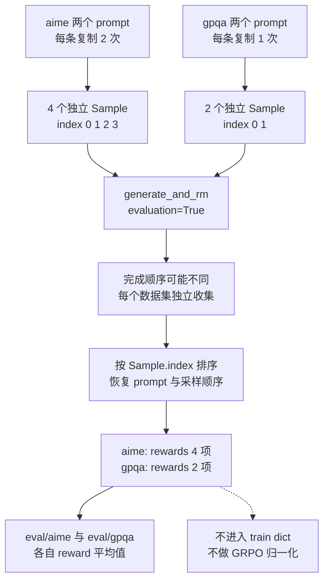
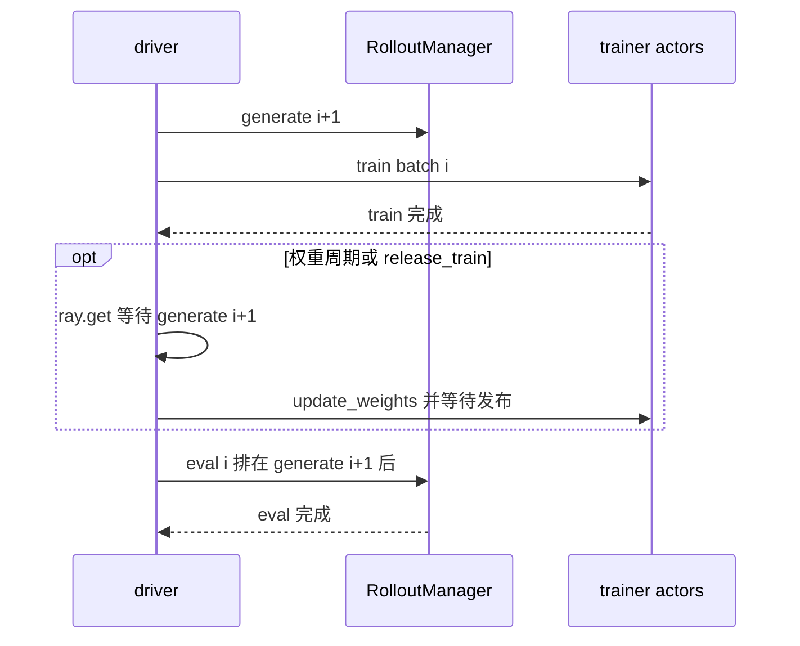

# slime 评估路径：独立采样配置与共享服务时序

> **源码基线**：`THUDM/slime@681b3adca54105d5ecd3fb822fa0dc58a427e0f9`（`main`，2026-08-12）
> **主题**：本页解释评估触发、数据集配置、采样与奖励输出，再说明同步和异步入口的共享服务边界。
> **适用范围**：默认 `sglang_rollout` 评估与 `examples/eval_multi_task`；训练样本转换、loss 和第三方服务内部实现由相应专题负责。
> **最近更新**：2026-09-10。按冻结源码补充评估机制与配置示例。

评估需要固定任务口径，却复用训练中的 serving 模型。slime 因此独立解析评估数据和采样设置，但把执行放进同一个 RolloutManager：默认 eval 从单独缓存的 Dataset 复制样本、生成并打分，直接输出按数据集聚合的结果，不经过训练 DataSource 游标消费、训练 reward 归一化或 DP 分包。这让多任务口径可以不同，也使 eval 必须服从 serving 资源和 driver 的调度顺序。

## 1. 为什么不能直接把训练 rollout 的 reward 当作评估

训练 rollout 会抽取 prompt groups、动态过滤、处理中断和转换训练 batch；评估则要重复测量固定数据集，并允许任务分别设置样本数、采样温度与奖励函数。如果直接复用训练批次的平均 reward，数据游标、过滤规则或 GRPO 组内归一化都会改变指标含义。

默认评估沿用 `generate_and_rm` 的单样本能力，却从独立 `EVAL_PROMPT_DATASET` 缓存构造样本；调用时标记 `evaluation=True`。它不调用 `RolloutManager._convert_samples_to_train_data`，因此 `eval/<name>` 是所选 reward 的直接平均值，而不是训练归一化后的 reward。**设计分析**：这里复用的是生成和打分能力，隔离的是数据身份及统计口径；代价是评估仍会占用同一套 engines，并不能独立于训练的权重发布任意执行。

## 2. 最小例子：两个任务如何成为六个确定身份的请求

下面是依据 `examples/eval_multi_task/multi_task.yaml` 精简的可解析配置。路径是需要准备的数据文件；示例假定 aime 文件有两条 prompt，gpqa 有两条，每条能按所选 RM 取得 reward。

```yaml
eval:
  defaults:
    max_response_len: 16384
    top_p: 0.7
  datasets:
    - name: aime
      path: /root/aime-2024/aime-2024.jsonl
      rm_type: deepscaler
      n_samples_per_eval_prompt: 2
    - name: gpqa
      path: /root/gpqa/gpqa_eval.jsonl
      rm_type: gpqa
      n_samples_per_eval_prompt: 1
```

在已配置模型、训练 checkpoint、GPU 和输入/标签字段的官方启动命令上，增加 `--eval-config eval_config.yaml --eval-interval 2`。原始多任务示例还包含 ifbench，分别使用 16、2、1 次采样；完整启动环境可从 `examples/eval_multi_task/multi_task.sh` 读取，模型转换与启动前提见 [[02_slime_quickstart_and_configuration_guide|配置指南]]。

配置优先级是 dataset 显式字段、`eval.defaults`、eval 专用 CLI、rollout 公共 CLI；后两级按字段的 `DATASET_RUNTIME_SPECS / DATASET_SAMPLE_SPECS` 选择，不是任意字段都具有全部四级回退。字典中显式 `null` 也算“字段存在”；因此它会阻止 builder 回退，有些运行字段随后仍会自行处理 None，不应笼统把 null 解释成“继承”。

<!-- Figure spec: Mermaid TB. Input aime P0/P1 copies twice and gpqa Q0/Q1 copies once; branches meet in generate_and_rm, unordered completion becomes sorted per-dataset index, then namespaced results. Mark copy isolation and no train conversion. Numbers derive from the explicit two-prompt inputs, not timings. -->


图中身份只要求在单个数据集内唯一：两条 aime prompt 按外层 prompt、内层采样次数分配 index 0–3；gpqa 另从 0 开始。每个样本 deepcopy，避免一次生成把缓存中的 prompt 改成已经完成的响应；完成后按 index 排回原序，使同 prompt 的多次采样重新相邻。数据集之间由 `asyncio.gather` 并发执行，采样任务则按 `as_completed` 收集；并发完成不等于按完成顺序定义评估数据。

## 3. 执行路径与输出契约

### 3.1 配置解析先建立有名字的数据集

`_resolve_eval_datasets` 优先读取 `--eval-config`，根可直接是 eval mapping，也可包在 `eval:` 下；`datasets` 接受 list 或按名称索引的 mapping。只有未给 eval config 时才使用 `--eval-prompt-data name path ...`；历史单路径形式按 aime 命名。`eval_datasets` 是最终 `list[EvalDatasetConfig]`，**没有 `--eval-datasets` CLI flag**。

`build_eval_dataset_configs` 先按 specs 解析字段，再把非 specs 的 dataclass 字段从 defaults 补入。未知 defaults key 抛 `ValueError`，数据集条目未知字段由 dataclass constructor 抛 `TypeError`；`metadata_overrides` 必须是 mapping，`min_eval_samples` 非 None 时必须大于零。缺失 dataset 的 YAML 会失败；配置 `eval_interval` 却没有任何解析后数据集也有显式断言。

### 3.2 同一个 RolloutManager，单独的 eval function

```text
driver train(args)
└─ RolloutManager.eval.remote(rollout_id) [Ray RPC；driver ray.get 等待]
   ├─ call_rollout_fn(eval_generate_rollout, ..., evaluation=True)
   │  └─ sglang_rollout.generate_rollout [默认绑定]
   │     └─ run(eval_rollout)
   │        └─ eval_rollout_single_dataset [每个数据集一个 coroutine]
   │           ├─ Dataset [缓存未命中时创建]
   │           ├─ deepcopy + index + metadata / hooks
   │           ├─ generate_and_rm [每个请求，evaluation=True]
   │           ├─ as_completed 收集，按 index 排序
   │           └─ 返回 name 对应 rewards / truncated / samples
   ├─ _save_debug_rollout_data [可选]
   └─ _log_eval_rollout_data [指标输出]
```

`eval_function_path` 未设置时回退到 `rollout_function_path`，RolloutManager 在初始化时分别加载二者。默认 `generate_rollout` 首先断言 `rollout_global_dataset`，之后才分支到 eval；自定义函数需接受 `evaluation` 关键字并返回 `RolloutFnEvalOutput(data, metrics)`，旧 dict 输出会由 `call_rollout_fn` 包装。`RolloutManager.eval` 不返回训练引用；RPC 完成证明本次评估函数、可选保存及日志函数均返回。

Dataset 缓存 key 包含 name/path、输入/标签/tool/metadata 字段，以及模型 checkpoint、chat template 和 multimodal 设置。每次评估复制缓存 Sample，并注入 dataset 的 `rm_type`、`metadata_overrides`、`custom_rm_path`、`custom_generate_function_path`。确定性推理启用时，每个 prompt 的第 j 次采样使用 `rollout_seed + j`，不是按全局 sample index 递增。

默认返回结构如下，各列长度与最终 samples 一致；自定义 generate 若返回 Sample 列表，收集逻辑会展开，不能继续假定一请求恒等于一行。

```python
{
    "aime": {
        "rewards": [0.0, 1.0, 1.0, 0.0],
        "truncated": [False, False, False, True],
        "samples": [sample_0, sample_1, sample_2, sample_3],
    }
}
```

`eval_reward_key` 优先于 `reward_key`；无 key 时直接使用 `sample.reward`，有 key 时从 reward dict 取该字段。日志得到 `eval/aime=0.5` 与 `eval/aime-truncated_ratio=0.25`，另将长度、重复等 Sample 指标放到 `eval/aime/` 前缀，横轴键为 `eval/step`。自定义 eval logger 返回真值时可接管默认日志。开启 debug 保存后，文件的 rollout id 使用 `eval_` 前缀；多个数据集的 samples 会合并保存，不应从保存文件的单列表反推原始任务分区。

## 4. 哪个时间点会评估哪份 serving 权重

### 4.1 同步入口有三道门

`train.py` 先完成训练模型初始化及首次权重推送，必要时恢复 KV，然后判断：

| 触发 | 条件 | 观察到的 serving 状态 |
|---|---|---|
| 纯评估 | `num_rollout == 0` 且 `eval_interval is not None` | 首次推送后的模型；仍会初始化训练组 |
| 训练前 | 循环到 `rollout_id == 0`、配置 eval interval、未设 `skip_eval_before_train` | 首次推送后的模型；恢复从非零 id 开始不会额外前评估 |
| 周期评估 | `should_run_periodic_action` 命中 | 当前轮无条件发布完成后的模型 |

周期条件是 `(rollout_id + 1)` 命中 interval，或者在传入了 `num_rollout_per_epoch` 时命中 epoch 边界。eval 调用没有传 `num_rollout` 参数，所以不像 save 那样自动在最后一轮触发；显式指定 num_rollout 的配置一般也不会计算 per-epoch 值。`skip_eval_before_train` 只跳过训练前那道门，不禁用纯评估或周期评估。纯评估应使用 `train.py`，并不是完全绕过 Megatron 初始化的独立推理命令。

### 4.2 异步入口：eval 在下一次 generate 后排队

`train_async.py` 没有纯评估或训练前评估分支，而且在进入循环前就提交一次 generate。它取得当前批次后，先提交 `generate(rollout_id + 1)`，再训练当前批次；若命中权重周期或 release-train，则先等待该 future 再发布；最后才提交并等待 eval。

以下是同一 driver、默认同步 RolloutManager 的调用顺序推导，依赖 Ray 同步 actor 的顺序执行契约。本仓类方法是普通 `def`，创建时没有改成 async actor 或配置并发组；这项结论不推广到所有 Ray actor 类型或自定义并发实现。

<!-- Figure spec: sequence with driver, default synchronous RolloutManager and trainer. Submit next generate before current train, optional wait+publish, then eval enqueued behind generate. Note evaluation waits for serving queue even without publish interval. Show order only, no proportional timing. -->


即使未命中权重发布周期，eval 也不会越过此前同 actor 上的 generate；driver 又等待 eval，因此这次评估形成额外阶段屏障。命中发布时 eval 使用新发布模型；未命中时使用仍在 serving 的旧版本，所以 `eval rollout_id=i` 是记录位置，不能据此声称测量了 train i 刚更新的参数。端到端调度整体见 [[10_slime_end_to_end_iteration_analysis|迭代时序]]。

## 5. 配置与失败边界

| 参数或字段 | 默认 / 输入契约 | 默认路径中的实际作用 |
|---|---|---|
| `--eval-interval` | int，None 禁用；应为正数 | 周期门；代码没有显式正数校验，0 会在取模处失败 |
| `--eval-config` / `--eval-prompt-data` | 默认 None；前者优先 | 配置任务列表；不是模型 checkpoint 配置 |
| `--eval-function-path` | 默认回退 rollout function | 选择评估函数，不改变 driver 的触发门 |
| `--skip-eval-before-train` | 默认 False | 只控制同步入口 rollout 0 之前的评估 |
| `n_samples_per_eval_prompt` | 全局默认 1；dataset/defaults 可覆盖 | 每 prompt deepcopy 次数；默认未显式保证正数，0 会造成空结果 |
| temperature/top_p/top_k/max_response_len | dataset → defaults → eval CLI → rollout CLI | 形成 SGLang sampling parameters |
| input_key/label_key/tool_key、multimodal/chat template | 按 sample specs 回退 | 决定 Dataset 和 prompt 构造；多模态见 [[26_slime_multimodal_vlm_path_analysis]] |
| `--eval-max-prompt-len` | None | Dataset 的 max_length；不自动等同 response 长度 |
| custom_rm_path / custom_generate_function_path / metadata_overrides | 可按 dataset 配置 | 写入每份 Sample，参与单样本分派 |
| `--eval-reward-key` | 回退 reward_key | 从标量或 reward dict 取得记录值 |

以下边界直接影响结果是否可解释：

- 默认 `eval_rollout` 明确拒绝 `group_rm`。异常从 coroutine 传播到同步包装，再由 `ray.get(eval_ref)` 传播给 driver；此处没有评估级重试或完整 rollback 协议。
- 空数据集或零采样会让默认 logger 对空 rewards 求平均，源码没有空集合保护；缺 reward key 会在索引时失败。应核对实际样本数和所选奖励字段。
- dataset 名应唯一；默认 `results.update` 对重复名称覆盖，未见重复名断言。缓存命中也不重新读取变动的数据文件，任务中修改同路径内容不会自动刷新。
- `log_passrate` 使用全局 `args.n_samples_per_eval_prompt` 分组，未读取各 dataset 的采样次数。上面的 2/1 异构任务默认均值有效，但不能直接把全局分组的 passrate 当成各自正确的 pass@k；需要统一次数或自定义 logger。
- `EvalDatasetConfig` 接受 `app_service`、`eval_task_timeout`、`min_eval_samples`、`eval_early_stop_remaining/idle_timeout`、`message_processor/reward_model/remote_environment` 等字段，但冻结基线的默认 `eval_rollout_single_dataset` 没有消费它们。字段存在或注释描述不等于此默认路径支持早停、超时或 AppServer。
- fully-async 是 `train_async.py` 上的持续生成函数替换，其示例明确不支持 eval；默认 eval function 回退到该函数时，`generate_rollout_fully_async(evaluation=True)` 直接抛 `ValueError`。单独换 eval function 不能证明持续后台 worker 的共享服务调度已安全协调。
- 本页验证到 slime 发出的采样参数、RPC 及日志；SGLang 内部排队、token 执行与 reward 外部服务行为仍是依赖边界，没有在此重新证明。

## 6. 源码阅读路线与验证入口

| 所解释的边界 | 稳定源码锚点 |
|---|---|
| 参数与任务解析 | `slime/utils/arguments.py::_resolve_eval_datasets / slime_validate_args / get_slime_extra_args_provider` |
| 默认值和数据集身份 | `slime/utils/eval_config.py::EvalDatasetConfig / ensure_dataset_list / build_eval_dataset_configs` |
| 触发及等待 | `train.py::train`、`train_async.py::train`、`slime/utils/misc.py::should_run_periodic_action` |
| 远程评估与结果适配 | `slime/ray/rollout.py::RolloutManager.eval`、`slime/rollout/base_types.py::call_rollout_fn / RolloutFnEvalOutput` |
| 复制、生成和排序 | `slime/rollout/sglang_rollout.py::generate_rollout / eval_rollout / eval_rollout_single_dataset` |
| 落盘及指标 | `slime/ray/rollout.py::RolloutManager._save_debug_rollout_data / _log_eval_rollout_data` |
| 多任务用法 | `examples/eval_multi_task/multi_task.yaml`、`examples/eval_multi_task/multi_task.sh` |

运行核验可先用小数据集观察 `Eval <name>` 进度、首条样本 reward、`eval <rollout_id>` 日志与 `eval/<name>` 指标；这些事件能区分解析成功、请求完成和日志落地。本页示例做了静态源码核实，未在 GPU 环境运行训练或 SGLang。

## Related Pages

- [[02_slime_quickstart_and_configuration_guide]] — 先准备模型、数据和 GPU 配置，再接入评估参数。
- [[10_slime_end_to_end_iteration_analysis]] — 解释评估所依赖的权重发布及同步/异步阶段顺序。
- [[11_slime_ray_control_plane_analysis]] — 解释同一 RolloutManager 的远程方法、服务句柄与控制责任。
- [[13_slime_sglang_rollout_engine_analysis]] — 展开评估复用的单样本生成、奖励与自定义分派。
- [[26_slime_multimodal_vlm_path_analysis]] — 解释评估 Dataset 同样可以携带的多模态输入链。
