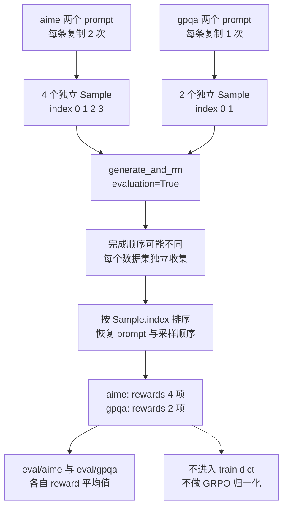
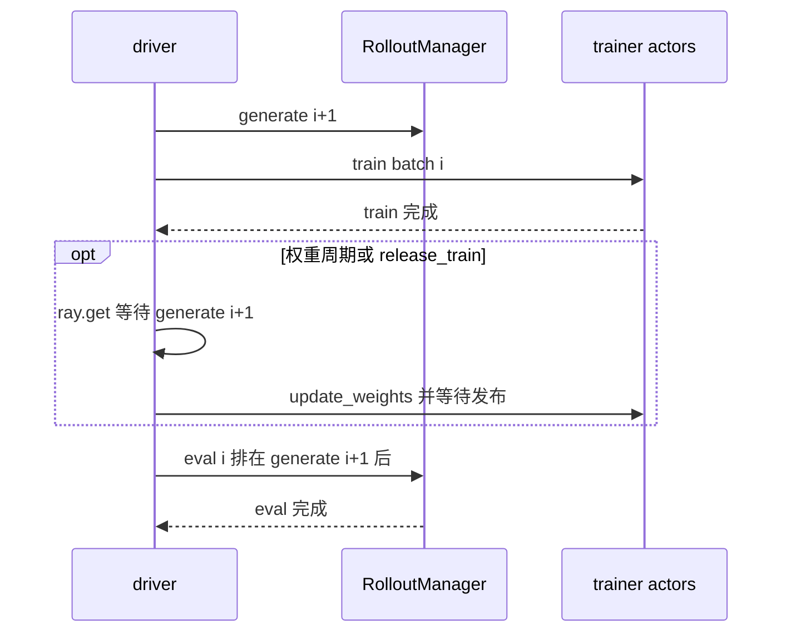

# slime 评估路径：独立采样配置与共享服务时序

> **源码基线**：`THUDM/slime@4c193f1f37509cca70f0e88807a9305b70f63f4e`（`main`，2026-09-03）
> **源码基线**：`sgl-project/sglang@0b3bb0cbe31873994c9f989fddfe2f87ca839fdd`（`v0.5.15.post1`，2026-07-13）
> **主题**：本页依次讲评估为什么不能复用训练 rollout 的 reward、一个多数据集配置例子与字段回退、默认评估函数的执行与输出契约及同级评估函数，再讲同步与异步入口会评估哪份 serving 权重，最后是失败边界与配置契约。
> **适用范围**：默认 `sglang_rollout` 评估与 `examples/eval_multi_task`；单样本生成与 reward 分派归 [[13_slime_sglang_rollout_engine_analysis|SGLang rollout 引擎]]，端到端阶段顺序归 [[10_slime_end_to_end_iteration_analysis|迭代时序]]，指标 step 键与落点归 [[18_slime_fault_tolerance_observability_analysis|容错与可观测]]，SFT 训练中的评估边界归 [[28_slime_sft_path_and_loss_mask_analysis|SFT 与 loss mask]]。
> **最近更新**：2026-09-18。覆盖默认评估与同级评估函数、9 个 `--eval-*` 采样覆盖参数与 SGLang 侧温度语义、passrate 断言崩溃条件、eval-only 的资源边界与评估静默跳过的条件。

评估需要固定任务口径，却复用训练中的 serving 模型。slime 因此独立解析评估数据和采样设置，但把执行放进同一个 RolloutManager：默认 eval 从单独缓存的 Dataset 复制样本、生成并打分，直接输出按数据集聚合的结果，不经过训练 DataSource 游标、训练 reward 归一化或 DP 分包。收益是多任务可以各有采样次数、温度与奖励函数；代价是 eval 必须服从 serving 资源和 driver 的调度顺序，异步入口里评估的是"记录位置"而不一定是刚训练出的参数，而且几处统计没有守卫，配置不当会直接让 driver 崩溃。

## 1. 为什么不能直接把训练 rollout 的 reward 当作评估

训练 rollout 会抽取 prompt groups、动态过滤、处理中断并转换训练 batch；评估则要重复测量固定数据集，并允许任务分别设置样本数、采样温度与奖励函数。如果直接复用训练批次的平均 reward，数据游标、过滤规则或 GRPO 组内归一化都会改变指标含义。

默认评估沿用 `generate_and_rm` 的单样本能力，却从独立的 `EVAL_PROMPT_DATASET` 缓存构造样本，调用时标记 `evaluation=True`。它不调用 `RolloutManager._convert_samples_to_train_data`，因此 `eval/<name>` 是所选 reward 的直接平均值，而不是训练归一化后的 reward。**设计分析**：这里复用的是生成和打分能力，隔离的是数据身份及统计口径；代价是评估仍占用同一套 engines，不能独立于训练的权重发布任意执行。

## 2. 最小例子：两个任务如何成为六个确定身份的请求

下面是依据 `examples/eval_multi_task/multi_task.yaml` 精简的可解析配置。路径是需要准备的数据文件；示例假定 aime 文件有两条 prompt，gpqa 有两条，每条都能按所选 RM 取得 reward。

```yaml
eval:
  defaults:
    max_response_len: 16384
    top_p: 0.7
  datasets:
    - name: aime
      path: /root/aime-2024/aime-2024.jsonl
      rm_type: deepscaler
      n_samples_per_eval_prompt: 2
    - name: gpqa
      path: /root/gpqa/gpqa_eval.jsonl
      rm_type: gpqa
      n_samples_per_eval_prompt: 1
```

在已配置模型、训练 checkpoint、GPU 和输入/标签字段的官方启动命令上，增加 `--eval-config eval_config.yaml --eval-interval 2`。原始多任务示例还包含 ifbench，三个任务分别采样 16、2、1 次；完整启动环境见 `examples/eval_multi_task/multi_task.sh`，模型转换与启动前提见 [[02_slime_quickstart_and_configuration_guide|配置指南]]。

每个字段按"dataset 显式字段 → `eval.defaults` → eval 专用 CLI → rollout 公共 CLI"取值，但后两级由 `slime/utils/eval_config.py` 的 `DATASET_RUNTIME_SPECS` 与 `DATASET_SAMPLE_SPECS` 逐字段规定，并非每个字段都有四级回退（第 5.2 节列出 9 个 `--eval-*` 参数各自的位置）。不在这两张表里的 dataclass 字段（`rm_type`、`repetition_penalty`、`app_service` 等）只有"条目 → defaults"两级。字典中显式写 `null` 也算"字段存在"，会阻止 builder 继续回退；有些运行字段随后自行处理 None，不能笼统把 null 当成"继承"。

<!-- Figure spec: Mermaid TB. Input aime P0/P1 copies twice and gpqa Q0/Q1 copies once; branches meet in generate_and_rm, unordered completion becomes sorted per-dataset index, then namespaced results. Mark copy isolation and no train conversion. Numbers derive from the explicit two-prompt inputs, not timings. -->

```mermaid
flowchart TB
    A["aime 两个 prompt<br/>每条复制 2 次"] --> AC["4 个独立 Sample<br/>index 0 1 2 3"]
    G["gpqa 两个 prompt<br/>每条复制 1 次"] --> GC["2 个独立 Sample<br/>index 0 1"]
    AC --> GEN["generate_and_rm<br/>evaluation=True"]
    GC --> GEN
    GEN --> DONE["完成顺序可能不同<br/>每个数据集独立收集"]
    DONE --> SORT["按 Sample.index 排序<br/>恢复 prompt 与采样顺序"]
    SORT --> OUT["aime: rewards 4 项<br/>gpqa: rewards 2 项"]
    OUT --> LOG["eval/aime 与 eval/gpqa<br/>各自 reward 平均值"]
    OUT -.-> NOTE["不进入 train dict<br/>不做 GRPO 归一化"]
```

图中身份只要求在单个数据集内唯一：两条 aime prompt 按外层 prompt、内层采样次数分配 index 0–3；gpqa 另从 0 开始。每个样本 deepcopy，避免一次生成把缓存中的 prompt 改成已经完成的响应；完成后按 index 排回原序，使同一 prompt 的多次采样重新相邻。数据集之间由 `asyncio.gather` 并发执行，采样任务按 `as_completed` 收集；并发完成不等于按完成顺序定义评估数据。

## 3. 执行路径与输出契约

### 3.1 配置解析先建立有名字的数据集

`slime/utils/arguments.py::_resolve_eval_datasets` 优先读取 `--eval-config`：根可以直接是 eval mapping，也可以包在 `eval:` 下；`datasets` 接受 list 或按名称索引的 mapping。只有未给 eval config 时才使用 `--eval-prompt-data name path ...`；只给一个路径的历史写法按 aime 命名。`args.eval_datasets` 是最终的 `list[EvalDatasetConfig]`，**没有 `--eval-datasets` CLI flag**。

`build_eval_dataset_configs` 先按两张 spec 表解析字段，再把非 spec 的 dataclass 字段从 defaults 补入。defaults 里的未知 key 抛 `ValueError`，数据集条目的未知字段由 dataclass 构造器抛 `TypeError`；`metadata_overrides` 必须是 mapping，`min_eval_samples` 非 None 时必须大于零。YAML 缺 datasets 会失败；配了 `eval_interval` 却没有解析出任何数据集，也有显式断言。`tests/test_eval_config.py` 锁住了这份回退契约：非 spec 字段从 defaults 到达每个数据集（`test_non_spec_defaults_reach_every_dataset`）、条目覆盖 defaults（`test_dataset_entry_overrides_default`）、`stop`/`stop_token_ids`/`min_new_tokens` 按"条目 → defaults → CLI"解析（`test_stop_fields_resolve_dataset_then_default_then_args`）、defaults 拼错键会报错（`test_unknown_default_key_raises`）、spec 字段最终回退到 args（`test_spec_fields_still_fall_back_to_args`）。

### 3.2 同一个 RolloutManager，单独的 eval function

```text
driver train(args)
└─ RolloutManager.eval.remote(rollout_id) [Ray RPC；driver ray.get 等待]
   ├─ debug_train_only 时直接返回 [见 5.1]
   ├─ call_rollout_fn(eval_generate_rollout, ..., evaluation=True)
   │  └─ sglang_rollout.generate_rollout [默认绑定]
   │     └─ run(eval_rollout)
   │        └─ eval_rollout_single_dataset [每个数据集一个 coroutine]
   │           ├─ Dataset [缓存未命中时创建]
   │           ├─ deepcopy + index + metadata / custom_rm_path / generate_function_path
   │           ├─ generate_and_rm [每个请求，evaluation=True]
   │           ├─ as_completed 收集，按 index 排序
   │           └─ 返回 name 对应 rewards / truncated / samples
   ├─ slime/observability/rollout_data_utils.py::save_debug_rollout_data [可选]
   └─ slime/observability/rollout_metrics.py::log_eval_rollout_data [指标输出]
```

`eval_function_path` 未设置时在解析期回退到 `rollout_function_path`，RolloutManager 在初始化时分别加载二者。默认 `generate_rollout` 先断言 `rollout_global_dataset`，之后才分支到 eval；自定义函数需要接受 `evaluation` 关键字并返回 `RolloutFnEvalOutput(data, metrics)`，旧的 dict 输出会被 `call_rollout_fn` 包装。`RolloutManager.eval` 不返回训练引用；RPC 完成只证明本次评估函数、可选保存和日志函数都已返回。

Dataset 缓存 key 包含 name/path、输入/标签/tool/metadata 字段，以及模型 checkpoint、chat template、chat template kwargs 和 multimodal 设置。每次评估复制缓存的 Sample，并写入数据集的 `rm_type`、`metadata_overrides`、`custom_rm_path` 与 `custom_generate_function_path`。启用确定性推理时，每个 prompt 的第 j 次采样使用 `rollout_seed + j`，不是按全局 sample index 递增。

默认返回结构如下，各列长度与最终 samples 一致；自定义 generate 若返回 Sample 列表，收集逻辑会展开，不能再假定一个请求对应一行。

```python
{
    "aime": {
        "rewards": [0.0, 1.0, 1.0, 0.0],
        "truncated": [False, False, False, True],
        "samples": [sample_0, sample_1, sample_2, sample_3],
    }
}
```

`eval_reward_key` 优先于 `reward_key`；无 key 时直接使用 `sample.reward`，有 key 时从 reward dict 取该字段。日志得到 `eval/aime=0.5` 与 `eval/aime-truncated_ratio=0.25`，长度、重复等 Sample 指标放到 `eval/aime/` 前缀下，开 `--log-passrate` 时另有 `eval/aime-pass@k`，step 键为 `eval/step`（与 train/rollout 的 step 口径关系见 [[18_slime_fault_tolerance_observability_analysis|容错与可观测]]）。`--custom-eval-rollout-log-function-path` 指定的函数返回真值时接管默认日志。开启 `--save-debug-rollout-data` 后，保存路径里的 rollout id 带 `eval_` 前缀，文件内的 `rollout_id` 字段仍是整数；多个数据集的 samples 被合并成一个列表保存，不能从保存文件反推原始任务分区。

### 3.3 同级评估函数：换了 rollout 函数，评估行为跟着变

`--eval-function-path` 缺省等于 `--rollout-function-path`，所以换 rollout 函数就换了评估行为。仓内接受 `evaluation` 参数的整轮函数都在 `slime/rollout/` 与 `slime_plugins/rollout_buffer/` 下，逐个看 `evaluation=True` 分支：

| 整轮函数 | `evaluation=True` 时的行为 | 结果 |
|---|---|---|
| `slime/rollout/sglang_rollout.py::generate_rollout` | 进入 `eval_rollout`，即本页主路径 | 按数据集输出 rewards/truncated/samples |
| `slime/rollout/forge_load.py::generate_rollout` | `_resolve_path` 只在 `--load-forge-rollout-data` 是含 `{rollout_id}` 的模板时，才去读 `eval_<id>.pt`；读到后以单个数据集 `forge_eval` 回放 dump 中的 Sample，reward 为 None 的记 0.0。字面路径或 eval 文件缺失时返回空的 `RolloutFnEvalOutput(data={})`，不像训练路径那样回退到 `0.pt` | 回放旧评估结果，或只记下 `eval/step` |
| `slime/rollout/fully_async_rollout.py::generate_rollout_fully_async` | 抛 `ValueError("fully-async rollout doesn't support evaluation mode")` | driver 崩溃；另配 `--eval-function-path` 只能绕开异常。**分析判断**：`slime/rollout/fully_async_rollout.py` 的模块 docstring 写明后台 worker 跨 rollout 边界保持一池在途轨迹，评估请求因此与这些轨迹共用同一组 engines，另换的评估函数不会与该 worker 协调 |
| `slime/rollout/sft_rollout.py::generate_rollout` | `assert not evaluation` | 断言失败；但 SFT 配方带 `--debug-train-only`，评估根本不会走到这里 |
| `slime_plugins/rollout_buffer/rollout_buffer_example.py::generate_rollout` | 抛 `NotImplementedError("Evaluation rollout is not implemented")` | driver 崩溃 |
| `slime/rollout/sleep_rollout.py::sleep` | 忽略 `evaluation`，无限 `time.sleep` | 评估 RPC 永不返回，driver 一直等待（源码推导） |

同一关注点还有一条兄弟轴：单样本层的生成函数。数据集条目的 `custom_generate_function_path` 或全局 `--custom-generate-function-path` 替换的是 `generate_and_rm` 里的单次生成；函数签名含 `evaluation` 时才会收到该参数，例如 `examples/multi_agent/rollout_with_multi_agents.py::generate_with_multi_agents` 在评估时改用 `eval_max_context_len`。单样本分派的细节归 [[13_slime_sglang_rollout_engine_analysis|SGLang rollout 引擎]]，forge 的训练侧回放与 sleep 占位归 [[19_slime_rollout_backend_extension_analysis|rollout 后端扩展]]。

## 4. 哪个时间点会评估哪份 serving 权重

### 4.1 同步入口有三道门

`train.py` 先完成训练模型初始化及首次权重推送，必要时恢复 KV，然后判断：

| 触发 | 条件 | 观察到的 serving 状态 |
|---|---|---|
| 纯评估 | `num_rollout == 0` 且 `eval_interval is not None` | 首次推送后的模型；仍创建 actor 并加载权重，但 `setup_model_and_optimizer` 在 `num_rollout == 0` 时不建 optimizer 与 scheduler、并置 `no_load_optim`，`create_training_models` 不建 critic |
| 训练前 | 循环到 `rollout_id == 0`、配置了 eval interval、未设 `skip_eval_before_train` | 首次推送后的模型；从非零 id 恢复时不会额外做训练前评估 |
| 周期评估 | `should_run_periodic_action` 命中 | 当前轮无条件发布完成后的模型 |

周期条件是 `(rollout_id + 1)` 命中 interval，或者在传入 `num_rollout_per_epoch` 时命中 epoch 边界。eval 调用没有传 `num_rollout` 参数，所以不像 save 那样自动在最后一轮触发；显式指定 num_rollout 的配置也不会计算 per-epoch 值（`create_rollout_manager` 只在 `num_rollout is None` 时计算）。`skip_eval_before_train` 只跳过训练前那道门，不禁用纯评估或周期评估。纯评估应使用 `train.py`，它不是完全绕过 Megatron 初始化的独立推理命令。

### 4.2 异步入口：eval 在下一次 generate 后排队

`train_async.py` 没有纯评估或训练前评估分支，而且在进入循环前就提交一次 generate。它取得当前批次后，若不是最后一轮，先提交 `generate(rollout_id + 1)`，再训练当前批次；若命中权重周期或 release-train，则先等待该 future 再发布；最后才提交并等待 eval。

以下是同一 driver、默认同步 RolloutManager 的调用顺序推导，依赖 Ray 同步 actor 按提交顺序执行方法的契约。RolloutManager 的方法是普通 `def`，`create_rollout_manager` 创建时没有改成 async actor 或配置并发组；这项结论不推广到其他 Ray actor 类型或自定义并发实现。

<!-- Figure spec: sequence with driver, default synchronous RolloutManager and trainer. Submit next generate before current train, optional wait+publish, then eval enqueued behind generate. Note evaluation waits for serving queue even without publish interval. Show order only, no proportional timing. -->

```mermaid
sequenceDiagram
    participant D as driver
    participant R as RolloutManager
    participant T as trainer actors
    D->>R: generate i+1
    D->>T: train batch i
    T-->>D: train 完成
    opt 权重周期或 release_train
        D->>D: ray.get 等待 generate i+1
        D->>T: update_weights 并等待发布
    end
    D->>R: eval i 排在 generate i+1 后
    R-->>D: eval 完成
```

即使未命中权重发布周期，eval 也不会越过此前同一 actor 上的 generate；driver 又等待 eval，所以这次评估形成额外的阶段屏障。命中发布时 eval 使用新发布的模型；未命中时使用仍在 serving 的旧版本，所以 `eval rollout_id=i` 只是记录位置，不能据此声称测量了 train i 刚更新的参数。最后一轮不再提交下一次 generate，eval 也就不排在它后面。端到端调度见 [[10_slime_end_to_end_iteration_analysis|迭代时序]]；verl 在 `fit()` 主循环里把可选 validation 放在 step-end（sync 模式下含权重发布）之后，可作对照，见 [[10_verl_end_to_end_iteration_analysis|verl 端到端迭代]]。

## 5. 失败边界与配置契约

### 5.1 硬约束与失败边界

| 前提 | 源码边界 | 违反时的行为 |
|---|---|---|
| 评估确实会执行 | `slime/ray/rollout.py::RolloutManager.eval` 在 `debug_train_only` 时第一行就返回；`--load-debug-rollout-data` 会在解析期强制 `debug_train_only` | 静默空操作：RPC 正常返回，没有任何 `eval/` 指标。SFT 配方正是这种情形，见 [[28_slime_sft_path_and_loss_mask_analysis\|SFT 与 loss mask]] |
| 开 `--log-passrate` 时，每个数据集的 reward 数能按**全局** `--n-samples-per-eval-prompt` 整除 | `slime/observability/metric_utils.py::compute_pass_rate` 取 `num_groups = len(rewards) // group_size`，再断言 `len(flat_rewards) == num_groups * group_size`；它不读各数据集自己的采样次数 | 不整除时 `AssertionError` 从 `log_eval_rollout_data` 经 `RolloutManager.eval` 传到 driver 的 `ray.get`，训练终止。以第 2 节配置为例：全局值为 4 时，aime 的 4 个 reward 恰好成 1 组（把两条 prompt 混为一组，pass@k 已不正确），gpqa 的 2 个 reward 得 `num_groups=0`，断言失败；全局值为 2 时不崩溃，但 gpqa 的 Q0、Q1 被当成同一 prompt 的两次采样。全局值为默认 1 时直接返回空字典，不记 passrate。异构采样次数要么统一，要么用自定义 eval logger |
| 每个数据集至少有一个样本 | `log_eval_rollout_data` 直接 `sum(rewards) / len(rewards)`，没有空集合保护 | 空数据集或 `n_samples_per_eval_prompt: 0` 时 `ZeroDivisionError` |
| reward 字段存在 | `eval_rollout_single_dataset` 在有 `eval_reward_key`/`reward_key` 时直接 `sample.reward[reward_key]` | 缺 key 或 reward 不是 dict 时在收集结果处抛错 |
| 不用 group RM | `eval_rollout` 与 `eval_rollout_single_dataset` 都断言 `not args.group_rm` | 断言从 coroutine 传到同步包装，再由 `ray.get(eval_ref)` 传给 driver；没有评估级重试或回滚 |
| `--eval-interval` 为正数 | 解析期没有正数校验；`slime/utils/misc.py::should_run_periodic_action` 做 `step % interval` | 0 在取模处抛 `ZeroDivisionError` |
| 数据集名唯一 | `eval_rollout` 用 `results.update` 合并，没有重名断言 | 后一个同名结果覆盖前一个 |
| 数据文件在运行中不变 | `EVAL_PROMPT_DATASET` 按缓存 key 复用 Dataset | 同路径内容被修改不会自动刷新 |
| eval 函数支持评估 | 见 3.3 节的同级函数表 | fully-async、rollout buffer 示例崩溃，sleep 挂起 |
| 使用 `EvalDatasetConfig` 的扩展字段 | `app_service`、`eval_task_timeout`、`min_eval_samples`、`eval_early_stop_remaining/idle_timeout`、`message_processor/reward_model/remote_environment` 在仓内 `.py` 中除 `slime/utils/eval_config.py` 外没有读取方 | 字段存在或注释描述不等于默认路径支持早停、超时或 AppServer |

其余边界：`--eval-max-prompt-len` 只对字符串 prompt 生效，消息列表形式的 prompt 由 `slime/utils/data.py::filter_long_prompt` 记告警后原样保留。本页验证到 slime 发出的采样参数、RPC 与日志；SGLang 内部排队、token 执行和外部 reward 服务的行为是依赖边界，本页没有重新证明。

### 5.2 评估采样覆盖：9 个 `--eval-*` 参数

这 9 个参数都在 `get_slime_extra_args_provider` 的 `add_eval_arguments` 中注册，默认 None。

| 参数 | 解析位置 | 回退与作用 |
|---|---|---|
| `--eval-input-key` | `DATASET_SAMPLE_SPECS["input_key"]` 的第一个 CLI 候选 | 未设回退 `--input-key`；决定 Dataset 读取的 prompt 字段 |
| `--eval-label-key` | `DATASET_SAMPLE_SPECS["label_key"]` | 未设回退 `--label-key`；决定 label 字段 |
| `--eval-tool-key` | `DATASET_SAMPLE_SPECS["tool_key"]` | 未设回退 `--tool-key`；决定 tools 字段 |
| `--eval-temperature` | `DATASET_RUNTIME_SPECS["temperature"]` | 未设回退 `--rollout-temperature`；写入 SGLang 采样参数 `temperature` |
| `--eval-top-p` | `DATASET_RUNTIME_SPECS["top_p"]` | 未设回退 `--rollout-top-p`；写入 `top_p` |
| `--eval-top-k` | `DATASET_RUNTIME_SPECS["top_k"]` | 未设回退 `--rollout-top-k`；写入 `top_k` |
| `--eval-max-response-len` | `DATASET_RUNTIME_SPECS["max_response_len"]` | 未设回退 `--rollout-max-response-len`；写入 `max_new_tokens` |
| `--eval-min-new-tokens` | `DATASET_RUNTIME_SPECS["min_new_tokens"]`，且 `eval_rollout_single_dataset` 在条目值为 None 时再读一次 | 没有 rollout 侧回退；最终仍为 None 时不写入 `min_new_tokens` |
| `--eval-max-context-len` | 不在 spec 表中；`slime_validate_args` 在未设时取 `--rollout-max-context-len` | 默认评估路径不读；仓内唯一读取方是 `examples/multi_agent/rollout_with_multi_agents.py::generate_with_multi_agents` 的评估分支 |

温度的解析期校验只针对训练：`slime_validate_args` 对 `--rollout-temperature <= 0` 抛 `ValueError`（错误信息称 temperature 0 是 greedy decoding，不是合法的 RL 策略），但不检查 `--eval-temperature` 或数据集条目的 `temperature`。评估可以显式传 0；未设时继承的训练温度已保证大于 0。请求进入 SGLang 之后按上游契约处理（镜像底座 v0.5.15.post1，见页头；slime 的 `docker/patch/latest/*.patch` 不改这两处）：`python/sglang/srt/sampling/sampling_params.py::SamplingParams.__post_init__` 把 `0 <= temperature < 1e-6`（`_SAMPLING_EPS`）改写为 `temperature=1.0, top_k=1`，即 greedy，与 slime 错误信息的说法一致；`python/sglang/srt/managers/tokenizer_manager.py::TokenizerManager._create_tokenized_object` 随后调用 `SamplingParams.verify`，对负数或非有限温度抛 `ValueError`。所以负的 `--eval-temperature` 或数据集 `temperature` 能通过 slime 解析，要到 SGLang 校验请求时才失败。

### 5.3 其余评估参数与数据集字段

| 参数或字段 | 默认 / 输入契约 | 默认路径中的实际作用 |
|---|---|---|
| `--eval-interval` | int，None 禁用；应为正数 | 周期门，见 4.1 与 5.1 |
| `--eval-config` / `--eval-prompt-data` | 默认 None；前者优先 | 配置任务列表；不是模型 checkpoint 配置 |
| `--eval-function-path` | 解析期回退 `--rollout-function-path` | 选择整轮评估函数（3.3 节），不改变 driver 的触发门 |
| `--skip-eval-before-train` | 默认 False | 只控制同步入口 rollout 0 之前的评估 |
| `--n-samples-per-eval-prompt` / 条目 `n_samples_per_eval_prompt` | CLI 默认 1；条目与 defaults 可覆盖 | 每条 prompt 的 deepcopy 次数。spec 的 CLI 回退链写的是先 `n_samples_per_eval_prompt` 后 `n_samples_per_prompt`，但前者 CLI 默认 1 不为 None，实际不会回退到训练的采样数；它同时是 passrate 的全局分组大小 |
| `--eval-max-prompt-len` | None | Dataset 的 `max_length`；不等同 response 长度 |
| `--eval-reward-key` | 回退 `--reward-key` | 从标量或 reward dict 取记录值 |
| `--log-passrate` | 默认 False，训练与评估共用 | 评估时按全局 `n_samples_per_eval_prompt` 分组，约束见 5.1 |
| `--custom-eval-rollout-log-function-path` | 默认 None | 返回真值时跳过默认 eval 日志 |
| 条目 `custom_rm_path` | spec 的 CLI 候选是 `eval_custom_rm_path` 再 `custom_rm_path`，但没有注册 `--eval-custom-rm-path` flag | 未在条目或 defaults 给出时等价于回退 `--custom-rm-path`；写入每份 Sample，参与单样本 reward 分派 |
| 条目 `rm_type`、`metadata_overrides` | 条目 → defaults | 合并进每份 Sample 的 metadata |
| 条目 `stop` / `stop_token_ids` / `skip_special_tokens` / `no_stop_trim` / `repetition_penalty` | 前两者回退 `--rollout-stop` / `--rollout-stop-token-ids`；`skip_special_tokens` 回退 rollout 设置；`no_stop_trim` 缺省为 True；`repetition_penalty` 仅在给出时写入 | 形成 SGLang 采样参数 |
| 条目 `input_key` 等、`multimodal_keys`、`apply_chat_template(_kwargs)` | 按 sample specs 回退 | 决定 Dataset 和 prompt 构造，也进入缓存 key；多模态见 [[26_slime_multimodal_vlm_path_analysis\|多模态 VLM 路径]] |
| 条目 `custom_generate_function_path` | 仅条目或 defaults | 写入每份 Sample，替换单次生成（3.3 节） |

`add_eval_arguments` 共注册 16 个参数（`--eval-function-path`、重设默认值的 `--eval-interval`、`--eval-prompt-data`、`--eval-config`、`--skip-eval-before-train`、`--n-samples-per-eval-prompt`、`--eval-max-prompt-len` 与 5.2 节的 9 个），5.2 与 5.3 两表全部覆盖；另列了注册在别处的 `--eval-reward-key`、`--log-passrate`、`--custom-eval-rollout-log-function-path`。slime 域目前没有 coverage ledger，这份对账无法由 `tools/check_coverage.py` 复跑。

## 6. 源码阅读路线与验证入口

| 所解释的边界 | 稳定源码锚点 |
|---|---|
| 参数与任务解析 | `slime/utils/arguments.py::get_slime_extra_args_provider / _resolve_eval_datasets / slime_validate_args` |
| 默认值、回退表和数据集身份 | `slime/utils/eval_config.py::DATASET_RUNTIME_SPECS / DATASET_SAMPLE_SPECS / pick_from_args / EvalDatasetConfig / ensure_dataset_list / build_eval_dataset_configs` |
| 回退契约的测试 | `tests/test_eval_config.py::test_non_spec_defaults_reach_every_dataset / test_dataset_entry_overrides_default / test_stop_fields_resolve_dataset_then_default_then_args / test_unknown_default_key_raises / test_spec_fields_still_fall_back_to_args` |
| 触发、等待与 eval-only 资源 | `train.py::train`、`train_async.py::train`、`slime/utils/misc.py::should_run_periodic_action`、`slime/ray/placement_group.py::create_rollout_manager / create_training_models`、`slime/backends/megatron_utils/model.py::setup_model_and_optimizer` |
| 远程评估与结果适配 | `slime/ray/rollout.py::RolloutManager.__init__ / RolloutManager.eval`、`slime/rollout/base_types.py::call_rollout_fn / RolloutFnEvalOutput` |
| 复制、生成和排序 | `slime/rollout/sglang_rollout.py::generate_rollout / eval_rollout / eval_rollout_single_dataset / generate_and_rm` |
| 落盘与指标 | `slime/observability/rollout_data_utils.py::save_debug_rollout_data`、`slime/observability/rollout_metrics.py::log_eval_rollout_data`、`slime/observability/metric_utils.py::compute_pass_rate` |
| 同级评估函数 | `slime/rollout/forge_load.py::_resolve_path / generate_rollout`、`slime/rollout/fully_async_rollout.py::generate_rollout_fully_async`、`slime/rollout/sft_rollout.py::generate_rollout`、`slime/rollout/sleep_rollout.py::sleep`、`slime_plugins/rollout_buffer/rollout_buffer_example.py::generate_rollout_async`、`examples/multi_agent/rollout_with_multi_agents.py::generate_with_multi_agents` |
| 多任务用法 | `examples/eval_multi_task/multi_task.yaml`、`examples/eval_multi_task/multi_task.sh` |

运行核验可以先用小数据集观察 `Eval <name>` 进度条、首条样本的 reward 日志、`eval <rollout_id>` 日志与 `eval/<name>` 指标，这些事件能区分解析成功、请求完成和日志落地；若开了 `--log-passrate`，先按 5.1 核对每个数据集的 reward 数。本页示例做了静态源码核实，未在 GPU 环境运行训练或 SGLang。

## Related Pages

- [[02_slime_quickstart_and_configuration_guide]] — 先准备模型、数据和 GPU 配置，再接入评估参数。
- [[10_slime_end_to_end_iteration_analysis]] — 评估所依赖的权重发布及同步/异步阶段顺序。
- [[11_slime_ray_control_plane_analysis]] — 同一 RolloutManager 的远程方法、服务句柄与控制责任。
- [[13_slime_sglang_rollout_engine_analysis]] — 评估复用的单样本生成、奖励与自定义分派。
- [[18_slime_fault_tolerance_observability_analysis]] — `eval/step` 与其他 step 键的关系、调试数据的保存与回放。
- [[28_slime_sft_path_and_loss_mask_analysis]] — SFT 配方带 `--debug-train-only`，训练中的评估为何是静默空操作。
- [[10_verl_end_to_end_iteration_analysis]] — verl 在 `fit()` 主循环中放置可选 validation 的位置，可对照 slime 的评估门。
