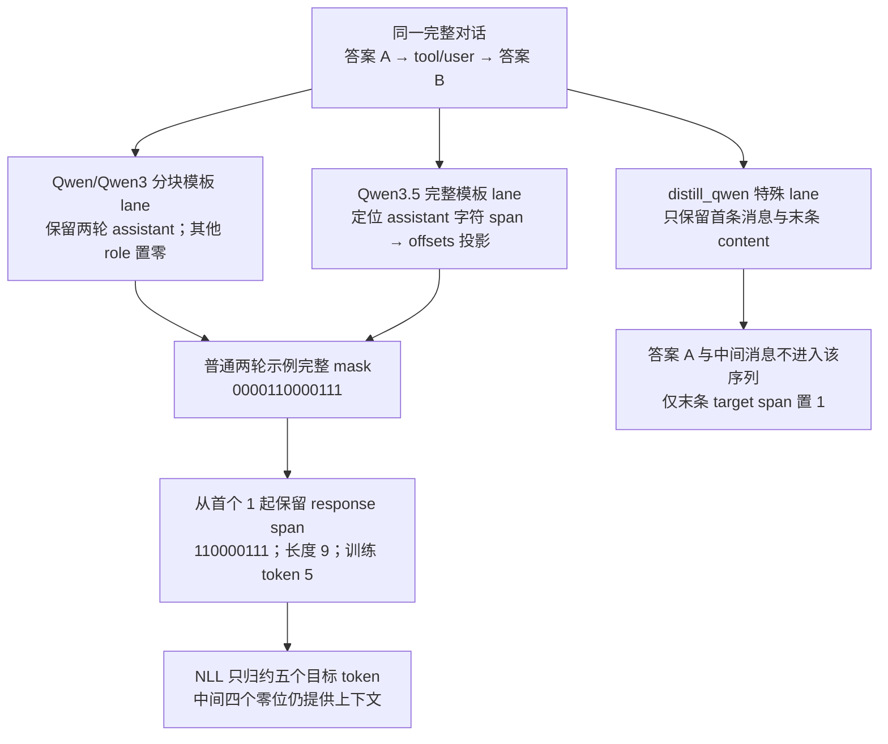

# slime SFT 路径与多轮 loss mask 分析

> **源码基线**：`THUDM/slime@681b3adca54105d5ecd3fb822fa0dc58a427e0f9`（`main`，2026-08-12）
> **主题**：从现成多轮消息生成监督 token 与 loss mask，解释不同模板的 mask 算法，再追踪其进入共享训练调度与 SFT loss 的过程。
> **适用范围**：仓内 `sft_rollout` 的文本 SFT 示例；通用数据分发、并行归约与多模态模型分别归相邻页面。
> **最近更新**：2026-09-10。新增冻结基线下的 SFT 入口、mask 原理与源码边界。

SFT 已经有目标答案，不需要向推理服务采样；但多轮对话里的 user、tool、模板前缀仍是预测后续答案所需的上下文。slime 因而把 SFT 做成一个返回 Sample 的 rollout 函数：保留完整对话 token，仅在 assistant 目标上置 1，然后复用既有 converter、DP schedule 与 Megatron loss callback。核心约束是 **“作为上下文存在”与“作为监督目标计入 loss”必须分开**，不能删掉零 mask token 来实现过滤。

## 1. 为什么 SFT 仍经过 rollout 数据接口

普通 RL 路径读取 prompt、调用生成器、计算 reward，再训练已采样的 response；SFT 路径读取完整消息，将给定 assistant 内容直接当作 target。两者共有的困难仍然存在：变长序列要打包，DP ranks 必须以相同 micro-batch 次数推进，CP 切片和 next-token 标签要对齐。

因此 `slime.rollout.sft_rollout.generate_rollout` 只替换“如何得到 Sample 的 tokens/mask”，返回之后仍由 RolloutManager 完成训练字典转换和 DP 分发。源码中 `reward=0` 是满足共享字段契约的占位，SFT NLL 不使用 reward 来构造目标。**设计分析**：专门新建一个 SFT trainer 会重复后半段调度与并行归约；保留 Sample 接口则可以用同一训练内核，但必须显式关闭不适用的优势计算与在线 rollout 引擎。

## 2. 普通路径：messages 如何变成训练 Sample

脚本 `scripts/run-qwen3-4B-base-sft.sh` 以 `messages` 为输入列，并没有开启 `--apply-chat-template`。这让 Dataset 保留消息列表，SFT 函数再自行选择 mask 模板；若提前渲染成字符串，后续逐消息的 `message["role"]` 就失去预期输入。

`generate_rollout` 先断言不是 evaluation，且启用了 global dataset；加载并缓存 tokenizer、processor 和 `MultiTurnLossMaskGenerator` 后，从 DataSource 取 `rollout_batch_size` 个 groups。它对每个 group 使用 `(sample,) = sample` 解包，因此要求一组恰好一条 Sample；对应 `n_samples_per_prompt=1`，不是 RL 常见的一 prompt 多候选。

对每条 Sample：

1. 取 `sample.prompt` 消息列表和 `sample.metadata["tools"]`（无 tools 时为 None）。
2. mask generator 返回完整 `token_ids` 与同长度完整 mask；不等长直接 `ValueError`。
3. `get_response_lengths` 从 mask 首个 1 到末尾计算 response span，之前的前缀算 prompt。
4. 写入完整 `tokens`、`response_length`、`reward=0`，并将 mask 裁为 response 尾部；返回原来的分组结构。

这里不会调用 SGLang `/generate`，不产生行为策略 logprob、finish reason 或在线 reward model 结果。`PROCESSOR` 虽被加载，当前 SFT 函数没有调用它构造训练用多模态张量；这不是一条完整的多模态 SFT 实现。

## 3. 一个完整 mask 例子：response length 不等于训练 token 数

设对话包含第一次 assistant 答案、工具观察及第二次 assistant 答案。下表把实际 tokenizer 输出压缩成 13 个解释性 token 位置；数字和长度用于演示，不宣称它们是某个真实词表的编码。

| token 位置 | 语义 | 完整 mask |
|---|---|---|
| 0–2 | system/user 上下文 | 0 0 0 |
| 3 | 第一轮 assistant 模板前缀 | 0 |
| 4–5 | assistant 答案 A | 1 1 |
| 6–8 | tool/user 上下文 | 0 0 0 |
| 9 | 第二轮 assistant 模板前缀 | 0 |
| 10–12 | assistant 答案 B 及结束 token | 1 1 1 |

完整 mask 为 `[0,0,0,0,1,1,0,0,0,0,1,1,1]`。首个 1 在位置 4，所以 `response_length=9`，存入 Sample 的 response mask 是 `[1,1,0,0,0,0,1,1,1]`，而 `effective_response_length=5`。位置 6–9 仍留在上下文中，第二次答案的概率以它们为条件，但它们不贡献监督梯度。



图中 Qwen3 与 Qwen3.5 的合流表示 mask 的同一监督意图，不表示两条算法对任意 tokenizer 都返回相同 token ids；第 4 节说明为什么模板必须匹配。`step_loss_mask != 1` 可令整条 assistant 消息为零；例如只排除答案 A，首个 1 会后移到答案 B，response span 也随之缩短。

### 3.1 进入 next-token loss 时再对齐一次

Sample mask 对齐的是 target token，模型输出 logits 对齐的是“当前位置预测下一 token”。训练 `get_batch` 因此用左侧 `prompt_length-1` 个 0、右侧 1 个 0 对 response mask padding，再执行与 tokens 一致的 CP 切片/packing。上例 prompt length 为 4，模型位置 3、4、9、10、11 预测五个目标 token；位置 12 没有下一 target，必须是零。

`sft_loss_function` 使用共享 `get_log_probs_and_entropy(..., with_entropy=False)` 取 ground-truth response tokens 的 logprob，并返回负的 reducer 结果。默认 rollout mean 与 per-token 模式在同一条 Sample 上相同，多条不同长度样本则权重不同；官方 SFT 脚本显式选择 `--calculate-per-token-loss`。令本例目标位置集合为 S，单样本 loss 为：

$$
L_{\mathrm{SFT}}=-\frac{1}{5}\sum_{t\in S}\log p_\theta(x_t\mid x_{<t}).
$$

上式是本例五个有效 token 的均值。多样本的外层 token denominator 使用每条 mask sum 至少计 1 的共享约定，详细统计规则见 [[15_slime_loss_parallelism_analysis]]。没有本地 response token 的 rank 仍通过 `0 * logits.sum()` 保持 autograd 连通，不能独自跳过必要 collective。

## 4. 模板决定 mask 算法，不能仅凭模型名字猜测

`--loss-mask-type` 的核心默认值是 `qwen`，可选 `qwen/qwen3/qwen3_5/distill_qwen`。模板由 tokenizer 依赖提供，slime 的证据范围是下列调用、拼接、校验与已有测试；本页没有把外部 tokenizer 内部实现当作已阅读源码。

| 路径 | 如何生成 token 与 mask | 适用边界 |
|---|---|---|
| `qwen` | 用两条测试 user 消息推导默认 system 前缀和 generation prompt 长度；逐消息模板化，去重复 system 前缀；assistant 跳过 generation prefix 后置 1 | tokenizer 必须符合这套前缀分解假设；若 added vocab 含特殊 `<｜Assistant｜>`，自动转 distill 路径 |
| `qwen3` | 用虚拟 user prefix 固定局部模板上下文；首段追加再裁掉 prefix，后续段前置再裁掉；连续 tool responses 作为一组模板化 | 修复连续 tool 的包装边界，但仍逐段构造，对依赖全对话位置的模板不普适 |
| `qwen3_5` | 整个 messages 一次渲染，再用 fast tokenizer offsets 将 assistant 字符范围映射回 token | 要求 offsets；完整文本重新编码必须与 `apply_chat_template(..., tokenize=True)` 完全相同 |
| `distill_qwen` | 首条 message 加 generation prompt 作为 prompt，最后一条 message 的 content 作为 response，各自编码后拼接 | 中间消息不进入输出；不能用它替代一般多轮监督 |

Qwen3.5 路径按顺序寻找 `<|im_start|>assistant\n` 与 `<|im_end|>`，监督范围包括结束标记及紧接的换行；如果 content 以 `<think>\n` 开头，仅排除该 opening prefix，后面的 reasoning、closing think 和答案仍在范围内。它先形成字符 mask，再以 offset span 内是否有至少一个字符为 1 来决定 token mask；跨越边界的 token 采用“有交集即训练”，不是要求整个 token 都在 span 内。缺 offsets、tokenization 不一致或找不到 assistant/end marker 都抛 `ValueError`。

`tests/utils/test_loss_mask_type_qwen35.py::test_qwen3_and_qwen3_5_diverge_on_multi_turn_qwen35_data` 用模拟 tokenizer 固定了反例：Qwen3 分段重建会给较早的 assistant 答案虚构 think block，而完整 Qwen3.5 渲染与预期一致。它证明的是该模拟模板契约；真实 tokenizer 的验证路线是同时检查完整 token ids、selected text 与 mask，不能把只看长度相等当作通过。

`get_loss_mask_with_multimodal_alignment` 还提供一个独立 helper：取文本消息 mask，并把 `len(input_ids)-len(text_mask)` 个零前置，负差值断言。当前 `sft_rollout` 未调用它；即使调用，这种整体前置补零也不能自动证明任意交错图像 token 的逐位置对应。多模态数据路径见 [[26_slime_multimodal_vlm_path_analysis]]。

## 5. 与 RL 共享哪些部分，如何选择入口

| 部件 | 本 SFT 路径 | 与 RL 的关系 |
|---|---|---|
| Dataset/DataSource | 读消息、shuffle、游标 checkpoint、按组返回 Sample | 共享；不自行读取 Megatron Dataset |
| 生成与 reward | 现成 target 编码，reward 写 0 | 替换 SGLang 在线采样与 reward model |
| converter | tokens、response length、mask、rollout ids、完整分母 | 共享；不依赖 RL behavior tensors |
| DP schedule/DataIterator | 按 rollout 标识组步、变长打包、分给 DP ranks | 共享；静态对齐断言、动态拆分和尾部裁剪照常生效 |
| advantage/ref/critic | 示例关闭默认 advantages/returns | 不运行 RL reward→advantage 路径 |
| loss/optimizer | `sft_loss` 负 logprob；Megatron pipeline 与 optimizer | 更换 token 目标，保留共享 reducer 与训练执行 |

从官方脚本抽出的最小角色配置如下，其余模型、checkpoint、并行和资源参数仍需按运行环境提供：

```bash
--rollout-function-path slime.rollout.sft_rollout.generate_rollout
--input-key messages
--n-samples-per-prompt 1
--loss-type sft_loss
--calculate-per-token-loss
--disable-compute-advantages-and-returns
--debug-train-only
--rollout-batch-size 128
--global-batch-size 128
--use-dynamic-batch-size
--max-tokens-per-gpu 9216
```

脚本实际使用 `train_async.py`，但 `debug_train_only` 使 RolloutManager 不创建 SGLang servers；因此这里的 rollout 代表生成训练 Sample 的函数调用，不能把异步入口等同于在线采样。DataSource 契约见 [[12_slime_sample_datasource_analysis]]，训练资源与 schedule 见 [[14_slime_megatron_training_analysis]]。

## 6. 失败边界与成本

- evaluation=True 或 global dataset=False：SFT 入口立即断言；评估另用 [[27_slime_evaluation_path_analysis]] 的路径。
- 每 prompt 不止一个 Sample：单元素 group 解包失败；这不是自动对 n 个候选应用同一监督。
- 无任何可训练 token：`get_response_lengths` 返回 0，但 Python 的 `loss_mask[-0:]` 保留整条非空 mask；后续默认 converter 的 `len(mask)==response_length` 断言会失败。全零 mask 的非空对话不是该入口已处理好的合法空 loss 样本。
- 原始 messages 不预先应用 chat template；若要定制模板参数，当前函数只把 tools 传给 mask generator，没有转发任意 `sample.apply_chat_template_kwargs`。
- 变长 padding、完整对话编码和模板扫描都有开销；Qwen3.5 还会对完整文本与 chat-template tokenization 做一致性比较。收益是保留真实监督位置，源码没有给出跨模型统一的性能数据。
- SFT 实例加载 processor 却不产出 `multimodal_train_inputs`，不调用 multimodal alignment helper；多模态监督必须另行验证处理与 token 对齐边界。

## 7. 源码阅读路线与验证入口

| 读者问题 | 冻结源码锚点 |
|---|---|
| SFT 如何进入共享 pipeline | `scripts/run-qwen3-4B-base-sft.sh`；`slime/rollout/sft_rollout.py::generate_rollout` |
| messages 如何保持结构 | `slime/utils/data.py::Dataset.__init__`；`slime/rollout/data_source.py::RolloutDataSource.get_samples` |
| assistant span 如何定位 | `slime/utils/mask_utils.py::MultiTurnLossMaskGenerator.get_loss_mask`、`gen_multi_turn_loss_mask_qwen3`、`gen_multi_turn_loss_mask_qwen3_5` |
| response 长度、零 mask 与转换断言 | `slime/utils/mask_utils.py::get_response_lengths`；`slime/ray/rollout.py::RolloutManager._convert_samples_to_train_data` |
| next-token 对齐与 NLL | `slime/backends/megatron_utils/data.py::get_batch`；`slime/backends/megatron_utils/loss.py::sft_loss_function`、`loss_function` |
| 模板测试能证明什么 | `tests/utils/test_mask_utils.py::test_loss_mask_qwen3_tools`；`tests/utils/test_loss_mask_type_qwen35.py::test_qwen3_and_qwen3_5_diverge_on_multi_turn_qwen35_data` |

## Related Pages

- [[12_slime_sample_datasource_analysis]] — SFT 复用的 Sample、DataSource 与完整 mask 分母契约。
- [[14_slime_megatron_training_analysis]] — SFT 复用的 DP schedule、DataIterator 与 optimizer 生命周期。
- [[15_slime_loss_parallelism_analysis]] — NLL 如何进入统一 token/rollout reducer 和并行梯度缩放。
- [[26_slime_multimodal_vlm_path_analysis]] — 多模态处理器与训练张量边界，不能由文本 SFT 示例推导完整支持。
- [[27_slime_evaluation_path_analysis]] — SFT 入口明确不支持的 evaluation 请求由何种路径处理。
