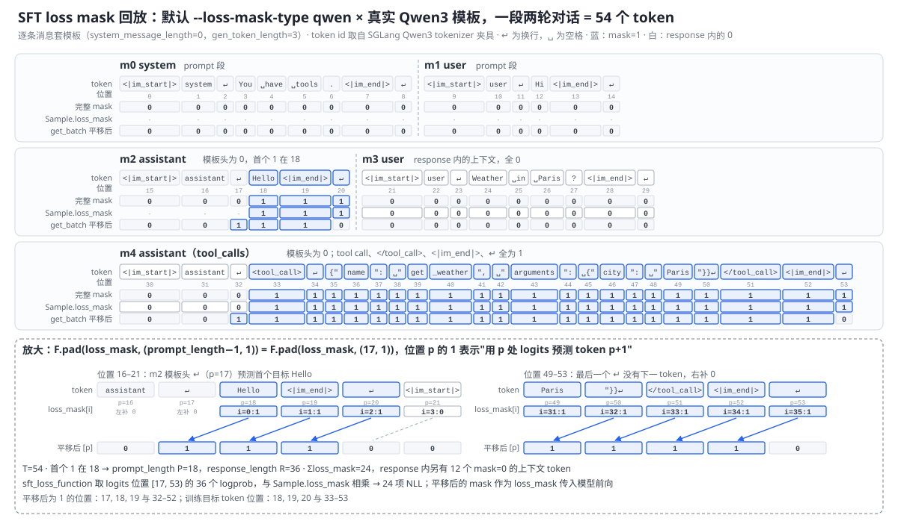
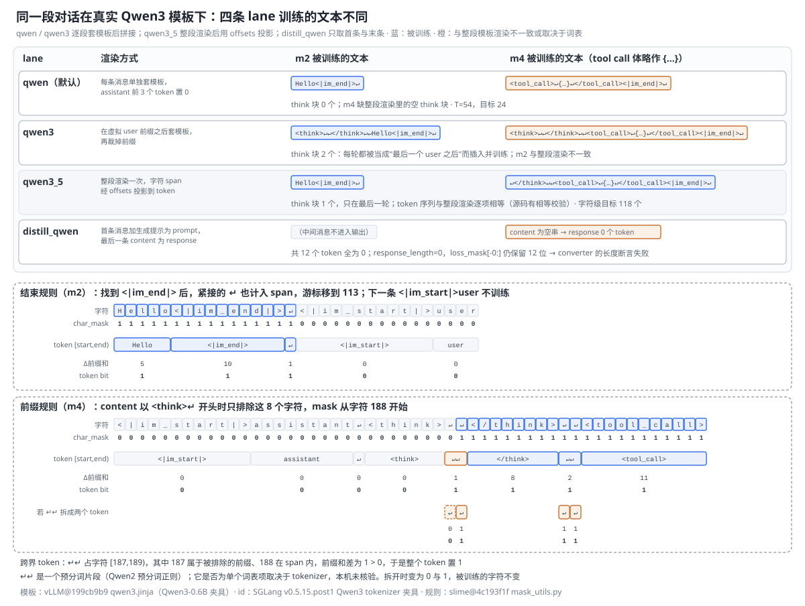

# slime SFT 路径与多轮 loss mask 分析

> **源码基线**：`THUDM/slime@4c193f1f37509cca70f0e88807a9305b70f63f4e`（`main`，2026-09-03）
> **源码基线**：`vllm-project/vllm@199cb9b964822e59ab9b58d88e7be31eb419a2ae`（`main`，2026-09-06）
> **源码基线**：`sgl-project/sglang@0b3bb0cbe31873994c9f989fddfe2f87ca839fdd`（`v0.5.15.post1`，2026-07-13）
> **主题**：本页依次讲 SFT 为什么借用 rollout 数据接口、官方配方怎样把消息变成 Sample、一段真实 Qwen3 模板对话的 token mask 回放与 next-token 平移、SFT loss，再讲四种 `--loss-mask-type` 的规则与差异、与 RL 共享的部件和入口选择，最后是长度包络、评估边界与成本。
> **适用范围**：仓内 `slime.rollout.sft_rollout` 的文本 SFT；Sample 字段与分母契约归 [[12_slime_sample_datasource_analysis|Sample 与 DataSource]]，DP 调度与训练步归 [[14_slime_megatron_training_analysis|Megatron 训练后端]]，归约与并行缩放归 [[15_slime_loss_parallelism_analysis|loss 与并行归约]]，多模态归 [[26_slime_multimodal_vlm_path_analysis|多模态 VLM 路径]]，评估归 [[27_slime_evaluation_path_analysis|评估路径]]。
> **最近更新**：2026-09-18。覆盖 SFT 入口与配方、基于真实模板与 tokenizer 夹具的 mask 回放与平移、四种 mask lane 的差异、长度包络，以及 `--debug-train-only` 下评估为空操作的边界。

SFT 已经有目标答案，不需要向推理服务采样；但多轮对话里的 system、user、tool 与模板头仍是预测答案所需的上下文。slime 因此把 SFT 做成一个返回 Sample 的 rollout 函数：保留整段对话的 token，只在 assistant 目标上置 1，然后复用既有的 converter、DP 调度与 Megatron loss。核心约束是 **"作为上下文存在"与"作为监督目标计入 loss"必须分开**，不能靠删掉零 mask token 来过滤。收益是不必另写 SFT trainer；代价是 mask 的正确性完全取决于所选 `--loss-mask-type` 与 checkpoint 模板是否匹配，而且这条路径不截断、不按长度过滤，超长对话只会被放进单独的 micro-batch。

## 1. 为什么 SFT 仍经过 rollout 数据接口

普通 RL 路径读取 prompt、调用生成器、计算 reward，再训练已采样的 response；SFT 路径读取完整消息，把给定的 assistant 内容直接当作 target。两者共有的困难仍然存在：变长序列要打包，DP ranks 必须以相同的 micro-batch 次数推进，CP 切片和 next-token 标签要对齐。

因此 `slime/rollout/sft_rollout.py::generate_rollout` 只替换"如何得到 Sample 的 tokens 与 mask"，返回之后仍由 RolloutManager 完成训练字典转换和 DP 分发。`reward=0` 只是满足共享字段契约的占位，SFT 的 NLL 不用 reward 构造目标。**设计分析**：另建一个 SFT trainer 会重复后半段调度与并行归约；保留 Sample 接口就能共用训练内核，但必须显式关闭不适用的优势计算和在线 rollout 引擎。

## 2. 普通路径：messages 如何变成训练 Sample

仓内有 4 个 SFT 配方：`scripts/run-qwen3-4B-base-sft.sh`、`scripts/run-qwen3-235B-A22B-sft.sh`、`scripts/run-qwen3.5-35B-A3B-sft.sh`、`examples/retool/retool_qwen3_4b_sft.sh`。它们都运行 `python3 train_async.py`，都以 `messages` 为输入列、都带 `--debug-train-only`，都没有开启 `--apply-chat-template`。这让 Dataset 保留消息列表，由 SFT 函数自己选择 mask 模板；若提前渲染成字符串，后面逐消息读取 `message["role"]` 就拿不到预期输入。只有 35B 配方显式选择 `--loss-mask-type qwen3_5`，其余三个用默认的 `qwen`。四个配方都没有写 `--n-samples-per-prompt`，取默认值 1。

`generate_rollout` 先断言不是 evaluation、且启用了 global dataset；加载并缓存 tokenizer、processor 和 `MultiTurnLossMaskGenerator` 之后，从 DataSource 取 `rollout_batch_size` 个 group。它对每个 group 做 `(sample,) = sample` 解包，因此要求一组恰好一条 Sample，对应 `n_samples_per_prompt=1`，不是 RL 常见的一个 prompt 配多个候选。

对每条 Sample：

1. 取 `sample.prompt` 消息列表和 `sample.metadata["tools"]`（没有 tools 时为 None）。
2. mask generator 返回完整 `token_ids` 与等长的完整 mask；长度不等直接 `ValueError`。
3. `get_response_lengths` 从 mask 的首个 1 数到末尾，得到 response span；首个 1 之前的前缀算 prompt。
4. 写入完整 `tokens`、`response_length`、`reward=0`，把 mask 裁成 response 尾部，按原分组结构返回。

这里不调用 SGLang `/generate`，不产生行为策略 logprob、finish reason 或在线 reward。`PROCESSOR` 虽被加载，当前 SFT 函数没有用它构造多模态训练张量，这不是一条完整的多模态 SFT 实现。

```text
train_async.py::train
|-- RolloutManager.generate(rollout_id)                    [Ray actor；debug_train_only 下 servers 为空]
|   |-- _get_rollout_data -> call_rollout_fn(sft_rollout.generate_rollout, evaluation=False)
|   |   |-- RolloutDataSource.get_samples(rollout_batch_size)
|   |   `-- MultiTurnLossMaskGenerator.get_loss_mask(messages, tools)   -> token_ids, 完整 mask
|   |       `-- get_response_lengths -> tokens / response_length / loss_mask[-R:]
|   |-- _convert_samples_to_train_data                     [断言 len(loss_mask) == response_length]
|   `-- _split_train_data_by_dp -> build_dp_schedule       [first-fit 打包，超长样本独占 micro-batch]
`-- MegatronTrainRayActor.train -> slime/backends/megatron_utils/model.py::train -> train_one_step
    `-- forward_step -> get_batch                          [F.pad(loss_mask, (P-1, 1))，CP 切片，PackedSeqParams]
        `-- loss_function -> sft_loss_function -> get_log_probs_and_entropy   [logits 窗口 [P-1, T-1)]
```

## 3. 一段真实模板对话的 mask 回放

### 3.1 例子与证据来源

下面这段两轮对话先问候，再问天气并以 tool call 作答：

```python
messages = [
    {"role": "system", "content": "You have tools."},
    {"role": "user", "content": "Hi"},
    {"role": "assistant", "content": "Hello"},
    {"role": "user", "content": "Weather in Paris?"},
    {"role": "assistant", "content": "", "tool_calls": [
        {"function": {"name": "get_weather", "arguments": {"city": "Paris"}}}]},
]
```

回放用到三份证据，边界各不相同：

- **mask 规则**是 slime 源码（`slime/utils/mask_utils.py`），图生成器逐条复现。
- **模板**取 vLLM 渲染器测试里的 Qwen/Qwen3-0.6B 模板夹具 `rust/src/chat/tests/templates/qwen3.jinja`。生成器只复现本例用到的子集，输出与 jinja2 按 HF `apply_chat_template` 环境渲染的结果逐字一致。具体 checkpoint 自带的模板是否与该夹具相同，要以 checkpoint 的 tokenizer 配置为准。
- **token id** 取 SGLang router 的 Qwen/Qwen3-30B-A3B tokenizer 对齐夹具（`experimental/sgl-router/tests/fixtures/tokenizer_parity/qwen3-30b/`），`<think>`、`</think>` 取 `Qwen3ThinkingBudgetLogitProcessor` 的常量。按 transformers `PRETOKENIZE_REGEX` 预分词后，三个夹具的片段与 id 一一对应。本节的 `qwen` 回放不含夹具以外的片段；第 4.2 节遇到的 `↵↵`（两个换行）是一个预分词片段，是否为单个词表项未在本机核验，图中两种切法都画出。

### 3.2 默认 `qwen` lane 的逐位回放

`qwen` lane 先用两条测试 user 消息推导出 `system_message_length=0` 与 `gen_token_length=3`（生成提示 `<|im_start|>assistant↵` 是 3 个 token），再逐条消息单独套模板：非 assistant 消息整段置 0；assistant 消息前 3 个 token 置 0，其余置 1。5 条消息依次得到 9、6、6、9、24 个 token，共 54 个 token，完整 mask 为：

```text
000000000000000000111000000000000111111111111111111111
```



逐位读图：

- 第一轮答案 `Hello` 在位置 18，是首个 1。它前面的 18 个 token（system、user 与 `<|im_start|>assistant↵`）构成 prompt，`prompt_length=18`、`response_length=36`。
- 两轮被训练的都不只是答案文本：`Hello` 之后的 `<|im_end|>` 与 `↵` 也是 1，tool call 之后的 `</tool_call>`、`<|im_end|>`、`↵` 同样是 1。模型因此学会在答案后输出结束标记。
- 位置 21–32 是第二个 user 轮与第二个模板头，它们落在 response 内但 mask 为 0。36 个 response token 里有 24 个目标 token，另 12 个只作上下文。
- `Sample.loss_mask` 是完整 mask 从位置 18 起的 36 位；`effective_response_length` 等于 24。
- 消息上的 `step_loss_mask` 不等于 1 时整条消息置 0。若只给 m2 加 `step_loss_mask: 0`，首个 1 后移到 m4 的 `<tool_call>`（位置 33），`response_length` 缩短为 21，目标 token 剩 21 个；被排除的答案留在 prompt 里继续作为上下文。

### 3.3 进入 next-token loss 时再对齐一次

Sample mask 对齐的是目标 token，模型输出对齐的是"当前位置预测下一个 token"。`slime/backends/megatron_utils/data.py::get_batch` 因此对每条样本执行 `F.pad(loss_mask, (prompt_length - 1, 1))`：左侧补 `prompt_length-1` 个 0，右侧补 1 个 0，再与 tokens 做同样的 CP 切片、拼接和补齐。本例是 `F.pad(loss_mask, (17, 1))`，平移后为 1 的位置是 17、18、19 与 32–52；位置 17 是 m2 模板头的 `↵`，它的 logits 预测 `Hello`；位置 53 是最后一个 `↵`，没有下一个 token，右补 0。

平移后的张量以 `full_loss_masks` 形式作为 `loss_mask` 参数传给模型前向（MTP 等依赖侧消费，见 [[21_slime_speculative_decoding_mtp_analysis|投机解码与 MTP]]）。SFT 的 NLL 走另一条等价路径：`get_log_probs_and_entropy` 先把 tokens 左移一位作为逐位置目标，再按 `total_lengths` 与 `response_lengths` 截取 logits 窗口 `[17, 53)`，得到 36 个 logprob，与未平移的 `Sample.loss_mask` 相乘，留下 24 项。两者表达同一个对齐：位置 p 的 1 表示 token p+1 是目标。

`sft_loss_function` 用共享的 `get_log_probs_and_entropy(..., with_entropy=False)` 取 ground-truth token 的 logprob，返回负的归约结果。官方配方都开 `--calculate-per-token-loss`；单条样本、单 rank 时它与默认 rollout 均值相同，多条不同长度样本则权重不同。记本例目标位置集合为 $S$（位置 18、19、20 与 33–53，共 24 个），单样本 loss 为：

$$
L_{\mathrm{SFT}}=-\frac{1}{24}\sum_{t\in S}\log p_\theta(x_t\mid x_{<t}).
$$

多样本时外层 token 分母按每条 mask 和至少计 1 的共享约定累加，完整规则见 [[15_slime_loss_parallelism_analysis|loss 与并行归约]]。没有本地 response token 的 rank 仍通过 `0 * logits.sum()` 保持 autograd 连通，不能独自跳过必要的 collective。

## 4. 模板决定 mask 算法，不能只凭模型名字猜

### 4.1 变体集合与各自规则

变体集合取自两处源码：`slime/utils/arguments.py` 中 `--loss-mask-type` 的 `choices=["qwen", "qwen3", "qwen3_5", "distill_qwen"]`（默认 `qwen`），以及 `MultiTurnLossMaskGenerator.get_loss_mask` 的分派。分派里还有一条隐式分支：`qwen` 在 tokenizer 的 added vocab 含 `<｜Assistant｜>` 时自动改走 `distill_qwen`。同一个 generator 的另一使用方是 `slime_plugins/rollout_buffer/rollout_buffer_example.py`，它把外部 buffer 返回的消息同样转成 Sample，归 [[19_slime_rollout_backend_extension_analysis|rollout 后端扩展]]。模板由 tokenizer 依赖提供，slime 能证明的只是下列调用、拼接与校验。

| 路径 | 如何生成 token 与 mask | 适用边界 |
|---|---|---|
| `qwen` | 用两条测试 user 消息推导默认 system 前缀长度和生成提示长度；逐条消息套模板，去掉重复的 system 前缀；assistant 跳过生成提示后置 1 | tokenizer 必须符合这套前缀分解假设；added vocab 含 `<｜Assistant｜>` 时改走 `distill_qwen` |
| `qwen3` | 用虚拟 user 前缀固定局部模板上下文：首段在后面追加前缀再裁掉，后续段在前面加前缀再裁掉；连续 tool 消息作为一组套模板 | 修复了连续 tool 的包装边界，但仍逐段构造，对依赖全对话位置的模板不普适 |
| `qwen3_5` | 整段 messages 渲染一次，再用 fast tokenizer 的 offsets 把 assistant 字符范围映射回 token | 要求 offsets；整段文本重新编码必须与 `apply_chat_template(..., tokenize=True)` 完全相同 |
| `distill_qwen` | 首条消息加生成提示作为 prompt，最后一条消息的 `content` 作为 response，分别编码后拼接 | 中间消息不进入输出；不能替代一般多轮监督 |

### 4.2 同一段对话在四条 lane 下训练的文本不同

Qwen3 模板有一条与轮次位置相关的规则：位于最后一个 user 查询之后的 assistant 轮，只有当它是最后一条消息、或带有非空的推理内容时，才渲染 `<think>…</think>` 块；最后一轮即使没有推理内容也会补一个空块，而不在最后且没有推理内容的轮次照常直接渲染。四条 lane 各自看到的"对话"不同，于是在上面的例子上得到四种结果（`distill_qwen` 见本节末段）：



- **`qwen`**：每条 assistant 消息单独渲染，前面没有 user，所以两轮都没有 think 块，共 54 个 token、24 个目标 token（第 3 节）。它与整段模板渲染的差别在 m4：整段渲染里的空 think 块在这里不存在。
- **`qwen3`**：每条 assistant 消息渲染在虚拟 user 前缀之后，每一轮都被当成"最后一个 user 之后"，于是两轮都插入空 think 块；`gen_token_length=3` 只跳过 `<|im_start|>assistant↵`，所以 `<think>↵↵</think>↵↵` 也被训练。m2 与整段渲染不一致。
- **`qwen3_5`**：整段渲染一次，think 块只出现在 m4。源码对重新编码的 token 与 `apply_chat_template(..., tokenize=True)` 做相等校验，所以它的 token 序列就是整段模板渲染的结果；字符级共有 118 个目标字符。

`qwen3_5` 的字符 mask 有两条规则，图中两条放大条逐字符复现：

- **结束规则**：从 `<|im_start|>assistant↵` 之后开始找 `<|im_end|>`，紧跟其后的 `↵` 也计入 span，游标移到 span 末尾（m2 是字符 113），下一条 `<|im_start|>user` 不训练。
- **前缀规则**：如果 content 以 `<think>↵` 开头，只排除这 8 个字符，后面的 reasoning、`</think>` 与答案都在 span 内；m4 的 mask 从字符 188 开始。

字符 mask 再按 offsets 投影到 token：token 的 `[start, end)` 内只要有一个字符为 1，整个 token 就是 1。m4 里空 think 块中间的 `↵↵` 占字符 `[187, 189)`，187 属于被排除的前缀，188 在 span 内，前缀和之差为 1，所以整个 token 置 1。若该 tokenizer 把两个换行切成两个 token，就变成 0 与 1；被训练的字符不变，token 计数随之变化。缺 offsets、重新编码不一致、找不到 assistant 头或结束标记，都会抛 `ValueError`。

另有两点同样由模板逻辑决定，按 jinja2 渲染核对过：用 vLLM 夹具里的 Qwen3.5-0.8B 模板（`rust/src/chat/tests/templates/qwen35.jinja`）时，默认 `qwen` lane 单独渲染 system 或 assistant 消息会触发模板里的 `raise_exception('No user query found in messages.')`；`distill_qwen` 在本例把 system 消息加生成提示作为 prompt，只取最后一条消息的 `content` 作为 response，而 tool call 在 `tool_calls` 字段里，`content` 是空串，于是得到 12 个 token 的全 0 mask，`response_length=0`，落入第 6.2 节的失败边界。**分析判断**：35B 配方显式指定 `qwen3_5`，与前一点一致；源码没有写明选择理由。

`tests/utils/test_loss_mask_type_qwen35.py` 用一个按字符切分的模拟 tokenizer 固定了四个模板契约：单轮时 `qwen3` 与 `qwen3_5` 一致（`test_qwen3_and_qwen3_5_match_on_single_turn_qwen35_data`）；多轮时 `qwen3` 给较早的答案虚构 think 块（`test_qwen3_and_qwen3_5_diverge_on_multi_turn_qwen35_data`）；tool call 流程下 `qwen3_5` 与期望 mask 一致（`test_qwen3_5_matches_expected_mask_for_tool_call_flow`）；连续 tool 回复时 `qwen3` 与整段模板一致（`test_qwen3_matches_full_template_for_consecutive_tool_responses`）。模拟 tokenizer 每个字符一个 token，测不到跨界 token；基线上已经没有依赖真实 tokenizer 下载的 mask 测试。真实 checkpoint 的验证路线是同时检查完整 token ids、`get_text_from_loss_mask` 选出的文本与 mask，只看长度相等不算通过。

### 4.3 多模态对齐 helper

`get_loss_mask_with_multimodal_alignment` 是一个独立 helper：先抽出文本消息求 mask，再在前面补 `len(input_ids) - len(text_mask)` 个 0，差值为负时断言失败。当前 `sft_rollout` 不调用它；即使调用，整体前置补零也不能自动证明任意交错的图像 token 逐位置对应。多模态数据路径见 [[26_slime_multimodal_vlm_path_analysis|多模态 VLM 路径]]。

## 5. 与 RL 共享哪些部分，如何选择入口

| 部件 | 本 SFT 路径 | 与 RL 的关系 |
|---|---|---|
| Dataset/DataSource | 读消息、shuffle、游标 checkpoint、按组返回 Sample | 共享；不读取 Megatron Dataset |
| 生成与 reward | 现成 target 编码，reward 写 0 | 替换 SGLang 在线采样与 reward model |
| converter | tokens、response length、mask、rollout ids、完整分母 | 共享；不依赖 RL 行为策略张量 |
| DP schedule/DataIterator | 按 rollout 分步、变长打包、分给 DP ranks | 共享；静态对齐断言、动态拆分和尾部裁剪照常生效 |
| advantage/ref/critic | 配方关闭默认 advantages/returns | 不运行 reward→advantage 路径 |
| loss/optimizer | `sft_loss` 负 logprob；Megatron pipeline 与 optimizer | 更换 token 目标，保留共享 reducer 与训练执行 |

从官方配方抽出的角色参数如下，模型、checkpoint、并行和资源参数仍需按环境提供：

```bash
--rollout-function-path slime.rollout.sft_rollout.generate_rollout
--input-key messages
--loss-type sft_loss
--calculate-per-token-loss
--disable-compute-advantages-and-returns
--debug-train-only
--rollout-batch-size 128
--global-batch-size 128
--use-dynamic-batch-size
--max-tokens-per-gpu 9216        # 35B 配方为 8192，并加 --loss-mask-type qwen3_5
```

配方用 `train_async.py`，但 `--debug-train-only` 改变了几乎所有与 serving 有关的行为：`parse_args` 的预解析跳过 SGLang 参数与校验；`_get_placement_group_layout` 只为 actor 申请 GPU；`RolloutManager.__init__` 不启动 rollout servers；`MegatronTrainRayActor.update_weights` 直接返回；`RolloutManager.eval` 直接返回。所以这里的 "rollout" 只是一次生成训练 Sample 的函数调用，不能把异步入口等同于在线采样。`train.py --debug-train-only` 在源码上同样能跑，但不是配方写法。DataSource 契约见 [[12_slime_sample_datasource_analysis|Sample 与 DataSource]]，训练资源与调度见 [[14_slime_megatron_training_analysis|Megatron 训练后端]]。

## 6. 长度包络、失败边界与成本

### 6.1 长度包络：不截断、不按长度过滤

| 环节 | 源码行为 | 违反时的后果 |
|---|---|---|
| 编码 | `sft_rollout.generate_rollout` 编码整段对话，不截断 | 整段长度原样进入训练 |
| 数据集过滤 | `Dataset` 只有在 `max_length`（即 `--rollout-max-prompt-len`，未设时由 `--rollout-max-context-len` 减 1 派生）非 None 时调用 `slime/utils/data.py::filter_long_prompt`；prompt 不是字符串时只记告警 `Skipping max_length check for list prompt. Set apply_chat_template=True to enable length filtering.` 并原样返回 | SFT 的 prompt 是消息列表，即使设了上限也不过滤；4 个配方两项都没设。改用 `--apply-chat-template` 会把 prompt 渲染成字符串，破坏 SFT 函数按消息取 `role` 的输入契约 |
| converter | 只断言 `len(loss_mask) == response_length`，不看总长 | 无长度守卫 |
| DP 调度 | `build_dp_schedule` 在动态 batch 下用 `first_fit_pack` 按 `max_tokens_per_gpu × cp_size` 装箱；模块 docstring 写明单条超过上限的样本独占一个 micro-batch，且只有它可以超过上限（`tests/test_dp_schedule.py::test_dynamic_oversized_sample_lands_alone`）；开 `--balance-by-flops` 时注释写明分区不保证 token 上限 | 超长对话照样训练，所在 micro-batch 的 token 数就是它自身长度 |
| `get_batch` | 只把 tokens 补齐到 TP 规模 × `--data-pad-size-multiplier` 的倍数 | 只加长，不截断 |
| Megatron 参数 | `slime/backends/megatron_utils/arguments.py::_set_default_megatron_args` 在未设时把 `seq_length` 填为 4096 占位，`max_position_embeddings` 缺省取它；`validate_args` 开启 `variable_seq_lengths` | slime 侧没有用它检查样本长度；超出位置编码长度时 Megatron 与模型侧如何表现属依赖边界，本页不断言 |

**分析判断**：由于全链路没有长度守卫，一条极长对话会让所在 micro-batch 的激活显存与该对话长度同阶，OOM 风险无法由 `--max-tokens-per-gpu` 兜住；可行的办法是训练前离线按 token 数过滤或切分数据。

### 6.2 失败边界

- **评估是静默空操作**：配方带 `--debug-train-only`，`RolloutManager.eval` 第一行就返回，即便配置了 `--eval-interval` 和评估数据、参数解析的"有 eval_interval 就必须有数据集"断言也已通过，训练过程中也不会产生任何 `eval/` 指标。即使去掉该开关，`--eval-function-path` 缺省回退到 SFT 函数，也会撞上 `assert not evaluation`。要评估 SFT 产出的 checkpoint，应另起一次**不带** `--debug-train-only` 的运行，走 [[27_slime_evaluation_path_analysis|评估路径]]的 SGLang 评估函数，例如 `train.py` 的 `--num-rollout 0 --eval-interval` 纯评估分支（分析判断，未运行验证）。
- **global dataset 关闭或 evaluation=True**：SFT 入口立即断言失败。
- **每个 prompt 不止一个 Sample**：`(sample,) = sample` 解包失败；这不是把同一监督自动用到 n 个候选上。
- **没有任何可训练 token**：`get_response_lengths` 返回 0，但 Python 的 `loss_mask[-0:]` 保留整条非空 mask，随后 converter 的 `len(loss_mask) == response_length` 断言失败。第 4.2 节的 `distill_qwen` 例子、全部 assistant 都带 `step_loss_mask: 0` 的对话都会走到这里；全零 mask 的非空对话不是该入口处理好的合法空 loss 样本。
- **模板参数不转发**：原始 messages 不预先套模板，当前函数只把 tools 传给 mask generator，没有转发 `sample.apply_chat_template_kwargs`。
- **`qwen3_5` 的三处 `ValueError`**：tokenizer 不提供 offsets、整段文本重新编码与 `apply_chat_template(..., tokenize=True)` 不一致、找不到 assistant 头或 `<|im_end|>`。
- **rollout 温度也作用于 SFT logprob**：`get_log_probs_and_entropy` 在 `rollout_temperature != 1.0` 时先把 logits 除以它，`sft_loss_function` 不绕开这一步。配方保持默认 1.0；若在 SFT 运行里设置了 `--rollout-temperature`（该参数在解析期要求大于 0），NLL 会在缩放后的分布上计算（源码推导）。
- **多模态**：SFT 实例加载 processor，却不产出 `multimodal_train_inputs`，也不调用多模态对齐 helper；多模态监督必须另行验证处理与 token 对齐边界。

### 6.3 成本账

| 维度 | 来源 | 说明 |
|---|---|---|
| CPU 编码 | `qwen` 每条消息套一次模板并编码；`qwen3` 每条消息多带一段虚拟前缀；`qwen3_5` 对整段对话渲染、编码两次再做字符前缀和 | 在 RolloutManager actor 内同步执行，每轮 `rollout_batch_size` 条对话；源码没有给出耗时数据 |
| 训练计算 | 上下文 token（本例 response 内 12 个 mask=0）照常参与前向与反向 | mask 只减少 loss 项，不减少计算 |
| 显存 | 单条对话不截断，超长样本独占 micro-batch | 激活峰值由最长对话决定（6.1 节） |
| 补齐 | `get_batch` 按 TP 与补齐倍数填 0 | 少量额外 token |
| 省掉的部分 | `--debug-train-only` 不申请 rollout GPU、不启动 SGLang、不做权重同步 | 这是 SFT 复用 RL 管线时最大的节省 |

收益是保留真实监督位置并复用整套训练内核；代价集中在模板匹配的正确性风险和缺少长度守卫。

## 7. 源码阅读路线与验证入口

| 读者问题 | 稳定源码锚点 |
|---|---|
| SFT 如何进入共享管线 | `scripts/run-qwen3-4B-base-sft.sh`、`scripts/run-qwen3.5-35B-A3B-sft.sh`；`train_async.py::train`；`slime/ray/rollout.py::RolloutManager.generate / _get_rollout_data`；`slime/rollout/sft_rollout.py::generate_rollout` |
| `--debug-train-only` 关掉了什么 | `slime/utils/arguments.py::parse_args / _pre_parse_mode`；`slime/ray/placement_group.py::_get_placement_group_layout`；`slime/ray/rollout.py::RolloutManager.__init__ / RolloutManager.eval`；`slime/backends/megatron_utils/actor.py::MegatronTrainRayActor.update_weights` |
| messages 如何保持结构、为何不过滤 | `slime/rollout/data_source.py::RolloutDataSource.__init__ / get_samples`；`slime/utils/data.py::Dataset.__init__ / filter_long_prompt` |
| assistant span 如何定位 | `slime/utils/mask_utils.py::MultiTurnLossMaskGenerator.get_loss_mask / get_system_message_length / gen_multi_turn_loss_mask_qwen / gen_multi_turn_loss_mask_qwen3 / gen_multi_turn_loss_mask_qwen3_5 / gen_multi_turn_loss_mask_distill_qwen / get_text_from_loss_mask` |
| response 长度、零 mask 与转换断言 | `slime/utils/mask_utils.py::get_response_lengths`；`slime/ray/rollout.py::RolloutManager._convert_samples_to_train_data` |
| 打包与超长样本 | `slime/ray/rollout.py::RolloutManager._split_train_data_by_dp`；`slime/utils/dp_schedule.py::build_dp_schedule / _pack_step_into_mbs`；`slime/utils/seqlen_balancing.py::first_fit_pack`；`tests/test_dp_schedule.py::test_dynamic_oversized_sample_lands_alone` |
| next-token 对齐与 NLL | `slime/backends/megatron_utils/actor.py::MegatronTrainRayActor.train`；`slime/backends/megatron_utils/model.py::train / train_one_step`；`slime/backends/megatron_utils/data.py::get_batch`；`slime/backends/megatron_utils/loss.py::loss_function / sft_loss_function / get_log_probs_and_entropy / _build_shifted_tokens / _extract_per_sample` |
| 模板测试能证明什么 | `tests/utils/test_loss_mask_type_qwen35.py::test_qwen3_and_qwen3_5_match_on_single_turn_qwen35_data / test_qwen3_and_qwen3_5_diverge_on_multi_turn_qwen35_data / test_qwen3_5_matches_expected_mask_for_tool_call_flow / test_qwen3_matches_full_template_for_consecutive_tool_responses` |
| 回放的依赖侧输入 | vLLM `rust/src/chat/tests/templates/qwen3.jinja`、`rust/src/chat/tests/templates/qwen35.jinja`；SGLang `experimental/sgl-router/tests/fixtures/tokenizer_parity/qwen3-30b/special_token_heavy.json`、`experimental/sgl-router/tests/fixtures/tokenizer_parity/qwen3-30b/multi_turn_with_tools.json`、`experimental/sgl-router/tests/fixtures/tokenizer_parity/qwen3-30b/short.json`，`python/sglang/srt/sampling/custom_logit_processor.py::Qwen3ThinkingBudgetLogitProcessor`；transformers 4.57.6 `transformers/models/qwen2/tokenization_qwen2.py::PRETOKENIZE_REGEX` |
| 图与数值回归 | `tools/figs/svg/slime_sft_loss_mask_figures.mjs`；`tools/figs/svg/lib/slime_sft_loss_mask_figures.test.mjs` |

## Related Pages

- [[12_slime_sample_datasource_analysis]] — SFT 复用的 Sample 字段、DataSource 游标与完整 mask 分母契约。
- [[14_slime_megatron_training_analysis]] — SFT 复用的 DP 调度、DataIterator 与 optimizer 生命周期。
- [[15_slime_loss_parallelism_analysis]] — NLL 如何进入统一的 token/rollout 归约和并行梯度缩放。
- [[27_slime_evaluation_path_analysis]] — 配方带 `--debug-train-only` 时评估为空操作，评估 SFT checkpoint 要另起不带该开关的运行走这条路径。
- [[26_slime_multimodal_vlm_path_analysis]] — 多模态处理器与训练张量边界，不能由文本 SFT 示例推出完整支持。
- [[11_megatron_dataset_analysis|Megatron-LM 数据入口]] — Megatron 自己的 SFT/变长数据集与 `cu_seqlens`、`PackedSeqParams` 打包；slime 不走这些 Dataset，只复用 `PackedSeqParams`，该页按更新的 `85902ef5` 分析，slime 镜像钉的是其祖先 `1dcf0daf`。
- [[29_megatron_packed_dataset_dynamic_cp_analysis|Megatron-LM 序列打包与动态 CP]] — Megatron 的 first-fit 打包与动态 CP 调度，可与 slime 自带的 `build_dp_schedule` 对照；同样按 `85902ef5` 分析。
