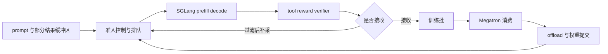

# slime Rollout 优化：先找关键路径，再调吞吐

> **源码基线**：`THUDM/slime@681b3adca54105d5ecd3fb822fa0dc58a427e0f9`（`main`，2026-08-12）
> **主题**：以训练闭环性能账本选择并发、超额采样、异步与发布参数；区分已有指标和需要自行采集的证据。
> **适用范围**：性能诊断；请求机制归 13，driver 时序归 10，DP 调度归 14，权重发布归 16。
> **最近更新**：2026-09-10。按固定源码核实接口、边界与诊断证据。

Rollout 优化不是寻找一个“最快开关”，而是先找出训练闭环中的瓶颈和权重更新关键路径，再只优化真正限制整体速度的部分。SGLang decode tok/s 只是局部服务速率；过滤或中止造成的无效工作、队列与长尾、训练器消费速度、显存卸载和权重发布、策略时效性，都可能让局部加速无法转化为单位时间内更多的有效梯度。

---

## 1. 问题背景：为什么汇总 tok/s 容易把优化方向带偏

slime 的一条训练数据不是“生成完 token 就结束”：请求还可能经过工具或 reward/verifier，按 group 被动态过滤，转换和调度后才被 trainer 消费；训练结束又要释放/恢复显存并发布新权重。同步入口把 generate、rollout offload、train、train offload、weight update 和 KV onload 串成明确的阶段序列。[`train.py:48-88`](https://github.com/THUDM/slime/blob/681b3adca54105d5ecd3fb822fa0dc58a427e0f9/train.py#L48-L88)

只看生成 token/s 至少会漏掉五件事：

1. **分子不对**：被 filter、abort 或超额生成的 token 增加了 serving tok/s，却没有进入 loss；
2. **统计单位不对**：RL 的约束常在完整 prompt group、rollout 或可训练 token，而非原始 completion token；
3. **分母不对**：trainer 等待、数据搬运、offload、权重发布都属于训练闭环 wall time；
4. **分布不对**：均值吞吐不显示 p95/p99 长尾与 batch barrier 浪费；
5. **目标不完整**：更老的 behavior policy、改变后的筛选分布或低精度误差可能换来更高吞吐，却降低单位样本价值。

诊断目标包括 accepted groups/s、进入 loss 的 token/s、attempted/accepted 比、生成与 reward 延迟分位数、queue age、trainer wait、权重版本年龄和端到端 step time；其中 accepted/attempted、queue age、trainer wait 和版本年龄需要自行埋点或关联日志计算，不能当成默认 W&B keys。动态 filter 已按 reason 计数 drop；SGLang metadata trace 还保留 queue time、端到端 latency、decode throughput 以及 PD 子阶段时长，可作为诊断入口。[`slime/rollout/filter_hub/base_types.py:40-52`](https://github.com/THUDM/slime/blob/681b3adca54105d5ecd3fb822fa0dc58a427e0f9/slime/rollout/filter_hub/base_types.py#L40-L52) [`slime/utils/trace_utils.py:16-44`](https://github.com/THUDM/slime/blob/681b3adca54105d5ecd3fb822fa0dc58a427e0f9/slime/utils/trace_utils.py#L16-L44)

## 2. 为什么这么设计：四个更简单的做法为什么在固定基线里被排除

先把权衡放在机制前面。下表每一行都是一个更容易解释的做法；固定基线一个都没有采用，而是把每一层的容量上限保留成互不合并的独立边界。

| 更简单的做法 | 它简单在哪 | 固定基线的实际边界 | 现方案付出的代价 |
|---|---|---|---|
| 用一个并发上限同时限制生成、hook 与 reward | 一个旋钮就能表达“整条 rollout 的并发” | `generate_and_rm` 的信号量只包住生成块，sample hook 与 reward 调用都在信号量释放之后执行。[`slime/rollout/sglang_rollout.py:245-287`](https://github.com/THUDM/slime/blob/681b3adca54105d5ecd3fb822fa0dc58a427e0f9/slime/rollout/sglang_rollout.py#L245-L287) | 生成并发不再等于端到端并发，下游 RM/tool 必须单独定容 |
| 等一整批请求全部生成完再交给训练 | batch 组成确定，没有完成顺序造成的选择偏差 | 主循环用 `FIRST_COMPLETED` 逐批消费，凑满 `rollout_batch_size` 后 abort 其余请求。[`slime/rollout/sglang_rollout.py:407-451`](https://github.com/THUDM/slime/blob/681b3adca54105d5ecd3fb822fa0dc58a427e0f9/slime/rollout/sglang_rollout.py#L407-L451) | 引入 latency selection bias，以及 abort/drain 屏障 |
| 由 slime 自己按在途请求数指定 worker | 客户端能看到每个 rank 的 in-flight 数，负载均衡最直观 | `dp_rank_context` 只维护本地计数并 `yield dp_rank`，默认路径把它接成 `as _`，rank 不进入请求。[`slime/rollout/sglang_rollout.py:119-129`](https://github.com/THUDM/slime/blob/681b3adca54105d5ecd3fb822fa0dc58a427e0f9/slime/rollout/sglang_rollout.py#L119-L129) [`slime/rollout/sglang_rollout.py:250`](https://github.com/THUDM/slime/blob/681b3adca54105d5ecd3fb822fa0dc58a427e0f9/slime/rollout/sglang_rollout.py#L250) | 只能通过 session key 影响路由，worker 选择权在 router |
| 让 colocate 部署也把生成与训练重叠起来 | 不需要额外 GPU 就能拿到 overlap | 异步训练入口第一行就断言禁止 colocate。[`train_async.py:11`](https://github.com/THUDM/slime/blob/681b3adca54105d5ecd3fb822fa0dc58a427e0f9/train_async.py#L11) | overlap 必须以两组独立资源为前提 |
| 把已完成但未使用的样本全部退回 buffer | 不浪费任何已经付出的生成成本 | 源码在写入 `data` 之前用 NOTE 明确当前没有这样做。[`slime/rollout/sglang_rollout.py:438-442`](https://github.com/THUDM/slime/blob/681b3adca54105d5ecd3fb822fa0dc58a427e0f9/slime/rollout/sglang_rollout.py#L438-L442) | 超额采样的多余工作被直接丢弃 |

> [!note] 推断
> 上表第三列全部是源码事实：信号量作用域、`FIRST_COMPLETED` 循环、被丢弃的 `dp_rank`、colocate 断言、NOTE 注释。但**源码只写下了这些边界，没有陈述做出取舍的理由**，因此下面这条判据是据行为重建，不是项目作者原话：准入、生成、后处理/RM、训练消费四个环节的服务时间分布互不相同，把它们合成一个端到端旋钮会让任何一处供给不足都表现为“整体变慢”，从而无法定位；把每层上限拆成独立参数，代价是使用者必须自己按层测量，收益是每个瓶颈都能被单独证伪。本页第 3–6 节正是按这四层展开。

## 3. 容量估算：先判断哪个环节供给不足

### 3.1 请求处理速率与准入控制

把 group 作为调度单位。对 group $j$：

- $Q_j$：进入生成临界区之前的等待时间；
- $S_{\mathrm{gen},j}$：prefill/decode 的主动服务时间；
- $S_{\mathrm{post},j}$：离开生成临界区后的 hook、reward/verifier 主动服务时间；tool 若在 custom generate 内执行，则计入 $S_{\mathrm{gen},j}$；
- $a_j\in\{0,1\}$：该 group 最终是否被接收。

若准入速率为 $\lambda_{\mathrm{in}}$，各服务可持续处理分组的速率为 $\mu_{\mathrm{gen}}$、$\mu_{\mathrm{post}}$，要稳定运行首先要求：

$$
\lambda_{\mathrm{in}}
<
\min\left(\mu_{\mathrm{gen}},\mu_{\mathrm{post}}\right).
$$

这不是源码中的 scheduler 公式，而是**容量分析模型**。它提醒我们：提高生成并发只会提高 $\lambda_{\mathrm{in}}$ 或尝试填满 $\mu_{\mathrm{gen}}$；若 reward/tool 已经更慢，结果只会把等待从 SGLang 前移到下游。

固定实现正好体现了这条边界：信号量只包住默认/自定义生成阶段，样本钩子与 reward 计算位于信号量之外。[`slime/rollout/sglang_rollout.py:224-287`](https://github.com/THUDM/slime/blob/681b3adca54105d5ecd3fb822fa0dc58a427e0f9/slime/rollout/sglang_rollout.py#L224-L287) 因而 `sglang_server_concurrency` 是生成侧的准入并发上限，不是整个 rollout 流程的端到端并发上限；自定义工具循环是否占用这个信号量，取决于它是否在自定义生成函数内部完成。

### 3.2 有效训练批次的准备时间与长尾代价

设目标 batch 需要 $B$ 个 accepted groups，$t_B$ 是第 $B$ 个有效 group 完成筛选的时刻，$T_{\mathrm{drain}}$ 是随后 abort、等待 pending task 收敛和回收 partial 的时间，则：

$$
T_{\mathrm{rollout}}
=
t_B+T_{\mathrm{drain}}.
$$

同步循环不是等待最慢候选自然完成：它用 `FIRST_COMPLETED` 逐批消费结果，凑满 $B$ 后 abort 剩余请求；但 abort 仍会等待 pending tasks 返回，决定是否回收 partial group。[`slime/rollout/sglang_rollout.py:407-451`](https://github.com/THUDM/slime/blob/681b3adca54105d5ecd3fb822fa0dc58a427e0f9/slime/rollout/sglang_rollout.py#L407-L451) [`slime/rollout/sglang_rollout.py:339-371`](https://github.com/THUDM/slime/blob/681b3adca54105d5ecd3fb822fa0dc58a427e0f9/slime/rollout/sglang_rollout.py#L339-L371)

因此长尾成本不只是最慢 response latency，还包括：

- 被慢 group 占住的 in-flight capacity；
- 已生成但最终未接收的 token、tool 与 RM 成本；
- batch 满后 abort/drain 的 barrier；
- partial 恢复时保留旧上下文或跨版本 token 的成本。

### 3.3 训练闭环关键路径

对同步入口，用下面的分解比“rollout tok/s”更接近真实目标：

$$
\begin{aligned}
T_{\mathrm{step}}^{\mathrm{sync}}
&=T_{\mathrm{rollout}}
 +T_{\mathrm{data}}
 +T_{\mathrm{train}} \\
&\quad
 +T_{\mathrm{offload}}
 +T_{\mathrm{publish}}.
\end{aligned}
$$

这里 $T_{\mathrm{data}}$ 包含 Sample 到 trainer 的转换与搬运；$T_{\mathrm{offload}}$ 包含 colocate 的模型/KV 时分复用；$T_{\mathrm{publish}}$ 是更新推理副本所需的提交阶段。它们的具体协议分别由 [[12_slime_sample_datasource_analysis|Sample/DataSource]]、[[14_slime_megatron_training_analysis|Megatron 训练]]和 [[16_slime_weight_sync_analysis|权重同步]]解释，本页只把它们放回同一性能账本。

再定义 $T_{\mathrm{wait,train}}$ 为“trainer 已可运行、但下一批 accepted data 尚未就绪”的空闲区间。同步入口中这段等待被阶段串行结构吸收，近似落在 $T_{\mathrm{rollout}}+T_{\mathrm{data}}$；warm queue 与 phase overlap 的直接目标才是压缩 $T_{\mathrm{wait,train}}$，而不是凭空降低请求服务时间。

若 generation N+1 与 training N 使用独立资源重叠，理想下界才接近：

$$
T_{\mathrm{cycle}}^{\mathrm{overlap}}
\gtrsim
\max\left(T_{\mathrm{rollout}}+T_{\mathrm{data}},T_{\mathrm{train}}\right)
+T_{\mathrm{fence}}
+T_{\mathrm{publish}}.
$$

这是**分析下界**而非源码计时公式。producer arm 必须包含 $T_{\mathrm{data}}$：`RolloutManager.generate()` 在取得 rollout data 后，还会完成 Sample → train dict 转换和 DP split 才返回 future；`train_async.py` 又在开始当前轮训练前等待该 future。[`slime/ray/rollout.py:590-604`](https://github.com/THUDM/slime/blob/681b3adca54105d5ecd3fb822fa0dc58a427e0f9/slime/ray/rollout.py#L590-L604) [`train_async.py:31-53`](https://github.com/THUDM/slime/blob/681b3adca54105d5ecd3fb822fa0dc58a427e0f9/train_async.py#L31-L53)

式中的 $T_{\mathrm{fence}}$ 也不能假设为零：`train_async.py` 在发布新权重前仍等待下一轮 generation future 完成，避免生成中途换权重；该入口还直接禁止 colocate。[`train_async.py:66-70`](https://github.com/THUDM/slime/blob/681b3adca54105d5ecd3fb822fa0dc58a427e0f9/train_async.py#L66-L70) [`train_async.py:9-12`](https://github.com/THUDM/slime/blob/681b3adca54105d5ecd3fb822fa0dc58a427e0f9/train_async.py#L9-L12)

> **设计分析**：overlap 消掉的是“两阶段串行空洞”，不是两个阶段本身的工作量。若 rollout 与转换之和比 training 慢很多，trainer 仍等待；若 training 更慢，warm queue 只会积累更老的样本。若两边争用网络、CPU、存储或功耗预算，重叠甚至可能让 $\max(T_{\mathrm{rollout}}+T_{\mathrm{data}},T_{\mathrm{train}})$ 变大。

## 4. 服务侧旋钮：只在生成服务真是瓶颈时使用

### 4.1 请求并发：修复欠载，不是越大越好

`GenerateState` 把 semaphore 容量设为“每 engine 并发 × engine 数”，group 作为 task 提交，而同一 group 的 samples 再并发生成。[`slime/rollout/sglang_rollout.py:83-149`](https://github.com/THUDM/slime/blob/681b3adca54105d5ecd3fb822fa0dc58a427e0f9/slime/rollout/sglang_rollout.py#L83-L149) 它适合修复低并发导致的 GPU bubble，前提是 KV cache、HTTP、tool/RM 和 host 线程仍有余量。

反例不是假设：项目 Qwen3 示例明确警告，单 server 并发超过默认 CUDA graph 并发 160 会影响推理速度，并建议限制 `sglang_server_concurrency` 或扩充 graph batch size。[`docs/zh/examples/qwen3-4B.md:281-290`](https://github.com/THUDM/slime/blob/681b3adca54105d5ecd3fb822fa0dc58a427e0f9/docs/zh/examples/qwen3-4B.md#L281-L290)

### 4.2 本地 DP 计数不等于路由器实际采用的负载均衡

源码里的 `dp_rank_context()` 会在当前计数最小的 rank 候选集合内用 `np.random.choice` 随机选择 并维护 in-flight count。[`slime/rollout/sglang_rollout.py:113-129`](https://github.com/THUDM/slime/blob/681b3adca54105d5ecd3fb822fa0dc58a427e0f9/slime/rollout/sglang_rollout.py#L113-L129) 但在固定基线的默认路径中，yield 出来的 rank 被写成 `as _`，HTTP payload 仍只发到 router `/generate`，没有携带该 rank；唯一显式的 worker-affinity 信息是 consistent-hashing 时的 session header。[`slime/rollout/sglang_rollout.py:245-262`](https://github.com/THUDM/slime/blob/681b3adca54105d5ecd3fb822fa0dc58a427e0f9/slime/rollout/sglang_rollout.py#L245-L262) [`slime/rollout/sglang_rollout.py:152-203`](https://github.com/THUDM/slime/blob/681b3adca54105d5ecd3fb822fa0dc58a427e0f9/slime/rollout/sglang_rollout.py#L152-L203)

> [!warning] 源码事实与常见表述的边界
> 不能据此把“在途请求最少的 rank”写成默认请求实际采用的负载均衡算法。slime 在这里负责准入控制与可选的会话亲和；路由器如何在 worker 之间选择请求属于 SGLang/Model Gateway 的实现边界，需要另外固定 SGLang 版本后分析。

这也给出了调参顺序：先看各 worker 的队列、KV 占用和延迟是否失衡；若是会话亲和导致热点，调整路由策略或 key；若所有 worker 都利用不足，再提高 slime 的准入并发数。

### 4.3 PD、投机/MTP 与低精度分别消除不同资源瓶颈

| 方案 | 它真正减少的瓶颈 | 使用前提 | 新成本与反例 |
|---|---|---|---|
| PD disaggregation | prefill 与 decode 资源比例不匹配、长上下文/多轮的阶段干扰 | 两阶段确实需要不同 TP、显存或 runtime；有可观测的 PD 分段时间 | 增加 router、KV transfer 与拓扑运维；短单轮任务可能被传输/调度开销反噬 |
| speculative decode | target model 的逐 token decode 次数 | draft acceptance 足够高，验证 kernel 与 batch 形态合适 | draft 与验证也耗时；policy 漂移导致 acceptance 降低时可出现负收益 |
| 在线 MTP | RL 中 draft/target 漂移造成的 speculative 退化 | checkpoint、模型映射、训练与发布路径都支持 MTP | 多一项训练 loss 与同步状态；若 draft 更新没跟上 actor，局部功能开启也不能保证收益 |
| rollout 低精度 | 权重/KV 的显存容量或带宽压力 | 硬件、kernel、量化配置与精度门禁已验证 | 量化/转换/一致性成本；原本 compute-bound 或不兼容 kernel 时未必加速 |

项目文档把 PD 的目标定位在 long-context、multi-turn、decode long tail 及异构 prefill/decode 配置，并明确短单轮任务用 regular layout 更简单。[`docs/zh/advanced/pd-disaggregation.md:3-15`](https://github.com/THUDM/slime/blob/681b3adca54105d5ecd3fb822fa0dc58a427e0f9/docs/zh/advanced/pd-disaggregation.md#L3-L15) 它还把 prefill/decode transfer 与 queue 暴露成独立 trace 段，因而应先用这些阶段指标证明 PD 值得启用，而不是凭 workload 名称猜测。[`slime/utils/trace_utils.py:26-44`](https://github.com/THUDM/slime/blob/681b3adca54105d5ecd3fb822fa0dc58a427e0f9/slime/utils/trace_utils.py#L26-L44)

投机解码的项目文档明确指出：RL 使草稿模型与目标模型的分布逐渐漂移时，通过验证的草稿 token 会减少，投机解码甚至可能带来负收益；在线训练 MTP 正是为了缓解这个问题，而外部草稿模型训练在该基线中仍未完成。[`docs/zh/advanced/speculative-decoding.md:24-38`](https://github.com/THUDM/slime/blob/681b3adca54105d5ecd3fb822fa0dc58a427e0f9/docs/zh/advanced/speculative-decoding.md#L24-L38) 同步边界与基线缺口见 [[21_slime_speculative_decoding_mtp_analysis|投机解码/MTP 专题]]。

低精度文档把 BF16 training + FP8 rollout 列为推荐路径，并说明 FP8 KV cache 只改变 rollout 侧容量，实际精度/性能依赖 SGLang 版本和 GPU stack。[`docs/zh/advanced/low-precision.md:3-16`](https://github.com/THUDM/slime/blob/681b3adca54105d5ecd3fb822fa0dc58a427e0f9/docs/zh/advanced/low-precision.md#L3-L16) [`docs/zh/advanced/low-precision.md:44-52`](https://github.com/THUDM/slime/blob/681b3adca54105d5ecd3fb822fa0dc58a427e0f9/docs/zh/advanced/low-precision.md#L44-L52) 训练、rollout、KV 和通信精度不能合并成一个开关，详见 [[22_slime_low_precision_training_rollout_analysis|低精度专题]]。

## 5. 调度侧参数：目标是减少资源利用不足和长尾浪费

### 5.1 优先取已完成样本、超额采样与动态过滤

默认循环按完成顺序接收 group 并整批补采；完整过程与数值例子见 [[13_slime_sglang_rollout_engine_analysis#4.6 四组候选如何得到两组训练数据|候选采样时间线]]。调优时关注 `--over-sampling-batch-size` 引起的在途容量阶跃。[`slime/rollout/sglang_rollout.py:400-436`](https://github.com/THUDM/slime/blob/681b3adca54105d5ecd3fb822fa0dc58a427e0f9/slime/rollout/sglang_rollout.py#L400-L436) 这一组合解决的是“有效 batch 被 filter 打空”和“等待整批最慢任务”，不是减少单个 group 的服务时间。

令尝试 group 数为 $N_{\mathrm{attempt}}$，接收数为 $N_{\mathrm{accept}}$，进入 loss 的有效 token 数为 $N_{\mathrm{loss}}$。更有意义的两个效率量是：

$$
\eta_{\mathrm{accept}}
=
\frac{N_{\mathrm{accept}}}{N_{\mathrm{attempt}}},
\qquad
R_{\mathrm{productive}}
=
\frac{N_{\mathrm{loss}}}{T_{\mathrm{wall}}}.
$$

若 oversampling 提升 aggregate tok/s，却让 $\eta_{\mathrm{accept}}$ 下降且 $R_{\mathrm{productive}}$ 不升，它只是在更快地产生废弃工作。固定实现还明确注明：凑满 batch 后，并没有把所有已完成但未使用的 samples 放回 buffer。[`slime/rollout/sglang_rollout.py:438-451`](https://github.com/THUDM/slime/blob/681b3adca54105d5ecd3fb822fa0dc58a427e0f9/slime/rollout/sglang_rollout.py#L438-L451)

> **设计分析**：first-completed 本身只改变结果消费顺序；当 batch 以“最早完成且通过 filter”为准截断时，latency 与题目难度、工具轮数或 reward 相关，就可能产生 latency selection bias。严格 filter 又会改变训练分布。两者都应把 drop reason、长度、reward、source 与 latency 做联合分桶，而不是只报保留率。

fallback filter 在候选不足时保留本来被拒绝的 group，以免再启一轮 oversampling；这是用数据准则换等待时间，而非“等价加速”。源码把该语义编码为 `keep_when_insufficient`。[`slime/rollout/filter_hub/base_types.py:5-24`](https://github.com/THUDM/slime/blob/681b3adca54105d5ecd3fb822fa0dc58a427e0f9/slime/rollout/filter_hub/base_types.py#L5-L24)

### 5.2 partial：回收已做的工作，不会消灭版本代价

partial 在 batch 已满后回收 unfinished group，下轮只生成剩余 token budget；可选开关把旧 response mask 清零，只训练新 on-policy token。[`slime/rollout/sglang_rollout.py:339-371`](https://github.com/THUDM/slime/blob/681b3adca54105d5ecd3fb822fa0dc58a427e0f9/slime/rollout/sglang_rollout.py#L339-L371) [`slime/utils/arguments.py:456-474`](https://github.com/THUDM/slime/blob/681b3adca54105d5ecd3fb822fa0dc58a427e0f9/slime/utils/arguments.py#L456-L474)

它适合 response 很长、abort 已生成前缀成本高的场景。反例是短 response 或权重频繁发布：abort/序列化/恢复开销可能大于省下的 decode；开启 mask 后旧 token 仍占 context/KV 却不贡献梯度，不开启则要接受跨版本 behavior。token、metadata 与 buffer 的完整语义由 [[12_slime_sample_datasource_analysis|Sample/DataSource 专题]]说明。

### 5.3 Fully-async 是异步 driver 上的生产者替换

官方 recipe 同时要求 `train_async.py` 和 `--rollout-function-path slime.rollout.fully_async_rollout.generate_rollout_fully_async`：one-stage async 提供阶段重叠，替换函数提供跨 round 的 group 池与预热队列，二者叠加。后台并发和按缺口 drain 的机制归 [[13_slime_sglang_rollout_engine_analysis#4.7 Fully-async：在异步 driver 上保持后台 group 池|持续生产者]]，driver future 及权重更新等待的权威时序归 [[10_slime_end_to_end_iteration_analysis]]。

调优时同时记录日志中的 `queue_warm/queue_left` 和自行测量的 enqueue→dequeue 年龄；前者是文字日志，后者默认没有时间戳指标。当 trainer 更慢时，预热队列可能只增加样本陈旧度，未必减少 cycle time。它没有版本年龄上限；不支持 evaluation，跨 round 顺序 best effort，README 声明 partial resume 尚未接通。默认 dynamic filter 和轮末后处理位于被替换函数中，不能假定所有默认 hook 都继续工作。

## 6. 消费与提交侧：rollout 快了以后，瓶颈会移到哪里

### 6.1 训练器调度与数据传输

rollout batch 还要被 packing、对齐并分给 DP ranks。调度算法与约束以 [[14_slime_megatron_training_analysis]] 为准；本页只用实际 step 耗时和 batch size 判断消费侧是否饱和。[`slime/utils/dp_schedule.py:156-207`](https://github.com/THUDM/slime/blob/681b3adca54105d5ecd3fb822fa0dc58a427e0f9/slime/utils/dp_schedule.py#L156-L207)

- trainer 因变长样本 padding/不均衡而慢：再调 dynamic batch 或 `balance_data`；
- rollout manager 到 trainer 的大 tensor 搬运慢：比较 object store 与 NIXL；该开关只替换 CPU tensor transport。[`slime/utils/arguments.py:557-566`](https://github.com/THUDM/slime/blob/681b3adca54105d5ecd3fb822fa0dc58a427e0f9/slime/utils/arguments.py#L557-L566)
- 不要把 FLOPs balance 当无风险加速：参数说明明确警告它可产生超过 `max_tokens_per_gpu` 的 micro-batch 并 OOM。[`slime/utils/arguments.py:730-743`](https://github.com/THUDM/slime/blob/681b3adca54105d5ecd3fb822fa0dc58a427e0f9/slime/utils/arguments.py#L730-L743)

因此 producer 增发 token 前，应先确认 trainer 能否按相同 wall time 消费它们；否则只会把队列、CPU 内存和版本年龄推高。loss 的统计单位与并行不变量归 [[15_slime_loss_parallelism_analysis|loss/并行专题]]所有。

### 6.2 显存卸载与权重发布

同步入口在 generate 后 offload rollout、训练后 offload/clear trainer、再 update weights 并恢复 rollout KV，说明 colocate 本质是显存的时分复用，不是 generation/training 并行。[`train.py:53-88`](https://github.com/THUDM/slime/blob/681b3adca54105d5ecd3fb822fa0dc58a427e0f9/train.py#L53-L88) 若 $T_{\mathrm{offload}}+T_{\mathrm{publish}}$ 已占主导，继续优化 decode 不会显著降低 $T_{\mathrm{step}}$。

`--update-weights-interval` 默认 1；`--update-weight-buffer-size` 默认 `512 * 1024**2` 字节（512 MiB），限制分块缓冲大小。降低发布频率或改变 chunk buffer 都应同时检查版本年龄和峰值内存；源码参数只定义频率与 buffer，并不承诺这是免费性能。[`slime/utils/arguments.py:526-540`](https://github.com/THUDM/slime/blob/681b3adca54105d5ecd3fb822fa0dc58a427e0f9/slime/utils/arguments.py#L526-L540)

> **设计分析**：加大发布间隔直接把同步成本换成 behavior policy age；更大的 update buffer 也可能用峰值内存换调用次数。先测 pause/flush、转换、传输、load 与 resume 各段，再选择 transport 或 interval。完整提交协议、版本不变量与失败边界见 [[16_slime_weight_sync_analysis|权重同步专题]]。

## 7. 从症状到动作：决策矩阵

| 观测症状 | 现成 key 或明确需要自建的观测 | 候选参数/动作 | 前提与反例 |
|---|---|---|---|
| GPU 欠载、队列短 | `perf/request/queue_time/mean`、`perf/tokens_per_gpu_per_sec`；GPU 利用率需外部采集 | `--sglang-server-concurrency` | 同看 RM/tool 限流与 CUDA graph/KV 容量 |
| worker 严重失衡 | `perf/request/e2e_latency/max`；per-worker queue/KV 需采集 serving 指标 | `--router-policy`、`--sglang-dp-size` | 本地 dp_counts 不决定默认路由 |
| prefill/decode 比例错误 | `perf/prefill/forward_duration/mean`、`perf/decode/forward_duration/mean`、`perf/decode/transfer_duration/mean` | `--prefill-num-servers`、`--sglang-config` | 字段依赖服务返回 PD trace；短请求未必受益 |
| decode 主导 | `perf/decode/throughput/mean`、`rollout/spec_accept_rate` | `--sglang-speculative-algorithm`，MTP 见 21 | acceptance 足够高才有收益 |
| KV OOM 或容量受限 | `rollout/response_len/max`（统计 `effective_response_length`）、`rollout/truncated_ratio`；显存峰值需 profiler | `--rollout-max-context-len`、`--rollout-max-response-len`、`--rollout-num-gpus-per-engine` | 精度回退/量化仍需质量门禁 |
| filter 经常打空 batch | `rollout/dynamic_filter/drop_zero_std_0.0`（示例 reward 桶）、`rollout/zero_std/count_0.0` | `--over-sampling-batch-size`、`--dynamic-sampling-filter-path` | fallback 会改变筛选准则 |
| batch 满后长尾多 | `perf/rollout_time`、`rollout/response_len/max`；abort耗时/废弃tokens需自建 | `--partial-rollout`、`--mask-offpolicy-in-partial-rollout`；或 fully-async 函数 | partial 回收点不等于权重 commit |
| trainer 等数据 | `perf/rollout_time`；trainer ready→data ready 需自建计时 | `train_async.py`、`--rollout-function-path` | colocate 不支持 one-stage async |
| 完成队列持续积压 | `train/global_batch_size`；queue age/depth 从自建埋点与 fully-async 日志取 | `--use-dynamic-batch-size`、`--balance-data`、`--rollout-data-transport` | 先定位消费侧，FLOPs packing 可 OOM |
| 权重/显存切换耗时高 | `perf/rollout_time` 仅作对照；publish/offload 分段需 timer/trace | `--update-weight-buffer-size`、`--update-weights-interval`、`--offload-train`、`--offload-rollout` | 与版本年龄共同验收 |

### 7.1 参数怎样改变性能账本

`--rollout-max-prompt-len` 在 global dataset 初始化时过滤长 prompt；`--rollout-max-context-len` 控制 serving context cap；`--rollout-max-response-len` 控制生成预算。这三者默认解析值都是 None，不能把它们互当同一个长度。`--rollout-seed` 默认 42，复现实验应和 temperature/top-p 一起固定。`--rollout-num-gpus-per-engine`、`--sglang-dp-size` 与 PD/YAML 配置改变 engine 拓扑，详细放置归 11、请求配置归 13。

`--num-steps-per-rollout` 改变单批数据消费步数，`--keep-old-actor` 保留 rollout 对应的训练侧快照；它们影响吞吐也影响 old-policy 计算，机制归 14/17。健康检查用 `--rollout-health-check-first-wait`、`--rollout-health-check-interval`、`--rollout-health-check-timeout`，默认 0/30/30 秒；调超时不等于修复容量。`--rollout-sample-hook-path` 处于生成后 RM 前；`--rollout-sample-filter-path` 原地处理入选组，`--rollout-all-samples-process-path` 可审计已完成的拒绝组；三者均可能增加客户端开销，范围见 13。

### 7.2 现成性能指标的分母

`compute_perf_metrics_from_samples` 用整轮 `rollout_time` 做分母：`perf/tokens_per_gpu_per_sec` 对返回 Sample 的 response 长度求和再除 rollout GPU 数；`perf/effective_tokens_per_gpu_per_sec` 改用 effective response 长度。它们不是 serving 全部尝试 token/s，也未把 trainer/publish 时间纳入分母。`perf/longest_sample_tokens_per_sec` 和 `perf/longest_effective_sample_tokens_per_sec` 用最长样本长度除同一个 round time。非生成时间有正值时，另发 `perf/non_generation_time/{mean,median,min,max}` 与 longest-sample 对应项。

请求级聚合后缀只有 `mean/median/min/max`，p95/p99 需从原始 trace 自算；`perf/request/count` 和 `perf/request/profiled_count` 在该提交不输出。accepted groups/s、完整 attempted/accepted、loss token/s、完成队列年龄、版本年龄都需要自建，并明确采用 round 还是整个训练周期作分母。

紧凑阅读路线：`slime/ray/rollout.py::_log_rollout_data/compute_metrics_from_samples/compute_perf_metrics_from_samples/_compute_sglang_request_perf_metrics` → `slime/rollout/filter_hub/base_types.py::MetricGatherer.collect` → `slime/rollout/fully_async_rollout.py::_generate_rollout_async`；参数默认值读 `slime/utils/arguments.py::get_slime_extra_args_provider`，实际训练 key 前缀读 `slime/backends/megatron_utils/model.py::train`。

[[25_vime_vllm_backend_support_analysis|vime/vLLM 衍生实现]]改写了 rollout engine、请求和同步契约；同名优化旋钮不能直接沿用本页的 upstream slime 假设，应先做 backend contract 对照。

## 8. 最小可归因实验

### 8.1 先建立性能基线

固定 checkpoint、prompt 集、sampling 参数、reward/tool 服务版本和训练 batch 语义，记录：

- $T_{\mathrm{step}}$ 及 generate、postprocess、train、offload、publish 分段；
- attempted/accepted groups，$N_{\mathrm{loss}}$ 与 $\eta_{\mathrm{accept}}$；
- queue/e2e latency 的 p50、p95、p99，以及 abort/drain 时间；
- rollout queue depth/age、weight-version age；
- 各 SGLang worker 与 trainer rank 的 GPU、KV、网络和 host 利用率；
- filter drop reason、长度、reward、source 与 latency 的联合分布。

trace、健康检查和 debug replay 的具体能力与空白由 [[18_slime_fault_tolerance_observability_analysis|容错与观测专题]]维护。

### 8.2 每次只改变一个容量假设

1. **并发扫描**：逐级提高准入并发数，直到有效训练吞吐不再上升，或 p99/KV/RM 已经饱和；
2. **long-tail 消融**：分别比较同步、partial、fully async，报告废弃 token、queue age 与版本分布；
3. **服务优化消融**：PD、spec/MTP、低精度分别单独开关，不能一次全开后只报总 tok/s；
4. **consumer 消融**：固定 rollout data，比较 packing、DP balance 和 transport；
5. **overlap 消融**：比较串行和 `train_async.py`，同时检查阶段是否因资源争用各自变慢；
6. **发布消融**：分别测量显存卸载、格式转换、传输、加载和恢复服务；改变更新间隔时同步报告策略时效性和质量。

### 8.3 通过标准

一次优化只有同时满足以下条件才算端到端收益：

$$
R_{\mathrm{productive}}\uparrow,
\qquad
T_{\mathrm{step}}\downarrow,
\qquad
\text{quality/freshness invariants unchanged}.
$$

最后一项不是数学等式，而是验收约束：reward/长度/source 分布、policy age、重要性比率、精度一致性和训练曲线不能因为“更快”而悄悄换了实验。稳定性控制回路与症状归因见 [[31_slime_posttraining_stability_analysis|后训练稳定性专题]]。

## 9. 常见误读

| 误读 | 固定基线下的实际边界 |
|---|---|
| SGLang tok/s 上升就等于训练更快 | 数据还要经过过滤、训练器、显存卸载与权重发布；应看有效训练吞吐和每步耗时 |
| `sglang_server_concurrency` 是全 pipeline 并发 | semaphore 只覆盖 generation，reward/tool 可能成为下游瓶颈 |
| `dp_rank_context` 已实现默认 worker 负载均衡 | rank 在默认 HTTP 路径未进入 payload；实际 worker 选择交给 router |
| oversampling 只是补齐 batch，没有统计代价 | 它增加 attempted work，且完成速度与 filter 共同决定被接收分布 |
| 中断续生成会无损消除长尾 | 它需要在旧 token 是否参与梯度、上下文开销和策略时效性之间取舍 |
| fully async 等于 generation/training overlap | 官方方案是在 `train_async.py` 上叠加 fully-async rollout 函数；前者是 driver，后者改变后台生产者 |
| PD、spec、FP8 都是通用加速 | 三者分别针对阶段失衡、target decode、显存/带宽；前提不成立会负收益 |
| 增大发布间隔只是降低通信 | 它也增加 behavior policy age，必须与质量和一致性一起验收 |

## 10. 约束：本页结论在什么前提下成立，在什么条件下失效

性能页最容易被读成“一串可以随手打开的加速开关”。固定基线在四个方向上给出了明确边界。

### 10.1 覆盖前提

- 本页只覆盖 slime 侧的准入、调度、消费与提交。SGLang 内部 scheduler 与 kernel 不在源码基线内（见页头证据边界），因此“提高准入并发能否转成吞吐”最终仍取决于 slime 之外的一段。
- 阶段账本以同步入口的实际顺序为准：generate → offload rollout → train/save → offload train → onload weights → update weights → onload KV。[`train.py:53-88`](https://github.com/THUDM/slime/blob/681b3adca54105d5ecd3fb822fa0dc58a427e0f9/train.py#L53-L88) colocate 下这串顺序表达的是显存时分复用，不是并行。
- 生成侧并发上限是 `sglang_server_concurrency × 引擎数`，由 `GenerateState` 在进程内构造一次。[`slime/rollout/sglang_rollout.py:88-94`](https://github.com/THUDM/slime/blob/681b3adca54105d5ecd3fb822fa0dc58a427e0f9/slime/rollout/sglang_rollout.py#L88-L94) 它是进程级单例状态，不随单次 rollout 调用重建。

### 10.2 代价

- **超额采样的废弃工作不回收**：凑满目标 batch 后，已完成但未被采用的 group 不会退回 data buffer，源码用 NOTE 明确了这一点。[`slime/rollout/sglang_rollout.py:438-442`](https://github.com/THUDM/slime/blob/681b3adca54105d5ecd3fb822fa0dc58a427e0f9/slime/rollout/sglang_rollout.py#L438-L442)
- **abort 不是立即返回**：`abort()` 先请求 worker abort 并查 load（查询失败会提前结束检查，不能证明 idle），再循环 `asyncio.wait` 直到 pending task 全部返回；只有开启 partial 时才顺带回收部分样本。[`slime/rollout/sglang_rollout.py:339-361`](https://github.com/THUDM/slime/blob/681b3adca54105d5ecd3fb822fa0dc58a427e0f9/slime/rollout/sglang_rollout.py#L339-L361)
- **FLOPs 均衡不是免费加速**：`--balance-by-flops` 的参数说明自己写明它可能产生超过 `--max-tokens-per-gpu` 的 micro-batch 并 OOM，并强制依赖 `--use-dynamic-batch-size`。[`slime/utils/arguments.py:730-743`](https://github.com/THUDM/slime/blob/681b3adca54105d5ecd3fb822fa0dc58a427e0f9/slime/utils/arguments.py#L730-L743)
- **换 transport 不等于换掉全部搬运成本**：`--rollout-data-transport nixl` 只改变“已在 CPU 上 tensorize 的大字段”的传输方式。[`slime/utils/arguments.py:557-566`](https://github.com/THUDM/slime/blob/681b3adca54105d5ecd3fb822fa0dc58a427e0f9/slime/utils/arguments.py#L557-L566) 而 loss mask 目前仍是逐 token 的 Python list，逐样本构造后整体写进 train dict。[`slime/ray/rollout.py:783-797`](https://github.com/THUDM/slime/blob/681b3adca54105d5ecd3fb822fa0dc58a427e0f9/slime/ray/rollout.py#L783-L797)

### 10.3 故意不做的事

- fully-async worker **有意**不参与上层 pause/weight-update 信令，它唯一拥有的语义是把 ABORTED group 退回 data buffer；模块 docstring 用 “intentionally oblivious” 直接声明了这一点。[`slime/rollout/fully_async_rollout.py:17-24`](https://github.com/THUDM/slime/blob/681b3adca54105d5ecd3fb822fa0dc58a427e0f9/slime/rollout/fully_async_rollout.py#L17-L24)
- fully-async 入口直接拒绝 evaluation 模式，而不是降级处理。[`slime/rollout/fully_async_rollout.py:272-273`](https://github.com/THUDM/slime/blob/681b3adca54105d5ecd3fb822fa0dc58a427e0f9/slime/rollout/fully_async_rollout.py#L272-L273)
- 异步训练入口直接断言禁止 colocate，而不是在 colocate 下退化成串行。[`train_async.py:11`](https://github.com/THUDM/slime/blob/681b3adca54105d5ecd3fb822fa0dc58a427e0f9/train_async.py#L11)
- slime 不做 worker 级负载均衡：`dp_rank_context` 产出的 rank 在默认路径被丢弃。[`slime/rollout/sglang_rollout.py:250`](https://github.com/THUDM/slime/blob/681b3adca54105d5ecd3fb822fa0dc58a427e0f9/slime/rollout/sglang_rollout.py#L250)

### 10.4 失效条件

- 若 RM/tool 比生成更慢，提高 `sglang_server_concurrency` 不会提高有效吞吐，只会把排队从信号量之前移到信号量之后的 hook/RM 段——信号量在生成结束时就已释放。[`slime/rollout/sglang_rollout.py:245-287`](https://github.com/THUDM/slime/blob/681b3adca54105d5ecd3fb822fa0dc58a427e0f9/slime/rollout/sglang_rollout.py#L245-L287)
- 若关闭 partial，abort 循环只 drain 不回收，长尾请求已生成的 token 全部作废。[`slime/rollout/sglang_rollout.py:351-357`](https://github.com/THUDM/slime/blob/681b3adca54105d5ecd3fb822fa0dc58a427e0f9/slime/rollout/sglang_rollout.py#L351-L357)
- 若 dynamic filter 命中率低，补采是按 `over_sampling_batch_size` 整批提交的，在途请求数会阶跃上升，而不是平滑跟随缺口。[`slime/rollout/sglang_rollout.py:408-411`](https://github.com/THUDM/slime/blob/681b3adca54105d5ecd3fb822fa0dc58a427e0f9/slime/rollout/sglang_rollout.py#L408-L411)
- 若把 `--balance-by-flops` 与已经贴近上限的 `--max-tokens-per-gpu` 一起使用，收益（micro-batch 更均衡）与风险（超限 OOM）来自同一个机制，无法只取其一。[`slime/utils/arguments.py:730-743`](https://github.com/THUDM/slime/blob/681b3adca54105d5ecd3fb822fa0dc58a427e0f9/slime/utils/arguments.py#L730-L743)

## 11. 发展趋势：三处被源码自己标记的在途改动

本拍只写在固定基线中能直接读到锚点的待办，不写没有源码依据的路线图。

1. **训练数据里的 loss mask 还没有压缩。** 转换器逐样本构造 Python list 形式的 mask（缺省填 1，`remove_sample` 时整条填 0），再整体写进 train dict；这段代码上方就是 `TODO: compress the loss mask`。[`slime/ray/rollout.py:783-797`](https://github.com/THUDM/slime/blob/681b3adca54105d5ecd3fb822fa0dc58a427e0f9/slime/ray/rollout.py#L783-L797) 它正落在本页 $T_{\mathrm{data}}$ 这一项上。
2. **引擎重启时的端口分配粒度偏粗。** 源码注释写明：目前重启某个引擎时，会从该 rank 开始给本节点上后续所有引擎重新设置端口（8 卡上重启 3 号，会连带设置 3–7 号）。[`slime/ray/rollout.py:1003-1005`](https://github.com/THUDM/slime/blob/681b3adca54105d5ecd3fb822fa0dc58a427e0f9/slime/ray/rollout.py#L1003-L1005) 也就是说，单引擎恢复的影响半径大于一个引擎。
3. **rollout 步数仍由显式参数给出。** 数据参数区留有注释，设想改为“加 num_epoch 并从 buffer 推算 num_rollout”。[`slime/utils/arguments.py:607`](https://github.com/THUDM/slime/blob/681b3adca54105d5ecd3fb822fa0dc58a427e0f9/slime/utils/arguments.py#L607)

> [!note] 推断
> 上面三条注释本身是源码事实。由它们推出的方向——mask 压缩会直接压缩本页 $T_{\mathrm{data}}$ 这一项、端口分配收敛到单引擎粒度会缩小重启的影响半径——是本页依据当前代码结构作出的推断；源码只留下待办，没有陈述计划、优先级或时间。

## Related Pages

- [[13_slime_sglang_rollout_engine_analysis]] — 请求状态、router/server 分层、partial 与 streaming 的机制权威页。
- [[12_slime_sample_datasource_analysis]] — accepted sample、buffer 回收、partial token 与训练 dict 的语义边界。
- [[16_slime_weight_sync_analysis]] — 把 pause、flush、版本和 transport 解释为权重提交协议。
- [[21_slime_speculative_decoding_mtp_analysis]] — 在线 MTP 为何必须跟随 actor 版本，以及固定基线中的同步边界。
- [[22_slime_low_precision_training_rollout_analysis]] — 训练、权重、通信、rollout 与 KV 精度轴的独立风险。
- [[25_vime_vllm_backend_support_analysis]] — 更换 vLLM backend 后，容量与关键路径假设如何变化。
- [[31_slime_posttraining_stability_analysis]] — 性能优化改变数据分布、策略新鲜度或数值语义时如何定位。
