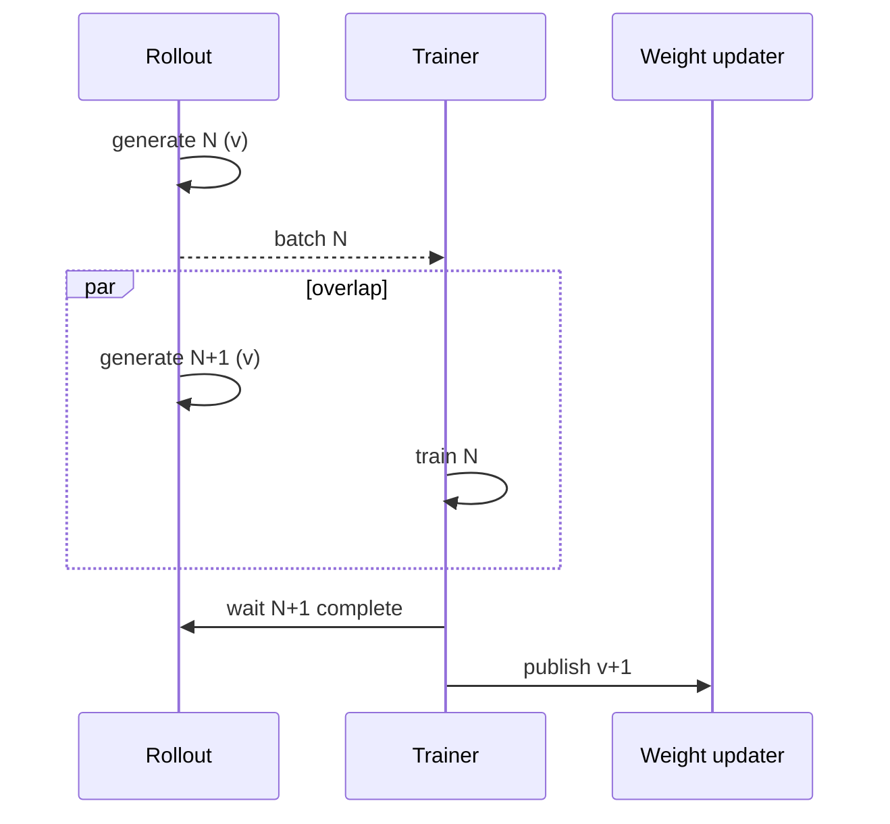

# slime Rollout 优化深潜

> **文档类型**：slime 段 3 横切专题 · Rollout/吞吐
> **源码基线**：slime `main@681b3adca54105d5ecd3fb822fa0dc58a427e0f9`
> **基线提交时间**：2026-08-12T16:50:12+07:00
> **核验日期**：2026-08-14
> **系列入口**：[[slime/index]]
> **结论先行**：slime 的 rollout 优化不是一个“异步开关”，而是六层叠加：SGLang 原生 serving、请求级并发、动态补采、partial/streaming 回收、跨轮 warm queue、train/generate phase overlap。越往后吞吐潜力越大，也越需要显式核算 selection bias、policy freshness 与无效生成成本。

---

## 1. 先建立吞吐账本

一轮 wall time 不能只写成 generation latency。更有用的分解是：

\[
T_{round}=T_{prompt/decode}+T_{reward/verifier}+T_{tail}+T_{data}+T_{train}+T_{weight}-T_{overlap}.
\]

slime 分别在这些项上提供：SGLang caching/routing/PD/spec decode；async semaphore 与 first-completed 消费；动态 oversampling/filter；NIXL 数据搬运；Megatron 动态 batch；NCCL/IPC/disk/delta 权重更新；以及 `train_async.py` 的 generate/train overlap。框架选择原生透传，意味着多数 serving 优化直接来自当前 SGLang，而 slime 自己重点处理 RL 的数据、同步和正确性。[`README_zh.md:36-50`](https://github.com/THUDM/slime/blob/681b3adca54105d5ecd3fb822fa0dc58a427e0f9/README_zh.md#L36-L50)

建议至少同时报告：

- accepted groups/s 与生成 token/s；
- 每个 accepted group 对应的 attempted/filtered/aborted groups；
- p50/p95/p99 generate 与 reward latency；
- queue age、sample weight-version 分布；
- train、rollout、weight-sync GPU 利用率与 overlap 比例。

否则“更快”可能只是多采后丢更多数据，或允许更旧的 behavior policy。

## 2. 第一层：请求级并发与 DP 负载均衡

`GenerateState` 把全局 semaphore 设成 `sglang_server_concurrency × rollout engine 数`，每个 group 作为 async task 提交；同一 group 内的 N 个 sample 又并发执行。SGLang DP rank 选择当前计数最小者，最小值并列时随机选一个。[`sglang_rollout.py:83-149`](https://github.com/THUDM/slime/blob/681b3adca54105d5ecd3fb822fa0dc58a427e0f9/slime/rollout/sglang_rollout.py#L83-L149) [`sglang_rollout.py:297-327`](https://github.com/THUDM/slime/blob/681b3adca54105d5ecd3fb822fa0dc58a427e0f9/slime/rollout/sglang_rollout.py#L297-L327)

这层优化的核心是隐藏单请求 latency，而不是改变训练语义。并发上限过低时 engine 吃不满；过高时排队、KV cache 与 reward/service backpressure 会把尾延迟放大。因此 `sglang_server_concurrency` 应基于 KV 容量、平均 prompt/response 长度和外部 RM 并发联合调，而不是只看 decode token/s。

确定性模式给 group 内第 i 个 sample 使用 `rollout_seed + i`，使并发调度顺序不改变组内采样随机流；它解决复现实验，不自动保证不同并发下 kernel 数值完全一致。[`sglang_rollout.py:94-111`](https://github.com/THUDM/slime/blob/681b3adca54105d5ecd3fb822fa0dc58a427e0f9/slime/rollout/sglang_rollout.py#L94-L111) [`sglang_rollout.py:317-325`](https://github.com/THUDM/slime/blob/681b3adca54105d5ecd3fb822fa0dc58a427e0f9/slime/rollout/sglang_rollout.py#L317-L325)

## 3. 第二层：first-completed、oversampling 与动态筛选

默认 rollout 循环以 `FIRST_COMPLETED` 消费已完成 group；只要有效 group 不足目标，就按 `over_sampling_batch_size` 继续取样。dynamic filter 可实现 DAPO 风格的组筛选，例如丢掉全对或全错组，最终严格返回 `rollout_batch_size` 个 group。[`sglang_rollout.py:374-414`](https://github.com/THUDM/slime/blob/681b3adca54105d5ecd3fb822fa0dc58a427e0f9/slime/rollout/sglang_rollout.py#L374-L414) [`sglang_rollout.py:425-454`](https://github.com/THUDM/slime/blob/681b3adca54105d5ecd3fb822fa0dc58a427e0f9/slime/rollout/sglang_rollout.py#L425-L454)

| 旋钮 | 解决的问题 | 隐含成本 |
|---|---|---|
| `over_sampling_batch_size` | 补采粒度太小导致多轮启动/等待 | 粒度过大产生已完成但不用的 group |
| dynamic filter | 零方差组对 GRPO 没有有效相对信号 | 改变训练数据分布；难题/长尾可能系统性被丢 |
| fallback filter | 候选不足时避免再次采样 | 接受原本低价值组，统计分布与严格 filter 不同 |
| first-completed | 不等最慢 task 才处理结果 | 若最终按完成速度截尾，会产生 latency selection bias |

参数帮助文本明确说明 oversampling 粒度与 dynamic filter/fallback 语义。[`arguments.py:428-453`](https://github.com/THUDM/slime/blob/681b3adca54105d5ecd3fb822fa0dc58a427e0f9/slime/utils/arguments.py#L428-L453) 当前默认循环还有一个明确边界：达到目标后，已完成但未使用的 samples 并不全部放回 buffer。[`sglang_rollout.py:438-451`](https://github.com/THUDM/slime/blob/681b3adca54105d5ecd3fb822fa0dc58a427e0f9/slime/rollout/sglang_rollout.py#L438-L451)

因此有效成本应按下式报告，而不是只报接受样本的 token/s：

\[
C_{effective}=\frac{\text{全部生成 token + RM/tool 成本}}{\text{进入训练的有效 rollout 数}}.
\]

## 4. 第三层：partial rollout 回收长响应

当有效 batch 已凑齐，默认循环会 abort 仍在飞的请求。开启 `partial_rollout` 后，已产生响应的 unfinished group 会记录 `start_rollout_id` 并放回 DataSource buffer，下轮继续；续写时 `max_new_tokens` 会减去已有 response length，避免总 token budget 被重复计算。[`sglang_rollout.py:339-371`](https://github.com/THUDM/slime/blob/681b3adca54105d5ecd3fb822fa0dc58a427e0f9/slime/rollout/sglang_rollout.py#L339-L371) [`sglang_rollout.py:152-173`](https://github.com/THUDM/slime/blob/681b3adca54105d5ecd3fb822fa0dc58a427e0f9/slime/rollout/sglang_rollout.py#L152-L173)

partial trajectory 跨过权重更新后，旧段与新段可能来自不同 policy。slime 提供 `mask_offpolicy_in_partial_rollout`：续写前把已有 response 的 loss mask 清零，只训练新生成的 on-policy token。[`sglang_rollout.py:224-240`](https://github.com/THUDM/slime/blob/681b3adca54105d5ecd3fb822fa0dc58a427e0f9/slime/rollout/sglang_rollout.py#L224-L240) 这是降低偏差的保守策略，但会浪费旧段可训练信号；若保留旧段，则必须用其真实 behavior logprob/version 做 off-policy 诊断或修正。

普通非 streaming 请求要等最终 JSON 才完整写回 sample。`sglang_streaming_rollout` 改用 SSE，每个累计 chunk 都立即重建 sample 的 tokens/text/logprobs/top-p/mask；中途 abort 时，最后已观察 chunk 已经留在 sample，不依赖 abort endpoint 回传部分文本。[`sglang_streaming_rollout.py:1-24`](https://github.com/THUDM/slime/blob/681b3adca54105d5ecd3fb822fa0dc58a427e0f9/slime/rollout/sglang_streaming_rollout.py#L1-L24) [`sglang_streaming_rollout.py:93-167`](https://github.com/THUDM/slime/blob/681b3adca54105d5ecd3fb822fa0dc58a427e0f9/slime/rollout/sglang_streaming_rollout.py#L93-L167)

## 5. 第四层：fully-async rollout 的真实语义

`fully_async_rollout.py` 建立进程级 singleton worker，后台 thread + asyncio loop 跨多次 rollout 调用存活；其并发池持续从 buffer 取 group，completed group 进入 queue，ABORTED group 回到 buffer。[`fully_async_rollout.py:1-23`](https://github.com/THUDM/slime/blob/681b3adca54105d5ecd3fb822fa0dc58a427e0f9/slime/rollout/fully_async_rollout.py#L1-L23) [`fully_async_rollout.py:48-78`](https://github.com/THUDM/slime/blob/681b3adca54105d5ecd3fb822fa0dc58a427e0f9/slime/rollout/fully_async_rollout.py#L48-L78)

一个容易写错的细节：物理 `output_queue` 是**故意无界**的，因为 callback 运行在 event loop thread，bounded `put()` 满时会冻结所有 in-flight generation；逻辑 backpressure 放在 producer loop，当 queue 中已有一整个 concurrency pool 的完成 group 时停止补新 task。[`fully_async_rollout.py:80-90`](https://github.com/THUDM/slime/blob/681b3adca54105d5ecd3fb822fa0dc58a427e0f9/slime/rollout/fully_async_rollout.py#L80-L90) [`fully_async_rollout.py:131-174`](https://github.com/THUDM/slime/blob/681b3adca54105d5ecd3fb822fa0dc58a427e0f9/slime/rollout/fully_async_rollout.py#L131-L174)

每次 trainer 请求只 drain 尚缺的 group，超出的完成结果留给下一 rollout，不再像早期实现那样把多取出的完整 group 丢掉；返回前按 sample index 排序。[`fully_async_rollout.py:211-266`](https://github.com/THUDM/slime/blob/681b3adca54105d5ecd3fb822fa0dc58a427e0f9/slime/rollout/fully_async_rollout.py#L211-L266) CPU contract tests覆盖“只取目标、保留 surplus”“callback 不阻塞”“queue 满时停止 top-up”。[`test_fully_async_rollout.py:87-157`](https://github.com/THUDM/slime/blob/681b3adca54105d5ecd3fb822fa0dc58a427e0f9/tests/test_fully_async_rollout.py#L87-L157)

### 5.1 它优化了什么

- producer 跨轮保温，减少每轮重新填充并发池；
- training 消费固定目标 batch，surplus 作为下一轮 head start；
- 完成快的轨迹先进入 queue，降低等当前最慢 in-flight group 的概率。

### 5.2 它没有做什么

- 没有定义样本最大 version age 或 admission rule；
- 没有让 trainer 消费任意大小 streaming batch；
- evaluation 直接报不支持；
- worker 不拥有 weight-update signaling，只按外部 abort 状态回收 group。

这些边界由模块 docstring 与入口检查直接给出。[`fully_async_rollout.py:17-23`](https://github.com/THUDM/slime/blob/681b3adca54105d5ecd3fb822fa0dc58a427e0f9/slime/rollout/fully_async_rollout.py#L17-L23) [`fully_async_rollout.py:269-274`](https://github.com/THUDM/slime/blob/681b3adca54105d5ecd3fb822fa0dc58a427e0f9/slime/rollout/fully_async_rollout.py#L269-L274)

## 6. 第五层：generate/train phase overlap

`train_async.py` 让 generation N+1 与 training N 并行，是 system-level overlap；它与 fully-async worker 的 queue 保温可叠加。但更新权重时仍先等待 N+1 generation 完成，因此 snapshot freshness 优先于连续训练。[`train_async.py:31-53`](https://github.com/THUDM/slime/blob/681b3adca54105d5ecd3fb822fa0dc58a427e0f9/train_async.py#L31-L53) [`train_async.py:66-70`](https://github.com/THUDM/slime/blob/681b3adca54105d5ecd3fb822fa0dc58a427e0f9/train_async.py#L66-L70)

这条路径的直接约束是 `assert not args.colocate`：需要独立资源池才能真实并行。[`train_async.py:9-12`](https://github.com/THUDM/slime/blob/681b3adca54105d5ecd3fb822fa0dc58a427e0f9/train_async.py#L9-L12)

## 7. 第六层：SGLang topology 与 decode 优化

### 7.1 PD disaggregation

PD 把 prefill/decode worker 分开，适合长 context、多轮 agent、decode long-tail 与需要独立 TP/显存配置的场景；短单轮任务默认 regular layout 更简单。[`pd-disaggregation.md:3-15`](https://github.com/THUDM/slime/blob/681b3adca54105d5ecd3fb822fa0dc58a427e0f9/docs/zh/advanced/pd-disaggregation.md#L3-L15) 高级 SGLang YAML 可为 prefill/decode group 分别设置 GPU、TP 与 override。[`pd-disaggregation.md:31-52`](https://github.com/THUDM/slime/blob/681b3adca54105d5ecd3fb822fa0dc58a427e0f9/docs/zh/advanced/pd-disaggregation.md#L31-L52)

多轮 sample 自动获得 `session_id`；当 router policy 是 consistent hashing 时，它以 `X-SMG-Routing-Key` header 发送，从而保持会话 affinity 与 prefix cache locality。[`sglang_rollout.py:196-203`](https://github.com/THUDM/slime/blob/681b3adca54105d5ecd3fb822fa0dc58a427e0f9/slime/rollout/sglang_rollout.py#L196-L203) [`sglang_rollout.py:312-315`](https://github.com/THUDM/slime/blob/681b3adca54105d5ecd3fb822fa0dc58a427e0f9/slime/rollout/sglang_rollout.py#L312-L315)

### 7.2 Speculative decoding 与在线 MTP

有 MTP/draft model 时，speculative decoding 用轻量 draft 连续提议、target 批量验证，减少昂贵 target decode 次数。[`speculative-decoding.md:1-22`](https://github.com/THUDM/slime/blob/681b3adca54105d5ecd3fb822fa0dc58a427e0f9/docs/zh/advanced/speculative-decoding.md#L1-L22) RL 过程中 target 漂移会降低 draft acceptance，甚至负收益；slime 支持在线训练 MTP 层随 actor 更新，以维持接受率，外部 draft model 在线训练仍是 WIP。[`speculative-decoding.md:24-38`](https://github.com/THUDM/slime/blob/681b3adca54105d5ecd3fb822fa0dc58a427e0f9/docs/zh/advanced/speculative-decoding.md#L24-L38)

### 7.3 低精度 rollout

项目推荐的大规模 MoE 生产路径是 BF16 Megatron training + FP8 SGLang rollout，另可用 FP8 KV cache扩大 long-context 并发；FP8 training+rollout 仍标为 experimental，INT4 rollout/QAT 标为 beta。[`low-precision.md:3-16`](https://github.com/THUDM/slime/blob/681b3adca54105d5ecd3fb822fa0dc58a427e0f9/docs/zh/advanced/low-precision.md#L3-L16) [`low-precision.md:44-56`](https://github.com/THUDM/slime/blob/681b3adca54105d5ecd3fb822fa0dc58a427e0f9/docs/zh/advanced/low-precision.md#L44-L56)

这是一条吞吐优先的近似路径，不应与 [[17_slime_train_inference_consistency_analysis|严格训推一致性门禁]]混写成“无损”。

## 8. 训练消费侧也会反向限制 rollout 吞吐

rollout batch 最终要进入 Megatron。slime 先按 rollout id 切 step，再用 first-fit token packing 或 FLOPs 估计构造 micro-batch；K 被对齐到 `dp_size × VPP microbatch group`，保证每个 DP rank 每步执行相同 micro-batch 数，避免 PP 同步失配。[`dp_schedule.py:1-37`](https://github.com/THUDM/slime/blob/681b3adca54105d5ecd3fb822fa0dc58a427e0f9/slime/utils/dp_schedule.py#L1-L37) [`dp_schedule.py:122-189`](https://github.com/THUDM/slime/blob/681b3adca54105d5ecd3fb822fa0dc58a427e0f9/slime/utils/dp_schedule.py#L122-L189)

| 模式 | 优点 | 风险 |
|---|---|---|
| static mbs | 形状稳定、易复现 | 长度差大时 padding/负载不均 |
| dynamic first-fit | 遵守 token cap，提升 token utilization | packing 次序影响 mbs 形状 |
| `balance_data` | DP rank 按估计 FLOPs 均衡 | 不改变单个 mbs packing |
| `balance_by_flops` | 同时考虑 attention 的二次项 | 源码明确可能超过 token cap 并 OOM |

实现和风险见 [`dp_schedule.py:55-79`](https://github.com/THUDM/slime/blob/681b3adca54105d5ecd3fb822fa0dc58a427e0f9/slime/utils/dp_schedule.py#L55-L79) 与 [`arguments.py:719-765`](https://github.com/THUDM/slime/blob/681b3adca54105d5ecd3fb822fa0dc58a427e0f9/slime/utils/arguments.py#L719-L765)。数据面可选 NIXL，避免大 CPU tensor 全部按普通 Ray object-store 路径搬运。[`arguments.py:558-566`](https://github.com/THUDM/slime/blob/681b3adca54105d5ecd3fb822fa0dc58a427e0f9/slime/utils/arguments.py#L558-L566)

## 9. 权重同步优化也是 rollout 优化

如果 `T_weight` 太大，decode 再快也会被每轮更新拖住。slime 通过：

- `update_weight_buffer_size` 分桶，限制单次 MoE 更新峰值；
- colocate CUDA IPC，只有 handle 跨进程；
- disaggregate NCCL broadcast；
- external full/delta disk；delta 用 CPU snapshot diff、压缩/checksum、host-local apply；
- `update_weights_interval` 降低发布频率。

分桶与 interval 参数见 [`arguments.py:526-541`](https://github.com/THUDM/slime/blob/681b3adca54105d5ecd3fb822fa0dc58a427e0f9/slime/utils/arguments.py#L526-L541)。delta 的 baseline capture 与 publish/reload 流程见 [`update_weight_from_disk_delta.py:82-131`](https://github.com/THUDM/slime/blob/681b3adca54105d5ecd3fb822fa0dc58a427e0f9/slime/backends/megatron_utils/update_weight/update_weight_from_disk_delta.py#L82-L131) 和 [`update_weight_from_disk_delta.py:170-190`](https://github.com/THUDM/slime/blob/681b3adca54105d5ecd3fb822fa0dc58a427e0f9/slime/backends/megatron_utils/update_weight/update_weight_from_disk_delta.py#L170-L190)。

`update_weights_interval > 1` 直接增加 behavior policy age；这不是免费吞吐，应与 TIS/OPSM/mismatch metrics 以及质量曲线一起调，详见 [[17_slime_train_inference_consistency_analysis]]。

## 10. 选择矩阵

| Workload | 首选优化 | 慎用/验证 |
|---|---|---|
| 短单轮 math | regular engine + request concurrency + dynamic batch | PD 往往增加复杂度；dynamic filter 要看 selection bias |
| 长 response | partial + streaming + oversampling | 跨版本旧段 mask/TIS |
| 多轮 agent | session affinity + PD + streaming partial | tool token mask、prefix cache、外部服务 backpressure |
| rollout 明显慢于 train | `train_async.py` + disaggregate + warm queue | weight barrier、queue age、无 eval |
| train 明显慢于 rollout | dynamic mbs + FLOPs balance + NIXL | FLOPs balance OOM、producer backpressure |
| 大 MoE 跨集群 | FP8 rollout + delta disk | 量化 mismatch、delta baseline/checksum/recovery |
| 有 MTP | speculative decoding + online MTP | acceptance rate 随 actor 漂移 |

## 11. 最小性能验收

1. 固定 prompt、reward 与 policy checkpoint，分别跑同步、phase-overlap、warm-queue 三种模式。
2. 同时报 accepted 与 attempted token/s，不能只报 SGLang decode token/s。
3. 记录 queue age、weight version span、TIS/OIS 分位数和 filter/drop 原因。
4. partial 模式检查 old/new token span 与 loss mask；abort 后续写总 token budget不增加。
5. 对 PD/spec/FP8 各自做独立增量消融，避免多开关一起变化无法归因。
6. dynamic/FLOPs packing 同时报 max mbs tokens、rank FLOPs imbalance 和 OOM headroom。

## Related Pages

- [[01_slime_architecture_overview_analysis|D08 slime 架构与端到端闭环]]
- [[17_slime_train_inference_consistency_analysis|slime 训推一致性深潜]]
- [[31_slime_posttraining_stability_analysis|slime 后训练稳定性深潜]]
- [[12_rl_infra_efficiency_analysis|RL Infra 效率优化机制]]
- [[21_areal_async_architecture_analysis|AReaL Fully Async 与 freshness]]
