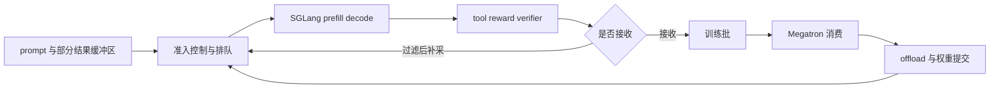
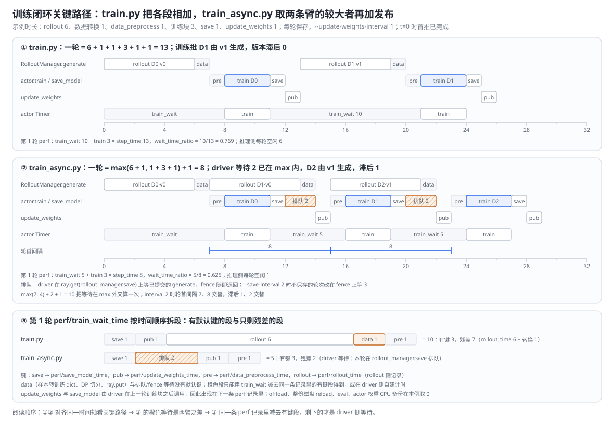

# slime Rollout 优化：先找关键路径，再调吞吐

> **源码基线**：`THUDM/slime@4c193f1f37509cca70f0e88807a9305b70f63f4e`（`main`，2026-09-03）
> **源码基线**：`sgl-project/sglang@0b3bb0cbe31873994c9f989fddfe2f87ca839fdd`（`v0.5.15.post1`，2026-07-13；只用于标注上游 router 参数与请求 `meta_info` 契约）
> **主题**：训练闭环的性能账本，以及 `train.py` 与 `train_async.py` 两个入口的关键路径时间线；准入、事件循环内的奖励计算、路由、调度、训练消费与权重发布各层的容量边界和调参旋钮；现成性能键与仍需自建的计时、最小可归因实验和源码阅读路线。
> **适用范围**：slime 侧的性能诊断与参数选择；请求状态归 [[13_slime_sglang_rollout_engine_analysis|SGLang rollout 引擎]]，driver 时序归 [[10_slime_end_to_end_iteration_analysis|端到端迭代]]，DP 调度归 [[14_slime_megatron_training_analysis|Megatron 训练]]，发布协议归 [[16_slime_weight_sync_analysis|权重同步]]，指标目录与 profiling 流程归 [[18_slime_fault_tolerance_observability_analysis|容错与观测]]。
> **最近更新**：2026-09-17。覆盖两个入口的关键路径数值时间线、actor 计时键与残差的分界、事件循环内奖励计算的容量模型、症状决策矩阵和 profiling 工具入口。

Rollout 优化不是寻找一个“最快开关”，而是先找出训练闭环中的瓶颈和权重更新关键路径，再只优化真正限制整体速度的部分。SGLang decode tok/s 只是局部服务速率；过滤或中止造成的无效工作、队列与长尾、事件循环里的同步打分、训练器消费速度、显存卸载和权重发布、策略时效性，都可能让局部加速无法转化为单位时间内更多的有效梯度。

---

## 1. 问题背景：为什么汇总 tok/s 容易把优化方向带偏

slime 的一条训练数据不是“生成完 token 就结束”：请求还可能经过工具或 reward/verifier，按 group 被动态过滤，转换和调度后才被 trainer 消费；训练结束又要保存、释放/恢复显存并发布新权重。同步入口 `train.py::train` 把 generate、rollout offload、train、save、train offload、weight update 和 KV onload 串成明确的阶段序列。

```mermaid
flowchart LR
    A["prompt 与部分结果缓冲区"] --> B["准入控制与排队"]
    B --> C["SGLang prefill decode"]
    C --> D["tool reward verifier"]
    D --> E{"是否接收"}
    E -->|接收| F["训练批"]
    E -->|过滤后补采| B
    F --> G["Megatron 消费"]
    G --> H["offload 与权重提交"]
    H --> B
```

只看生成 token/s 至少会漏掉五件事：

1. **分子不对**：被 filter、abort 或超额生成的 token 增加了 serving tok/s，却没有进入 loss；
2. **统计单位不对**：RL 的约束常在完整 prompt group、rollout 或可训练 token，而非原始 completion token；
3. **分母不对**：trainer 等待、数据搬运、保存、offload、权重发布都属于训练闭环 wall time；
4. **分布不对**：均值吞吐不显示 p95/p99 长尾与 batch barrier 浪费；
5. **目标不完整**：更老的 behavior policy、改变后的筛选分布或低精度误差可能换来更高吞吐，却降低单位样本价值。

诊断目标包括 accepted groups/s、进入 loss 的 token/s、attempted/accepted 比、生成与 reward 延迟分位数、queue age、trainer 等待、权重版本年龄和端到端周期。其中 trainer 等待与端到端周期**已有默认键**：actor 进程的计时器输出 `perf/train_wait_time`、`perf/wait_time_ratio`、`perf/step_time`，发布与保存另有 `perf/update_weights_time`、`perf/save_model_time`（拆段方法见 §3.3，完整清单见 §7.2）。accepted/attempted、queue age、版本年龄和 p95/p99 仍要自行埋点或从 trace 计算。动态 filter 按 reason 计数 drop；Sample trace 的 `sglang_generate` span 保留 queue time、端到端 latency、decode throughput，打了 slime SGLang 补丁的 PD 部署还有子阶段时长，可作为诊断入口。

## 2. 为什么这么设计：五个更简单的做法为什么没有被采用

先把权衡放在机制前面。下表每一行都是一个更容易解释的做法；当前基线一个都没有采用，而是把每一层的容量上限保留成互不合并的独立边界。

| 更简单的做法 | 它简单在哪 | 当前基线的实际边界 | 现方案付出的代价 |
|---|---|---|---|
| 用一个并发上限同时限制生成、hook 与 reward | 一个旋钮就能表达“整条 rollout 的并发” | `slime/rollout/sglang_rollout.py::generate_and_rm` 的信号量只包住生成块，sample hook 与 reward 调用都在信号量释放之后执行 | 生成并发不再等于端到端并发；规则 RM 与同步 hook 还和全部请求共用一个事件循环（§3.1），下游必须单独定容 |
| 等一整批请求全部生成完再交给训练 | batch 组成确定，没有完成顺序造成的选择偏差 | `generate_rollout_async` 用 `FIRST_COMPLETED` 逐组消费，凑满 `rollout_batch_size` 后调用 `abort` 排空其余请求 | 引入 latency selection bias，以及 abort/drain 屏障 |
| 由 slime 自己按在途请求数指定 worker | 客户端能看到每个 rank 的 in-flight 数，负载均衡最直观 | `GenerateState.dp_rank_context` 只维护本地计数并 `yield dp_rank`，`generate_and_rm` 把它接成 `as _`，rank 不进入请求 | 只能通过 session key 影响路由，worker 选择权在 router |
| 让 colocate 部署也把生成与训练重叠起来 | 不需要额外 GPU 就能拿到 overlap | `train_async.py::train` 第一行 `assert not args.colocate` | overlap 必须以两组独立资源为前提 |
| 把已完成但未使用的样本全部退回 buffer | 不浪费任何已经付出的生成成本 | `generate_rollout_async` 在写入 `data` 之前用 NOTE 注明没有这样做；`abort` 即使开 partial，也只回收含已生成 token 的 ABORTED 组 | 超额采样的多余工作被直接丢弃 |

> [!note] 推断
> 上表第三列全部是源码事实：信号量作用域、`FIRST_COMPLETED` 循环、被丢弃的 `dp_rank`、colocate 断言、NOTE 注释与 partial 回收条件。但**源码只写下了这些边界，没有陈述做出取舍的理由**，因此下面这条判据是据行为重建，不是项目作者原话：准入、生成、后处理/RM、训练消费四个环节的服务时间分布互不相同，把它们合成一个端到端旋钮会让任何一处供给不足都表现为“整体变慢”，从而无法定位；把每层上限拆成独立参数，代价是使用者必须自己按层测量，收益是每个瓶颈都能被单独证伪。本页第 3–6 节正是按这四层展开。

## 3. 容量估算：先判断哪个环节供给不足

### 3.1 请求处理速率、准入控制与事件循环

把 group 作为调度单位。对 group $j$：

- $Q_j$：进入生成临界区之前的等待时间；
- $S_{\mathrm{gen},j}$：prefill/decode 的主动服务时间；
- $S_{\mathrm{post},j}$：离开生成临界区后的 hook、reward/verifier 服务时间；tool 若在 custom generate 内执行，则计入 $S_{\mathrm{gen},j}$；
- $a_j\in\{0,1\}$：该 group 最终是否被接收。

若准入速率为 $\lambda_{\mathrm{in}}$，生成与后处理可持续处理样本的速率为 $\mu_{\mathrm{gen}}$、$\mu_{\mathrm{post}}$，要稳定运行首先要求：

$$
\lambda_{\mathrm{in}}
<
\min\left(\mu_{\mathrm{gen}},\mu_{\mathrm{post}}\right).
$$

这不是源码中的 scheduler 公式，而是**容量分析模型**。它提醒我们：提高生成并发只会提高 $\lambda_{\mathrm{in}}$ 或尝试填满 $\mu_{\mathrm{gen}}$；若 reward/tool 已经更慢，结果只会把等待从 SGLang 前移到下游。

但 $\mu_{\mathrm{post}}$ 不能按一个独立的多服务台估算，因为当前实现里后处理的执行位置有三种：

1. **规则 RM**（`--rm-type` 或样本 metadata 的 `rm_type` 为 `math`、`dapo`、`deepscaler`、`f1`、`gpqa`、`ifbench` 等）：`slime/rollout/rm_hub/__init__.py::async_rm` 虽然是 `async def`，函数体直接同步调用打分函数，没有 `await`、线程池或进程池。默认 rollout 由 `slime/utils/async_utils.py::run` 把整轮协程提交给 `AsyncLoopThread` 的**单个**事件循环（fully-async worker 在自己的线程里同样只跑一个循环）；打分期间，这个循环上的全部协程都停住：已返回的 HTTP 响应得不到处理，`FIRST_COMPLETED` 无法唤醒，新请求也拿不到信号量。同步形式的 `--rollout-sample-hook-path` hook 由 `slime/rollout/sample_hooks.py::_apply_to_sample` 内联调用，性质相同。
2. **远程 RM**（`rm_type == "remote_rm"`）：`remote_rm` 走进程级共享的 `aiohttp.ClientSession`，`_get_shared_session` 把 `TCPConnector(limit=64)` 写死，单次总超时 120 秒，失败最多重试 10 次、退避上限 30 秒加随机抖动。它会 `await`，不阻塞循环，但同时在途的打分连接不超过 64。
3. **`--custom-rm-path`**：行为由用户函数决定；函数体里的同步计算同样阻塞循环。

据此得到按样本计的上界（分析模型）：

$$
\mu_{\mathrm{gen}}\le\frac{C\,E}{\bar S_{\mathrm{gen}}},\qquad
\mu_{\mathrm{rule}}\le\frac{1}{\bar S_{\mathrm{rule}}},\qquad
\mu_{\mathrm{remote}}\le\frac{64}{\bar S_{\mathrm{remote}}}.
$$

$C$ 是 `--sglang-server-concurrency`，$E$ 是 engine 数。规则 RM 一项更严重：它不只是一个慢服务台，占用循环的时间还会叠加到所有在途请求在客户端观察到的完成时间上（分析判断）。因此若 SGLang 侧测得的 `perf/request/e2e_latency/*` 正常而 `perf/rollout_time` 明显偏大，应先怀疑循环被同步计算占住，再考虑扩容推理。`--use-distributed-post` 只把生成 POST 分散到每节点的 Ray actor（`slime/utils/http_utils.py::_init_ray_distributed_post`），RM 仍在原循环里执行。

当前实现正好体现了生成侧的边界：信号量只包住默认或自定义的生成阶段，样本钩子与 reward 计算位于信号量之外。因而 `sglang_server_concurrency` 是生成侧的准入并发上限，不是整个 rollout 流程的端到端并发上限；自定义工具循环是否占用这个信号量，取决于它是否在自定义生成函数内部完成。

### 3.2 有效训练批次的准备时间与长尾代价

设目标 batch 需要 $B$ 个 accepted groups，$t_B$ 是第 $B$ 个有效 group 完成筛选的时刻，$T_{\mathrm{drain}}$ 是随后 abort、等待 pending task 收敛和回收 partial 的时间，则：

$$
T_{\mathrm{rollout}}
=
t_B+T_{\mathrm{drain}}.
$$

同步收束的接收循环不是等待最慢候选自然完成：它用 `FIRST_COMPLETED` 逐组消费结果，凑满 $B$ 后进入 `abort`。`abort` 的排空分两类：

- 带 `abort_mode = "request"` 属性的生成函数（例如流式外部 rollout 的 `slime/rollout/sglang_streaming_rollout.py::generate_streaming`）登记在 `GenerateState.cancellable_tasks` 里，被直接取消，样本标成 ABORTED；
- 其余生成函数只要还有在途请求，`abort` 就向 router `/workers` 取 worker 列表，由 `slime/backends/sglang_utils/server_control.py::abort_server_until_idle` 对每个 worker 循环发 `/abort_request`（`abort_all`）并查 `/v1/loads?include=core`；仍有请求就等 `ABORT_RETRY_INTERVAL_SECONDS`（3 秒）再试，load 查询失败则直接返回，不能证明 worker 已空闲。

两类都结束后，`abort` 还要等全部 pending task 返回。开 `--partial-rollout` 时，只有**至少含一条已生成 token 的 ABORTED 样本**的组被收进 buffer；abort 期间正好完成的整组与零 token 的组都被丢弃。v0.3.2 及更早版本没有这个条件，abort 期间完成的整组也会回填 buffer。

因此长尾成本不只是最慢 response latency，还包括：

- 被慢 group 占住的 in-flight capacity；
- 已生成但最终未接收的 token、tool 与 RM 成本；
- batch 满后 abort/drain 的 barrier，服务端 abort 每轮重试间隔 3 秒；
- partial 恢复时保留旧上下文或跨版本 token 的成本。

完整接收循环与数值例子见 [[13_slime_sglang_rollout_engine_analysis|SGLang rollout 引擎的候选采样时间线]]。

### 3.3 训练闭环关键路径：同步相加，one-stage async 取较大臂

先把各段钉到源码边界上：

- $T_{\mathrm{rollout}}$：`RolloutManager.generate` 从进入到写完 rollout 日志，即 `perf/rollout_time`；
- $T_{\mathrm{data}}$：随后的 `_convert_samples_to_train_data` 与 `_split_train_data_by_dp`（DP 调度、CPU tensor 化、`ray.put`），没有计时键；
- $T_{\mathrm{train}}$：actor 侧 `data_preprocess`（从对象存储取数据并搬到 GPU）加训练块 `train`（log prob、advantage、优化器步），开 `--offload-train` 时再加 `wake_up` 与 `sleep`。同一次 actor 调用里还有三段没有计时键：训练块之后、`log_perf_data` 之前的 `weights_backuper.backup("actor")`（`slime/utils/tensor_backper.py::TensorBackuper.backup` 把 actor 参数整份拷进 pinned CPU 内存，每轮都做），开 `--save-debug-train-data` 时的 `save_debug_train_data`，以及训练块之前、开 rollout routing replay 时的 `fill_routing_replay`；
- $T_{\mathrm{save}}$：到保存间隔时的 `save_model`；
- $T_{\mathrm{offload}}$：同步入口里 rollout 侧的 `offload` / `onload_weights` / `onload_kv` 与训练侧 `clear_memory`；
- $T_{\mathrm{publish}}$：`update_weights`。

各段的具体协议分别由 [[12_slime_sample_datasource_analysis|Sample/DataSource]]、[[14_slime_megatron_training_analysis|Megatron 训练]]和 [[16_slime_weight_sync_analysis|权重同步]]解释，本页只把它们放回同一性能账本。同步入口 `train.py::train` 每轮串行执行这些段，所以：

$$
\begin{aligned}
T_{\mathrm{step}}^{\mathrm{sync}}
&=T_{\mathrm{rollout}}+T_{\mathrm{data}}+T_{\mathrm{train}} \\
&\quad+T_{\mathrm{save}}+T_{\mathrm{offload}}+T_{\mathrm{publish}}.
\end{aligned}
$$

`train_async.py::train` 的顺序不同：轮首 `ray.get` 上一轮提交的 generation future，随即提交下一轮 `generate`，再训练当前批；到保存间隔时先 `save_model`，默认开启的 global dataset（只有 `--disable-rollout-global-dataset` 才关闭）还要 `ray.get(rollout_manager.save.remote(i))` 写 DataSource 游标；到发布轮先 `ray.get` 刚提交的 future，注释说明这是为了不在生成中途换权重（下文称 fence），然后 `update_weights`；下一轮轮首因 future 已置空而直接提交。于是在发布轮，生成臂与训练臂从同一时刻出发，driver 等待的正是两条臂之差：

$$
T_{\mathrm{cycle}}^{\mathrm{async}}
\approx
\max\left(T_{\mathrm{rollout}}+T_{\mathrm{data}},\,T_{\mathrm{train}}+T_{\mathrm{save}}\right)
+T_{\mathrm{publish}}.
$$

生成臂必须包含 $T_{\mathrm{data}}$，因为 `RolloutManager.generate` 在返回 future 结果前已完成转换与 DP 切分；训练臂必须包含 $T_{\mathrm{save}}$，因为保存发生在 fence 之前。一个常见误读是再加一项等待，写成 $\max(T_{\mathrm{rollout}}+T_{\mathrm{data}},T_{\mathrm{train}})+T_{\mathrm{wait}}+T_{\mathrm{publish}}$：driver 等待已经是 max 里短臂补齐长臂的那一段，再单独加一次就重复计算，而且漏了保存。

driver 具体等在哪个调用上，取决于本轮是否保存。`RolloutManager` 由 `create_rollout_manager` 创建时没有设置 `max_concurrency`，类里也没有 `async def` 方法；按 Ray 同步 actor 对同一调用方按提交顺序串行执行的契约推导，保存轮的 `rollout_manager.save(i)` 排在已提交的 `generate(i+1)` 之后，driver 就等在这次 `ray.get` 上，随后的 fence `ray.get` 立即返回；不保存的轮次才在 fence 上等。这个顺序同时让异步入口保存的游标越过下一批，恢复语义见 [[10_slime_end_to_end_iteration_analysis#5. 保存与恢复切口：只有同步入口对齐|端到端迭代的保存切口]]。

图中数字全部由生成器按两个主循环复现算出。设 rollout 6、数据转换 1、data_preprocess 1、训练块 3、save 1、update_weights 1（抽象时间单位，每轮保存，offload 取 0）：

- **同步**：一轮 6 + 1 + 1 + 3 + 1 + 1 = 13；训练、保存与发布期间推理侧每轮空闲 6。
- **one-stage async**：$T_{\mathrm{cycle}}^{\mathrm{async}}=\max(6+1,\,1+3+1)+1=8$。训练臂 5 比生成臂 7 短，driver 等待 2：本例每轮保存，这 2 落在 `ray.get(rollout_manager.save.remote(i))` 上，fence 立即返回。若改成 `--save-interval 2`，不保存的轮次训练臂只剩 4，driver 在 fence 上等 3，保存轮仍在 DataSource 保存上等 2，周期都是 8。在 max 外再加一次等待，即 $\max(7,4)+2+1$，会得到 10，比实际周期还大。训练臂更长时 driver 等待为 0，空转的一方换成推理侧，周期仍是较大臂加发布。
- **版本滞后**：同步入口的训练批由上一轮刚发布的版本生成，滞后 0；async 在 `--update-weights-interval 1` 时滞后 1。改成 2 时，复现得到的轮首间隔 7、8 交替（不发布的一轮只省掉发布），版本滞后 1、2 交替。同一参数传给 `train.py` 不改变任何数字，因为该入口每轮无条件调用 `update_weights()`。

trainer 侧的等待**不需要自建计时**。`MegatronTrainRayActor.init` 结束时经 `with_defer` 启动 `train_wait` 计时；`train_actor` 用 `with inverse_timer("train_wait"), timer("train")` 在训练块开始时结束等待、块结束时重新开始等待；块末 `slime/observability/train_metric_utils.py::log_perf_data` 取走进程内 `Timer` 累计的全部计时，写成 `perf/{name}_time`，并派生 `perf/step_time`（train_wait 加 train）与 `perf/wait_time_ratio`。因此一条 perf 记录的 `perf/train_wait_time` 覆盖上一个训练块结束到本块开始的全部墙钟，同一窗口里 `data_preprocess`、`save_model`、`update_weights`（开 offload 时还有 `wake_up`、`sleep`）各有自己的键；save 与发布由 driver 在上一块之后调用，所以出现在下一条记录里。

例中第 1 轮：同步入口的 `perf/train_wait_time` 为 10，`perf/wait_time_ratio` = 10/13 = 0.769，减去三个有键段后残差 7，等于 rollout 侧的 `perf/rollout_time` 6 加无键的转换 1；async 的 `perf/train_wait_time` 为 5，比值 5/8 = 0.625，残差 2 是 driver 侧等待（保存轮在 `rollout_manager.save`，非保存轮在 fence）。实际运行中残差还会含 actor 参数的 CPU 备份与训练数据 dump（落在下一条记录）以及 `fill_routing_replay`（落在本条记录）。高 `wait_time_ratio` 本身不等于“在等 rollout”：先在同一条记录里减掉有键段，剩下的残差才是 driver 侧等待与这些未计时段。

这两条式子是分析近似。成立前提是分离资源互不争用、本轮没有到期的 eval；DataSource 保存与 eval 都在串行的 `RolloutManager` 上排队，前者对周期的影响已在上文计入，后者不在式中。另有两处会让发布段变长却不体现在直觉里：开 `--use-fault-tolerance` 时 `update_weights` 先同步重建坏 engine，耗时计入 `perf/update_weights_time`；整份磁盘发布的 reload 在 `RayTrainGroup._reload_rollout_weights_from_disk` 里、actor RPC 返回之后执行，不在该 timer 内。

> **设计分析**：overlap 消掉的是“两阶段串行空洞”，不是两个阶段本身的工作量。若生成臂比训练臂长很多，trainer 仍然空等（保存轮等在 DataSource 保存上，其余轮等在 fence 上）；若训练臂更长，推理侧空转，warm queue（fully-async）只会积累更老的样本。若两边争用网络、CPU、存储或功耗预算，重叠甚至可能让两条臂各自变长。

## 4. 服务侧旋钮：只在生成服务真是瓶颈时使用

### 4.1 请求并发：修复欠载，不是越大越好

`GenerateState.__init__` 把信号量容量设为“每 engine 并发 × engine 数”：`--sglang-server-concurrency` 默认 512，engine 数由 `slime/utils/http_utils.py::get_rollout_num_engines` 取 `rollout_num_engines`，或按 `rollout_num_gpus // rollout_num_gpus_per_engine` 推出；`init_http_client` 的 httpx 连接池上限取同一个乘积。group 作为 task 提交，同一 group 的 samples 再并发生成。它适合修复低并发导致的 GPU bubble，前提是 KV cache、HTTP、RM 事件循环和 host 线程仍有余量。

反例不是假设：项目 Qwen3 示例（`docs/zh/examples/qwen3-4B.md`）警告，训推分离时单 server 并发超过 SGLang 默认 CUDA graph 并发上限（文档写 160）会影响推理速度，建议用 `--sglang-server-concurrency 160` 限流，或用 `--sglang-cuda-graph-bs` 扩充 graph batch size。

### 4.2 本地 DP 计数不等于路由器实际采用的负载均衡

`GenerateState.dp_rank_context` 会在当前计数最小的 rank 候选集合内用 `np.random.choice` 随机选择并维护 in-flight count。但默认路径中 yield 出来的 rank 被写成 `as _`，`generate` 的 HTTP payload 仍只发到 router `/generate`，没有携带该 rank；唯一显式的 worker 亲和信息是 `--router-policy consistent_hashing` 时写入的 `X-SMG-Routing-Key` session header。

> [!warning] 源码事实与常见表述的边界
> 不能据此把“在途请求最少的 rank”写成默认请求实际采用的负载均衡算法。slime 在这里负责准入控制与可选的会话亲和；路由器如何在 worker 之间选择请求属于 SGLang Model Gateway 的实现边界。

slime 对 router 只改了默认参数：`slime/backends/sglang_utils/arguments.py::add_sglang_arguments` 把 `--router-balance-abs-threshold` 默认设为 10、`--router-balance-rel-threshold` 默认设为 1.2，`add_sglang_router_arguments` 把 `--router-log-level` 默认设为 `warn`。上游 `sglang_router.router_args.RouterArgs`（v0.5.15.post1 源码树中的 Python 绑定）默认策略为 `cache_aware`、阈值 64 与 1.5，参数说明写的是两个条件同时满足才触发均衡：`max_load - min_load` 超过绝对阈值，且 `max_load` 超过 `min_load` 乘相对阈值。因此 slime 默认更早触发均衡；阈值在 router 内部怎样改变选择属于上游契约，本页未核验，请求层的归属见 [[13_slime_sglang_rollout_engine_analysis|SGLang rollout 引擎]]。

逐 worker 的队列与 KV 需要从服务侧取：slime 启动的 engine 在 `slime/backends/sglang_utils/sglang_engine.py::_compute_server_args` 里固定 `enable_metrics: True`，注释说明是为了让 router 的 `/engine_metrics` 可供外部抓取（端点内容属于上游契约）。调参顺序因此是：先看各 worker 的队列、KV 占用和延迟是否失衡；若是会话亲和导致热点，调整路由策略、均衡阈值或 key；若所有 worker 都利用不足，再提高 slime 的准入并发数。

### 4.3 PD、投机/MTP 与低精度分别消除不同资源瓶颈

| 方案 | 它真正减少的瓶颈 | 使用前提 | 新成本与反例 |
|---|---|---|---|
| PD disaggregation | prefill 与 decode 资源比例不匹配、长上下文/多轮的阶段干扰 | 两阶段确实需要不同 TP、显存或 runtime；有可观测的 PD 分段时间 | 增加 router、KV transfer 与拓扑运维；短单轮任务可能被传输/调度开销反噬 |
| speculative decode | target model 的逐 token decode 次数 | draft acceptance 足够高，验证 kernel 与 batch 形态合适 | draft 与验证也耗时；policy 漂移导致 acceptance 降低时可出现负收益 |
| 在线 MTP | RL 中 draft/target 漂移造成的 speculative 退化 | checkpoint、模型映射、训练与发布路径都支持 MTP | 多一项训练 loss 与同步状态；若 draft 更新没跟上 actor，局部功能开启也不能保证收益 |
| rollout 低精度 | 权重/KV 的显存容量或带宽压力 | 硬件、kernel、量化配置与精度门禁已验证 | 量化/转换/一致性成本；原本 compute-bound 或不兼容 kernel 时未必加速 |

项目文档 `docs/zh/advanced/pd-disaggregation.md` 把 PD 的适用场景定位在 long-context、multi-turn、decode 占主导以及 prefill/decode 需要不同配置，并明确短单轮任务用 regular layout 更简单；门禁测试用 Mooncake 作 KV 传输后端（`tests/test_glm4.7_30B_A3B_pd_mooncake.py`、`tests/test_qwen3.6_35B_A3B_pd_mooncake.py`），传输层原理见 [[mooncake_analysis|Mooncake]]。应先用分段指标证明 PD 值得启用，而不是凭 workload 名称猜测，但要分清字段来源：`queue_time`、`decode_throughput` 是上游 SGLang 在 `enable_metrics` 打开时写进 `meta_info` 的字段，`e2e_latency` 在请求完成时写入；`pd_*` 子阶段时长来自 slime 的 `docker/patch/latest/sglang.patch`（在 `SchedulerReqTimeStats.convert_to_output_meta_info` 中新增），只有 `docker/Dockerfile` 以 `ENABLE_SGLANG_PATCH=1` 构建的镜像才有。所以 `perf/prefill/*` 与 `perf/decode/{prealloc,bootstrap,alloc_wait,transfer,forward}_duration/*` 只在打补丁的 PD 部署上出现，外部 engine 或无补丁镜像可能没有。

投机解码的项目文档 `docs/zh/advanced/speculative-decoding.md` 指出：RL 使草稿模型与目标模型的分布逐渐漂移时，通过验证的草稿 token 会减少，投机解码甚至可能带来负收益；在线训练 MTP 正是为了缓解这个问题，外部草稿模型的训练仍是 WIP。同步边界与基线缺口见 [[21_slime_speculative_decoding_mtp_analysis|投机解码/MTP 专题]]。

低精度文档 `docs/zh/advanced/low-precision.md` 把 BF16 training + FP8 rollout 列为推荐路径，并说明 FP8 KV cache 只改变 rollout 侧容量，实际精度/性能依赖 SGLang 版本和 GPU stack。训练、rollout、KV 和通信精度不能合并成一个开关，详见 [[22_slime_low_precision_training_rollout_analysis|低精度专题]]。

## 5. 调度侧参数：目标是减少资源利用不足和长尾浪费

### 5.1 优先取已完成样本、超额采样与动态过滤

默认循环按完成顺序接收 group 并整批补采：`remaining_batch_size` 低于目标时，一次提交 `--over-sampling-batch-size`（未设时等于 `rollout_batch_size`）个组，调优时关注由此引起的在途容量阶跃。这一组合解决的是“有效 batch 被 filter 打空”和“等待整批最慢任务”，不是减少单个 group 的服务时间。

令尝试 group 数为 $N_{\mathrm{attempt}}$，接收数为 $N_{\mathrm{accept}}$，进入 loss 的有效 token 数为 $N_{\mathrm{loss}}$。更有意义的两个效率量是：

$$
\eta_{\mathrm{accept}}
=
\frac{N_{\mathrm{accept}}}{N_{\mathrm{attempt}}},
\qquad
R_{\mathrm{productive}}
=
\frac{N_{\mathrm{loss}}}{T_{\mathrm{wall}}}.
$$

若 oversampling 提升 aggregate tok/s，却让 $\eta_{\mathrm{accept}}$ 下降且 $R_{\mathrm{productive}}$ 不升，它只是在更快地产生废弃工作。当前实现还明确注明：凑满 batch 后，并没有把所有已完成但未使用的 samples 放回 buffer。

读指标时注意两个统计口径：`rollout/dynamic_filter/drop_{reason}` 来自 `MetricGatherer.collect`，统计被丢弃的组；而 `rollout/zero_std/count_{reward}` 由 `compute_metrics_from_samples` 在**返回的入选组**上计算，开零方差过滤后它只数被 fallback 保留的组。两者的后缀都是 `str(round(reward, 1))`，只有 float 奖励才是 `_0.0`、`_1.0`；内置 `math` 等返回 int 或 bool 的 RM 得到 `_0`、`_1`。其余 rollout 键的出现条件（例如 `rollout/repetition_frac` 只对超过 10000 字符的响应生效）归 [[31_slime_posttraining_stability_analysis|后训练稳定性]]的指标读取边界。

> **设计分析**：first-completed 本身只改变结果消费顺序；当 batch 以“最早完成且通过 filter”为准截断时，latency 与题目难度、工具轮数或 reward 相关，就可能产生 latency selection bias。严格 filter 又会改变训练分布。两者都应把 drop reason、长度、reward、source 与 latency 做联合分桶，而不是只报保留率。

fallback filter 在候选不足时保留本来被拒绝的 group，以免再启一轮 oversampling；这是用数据准则换等待时间，而非“等价加速”。源码把该语义编码为 `DynamicFilterOutput.keep_when_insufficient`，由 `should_drop_dynamic_filter_output` 在 `remaining_batch_size <= target_data_size` 时生效。

### 5.2 partial：回收已做的工作，不会消灭版本代价

partial 在 batch 已满后回收含已生成 token 的 ABORTED 组，下轮 `generate` 只生成剩余 token budget（`max_new_tokens` 减去已有 response 长度）；`--mask-offpolicy-in-partial-rollout` 把旧 response 的 loss mask 清零，只训练新 on-policy token。

它适合 response 很长、abort 已生成前缀成本高的场景。反例是短 response 或权重频繁发布：abort/序列化/恢复开销可能大于省下的 decode；开启 mask 后旧 token 仍占 context/KV 却不贡献梯度，不开启则要接受跨版本 behavior。token、metadata 与 buffer 的完整语义由 [[12_slime_sample_datasource_analysis|Sample/DataSource 专题]]说明。

### 5.3 Fully-async 是异步 driver 上的生产者替换

官方 recipe 同时要求 `train_async.py` 和 `--rollout-function-path slime.rollout.fully_async_rollout.generate_rollout_fully_async`：one-stage async 提供阶段重叠，替换函数提供跨 round 的 group 池与预热队列，二者叠加。后台并发、完成队列回压与按缺口 drain 的机制归 [[13_slime_sglang_rollout_engine_analysis|SGLang rollout 引擎的持续生产者变体]]，driver future 及权重更新等待的权威时序归 [[10_slime_end_to_end_iteration_analysis|端到端迭代]]。

调优时同时记录日志中的 `queue_warm/queue_left` 和自行测量的 enqueue→dequeue 年龄；前者是文字日志，后者默认没有时间戳指标。worker 在完成队列长度达到池容量时停止补位，所以队列深度有上限，但**版本年龄没有上限**：当 trainer 更慢时，预热队列可能只增加样本陈旧度，未必减少周期。它不支持 evaluation，跨 round 顺序 best effort，`examples/fully_async/README.md` 声明 ABORTED 轨迹尚未接 partial 续生成、而是重新排队从头开始。默认 dynamic filter 和轮末后处理位于被替换函数中，不能假定所有默认 hook 都继续工作。worker 线程里的事件循环同样内联执行规则 RM（§3.1）。多版本 rollout 与陈旧度的一般框架见 [[23_dora_multi_version_rollout_analysis|DORA 多版本 rollout]] 与 [[25_on_policy_off_policy_staleness_analysis|on-policy、off-policy 与 staleness]]。

## 6. 消费与提交侧：rollout 快了以后，瓶颈会移到哪里

### 6.1 训练器调度与数据传输

rollout batch 还要被 packing、对齐并分给 DP ranks。调度算法与约束以 [[14_slime_megatron_training_analysis|Megatron 训练]]为准；本页只用实际 step 耗时和 batch size 判断消费侧是否饱和，入口是 `slime/utils/dp_schedule.py::build_dp_schedule`。

- trainer 因变长样本 padding/不均衡而慢：再调 `--use-dynamic-batch-size` 或 `--balance-data`，先看 `perf/actor_train_tok_per_s` 与 `perf/actor_train_tflops`；
- rollout manager 到 trainer 的大 tensor 搬运慢：比较 object store 与 NIXL；`--rollout-data-transport nixl` 只替换已在 CPU 上 tensor 化字段的传输方式，搬运成本落在 `perf/data_preprocess_time`；
- 不要把 FLOPs balance 当无风险加速：`--balance-by-flops` 的参数说明警告它可产生超过 `--max-tokens-per-gpu` 的 micro-batch 并 OOM。

因此 producer 增发 token 前，应先确认 trainer 能否按相同 wall time 消费它们；否则只会把队列、CPU 内存和版本年龄推高。loss 的统计单位与并行不变量归 [[15_slime_loss_parallelism_analysis|loss/并行专题]]所有。

### 6.2 显存卸载与权重发布

同步入口在 generate 后 offload rollout、训练后 offload/clear trainer、再 update weights 并恢复 rollout KV，说明 colocate 本质是显存的时分复用，不是 generation/training 并行。若 $T_{\mathrm{offload}}+T_{\mathrm{publish}}$ 已占主导，继续优化 decode 不会显著降低 $T_{\mathrm{step}}^{\mathrm{sync}}$。

`--update-weight-buffer-size` 默认 `512 * 1024**2` 字节（512 MiB），限制分块缓冲大小。`--update-weights-interval` 默认 1，但**只有 `train_async.py` 读取它来决定何时发布**；`train.py` 每轮无条件调用 `update_weights()`，在同步入口上改这个参数不会降低发布成本（actor 另在 `--keep-old-actor` 下用 `update_weights_interval == 1` 选择 old actor 的备份方式，不影响发布频率）。在 async 入口降低发布频率或改变 chunk buffer 都应同时检查版本年龄和峰值内存；源码参数只定义频率与 buffer，并不承诺这是免费性能。

> **设计分析**：加大发布间隔直接把同步成本换成 behavior policy age（§3.3 的例子里滞后从 1 变成 1、2 交替）；更大的 update buffer 也可能用峰值内存换调用次数。先测 pause/flush、转换、传输、load 与 resume 各段，再选择 transport 或 interval。完整提交协议、版本不变量与失败边界见 [[16_slime_weight_sync_analysis|权重同步专题]]。

## 7. 从症状到动作：决策矩阵

| 观测症状 | 现成 key，或明确需要自建的观测 | 候选参数/动作 | 前提与反例 |
|---|---|---|---|
| GPU 欠载、队列短 | `perf/request/queue_time/mean`、`perf/tokens_per_gpu_per_sec`；GPU 利用率需外部采集 | `--sglang-server-concurrency` | 规则 RM 或同步 hook 占住事件循环时加并发无效；同看 CUDA graph/KV 容量 |
| worker 严重失衡 | `perf/request/e2e_latency/max`；逐 worker 的 queue/KV 从 router `/engine_metrics` 或 serving 指标采集 | `--router-policy`、`--router-balance-abs-threshold`、`--router-balance-rel-threshold`（slime 默认 10、1.2）、`--sglang-dp-size` | 本地 `dp_counts` 不决定默认路由 |
| 多轮或长 prompt 的 prefix cache 命中低 | `rollout/prefix_cache_hit_rate`、`rollout/avg_cached_tokens_per_sample` | `--router-policy consistent_hashing`（按 session key 亲和），或调整 cache-aware 均衡阈值 | 亲和提高命中的同时可能制造热点，与上一行一起看 |
| prefill/decode 比例错误 | `perf/prefill/forward_duration/mean`、`perf/decode/forward_duration/mean`、`perf/decode/transfer_duration/mean` | `--prefill-num-servers`、`--sglang-config` | `pd_*` 字段依赖 slime 的 SGLang 补丁；短请求未必受益 |
| decode 主导 | `perf/decode/throughput/mean`、`rollout/spec_accept_rate` | `--sglang-speculative-algorithm`，在线 MTP 见投机解码专题 | acceptance 足够高才有收益 |
| KV OOM 或容量受限 | `rollout/response_len/max`（统计 `effective_response_length`）、`rollout/truncated_ratio`；显存峰值需 profiler | `--rollout-max-context-len`、`--rollout-max-response-len`、`--rollout-num-gpus-per-engine` | 精度回退/量化仍需质量门禁 |
| filter 经常打空 batch | `rollout/dynamic_filter/drop_zero_std_*`（int 奖励为 `_0`、float 为 `_0.0`）；`rollout/zero_std/count_*` 只数入选组 | `--over-sampling-batch-size`、`--dynamic-sampling-filter-path` | fallback 会改变筛选准则 |
| batch 满后长尾多 | `perf/rollout_time`、`rollout/response_len/max`；abort/drain 耗时与废弃 tokens 需自建 | `--partial-rollout`、`--mask-offpolicy-in-partial-rollout`；或 fully-async 函数 | partial 回收点不等于权重 commit |
| trainer 等数据 | `perf/wait_time_ratio`、`perf/train_wait_time`、`perf/step_time`；减去同一条记录的 `perf/data_preprocess_time`、`perf/save_model_time`、`perf/update_weights_time`、`perf/wake_up_time`、`perf/sleep_time` 得到 driver 侧残差；残差内部的转换、rollout offload/onload、async 在 `rollout_manager.save` 或 fence 上的等待、actor 参数 CPU 备份需自建 | `train_async.py`、`--rollout-function-path` | colocate 不支持 one-stage async |
| trainer 本身慢或完成队列积压 | `perf/actor_train_time`、`perf/actor_train_tok_per_s`、`perf/actor_train_tflops`、`perf/log_probs_time`、`perf/ref_log_probs_time`、`train/global_batch_size`；queue age/depth 从自建埋点与 fully-async 日志取 | `--use-dynamic-batch-size`、`--balance-data`、`--rollout-data-transport` | 先定位消费侧，FLOPs packing 可 OOM |
| 权重/显存切换耗时高 | `perf/update_weights_time`（出现在下一条 perf 记录）、增量磁盘的 `perf/update_weights_density` 与 `perf/update_weights_wire_bytes`、`perf/sleep_time`、`perf/wake_up_time`；整份磁盘 reload 与 rollout 侧 offload/onload 需自建计时 | `--update-weight-buffer-size`、`--update-weights-interval`（只对 `train_async.py` 生效）、`--offload-train`、`--offload-rollout` | 与版本年龄共同验收 |

### 7.1 参数怎样改变性能账本

`--rollout-max-prompt-len` 在 global dataset 初始化时过滤长 prompt；`--rollout-max-context-len` 控制 serving context cap；`--rollout-max-response-len` 控制生成预算。三者的参数默认值都是 None，但 `slime_validate_args` 在设置了 context len 而未设 prompt len 时自动取 context len − 1，并断言 prompt len 不超过 context len − 1，不能把它们互当同一个长度。`--rollout-seed` 默认 42，复现实验应和 temperature/top-p 一起固定；`--rollout-temperature` 必须大于 0，解析期就拒绝非正值。`--rollout-num-gpus-per-engine`、`--sglang-dp-size` 与 PD/YAML 配置改变 engine 拓扑，放置细节归 [[11_slime_ray_control_plane_analysis|Ray 控制面]]、请求配置归 [[13_slime_sglang_rollout_engine_analysis|SGLang rollout 引擎]]。

`--num-steps-per-rollout` 改变单批数据消费步数，`--keep-old-actor` 保留 rollout 对应的训练侧快照；它们影响吞吐也影响 old-policy 计算，机制归 [[14_slime_megatron_training_analysis|Megatron 训练]]与 [[17_slime_train_inference_consistency_analysis|训推一致性]]。总轮数由 `--num-rollout` 或 `--num-epoch` 决定：只给后者时，`create_rollout_manager` 按 `len(data_source) // rollout_batch_size` 乘 epoch 数推出 `num_rollout`。健康检查用 `--rollout-health-check-first-wait`、`--rollout-health-check-interval`、`--rollout-health-check-timeout`，参数定义的默认值是 0/30/30 秒，而 `docs/zh/advanced/fault-tolerance.md` 写的是 first-wait 300、interval 10、timeout 5，二者不一致，以实现为准（检测上界的推算见 [[18_slime_fault_tolerance_observability_analysis|容错与观测]]）；只有开 `--use-fault-tolerance` 时 `RolloutManager` 才创建监控；调超时不等于修复容量。`--rollout-sample-hook-path` 处于生成后 RM 前；`--rollout-sample-filter-path` 原地处理入选组，`--rollout-all-samples-process-path` 可审计已完成的拒绝组；三者均可能增加客户端开销，同步实现还会阻塞事件循环，范围见 [[13_slime_sglang_rollout_engine_analysis|SGLang rollout 引擎]]。

### 7.2 现成性能指标的分母与记录位置

**rollout 侧**由 `RolloutManager.generate` 在转换训练数据**之前**调用 `slime/observability/rollout_metrics.py::log_rollout_data` 写出。`compute_perf_metrics_from_samples` 用整轮 `rollout_time` 做分母：`perf/tokens_per_gpu_per_sec` 对返回 Sample 的 response 长度求和再除 rollout GPU 数；`perf/effective_tokens_per_gpu_per_sec` 改用 effective response 长度。它们不是 serving 全部尝试 token/s，也未把转换、trainer 与发布时间纳入分母。`perf/longest_sample_tokens_per_sec` 和 `perf/longest_effective_sample_tokens_per_sec` 用最长样本长度除同一个 round time。自定义生成函数写入 `Sample.non_generation_time` 且有正值时，另发 `perf/non_generation_time/{mean,median,min,max}` 与 longest-sample 对应项；默认生成路径不写该字段。

请求级聚合来自 Sample trace 的 `sglang_generate` span，后缀只有 `mean/median/min/max`，p95/p99 需从原始 trace 自算；`perf/request/count` 和 `perf/request/profiled_count` 不输出。自定义生成函数若不写这个 span，就没有 `perf/request/*`。`rollout/prefix_cache_hit_rate` 用累计 `cached_tokens` 除以 prompt token 总数，`rollout/avg_cached_tokens_per_sample` 为逐样本均值。

**训练侧**由 actor 的 `log_perf_data` 在每个训练块末写出，只在 TP rank 0、最后一个 PP stage、DP rank 0 上报告，与 rollout 侧同用 `rollout/step` 作 x 轴：`perf/train_wait_time`、`perf/train_time`、`perf/step_time`、`perf/wait_time_ratio`、`perf/data_preprocess_time`、`perf/log_probs_time`、`perf/ref_log_probs_time`、`perf/teacher_log_probs_time`、`perf/actor_train_time` 与据此派生的 `perf/actor_train_tflops`、`perf/actor_train_tok_per_s`、`perf/log_probs_tflops`、`perf/ref_log_probs_tflops`，以及 `perf/ref_model_update_time`、`perf/save_model_time`、`perf/update_weights_time`、`perf/wake_up_time`、`perf/sleep_time`，增量磁盘发布再加 `perf/update_weights_density` 与 `perf/update_weights_wire_bytes`。各键只在对应计时实际发生的轮次出现。完整指标目录与 x 轴规则归 [[18_slime_fault_tolerance_observability_analysis|容错与观测]]。

仍需自建的只剩这些：样本转训练 dict 与 DP 切分（$T_{\mathrm{data}}$）、同步入口 rollout 侧 offload/onload、async 的 driver 侧等待（保存轮在 `rollout_manager.save`，非保存轮在 fence；可用残差推出）、actor 每轮的 `weights_backuper.backup("actor")`、开启时的 `save_debug_train_data` 与 `fill_routing_replay`、整份磁盘 reload、abort/drain 耗时；以及 accepted groups/s、完整 attempted/accepted、loss token/s、完成队列年龄、版本年龄与请求延迟分位数，并明确采用 round 还是整个训练周期作分母。

[[25_vime_vllm_backend_support_analysis|vime/vLLM 衍生实现]]改写了 rollout engine、请求和同步契约；同名优化旋钮不能直接沿用本页的 upstream slime 假设，应先做 backend contract 对照。

## 8. 最小可归因实验

### 8.1 先建立性能基线

固定 checkpoint、prompt 集、sampling 参数、reward/tool 服务版本和训练 batch 语义，记录：

- $T_{\mathrm{step}}$ 或 $T_{\mathrm{cycle}}$，以及 generate、转换、train、save、offload、publish 分段（有键段直接读 §7.2，残差按 §3.3 拆）；
- attempted/accepted groups，$N_{\mathrm{loss}}$ 与 $\eta_{\mathrm{accept}}$；
- queue/e2e latency 的 p50、p95、p99，以及 abort/drain 时间；
- rollout queue depth/age、weight-version age；
- 各 SGLang worker 与 trainer rank 的 GPU、KV、网络和 host 利用率，以及 RM 事件循环的占用；
- filter drop reason、长度、reward、source 与 latency 的联合分布。

trace、健康检查和 debug replay 的具体能力与空白由 [[18_slime_fault_tolerance_observability_analysis|容错与观测专题]]维护。serving 算子级证据走官方 profiling 流程 `docs/zh/developer_guide/profiling.md`：`--rollout-function-path slime.rollout.sleep_rollout.sleep` 让 rollout 进程初始化后等待，`tools/profile_rollout.py` 经 router `/workers` 对各 worker 启停 profiler；采到的 `.trace.json.gz` 可以用 `tools/analyze_profile.py --profile-dir <dir>`（`--rank`、`--all-ranks`、`--top-n`）汇总 decode worker 的 kernel 耗时，该脚本不在 profiling 文档里。这一流程暂停正常训练推进，不能用来测端到端吞吐。

### 8.2 每次只改变一个容量假设

1. **并发扫描**：逐级提高准入并发数，直到有效训练吞吐不再上升，或 p99/KV/RM 已经饱和；
2. **奖励消融**：用 `random` 之类零成本 RM 替换真实 RM 对照 `perf/rollout_time`，判断事件循环是否被同步打分占住；
3. **long-tail 消融**：分别比较同步、partial、fully async，报告废弃 token、queue age 与版本分布；
4. **服务优化消融**：PD、spec/MTP、低精度分别单独开关，不能一次全开后只报总 tok/s；
5. **consumer 消融**：固定 rollout data，比较 packing、DP balance 和 transport。`--load-debug-rollout-data` 回放保存的 Sample 并关闭 serving；要保留 router、engine、发布与 offload 行为时改用 `slime.rollout.forge_load.generate_rollout`（`--load-forge-rollout-data`），两者差异见容错与观测专题；
6. **overlap 消融**：比较 `train.py` 和 `train_async.py`，按 §3.3 的式子核对周期，同时检查两条臂是否因资源争用各自变慢；
7. **发布消融**：分别测量显存卸载、格式转换、传输、加载和恢复服务；在 `train_async.py` 上改变更新间隔时同步报告策略时效性和质量。

### 8.3 通过标准

一次优化只有同时满足以下条件才算端到端收益：

$$
R_{\mathrm{productive}}\uparrow,
\qquad
T_{\mathrm{step}}\downarrow,
\qquad
\text{quality/freshness invariants unchanged}.
$$

最后一项不是数学等式，而是验收约束：reward/长度/source 分布、policy age、重要性比率、精度一致性和训练曲线不能因为“更快”而悄悄换了实验。稳定性控制回路与症状归因见 [[31_slime_posttraining_stability_analysis|后训练稳定性专题]]；跨框架的同类验收表可对照 [[30_verl_optimization_analysis|verl 性能决策指南]]。

## 9. 常见误读

| 误读 | 当前基线下的实际边界 |
|---|---|
| SGLang tok/s 上升就等于训练更快 | 数据还要经过过滤、转换、训练器、保存、显存卸载与权重发布；应看有效训练吞吐和每轮耗时 |
| `sglang_server_concurrency` 是全 pipeline 并发 | semaphore 只覆盖 generation，reward/tool 可能成为下游瓶颈；规则 RM 还阻塞整个事件循环 |
| `dp_rank_context` 已实现默认 worker 负载均衡 | rank 在默认 HTTP 路径未进入 payload；实际 worker 选择交给 router |
| trainer 等待与发布耗时没有默认指标 | `perf/train_wait_time`、`perf/wait_time_ratio`、`perf/step_time`、`perf/update_weights_time` 默认输出；只有残差内部的分段需要自建 |
| `perf/wait_time_ratio` 高就是在等 rollout | train_wait 还包含 data_preprocess、保存、发布与 offload；减去同一条记录里的有键段后才是 driver 侧等待 |
| async 周期是 max 再加 driver 等待再加发布 | driver 等待就是 max 里短臂补齐长臂的一段（保存轮落在 `rollout_manager.save`，非保存轮落在 fence）；周期约为 max(生成臂, 训练臂 + 保存) + 发布 |
| oversampling 只是补齐 batch，没有统计代价 | 它增加 attempted work，且完成速度与 filter 共同决定被接收分布 |
| 中断续生成会无损消除长尾 | 它需要在旧 token 是否参与梯度、上下文开销和策略时效性之间取舍 |
| fully async 等于 generation/training overlap | 官方方案是在 `train_async.py` 上叠加 fully-async rollout 函数；前者是 driver，后者改变后台生产者 |
| PD、spec、FP8 都是通用加速 | 三者分别针对阶段失衡、target decode、显存/带宽；前提不成立会负收益 |
| 增大发布间隔只是降低通信 | 它只在 `train_async.py` 上生效，并增加 behavior policy age，必须与质量和一致性一起验收 |

## 10. 约束：本页结论在什么前提下成立，在什么条件下失效

性能页最容易被读成“一串可以随手打开的加速开关”。当前基线在四个方向上给出了明确边界。

### 10.1 覆盖前提

- 本页只覆盖 slime 侧的准入、调度、消费与提交。SGLang 内部 scheduler、kernel 与 router 选择逻辑不在 slime 源码内：slime 源码能证明的是它设置了哪些默认参数（`enable_metrics`、均衡阈值、日志级别）和怎样读取返回字段；`pd_*` 字段来自 slime 自带补丁；`queue_time` 等字段何时出现、均衡阈值的含义只按上游 v0.5.15.post1 的源码与参数说明标注，“提高准入并发能否转成吞吐”最终仍取决于 slime 之外的一段。
- 阶段账本以两个入口的实际顺序为准：同步是 generate → offload rollout → train → save → offload train → onload weights → update weights → onload KV；colocate 下这串顺序表达的是显存时分复用，不是并行。async 的周期式依赖分离资源且两臂不争用。
- 生成侧并发上限是 `sglang_server_concurrency × engine 数`，由 `GenerateState` 在进程内构造一次；它是进程级单例状态，不随单次 rollout 调用重建。

### 10.2 代价

- **超额采样的废弃工作不回收**：凑满目标 batch 后，已完成但未被采用的 group 不会退回 data buffer，源码用 NOTE 明确了这一点。
- **abort 不是立即返回**：服务端 abort 对每个 worker 循环“发 abort、查 load、等 3 秒”，load 查询失败会提前结束检查、不能证明 idle；之后再等 pending task 全部返回，只有开启 partial 时才回收含已生成 token 的 ABORTED 组。
- **同步打分占用事件循环**：规则 RM 与同步 hook 在 `AsyncLoopThread` 上内联执行，远程 RM 的连接数写死 64，二者都不随 `--sglang-server-concurrency` 扩展。
- **FLOPs 均衡不是免费加速**：`--balance-by-flops` 的参数说明自己写明它可能产生超过 `--max-tokens-per-gpu` 的 micro-batch 并 OOM，并要求 `--use-dynamic-batch-size`。
- **换 transport 不等于换掉全部搬运成本**：`--rollout-data-transport nixl` 只改变已在 CPU 上 tensor 化字段的传输方式。loss mask 在 `RolloutManager._convert_samples_to_train_data` 里仍逐样本构造成逐 token 的 Python list（缺省填 1，`remove_sample` 时整条填 0），到 `_split_train_data_by_dp` 调 `tensorize_rollout_data_for_training` 才转成未压缩的 int32 CPU tensor。

### 10.3 故意不做的事

- fully-async worker **有意**不参与上层 pause/weight-update 信令，它唯一拥有的语义是把 ABORTED group 退回 data buffer；模块 docstring 用 “intentionally oblivious” 直接声明了这一点。
- fully-async 入口直接拒绝 evaluation 模式，而不是降级处理。
- 异步训练入口直接断言禁止 colocate，而不是在 colocate 下退化成串行。
- slime 不做 worker 级负载均衡：`dp_rank_context` 产出的 rank 在默认路径被丢弃，只调整 router 的默认均衡阈值。

### 10.4 失效条件

- 若 RM/tool 比生成更慢，提高 `sglang_server_concurrency` 不会提高有效吞吐：远程 RM 只会把排队从信号量之前移到信号量之后的连接池，规则 RM 还会拖慢同一循环上的全部请求。
- 若关闭 partial，abort 循环只 drain 不回收，长尾请求已生成的 token 全部作废。
- 若 dynamic filter 命中率低，补采按 `over_sampling_batch_size` 整批提交，在途请求数会阶跃上升，而不是平滑跟随缺口。
- 若把 `--balance-by-flops` 与已经贴近上限的 `--max-tokens-per-gpu` 一起使用，收益（micro-batch 更均衡）与风险（超限 OOM）来自同一个机制，无法只取其一。
- 若在 `train.py` 上调 `--update-weights-interval`，发布成本与版本年龄都不变。

## 11. 发展趋势：源码里仍在途与已经过期的待办

本节只写在当前基线中能直接读到锚点的待办，不写没有源码依据的路线图。

1. **训练数据里的 loss mask 还没有压缩。** `RolloutManager._convert_samples_to_train_data` 构造 loss mask 的代码上方仍是 `TODO: compress the loss mask`，它正落在本页 $T_{\mathrm{data}}$ 这一项上。
2. **“引擎重启会连带重设同节点后续引擎端口”的注释已经删除，影响半径也没有那么大。** 拆分后的 `slime/backends/sglang_utils/engine_group.py::_allocate_rollout_engine_addr_and_ports_normal` 仍会从待重启 rank 起为本节点后续 rank 计算端口表项，但 `ServerGroup.start_engines` 只为空槽创建 actor 并对它们调用 `init`，存活 engine 不换端口、不重启。真实代价是 `RolloutServer.recover` 在 `update_weights` 里同步等待新 engine 初始化，计入 `perf/update_weights_time`；恢复流程归 [[18_slime_fault_tolerance_observability_analysis|容错与观测]]。
3. **“rollout 步数只能显式给出”已经过期。** `--num-rollout` 上方的 `TODO: maybe add an num_epoch and calculate the num_rollout from buffer` 仍在，但 `--num-epoch` 已实现：`create_rollout_manager` 按 DataSource 长度推出 `num_rollout`，`slime_validate_args` 要求二者至少给一个。

> [!note] 推断
> 第 1 条的注释本身是源码事实；“mask 压缩会直接压缩本页 $T_{\mathrm{data}}$”是本页依据当前代码结构作出的推断，源码只留下待办，没有陈述计划、优先级或时间。

## 12. 源码阅读路线

1. 闭环入口与关键路径：`train.py::train` → `train_async.py::train` → `slime/utils/misc.py::should_run_periodic_action` → `slime/ray/actor_group.py::RayTrainGroup.async_train` / `save_model` / `update_weights` / `_reload_rollout_weights_from_disk` → `slime/ray/rollout.py::RolloutManager.generate` / `save` / `_get_rollout_data` / `_convert_samples_to_train_data` / `_split_train_data_by_dp` → `slime/observability/rollout_data_utils.py::tensorize_rollout_data_for_training` → `slime/ray/placement_group.py::create_rollout_manager`（`num_epoch`、`enable_tensor_transport`）。
2. 训练侧计时：`slime/observability/timer.py::Timer` / `timer` / `inverse_timer` / `with_defer` → `slime/backends/megatron_utils/actor.py::MegatronTrainRayActor.init` / `train` / `train_actor` / `compute_log_prob` / `save_model` / `update_weights` / `sleep` / `wake_up` / `fill_routing_replay` → `slime/utils/tensor_backper.py::TensorBackuper.backup` → `slime/observability/train_data_utils.py::save_debug_train_data` → `slime/observability/train_metric_utils.py::log_perf_data` → `slime/backends/megatron_utils/update_weight/update_weight_from_disk_delta.py::_record_metrics` → `slime/backends/megatron_utils/model.py::train`（`train/global_batch_size`）。
3. 准入、接收与排空：`slime/rollout/sglang_rollout.py::GenerateState.__init__` / `dp_rank_context` / `submit_generate_tasks` → `generate` → `generate_and_rm` / `_run_request_abortable_generate` / `_run_server_abort_generate` → `generate_and_rm_group` → `generate_rollout_async` → `abort` → `generate_rollout` → `slime/backends/sglang_utils/server_control.py::abort_server_until_idle` → `slime/rollout/sglang_streaming_rollout.py::generate_streaming` → `slime/utils/http_utils.py::get_rollout_num_engines` / `init_http_client` / `_init_ray_distributed_post` / `post`。
4. 奖励、hook 与事件循环：`slime/utils/async_utils.py::AsyncLoopThread` / `run` → `slime/rollout/rm_hub/__init__.py::async_rm` / `batched_async_rm` / `remote_rm` / `_get_shared_session` → `slime/rollout/sample_hooks.py::apply_rollout_sample_hooks` / `_apply_to_sample` → `slime/rollout/fully_async_rollout.py::AsyncRolloutWorker._loop` / `_make_done_cb` / `_generate_rollout_async` → `examples/fully_async/README.md`。
5. rollout 侧指标与过滤：`slime/observability/rollout_metrics.py::log_rollout_data` / `compute_metrics_from_samples` / `compute_perf_metrics_from_samples` / `_compute_sglang_request_perf_metrics` / `_compute_prefix_cache_metrics` / `_compute_zero_std_metrics` → `slime/observability/trace_utils.py::build_sglang_meta_trace_attrs` → `slime/rollout/filter_hub/base_types.py::DynamicFilterOutput` / `should_drop_dynamic_filter_output` / `MetricGatherer.collect` → `slime/rollout/filter_hub/dynamic_sampling_filters.py::check_reward_nonzero_std`。
6. 路由与服务侧依赖边界：`slime/backends/sglang_utils/arguments.py::add_sglang_router_arguments` / `add_sglang_arguments` → `slime/backends/sglang_utils/sglang_engine.py::_compute_server_args` → `slime/backends/sglang_utils/engine_group.py::ServerGroup.start_engines` / `RolloutServer.recover` / `_allocate_rollout_engine_addr_and_ports_normal` → `docker/Dockerfile`（`ENABLE_SGLANG_PATCH`）→ `docker/patch/latest/sglang.patch`（`SchedulerReqTimeStats.convert_to_output_meta_info`）→ 上游 `sgl-model-gateway/bindings/python/src/sglang_router/router_args.py::RouterArgs`、`python/sglang/srt/observability/req_time_stats.py`、`python/sglang/srt/managers/tokenizer_manager.py`。
7. 参数、文档与工具：`slime/utils/arguments.py::slime_validate_args`（prompt/context 长度、temperature、`num_epoch`、`over_sampling_batch_size`）与 `--disable-rollout-global-dataset` → `docs/zh/advanced/fault-tolerance.md` → `docs/zh/examples/qwen3-4B.md`、`docs/zh/advanced/pd-disaggregation.md`、`docs/zh/advanced/speculative-decoding.md`、`docs/zh/advanced/low-precision.md` → `docs/zh/developer_guide/profiling.md` → `tools/profile_rollout.py`、`tools/analyze_profile.py`。
8. 原理图复现：`tools/figs/svg/slime_rollout_cycle_figures.mjs` → `tools/figs/svg/lib/slime_rollout_cycle_figures.test.mjs`。

## Related Pages

- [[13_slime_sglang_rollout_engine_analysis]] — 请求状态、接收循环、router/server 分层、partial 与 streaming 的机制权威页。
- [[10_slime_end_to_end_iteration_analysis]] — 同步、one-stage async 与 fully-async 的事务边界与 driver 时序。
- [[16_slime_weight_sync_analysis]] — 把 pause、flush、版本和 transport 解释为权重提交协议，决定 $T_{\mathrm{publish}}$ 里有什么。
- [[18_slime_fault_tolerance_observability_analysis]] — 指标目录、trace、dump 回放与 profiling 流程的所有者。
- [[31_slime_posttraining_stability_analysis]] — 性能优化改变数据分布、策略新鲜度或数值语义时如何定位。
- [[12_rl_infra_efficiency_analysis]] — 跨系统的异步训练、长尾治理与流水线 reward 手段，可与本页的 slime 边界对照。
- [[30_verl_optimization_analysis]] — verl 的同类性能决策指南，按预算定位与验收的另一套实现。
