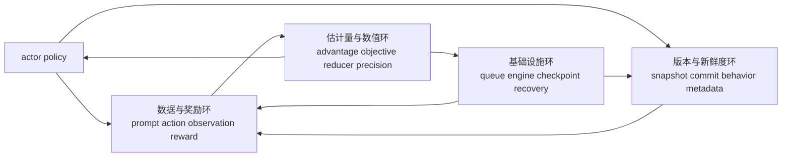
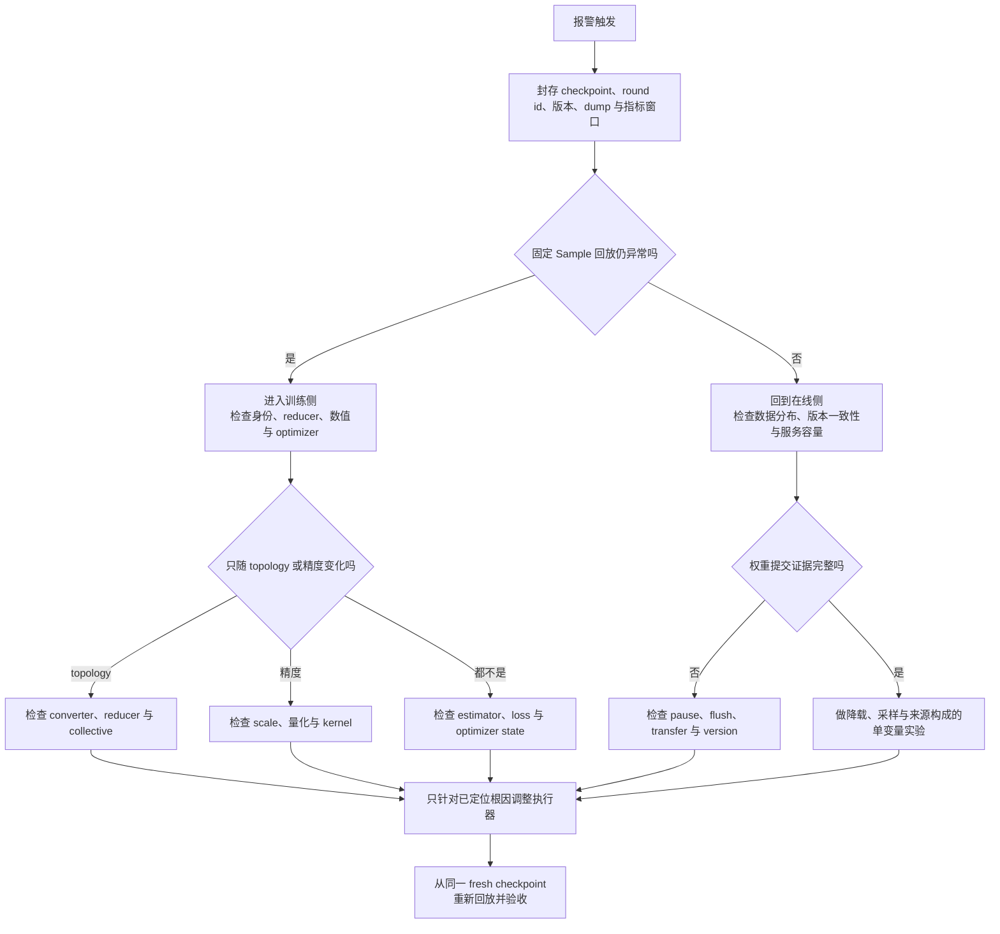

# slime 后训练稳定性：把“发散”拆成四个可判别控制环

> **源码基线**：slime `main@681b3adca54105d5ecd3fb822fa0dc58a427e0f9`
> **文档基线**：同一提交下 `docs/zh/{advanced/fault-tolerance,developer_guide/debug}.md` 与 `examples/fully_async/README.md`
> **核验日期**：2026-08-18 · **系列**：[[02_engineering/04_posttrain_frameworks/slime/index|slime 源码分析]]
> **结论先行**：后训练“稳定性”不是由某一个优化器参数决定的，而是四个具有不同反馈延迟的闭环必须同时正常工作：数据/奖励环决定学什么，策略版本环决定样本由哪个版本产生，估计量/数值环决定这些样本如何变成梯度，基础设施环决定状态能否持续推进。KL、clip fraction、reward、grad norm 或重启次数都只是某个闭环的观测指标；应先通过固定样本回放和版本/标识信息划分故障范围，再调整 clipping、过滤或重启策略，避免只是压低症状，却继续训练错误目标。
> **叙事顺序**：本页按五拍组织——背景 → 为什么这么设计（含被否掉的替代）→ 实现思路与细节 → 约束 → 发展趋势。
> **最近更新**：2026-08-27。按五拍重排章节顺序，把原“边界与设计评价”拆成第 2 拍（设计评价）与第 12 节（约束），并补写第 5 拍；机制正文与既有引用未改。

本文是**诊断综合页**，不重复机制页的实现细节：Sample 与 DataSource 归 [[12_slime_sample_datasource_analysis]]，loss 统计归 [[15_slime_loss_parallelism_analysis]]，权重提交归 [[16_slime_weight_sync_analysis]]，训推一致性归 [[17_slime_train_inference_consistency_analysis]]，恢复与取证归 [[18_slime_fault_tolerance_observability_analysis]]，精度轴归 [[22_slime_low_precision_training_rollout_analysis]]，agent fanout 归 [[24_slime_agent_workflow_examples_analysis]]。下文带 fixed-commit 定位符的是源码、测试或项目文档事实；标为“分析判断”的因果、阈值选择和处置优先级不是作者原话。

## 1. 为什么“loss 没有 NaN”远远不等于稳定

策略更新会改变后续数据分布，数据选择又改变下一次梯度；生成和训练可能观察不同权重版本、不同采样支持集或不同 kernel；系统负载与失败还会改变哪些样本先完成、被过滤或被重做。于是一个表面症状通常不唯一对应一个原因：

| 控制环 | 要稳定的内容 | 主要反馈延迟 | slime 中可直接调整的机制 | 最容易误用的“修复” |
|---|---|---|---|---|
| 数据/奖励 | prompt 来源、动作/观察边界、reward 尺度、入选分布 | 生成与 verifier 后才见结果 | DataSource、RM、dynamic/sample filter、`loss_mask` | 过滤所有难样本，让 reward 曲线看起来更好 |
| 版本/时效性 | 行为策略标识、样本年龄、采样候选集 | rollout、训练、权重提交之间至少相隔一拍 | 更新频率、pause/flush、partial mask、行为策略校正 | 直接截断概率比，把混版本或错误 logprob 当成普通离策略偏差 |
| 估计量/数值 | 分组基线、advantage、归约统计口径、梯度有限性 | 一个训练步到若干次更新后显现 | 估计量、KL、clip、归约器和精度配置 | 只降学习率或增加 clipping，忽略分母或拓扑已经改变 |
| 基础设施 | 队列推进、推理引擎活性、提交/恢复点 | 心跳、长尾和 checkpoint 周期 | 并发数、超时、局部恢复、checkpoint/回放 | 反复重启，恰好改变随机样本后误判为已修复 |

> **分析判断**：四环必须按“身份与版本 → 目标函数 → 数值 → 性能/存活”逐层证伪。越靠后的补丁越容易掩盖靠前的契约错误：gradient clipping 能限制错误梯度的幅值，却不能把错误 token 变成正确动作；engine restart 能恢复进程，却不能证明恢复后的权重或 DataSource cursor 正确。

## 2. 为什么这么设计：把举证责任分给四个环，而不是一个总的稳定标志

slime 已提供形成诊断闭环所需的大部分钩子：语义化 Sample、行为策略元数据、版本字段、rollout/训练数据导出、按 rollout 归约、偏差/截断指标、版本化权重提交和推理引擎局部恢复。**分析判断**：根据固定基线，可以把这一设计理解为让每个责任主体提供自己掌握的证据，而不是用一个总的 `stable=true` 掩盖跨系统差异。

## 3. 五个常被混用的词，实际上回答不同问题

| 概念 | 它回答的问题 | 固定基线中的证据 | 不能推出什么 |
|---|---|---|---|
| **version** | 这段生成声称使用哪个 serving 权重快照 | updater 递增 `weight_version`，并把它传给 engine update；SGLang meta 中的版本被追加到 `Sample.weight_versions`。[`update_weight_from_distributed.py:103-134`](https://github.com/THUDM/slime/blob/681b3adca54105d5ecd3fb822fa0dc58a427e0f9/slime/backends/megatron_utils/update_weight/update_weight_from_distributed.py#L103-L134) [`update_weight_from_distributed.py:248-257`](https://github.com/THUDM/slime/blob/681b3adca54105d5ecd3fb822fa0dc58a427e0f9/slime/backends/megatron_utils/update_weight/update_weight_from_distributed.py#L248-L257) [`types.py:397-416`](https://github.com/THUDM/slime/blob/681b3adca54105d5ecd3fb822fa0dc58a427e0f9/slime/utils/types.py#L397-L416) | 同版本的 Megatron 与 SGLang 一定给出相同 logprob |
| **consistency** | 权重、输入、采样支持集、路由和 kernel 的语义是否可比 | loss 可报告 train/rollout selected-token logprob 绝对差；严格分层定位见一致性页。[`loss.py:1136-1151`](https://github.com/THUDM/slime/blob/681b3adca54105d5ecd3fb822fa0dc58a427e0f9/slime/backends/megatron_utils/loss.py#L1136-L1151) | 进程健康或 checkpoint 完整 |
| **commit** | 一个新 serving 版本何时对请求可见 | 在线 updater 按 pause → flush → 传输/后处理 → continue 排序。[`update_weight_from_distributed.py:103-134`](https://github.com/THUDM/slime/blob/681b3adca54105d5ecd3fb822fa0dc58a427e0f9/slime/backends/megatron_utils/update_weight/update_weight_from_distributed.py#L103-L134) | 传输失败时能自动回滚到旧版本 |
| **recovery** | 进程或持久状态丢失后从哪里继续 | monitor 标死 engine；后续更新前重建可更新 engine并重新接入权重。[`health_monitor.py:145-177`](https://github.com/THUDM/slime/blob/681b3adca54105d5ecd3fb822fa0dc58a427e0f9/slime/utils/health_monitor.py#L145-L177) [`actor.py:592-636`](https://github.com/THUDM/slime/blob/681b3adca54105d5ecd3fb822fa0dc58a427e0f9/slime/backends/megatron_utils/actor.py#L592-L636) | 未完成请求 exactly-once、partial buffer 被持久化 |
| **replay** | 固定同一批 Sample 后，训练路径是否仍复现异常 | `--load-debug-rollout-data` 跳过在线 generation，继续 converter/training；项目 debug 指南把它用于固定训练输入。[`rollout.py:671-720`](https://github.com/THUDM/slime/blob/681b3adca54105d5ecd3fb822fa0dc58a427e0f9/slime/ray/rollout.py#L671-L720) [`debug.md:26-55`](https://github.com/THUDM/slime/blob/681b3adca54105d5ecd3fb822fa0dc58a427e0f9/docs/zh/developer_guide/debug.md#L26-L55) | 在线调度、工具副作用和原始采样顺序被复现 |

另有两个名字相似但统计含义不同的 id：主循环的 `rollout_id` 是 round/checkpoint 进度；`Sample.rollout_id` 是一次逻辑 execution 的训练归一化身份。后者在 compact fanout 中由 siblings 共享，不能拿 round id 代替。[`train.py:49-80`](https://github.com/THUDM/slime/blob/681b3adca54105d5ecd3fb822fa0dc58a427e0f9/train.py#L49-L80) [`types.py:93-106`](https://github.com/THUDM/slime/blob/681b3adca54105d5ecd3fb822fa0dc58a427e0f9/slime/utils/types.py#L93-L106) [`rollout.py:799-814`](https://github.com/THUDM/slime/blob/681b3adca54105d5ecd3fb822fa0dc58a427e0f9/slime/ray/rollout.py#L799-L814)

## 4. 初步诊断：先做能够区分原因的实验

下表中的“首个动作”是**分析判断**，目的是最大化信息增益，不是统一阈值处方。阈值必须由模型、reward 尺度、更新幅度与已知健康 run 校准。

| 症状 | 先看什么 | 最可能破坏的不变量 | 判别实验 | 首个干预 | 为什么常见动作可能是假修复 |
|---|---|---|---|---|---|
| train reward 升、eval/人工质量降 | source/reward category、重复率、截断率、长度分布 | verifier 与真实目标一致；入选数据仍覆盖原分布 | 按来源和错误类别重算 reward，人工审计高分/低分尾部 | 修 verifier、source 配额或模板边界 | 过滤低分只会让观测分布更“漂亮” |
| 零方差分组或动态过滤丢弃量激增 | `rollout/zero_std/*`、丢弃原因、有效批次的来源构成 | prompt 分组正确；过滤后分布与容量仍可接受 | 保存过滤前后样本，固定同一组离线重算 RM | 修正分组/RM；必要时按数据来源设置准入规则 | 增加超额采样能填满批次，却会放大选择偏差和系统负载 |
| KL 或 train/rollout logprob 差突增 | engine version、Sample 版本列表、temperature/top-p、路由、逐 token 首个分叉 | behavior metadata 与生成版本可归因；两侧概率定义相同 | 先核权重，再用同一 dump 重算；按层级关闭 top-p/routing/量化做二分 | 修提交/metadata/一致性；确认语义正确后才做 TIS | ratio clip 会把契约错误压成小梯度，无法恢复正确概率 |
| `pg_clipfrac`、TIS/OPSM rejection 高 | advantage 符号/尺度、policy age、mismatch 分位数、有效 mask 数 | clip 的输入确是合法但偏离的 behavior samples | 固定 batch，分别使用 rollout old-logprob 与 train-old-logprob 计算 | 缩短陈旧度或修 estimator；再调 clip | 提高拒绝率会降低有效 batch，可能把故障样本从指标分母中隐藏 |
| loss 有限但 grad norm 跳变，或出现 NaN/Inf | reward/advantage 分位数、mask 分母、grad norm、loss scale、精度配置 | 统计口径不随 DP/CP/mbs 改变；数值保持有限 | 使用同一 checkpoint 和数据导出结果，每次只改变归约器、拓扑或精度之一 | 修正分母或溢出来源，必要时临时回到高精度 | 降低学习率或裁剪梯度只能限制后果，错误归约器每步仍在优化错误目标 |
| 同一 dump 在 CP/DP/packing 改变后结果漂移 | rollout ids、mask sums、step GBS、loss/grad diff | topology 只改变执行位置，不改变估计量 | fresh restore 后对同一 dump 做 topology A/B | 修 converter/reducer/collective | “固定一个拓扑上线”绕过了 portability，未解释目标为何改变 |
| rollout 卡住、engine 被反复 kill | health timeout、request queue/e2e、最长样本、restart log | liveness failure 与容量慢请求能区分；恢复后重新入版 | 降低流量看 health 是否恢复；离线 replay trainer | 先处理容量/超时或 engine 故障域 | 放宽 timeout 会隐藏真死锁；缩短 timeout 又会把高负载误杀成故障 |
| 重启后短暂恢复，随后再次漂移 | 共同 checkpoint id、DataSource cursor、首批版本、相同 dump | 恢复切点完整；随机输入没有替代根因 | 从同一完整 checkpoint 和同一 dump 重跑两次 | 修恢复切点或原始异常 | 重启改变 queue、seed、batch composition，相关不等于修复 |

slime 默认已经记录 response length、zero-std group、repetition、truncation、request timing，并可按 reward category 输出占比；dynamic filter 另按 reason 计 drop 数。[`rollout.py:1352-1469`](https://github.com/THUDM/slime/blob/681b3adca54105d5ecd3fb822fa0dc58a427e0f9/slime/ray/rollout.py#L1352-L1469) [`rollout.py:1521-1528`](https://github.com/THUDM/slime/blob/681b3adca54105d5ecd3fb822fa0dc58a427e0f9/slime/ray/rollout.py#L1521-L1528) [`base_types.py:32-53`](https://github.com/THUDM/slime/blob/681b3adca54105d5ecd3fb822fa0dc58a427e0f9/slime/rollout/filter_hub/base_types.py#L32-L53) 这些是建立健康基线的材料，不是自动根因分类器。

## 5. 数据与奖励环：先问“被训练的动作究竟是什么”

### 5.1 不变量是 token 与奖励的来源关系，不只是 reward 数值

`Sample` 同时保存 prompt/token、reward、`loss_mask`、selected-token rollout logprob、weight versions、状态与自由 metadata；模型 token 必须带等长 logprob，工具/环境 token 不得带调用方 logprob并被追加为 mask 0。[`types.py:107-149`](https://github.com/THUDM/slime/blob/681b3adca54105d5ecd3fb822fa0dc58a427e0f9/slime/utils/types.py#L107-L149) [`types.py:253-302`](https://github.com/THUDM/slime/blob/681b3adca54105d5ecd3fb822fa0dc58a427e0f9/slime/utils/types.py#L253-L302) append 后还会验证 response、mask、logprob 和 top-p offsets 等长。[`types.py:418-443`](https://github.com/THUDM/slime/blob/681b3adca54105d5ecd3fb822fa0dc58a427e0f9/slime/utils/types.py#L418-L443)

因此 reward 异常的第一问不应是“标准差多大”，而是：reward 对应的是哪个 prompt group、哪个模型动作 span、哪类工具观察，以及它是否被 filter 改变了入选概率。默认 GRPO-like reward postprocess 只有在 sample 数等于规则 batch shape 时按 `n_samples_per_prompt` reshape；数量不规则时会把全部 reward 视为一组。[`rollout.py:722-747`](https://github.com/THUDM/slime/blob/681b3adca54105d5ecd3fb822fa0dc58a427e0f9/slime/ray/rollout.py#L722-L747)

> **分析判断**：若 reward group 或动作/观察边界错了，reward normalization 仍可能输出有限数字，甚至均值为零；有限性不是语义正确性。此时调 epsilon、clip 或 LR 都是在稳定错误标签。

### 5.2 filter 是闭环执行器，会改变训练分布

默认动态采样会不断提交 group，直到收满 `rollout_batch_size` 个通过者；drop 时记录 reason 并继续消耗候选，最后还会 abort 尚未完成的请求。[`sglang_rollout.py:393-451`](https://github.com/THUDM/slime/blob/681b3adca54105d5ecd3fb822fa0dc58a427e0f9/slime/rollout/sglang_rollout.py#L393-L451) 示例 zero-std filter 直接丢弃同组 reward 无差异的 group；fallback 版本只在候选不足时保留它。[`dynamic_sampling_filters.py:7-23`](https://github.com/THUDM/slime/blob/681b3adca54105d5ecd3fb822fa0dc58a427e0f9/slime/rollout/filter_hub/dynamic_sampling_filters.py#L7-L23)

这解决“无相对学习信号的 group 占用 batch”问题，却带来两个代价：保留下来的 prompt 分布不再等于 DataSource 原分布；drop 越多，rollout 服务承受的生成与 RM 工作越大。故而必须同时看 **filter 前后的来源/难度构成** 与 **系统 oversampling 成本**，不能只看最终 batch 的 reward std。

### 5.3 数据环的处置顺序

1. 从 rollout dump 抽样核对 prompt、token、mask、reward、status、source 和 trace；先修错位或 verifier。
2. 按 source、reward category、长度、截断、工具失败与 filter reason 分层；不要让总体均值抵消子群故障。
3. 对同一原始 group 离线重算 reward；若结果不稳定，问题在 RM/环境，不在 policy objective。
4. 只有 provenance 与 RM 稳定后，才决定 zero-std filter、source quota、oversampling 或 curriculum。

agent 场景尤其不能用“最终答案有 reward”替代动作边界审计：树状执行如何压成 fragments、哪些工具 token mask 为 0，应回到 [[24_slime_agent_workflow_examples_analysis]] 与 [[12_slime_sample_datasource_analysis]] 核验。

## 6. 策略版本与时效性环：区分“样本较旧”与“数据有错”

### 6.1 异步移动版本边界，但没有消灭它

`train_async.py` 会提前启动下一轮 generation，与当前训练重叠；到 `update_weights_interval` 边界时，它先等待在途 generation，再执行权重更新，源码注释明确是为了避免生成中途更新。[`train_async.py:25-40`](https://github.com/THUDM/slime/blob/681b3adca54105d5ecd3fb822fa0dc58a427e0f9/train_async.py#L25-L40) [`train_async.py:66-70`](https://github.com/THUDM/slime/blob/681b3adca54105d5ecd3fb822fa0dc58a427e0f9/train_async.py#L66-L70) fully-async worker 则跨 rollout calls 保持 background queue；它用完成队列做背压，把 ABORTED group 重新放回 DataSource，而不交给训练。[`fully_async_rollout.py:76-90`](https://github.com/THUDM/slime/blob/681b3adca54105d5ecd3fb822fa0dc58a427e0f9/slime/rollout/fully_async_rollout.py#L76-L90) [`fully_async_rollout.py:140-206`](https://github.com/THUDM/slime/blob/681b3adca54105d5ecd3fb822fa0dc58a427e0f9/slime/rollout/fully_async_rollout.py#L140-L206)

**分析判断**：`update_weights_interval > 1`、提前生成和预热队列都可能让“生成时 actor”落后于“训练时 actor”，这是有意用样本时效性换取阶段重叠；但训练前仍必须能够回答每个有效 token 的行为概率来自哪里。来源明确的陈旧样本可以校正，来源不明或概率定义错误的样本不可以。

### 6.2 版本列表是审计线索，不是完整 token-version map

`Sample.weight_versions` 是一个追加列表，但固定转换器传给训练器的默认字段包括 ids、mask、rollout logprob、top-p/routing 等，不包括 `weight_versions`。[`types.py:397-416`](https://github.com/THUDM/slime/blob/681b3adca54105d5ecd3fb822fa0dc58a427e0f9/slime/utils/types.py#L397-L416) [`rollout.py:749-852`](https://github.com/THUDM/slime/blob/681b3adca54105d5ecd3fb822fa0dc58a427e0f9/slime/ray/rollout.py#L749-L852) 因而默认版本历史主要留在 Sample 和调试数据导出中；若要在训练器内按样本年龄做准入控制，或按 token 版本加权，需要扩展转换器和元数据，而不能假设现有 loss 已经自动使用该列表。

中断后的续生成还可能跨越权重版本：默认会保留旧 token 区间的 mask；只有开启 `--mask-offpolicy-in-partial-rollout`，才会把旧 response mask 清零，只训练新区间。[`sglang_rollout.py:224-240`](https://github.com/THUDM/slime/blob/681b3adca54105d5ecd3fb822fa0dc58a427e0f9/slime/rollout/sglang_rollout.py#L224-L240) `weight_versions` 能提示“出现过多个版本”，但没有保存各版本对应的精确 token 偏移。**分析判断**：若业务需要按 token 区间执行样本时效策略，应显式记录版本边界；仅凭版本列表无法安全重建 token 到版本的映射。

### 6.3 同版本不等于一致，mismatch 也不等于陈旧

`train_rollout_logprob_abs_diff` 比较训练侧与 rollout selected-token logprob，但差异还可能来自 input/template、temperature/top-p 支持集、MoE routing、precision 或 kernel，而不只是权重 age。[`loss.py:1136-1151`](https://github.com/THUDM/slime/blob/681b3adca54105d5ecd3fb822fa0dc58a427e0f9/slime/backends/megatron_utils/loss.py#L1136-L1151) 诊断顺序应是：

1. 核验 serving commit/version 和权重；
2. 核验 tokens、mask 与采样参数/支持集；
3. MoE 再核路由，最后二分 kernel/precision；
4. 只有语义可比后，才把剩余 ratio 解释成 behavior-policy 陈旧度并选择 TIS/rejection。

这也是为什么“减小 PPO clip”不是版本修复：它限制 current/old ratio 的目标贡献，却不证明 `old_log_probs` 真的是产生该 token 的分布。

## 7. 估计量与数值环：要稳定的是统计口径，不只是数值幅度

### 7.1 归约器错误会在不报错的情况下改写目标函数

固定 converter 在仍能看到完整 step 时，按 `rollout_id` 累加所有 sibling 的 loss mask totals，再把 whole-rollout denominator 复制给每个 fragment；这使 fragments 被拆到不同 DP ranks/micro-batches 后仍合成一次逻辑 rollout mean。[`rollout.py:799-814`](https://github.com/THUDM/slime/blob/681b3adca54105d5ecd3fb822fa0dc58a427e0f9/slime/ray/rollout.py#L799-L814) advantage whitening 又在 DP-with-CP group 上聚合 masked statistics，空 response 的 CP rank 也必须参加 collective。[`loss.py:818-878`](https://github.com/THUDM/slime/blob/681b3adca54105d5ecd3fb822fa0dc58a427e0f9/slime/backends/megatron_utils/loss.py#L818-L878)

因此要区分两类异常：

- **数值尺度不稳定**：统计口径正确，但 reward、advantage 或概率比的尾部过大；clip、归一化和学习率调整可能有效。
- **统计口径被破坏**：分组、mask、rollout 分母或 DP/CP 归约器有误；任何幅值限制都无法恢复原目标。

判别方法是固定 checkpoint 与 dump，只改变 packing、mbs、DP/CP；同一统计目标的 loss/grad 应在既定数值容差内不变。完整 reducer 推导与测试归 [[15_slime_loss_parallelism_analysis]]。

### 7.2 clipping、TIS 与 rejection 只处理已定义的偏差

policy loss 报告 `pg_clipfrac`、`ppo_kl`、entropy；开启 mismatch/TIS 时还报告 OIS、TIS 与 clip fraction。[`loss.py:1094-1167`](https://github.com/THUDM/slime/blob/681b3adca54105d5ecd3fb822fa0dc58a427e0f9/slime/backends/megatron_utils/loss.py#L1094-L1167) vanilla TIS 对 train-old/rollout ratio 截断后乘 policy loss；ICEPOP 风格函数则把区间外 token 权重置零。[`loss.py:884-931`](https://github.com/THUDM/slime/blob/681b3adca54105d5ecd3fb822fa0dc58a427e0f9/slime/backends/megatron_utils/loss.py#L884-L931)

> **分析判断**：clip fraction 上升是“执行器工作得更多”，不是稳定性成功指标。它可能表示预期的 policy update，也可能表示陈旧、训推不一致或错 metadata。rejection 还能同时降低有效 token 数；若 dashboard 只看过滤后的 loss，最坏样本会从梯度和观测中一起消失。因此必须保留 rejection 前的 mismatch 分布、有效 mask 数与来源构成。

### 7.3 NaN/Inf 的最短二分路径

训练步执行 forward/backward 后由 optimizer 准备梯度并执行 step，记录 `grad_norm`；当前训练 logger 同时输出 loss 项、grad norm、LR 和实际 global batch size。[`model.py:641-698`](https://github.com/THUDM/slime/blob/681b3adca54105d5ecd3fb822fa0dc58a427e0f9/slime/backends/megatron_utils/model.py#L641-L698) [`model.py:876-904`](https://github.com/THUDM/slime/blob/681b3adca54105d5ecd3fb822fa0dc58a427e0f9/slime/backends/megatron_utils/model.py#L876-L904) 分布式 advantage whitening 用 FP32 汇总 sum、sum-square 与 mask count，global mask 为 0 时显式报错，并用 epsilon 稳定 rsqrt。[`distributed_utils.py:111-169`](https://github.com/THUDM/slime/blob/681b3adca54105d5ecd3fb822fa0dc58a427e0f9/slime/utils/distributed_utils.py#L111-L169)

出现非有限值时，每次只改变一个轴：

1. 固定 dump，检查 reward、advantage、ratio、mask denominator 首个非有限位置；
2. 保持数据与 topology 不变，把训练/通信/rollout/KV 的低精度轴分别回退；
3. 若高精度仍失败，查 estimator/reducer；若只在某精度轴失败，再下钻 scale、量化与 kernel；
4. 从同一 checkpoint 重跑，避免 optimizer 已被异常 step 污染。

例如 block-FP8 转换显式把全零 block 的 absmax clamp 到 `1e-12`，避免 scale 为零导致 `0/0`；这只是一个局部 guard，不能替代端到端 finite 检查。[`convert_hf_to_fp8.py:51-68`](https://github.com/THUDM/slime/blob/681b3adca54105d5ecd3fb822fa0dc58a427e0f9/tools/convert_hf_to_fp8.py#L51-L68) 七条独立精度轴与回退边界见 [[22_slime_low_precision_training_rollout_analysis]]。

## 8. 基础设施与存活环：进程恢复不等于训练状态正确

health monitor 对 `/health_generate` 失败的处理是 kill 整个逻辑 engine 的 ranks 并把 handles 设为 `None`；它不当场恢复。[`health_monitor.py:137-177`](https://github.com/THUDM/slime/blob/681b3adca54105d5ecd3fb822fa0dc58a427e0f9/slime/utils/health_monitor.py#L137-L177) 后续 trainer `update_weights()` 才调用 manager 恢复可更新 engine、重新连接并发送当前权重。[`actor.py:592-636`](https://github.com/THUDM/slime/blob/681b3adca54105d5ecd3fb822fa0dc58a427e0f9/slime/backends/megatron_utils/actor.py#L592-L636) [`rollout.py:641-658`](https://github.com/THUDM/slime/blob/681b3adca54105d5ecd3fb822fa0dc58a427e0f9/slime/ray/rollout.py#L641-L658)

项目 fault-tolerance 文档也把内置范围限定为 rollout server health/restart；trainer、Ray head 或 node failure 仍由外部作业恢复与 checkpoint 负责。[`fault-tolerance.md:7-27`](https://github.com/THUDM/slime/blob/681b3adca54105d5ecd3fb822fa0dc58a427e0f9/docs/zh/advanced/fault-tolerance.md#L7-L27) 因此基础设施环要分别验收：

| 层 | “恢复成功”的最低证据 | 仍需另验什么 |
|---|---|---|
| engine process | 新 actor health endpoint 可达 | 当前 serving version、首个生成请求 |
| weight commit | pause/flush/update/continue 完成 | 关键 tensor 或 logprob consistency |
| data progress | DataSource 从预期 cursor 继续 | 默认 partial buffer 未被透明恢复 |
| trainer | 参数、optimizer、scheduler 从同一 checkpoint 恢复 | DataSource state 是否存在相同 round id |
| request | 调用最终返回 | retry 是否重复了外部工具副作用 |

**分析判断**：queue time、e2e latency 和 health timeout 同时上升时，先做降载实验。若降载后 health 稳定，这是容量/长尾证据；若固定低载仍失败，才更像 engine liveness。直接调大 timeout 会降低误杀但延长真故障发现，直接调小则可能把饱和服务误判成 crash。

## 9. 跨环混杂因素：一个指标为什么能有四种解释

| 表面观测 | 数据/奖励解释 | 版本/一致性解释 | 估计量/数值解释 | 基础设施解释 |
|---|---|---|---|---|
| reward 突降 | verifier、source 或模板漂移 | 旧 policy 生成比例上升 | reward grouping/normalization 错 | timeout/abort/截断改变样本组成 |
| KL 突增 | prompt 难度或工具轨迹变了 | stale policy、错版本、采样支持集不一致 | old/ref/current 选错或 reducer 错 | engine 恢复后未正确入版 |
| clip fraction 突增 | 极端 reward 产生大 advantage | behavior age 或 train/rollout mismatch 增大 | clip 阈值/advantage 尺度改变 | backlog 让样本年龄增加 |
| grad norm 突增 | reward hacking、错误 mask | 混版本导致 ratio heavy tail | denominator、whitening、低精度 overflow | DP shard 缺样本或恢复后 batch 改变 |
| throughput 下降 | filter drop 增加了无效生成 | 更频繁 commit/pause | NaN skip、额外 old-policy forward | queue 饱和、engine 降容、重启 |

这张表的用途不是穷举，而是阻止单指标直接跳到单原因。最强判别器通常不是再加一个聚合指标，而是**固定一个边界**：固定 Sample 后故障仍在，优先查 estimator/numerical/trainer；只在线出现，优先查数据分布、version/consistency 或 infrastructure；只随 topology 出现，优先查 reducer/collective。

## 10. 从报警到根因的决策顺序

图中第一处分叉最关键：固定 Sample 后仍失败，问题优先落在训练输入之后；只在线出现，才优先回查数据、策略版本和基础设施。后续每条支路仍遵守一次只改变一个轴。

1. **封存证据，不先重启**：记录 checkpoint/round id、engine versions、配置、rollout dump、train dump、filter reasons 与 health/queue 时间窗。
2. **查身份与形状**：验证 tokens、response span、mask、selected-token logprob、top-p/routing payload、prompt group 与 logical rollout id。
3. **查版本提交**：确认异常 batch 生成于哪个已提交 serving version；partial/fanout 是否跨版本或跨 execution。
4. **做 replay 分叉**：同一 checkpoint + rollout dump 重跑 trainer；在线异常消失则回到 rollout/version/infrastructure，仍存在则进入 estimator/numerical。
5. **做单变量 A/B**：依次改变 reducer/topology、precision、sampling replay 或 engine load；一次只动一个轴。
6. **最后调执行器**：证明确为合法 heavy-tail 后才调 reward normalization、KL、PPO/TIS clip、rejection、LR、grad clip 或 filter。
7. **恢复后重新验收**：health 只证明可达；还要检查 version、首批 logprob mismatch、有效 token 数、来源构成和共同 checkpoint id。

> **分析判断**：如果没有第 1–4 步，clipping/filtering/restart 的“有效”通常只表示异常不再出现在当前聚合曲线上。它没有证明原始 invariant 恢复，也没有证明下一批数据不会再次触发。

## 11. 最小回放与验收方案

目标不是追求所有 GPU bitwise 相等，而是用最小矩阵回答“异常从哪一层开始”。

### 11.1 生成一次证据包

1. 从已知 checkpoint 启动短 run，开启 rollout dump 与 train dump；保留完整启动配置、源码 commit 和 engine version。
2. 保存**过滤前审计样本**或至少记录 filter reason/source 分布；默认 rollout dump 保存的是交给后续转换的 Samples，不能替代所有被拒候选的审计。
3. 在异常前后各取一个 batch，记录 reward/length/truncation、有效 mask、KL/mismatch、clip/reject、grad norm、queue/health。

rollout dump 用 `Sample.to_dict()` 保存语义记录；train dump 把 response-token tensors 还原成 per-sample 结构并可按 `sample_index` 与 rollout 侧 join。[`rollout.py:703-720`](https://github.com/THUDM/slime/blob/681b3adca54105d5ecd3fb822fa0dc58a427e0f9/slime/ray/rollout.py#L703-L720) [`debug.md:43-55`](https://github.com/THUDM/slime/blob/681b3adca54105d5ecd3fb822fa0dc58a427e0f9/docs/zh/developer_guide/debug.md#L43-L55)

### 11.2 四次受控运行

| 运行 | 固定项 | 唯一变化 | 通过条件 | 失败定位 |
|---|---|---|---|---|
| A replay-repeat | checkpoint、dump、配置、topology | 重启同一训练 run | sample join、loss、grad 在声明容差内重复 | trainer nondeterminism 或未固定状态 |
| B topology | 同一 fresh checkpoint 与 dump | DP/CP/mbs/packing | 逻辑 rollout loss/grad 在声明容差内不变 | converter、reducer、collective |
| C precision | 同一 fresh checkpoint、dump、topology | 一条 precision 轴 | 全部 finite；偏差在预算内且首处分叉可解释 | scale、量化、kernel |
| D 在线生成与回放对比 | 同一初始 checkpoint 与目标批次 | 在线生成 vs 固定 Sample | 数据来源和版本可解释；偏差不超过健康基线 | 数据、策略时效性、采样或推理服务 |

每次必须从**相同 fresh checkpoint**恢复；否则前一 run 的 optimizer update 会污染下一组比较。容差来自模型/拓扑的健康基线，不能把别的模型 CI 阈值直接移植为通用标准。

### 11.3 上线前的最小验收门槛

- 数据：抽样验证动作/观察 mask、group 与 rollout identity；source/filter 后分布没有未解释漂移。
- 版本：所有 engine 完成同一提交；跨版本 partial 有明确 mask 策略；版本历史可审计。
- 一致性：固定 token 上的 train/rollout logprob 差有模型专属基线；top-p/routing/precision 开关各自有对照。
- 估计量：同一 dump 对 packing 与目标 topology 不敏感；有效 token、rollout denominator 和 step GBS 可核对。
- 数值：loss、advantage、ratio、grad norm 与低精度 scale 全部 finite，尾部分位数有告警而非只看均值。
- 恢复：engine fault injection 后不仅恢复 health，还重新入版；作业恢复使用同 id 的 trainer checkpoint 与 DataSource state。

## 12. 约束：固定基线仍需部署方补齐的三层稳定性治理

固定基线仍有三个需要部署方补齐的稳定性治理层：

1. `weight_versions` 默认不进入训练输入字典，也不是 token 到版本偏移的映射；若要进行精细的样本时效性准入，需要扩展元数据和转换器。
2. dynamic/sample filter 会改变入选分布，但默认返回值与 rollout dump 只覆盖入选 Samples；严格审计所有被拒候选需要自定义 hook 或日志。[`sglang_rollout.py:393-465`](https://github.com/THUDM/slime/blob/681b3adca54105d5ecd3fb822fa0dc58a427e0f9/slime/rollout/sglang_rollout.py#L393-L465) [`rollout.py:703-720`](https://github.com/THUDM/slime/blob/681b3adca54105d5ecd3fb822fa0dc58a427e0f9/slime/ray/rollout.py#L703-L720)
3. trainer checkpoint 与 DataSource state 是顺序保存的两项动作；buffer 子类继承的 state payload 不包含内存 partial buffer。[`train.py:71-80`](https://github.com/THUDM/slime/blob/681b3adca54105d5ecd3fb822fa0dc58a427e0f9/train.py#L71-L80) [`data_source.py:123-160`](https://github.com/THUDM/slime/blob/681b3adca54105d5ecd3fb822fa0dc58a427e0f9/slime/rollout/data_source.py#L123-L160) [`data_source.py:168-222`](https://github.com/THUDM/slime/blob/681b3adca54105d5ecd3fb822fa0dc58a427e0f9/slime/rollout/data_source.py#L168-L222) **分析判断**：固定基线未提供把它们与 engine/request ledger 一起提交的全局原子 manifest，恢复成功必须按状态所有者分别举证。

因此合理的稳定性目标不是“永不出现异常”，而是：每个异常都能被归入一个最小故障域，用一次可重复的判别实验确认，干预后再以原 invariant 验收。做到这一点，clipping、filtering、recovery 才是控制器；否则它们只是把报警声调小。

## 13. 发展趋势：估计量环上两处被源码自己标记的未决问题

本拍只写在固定基线中能直接读到锚点的待办，不写没有源码依据的路线图。

1. **advantage 归一化仍是一个未定的统计约定。** advantage 计算路径上的注释直接写出了分歧：`TODO: OpenRLHF always does advantages normalization but veRL doesn't seem to do it.`，紧随其后才是 `if args.normalize_advantages:` 分支。[`loss.py:818-819`](https://github.com/THUDM/slime/blob/681b3adca54105d5ecd3fb822fa0dc58a427e0f9/slime/backends/megatron_utils/loss.py#L818-L819) 也就是说，它在固定基线里是一个显式开关，而不是已经收敛的默认口径；本页第 7 节区分“数值尺度不稳定”与“统计口径被破坏”时，正建立在它属于可切换项这一事实上。
2. **首步 `ppo_kl` 为什么不严格为零仍未定论。** CI 的 KL checker 在 `step_id == 0` 时断言 `train/ppo_kl < 1e-8`，断言上方的注释写着 “figure out why KL is not exactly zero when using PPO loss with KL clipping, and whether this is expected behavior or a bug”。[`model.py:901-904`](https://github.com/THUDM/slime/blob/681b3adca54105d5ecd3fb822fa0dc58a427e0f9/slime/backends/megatron_utils/model.py#L901-L904) 紧接着的注释另记录了一条已知例外：R3 会为 actor 路径回放 rollout routing，而 ref logprob 走普通 routing，因此初始 actor/ref KL 本就不应严格为零。[`model.py:905-907`](https://github.com/THUDM/slime/blob/681b3adca54105d5ecd3fb822fa0dc58a427e0f9/slime/backends/megatron_utils/model.py#L905-L907)

> [!note] 推断
> 上面两条注释与断言本身是源码事实。由它们推出的方向——本页第 4 节“KL 或 train/rollout logprob 差突增”一行的判别阈值，在这两处未决之前只能按模型自行校准，不能引用一个跨模型的通用常数——是本页依据当前代码作出的推断；源码只标记了未决问题，没有陈述计划或结论。

## Related Pages

- [[12_slime_sample_datasource_analysis]] — token provenance、partial、fanout identity 与 replay 所依赖的数据契约。
- [[15_slime_loss_parallelism_analysis]] — 估计量、归约统计口径以及 DP/CP/拓扑不变性的机制详解。
- [[16_slime_weight_sync_analysis]] — version、pause/flush、transport 与 serving commit 的完整协议。
- [[17_slime_train_inference_consistency_analysis]] — 从权重到输入、采样、路由、kernel 的 mismatch 分层定位。
- [[18_slime_fault_tolerance_observability_analysis]] — engine recovery、共同 checkpoint、trace 与 dump 的恢复边界。
- [[22_slime_low_precision_training_rollout_analysis]] — 参数、计算、通信、rollout 与 KV cache 的独立精度轴。
- [[24_slime_agent_workflow_examples_analysis]] — 工具环境、compact fragments 与 reward/mask 语义的 agent 场景实例。
