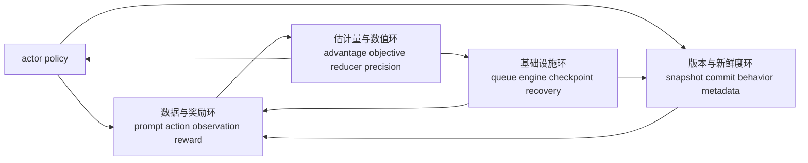
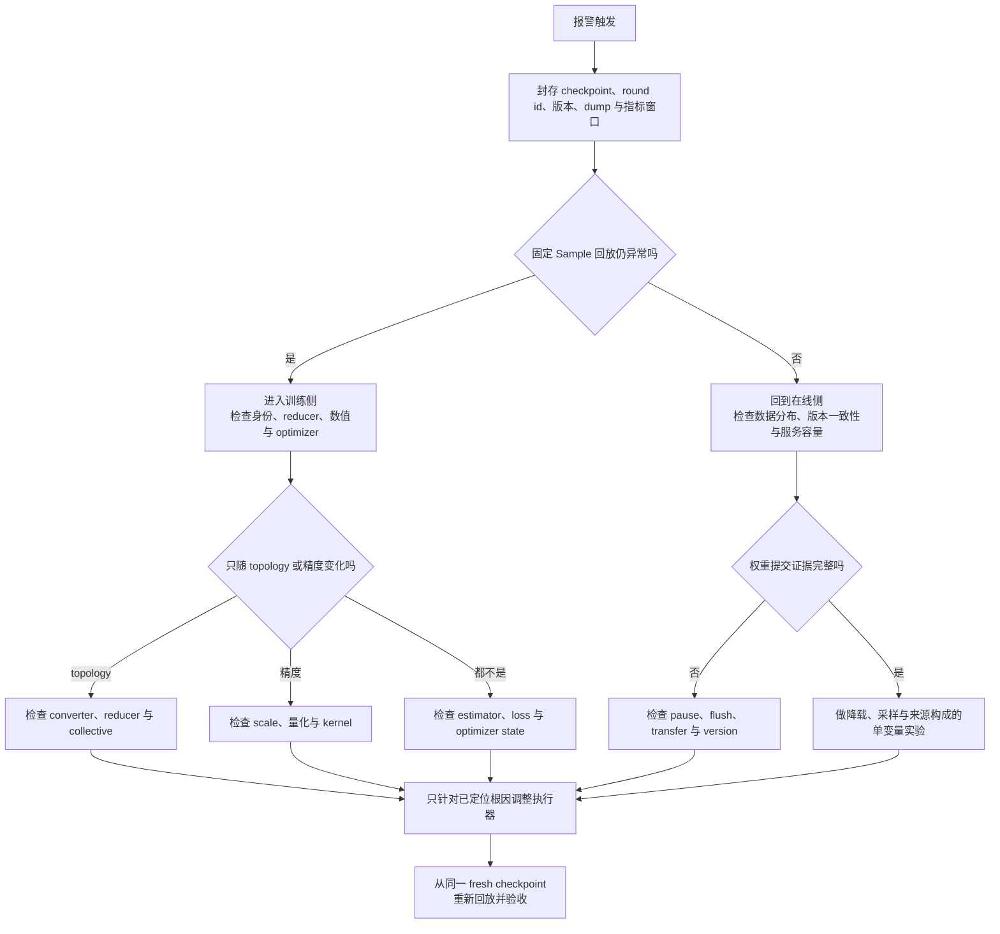

# slime 后训练稳定性：把“发散”拆成四个可判别控制环

> **源码基线**：`THUDM/slime@4c193f1f37509cca70f0e88807a9305b70f63f4e`（`main`，2026-09-03）
> **源码基线**：`NVIDIA/Megatron-LM@1dcf0dafa884`（`dev`，2026-02-14）
> **主题**：先把训练稳定性拆成数据/奖励、策略版本、估计量/数值与基础设施四个控制环，再给出症状判别表、指标出现条件与参数用途。随后逐环讨论判别实验，并覆盖进程级崩溃与单步调试、跨环混杂、决策顺序、最小回放矩阵与部署方治理缺口。
> **适用范围**：slime 训练的稳定性诊断方法；KL 轴与归约统计归 [[15_slime_loss_parallelism_analysis|Loss 与并行归一化]]，TIS/MIS 与训推一致性归 [[17_slime_train_inference_consistency_analysis|训推一致性]]，恢复链与指标落点归 [[18_slime_fault_tolerance_observability_analysis|容错与可观测性]]，通用 FAQ 归 [[02_slime_quickstart_and_configuration_guide|快速上手与配置]]。
> **最近更新**：2026-09-17。本页覆盖四环诊断框架、各指标的出现条件与结构性零值、默认估计器下 `--kl-coef` 的实际作用、NaN 检查与跳步，以及 IMA 与 Ray 调试入口。

后训练“稳定性”不是由某一个优化器参数决定的，而是四个具有不同反馈延迟的闭环必须同时正常工作：数据/奖励环决定学什么，策略版本环决定样本由哪个版本产生，估计量/数值环决定这些样本如何变成梯度，基础设施环决定状态能否持续推进。KL、clip fraction、reward、grad norm 或重启次数都只是某个闭环的观测指标；应先通过固定样本回放和版本/标识信息划分故障范围，再调整 clipping、过滤或重启策略，避免只是压低症状，却继续训练错误目标。

本文是**诊断综合页**，不重复机制页的实现细节：Sample 与 DataSource 归 [[12_slime_sample_datasource_analysis|Sample 与 DataSource]]，loss 统计与 KL 轴归 [[15_slime_loss_parallelism_analysis|Loss 与并行归一化]]，权重提交归 [[16_slime_weight_sync_analysis|权重同步]]，训推一致性归 [[17_slime_train_inference_consistency_analysis|训推一致性]]，恢复、取证与指标落点归 [[18_slime_fault_tolerance_observability_analysis|容错与可观测性]]，精度轴归 [[22_slime_low_precision_training_rollout_analysis|低精度训练与推理]]，agent fanout 归 [[24_slime_agent_workflow_examples_analysis|Agent 工作流示例]]。源码、测试和项目文档证据集中在文末 §14 源码阅读路线；标为“分析判断”的因果、阈值选择和处置优先级不是作者原话。

## 1. 为什么“loss 没有 NaN”远远不等于稳定

策略更新会改变后续数据分布，数据选择又改变下一次梯度；生成和训练可能观察不同权重版本、不同采样支持集或不同 kernel；系统负载与失败还会改变哪些样本先完成、被过滤或被重做。于是一个表面症状通常不唯一对应一个原因：

```mermaid
flowchart LR
    P["actor policy"] --> D["数据与奖励环<br/>prompt action observation reward"]
    D --> E["估计量与数值环<br/>advantage objective reducer precision"]
    E --> P
    P --> V["版本与新鲜度环<br/>snapshot commit behavior metadata"]
    V --> D
    I["基础设施环<br/>queue engine checkpoint recovery"] --> D
    I --> V
    E --> I
```

| 控制环 | 要稳定的内容 | 主要反馈延迟 | slime 中可直接调整的机制 | 最容易误用的“修复” |
|---|---|---|---|---|
| 数据/奖励 | prompt 来源、动作/观察边界、reward 尺度、入选分布 | 生成与 verifier 后才见结果 | DataSource、RM、dynamic/sample filter、`loss_mask` | 过滤所有难样本，让 reward 曲线看起来更好 |
| 版本/时效性 | 行为策略标识、样本年龄、采样候选集 | rollout、训练、权重提交之间至少相隔一拍 | 更新频率、pause/flush、partial mask、行为策略校正 | 直接截断概率比，把混版本或错误 logprob 当成普通离策略偏差 |
| 估计量/数值 | 分组基线、advantage、归约统计口径、梯度有限性 | 一个训练步到若干次更新后显现 | 估计量、KL、clip、归约器和精度配置 | 只降学习率或增加 clipping，忽略分母或拓扑已经改变 |
| 基础设施 | 队列推进、推理引擎活性、提交/恢复点 | 心跳、长尾和 checkpoint 周期 | 并发数、超时、局部恢复、checkpoint/回放 | 反复重启，恰好改变随机样本后误判为已修复 |

> **分析判断**：四环必须按“身份与版本 → 目标函数 → 数值 → 性能/存活”逐层证伪。越靠后的补丁越容易掩盖靠前的契约错误：gradient clipping 能限制错误梯度的幅值，却不能把错误 token 变成正确动作；engine restart 能恢复进程，却不能证明恢复后的权重或 DataSource cursor 正确。

## 2. 为什么这么设计：把举证责任分给四个环，而不是一个总的稳定标志

slime 已提供形成诊断闭环所需的大部分钩子：语义化 Sample、行为策略元数据、版本字段、rollout/训练数据导出、按 rollout 归约、偏差/截断指标、版本化权重提交和推理引擎局部恢复。**分析判断**：可以把这一设计理解为让每个责任主体提供自己掌握的证据，而不是用一个总的 `stable=true` 掩盖跨系统差异。代价是读数的人必须知道每个指标由谁生产、在什么配置下才有信息量——§4.1 专门处理这一点。

## 3. 五个常被混用的词，实际上回答不同问题

| 概念 | 它回答的问题 | 源码中的证据 | 不能推出什么 |
|---|---|---|---|
| **version** | 这段生成声称使用哪个 serving 权重快照 | updater 每次 `update_weights` 递增 `weight_version` 并随权重下发；SGLang 返回的 `meta_info["weight_version"]` 由 `Sample._apply_meta_info` 追加到 `Sample.weight_versions` | 同版本的 Megatron 与 SGLang 一定给出相同 logprob |
| **consistency** | 权重、输入、采样支持集、路由和 kernel 的语义是否可比 | loss 报告 `train/train_rollout_logprob_abs_diff`，即训练侧与 rollout selected-token logprob 的绝对差；严格分层定位见 [[17_slime_train_inference_consistency_analysis\|训推一致性]] | 进程健康或 checkpoint 完整 |
| **commit** | 一个新 serving 版本何时对请求可见 | 在线 updater 按 pause → flush → 传输/后处理 → continue 排序 | 传输失败时能自动回滚到旧版本 |
| **recovery** | 进程或持久状态丢失后从哪里继续 | 仅在 `--use-fault-tolerance` 下：监控线程把失败的逻辑 engine 整组标死（槽位置 `None`）；训练侧下一次 `update_weights` 入口先重建空槽 engine，再重新连接并推送权重 | 未完成请求 exactly-once、partial buffer 被持久化 |
| **replay** | 固定同一批 Sample 后，训练路径是否仍复现异常 | `--load-debug-rollout-data` 在解析时置 `debug_train_only`、不启动 SGLang，按 `rollout_id` 读回 dump 后继续 converter/training；项目 debug 指南把它用于固定训练输入 | 在线调度、工具副作用和原始采样顺序被复现；回放时也没有 rollout 侧 `rollout/*` 采样指标 |

另有两个名字相似但统计含义不同的 id：主循环的 `rollout_id` 是 round/checkpoint 进度；`Sample.rollout_id` 是一次逻辑 execution 的训练归一化身份。后者在 compact fanout 中由 siblings 共享，converter 据此累加 `rollout_mask_sums`，不能拿 round id 代替。

## 4. 初步诊断：先做能够区分原因的实验

下表中的“首个动作”是**分析判断**，目的是最大化信息增益，不是统一阈值处方。阈值必须由模型、reward 尺度、更新幅度与已知健康 run 校准；表中每个指标能否提供信息，先按 §4.1 核对出现条件。

| 症状 | 先看什么 | 最可能破坏的不变量 | 判别实验 | 首个干预 | 为什么常见动作可能是假修复 |
|---|---|---|---|---|---|
| train reward 升、eval/人工质量降 | `rollout/raw_reward`、`eval/{dataset}`、`rollout/error_cat/{category}`、`rollout/truncated_ratio`、`rollout/response_len/mean`；长响应再看 `rollout/repetition_frac` | verifier 与真实目标一致；入选数据仍覆盖原分布 | 按来源和错误类别重算 reward，人工审计高分/低分尾部；对照长度与 reward 的共同走势 | 修 verifier、source 配额或模板边界 | 过滤低分只会让观测分布更“漂亮” |
| 零方差分组或动态过滤丢弃量激增 | `rollout/dynamic_filter/drop_{reason}`（示例 zero-std filter 的 reason 为 `zero_std_{reward}`）、`rollout/zero_std/count_{reward}`、有效批次的来源构成 | prompt 分组正确；过滤后分布与容量仍可接受 | 保存过滤前后样本，固定同一组离线重算 RM | 修正分组/RM；必要时按数据来源设置准入规则 | 增加超额采样能填满批次，却会放大选择偏差和系统负载 |
| KL 或 train/rollout logprob 差突增 | 先分清 `rollout/kl`（仅 `--kl-coef≠0` 非零）、`train/kl_loss`（仅 `--use-kl-loss`）与 `train/ppo_kl`（默认每个 rollout 第 0 步为 0），再看 `train/train_rollout_logprob_abs_diff`，关联 Sample 版本和采样配置 | behavior metadata 与生成版本可归因；两侧概率定义相同 | 先核权重，再用同一 dump 重算；按层级关闭 top-p/routing/量化做二分 | 修提交/metadata/一致性；确认语义正确后才做 TIS | ratio clip 会把契约错误压成小梯度，无法恢复正确概率 |
| `pg_clipfrac`、TIS/OPSM rejection 高 | `train/pg_clipfrac`（先确认 old logprob 来源与训练步号）、`train/tis_clipfrac`、`train/opsm_clipfrac`；advantage 尾部与有效 mask 数需自建 | clip 的输入确是合法但偏离的 behavior samples | 固定 batch，分别使用 rollout old-logprob 与 train-old-logprob 计算 | 缩短陈旧度或修 estimator；再调 clip | 提高拒绝率会降低有效 batch，可能把故障样本从指标分母中隐藏 |
| loss 有限但 grad norm 跳变，或出现 NaN/Inf | `train/grad_norm`（开 `--no-check-for-nan-in-loss-and-grad` 时非有限值即该步被跳过）、`train/entropy_loss`、`train/global_batch_size`、`train/lr-pg_0`；reward/advantage 分位数与分母需 dump 自算 | 统计口径不随 DP/CP/mbs 改变；数值保持有限 | 使用同一 checkpoint 和数据导出结果，每次只改变归约器、拓扑或精度之一 | 修正分母或溢出来源，必要时临时回到高精度 | 降低学习率、裁剪梯度或打开跳步开关只能限制后果；错误归约器每步仍在优化错误目标，跳步还会静默减少有效更新 |
| 同一 dump 在 CP/DP/packing 改变后结果漂移 | `train/global_batch_size`、`train/loss`、`train/grad_norm`；rollout ids/mask sums 从 dump 核对 | topology 只改变执行位置，不改变估计量 | fresh restore 后对同一 dump 做 topology A/B | 修 converter/reducer/collective | “固定一个拓扑上线”绕过了 portability，未解释目标为何改变 |
| rollout 卡住、engine 被反复 kill | `perf/request/queue_time/max`、`perf/request/e2e_latency/max`、`rollout/response_len/max` 与 `--use-fault-tolerance` 下的 health/restart 日志 | liveness failure 与容量慢请求能区分；恢复后重新入版 | 降低流量看 health 是否恢复；离线 replay trainer | 先处理容量/超时或 engine 故障域 | 放宽 timeout 会隐藏真死锁；缩短 timeout 又会把高负载误杀成故障 |
| SGLang engine 报 illegal memory access 后崩溃 | engine 日志、`--sglang-mem-fraction-static`、投机采样/CUDA graph/DeepEP 开关 | 显存余量足够；kernel 与 padding 访问合法 | `CUDA_LAUNCH_BLOCKING=1` 后逐个开关投机采样、CUDA graph、DeepEP；必要时 CUDA core dump（§8.1） | 先按 OOM 调小 `--sglang-mem-fraction-static`，不消失再二分执行路径开关 | 容错重启能恢复进程，但确定性触发的 IMA 会在同类输入上复现 |
| 重启后短暂恢复，随后再次漂移 | 首批 `train/train_rollout_logprob_abs_diff`；共同 checkpoint id、cursor、版本和 dump 需文件/日志关联 | 恢复切点完整；随机输入没有替代根因 | 从同一完整 checkpoint 和同一 dump 重跑两次 | 修恢复切点或原始异常 | 重启改变 queue、seed、batch composition，相关不等于修复 |

slime 默认在 rollout 侧记录 response length、zero-std group、repetition、truncation、prefix cache 与 request timing，并可按 reward category 输出占比；dynamic filter 另按 reason 计 drop 数；训练 actor 在算完 advantage 后再汇总一组训练侧 `rollout/*` 键，可选输出 `passrate/*` 与 `multi_turn/*`。这些是建立健康基线的材料，不是自动根因分类器；其中几项在常见配置下结构性为零，读数前先核对下一节。

### 4.1 指标键、出现条件与结构性零值

`rollout/*` 前缀有两个生产者：`RolloutManager.generate` 在生成结束后按入选 Sample 计算采样指标；训练 actor 在 `compute_advantages_and_returns` 之后按 `rollout_data` 字段汇总。两者默认以 `rollout/step`（即 rollout id）为 x 轴，`train/*` 以 `train/step`（rollout id × 每轮步数 + 步号）为 x 轴；`--wandb-always-use-train-step` 会把 rollout 侧 x 轴换算成训练步，完整落点见 [[18_slime_fault_tolerance_observability_analysis|容错与可观测性]]。

| 控制环 | 现成 key | 出现条件 | 结构性为零或失真的情形 |
|---|---|---|---|
| 数据/奖励（采样侧） | `rollout/response_len/{mean,median,min,max}`、`rollout/truncated_ratio`、`rollout/repetition_frac` | 每轮生成后按返回的入选 Samples 计算；长度按 `loss_mask` 之和（effective length） | `repetition_frac` 只把长度超过 10000 字符、且末 10000 字符 zlib 压缩比大于 10 的响应算作重复，短响应恒为 0；`--load-debug-rollout-data` 回放时整组不输出；`--custom-rollout-log-function-path` 返回真值时整体替换 |
| 同组无差异 | `rollout/zero_std/count_{reward}` | 非 `ppo` 估计器；按 `group_index` 分组 | 只统计入选组：开示例 zero-std dynamic filter 后被丢弃的组不计入（`check_reward_nonzero_std` 下入选组都有差异，函数返回空字典，键根本不出现而不是 0；fallback 版只计因候选不足而保留的组），丢弃量要看 `rollout/dynamic_filter/drop_zero_std_{reward}`；键名里 float reward 保留一位小数（`count_0.0`），int 或 bool reward 为 `count_0`、`count_1` |
| 采样支持集 | `rollout/top_p_kept_vocab_per_token` | 只在 Sample 带 top-p 候选 ids 与 offsets 时计算（`rollout_top_p≠1` 才请求 ids） | 跳过 `remove_sample` 样本与 `loss_mask` 为 0 的 token；没有可计的 token 时键不出现；它是 top-p 保留词表大小的均值，熵塌缩时下降，但不区分塌缩来自 policy 还是温度/top-p 配置（分析判断） |
| 过滤与错误类别 | `rollout/dynamic_filter/drop_{reason}`、`rollout/error_cat/{category}` | 前者要求 filter 返回非空 reason；后者要求 `--log-reward-category` 且 reward 为可索引字典 | 本轮收满后被 abort 的在途请求不进入任何 drop 计数 |
| 奖励与估计量汇总（训练侧） | `rollout/raw_reward`、`rollout/rewards`、`rollout/advantages`、`rollout/returns`、`rollout/kl`；条件出现 `rollout/log_probs`、`rollout/ref_log_probs`、`rollout/rollout_log_probs`、`rollout/entropy` | 训练 actor 汇总；log-prob 类键只在对应前向真正执行时存在，`rollout/entropy` 还要求 `--use-rollout-entropy` | 默认 `grpo` 且开 reward 归一化时 `rollout/rewards` 是组内减均值后的值，`rollout/advantages` 同理，均值约为 0（分析判断，由组内减均值推出），reward 趋势要看 `rollout/raw_reward`；`rollout/kl` 仅 `--kl-coef≠0` 时非零，对全部 response token 取均值、不看 `loss_mask`；单步可复用 logprob 时没有 `rollout/log_probs` |
| 通过率与多轮 | `passrate/pass@{1,2,4,…}`、`multi_turn/*` | 分别要求 `--log-passrate`（且 `n_samples_per_prompt>1`）与 `--log-multi-turn` | pass@k 只把 raw reward 恰为 1 的样本算作通过，并且只在过滤后的入选组上计算；zero-std filter 丢掉全对/全错组后，pass@k 不再代表原分布（分析判断） |
| current/old 更新幅度 | `train/ppo_kl`、`train/pg_clipfrac` | 每个训练步输出；GSPO 使用序列口径，不是 ref KL | 每个 rollout 的第 0 步，old logprob 与 current 出自同一份权重：可复用 logprob 时（每轮一步、`policy_loss`、`kl_coef=0`、未开 `--use-rollout-logprobs`/`--get-mismatch-metrics`/critic/`--keep-old-actor`/OPD、非 GSPO 等）old 就是 current 的 detach，两键恒为 0；单独重算时只剩重算数值噪声。每个 rollout 只训一步时两键因此失去判别力；只有第 1 步以后，或 old 取自 `--use-rollout-logprobs`（含训推偏差与样本年龄）、`--keep-old-actor`（含权重版本差）时才反映偏离 |
| current/ref 约束 | `train/kl_loss` | 仅 `--use-kl-loss`，受 `--kl-loss-type`、`--use-unbiased-kl` 影响 | `--kl-loss-coef` 默认 0：键照常报告，但对梯度贡献为 0；与 `rollout/kl` 不是同一数值 |
| 训推偏差 | `train/train_rollout_logprob_abs_diff` | batch 带 rollout logprob 时输出 | `--use-rollout-logprobs` 时比较 current，否则比较 train-old（可复用时即 current 的 detach）；不受第 0 步归零影响，是默认配置下观察陈旧度与训推偏差的主键 |
| 校正与拒绝 | `train/ois`、`train/tis`、`train/tis_clipfrac`、`train/tis_abs`、`train/opsm_clipfrac` | OIS/TIS 由 `--use-tis` 或 `--get-mismatch-metrics` 路径产生，自定义函数可能改指标集；OPSM 需 `--use-opsm` | `train/ois` 等于 `exp(-ppo_kl)`，第 0 步同样恒为 1；OPSM 的序列 KL 也取 old 与 current，未开 `--use-rollout-logprobs` 时第 0 步不掩码，`opsm_clipfrac` 为 0 或只含重算噪声 |
| 数值与消费 | `train/entropy_loss`、`train/grad_norm`、`train/global_batch_size`、`train/lr-pg_0` | actor 默认前缀；critic 使用 `train/critic-...` | 开 `--no-check-for-nan-in-loss-and-grad` 时被跳过的步仍输出一行，`train/grad_norm` 为 NaN 或 Inf，没有单独计数（§7.3） |
| 系统节拍 | `perf/request/{queue_time,e2e_latency}/{mean,median,min,max}`、`perf/train_wait_time`、`perf/wait_time_ratio`、`perf/step_time`、`perf/update_weights_time` | 请求键来自 SGLang `meta_info`，slime 管理的 engine 在启动参数里强制 `enable_metrics=True`，字段含义属 SGLang 上游契约；训练节拍键由计时器导出，诊断映射归 [[30_slime_rollout_optimization_analysis\|Rollout 优化]] | external engine 未开指标时请求键缺失（分析判断） |

Sample 版本年龄、token→version 偏移、advantage/ratio 的 p95/p99、有效 mask 总数、过滤前后来源联合分布、请求重试去重、恢复次数与跳步次数没有统一默认 key。应从 dump/trace、custom hooks 或外部日志自行生成，明确字段来源和分母。MIS 示例中的 `tis_level/tis_mode/rs_*` 属于示例 YAML 配置，不是核心 `--tis-*` CLI。

`--log-correct-samples` 的 help 文案与 `--log-passrate` 一字不差（都写“turn on passrate logging”），实现却是另一件事：在训练侧汇总里挑出本 rank 上 raw reward 为 1 的样本，把长度分位 `correct_length/p25` 至 `correct_length/p100` 与以 `-log_probs` 近似的 `correct_entropy` 写回 `rollout_data`。文案与实现冲突，以实现为准。**分析判断**（按源码顺序推出，未运行）：写回发生在同一函数的 `rollout/*` 上报之后，本次调用不会把它们发给 tracker；它还直接读取 `rollout_data["log_probs"]`，而单步可复用 logprob 的配置没有这个键。

### 4.2 参数默认值与判别用途

| 参数组 | 默认值 | 适用实验与限制 |
|---|---|---|
| `--eps-clip` / `--eps-clip-high` / `--eps-clip-c` | 0.2 / 解析 None 后取 eps-clip / None | PPO 上下界与 dual clip；先确认 old logprob 正确 |
| `--value-clip` / `--clip-grad` | 0.2 / 1.0 | critic value 与优化器梯度限制，不能修复错误 mask |
| `--use-tis` / `--tis-clip` / `--tis-clip-low` | false / 2.0 / 0 | 与 `--use-rollout-logprobs`（默认 false）互斥 |
| `--custom-tis-function-path` / `--get-mismatch-metrics` | None / false | 开启 mismatch metrics 强制要求 custom function；具体 MIS 路径见 [[17_slime_train_inference_consistency_analysis\|训推一致性]] |
| `--use-opsm` / `--opsm-delta` | false / 1e-4 | 观察 `train/opsm_clipfrac` 与保留样本构成；old 与 current 同源时第 0 步不起作用 |
| `--kl-coef` / `--use-kl-loss` / `--kl-loss-coef` | 0 / false / 0 | `--kl-coef` 的 help 写“对 reward 塑形、在 advantage 之前生效”，只对 `ppo`、`reinforce_plus_plus`、`reinforce_plus_plus_baseline` 成立；默认 `grpo` 以及 `gspo`、`cispo` 的 returns 只借 KL 张量的形状广播 reward，与 KL 数值无关。此时设 `--kl-coef≠0` 只会加载 ref、多一次 ref 前向、关闭 logprob 复用（多一次 actor 前向）并让 `rollout/kl` 非零，目标函数不变。后两者把 KL 加进 loss；两个非零 KL 系数互斥。完整 KL 轴见 [[15_slime_loss_parallelism_analysis#2.2 从最小实例到整套 loss 层|KL 的两个入口]] |
| `--kl-loss-type` / `--use-unbiased-kl` | k1 / false | 类型仅 `k1/k2/k3/low_var_kl`，同时决定 `train/kl_loss` 与 `rollout/kl` 的估计器；unbiased 分支传 importance ratio |
| `--ref-update-interval` | None | 默认 ref 不更新；设置后不能跨参考版本直接比较 KL 曲线 |
| `--advantage-estimator` | grpo | 六选项：`grpo/gspo/cispo/reinforce_plus_plus/reinforce_plus_plus_baseline/ppo` |
| `--normalize-advantages` / `--disable-grpo-std-normalization` / `--disable-rewards-normalization` | false / 默认不禁用 / 默认不禁用 | 两种 reinforce_plus_plus estimator 必须显式加 `--normalize-advantages`，否则 `slime_validate_args` 在解析期断言失败（不会自动打开）；reward std 与 advantage whitening 是两个开关，`n_samples_per_prompt=1` 时自动关闭 std 归一化；关闭 reward 归一化后 `rollout/rewards` 才等于 raw reward |
| `--entropy-coef` / `--gamma` / `--lambd` | 0 / 1 / 1 | entropy 正则与回报/GAE 时间折扣，不改变 token 来源 |
| `--num-steps-per-rollout` / `--global-batch-size` | None / None | 决定每个 rollout 训几步；只训一步时 `train/ppo_kl`、`train/pg_clipfrac` 失去判别力，要观察更新幅度须多步，或换 old 来源 |
| `--use-rollout-logprobs` / `--keep-old-actor` | false / false | 决定 old logprob 取自 rollout 还是训练进程里的旧 actor；两者都关闭 logprob 复用，前者与 `--use-tis` 互斥 |
| `--no-check-for-nan-in-loss-and-grad`（Megatron 参数） | 检查开启 | 默认由 Megatron DDP 梯度桶检查发现 NaN/Inf 后抛 `RuntimeError` 终止作业；关闭后由 slime 自行判断并静默跳过该步；fp16 动态 loss scale 与 `--fake-process-group` 会在解析期被自动关闭（§7.3） |
| `--log-passrate` / `--log-multi-turn` / `--log-reward-category` / `--log-correct-samples` / `--use-rollout-entropy` | false / false / None / false / false | 打开对应的可选指标，出现条件见 §4.1 |
| `--rollout-temperature` | 1.0 | 参数解析时拒绝 ≤0（温度 0 是贪心解码，不是合法 RL 策略）；v0.3.1 及更早版本没有这项检查 |
| `--ci-train-rollout-logprob-abs-diff-threshold` / `--ci-disable-kl-checker` | 0.1 / false | 仅 CI 模式断言；关闭 checker 是诊断选择，不是数值修复 |

算法推导与归约细节仍在 [[15_slime_loss_parallelism_analysis|Loss 与并行归一化]] 与 [[17_slime_train_inference_consistency_analysis|训推一致性]]，本表用于把实验配置和真实日志对应起来。

## 5. 数据与奖励环：先问“被训练的动作究竟是什么”

### 5.1 不变量是 token 与奖励的来源关系，不只是 reward 数值

`Sample` 同时保存 prompt/token、reward、`loss_mask`、selected-token rollout logprob、weight versions、状态与自由 metadata。`Sample.append_response_tokens` 要求模型 token（`trainable=True`）带等长 logprob；工具/环境 token（`trainable=False`）不得带调用方 logprob，以 0 占位并追加为 mask 0。追加后还会验证 response、mask、logprob 和 top-p offsets 等长。

因此 reward 异常的第一问不应是“标准差多大”，而是：reward 对应的是哪个 prompt group、哪个模型动作 span、哪类工具观察，以及它是否被 filter 改变了入选概率。默认 reward postprocess 仅在 `rewards_normalization=True` 且 estimator 属于 `grpo/gspo/cispo/reinforce_plus_plus_baseline` 时进入分组归一化；这时 sample 数等于规则 batch shape 才按 `n_samples_per_prompt` reshape，不规则则把全部 reward 视为一组。其他 estimator 或禁用归一化直接返回原 reward。这也是默认配置下训练侧 `rollout/rewards` 均值约为 0、reward 趋势只能看 `rollout/raw_reward` 的原因。

> **分析判断**：若 reward group 或动作/观察边界错了，reward normalization 仍可能输出有限数字，甚至均值为零；有限性不是语义正确性。此时调 epsilon、clip 或 LR 都是在稳定错误标签。

### 5.2 filter 是闭环执行器，会改变训练分布

默认动态采样会不断提交 group，直到收满 `rollout_batch_size` 个通过者；drop 时记录 reason 并继续消耗候选，最后还会 abort 尚未完成的请求。示例 zero-std filter 直接丢弃同组 reward 无差异的 group；fallback 版本只在候选不足时保留它。

这解决“无相对学习信号的 group 占用 batch”问题，却带来两个代价：保留下来的 prompt 分布不再等于 DataSource 原分布；drop 越多，rollout 服务承受的生成与 RM 工作越大。故而必须同时看 **filter 前后的来源/难度构成** 与 **系统 oversampling 成本**，不能只看最终 batch 的 reward std。

filter 还同时改写了三类读数：`rollout/zero_std/count_*` 只数入选组，`passrate/*` 只在入选组上算，drop 计数只在 reason 非空时出现。默认返回值只含入选组；`--rollout-all-samples-process-path` 钩子能拿到本轮所有已完成的组（包括被 filter 丢弃的），但收满后被 abort 的在途请求不在其中。

### 5.3 数据环的处置顺序

1. 从 rollout dump 抽样核对 prompt、token、mask、reward、status、source 和 trace；先修错位或 verifier。
2. 按 source、reward category、长度、截断、工具失败与 filter reason 分层；不要让总体均值抵消子群故障。
3. 对同一原始 group 离线重算 reward；若结果不稳定，问题在 RM/环境，不在 policy objective。
4. 只有 provenance 与 RM 稳定后，才决定 zero-std filter、source quota、oversampling 或 curriculum。

reward hacking 是这个环里最隐蔽的失稳：reward 升、质量降，而数值曲线全部健康。系统性的防御分层见 [[31_reward_hacking_defense_analysis|Reward Hacking 防御体系]]；在 slime 里最便宜的前哨是对照 `rollout/raw_reward` 与 `rollout/response_len/*`、`rollout/truncated_ratio` 的共同走势，并抽查高分样本（分析判断）。`rollout/repetition_frac` 对短响应不起作用，短文本的重复要用自定义检测补上。

agent 场景尤其不能用“最终答案有 reward”替代动作边界审计：树状执行如何压成 fragments、哪些工具 token mask 为 0，应回到 [[24_slime_agent_workflow_examples_analysis|Agent 工作流示例]] 与 [[12_slime_sample_datasource_analysis|Sample 与 DataSource]] 核验。

## 6. 策略版本与时效性环：区分“样本较旧”与“数据有错”

### 6.1 异步移动版本边界，但没有消灭它

one-stage async 的 driver 时序由 [[10_slime_end_to_end_iteration_analysis|端到端迭代]] 维护；fully-async 是在该 `train_async.py` 上叠加 rollout 函数替换，后台队列与 ABORTED 回填归 [[13_slime_sglang_rollout_engine_analysis|SGLang rollout 引擎]]。诊断时必须分别记录 round 数据 future 完成与后台仍在运行的任务，不能把前者当作所有请求都已结束。

**分析判断**：`update_weights_interval > 1`（只有 `train_async.py` 读取；同步 `train.py` 每轮都调用 `update_weights`，见 [[16_slime_weight_sync_analysis|权重同步]]）、提前生成和预热队列都可能让“生成时 actor”落后于“训练时 actor”，这是有意用样本时效性换取阶段重叠；但训练前仍必须能够回答每个有效 token 的行为概率来自哪里。来源明确的陈旧样本可以校正，来源不明或概率定义错误的样本不可以。异步、staleness、off-policy 与训推失配这四个概念的一般区分见 [[25_on_policy_off_policy_staleness_analysis|On-policy、Off-policy 与 Staleness]]。

### 6.2 版本列表是审计线索，不是完整 token-version map

`Sample.weight_versions` 是一个追加列表，但默认转换器 `RolloutManager._convert_samples_to_train_data` 传给训练器的字段包括 ids、mask、rollout logprob、top-p/routing 等，不包括 `weight_versions`。因此版本历史主要留在 Sample 和调试数据导出中；若要在训练器内按样本年龄做准入控制，或按 token 版本加权，需要扩展转换器和元数据，而不能假设现有 loss 已经自动使用该列表。

中断后的续生成还可能跨越权重版本：默认会保留旧 token 区间的 mask；只有开启 `--mask-offpolicy-in-partial-rollout`，才会在续生成前把旧 response mask 清零，只训练新区间。`weight_versions` 能提示“出现过多个版本”，但没有保存各版本对应的精确 token 偏移。**分析判断**：若业务需要按 token 区间执行样本时效策略，应显式记录版本边界；仅凭版本列表无法安全重建 token 到版本的映射。

### 6.3 同版本不等于一致，mismatch 也不等于陈旧

`train/train_rollout_logprob_abs_diff` 比较训练侧与 rollout selected-token logprob，但差异还可能来自 input/template、temperature/top-p 支持集、MoE routing、precision 或 kernel，而不只是权重 age。诊断顺序应是：

1. 核验 serving commit/version 和权重；
2. 核验 tokens、mask 与采样参数/支持集；
3. MoE 再核路由，最后二分 kernel/precision；
4. 只有语义可比后，才把剩余 ratio 解释成 behavior-policy 陈旧度并选择 TIS/rejection。

这也是为什么“减小 PPO clip”不是版本修复：它限制 current/old ratio 的目标贡献，却不证明 `old_log_probs` 真的是产生该 token 的分布。还要先看清 old 从哪来：默认配置下训练器在每个 rollout 训练前用当前 actor 重算 old logprob（可复用时直接取训练前向的 detach），所以 `train/ppo_kl`、`train/pg_clipfrac` 与 PPO clip 在第 0 步根本看不到样本年龄或训推偏差，陈旧度与 kernel 差异只体现在 `train/train_rollout_logprob_abs_diff` 与 TIS 指标上。只有 `--use-rollout-logprobs`（old 即 rollout logprob）或 `--keep-old-actor`（old 为训练进程保留的旧 actor 权重）才把它们带进 ratio 与 clip。

## 7. 估计量与数值环：要稳定的是统计口径，不只是数值幅度

### 7.1 归约器错误会在不报错的情况下改写目标函数

converter 在仍能看到完整 step 时，按 `rollout_id` 累加所有 sibling 的 loss mask totals，再把 whole-rollout denominator（`rollout_mask_sums`）复制给每个 fragment；这使 fragments 被拆到不同 DP ranks/micro-batches 后仍合成一次逻辑 rollout mean。advantage whitening 又在 DP-with-CP group 上聚合 masked statistics，空 response 的 CP rank 也必须参加 collective。

因此要区分两类异常：

- **数值尺度不稳定**：统计口径正确，但 reward、advantage 或概率比的尾部过大；clip、归一化和学习率调整可能有效。
- **统计口径被破坏**：分组、mask、rollout 分母或 DP/CP 归约器有误；任何幅值限制都无法恢复原目标。

判别方法是固定 checkpoint 与 dump，只改变 packing、mbs、DP/CP；同一统计目标的 loss/grad 应在既定数值容差内不变。完整 reducer 推导与测试归 [[15_slime_loss_parallelism_analysis|Loss 与并行归一化]]。

### 7.2 clipping、TIS 与 rejection 只处理已定义的偏差

核心 clipping 与 OPSM 的推导归 [[15_slime_loss_parallelism_analysis|Loss 与并行归一化]]，TIS 的作用对象、vanilla TIS/ICEPOP 差别及 MIS 示例规则归 [[17_slime_train_inference_consistency_analysis|训推一致性]]；本页只保留用于诊断的参数和观察口径。`train/tis` 是截断前比率的统计量，`train/tis_clipfrac` 是权重受规则影响的比例，`train/tis_abs` 是偏离 1 的幅度，不能把这些键当成可互换的“稳定程度”。

> **分析判断**：clip fraction 上升是“执行器工作得更多”，不是稳定性成功指标。它可能表示预期的 policy update，也可能表示陈旧、训推不一致或错 metadata（后两者只在 old 取自 rollout 或旧 actor 时才进入该指标）。rejection 还能同时降低有效 token 数；若 dashboard 只看过滤后的 loss，最坏样本会从梯度和观测中一起消失。因此必须保留 rejection 前的 mismatch 分布、有效 mask 数与来源构成。

### 7.3 NaN/Inf：先分清“终止”与“跳步”，再做最短二分

训练步执行 forward/backward 后由 optimizer 准备梯度并执行 step；训练 logger 同时输出 loss 各项、`grad_norm`、LR 和实际 global batch size。分布式 advantage whitening 用 FP32 汇总 sum、sum-square 与 mask count，global mask 为 0 时显式报错，并用 epsilon 稳定 rsqrt。

非有限梯度有两条互斥的处理路径，由 Megatron 参数 `check_for_nan_in_loss_and_grad` 的最终取值决定：

| 配置 | 谁检查 | 发现 NaN/Inf 时 | 留下的痕迹 |
|---|---|---|---|
| 默认（检查开启） | 前提是解析期没被改写：`slime/backends/megatron_utils/arguments.py::validate_args` 先调 Megatron `validate_args`，后者在 fp16 且未给 `--loss-scale`（动态 loss scale）或开 `--fake-process-group` 时把它置为 False 并打警告，这两种配置不加开关也走下一行的静默跳步。其余情况下 Megatron `get_model` 把该开关传给 DDP 配置 `check_for_nan_in_grad`；梯度桶在 DP 规约前计算本地 grad norm，交给 `RerunStateMachine.validate_result(fatal=True)`。slime 未初始化 rerun 状态机，取用时隐式初始化为 `DISABLED`，该模式仍执行拒绝函数 | 抛 `RuntimeError`，作业终止 | 报错含 rank、节点、设备与迭代号 |
| 开 `--no-check-for-nan-in-loss-and-grad`，或被上一行的两种配置自动关闭 | slime `train_one_step` 自己调用 `optimizer.prepare_grads()` 与 `get_grad_norm()` | 置 `valid_step=False`，跳过 `optimizer.step()` 与 LR scheduler，清空梯度后进入下一步 | 只有该步 `train/grad_norm` 为 NaN/Inf、`train/lr-pg_0` 不前进；没有计数器，也没有警告日志 |

以上两行分别读自 Megatron `1dcf0daf`（slime `docker/Dockerfile` 钉定的 `MEGATRON_COMMIT`，`megatron.patch` 未改动这几处检查）与 slime 源码。slime 不走 Megatron 自带的训练循环，`train_one_step` 也不单独检查 loss 的有限性。

官方 FAQ（`docs/zh/get_started/qa.md` 与英文版的最后一条）推荐遇到 grad NaN/Inf 时设置这个开关“尝试跳过对应的训练步”，`scripts/run-glm5.2-744B-A40B.sh`、`scripts/low_precision/run-qwen3-235B-A22B-int4.sh` 与 `scripts/low_precision/run-kimi-k2-Thinking-int4.sh` 也带上了它。**分析判断**：它是遏制手段，不是修复——跳过的步不会补回，有效更新数随之静默减少；若非有限值来自错误分母或某条精度轴，每轮都会重复跳步。开启时应自建“非有限 `train/grad_norm` 计数”告警，并继续按下面的顺序定位根因。

出现非有限值时，每次只改变一个轴：

1. 固定 dump，检查 reward、advantage、ratio、mask denominator 首个非有限位置；
2. 保持数据与 topology 不变，把训练/通信/rollout/KV 的低精度轴分别回退；
3. 若高精度仍失败，查 estimator/reducer；若只在某精度轴失败，再下钻 scale、量化与 kernel；
4. 从同一 checkpoint 重跑，避免 optimizer 已被异常 step 污染。

例如 `tools/convert_hf_to_fp8.py` 的 block、channel、tensor 三种策略都把 absmax clamp 到 `1e-12`，避免 scale 为零导致 `0/0`；这只是一个局部 guard，不能替代端到端 finite 检查。七条独立精度轴与回退边界见 [[22_slime_low_precision_training_rollout_analysis|低精度训练与推理]]。

判据引擎的三种模式、容差与 SDC 归因流程见 [[28_megatron_training_stability_observability_analysis|Megatron 训练稳定性与可观测性]]；该页分析的是更新的 `85902ef5`，`DISABLED` 模式下 NaN/Inf 抛 `RuntimeError` 这条路径与 `1dcf0daf` 一致，两版差异只在报错里的迭代编号等处。loss spike、发散的前兆指标与通用排查树见 [[12_training_dynamics_stability_analysis|训练动力学稳定性]]；那里讨论的是预训练式的“模型自己训炸”，RL 场景要先排除本页前两个环的数据与版本原因。

## 8. 基础设施与存活环：进程恢复不等于训练状态正确

engine health 失败不会当场恢复；恢复发生在训练侧后续权重更新入口，完整规范链归 [[18_slime_fault_tolerance_observability_analysis|容错与可观测性]]。前提是开启 `--use-fault-tolerance`：只有这时 `RolloutManager` 才为各 server group 创建健康监控，`update_weights` 才调用 `recover_updatable_engines`。三个健康检查参数的实现默认值是 interval 30、timeout 30、first-wait 0 秒，与官方容灾文档写的 10、5、300 秒不一致，以实现为准。本页只判断恢复证据与数值异常是否属于同一原因。

项目 fault-tolerance 文档也把内置范围限定为 rollout server health/restart；trainer rank failure、集群抢占与 full-job resume 仍由集群调度器、Ray restart policy 与 checkpoint 共同负责。GLM-5 论文把这套机制描述为服务器周期性心跳、剔除后自动重路由（[[25_glm5_training_stability_deepdive|GLM-5 训练稳定性]]）；开源基线是 `RolloutManager` 内的监控线程按间隔轮询各 engine，失败即整组标死，重建推迟到下一次 `update_weights`，两者不能互相替代举证。因此基础设施环要分别验收：

| 层 | “恢复成功”的最低证据 | 仍需另验什么 |
|---|---|---|
| engine process | 新 actor health endpoint 可达 | 当前 serving version、首个生成请求 |
| weight commit | pause/flush/update/continue 完成 | 关键 tensor 或 logprob consistency |
| data progress | DataSource 从预期 cursor 继续 | 默认 partial buffer 未被透明恢复；`train_async.py` 在 save(i) 之前已提交 generate(i+1)，同 id 保存的游标领先一批（见 [[10_slime_end_to_end_iteration_analysis\|端到端迭代]] §5） |
| trainer | 参数、optimizer、scheduler 从同一 checkpoint 恢复 | DataSource state 是否存在相同 round id |
| request | 调用最终返回 | retry 是否重复了外部工具副作用 |

**分析判断**：queue time、e2e latency 和 health timeout 同时上升时，先做降载实验。若降载后 health 稳定，这是容量/长尾证据；若固定低载仍失败，才更像 engine liveness。直接调大 timeout 会降低误杀但延长真故障发现，直接调小则可能把饱和服务误判成 crash。

### 8.1 进程级崩溃：SGLang illegal memory access

IMA 首先表现为 engine 进程崩溃，而不是 loss 异常；开了 `--use-fault-tolerance` 时它会被健康检查标死并在下一次权重更新前重建，曲线上可能只剩一次吞吐下跌或重启日志。项目文档给了两层建议：FAQ（`docs/*/get_started/qa.md`）引用 SGLang 文档，先把它当作可能的 OOM，建议调小 `--sglang-mem-fraction-static`；debug 指南（`docs/*/developer_guide/debug.md` 的 IMA 一节）给出定位顺序：

1. 设 `CUDA_LAUNCH_BLOCKING=1`，让报错落在同步执行的 kernel 调用上；
2. 分别开关投机采样与 CUDA graph——文档指出 IMA 常出现在 CUDA graph replay 的 padding 中，或投机采样与主模型的差异处；
3. 训练和推理开了 DeepEP 时，关掉它对照；
4. 用 CUDA core dump 确定报错 kernel（文档引用 vLLM 团队的调试文章）。

**分析判断**：按“显存余量 → 执行路径开关 → kernel”的顺序做，每次只动一个开关，并固定同一批请求复现。自动重启只证明进程能再拉起：同类输入上稳定复现的 IMA 是确定性缺陷，不能以“重启后恢复”为验收；只在长尾大 batch 时出现，才更像显存余量问题。IMA 的成因描述来自项目文档与 SGLang 的上游说明，本页未核 SGLang kernel 源码。其余通用 FAQ 条目归 [[02_slime_quickstart_and_configuration_guide|快速上手与配置]]。

### 8.2 单步调试 driver：Ray Distributed Debugger

需要在 driver 里逐步核对状态（例如某一轮 `rollout_data` 的字段或调度顺序）时，debug 指南给出 Ray Distributed Debugger 流程：安装 `debugpy==1.8.0`；在启动脚本中导出 `RAY_DEBUG_POSTMORTEM=1`，并经 `ray job submit --runtime-env-json` 的 `env_vars` 传入；在 `train.py` 的 `breakpoint()` 之前先调用 `ray.init()`（调试器依赖 `core_worker`，否则 `breakpoint()` 抛 `AttributeError`）；再用 VS Code 的 Ray Distributed Debugger 扩展从 Ray Dashboard 面板 attach。文档同时要求调试后删掉 `ray.init()` 与 `breakpoint()`：`ray job submit` 会注入特定的 namespace 与 runtime environment，无参 `ray.init()` 在多节点训练中可能出问题。调试器与 debugpy 的行为属 Ray 上游契约。

**分析判断**：单步调试会改变时序，适合查身份、形状和控制流，不适合复现超时、长尾或 health 误杀；后者用 §11 的 dump 回放与降载实验。

## 9. 跨环混杂因素：一个指标为什么能有四种解释

| 表面观测 | 数据/奖励解释 | 版本/一致性解释 | 估计量/数值解释 | 基础设施解释 |
|---|---|---|---|---|
| reward 突降（看 `rollout/raw_reward`） | verifier、source 或模板漂移 | 旧 policy 生成比例上升 | reward grouping/normalization 错 | timeout/abort/截断改变样本组成 |
| KL 突增（先分清 `rollout/kl`、`train/kl_loss`、`train/ppo_kl`） | prompt 难度或工具轨迹变了 | stale policy、错版本、采样支持集不一致；进入 `train/ppo_kl` 的前提是 old 取自 rollout 或旧 actor | old/ref/current 选错、ref 被 `--ref-update-interval` 更新，或 reducer 错 | engine 恢复后未正确入版 |
| clip fraction 突增 | 极端 reward 产生大 advantage | 仅 `--use-rollout-logprobs` 或 `--keep-old-actor` 时反映 behavior age 或 train/rollout mismatch；默认配置下改看 `train/train_rollout_logprob_abs_diff` | 每轮训练步数变多、clip 阈值或 advantage 尺度改变 | backlog 让样本年龄增加（同样只在上述两种配置下进入该指标） |
| grad norm 突增 | reward hacking、错误 mask | 混版本导致 ratio heavy tail | denominator、whitening、低精度 overflow | DP shard 缺样本或恢复后 batch 改变 |
| throughput 下降 | filter drop 增加了无效生成 | 更频繁 commit/pause | 额外 old-policy 或 ref 前向（如 `--kl-coef≠0` 关闭复用） | queue 饱和、engine 降容、重启 |

联读示例（每条先核对前提）：

- 若 `train/ppo_kl` 与 `train/pg_clipfrac` 同升，而 `train/kl_loss` 平稳，先检查 current/old 更新幅度和每个 rollout 的训练步数。前提是这两键在当前配置下有判别力：每个 rollout 训练多于一步，或 old 取自 `--use-rollout-logprobs`/`--keep-old-actor`；`train/kl_loss` 只在 `--use-kl-loss` 下存在。每个 rollout 只训一步且可复用 logprob 时两键恒为 0，“平稳”不提供任何信息。
- 若 `train/train_rollout_logprob_abs_diff` 与 `train/tis_abs` 同升，优先核对行为概率、版本与采样支持集；`train/tis_abs` 要求 `--use-tis` 或 `--get-mismatch-metrics`，否则只能看前者。
- 若 `rollout/truncated_ratio` 同时上升、`rollout/response_len/*` 右移，则数据分布也变了，不能直接归因于权重陈旧。`rollout/repetition_frac` 只对超过 10000 字符的响应起作用，短响应上它不上升不代表没有重复。
- `train/kl_loss` 比较 current 与 ref；`train/ppo_kl` 比较 current 与 old；`rollout/kl` 在 advantage 之前按 `--kl-loss-type` 比较 old 与 ref。名字都含 KL，分布对与出现条件各不相同；两类前缀默认用不同 x 轴，对齐曲线前先换算。`compute_approx_kl` 承接 k1/k2/k3/low_var_kl 选择，详细数值规则归 [[15_slime_loss_parallelism_analysis#2.2 从最小实例到整套 loss 层|KL 的两个入口]]。

这张表的用途不是穷举，而是阻止单指标直接跳到单原因。最强判别器通常不是再加一个聚合指标，而是**固定一个边界**：固定 Sample 后故障仍在，优先查 estimator/numerical/trainer；只在线出现，优先查数据分布、version/consistency 或 infrastructure；只随 topology 出现，优先查 reducer/collective。

## 10. 从报警到根因的决策顺序

```mermaid
flowchart TD
    A["报警触发"] --> E["封存 checkpoint、round id、版本、dump 与指标窗口"]
    E --> R{"固定 Sample 回放仍异常吗"}
    R -->|是| T["进入训练侧<br/>检查身份、reducer、数值与 optimizer"]
    R -->|否| O["回到在线侧<br/>检查数据分布、版本一致性与服务容量"]
    T --> V{"只随 topology 或精度变化吗"}
    V -->|topology| VR["检查 converter、reducer 与 collective"]
    V -->|精度| VP["检查 scale、量化与 kernel"]
    V -->|都不是| VL["检查 estimator、loss 与 optimizer state"]
    O --> C{"权重提交证据完整吗"}
    C -->|否| CW["检查 pause、flush、transfer 与 version"]
    C -->|是| CQ["做降载、采样与来源构成的单变量实验"]
    VR --> F["只针对已定位根因调整执行器"]
    VP --> F
    VL --> F
    CW --> F
    CQ --> F
    F --> Z["从同一 fresh checkpoint<br/>重新回放并验收"]
```

图中第一处分叉最关键：固定 Sample 后仍失败，问题优先落在训练输入之后；只在线出现，才优先回查数据、策略版本和基础设施。后续每条支路仍遵守一次只改变一个轴。

1. **封存证据，不先重启**：记录 checkpoint/round id、engine versions、配置、rollout dump、train dump、filter reasons 与 health/queue 时间窗。
2. **查身份与形状**：验证 tokens、response span、mask、selected-token logprob、top-p/routing payload、prompt group 与 logical rollout id。
3. **查版本提交**：确认异常 batch 生成于哪个已提交 serving version；partial/fanout 是否跨版本或跨 execution。
4. **做 replay 分叉**：同一 checkpoint + rollout dump 重跑 trainer；在线异常消失则回到 rollout/version/infrastructure，仍存在则进入 estimator/numerical。
5. **做单变量 A/B**：依次改变 reducer/topology、precision、sampling replay 或 engine load；一次只动一个轴。
6. **最后调执行器**：证明确为合法 heavy-tail 后才调 reward normalization、KL、PPO/TIS clip、rejection、LR、grad clip、跳步开关或 filter。
7. **恢复后重新验收**：health 只证明可达；还要检查 version、首批 logprob mismatch、有效 token 数、来源构成和共同 checkpoint id。

> **分析判断**：如果没有第 1–4 步，clipping/filtering/restart 的“有效”通常只表示异常不再出现在当前聚合曲线上。它没有证明原始 invariant 恢复，也没有证明下一批数据不会再次触发。

## 11. 最小回放与验收方案

目标不是追求所有 GPU bitwise 相等，而是用最小矩阵回答“异常从哪一层开始”。

### 11.1 生成一次证据包

1. 从已知 checkpoint 启动短 run，开启 rollout dump 与 train dump（`--save-debug-rollout-data`、`--save-debug-train-data`，或用 `--dump-details` 一次设好两者；两条路径相同会在参数解析时报错）；保留完整启动配置、源码 commit 和 engine version。
2. 保存**过滤前审计样本**或至少记录 filter reason/source 分布；默认 rollout dump 保存的是交给后续转换的入选 Samples，不能替代所有被拒候选的审计，需要时用 `--rollout-all-samples-process-path` 钩子另存。
3. 在异常前后各取一个 batch，记录 raw reward/length/truncation、有效 mask、KL/mismatch、clip/reject、grad norm、queue/health。

rollout dump 用 `Sample.to_dict()` 保存语义记录；train dump 把 response-token tensors 还原成 per-sample 结构，可按 `sample_index` 与 rollout 侧 `index` join。回放时注意两点：`--load-debug-rollout-data` 下 rollout 侧 `rollout/*` 采样指标整组不输出（训练侧汇总仍在），与在线 run 对比只能用训练侧键和离线重算；`--load-debug-rollout-data-subsample` 只保留 k = ⌊n × ratio⌋ 条样本（n 为 dump 总条数）：开头 ⌊k/2⌋ 条加末尾 ⌈k/2⌉ 条，中间全部丢弃，会改变批次构成与分组完整性，样本数不再等于 `rollout_batch_size × n_samples_per_prompt` 时 reward 归一化回落成一个大组，不能与全量 run 直接比较 loss 或 grad。

### 11.2 四次受控运行

| 运行 | 固定项 | 唯一变化 | 通过条件 | 失败定位 |
|---|---|---|---|---|
| A replay-repeat | checkpoint、dump、配置、topology | 重启同一训练 run | sample join、loss、grad 在声明容差内重复 | trainer nondeterminism 或未固定状态 |
| B topology | 同一 fresh checkpoint 与 dump | DP/CP/mbs/packing | 逻辑 rollout loss/grad 在声明容差内不变 | converter、reducer、collective |
| C precision | 同一 fresh checkpoint、dump、topology | 一条 precision 轴 | 全部 finite；偏差在预算内且首处分叉可解释 | scale、量化、kernel |
| D 在线生成与回放对比 | 同一初始 checkpoint 与目标批次 | 在线生成 vs 固定 Sample | 数据来源和版本可解释；偏差不超过健康基线 | 数据、策略时效性、采样或推理服务 |

每次必须从**相同 fresh checkpoint**恢复；否则前一 run 的 optimizer update 会污染下一组比较。容差来自模型/拓扑的健康基线，不能把别的模型 CI 阈值直接移植为通用标准。

### 11.3 上线前的最小验收门槛

- 数据：抽样验证动作/观察 mask、group 与 rollout identity；source/filter 后分布没有未解释漂移。
- 版本：所有 engine 完成同一提交；跨版本 partial 有明确 mask 策略；版本历史可审计。
- 一致性：固定 token 上的 train/rollout logprob 差有模型专属基线；top-p/routing/precision 开关各自有对照。
- 估计量：同一 dump 对 packing 与目标 topology 不敏感；有效 token、rollout denominator 和 step GBS 可核对。
- 数值：loss、advantage、ratio、grad norm 与低精度 scale 全部 finite，尾部分位数有告警而非只看均值；开跳步开关时非有限 `train/grad_norm` 计数为 0。
- 恢复：engine fault injection 后不仅恢复 health，还重新入版；作业恢复使用同 id 的 trainer checkpoint 与 DataSource state；`train_async.py` 下该 id 的游标已被 generate(i+1) 推进一批，恢复时要按 [[10_slime_end_to_end_iteration_analysis|端到端迭代]] §5 的切口核对，而不是假设模型进度与游标对齐。

## 12. 约束：部署方仍需补齐的稳定性治理

当前基线仍有四处需要部署方补齐：

1. `weight_versions` 默认不进入训练输入字典，也不是 token 到版本偏移的映射；若要进行精细的样本时效性准入，需要扩展元数据和转换器。
2. dynamic/sample filter 会改变入选分布，但默认返回值、rollout dump 与 rollout 侧采样指标只覆盖入选 Samples；`--rollout-all-samples-process-path` 能看到本轮已完成的全部组，严格审计还要覆盖收满后被 abort 的在途请求，需要自定义 hook 或日志。
3. trainer checkpoint 与 DataSource state 是顺序保存的两项动作；buffer 子类继承的 state payload 不包含内存 partial buffer。**分析判断**：当前基线未提供把它们与 engine/request ledger 一起提交的全局原子 manifest，恢复成功必须按状态所有者分别举证。
4. 非有限梯度要么终止作业（默认），要么静默跳步（`--no-check-for-nan-in-loss-and-grad`）；后者没有计数器，也不区分偶发与反复，需要部署方按 `train/grad_norm` 自建告警。

因此合理的稳定性目标不是“永不出现异常”，而是：每个异常都能被归入一个最小故障域，用一次可重复的判别实验确认，干预后再以原 invariant 验收。做到这一点，clipping、filtering、recovery 才是控制器；否则它们只是把报警声调小。

## 13. 估计量默认值仍需按实验核验

`compute_advantages_and_returns` 在 `normalize_advantages` 分支前保留了“不同框架是否总做归一化”的 TODO；因此不能把本页的归一化参数当成跨框架统一口径。CI 首步 KL checker（rollout 侧比较 `rollout/log_probs` 与 `rollout/ref_log_probs`，训练侧断言第 0 步 `train/ppo_kl` 与首步 `train/kl_loss` 小于 `1e-8`，训练侧断言旁仍留有 TODO）以及 rollout-routing-replay 例外统一归 [[17_slime_train_inference_consistency_analysis|训推一致性]]，避免在诊断页再维护一份断言解释。训练侧第 0 步断言本身也印证了 §4.1：该步 old 与 current 同源，`train/ppo_kl` 预期为 0。这里不据 TODO 推断具体发布时间或已落地的后续改动。

## 14. 源码阅读路线

slime 路径均在 `THUDM/slime@4c193f1f`；Megatron 路径在 `NVIDIA/Megatron-LM@1dcf0dafa884`。

1. 身份与版本：`slime/utils/types.py::Sample.append_response_tokens` / `Sample._apply_meta_info` / `Sample._validate_response_metadata_lengths` / `Sample.effective_response_length` / `Sample.get_reward_value` → `slime/backends/megatron_utils/update_weight/update_weight_from_distributed.py::UpdateWeightFromDistributed.update_weights` → `train.py::train`、`train_async.py::train`（只有后者读取 `update_weights_interval`）。
2. 数据与奖励环：`slime/rollout/sglang_rollout.py::generate_rollout_async` / `generate_and_rm`（`mask_offpolicy_in_partial_rollout`）/ `abort` → `slime/rollout/filter_hub/base_types.py::should_drop_dynamic_filter_output` / `MetricGatherer.collect` → `slime/rollout/filter_hub/dynamic_sampling_filters.py::check_reward_nonzero_std` / `check_reward_nonzero_std_with_fallback` → `slime/ray/rollout.py::RolloutManager._post_process_rewards` / `_convert_samples_to_train_data`（`rollout_mask_sums`）/ `_split_train_data_by_dp`。
3. rollout 侧指标：`slime/ray/rollout.py::RolloutManager.generate` → `slime/observability/rollout_metrics.py::log_rollout_data` / `compute_metrics_from_samples` / `_compute_zero_std_metrics` / `_compute_reward_cat_metrics` / `_compute_top_p_kept_vocab_metrics` / `compute_perf_metrics_from_samples` / `_compute_sglang_request_perf_metrics` → `slime/observability/metric_utils.py::has_repetition` / `compression_ratio` / `compute_pass_rate` / `compute_rollout_step` → `slime/backends/sglang_utils/sglang_engine.py::_compute_server_args`（`enable_metrics`）。
4. 估计量与训练侧指标：`slime/backends/megatron_utils/actor.py::MegatronTrainRayActor.train_actor`（`can_reuse_log_probs_in_loss`）→ `slime/backends/megatron_utils/loss.py::compute_advantages_and_returns` → `slime/utils/ppo_utils.py::compute_approx_kl` / `get_grpo_returns` / `get_reinforce_plus_plus_returns` / `get_reinforce_plus_plus_baseline_advantages` / `compute_policy_loss` / `compute_opsm_mask` → `slime/backends/megatron_utils/loss.py::policy_loss_function` / `vanilla_tis_function` → `slime/utils/distributed_utils.py::distributed_masked_whiten` → `slime/observability/train_metric_utils.py::log_rollout_data` / `log_passrate` / `log_multi_turn_data` / `log_perf_data` → `tests/test_ppo_kl_metric.py::test_ppo_estimator_does_not_corrupt_logged_kl`、`tests/test_metric_report.py::test_rollout_report_matches_train_report_in_single_step`。
5. 参数与校验：`slime/utils/arguments.py::get_slime_extra_args_provider`（`--kl-coef` help、`--log-correct-samples` help）/ `slime_validate_args`（`kl_coef` 与 `kl_loss_coef` 互斥、`rollout_temperature > 0`、两条 dump 路径不得相同、`load_debug_rollout_data` 置 `debug_train_only`）→ `slime/ray/placement_group.py::create_actor_model`（`with_ref`）。
6. 数值与跳步：`slime/backends/megatron_utils/model.py::train_one_step`（`valid_step`）/ `train`（`train/*` 日志与 `--ci-test` 断言）→ Megatron `megatron/training/training.py::get_model`（`check_for_nan_in_grad`）→ `megatron/core/distributed/param_and_grad_buffer.py::_ParamAndGradBucketGroup.start_grad_sync` / `check_grads` → `megatron/core/rerun_state_machine.py::RerunStateMachine.validate_result` / `get_rerun_state_machine` → `megatron/training/arguments.py::_add_training_args`（`--no-check-for-nan-in-loss-and-grad`）→ slime `docker/Dockerfile`（`MEGATRON_COMMIT`）→ `tools/convert_hf_to_fp8.py::block_fp8` → `docs/zh/get_started/qa.md`。
7. 基础设施：`slime/ray/rollout.py::RolloutManager.__init__`（健康监控创建条件）/ `recover_updatable_engines` → `slime/utils/health_monitor.py::RolloutHealthMonitor._check_engine_health` / `_kill_engine` → `slime/backends/megatron_utils/actor.py::MegatronTrainRayActor.update_weights` → `slime/utils/arguments.py` 的 `--rollout-health-check-*` 默认值 → `slime/rollout/data_source.py::RolloutDataSource.save` / `RolloutDataSourceWithBuffer.add_samples` → `docs/zh/advanced/fault-tolerance.md` → `docs/zh/developer_guide/debug.md`（IMA 与 Ray Distributed Debugger 两节）。
8. 回放：`slime/ray/rollout.py::RolloutManager._get_rollout_data` → `slime/observability/rollout_data_utils.py::load_debug_rollout_data` / `save_debug_rollout_data` → `slime/observability/train_data_utils.py::save_debug_train_data` → `docs/zh/developer_guide/debug.md`（训练推理单独 debug）。

## Related Pages

- [[12_slime_sample_datasource_analysis]] — token provenance、partial、fanout identity 与 replay 所依赖的数据契约。
- [[15_slime_loss_parallelism_analysis]] — 估计量、KL 轴、归约统计口径以及 DP/CP/拓扑不变性的机制详解。
- [[17_slime_train_inference_consistency_analysis]] — 从权重到输入、采样、路由、kernel 的 mismatch 分层定位与 TIS/MIS。
- [[18_slime_fault_tolerance_observability_analysis]] — engine recovery、共同 checkpoint、dump、trace 与指标落点的恢复和取证边界。
- [[12_training_dynamics_stability_analysis]] — 通用训练中 loss spike、NaN 与发散的前兆指标和排查树，是本页数值环的背景。
- [[25_glm5_training_stability_deepdive]] — GLM-5 论文对失配、噪声与故障三类失稳源的防御描述，可与本页开源基线对照。
- [[28_megatron_training_stability_observability_analysis]] — Megatron 的 NaN/尖峰判据与 `RerunStateMachine`，即 slime 默认 NaN 检查背后的引擎（分析基线比 slime 镜像钉定的版本新）。
