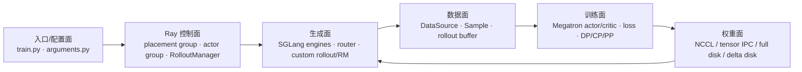
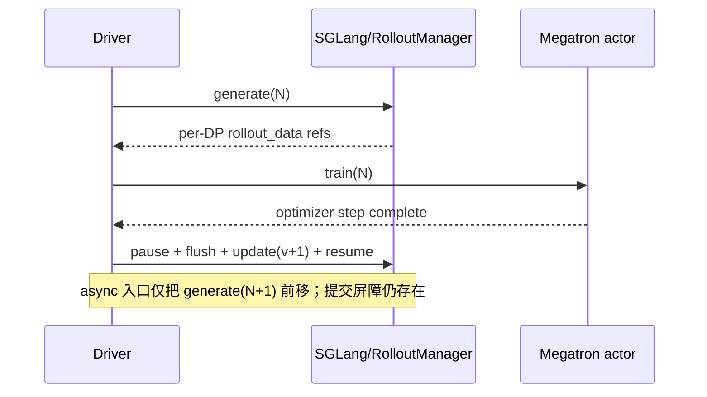

# slime RL 后训练框架 — 知识地图

> **源码基线**：slime `main@681b3adca54105d5ecd3fb822fa0dc58a427e0f9`
> **基线提交时间**：2026-08-12T16:50:12+07:00
> **核验日期**：2026-08-18
> **系列范围**：21 篇源码级分析，覆盖入口配置、Ray 控制面、Sample/DataSource 数据面、SGLang rollout、Megatron 训练、loss/并行、权重同步、训推一致性、容错观测、rollout backend 扩展、vime/vLLM 衍生实现、OPD、在线 MTP、低精度、新架构、Agent 工作流、吞吐优化与稳定性。

slime 是一套 **SGLang-native、Megatron-native 的 RL post-training 编排框架**。它没有在两套引擎之上再造一个最低公分母 engine abstraction，而是让原生参数和特性继续透传，把自身复杂度集中在 RL loop、数据契约、调度、权重提交和正确性检查上。[`README_zh.md:9-24`](https://github.com/THUDM/slime/blob/681b3adca54105d5ecd3fb822fa0dc58a427e0f9/README_zh.md#L9-L24) [`README_zh.md:36-50`](https://github.com/THUDM/slime/blob/681b3adca54105d5ecd3fb822fa0dc58a427e0f9/README_zh.md#L36-L50)

## 1. 中央命题：一条显式闭环，五个彼此独立的平面

README 自己把系统压缩成 training、rollout 和 data buffer 三模块；源码进一步揭示两个不能忽略的横切面：Ray 负责资源与 actor 生命周期，weight updater 负责训练状态到服务状态的版本化提交。[`README_zh.md:85-93`](https://github.com/THUDM/slime/blob/681b3adca54105d5ecd3fb822fa0dc58a427e0f9/README_zh.md#L85-L93) [`placement_group.py:120-137`](https://github.com/THUDM/slime/blob/681b3adca54105d5ecd3fb822fa0dc58a427e0f9/slime/ray/placement_group.py#L120-L137) [`actor.py:151-182`](https://github.com/THUDM/slime/blob/681b3adca54105d5ecd3fb822fa0dc58a427e0f9/slime/backends/megatron_utils/actor.py#L151-L182)

| 平面 | 主要 owner | 对外契约 | 本系列页面 |
|---|---|---|---|
| 入口/配置 | `train.py`、`train_async.py`、`utils/arguments.py` | CLI、SGLang 参数透传、角色 YAML | [[02_engineering/04_posttrain_frameworks/slime/02_slime_quickstart_and_configuration_guide]] |
| 控制 | `ray/placement_group.py`、`ray/actor_group.py`、`ray/rollout.py` | Ray actor、placement group、生命周期 RPC | [[02_engineering/04_posttrain_frameworks/slime/11_slime_ray_control_plane_analysis]] |
| 数据 | `utils/types.py`、`rollout/data_source.py` | `Sample`、group、buffer、train-data dict | [[02_engineering/04_posttrain_frameworks/slime/12_slime_sample_datasource_analysis]] |
| 生成 | `rollout/sglang_rollout.py`、SGLang engine/router | async generate、RM、filter、partial、custom hook | [[02_engineering/04_posttrain_frameworks/slime/13_slime_sglang_rollout_engine_analysis]] |
| 训练 | `backends/megatron_utils/actor.py`、`data.py` | actor/ref/teacher/critic 切换、packed micro-batch | [[02_engineering/04_posttrain_frameworks/slime/14_slime_megatron_training_analysis]] |
| 算法/loss | `loss.py`、`cp_utils.py`、`dp_schedule.py` | advantage、policy/value/SFT loss、全局 reducer | [[02_engineering/04_posttrain_frameworks/slime/15_slime_loss_parallelism_analysis]] |
| 权重 | `update_weight/*`、`SGLangEngine` | pause/flush/transfer/version/resume | [[02_engineering/04_posttrain_frameworks/slime/16_slime_weight_sync_analysis]] |
| 运维 | health monitor、debug dump、trace、profiler、CI | recovery、replay、trace carrier、正确性门禁 | [[02_engineering/04_posttrain_frameworks/slime/18_slime_fault_tolerance_observability_analysis]] |

## 2. 从系统问题出发：先找 owner，再看机制

同一个现象可能跨越多个平面。定位时先找到**拥有该不变量的模块**，再进入机制页；否则很容易用性能开关掩盖数据错误，或用进程恢复替代状态恢复。

| 你要回答的问题 | 首要 owner / 页面 | 核心设计选择 | 主要代价或边界 |
|---|---|---|---|
| 系统为什么这样拆，单轮何时完成 | [[02_engineering/04_posttrain_frameworks/slime/01_slime_architecture_overview_analysis]]、[[02_engineering/04_posttrain_frameworks/slime/10_slime_end_to_end_iteration_analysis]] | 薄编排层直连 Megatron/SGLang；一轮按 generate → train → publish 显式推进 | 原生能力暴露充分，但跨引擎耦合不会被统一接口隐藏 |
| CLI/YAML 如何变成运行时对象 | [[02_engineering/04_posttrain_frameworks/slime/02_slime_quickstart_and_configuration_guide]] | 配置不是参数清单，而是对象图和不变量的装配协议 | 原生参数升级会改变组合 ABI，必须随固定依赖重验 |
| GPU、actor、server、engine 分别归谁管理 | [[02_engineering/04_posttrain_frameworks/slime/11_slime_ray_control_plane_analysis]]、[[02_engineering/04_posttrain_frameworks/slime/13_slime_sglang_rollout_engine_analysis]] | Ray 管资源与 actor 生命周期，RolloutManager 管逻辑生成，engine/server 管服务状态 | “对象活着”不等于请求、权重或逻辑 rollout 状态完整 |
| partial、tool token、fanout fragments 应怎样训练 | [[02_engineering/04_posttrain_frameworks/slime/12_slime_sample_datasource_analysis]]、[[02_engineering/04_posttrain_frameworks/slime/24_slime_agent_workflow_examples_analysis]] | `Sample` 保存 token provenance；flatten 后用 `rollout_id` 保留逻辑 execution 身份 | 可变轨迹和 hook 很灵活，但 mask、metadata、group identity 必须显式守约 |
| 并行或 fanout 后，loss 是否还是同一目标 | [[02_engineering/04_posttrain_frameworks/slime/14_slime_megatron_training_analysis]]、[[02_engineering/04_posttrain_frameworks/slime/15_slime_loss_parallelism_analysis]] | trainer 消费 packed dict；reducer 把物理切分重新锚定到 token/step/rollout measure | 分母或统计单位错位通常不会报错，只会静默改变优化目标 |
| 推理副本何时算完成一次新权重提交 | [[02_engineering/04_posttrain_frameworks/slime/16_slime_weight_sync_analysis]]、[[02_engineering/04_posttrain_frameworks/slime/17_slime_train_inference_consistency_analysis]] | 先做 topology-neutral 逻辑转换，再以 pause/flush/version/transport/resume 提交 | 提交屏障有吞吐成本；同 version 也不能推出 token/logprob/kernel 一致 |
| engine 失败、训练漂移或重启后怎样取证 | [[02_engineering/04_posttrain_frameworks/slime/18_slime_fault_tolerance_observability_analysis]]、[[02_engineering/04_posttrain_frameworks/slime/31_slime_posttraining_stability_analysis]] | 局部 engine recovery 与固定 Sample replay 分开；按四个控制环做判别实验 | 没有跨 DataSource、trainer、engine 的全局 exactly-once 事务 |
| 新 RM、agent、模型或 rollout backend 应接在哪一层 | [[02_engineering/04_posttrain_frameworks/slime/19_slime_rollout_backend_extension_analysis]]、[[02_engineering/04_posttrain_frameworks/slime/23_slime_model_architecture_extension_analysis]]、[[02_engineering/04_posttrain_frameworks/slime/24_slime_agent_workflow_examples_analysis]] | 选择能表达需求的最窄扩展边界；真正新 backend 必须实现生命周期与权重契约 | 扩展点越靠下能力越完整，维护的 native invariants 也越多 |
| OPD、在线 MTP、低精度改变了哪些耦合 | [[02_engineering/04_posttrain_frameworks/slime/20_slime_on_policy_distillation_analysis]]、[[02_engineering/04_posttrain_frameworks/slime/21_slime_speculative_decoding_mtp_analysis]]、[[02_engineering/04_posttrain_frameworks/slime/22_slime_low_precision_training_rollout_analysis]] | teacher/draft 复用现有 Sample/train ABI；target/draft 与各精度轴分别管理 | 新角色增加 placement/version 耦合；“一个 dtype”不能概括全链精度 |
| 想使用 vLLM，是否只需替换 `generate()` | [[02_engineering/04_posttrain_frameworks/slime/25_vime_vllm_backend_support_analysis]] | vime 以独立 fork 替换 rollout、router、请求和权重提交接缝 | 这是另一条源码/镜像基线，不是 upstream slime 内置 backend |
| tok/s 上升为何训练仍不快或更不稳 | [[02_engineering/04_posttrain_frameworks/slime/30_slime_rollout_optimization_analysis]]、[[02_engineering/04_posttrain_frameworks/slime/31_slime_posttraining_stability_analysis]] | 用 productive throughput 与闭环关键路径定位瓶颈，再检查数据/版本/数值/基础设施控制环 | 并发、PD、filter、overlap、clip 或 restart 都可能只移动瓶颈或压低症状 |

推荐按目的阅读：

- **建立主链**：[[02_engineering/04_posttrain_frameworks/slime/01_slime_architecture_overview_analysis]] → [[02_engineering/04_posttrain_frameworks/slime/02_slime_quickstart_and_configuration_guide]] → [[02_engineering/04_posttrain_frameworks/slime/10_slime_end_to_end_iteration_analysis]] → [[02_engineering/04_posttrain_frameworks/slime/11_slime_ray_control_plane_analysis]]。
- **理解数据与梯度**：[[02_engineering/04_posttrain_frameworks/slime/12_slime_sample_datasource_analysis]] → [[02_engineering/04_posttrain_frameworks/slime/14_slime_megatron_training_analysis]] → [[02_engineering/04_posttrain_frameworks/slime/15_slime_loss_parallelism_analysis]] → [[02_engineering/04_posttrain_frameworks/slime/17_slime_train_inference_consistency_analysis]]。
- **理解服务与提交**：[[02_engineering/04_posttrain_frameworks/slime/13_slime_sglang_rollout_engine_analysis]] → [[02_engineering/04_posttrain_frameworks/slime/16_slime_weight_sync_analysis]] → [[02_engineering/04_posttrain_frameworks/slime/18_slime_fault_tolerance_observability_analysis]]。
- **做扩展与选型**：先读 [[02_engineering/04_posttrain_frameworks/slime/19_slime_rollout_backend_extension_analysis]]，再按需求进入 [[02_engineering/04_posttrain_frameworks/slime/20_slime_on_policy_distillation_analysis]]、[[02_engineering/04_posttrain_frameworks/slime/21_slime_speculative_decoding_mtp_analysis]]、[[02_engineering/04_posttrain_frameworks/slime/22_slime_low_precision_training_rollout_analysis]]、[[02_engineering/04_posttrain_frameworks/slime/23_slime_model_architecture_extension_analysis]]、[[02_engineering/04_posttrain_frameworks/slime/24_slime_agent_workflow_examples_analysis]] 或 [[02_engineering/04_posttrain_frameworks/slime/25_vime_vllm_backend_support_analysis]]。
- **做性能与故障诊断**：[[02_engineering/04_posttrain_frameworks/slime/30_slime_rollout_optimization_analysis]] → [[02_engineering/04_posttrain_frameworks/slime/31_slime_posttraining_stability_analysis]]，再回到表中对应的机制 owner。

## 3. 全量页面与推荐顺序

文件名前缀沿用 `verl/` 的知识域约定：段 0 是总览与上手；段 1 按真实数据流拆实现；段 3 是跨平面优化与稳定性。

| 段 | 页面 | 解决的问题 |
|---|---|---|
| 0 | [[02_engineering/04_posttrain_frameworks/slime/01_slime_architecture_overview_analysis]] | 整体软件架构、设计取舍、同步/异步语义 |
| 0 | [[02_engineering/04_posttrain_frameworks/slime/02_slime_quickstart_and_configuration_guide]] | 从脚本、CLI、Megatron/SGLang YAML 到源码入口怎样对应 |
| 1 | [[02_engineering/04_posttrain_frameworks/slime/10_slime_end_to_end_iteration_analysis]] | 一轮 rollout→train→weight commit 的逐阶段调用链 |
| 1 | [[02_engineering/04_posttrain_frameworks/slime/11_slime_ray_control_plane_analysis]] | GPU 怎么放、actor 怎么起、谁拥有服务与生命周期 |
| 1 | [[02_engineering/04_posttrain_frameworks/slime/12_slime_sample_datasource_analysis]] | prompt/group/sample/rollout/train batch 如何转换且不丢语义 |
| 1 | [[02_engineering/04_posttrain_frameworks/slime/13_slime_sglang_rollout_engine_analysis]] | 请求并发、RM、动态采样、partial、streaming、fully async 怎样实现 |
| 1 | [[02_engineering/04_posttrain_frameworks/slime/14_slime_megatron_training_analysis]] | actor/ref/teacher/critic、logprob、advantage、optimizer step 的内部路径 |
| 1 | [[02_engineering/04_posttrain_frameworks/slime/15_slime_loss_parallelism_analysis]] | GRPO/PPO/GSPO/CISPO、reducer、DP/CP/PP/VPP 不变量 |
| 1 | [[02_engineering/04_posttrain_frameworks/slime/16_slime_weight_sync_analysis]] | 四条权重路径、HF 逻辑重组、训推 topology 转换、共卡 CUDA IPC 与 MoE 定向路由 |
| 1 | [[02_engineering/04_posttrain_frameworks/slime/17_slime_train_inference_consistency_analysis]] | weight/data/distribution/kernel 四层训推一致性 |
| 1 | [[02_engineering/04_posttrain_frameworks/slime/18_slime_fault_tolerance_observability_analysis]] | engine recovery、debug replay、trace/profiling、CI 分层 |
| 1 | [[02_engineering/04_posttrain_frameworks/slime/19_slime_rollout_backend_extension_analysis]] | rollout 数据面扩展、external SGLang、完整 backend 替换边界 |
| 1 | [[02_engineering/04_posttrain_frameworks/slime/20_slime_on_policy_distillation_analysis]] | 两类 teacher、token logprob 契约、reverse-KL advantage 注入 |
| 1 | [[02_engineering/04_posttrain_frameworks/slime/21_slime_speculative_decoding_mtp_analysis]] | EAGLE/draft、在线 MTP 训练、同步与接受率闭环 |
| 1 | [[02_engineering/04_posttrain_frameworks/slime/22_slime_low_precision_training_rollout_analysis]] | BF16/FP8/INT4、KV cache 与量化权重提交 |
| 1 | [[02_engineering/04_posttrain_frameworks/slime/23_slime_model_architecture_extension_analysis]] | custom provider、ModuleSpec/HF wrapper、双向权重映射 |
| 1 | [[02_engineering/04_posttrain_frameworks/slime/24_slime_agent_workflow_examples_analysis]] | adapter、trajectory、tool/sandbox、fan-out 与 coding agent |
| 2 | [[02_engineering/04_posttrain_frameworks/slime/25_vime_vllm_backend_support_analysis]] | vime 如何保留 slime 上层、替换为 vLLM/vllm-router，以及逐能力支持度与缺口 |
| 3 | [[02_engineering/04_posttrain_frameworks/slime/30_slime_rollout_optimization_analysis]] | productive throughput、容量/关键路径账本与负收益反例 |
| 3 | [[02_engineering/04_posttrain_frameworks/slime/31_slime_posttraining_stability_analysis]] | 数据、策略版本、估计量/数值、基础设施四控制环与判别实验 |

## 4. 官方支持特性与源码解读覆盖矩阵

下表按官方 `docs/zh` 的特性导航核对。这里的“覆盖”不是转述用法，而是同时追到参数入口、运行时调用链、数据/权重契约与当前限制；文档和源码不一致之处也单独记录。

| 官方特性 | 源码解读页面 | 已覆盖的关键机制/边界 |
|---|---|---|
| SGLang config / 原生参数透传 | [[02_engineering/04_posttrain_frameworks/slime/02_slime_quickstart_and_configuration_guide]]、[[02_engineering/04_posttrain_frameworks/slime/13_slime_sglang_rollout_engine_analysis]] | parser merge、router、异构 groups、多模型、PD/EPD |
| Megatron config / 并行训练 | [[02_engineering/04_posttrain_frameworks/slime/02_slime_quickstart_and_configuration_guide]]、[[02_engineering/04_posttrain_frameworks/slime/14_slime_megatron_training_analysis]]、[[02_engineering/04_posttrain_frameworks/slime/15_slime_loss_parallelism_analysis]] | 原生参数、actor/ref/critic、DP/CP/PP/VP、全局 reducer |
| PD disaggregation | [[02_engineering/04_posttrain_frameworks/slime/13_slime_sglang_rollout_engine_analysis]]、[[02_engineering/04_posttrain_frameworks/slime/30_slime_rollout_optimization_analysis]] | prefill/decode group、router、KV transfer、适用负载 |
| External rollout engines | [[02_engineering/04_posttrain_frameworks/slime/19_slime_rollout_backend_extension_analysis]] | 明确 external 仍是 SGLang；与新 backend 插件的边界 |
| vime / vLLM rollout 衍生实现 | [[02_engineering/04_posttrain_frameworks/slime/25_vime_vllm_backend_support_analysis]] | vLLM server/router、PD/EPD、多模型、external、请求契约、四类权重同步、异步/容错与官方文档差异 |
| Delta/full 权重更新 | [[02_engineering/04_posttrain_frameworks/slime/16_slime_weight_sync_analysis]] | NCCL 临时组、HF topology 中间表示、共卡 IPC 生命周期、MoE expert 定向路由、full/delta disk 提交事务 |
| 可复现性 / 训推一致性 | [[02_engineering/04_posttrain_frameworks/slime/17_slime_train_inference_consistency_analysis]] | weight/data/distribution/kernel 四层、routing/top-p replay |
| Fault tolerance / observability | [[02_engineering/04_posttrain_frameworks/slime/18_slime_fault_tolerance_observability_analysis]] | health/recover、debug replay、trace/profile、W&B/Prometheus；记录 count 指标文档/源码差异 |
| On-policy distillation | [[02_engineering/04_posttrain_frameworks/slime/20_slime_on_policy_distillation_analysis]] | SGLang/Megatron teacher、teacher logprob、reverse-KL advantage |
| Speculative decoding / 在线 MTP | [[02_engineering/04_posttrain_frameworks/slime/21_slime_speculative_decoding_mtp_analysis]] | EAGLE、MTP loss、checkpoint/weight mapping、acceptance；外部 draft WIP |
| Low precision | [[02_engineering/04_posttrain_frameworks/slime/22_slime_low_precision_training_rollout_analysis]] | BF16+FP8、FP8 KV、FP8 train、INT4/QAT、quantized sync |
| Megatron 之外的新架构 | [[02_engineering/04_posttrain_frameworks/slime/23_slime_model_architecture_extension_analysis]] | custom provider、ModuleSpec、HF wrapper、无 module-TP 限制 |
| Agentic RL / 官方 examples | [[02_engineering/04_posttrain_frameworks/slime/24_slime_agent_workflow_examples_analysis]] | protocol adapter、TITO trajectory、Search-R1、ReTool、multi-agent、coding-agent |

因此，对固定提交 `681b3adc` 而言，官方高级特性已经逐项建立“官方说明 → 参数 → 源码对象 → 数据/权重路径 → 限制”的映射。后续主仓库新增文档或特性时，应以这张表作为增量审计入口，而不是默认本系列自动覆盖未来 `main`。

## 5. 两条端到端运行模式

同步入口每轮严格执行 generate → train → update weights，必要时在 rollout/train 间交替 offload/onload。[`train.py:48-91`](https://github.com/THUDM/slime/blob/681b3adca54105d5ecd3fb822fa0dc58a427e0f9/train.py#L48-L91) 一拍异步入口提前发起下一轮 generation，让 `rollout(N+1)` 与 `train(N)` 重叠；但每次权重更新前仍等待 generation future，避免一条请求中途看到新权重。[`train_async.py:31-70`](https://github.com/THUDM/slime/blob/681b3adca54105d5ecd3fb822fa0dc58a427e0f9/train_async.py#L31-L70)

## 6. 软件目录到责任边界

| 源码目录 | 责任 | 不负责什么 |
|---|---|---|
| `slime/ray/` | 资源放置、actor group、rollout server/manager、数据拆分 | 不实现模型前反向 |
| `slime/rollout/` | 数据源、生成/RM/filter、partial/fully async、hook | 不执行 optimizer step |
| `slime/backends/megatron_utils/` | 模型初始化、packed data、loss、并行、checkpoint、权重转换 | 不拥有 prompt buffer |
| `slime/backends/sglang_utils/` | SGLang args/config/engine/server control | 不定义 RL 统计口径 |
| `slime/utils/` | 参数、Sample、DP schedule、trace/profile/metrics、通用校验 | 不充当总控制器 |
| `slime/agent/`、`examples/` | agent harness、tool/sandbox、多轮生成样例 | 不改变核心训练 kernel |
| `slime_plugins/` | 模型实现和 rollout buffer 扩展 | 不是强制依赖的统一插件运行时 |

这个边界解释了 slime 的扩展哲学：数据生成和 reward 可通过 import path 替换，而训练侧继续直达 Megatron；默认 rollout 函数签名、custom generate、sample hook、DataSource 都在参数层公开。[`arguments.py:328-340`](https://github.com/THUDM/slime/blob/681b3adca54105d5ecd3fb822fa0dc58a427e0f9/slime/utils/arguments.py#L328-L340) [`arguments.py:443-524`](https://github.com/THUDM/slime/blob/681b3adca54105d5ecd3fb822fa0dc58a427e0f9/slime/utils/arguments.py#L443-L524)

## 7. 与 verl 的核心差异

| 维度 | slime | verl |
|---|---|---|
| engine 策略 | 明确押注 Megatron + SGLang，追求上游原生特性 | 多训练/rollout 后端统一编排 |
| 中央数据对象 | 可变 `Sample` → dict/Box，生成语义丰富 | `DataProto` 是 driver↔worker 标准货币 |
| 控制抽象 | 较薄的 Ray actor group + 两个显式主循环 | HybridFlow single-controller + dispatch/collect |
| rollout 扩展 | import-path 函数、RM/filter/hook、agent workflow | rollout/agent loop 抽象与 worker/engine 体系 |
| 权重更新 | 独立的四 transport/mode 实现，深度贴合 SGLang | 3D-HybridEngine/CheckpointEngine 重分片体系 |

这不是简单的“谁更快”：slime 用较窄后端矩阵换取 SGLang/Megatron 特性暴露和短调用链；verl 用更厚的协议层换取后端与角色组合弹性。统一框架对照见 [[02_engineering/04_posttrain_frameworks/30_rl_framework_comparison]]。

## 8. 已验证边界

- 本系列全部源码链接固定到 `681b3adc`，不引用漂移的 `main` 行号。
- 本地可执行 CPU 测试已覆盖 DP schedule、response span、`Sample` 和 FP8 zero-block 共 29 项；Ray 相关 CPU contract 在当前 Windows Python 因缺少 `ray` 未能收集。
- GPU/Megatron/SGLang、MoE 与 GLM-5 精度门禁属于源码与 CI 配置审阅，不冒充本机实跑。项目 CI 本身把默认 CPU correctness 与 label-triggered GPU e2e 分成两层。[`docs/zh/developer_guide/ci.md:1-32`](https://github.com/THUDM/slime/blob/681b3adca54105d5ecd3fb822fa0dc58a427e0f9/docs/zh/developer_guide/ci.md#L1-L32)

## Related Pages

- [[02_engineering/04_posttrain_frameworks/slime/01_slime_architecture_overview_analysis]] — 本域阅读起点
- [[02_engineering/04_posttrain_frameworks/slime/10_slime_end_to_end_iteration_analysis]] — 先建立完整时序，再下钻各平面
- [[02_engineering/04_posttrain_frameworks/slime/25_vime_vllm_backend_support_analysis]] — 从 slime 的 backend 边界进入 vime/vLLM 独立实现
- [[02_engineering/04_posttrain_frameworks/30_rl_framework_comparison]] — slime / verl / AReaL / ROLL 机制对照
- [[02_engineering/04_posttrain_frameworks/verl/index]] — 与本目录平行的 verl 独立知识域
- [[02_engineering/04_posttrain_frameworks/index]] — 后训练框架总目录
