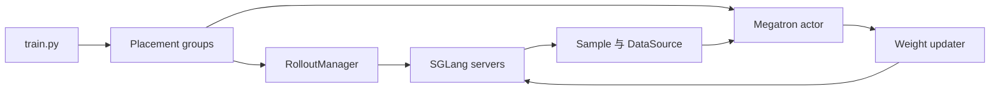

# D08 slime 高性能与异步架构

> **阶段**：S03
> **文档编号**：D08
> **源码基线**：slime `aaf5c2092b01219fa0d5c2d323741d409086ca32`
> **核验日期**：2026-07-27
> **结论先行**：slime 的核心设计赌注是保持 Megatron 与 SGLang 的原生能力，同时用很薄的 Ray/DataSource 层闭合 RL 循环；它的优势是路径短、后端深，代价是可移植性更依赖这两个上游。
> **阅读导航**：[[03_posttraining/07_verl_end_to_end_iteration_analysis|上一篇 D07]] · [[areal_async_architecture_analysis|下一篇 D09]]

---

## 1. 先澄清 TransferQueue

固定 commit 的 slime core **没有把 Ascend TransferQueue 作为主数据面组件**。README 中 `TransferQueue` 出现在 Relax 生态项目介绍，而非 slime 主循环的可达依赖。

slime core 的数据桥是：

- `Sample`；
- `DataSource` / `RolloutDataSourceWithBuffer`；
- Ray object store 或可选数据 transport；
- rollout manager 到 train actor 的 reference。

因此不能写成“slime = Megatron + SGLang + TransferQueue”。准确说法是：slime core 是 Megatron + SGLang + Ray/DataSource；生态扩展可接入 TransferQueue 等外部数据服务。

## 2. 同步主链



[`train.py:9-93`](https://github.com/THUDM/slime/blob/aaf5c2092b01219fa0d5c2d323741d409086ca32/train.py#L9-L93) 的主循环非常直接：

1. 创建 placement groups、rollout manager、actor/critic；
2. 初始 actor weight 同步到 rollout；
3. `rollout_manager.generate(rollout_id)`；
4. critic/actor `async_train`，随后 `ray.get`；
5. save；
6. actor `update_weights()`；
7. eval，进入下一轮。

`async_train` 是 Ray future 接口，不表示跨 rollout id 的 fully async optimizer。同步主路径仍在每个 `rollout_id` 上形成 generate → train → weight update barrier。

## 3. RolloutManager 与 DataSource

[`slime/ray/rollout.py:427-680`](https://github.com/THUDM/slime/blob/aaf5c2092b01219fa0d5c2d323741d409086ca32/slime/ray/rollout.py#L427-L680)：

- 动态加载 rollout/eval function；
- 管理 server groups 与 updatable engines；
- 生成、验证、debug dump、save/load；
- 将 nested group 校验后转为训练数据。

`slime/rollout/data_source.py`：

| 对象 | locator | 角色 |
|---|---|---|
| `DataSource` | `17` | prompt/source 抽象 |
| `RolloutDataSource` | `50` | 标准 rollout 数据 |
| `RolloutDataSourceWithBuffer` | `168` | 回收和补采 |
| `pop_first` | `225` | buffer selection |

`slime/ray/rollout.py:711-866` 把 sample 转为 tokens、loss masks、rollout log-probs、response lengths 和 rollout ids。`898-927` 还验证 compact group 的 sibling 必须共享非空 `rollout_id`，说明 group 完整性是 loss reducer 的一部分。

## 4. SGLang rollout

核心生成函数位于：

- `slime/rollout/sglang_rollout.py:153`：单 sample generate；
- `224`：generate + reward model；
- `294`：group generate + reward；
- `375`：async rollout；
- `617`：同步包装入口。

slime 不把 SGLang 降格为最低共同接口，而是允许原生参数透传、router、cache、PD disaggregation 与 server topology。收益是更快跟进 SGLang；代价是更换 vLLM 等后端不只是实现一个小 adapter。

## 5. Megatron actor

[`slime/backends/megatron_utils/actor.py:364-539`](https://github.com/THUDM/slime/blob/aaf5c2092b01219fa0d5c2d323741d409086ca32/slime/backends/megatron_utils/actor.py#L364-L539)：

```text
train
  load and process rollout data
  optional critic values
  compute or consume log probabilities
  compute advantages and returns
  optional rollout postprocess
  Megatron train
  update reference snapshot when configured
```

重要正确性入口：

- `rollout_log_probs` 与 `teacher_log_probs` 转换在 `273-289`；
- routing replay 在 `297-341`；
- trainer 是否重算 rollout log-prob 的条件在 `423-493`；
- 全 rollout advantage 必须在 train 前计算，因为可能做全局 normalization。

slime 对 MoE routing replay 的支持说明 TIM 不只来自精度，也可能来自 train/serve 路由差异。

## 6. Weight plane

`slime/backends/megatron_utils/actor.py:150-181` 按配置选择：

| mode/transport | updater |
|---|---|
| full + NCCL | `UpdateWeightFromDistributed` |
| full + tensor | `UpdateWeightFromTensor` |
| full + disk | `UpdateWeightFromDisk` |
| delta + disk | `UpdateWeightFromDiskDelta` |

[`slime/backends/megatron_utils/actor.py:567-627`](https://github.com/THUDM/slime/blob/aaf5c2092b01219fa0d5c2d323741d409086ca32/slime/backends/megatron_utils/actor.py#L567-L627) 获取可更新 engines 和 lock，必要时连接、wake，执行 updater，再更新本地 actor/old/rollout snapshot。

disk path 在 `slime/ray/actor_group.py:227-268`：

```text
pause generation
flush cache
update weights from disk
compare engine versions
continue generation
```

它清楚表达了 install/verify/resume，但跨 transport 的原子提交仍应通过故障注入验证。

## 7. Fully async 实际做了什么

[`slime/rollout/fully_async_rollout.py:76-256`](https://github.com/THUDM/slime/blob/aaf5c2092b01219fa0d5c2d323741d409086ca32/slime/rollout/fully_async_rollout.py#L76-L256) 建立一个跨 `generate_rollout` 调用存活的后台 worker：

- 从 data buffer 持续取 group；
- 以 asyncio concurrency 发起 `generate_and_rm_group`；
- 完成结果进入 bounded output queue；
- 每次 trainer 请求收集目标样本数；
- aborted group 回收进 data buffer。

这消除了 rollout producer 的冷启动和一部分组间长尾，但固定快照中：

- trainer 仍按 `rollout_id` 拉够目标 batch；
- 未看到像 AReaL `max_head_offpolicyness` 那样的一等 version admission 公式；
- README 明确说明 unfinished trajectory 的 resume 尚未接线，当前会重新开始。

所以它是“持续生产 + warm queue”，不应笼统写成无边界 fully async training。

## 8. 吞吐从哪里来

| 来源 | 机制 | 代价/验证 |
|---|---|---|
| 后端深集成 | 原生 Megatron/SGLang 参数与拓扑 | 版本耦合 |
| continuous concurrency | 多 engine、多 request | queue 公平和尾部 |
| colocate/offload | train/rollout 复用显存 | sleep/wake 时间 |
| weight transport | NCCL/tensor/disk/delta | conversion、checksum、版本 |
| async producer | queue 跨轮保温 | freshness 和回压 |
| dynamic sampling | 回收无效/aborted group | 分布改变和额外生成 |

任何 benchmark 都必须分别记录这些开关，否则无法归因。

## 9. Agentic/Coding 扩展

slime 的强项是自定义 rollout function 进入同一 DataSource：

- coding agent：`examples/coding_agent_rl/swe.py`；
- multi-agent：`examples/multi_agent`；
- fully async：`examples/fully_async`；
- agent harness：`slime/agent/harness/codex.py`、`claude_code.py`。

这使 agent runtime 不必 fork trainer kernel，但扩展函数必须遵守：

- sibling group 的 `rollout_id`；
- policy token 的 loss mask；
- reward/timeout/aborted 语义；
- rollout log-prob 与 weight version。

## 10. 最适合的修改路径

| 目标 | 入口 |
|---|---|
| 新 reward/verifier | rollout function 或 RM hub |
| 新 agent loop | `--rollout-function-path` |
| 新 buffer selection | DataSource/filter |
| 新 weight transport | updater class |
| 新 PPO 变体 | Megatron loss/ppo utils 与 data fields |
| 新 inference backend | 不是小改；需重做 server、rollout、weight sync |

## 11. 验证清单

1. 同一 sample 在 rollout/train 的 tokens、mask、log-prob 对齐。
2. compact group 的 `rollout_id` 不因 async queue 混组。
3. aborted/retry 不重复计 reward。
4. weight update 中断不暴露部分新版本。
5. routing replay 开关有 TIM 和质量对照。
6. fully async 的 queue age、rollout id distance 和有效样本成本可观测。

## Related Pages

- [[03_posttraining/07_verl_end_to_end_iteration_analysis|D07 verl 端到端训练迭代]]
- [[areal_async_architecture_analysis|D09 AReaL Fully Async]]
- [[03_posttraining/06_framework_comparison|D06 工业后训练框架对比]]
- [[02_engineering/04_posttrain_frameworks/rl_infra_efficiency_analysis|既有 RL Infra 效率分析]]
