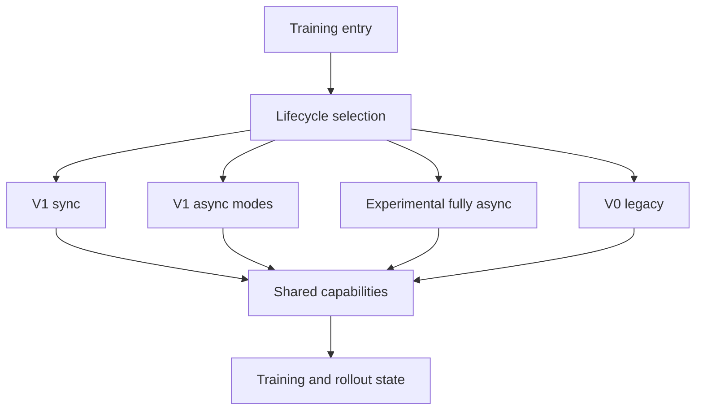

# verl 架构总览：共享能力与四类训练生命周期

> **代码基准**：verl `main` @ `254a23edc62f25ebfae626e3932ae285d6f86009`
> **最后复核**：2026-08-31
> **概念所有权**：本页唯一负责 Verl 分析域的系统地图、能力边界和模式关系；各机制细节由对应专页拥有。

## 核心判断

当前 Verl 最稳定的理解方式，不是按 V0、V1、fully async 各画一套重复架构，而是拆成两层：

1. **共享能力层**：Ray 控制基座、批数据契约、TransferQueue、Agent/Reward runtime、Worker/Engine、rollout runtime、算法、权重发布和训练恢复；
2. **动态生命周期层**：默认 V1 sync、稳定 V1 async、experimental fully async，以及显式保留的 V0 legacy。

不同 trainer 模式主要改变“何时生产、消费、更新、发布和回收资源”，并不复制全部底层能力。这个边界能解释为什么同一个 AgentLoop、Engine 或 CheckpointEngine 的改动会同时影响多个 trainer 路径，也能避免把在线权重发布误写成跨重启 checkpoint。

## 1. 入口先选择生命周期，不选择整套组件

根配置默认 `trainer.use_v1=true`、`trainer.v1.trainer_mode=sync`（`verl/trainer/config/ppo_trainer.yaml:227-237`）。入口先在 V0 与 V1 TaskRunner 之间路由，再由 V1 registry 选择 `sync`、`colocate_async` 或 `separate_async`（`verl/trainer/main_ppo.py:137-155`、`verl/trainer/main_ppo.py:183-192`、`verl/trainer/ppo/v1/trainer_base.py:1897-1924`）。

`experimental/fully_async_policy` 使用独立 TaskRunner、rollouter、trainer 与 MessageQueue，不是第四个 stable V1 `trainer_mode`（`verl/experimental/fully_async_policy/fully_async_main.py:35-100`）。V0 `RayPPOTrainer` 则只有显式 `trainer.use_v1=false` 才会进入，而且类已被标记 deprecated（`verl/trainer/ppo/ray_trainer.py:285-292`）。

## 2. 共享能力地图

| 能力 | 主要 owner | 核心状态或不变量 | 权威页面 |
|---|---|---|---|
| Ray 控制基座 | `Worker`、`WorkerGroup`、`ResourcePool` | rank、资源放置、dispatch 与 collect | [[11_verl_single_controller_analysis]] |
| 本地批契约 | `DataProto`、`TensorDict` | batch 对齐、字段 union、repeat 与 reorder | [[12_verl_dataproto_analysis]] |
| V1 数据面 | TransferQueue、`KVBatchMeta`、`tqbridge` | key、tag、field、延迟物化和 failure state | [[16_verl_v1_transfer_queue_analysis]] |
| 生成与奖励编排 | `AgentLoopManager`、`AgentLoop`、`RewardLoopManager` | session、tool call、trajectory、流式奖励 | [[18_verl_agent_loop_reward_runtime_analysis]] |
| 模型计算 | `TrainingWorker`、`BaseEngine` | forward、backward、optimizer、并行布局、export | [[13_verl_workers_engine_analysis]] |
| rollout 服务 | LLM server、replica、request scheduler | 请求路由、KV、sleep、abort、PD | [[14_verl_rollout_runtime_analysis]] |
| 算法 | estimator registry、policy loss registry | mask、old policy、advantage、全局归一化 | [[15_verl_rl_algorithms_analysis]] |
| 在线权重发布 | Engine exporter、CheckpointEngine、rollout loader | full 或 delta 版本完整可见 | [[21_verl_weight_publication_analysis]] |
| 训练恢复 | trainer、worker checkpoint、dataloader、TQ 或 MQ | 跨重启模型、优化器、步数和在途数据边界 | [[23_verl_training_checkpoint_recovery_analysis]] |

这张表也是页面去重规则：某个机制只在其 owner 页完整解释；生命周期页只说明调用时机和模式特有的状态变化。

## 3. 控制、数据、计算、服务与持久状态如何连接

### 3.1 控制只传依赖，不应吞掉所有 owner

V1 基类定义 sample、reward、balance、old/ref log-prob、value、advantage、critic update 和 actor update 的公共 PPO pipeline（`verl/trainer/ppo/v1/trainer_base.py:511-590`）。具体模式通过 hook 改变 sleep、abort、预生成、库存和资源出借，而不是重写算法或 Engine。

V0 是例外的控制形态：driver 上汇合完整 `DataProto`，依次调用共享组件（`verl/trainer/ppo/ray_trainer.py:1405-1719`）。它仍复用当前 AgentLoop、RewardLoop、Engine 与权重发布能力，所以“V0 等于一套冻结旧组件”并不成立。

### 3.2 数据有两个层级

`DataProto` 是单进程内可操作的结构化批；V1 的 TransferQueue 则保存跨阶段引用和字段状态。controller 的 `KVBatchMeta` 可以只携带 key、field 和 tag，worker 通过 bridge 在执行点取实际 TensorDict，并把输出字段写回（`verl/utils/transferqueue_utils.py:302-477`）。

因此 V1 没有“删除 DataProto”。reward、advantage 等局部计算仍可把 TQ 字段物化成 TensorDict 或 `DataProto`；改变的是跨角色流动不必始终由 driver 收集成一份完整大对象（`verl/trainer/ppo/v1/trainer_base.py:1436-1707`）。

### 3.3 Worker、Engine 与 rollout server 是三种不同责任

Worker 是远程执行和 mini-batch 编排粒度；Engine 持有训练模型、并行布局、优化器和参数导出；rollout server 持有请求、KV cache 与服务态（`verl/workers/engine_workers.py:76-163`、`verl/workers/engine/base.py:99-207`、`verl/workers/rollout/llm_server.py:149-236`）。

把它们分开后，问题定位更直接：

- RPC、rank 或资源放置错误看 WorkerGroup；
- 梯度、并行布局、offload 或 export 错误看 Engine；
- 请求、KV、abort、resume 或 PD 错误看 rollout runtime。

### 3.4 在线发布与训练恢复必须分层

actor 更新后，CheckpointEngine 协调暂停服务、导出、传输、rollout apply 和恢复请求，使 rollout 切到一个完整的新参数版本（`verl/checkpoint_engine/base.py:381-506`）。这是进程内的在线发布协议。

训练 checkpoint 则需要保存 actor、可选 critic、优化器/调度器、trainer step、dataloader，以及 async 模式下可恢复的 TQ/MQ 状态。V0 的保存入口在 `verl/trainer/ppo/ray_trainer.py:983-1117`，V1 的恢复组合在 `verl/trainer/ppo/v1/trainer_base.py:800-950`。两者共享“checkpoint”这个词，但 durability、失败窗口和消费方完全不同。

## 4. 四类动态生命周期

| 生命周期 | 生产与训练关系 | 资源关系 | 核心模式状态 | 权威页面 |
|---|---|---|---|---|
| V1 sync | 一步内先采样再训练 | trainer 与 rollout 可共享资源 | sample 后 sleep，step 末发布 | [[10_verl_end_to_end_iteration_analysis]] |
| V1 stable async | 预生成或独立生成与训练解耦 | colocated 或 separate，可 lending | ReplayBuffer、旧度、refill、abort/resume | [[17_verl_v1_async_trainer_analysis]] |
| experimental fully async | 长期运行的 rollouter 与 trainer 经 MQ 解耦 | 动态 scheduler 可改变 hybrid 比例 | MQ backlog、policy version、staleness、资源状态 | [[22_verl_fully_async_dynamic_schedule_deepdive]] |
| V0 legacy | driver 按整批屏障串联阶段 | colocated worker group 为主 | 完整 `DataProto`、固定阶段顺序 | [[20_verl_ray_trainer_analysis]] |

这里最重要的区分是：stable V1 async 属于 V1 trainer registry；experimental fully async 是独立系统；V0 虽然生成内部使用 async AgentLoop，其训练生命周期仍是 driver 级批同步。

## 5. 跨模式必须成立的不变量

| 不变量 | 破坏后的症状 | 首要责任页 |
|---|---|---|
| prompt group、trajectory 与 policy version 不串组 | advantage baseline 或旧度判断错误 | [[16_verl_v1_transfer_queue_analysis]] |
| mask、reward、log-prob、value 在 token 维对齐 | loss 静默污染 | [[12_verl_dataproto_analysis]]、[[15_verl_rl_algorithms_analysis]] |
| 一个 PPO cycle 内 old policy 语义稳定 | ratio 基准随 mini-batch 漂移 | [[17_verl_v1_async_trainer_analysis]] |
| micro-batch 或 DP 变化不改变全局 loss 归一化 | 换并行度即换梯度 | [[13_verl_workers_engine_analysis]]、[[15_verl_rl_algorithms_analysis]] |
| rollout 只向新请求暴露完整权重版本 | 同批混合两个 actor 版本 | [[21_verl_weight_publication_analysis]] |
| abort 或 sleep 前停止新路由并处理在途请求 | 资源回收时仍有新请求进入 | [[14_verl_rollout_runtime_analysis]] |
| 恢复后样本集合与 trainer step 的变化是显式的 | 重复训练、丢 prompt 或版本回退 | [[23_verl_training_checkpoint_recovery_analysis]] |

## 6. 用这张地图定位问题

- 首次运行与配置路由：[[02_verl_quickstart_guide]]。
- 默认同步 step 顺序不清：[[10_verl_end_to_end_iteration_analysis]]。
- 字段缺失、key/tag 或数据不新鲜：[[16_verl_v1_transfer_queue_analysis]]。
- 多轮工具调用或 reward 迟到：[[18_verl_agent_loop_reward_runtime_analysis]]。
- OOM、梯度尺度、backend 与 offload：[[13_verl_workers_engine_analysis]]。
- rollout 卡住、KV、sleep、PD 或请求恢复：[[14_verl_rollout_runtime_analysis]]。
- 新权重不可见或 delta 失败：[[21_verl_weight_publication_analysis]]。
- 重启后丢样、重复样本或 optimizer/dataloader 不一致：[[23_verl_training_checkpoint_recovery_analysis]]。
- 已定位瓶颈后的调优次序：[[30_verl_optimization_analysis]]。

## Related Pages

- [[02_verl_quickstart_guide]] —— 从当前默认配置进入系统
- [[10_verl_end_to_end_iteration_analysis]] —— 默认 V1 sync 生命周期
- [[17_verl_v1_async_trainer_analysis]] —— stable async 模式状态机
- [[22_verl_fully_async_dynamic_schedule_deepdive]] —— experimental fully async 系统
- [[18_verl_agent_loop_reward_runtime_analysis]] —— 生成与奖励共享运行时
- [[21_verl_weight_publication_analysis]] —— 在线权重发布
- [[23_verl_training_checkpoint_recovery_analysis]] —— 跨重启训练恢复
