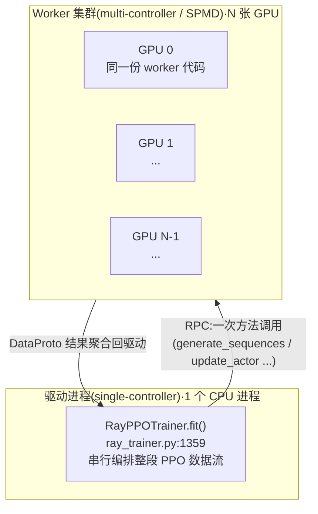
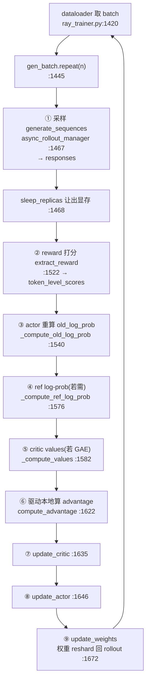
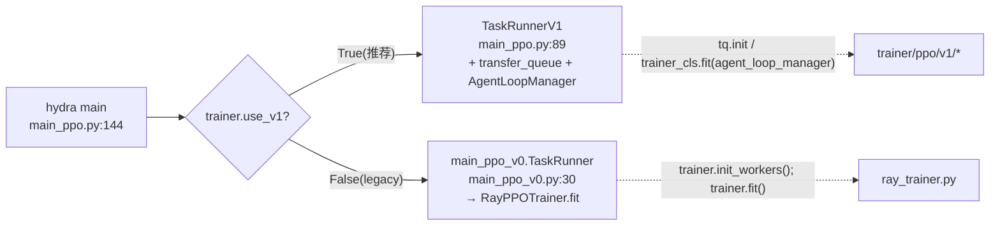

# verl 架构总览 —— HybridFlow 混合控制器 RLHF 框架

> **代码基准**:verl `main` @ `8a694930`
> **最后更新**:2026-06-22 · **系列**:verl RLHF 框架源码级分析(见 [[verl/index]])
>
> 本文回答一个问题:**verl 把一套 PPO/GRPO 的 RLHF 数据流,是如何拆成"驱动进程上的中心化编排"+"GPU 上的 SPMD 计算"两层,并把 Actor/Rollout/Reference/Critic/Reward 五个角色编织成一个训练步的?** 这是 verl 系列的阅读入口,概念为主、逐句溯源;子系统细节交给各专题页。

> [!note] 本页基线 verl `8a694930`;端到端迭代以 [[10_verl_end_to_end_iteration_analysis]](基线 `983cb0f`)为准,两基线间机制差异以新基线页为先。

---

## 1. 功能范围与定位

verl(Volcano Engine Reinforcement Learning)是字节跳动 Seed 团队发起的 LLM 强化学习训练库,定位是"灵活、高效、生产可用"(`README.md:24`)。它是 EuroSys'25 论文 **HybridFlow: A Flexible and Efficient RLHF Framework**(arXiv:2409.19256,`README.md:14`、`README.md:26`)的开源实现。

四个核心卖点(`README.md:28-42`):

| 卖点 | README 出处 | 含义 |
|------|------------|------|
| **hybrid-controller 编程模型** | `README.md:30` | 单控制器表达数据流 + 多控制器执行计算,几行代码搭出 GRPO/PPO |
| **模块化对接现有 LLM infra** | `README.md:32` | 解耦"计算"与"数据依赖",可插 FSDP / Megatron-LM 做训练,vLLM / SGLang 做推理 |
| **flexible device mapping** | `README.md:34` | 同一批 GPU 可承载不同角色的不同放置,灵活适配集群规模 |
| **3D-HybridEngine** | `README.md:42` | 训练态↔生成态切换时的 actor 权重 resharding,消除显存冗余、压低通信 |

**与 torchtitan 的定位对照**:torchtitan 解决的是**单模型预训练**里"参数怎么切、通信怎么掩盖"(DP/TP/CP/EP/PP 多维并行,见 [[torchtitan/index]]);verl 高一个层级,解决的是 **post-training 编排**——同一个训练步里要先采样(rollout 推理引擎)、再打分(reward)、再算多个模型的 log-prob/value、最后更新 actor/critic,并在训练与推理两套引擎之间反复倒换权重。换句话说,**torchtitan 是 verl 的一个可选"训练后端",verl 把它当积木用**(`README.md:139` 列出 FSDP/Megatron-LM/Automodel/VeOmni/TorchTitan 五种 engine 后端)。

---

## 2. hybrid-controller 编程模型

RLHF 数据流有两个互相矛盾的诉求:

- **数据流是中心化、串行依赖的**:rollout 的输出喂给 reward,reward 喂给 advantage,advantage 喂给 actor 更新——这本质是一段"单线程主程序"逻辑,写成 SPMD(每个 GPU 跑同一份脚本)会极其晦涩。
- **计算是大规模并行的**:每个模型的前向/反向都要在几十上百张卡上做 TP/PP/FSDP。

verl 的答案是 **single-controller(单控制器)+ multi-controller(多控制器)混合**:



**single-controller**:整段数据流写成一个普通 Python 方法 `RayPPOTrainer.fit`,跑在唯一的驱动进程上。它的注释一语道破设计意图(`ray_trainer.py:1362-1364`):

```python
# ray_trainer.py:1362
# The driver process only need to call the compute functions of the worker group through RPC
# to construct the PPO dataflow.
# The light-weight advantage computation is done on the driver process.
```

即驱动只做两件事:① 通过 RPC 调 worker group 的方法;② 在驱动本地做"轻量"的 advantage 计算(见 [[15_verl_rl_algorithms_analysis]])。

**multi-controller**:每个角色的计算被封装成一个 SPMD worker group(几十张卡跑同一份 worker 代码)。驱动只要一次方法调用,框架自动把数据 **dispatch** 到各 DP rank、再 **collect** 回来。这一层由 `single_controller/` 实现(见 [[11_verl_single_controller_analysis]]):

- `@register` 装饰器(`single_controller/base/decorator.py:398`)给每个 worker 方法挂上"分发模式"。它把 dispatch/collect 策略写进一个魔法属性 `MAGIC_ATTR`(`decorator.py:23`、`decorator.py:441`),worker group 据此在调用时自动切分入参、聚合结果。
- 分发模式枚举 `Dispatch`(`decorator.py:26`)预置了 `ONE_TO_ALL`(广播,如 `init_model`)、`ALL_TO_ALL`、`DP_COMPUTE_PROTO`(按 DP 切 DataProto)等(`decorator.py:38-47`)。
- 计算类方法用 `make_nd_compute_dataproto_dispatch_fn(mesh_name=...)`(`decorator.py:300`)生成 N 维 mesh 感知的分发——例如 `compute_log_prob` 走 `mesh_name="actor"`,`compute_ref_log_prob` 走 `"ref"`(`engine_workers.py:644`、`engine_workers.py:637`)。

> **一句话**:`fit` 里一行 `self.actor_rollout_wg.update_actor(batch)` 看似是普通函数调用,实际被 `@register` 拦截,把 `batch` 按 DP 度切片广播到所有 actor rank、并行执行、再把结果聚合回驱动。**数据流的"看起来串行"和计算的"实际并行"被这层装饰器缝合**。

### 五大平面与代码映射

| 平面 | 职责 | 代码位置 |
|------|------|---------|
| **入口** Entry | 起 Ray、按 v0/v1 分派 | `trainer/main_ppo.py` |
| **驱动/编排** Driver | 串行表达 PPO 数据流 | `trainer/ppo/ray_trainer.py`(`RayPPOTrainer.fit`) |
| **控制面** Control | dispatch/collect、worker group、资源池 | `single_controller/` |
| **数据面** Data | 角色间统一数据协议 | `protocol.py`(`DataProto`) |
| **计算面** Compute | actor/critic/ref 的训练与前向 | `workers/engine_workers.py` + `workers/engine/*` |
| **采样面** Rollout | vLLM/SGLang 推理生成 | `workers/rollout/*` |
| **算法面** Algorithm | advantage / policy-loss / KL | `trainer/ppo/core_algos.py` |

---

## 3. 数据面:DataProto 是唯一货币

所有平面之间流动的数据都是一个 `DataProto`(`protocol.py:318`)。它就是角色间的"标准协议"(`protocol.py:320` docstring),三个字段(`protocol.py:326-328`):

```python
# protocol.py:326
batch: TensorDict = None            # 等长张量(prompts/responses/log_probs/advantages...)
non_tensor_batch: dict = ...        # 变长/对象数据(uid、reward_model、多模态输入...)
meta_info: dict = ...               # 标量/配置(temperature、global_steps、eos_token_id...)
```

`fit` 全程就是在给同一个 `batch` **不断 `union` 新字段**:rollout 产出 `responses` → reward 产出 `token_level_scores` → actor 产出 `old_log_probs` → ref 产出 `ref_log_prob` → critic 产出 `values` → 驱动算出 `advantages`/`returns`。`DataProto` 提供 `chunk`/`concat`/`repeat`/`union`/`slice` 等算子(在 `protocol.py` 内),既给驱动用,也是控制面 dispatch 切分数据的底座。细节见 [[12_verl_dataproto_analysis]]。

---

## 4. 五个逻辑角色与"混合 worker"

verl 的 PPO 涉及五个**逻辑角色**,由 `Role` 枚举定义(`trainer/ppo/utils.py:27`,经 `ray_trainer.py` 再导出):

```python
# trainer/ppo/utils.py:32
Actor = 0; Rollout = 1; ActorRollout = 2; Critic = 3
RefPolicy = 4; RewardModel = 5; ActorRolloutRef = 6; Env = 7; TeacherModel = 8
```

| 角色 | 作用 | 是否需训练 |
|------|------|-----------|
| **Actor** | 被优化的策略 $\pi_\theta$,做反向更新 | 是 |
| **Rollout** | 用 vLLM/SGLang 高速采样轨迹 | 否(推理) |
| **Reference** | 冻结的 $\pi_{\text{ref}}$,算 KL 锚点 | 否(前向) |
| **Critic** | 价值函数 $V(s)$(仅 GAE/PPO 需要) | 是 |
| **Reward** | 给轨迹打分(规则函数或 reward model) | 否 |

> **关键事实:Actor + Rollout + Reference 被合并进同一个"混合 worker"。** `ActorRolloutRefWorker`(`engine_workers.py:434`)的 docstring 直接说"Hybrid worker that includes actor model, rollout and optional ref model"。它内部按 `role` 字符串点亮三个开关(`engine_workers.py:456-458`):
>
> ```python
> # engine_workers.py:456
> self._is_actor   = self.role in ["actor", "actor_rollout", "actor_rollout_ref"]
> self._is_rollout = self.role in ["rollout", "actor_rollout", "actor_rollout_ref"]
> self._is_ref     = self.role in ["ref", "actor_rollout_ref"]
> ```
>
> actor 与 ref 的训练/前向都委托给内部的 `TrainingWorker`(`engine_workers.py:441-442`:`actor_worker_cls = ref_worker_cls = TrainingWorker`),rollout 委托给 `BaseRollout`。`TrainingWorker`(`engine_workers.py:76`)是统一的模型引擎包装,内部按 `config.*.strategy`(fsdp/fsdp2/megatron/...)选择真正的训练后端(见 [[13_verl_workers_engine_analysis]])。

**为什么合并?** 因为 actor 与 rollout 是同一份权重的两种形态(训练态 vs 推理态),把它们放在同一组 GPU 上,才能用 3D-HybridEngine 原地 reshard 权重、省掉跨机搬运;ref 与 actor 结构相同,顺带共享。`RayPPOTrainer` 因此断言"只支持 hybrid engine"(`ray_trainer.py:333-339`):没有 `ActorRollout`/`ActorRolloutRef` 角色就直接报错。

入口处的角色映射逻辑(`main_ppo_v0.py:46-66`)很能说明问题:仅当需要独立 ref(用了 LoRA 时)才用 `Role.ActorRolloutRef`,否则 ref 直接融进 actor(`add_ref_policy_worker` 已是 no-op,`main_ppo_v0.py:134-141`);critic 单独注册为 `TrainingWorker`(`main_ppo_v0.py:68-75`);reward / teacher 只占资源池、不注册 worker(`main_ppo_v0.py:113-132`)。`need_critic` 还揭示一条默认规则:`adv_estimator == gae` 才需要 critic,GRPO 等无 critic(`trainer/ppo/utils.py:96-107`)。

---

## 5. 资源放置与 colocation 哲学

谁占哪些 GPU,由 `ResourcePoolManager`(从 `single_controller.ray` 导入,`ray_trainer.py:38`)管理。最简单也是默认的玩法是**全角色 colocate 到一个池**(`main_ppo_v0.py:81-83`):

```python
# main_ppo_v0.py:81
global_pool_id = "global_pool"
resource_pool_spec = {global_pool_id: [config.trainer.n_gpus_per_node] * config.trainer.nnodes}
```

`init_workers` 把同一资源池里的多个角色类用 `create_colocated_worker_cls`(`ray_trainer.py:39`、`ray_trainer.py:861`)拼成一个**共置 worker 类**,再起一个 `RayWorkerGroup`(`ray_trainer.py:862`)、`spawn` 出各角色的句柄(`ray_trainer.py:867-868`)。这样 actor/critic 等就共享同一批物理 GPU,通过分时(sleep/wake、offload)错峰使用显存。

这就是 README 所谓 **flexible device mapping**(`README.md:34`):若想让 reward model 或 teacher 独占额外 GPU,只需在 `resource_pool_spec` 里多开一个池(`main_ppo_v0.py:86-106` 的 `reward_pool`/`teacher_pool`),把对应 `Role` 映射过去即可,无需改数据流代码。

训练态↔生成态的权重 resharding(**3D-HybridEngine**,`README.md:42`)在 `fit` 里表现为两个调用:生成结束后 `checkpoint_manager.sleep_replicas()` 让出显存、actor 更新后 `checkpoint_manager.update_weights()` 把新权重灌回 rollout 引擎(`ray_trainer.py:1468`、`ray_trainer.py:1672`)。其切分变换与通信优化是独立专题,详见 [[14_verl_rollout_resharding_analysis]]。

---

## 6. 经典数据流:`RayPPOTrainer.fit` 的一个 PPO 步

下图是 canonical 路径下一个训练步的串行编排(`ray_trainer.py:1359` 起,行号为该步内关键调用):



要点:

- 第 ①③④⑤⑦⑧ 步都是对 worker group 的一次 RPC(被 `@register` 自动按 DP 切分),驱动并不接触张量本体。
- 第 ⑥ 步 `compute_advantage`(`ray_trainer.py:187`)就跑在驱动本地——这正是注释说的"light-weight advantage computation is done on the driver"。它按 `adv_estimator` 分派到 `core_algos.py` 里注册的实现:GAE/GRPO 走专用分支,其余走 `get_adv_estimator_fn`(`ray_trainer.py:250`)。
- `old_log_prob`(③)是 PPO 的近端锚点:rollout 引擎(可能是不同精度/实现)产生的 log-prob 不可直接当 $\pi_{\text{old}}$,actor 要在训练后端重算一遍(见 [[15_verl_rl_algorithms_analysis]] 对 rollout correction 的讨论)。

**算法面的可扩展性**:`AdvantageEstimator` 枚举(`core_algos.py:88`)列出 GAE/GRPO/RLOO/REMAX/REINFORCE++/GPG/GDPO 等十余种;新增估计器只需用 `@register_adv_est("名字")`(`core_algos.py:116`)挂进 `ADV_ESTIMATOR_REGISTRY`,无需改 `fit`。policy-loss 同理用 `@register_policy_loss`(`core_algos.py:53`,已注册 vanilla/gspo/cispo/clip_cov/kl_cov... 见 `core_algos.py:1278` 起)。这正是"几行代码搭一个 RL 算法"的落地方式。

---

## 7. v0 与 v1 入口分裂(演进)

入口 `trainer/main_ppo.py` 的 `main`(`main_ppo.py:144`)按 `config.trainer.use_v1` 二选一(`main_ppo.py:161-170`):



- **v0(legacy)**:`main_ppo_v0.TaskRunner.run`(`main_ppo_v0.py:143`)装配 `role_worker_mapping`、起 `RayPPOTrainer`、`init_workers()`、`fit()`(`main_ppo_v0.py:217-233`)。这是本文走读的 canonical 数据流。
- **v1(async)**:`TaskRunnerV1`(`main_ppo.py:89`)强制开启 transfer_queue(`main_ppo.py:128`、`tq.init` 于 `main_ppo.py:134`),用 `get_trainer_cls(trainer_mode)` 取 v1 trainer,并接入 `AgentLoopManager`(`main_ppo.py:113`、`main_ppo.py:139`)做异步/多轮 agent rollout。

> [!important] 对常见认知的两点修正(基于 HEAD `8a694930`)
> 1. **`Role` 不在 `ray_trainer.py`**:常见资料(及本任务初始假设)说 `Role` 枚举定义在 `trainer/ppo/ray_trainer.py`;在当前 HEAD 它已迁到 `trainer/ppo/utils.py:27`,`ray_trainer.py` 仅经 import 再导出(`ray_trainer.py:52-61`),故 `main_ppo_v0.py:49` 的 `from ...ray_trainer import Role` 仍可用。
> 2. **`RayPPOTrainer` 已被标记弃用**:类上有 `@deprecated`(`ray_trainer.py:285`),`main_ppo.py:166-169` 也警告 legacy 入口将于 v0.9.0 移除。更微妙的是——即便走"legacy"的 `RayPPOTrainer.fit`,它本身也已吸收异步组件:rollout 经 `AgentLoopManager` + `LLMServerManager`(server 模式),权重同步经 `CheckpointEngineManager`(`ray_trainer.py:939-966`),`ActorRolloutRefWorker` 注释更明言"no longer support spmd mode and run native server mode"(`engine_workers.py:438`)。**因此经典 HybridFlow 论文里"SPMD 同步采样"的心智模型,在今天的代码里已演化为 server 化异步采样**;但 `fit` 的串行数据流骨架(§6)依然是理解 verl 最清晰的切入点。

---

## 8. 延伸阅读地图

| 想了解 | 读哪页 | 对应子系统 |
|--------|--------|-----------|
| 快速跑通一个 PPO/GRPO 例子、配置项 | [[02_verl_quickstart_guide]] | `trainer/config` + 启动脚本 |
| `@register` dispatch/collect、WorkerGroup、资源池 | [[11_verl_single_controller_analysis]] | 控制面 `single_controller/` |
| `DataProto` 的 chunk/union/repeat/序列化 | [[12_verl_dataproto_analysis]] | 数据面 `protocol.py` |
| `fit` 逐步数据流、checkpoint、metrics | [[20_verl_ray_trainer_analysis]] | 驱动面 `trainer/ppo/ray_trainer.py` |
| TrainingWorker / 多后端(FSDP/Megatron)模型引擎 | [[13_verl_workers_engine_analysis]] | 计算面 `workers/engine_workers.py` + `workers/engine/*` |
| 训练↔生成权重 resharding、3D-HybridEngine | [[14_verl_rollout_resharding_analysis]] | 采样面 `workers/rollout/*` |
| advantage / policy-loss / KL / rollout correction | [[15_verl_rl_algorithms_analysis]] | 算法面 `trainer/ppo/core_algos.py` |
| 序列均衡、显存/吞吐调优 | [[30_verl_optimization_analysis]] | 跨平面性能手段 |
| profiler / tracing | **本系列尚无覆盖** | 2026-08-10 核对:`30_verl_optimization_analysis` 全页 `profil*` 词频为 0,此前本行把它列为去处属**空承诺**。verl 的 profiler 接入待补 |

---

## Related Pages

- [[verl/index]] —— verl RLHF 框架知识地图(本系列入口)
- [[02_verl_quickstart_guide]] · [[11_verl_single_controller_analysis]] · [[12_verl_dataproto_analysis]] · [[20_verl_ray_trainer_analysis]] —— 入门与控制/数据/驱动面
- [[13_verl_workers_engine_analysis]] · [[14_verl_rollout_resharding_analysis]] · [[15_verl_rl_algorithms_analysis]] · [[30_verl_optimization_analysis]] —— 计算/采样/算法面与性能
- [[torchtitan/index]] —— PyTorch-native 预训练框架;可作 verl 的训练后端,定位对照(并行 vs 编排)
- [[megatron-lm/index]] —— Megatron-LM;verl 的另一训练后端(大规模 MoE / 5D 并行)
- [[32_distributed_optimizer_deepdive]] —— FSDP2 / ZeRO / MindSpeed 对比,理解 verl 训练后端的显存切分底座
- [[02_engineering/04_posttrain_frameworks/index]] —— 后训练框架目录索引(本系列所在)
- [[30_rl_framework_comparison]] —— D06 框架对比 §4.1 verl 段的详情来源
