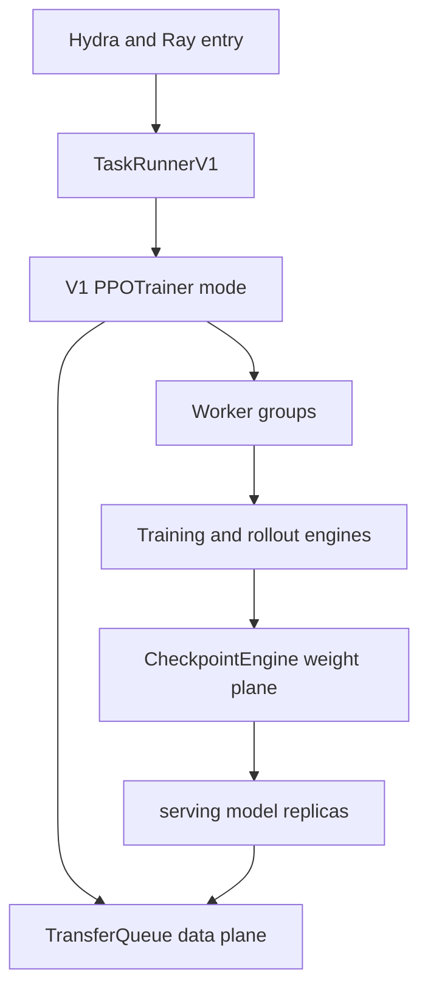

# verl 架构总览：V1 控制、数据、计算与权重四平面

> **代码基准**：verl `main` @ `254a23edc62f25ebfae626e3932ae285d6f86009`（2026-08-28）
> **最后更新**：2026-08-28 · **系列**：verl RLHF 框架源码级分析（见 [[verl/index]]）
>
> **核心结论**：当前 verl 的默认架构不是“一个 Ray driver 搬 DataProto 并串行调用所有角色”，而是四个可独立演进的平面：V1 trainer 决定控制依赖，TransferQueue 保存数据，Worker/Engine 执行训练与推理，CheckpointEngine 发布权重。三种稳定 V1 trainer 只改变资源与时间状态机；算法注册表和底层 Engine 不随 trainer 模式复制。

---

## 1. 当前入口先决定 trainer 世代

`trainer.use_v1` 默认 true，`trainer.v1.trainer_mode` 默认 sync（`verl/trainer/config/ppo_trainer.yaml:227-237`）。`main_ppo.py` 先按 `use_v1` 选择 TaskRunner，再由 V1 registry 选择 `sync`、`colocate_async` 或 `separate_async`（`verl/trainer/main_ppo.py:137-152,183-192`；`verl/trainer/ppo/v1/trainer_base.py:1897-1924`）。

V0 `RayPPOTrainer` 仍存在，但类本身带 deprecated 标记，且需要显式 `trainer.use_v1=false` 才会进入（`verl/trainer/ppo/ray_trainer.py:285-286`；`verl/trainer/main_ppo.py:183-192`）。当前端到端主线见 [[10_verl_end_to_end_iteration_analysis]]，V0 历史实现见 [[20_verl_ray_trainer_analysis]]。

---

## 2. 四平面与 ownership

| 平面 | 核心对象 | 拥有什么 | 不拥有什么 |
|---|---|---|---|
| 控制 | `TaskRunnerV1`、`PPOTrainer`、ReplayBuffer | 阶段依赖、key 选择、模式 hook、资源状态 | 大 batch 的长期存储 |
| 数据 | TransferQueue、`KVBatchMeta`、`tqbridge` | key/field/tag、延迟物化、数据引用 | PPO 算法与资源调度策略 |
| 计算 | Worker、Engine、rollout server | forward/backward、optimizer、generation、layout | 全局 PPO step 顺序 |
| 权重 | CheckpointEngineManager、CE、rollout loader | 暂停服务、传输拓扑、full/delta apply | 训练后端的参数语义 |

这四个边界分别落在：

- V1 公共 PPO pipeline：`verl/trainer/ppo/v1/trainer_base.py:511-590`；
- TQ meta 与 worker bridge：`verl/utils/transferqueue_utils.py:302-477`；
- Worker/Engine 接口：`verl/workers/engine_workers.py:76-163`、`verl/workers/engine/base.py:99-207`；
- CheckpointEngine 控制面：`verl/checkpoint_engine/base.py:381-506`。

把 ownership 分开后，问题定位也更直接：batch 不新鲜先看 controller/ReplayBuffer，字段缺失看 TQ bridge，梯度/显存看 Engine，rollout 看到旧参数看 CheckpointEngine 和 loader。

---

## 3. 控制平面：共享 PPO 骨架，模式只改变状态机

V1 基类把一次 mini-batch 固定为 sample、reward、balance、old/ref log-prob、value、advantage、critic update、actor update（`verl/trainer/ppo/v1/trainer_base.py:540-590`）。三种模式围绕这个骨架覆盖 lifecycle hook：

| mode | 资源关系 | 主要状态变化 | 入口 |
|---|---|---|---|
| `sync` | trainer/rollout 同池 | sample 后 sleep，step 末安装权重 | `verl/trainer/ppo/v1/trainer_sync.py:25-42` |
| `colocate_async` | 同池但预生成 | sample 后 abort+sleep，更新后 resume | `verl/trainer/ppo/v1/trainer_colocate_async.py:25-59` |
| `separate_async` | standalone rollout + hybrid trainer | rollout 常驻，hybrid 可按库存出借 | `verl/trainer/ppo/v1/trainer_separate_async.py:43-398` |

稳定 V1 async 的 ReplayBuffer、checkpoint 与 GPU lending 见 [[17_verl_v1_async_trainer_analysis]]。`verl/experimental/fully_async_policy` 是另一个独立 TaskRunner/actor 系统，不是第四个 V1 mode；其队列、staleness 与动态资源策略见 [[22_verl_fully_async_dynamic_schedule_deepdive]]。

---

## 4. 数据平面：引用流经 controller，数据流经存储

AgentLoop 为 prompt 创建 background task，prompt key 记录 running/finished/failure，trajectory 以 `uid_session_id_index` 独立写入（`verl/trainer/ppo/v1/agent_loop_tq.py:59-148,177-227`）。controller 的 ReplayBuffer 只根据 key/tag 选择 group；Worker 通过 `tqbridge` 在执行前取实际 TensorDict，输出字段再写回（`verl/utils/transferqueue_utils.py:347-477`）。

这不是删除 DataProto。reward 与 advantage 等局部代码仍会把 TQ 字段转为 TensorDict/DataProto，算法完成后再写回 nested fields（`verl/trainer/ppo/v1/trainer_base.py:1436-1707`）。变化的是数据不再必须由 driver collect 成完整对象后才能进入下一角色。

TransferQueue 的 key schema、当前配置后端与一致性边界见 [[16_verl_v1_transfer_queue_analysis]]；DataProto 的结构与方法见 [[12_verl_dataproto_analysis]]。

---

## 5. 计算平面：Worker 是 RPC 粒度，Engine 是模型语义

`TrainingWorker` 持有 `BaseEngine`，处理 mini-batch、loss 和 worker-level RPC；Engine 拥有模型、并行布局、forward/backward、optimizer 与权重 export（`verl/workers/engine_workers.py:76-163`；`verl/workers/engine/base.py:99-207`）。Engine registry 的选择维度已经是 model type、backend 与 device/vendor 的组合（`verl/workers/engine/base.py:351-399`）。

当前重要后端边界包括：

- FSDP 与新增 FSDP Turbo；Turbo 支持 CUDA/NPU language model，接管 offload/CP，并拒绝同时打开 verl Ulysses（`verl/workers/engine/fsdp/fsdp_turbo_impl.py:25-70`）。
- TorchTitan 作为 language-model backend 委托 FSDP2/TP/CP/EP、optimizer 与 checkpoint，PP 仍不支持（`verl/workers/engine/torchtitan/transformer_impl.py:717`；`docs/workers/torchtitan_workers.rst:6-71`）。
- Megatron、VeOmni 与 NPU MindSpeed adapter；删除的是独立 MindSpeed backend/config 路线，不是 NPU Megatron 适配类（`verl/workers/engine/mindspeed/transformer_impl.py:56-90`）。

完整接口与约束见 [[13_verl_workers_engine_analysis]]。

---

## 6. 权重平面：发布不是一个统一 broadcast

actor 更新后有三类状态机：

1. colocated `naive`：Worker 导出 full tensors，由 rollout adapter 通过同进程/IPC loader 安装；
2. disaggregated full：CheckpointEngineManager 暂停请求、释放 KV、建立临时拓扑并 send/receive full named tensors；
3. `delta_sharded`：第一次 dense seed，随后在训练 shard 上做 bit-exact diff，只传位置与值。

Worker 的分叉在 `verl/workers/engine_workers.py:727-771`；CE 的通用 lifecycle 在 `verl/checkpoint_engine/base.py:381-506`；delta 状态机在 `verl/checkpoint_engine/delta_checkpoint_engine.py:271-359,578`。

rollout lifecycle 与 full 路径见 [[14_verl_rollout_resharding_analysis]]，delta ownership、支持矩阵与 checksum 见 [[21_verl_delta_weight_sync_deepdive]]。

---

## 7. 算法平面为何没有成为第五套架构

优势估计和策略损失是两张独立注册表：14 个 estimator 与 12 个 loss mode 共享相同输入/输出契约（`verl/trainer/ppo/core_algos.py:50-145`）。V1 对非 GRPO 复用统一 `compute_advantage`，只为多轨迹 GRPO 增加 session-final 选择与广播（`verl/trainer/ppo/v1/utils.py:148-205`）。

算法变化通常不需要新 trainer 或 Engine；只有当它改变 group schema、policy version、trajectory 字段或资源依赖时，才跨越到数据/控制平面。算法和全局 loss 归一化见 [[15_verl_rl_algorithms_analysis]]。

---

## 8. 评审时必须守住的系统不变量

| 不变量 | 破坏后的典型症状 | 责任边界 |
|---|---|---|
| prompt group 与 trajectory key 不串组 | advantage baseline 错位 | TQ/ReplayBuffer |
| mask、log-prob、reward、value 对齐 | loss 静默污染 | 数据/算法 |
| old policy 在一个 PPO cycle 内稳定 | ratio 基准漂移 | trainer mode |
| global batch 归一化不依赖 micro-batch/DP | 换并行度即换梯度 | Engine/loss |
| rollout 只暴露完整权重版本 | 同批混合 policy | CE/loader |
| abort/sleep 前停止新路由 | 回收时仍有新请求 | rollout/controller |
| checkpoint 同时覆盖 dataloader 与在途数据 | 恢复后丢 prompt 或重复训练 | trainer/TQ |

这些不变量比“用了哪种 backend”更稳定，也是跨页阅读的共同坐标。

---

## Related Pages

- [[10_verl_end_to_end_iteration_analysis]] —— 默认 V1 sync 的端到端执行顺序
- [[16_verl_v1_transfer_queue_analysis]] —— key/meta/field 数据面
- [[17_verl_v1_async_trainer_analysis]] —— 稳定 V1 三模式状态机
- [[13_verl_workers_engine_analysis]] —— Worker/Engine 计算边界
- [[21_verl_delta_weight_sync_deepdive]] —— CheckpointEngine 与 delta 发布
- [[15_verl_rl_algorithms_analysis]] —— estimator、loss 与全局归一化
- [[verl/index]] —— 系列阅读路线
