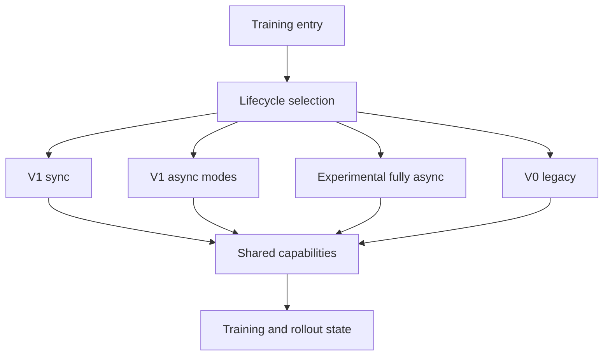

# verl 架构总览：共享能力与四类训练生命周期

> **代码基准**：verl `main` @ `254a23edc62f25ebfae626e3932ae285d6f86009`
> **最后复核**：2026-08-31
> **概念所有权**：本页唯一负责 Verl 分析域的系统地图、能力边界和模式关系；各机制细节由对应专页拥有。

## 核心判断

当前 Verl 最稳定的理解方式，不是按 V0、V1、fully async 各画一套重复架构，而是拆成两层：

1. **共享能力层**：Ray 控制基座、批数据契约、TransferQueue、Agent/Reward runtime、Worker/Engine、rollout runtime、算法、权重发布和训练恢复；
2. **动态生命周期层**：默认 V1 sync、稳定 V1 async、experimental fully async，以及显式保留的 V0 legacy。

不同 trainer 模式主要改变“何时生产、消费、更新、发布和回收资源”，并不复制全部底层能力。这个边界能解释为什么同一个 AgentLoop、Engine 或 CheckpointEngine 的改动会同时影响多个 trainer 路径，也能避免把在线权重发布误写成跨重启 checkpoint。

## 1. 入口先选择生命周期，不选择整套组件

根配置默认 `trainer.use_v1=true`、`trainer.v1.trainer_mode=sync`（`verl/trainer/config/ppo_trainer.yaml:227-237`）。入口先在 V0 与 V1 TaskRunner 之间路由，再由 V1 registry 选择 `sync`、`colocate_async` 或 `separate_async`（`verl/trainer/main_ppo.py:137-155`、`verl/trainer/main_ppo.py:183-192`、`verl/trainer/ppo/v1/trainer_base.py:1897-1924`）。

`experimental/fully_async_policy` 使用独立 TaskRunner、rollouter、trainer 与 MessageQueue，不是第四个 stable V1 `trainer_mode`（`verl/experimental/fully_async_policy/fully_async_main.py:35-100`）。V0 `RayPPOTrainer` 则只有显式 `trainer.use_v1=false` 才会进入，而且类已被标记 deprecated（`verl/trainer/ppo/ray_trainer.py:285-292`）。



## 2. 静态架构：九项共享能力各自解决什么问题

这里的“能力”不是目录别名，而是一段稳定责任：它要说明自己为谁服务、接收和交付什么、由谁宣布状态有效，以及为什么不应并入相邻模块。源码通常能直接证明对象、调用合同和 guard；若没有作者对替代方案的原话，下表把设计理由标为 **【分析推断】**，只把它当作从当前状态所有权重建出的解释。

| 能力 | 是什么：定位与功能 | 怎么做：输入 → 输出与状态变化 | 为什么独立存在 | 状态与边界 / 证据 |
|---|---|---|---|---|
| Ray 控制基座 | 把一组 SPMD rank 暴露成 controller 可调用的一个逻辑对象 | `@register` 把 dispatch、execute、blocking 写成方法元数据；`WorkerGroup` 绑定 wrapper，完成切分、并发 RPC 与 collect | **【分析推断】** 若每个 Trainer 手写 Ray fan-out，它既要懂业务顺序又要懂 DP/TP/PP rank 形状；元数据驱动的 group proxy 把拓扑差异留在 RPC 基座 | 拥有 rank、资源放置和调用形状；不拥有 PPO 顺序。`verl/single_controller/base/decorator.py:398-444`；`verl/single_controller/base/worker_group.py:185-240`；[[11_verl_single_controller_analysis]] |
| 本地批契约 | 在一个计算边界内共同承载 tensor、逐样本 Python/numpy 数据和调用级元数据 | `DataProto` 让索引、切分、repeat、union 同时维护逐样本字段，调用级 `meta_info` 不跟随样本重排 | **【分析推断】** 全部塞进 TensorDict 会迫使工具 schema 等对象伪装成 tensor；全部塞进 Python dict 又失去 batch 对齐检查和设备迁移语义 | 拥有本地 batch identity；不决定数据存在哪里或何时跨进程。`verl/protocol.py:318-376`；[[12_verl_dataproto_analysis]] |
| V1 数据面 | 让 controller 传“处理哪些样本”的引用，而不是搬运完整训练批 | `KVBatchMeta` 携带 key、field、tag；`tqbridge` 在 worker 入口物化 TensorDict，校验输出 batch size 后把新增字段写回 | V0 的完整 `DataProto` 汇合便于严格排序，但中心 controller 会承担大对象传输和拼接；V1 把控制流与数据流拆开，只在执行点按需取字段 | 拥有 key 对应字段和存储状态；不保证 ReplayBuffer freshness 或整步事务。`verl/utils/transferqueue_utils.py:302-477`；[[16_verl_v1_transfer_queue_analysis]] |
| 生成与奖励编排 | 把一个 prompt 运行成含模型 token、工具 observation、mask 和 reward 的可训练 trajectory | Manager 分发 prompt，per-trajectory coroutine 驱动 LLM/tool，Worker 做 padding、mask、reward/teacher 接入，V1 adapter 再落入 TQ | **【分析推断】** 若把工具对话放进 LLM server，server 必须理解训练 schema；若放进 Trainer，长时 coroutine 与批更新屏障耦合。独立 runtime 让二者只通过 `TokenOutput`/`AgentLoopOutput` 连接 | 拥有 session、turn、tool 与 trajectory schema；不拥有 KV 路由或 advantage。`verl/experimental/agent_loop/agent_loop.py:537-698`；[[18_verl_agent_loop_reward_runtime_analysis]] |
| 模型计算 | 把 actor、critic、ref 的粗粒度训练 RPC 落到具体分布式模型实现 | Worker 选择字段和 mini-batch，Engine 执行 forward/backward/optimizer，并按 HF 语义导出 full/shard/delta 权重 | **【分析推断】** 若 Worker 按 FSDP、Megatron、TorchTitan 分支，任何后端变化都会污染角色 RPC；Engine 合同把并行布局和模型状态留给真正 owner | Engine 拥有 module、mesh、optimizer 和 export；Worker 拥有 RPC 与 role。`verl/workers/engine_workers.py:76-163`；`verl/workers/engine/base.py:99-207`；[[13_verl_workers_engine_analysis]] |
| rollout 服务 | 为 AgentLoop 提供可路由、可暂停、带 KV 与模型版本的生成服务 | client acquire server，backend 生成并返回 `TokenOutput`，finally release；replica/manager 处理 sleep、abort、KV 与 PD | **【分析推断】** 对话策略和服务资源的变化频率不同：AgentLoop 关心 turn/tool，server 关心请求、KV 和设备内存；合并会让任一侧变化都穿透另一侧 | 拥有 request、KV、inflight 和 model-visible version；不解释 tool/reward。`verl/workers/rollout/llm_server.py:149-289`；[[14_verl_rollout_runtime_analysis]] |
| RL 算法 | 把 reward/value/group state 变成 advantage，再把 advantage 与 policy ratio 变成梯度目标 | estimator registry 产出 `advantages/returns`，policy-loss registry 产出 token loss matrix，`agg_loss` 还原全局标量 | 两张注册表避免为 estimator × loss × aggregation 的组合复制 Trainer；代价是每个组合的额外输入、mask 和归一化前置条件必须单独验证 | 拥有信用分配、policy movement 和全局归一化；不拥有样本调度。`verl/trainer/ppo/core_algos.py:50-145,1140-1202`；[[15_verl_rl_algorithms_analysis]] |
| 在线权重发布 | 在 actor 更新后，让运行中的 rollout 原子地看见一个完整参数版本 | Engine 转成 HF 语义，CheckpointEngine 建会话并传输，rollout loader 写入；Manager 负责 abort、KV release、apply 和 resume | 并行布局、wire transport、推理模型写入是三种独立变化；单体同步器会被迫同时理解三侧实现。分层让知识靠近 owner，但增加跨层失败窗口 | 拥有 live actor→rollout 可见性；不提供跨重启恢复。`verl/checkpoint_engine/base.py:381-506`；[[21_verl_weight_publication_analysis]] |
| 训练恢复 | 让重启后的模型、优化器、步数、数据游标与可恢复在途样本回到同一逻辑边界 | Trainer 组合 actor/critic、dataloader 与可选 TQ snapshot；恢复后保留 finished trajectory，重发 pending/running prompt | 模型目录只能恢复参数，不能解释“哪些 prompt 已取出但未训练”；把组合一致性单独建模，才能显式描述丢样、重算和 crash window | 拥有 durable resume contract；不负责 live rollout 安装。`verl/trainer/ppo/v1/trainer_base.py:793-950`；[[23_verl_training_checkpoint_recovery_analysis]] |

这张表同时是去重规则：overview 负责解释每项能力为何存在以及边界怎样连接；owner 页负责其内部状态机。生命周期页只说明调用时机和模式特有变化，不能把 owner 机制再复制一遍。

## 3. 动态连接：一次训练工作如何穿过这些边界

### 3.1 默认 V1 sync 的实际符号主链

下面这条链只保留跨 owner 的跳转；每个 owner 内部的 dispatch、协程、算法或 publication 细节由对应专页展开：

```text
TaskRunnerV1.run
  → PPOTrainerSync.init
  → AgentLoopManagerTQ.create
  → PPOTrainer.fit
      → PPOTrainer.step
          → prepare_step
              → _submit_batch_to_rollout
                  → TQ prompt status pending
                  → AgentLoopManagerTQ.generate_sequences
                      → AgentLoopWorkerTQ background _run_prompt
                          → prompt running
                          → _run_agent_loop × rollout.n
                          → trajectory fields written
                          → prompt finished or failure
          → ReplayBuffer.sample waits terminal groups
              → KVBatchMeta for selected trajectory keys
          → optional _compute_reward_colocate
          → _balance_batch
          → _compute_old_log_prob
          → optional _compute_ref_log_prob
          → optional _compute_values
          → _compute_advantage
          → optional _update_critic
          → _update_actor
              → Engine backward and optimizer_step
      → PPOTrainerSync.on_step_end
          → CheckpointEngineManager.update_weights
              → rollout installs actor version and resumes KV
      → next loop iteration prepare_step
          → next prompt may use the new rollout-visible version
```

启动与公共 step 骨架分别位于 `verl/trainer/main_ppo.py:103-163` 和 `verl/trainer/ppo/v1/trainer_base.py:389-590`；prompt 提交、TQ 后台 session 与 terminal publication 位于 `verl/trainer/ppo/v1/trainer_base.py:1385-1434` 和 `verl/trainer/ppo/v1/agent_loop_tq.py:59-148,230-257`；ReplayBuffer admission 在 `verl/trainer/ppo/v1/replay_buffer.py:188-215,319-489`；算法/update 阶段在 `verl/trainer/ppo/v1/trainer_base.py:1541-1765`；sync publication barrier 在 `verl/trainer/ppo/v1/trainer_sync.py:31-42` 与 `verl/checkpoint_engine/base.py:505-516`。完整动态顺序见 [[10_verl_end_to_end_iteration_analysis]]。

| 交接 hop | 跨边界对象或状态 | 旧 owner | 新 owner | 完成信号 |
|---|---|---|---|---|
| runner → trainer | config、worker/rollout/CE handles | `TaskRunnerV1` | `PPOTrainerSync` | `trainer.init()` 返回，恢复与依赖对象可用 |
| trainer → AgentLoop | prompt TensorDict 与 TQ prompt uid | `PPOTrainer` | `AgentLoopManagerTQ` / worker | manager 返回只表示后台 `_run_prompt` 已创建 |
| concrete loop → TQ | `AgentLoopOutput` 转换出的 trajectory fields/tags | per-session AgentLoop coroutine | TransferQueue | trajectory `async_kv_batch_put` 返回 |
| TQ group → ReplayBuffer | prompt terminal tag 与 trajectory keys | AgentLoopWorkerTQ | `ReplayBuffer` | 所有 siblings settle 后 prompt 成为 `finished` 或 `failure` |
| ReplayBuffer → trainer pipeline | 选中 keys/tags 的 `KVBatchMeta` | ReplayBuffer admission | `PPOTrainer._step_once` | `sample()` 返回；只固定样本集合，尚未完成更新 |
| trainer → Worker/Engine | `KVBatchMeta.extra_info` 与按需物化 TensorDict | PPO stage orchestration | actor/ref/critic Worker 与 Engine | 对应 blocking RPC/future materialize 返回 |
| algorithm → training Engine | advantages、returns、loss scalar、grads | algorithm/loss functions | actor Engine optimizer | `optimizer_step()` 成功；rollout 尚未看到新参数 |
| training Engine → rollout | HF full/shard/delta 语义的 actor version | Engine + CheckpointEngine sender | rollout loader/replicas | `PPOTrainerSync.on_step_end()` 返回，安装与 KV resume 完成 |
| publication → next prompt | rollout-visible model version | sync trainer mode | 下一轮 AgentLoop 请求 | 下一次 `prepare_step` 在 barrier 之后提交 |

这张交接表刻意区分三类容易混写的完成：manager 接受 prompt 不等于 trajectory 完成，`optimizer_step` 不等于 rollout 可见，rollout 可见也不等于跨重启 checkpoint durable。具体 RPC 物化见 [[11_verl_single_controller_analysis]]，trajectory/group 状态见 [[18_verl_agent_loop_reward_runtime_analysis]]，算法到梯度见 [[15_verl_rl_algorithms_analysis]]，权重可见性见 [[21_verl_weight_publication_analysis]]。

### 3.2 Controller 选择生命周期，Ray 基座只执行调用形状

**是什么。** Trainer 是一次 global step 的控制所有者；single-controller 只是把它对 actor、critic、ref、rollout 等角色的调用翻译成一组 rank 上的 RPC。V1 基类定义 sample、reward、balance、old/ref log-prob、value、advantage、critic update 和 actor update 的公共依赖链，具体模式只用 hook 改变生成与训练何时切换（`verl/trainer/ppo/v1/trainer_base.py:511-641`）。

**为什么与怎么做。** **【分析推断】** 若 RPC 基座也决定 PPO 顺序，sync、async 和 V0 会把业务状态机埋进 dispatch；若 Trainer 自己逐 rank 调 Ray，又会复制拓扑逻辑。当前边界让 Trainer 发出一个逻辑方法调用，WorkerGroup 按注册元数据切分、执行和收集，但不宣布“整步已提交”。V0 仍在 driver 汇合完整 `DataProto` 并按屏障推进，因此它改变的是控制形态，不是换掉整套共享组件（`verl/trainer/ppo/ray_trainer.py:1405-1719`）。

### 3.3 本地批语义与跨阶段数据面是两个层级

**是什么。** `DataProto` 回答“物化后的一个 batch 怎样保持样本对齐”；TransferQueue 回答“跨阶段字段放在哪里、何时物化”。二者不是新旧替代关系。

**为什么与怎么做。** V1 controller 用 `KVBatchMeta` 选择 key、field 和 tag；worker 入口把引用解析成 TensorDict，执行 reward、log-prob、value 或 update，再把新增字段写回（`verl/utils/transferqueue_utils.py:302-477`）。这避免 driver 在每个阶段收集完整大对象，但把失败从“RPC 参数立刻缺字段”推迟到引用解析或执行点；reward、advantage 等局部函数仍可临时构造 `DataProto`（`verl/trainer/ppo/v1/trainer_base.py:1436-1707`）。

### 3.4 AgentLoop 生产 trajectory，RewardLoop 决定何时补齐 score

**是什么。** AgentLoop 负责一条 trajectory 的交互与 token schema；RewardLoop 把规则函数、reward model 或用户函数归一成 score。LLM server 只提供生成，不拥有对话和训练 mask。

**为什么与怎么做。** per-trajectory coroutine 可以在工具和外部 reward 等待期间让其它样本继续推进；Manager 负责批分发，Worker 负责把不等长输出变成训练容器。reward 若有独立资源，可在 coroutine 内异步完成；若与 Trainer colocate，则等 rollout 结束后批量计算，避免生成阶段争用同池设备（`verl/experimental/agent_loop/agent_loop.py:537-698,937-999`；`verl/experimental/reward_loop/reward_loop.py:273-370`）。代价是外部工具/reward 副作用不随 trajectory failure 自动回滚。

### 3.5 Worker、Engine 与 rollout server 分别拥有 RPC、训练状态和服务状态

**是什么。** Worker 是远程执行和 mini-batch 边界；Engine 持有训练模型、并行布局、优化器和参数导出；rollout server 持有请求、KV cache 与服务态（`verl/workers/engine_workers.py:76-163`；`verl/workers/engine/base.py:99-207`；`verl/workers/rollout/llm_server.py:149-289`）。

**为什么与怎么做。** **【分析推断】** 三者若合成一个“模型 worker”，训练 backend、RPC 拓扑和 serving backend 任一变化都会扩大到整个对象。当前路径是 `KVBatchMeta → Worker/tqbridge → TensorDict → Engine forward/backward`；生成侧则是 `AgentLoop → LLMServerClient → backend → TokenOutput`。因此 RPC/rank 错误看 WorkerGroup，梯度/offload/export 看 Engine，请求/KV/abort/PD 看 rollout runtime。

### 3.6 算法是三条可组合轴，不是 Trainer 分支树

**是什么。** advantage estimator 决定信用如何分配，policy loss 决定参数更新如何限制，loss aggregation 决定分布式局部贡献如何还原成同一全局目标。

**为什么与怎么做。** Trainer 先使 reward、old/ref log-prob 和可选 value 可见，再调用 estimator 写回 `advantages/returns`；Worker 用统一字段查 policy loss，最后以 global token/batch 信息聚合（`verl/trainer/ppo/v1/trainer_base.py:1541-1765`；`verl/workers/utils/losses.py:85-201`）。拆成三轴避免组合类爆炸，但配置合法不等于语义兼容：uid、mask、旧策略和全局分母缺一项都可能得到错误梯度。

### 3.7 在线发布与跨重启恢复有不同提交点

**是什么。** actor 更新后的 publication 改变 live rollout 的可见参数；training checkpoint 则为未来进程重启建立恢复点。

**为什么与怎么做。** CheckpointEngine Manager 协调暂停请求、释放 KV、导出/传输/应用权重和恢复服务，使新请求只看到完整版本（`verl/checkpoint_engine/base.py:381-506`）。训练 checkpoint 还必须组合优化器、scheduler、trainer step、dataloader，以及 async 模式可保存的 TQ/MQ 状态（`verl/trainer/ppo/v1/trainer_base.py:793-971`）。二者共享“checkpoint”词根，却不能互相证明：rollout 安装成功不代表状态 durable，磁盘目录存在也不代表服务已经切换。

## 4. 四类动态生命周期

| 生命周期 | 生产与训练关系 | 资源关系 | 核心模式状态 | 权威页面 |
|---|---|---|---|---|
| V1 sync | 一步内先采样再训练 | trainer 与 rollout 可共享资源 | sample 后 sleep，step 末发布 | [[10_verl_end_to_end_iteration_analysis]] |
| V1 stable async | 预生成或独立生成与训练解耦 | colocated 或 separate，可 lending | ReplayBuffer、旧度、refill、abort/resume | [[17_verl_v1_async_trainer_analysis]] |
| experimental fully async | 长期运行的 rollouter 与 trainer 经 MQ 解耦 | 动态 scheduler 可改变 hybrid 比例 | MQ backlog、policy version、staleness、资源状态 | [[22_verl_fully_async_dynamic_schedule_deepdive]] |
| V0 legacy | driver 按整批屏障串联阶段 | colocated worker group 为主 | 完整 `DataProto`、固定阶段顺序 | [[20_verl_ray_trainer_analysis]] |

这里最重要的区分是：stable V1 async 属于 V1 trainer registry；experimental fully async 是独立系统；V0 虽然生成内部使用 async AgentLoop，其训练生命周期仍是 driver 级批同步。

## 5. 跨模式必须成立的不变量

| 不变量 | 破坏后的症状 | 首要责任页 |
|---|---|---|
| prompt group、trajectory 与 policy version 不串组 | advantage baseline 或旧度判断错误 | [[16_verl_v1_transfer_queue_analysis]] |
| mask、reward、log-prob、value 在 token 维对齐 | loss 静默污染 | [[12_verl_dataproto_analysis]]、[[15_verl_rl_algorithms_analysis]] |
| 一个 PPO cycle 内 old policy 语义稳定 | ratio 基准随 mini-batch 漂移 | [[17_verl_v1_async_trainer_analysis]] |
| micro-batch 或 DP 变化不改变全局 loss 归一化 | 换并行度即换梯度 | [[13_verl_workers_engine_analysis]]、[[15_verl_rl_algorithms_analysis]] |
| rollout 只向新请求暴露完整权重版本 | 同批混合两个 actor 版本 | [[21_verl_weight_publication_analysis]] |
| abort 或 sleep 前停止新路由并处理在途请求 | 资源回收时仍有新请求进入 | [[14_verl_rollout_runtime_analysis]] |
| 恢复后样本集合与 trainer step 的变化是显式的 | 重复训练、丢 prompt 或版本回退 | [[23_verl_training_checkpoint_recovery_analysis]] |

## 6. 用这张地图定位问题

- 首次运行与配置路由：[[02_verl_quickstart_guide]]。
- 默认同步 step 顺序不清：[[10_verl_end_to_end_iteration_analysis]]。
- 字段缺失、key/tag 或数据不新鲜：[[16_verl_v1_transfer_queue_analysis]]。
- 多轮工具调用或 reward 迟到：[[18_verl_agent_loop_reward_runtime_analysis]]。
- OOM、梯度尺度、backend 与 offload：[[13_verl_workers_engine_analysis]]。
- rollout 卡住、KV、sleep、PD 或请求恢复：[[14_verl_rollout_runtime_analysis]]。
- 新权重不可见或 delta 失败：[[21_verl_weight_publication_analysis]]。
- 重启后丢样、重复样本或 optimizer/dataloader 不一致：[[23_verl_training_checkpoint_recovery_analysis]]。
- 已定位瓶颈后的调优次序：[[30_verl_optimization_analysis]]。

## Related Pages

- [[02_verl_quickstart_guide]] —— 从当前默认配置进入系统
- [[10_verl_end_to_end_iteration_analysis]] —— 默认 V1 sync 生命周期
- [[17_verl_v1_async_trainer_analysis]] —— stable async 模式状态机
- [[22_verl_fully_async_dynamic_schedule_deepdive]] —— experimental fully async 系统
- [[18_verl_agent_loop_reward_runtime_analysis]] —— 生成与奖励共享运行时
- [[21_verl_weight_publication_analysis]] —— 在线权重发布
- [[23_verl_training_checkpoint_recovery_analysis]] —— 跨重启训练恢复
