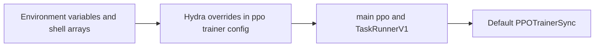
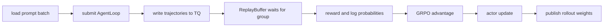

# verl 快速上手：从当前 V1 默认配置跑一次 GRPO

> **代码基准**：verl `main` @ `254a23edc62f25ebfae626e3932ae285d6f86009`
> **最后复核**：2026-08-31
> **概念所有权**：本页唯一负责从仓内样例完成第一次可追踪的 V1 sync 运行；不重复架构与机制细节。
>
> **目标**：以仓内 `run_qwen3_4b_fsdp.sh` 为最小可追踪样例，理解数据、模型、actor、rollout、reference 与 trainer 六组 override 如何进入默认 V1 sync 主链。本文不替代官方安装矩阵；它给出的是固定提交上可逐行核对的运行契约。

---

## 1. 适用场景与前置

根配置通过 Hydra defaults 组合 actor、rollout、critic、reward 与 TransferQueue（`verl/trainer/config/ppo_trainer.yaml:8-46`）。当前默认值是：

```yaml
trainer:
  use_v1: true
  v1:
    trainer_mode: sync
```

源码位置是 `verl/trainer/config/ppo_trainer.yaml:227-237`。这意味着直接执行 `python3 -m verl.trainer.main_ppo` 会进入 `TaskRunnerV1 → PPOTrainerSync`，而不是旧教程常写的 `RayPPOTrainer.fit`（`verl/trainer/main_ppo.py:183-192`）。

TransferQueue 子配置自身仍写 `enable: False`，但 V1 runner 会在远端内部强制打开并初始化它（`verl/trainer/config/transfer_queue/transfer_queue.yaml:1-2`；`verl/trainer/main_ppo.py:137-155`）。不要因为 YAML 的 false 误判当前 V1 没有 TQ 数据面。

> [!note] 快速确认实际路由
> 启动日志与 resolved Hydra config 应同时显示 `trainer.use_v1=true`、`trainer.v1.trainer_mode=sync`。若为了复现实验显式设置 `trainer.use_v1=false`，运行的是 [[20_verl_ray_trainer_analysis]] 的 V0 legacy 主循环，本文后续的 `KVBatchMeta`/TransferQueue 步骤不再适用。

---

## 2. 选择仓内可复核的样例

本文使用：

```text
examples/grpo_trainer/run_qwen3_4b_fsdp.sh
```

它声明 Qwen3-4B、GRPO、FSDP，并能自动探测 NVIDIA GPU 或 Ascend NPU（`examples/grpo_trainer/run_qwen3_4b_fsdp.sh:1-16`）。当前 Python 约束是 `>=3.10,<3.13`（`pyproject.toml:11`）。

脚本优先使用仓库锁定的 uv 环境：GPU 上的 vLLM/SGLang + FSDP 会执行 `uv run --frozen --all-packages --extra ...`，并把同一 Python executable 传给 Ray worker；设置 `VERL_USE_UV=0` 才回退到系统 Python（`examples/grpo_trainer/run_qwen3_4b_fsdp.sh:128-147`）。这样能减少 driver 与 worker 依赖漂移。

---

## 3. 数据准备与启动

样例默认读取：

```text
$HOME/data/gsm8k/train.parquet
$HOME/data/gsm8k/test.parquet
```

路径来自 `examples/grpo_trainer/run_qwen3_4b_fsdp.sh:13-14`，可以用环境变量覆盖。仓内提供 GSM8K 预处理脚本；运行位置与写出路径应以该脚本当前参数为准。

最小启动：

```bash
bash examples/grpo_trainer/run_qwen3_4b_fsdp.sh
```

常用覆盖：

```bash
MODEL_PATH=Qwen/Qwen3-4B \
TRAIN_FILE=/data/gsm8k/train.parquet \
TEST_FILE=/data/gsm8k/test.parquet \
NGPUS_PER_NODE=8 \
TRAIN_BATCH_SIZE=512 \
PPO_MINI_BATCH_SIZE=256 \
ROLLOUT_N=5 \
bash examples/grpo_trainer/run_qwen3_4b_fsdp.sh
```

脚本把环境变量转成 Hydra override 数组，最终调用 `python3 -m verl.trainer.main_ppo`（`examples/grpo_trainer/run_qwen3_4b_fsdp.sh:58-147`）。



---

## 4. 六组 override 分别改变什么

| 组 | 当前样例关键项 | 作用 | locator |
|---|---|---|---|
| DATA | `adv_estimator=grpo`、train/val files、batch/length | 定义 prompt batch 与算法分组 | `examples/grpo_trainer/run_qwen3_4b_fsdp.sh:60-70` |
| MODEL | model path、remove padding、gradient checkpoint | 定义共享 actor/ref 模型 | `examples/grpo_trainer/run_qwen3_4b_fsdp.sh:72-76` |
| ACTOR | LR、PPO mini/micro batch、KL loss、offload | 定义训练目标与显存策略 | `examples/grpo_trainer/run_qwen3_4b_fsdp.sh:78-90` |
| ROLLOUT | backend、TP、GPU memory、`n`、weight bucket | 定义采样与发布边界 | `examples/grpo_trainer/run_qwen3_4b_fsdp.sh:92-104` |
| REF | log-prob batch 与 param offload | 定义参考策略推理 | `examples/grpo_trainer/run_qwen3_4b_fsdp.sh:106-111` |
| TRAINER | GPU/节点、日志、save/test、epochs | 定义全局生命周期 | `examples/grpo_trainer/run_qwen3_4b_fsdp.sh:113-123` |

GRPO 的组大小由 `actor_rollout_ref.rollout.n` 决定；样例默认 5（`examples/grpo_trainer/run_qwen3_4b_fsdp.sh:29-31,103`）。`data.train_batch_size` 是 prompt 数，实际 trajectory 数还乘以每 prompt 的采样数；actor mini/micro-batch 必须与全局数据量和并行切分兼容。

---

## 5. 一次默认 sync step 会发生什么



V1 基类的固定顺序是 sample、可选 reward、balance、old log-prob、可选 ref/value、advantage、可选 critic update、actor update（`verl/trainer/ppo/v1/trainer_base.py:540-590`）。默认 sync 在采样完成后让 rollout sleep，step 末通过 checkpoint manager 安装新 actor 权重（`verl/trainer/ppo/v1/trainer_sync.py:31-42`）。

GRPO 默认不需要 critic：`need_critic` 只有显式启用或 estimator 为 GAE 时才返回 true（`verl/trainer/ppo/utils.py:75-107`）。样例关闭 in-reward KL、打开 actor KL loss（`examples/grpo_trainer/run_qwen3_4b_fsdp.sh:61-69,78-85`），所以 reference policy 仍然需要。

---

## 6. 先改哪些旋钮

### 6.1 显存不足

按风险从低到高检查：

1. 降低 `ROLLOUT_GPU_MEM_UTIL`，减少 rollout KV cache 占用（`examples/grpo_trainer/run_qwen3_4b_fsdp.sh:29-30,96`）。
2. 降低 actor/log-prob micro-batch（`examples/grpo_trainer/run_qwen3_4b_fsdp.sh:20-21,81,93`）。
3. 打开 actor param/optimizer offload（`examples/grpo_trainer/run_qwen3_4b_fsdp.sh:86-87`）。
4. 缩短 prompt/response 上限（`examples/grpo_trainer/run_qwen3_4b_fsdp.sh:22-23,65-66`）。

每次只改一类资源预算，并记录有效 token/s；否则很难区分 OOM 修复与吞吐回退。

### 6.2 换 rollout backend

脚本的 `INFER_BACKEND` 传到 `actor_rollout_ref.rollout.name`（`examples/grpo_trainer/run_qwen3_4b_fsdp.sh:11,95`）。切换前必须同时核对：安装 extra、模型支持、TP、sleep/wake、weight update backend 与量化/PD 限制。尤其 `delta_sharded` 当前只支持 SGLang，并不因修改一个 name 就自动适配 vLLM（`verl/checkpoint_engine/base.py:325-326`）。

### 6.3 换 trainer mode

可在命令尾追加 Hydra override：

```bash
bash examples/grpo_trainer/run_qwen3_4b_fsdp.sh \
  trainer.v1.trainer_mode=colocate_async
```

`colocate_async` 与 `separate_async` 不是“更快的 sync 开关”；它们引入 warmup、staleness、partial rollout、TQ checkpoint 或额外 standalone 资源约束。启用前先读 [[17_verl_v1_async_trainer_analysis]]。

### 6.4 换算法

算法至少由三条轴共同决定：`algorithm.adv_estimator`、`actor.policy_loss.loss_mode`、`actor.loss_agg_mode`。例如 DRO 是 loss mode，需要正的 `policy_loss.dro_beta`；它不是一个 estimator。完整矩阵见 [[15_verl_rl_algorithms_analysis]]。

---

## 7. 首次运行的检查表

- driver 与 Ray worker 使用同一 Python/extra；
- train/val parquet schema 能提供 prompt 与 reward 所需字段；
- `train_batch_size × rollout.n` 与 actor mini/micro-batch 可整除；
- GRPO 的同 prompt trajectory 保持相同 uid；
- rollout/ref/actor 的 log-prob temperature 与 mask 对齐；
- actor update 后，下一轮 rollout 只看到完整的新版本；
- save/resume 同时覆盖模型、dataloader；async 模式还要核对 TQ snapshot；
- 指标至少记录生成等待、有效 token、actor/rollout log-prob 差与 weight-sync 时间。

出现问题时，先按 [[10_verl_end_to_end_iteration_analysis]] 的阶段流水线定位。Agent 或 reward 卡住看 [[18_verl_agent_loop_reward_runtime_analysis]]；重启后的状态错位看 [[23_verl_training_checkpoint_recovery_analysis]]；只有瓶颈已经定位后才进入 [[30_verl_optimization_analysis]]。

---

## Related Pages

- [[01_verl_architecture_overview_analysis]] —— 当前四平面架构
- [[10_verl_end_to_end_iteration_analysis]] —— 默认 V1 sync 的完整调用链
- [[16_verl_v1_transfer_queue_analysis]] —— TQ key/meta/field 数据面
- [[17_verl_v1_async_trainer_analysis]] —— 两种稳定 async mode 的额外约束
- [[18_verl_agent_loop_reward_runtime_analysis]] —— 生成与奖励运行时
- [[23_verl_training_checkpoint_recovery_analysis]] —— 保存与恢复检查
- [[02_engineering/04_posttrain_frameworks/index|后训练框架]] —— 父目录
