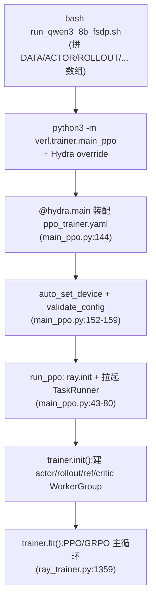
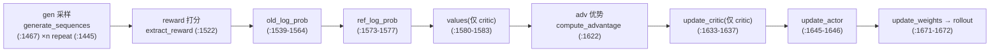

# verl 快速上手 —— 从安装到一次 GRPO 训练

> **代码基准**:verl `main` @ `8a694930`
> **最后更新**:2026-06-22 · **系列**:verl RLHF 框架源码级分析(见 [[verl/index]])
>
> 本文是 verl 系列的**上手篇**。目标:让一个从未跑过 verl 的人,理解"装什么、从哪进、配置怎么拼、一条命令到底改了哪些 key、训练循环每一步在做什么",并能照着跑通一次 GRPO。
> 行号约定:包内文件以 inner `verl/` 为根(如 `trainer/main_ppo.py:144`);仓库根文件(`examples/`、`pyproject.toml`、`setup.py`、`requirements.txt`)标注 `(repo-root)` 前缀。

> [!note] 本页基线 verl `8a694930`;端到端迭代以 [[10_verl_end_to_end_iteration_analysis]](基线 `983cb0f`)为准,两基线间机制差异以新基线页为先。

---

## 1. 适用场景与前置

verl(HybridFlow 的开源实现)是面向 LLM **后训练 / 强化学习(RLHF)** 的训练库:把"训练引擎"和"推理采样引擎"解耦,用一个 single-controller 在驱动进程上编排 RL 数据流(README 第 24-34 行)。**什么时候用它**:你要做 PPO / GRPO 这类 on-policy RL 后训练,需要把训练(FSDP/Megatron)与高吞吐 rollout(vLLM/SGLang)拼在一起,并在同一组 GPU 上做权重 resharding。

**支持的 RL 算法**(README "Key Features",`(repo-root) README.md:95`):PPO、GRPO、GSPO、ReMax、REINFORCE++、RLOO、PRIME、DAPO、DrGRPO 等。

**三类后端**(`(repo-root) README.md:91-92`):

| 角色 | 可选后端 | 配置位置 |
|------|---------|---------|
| 训练 training | **FSDP / FSDP2 / Megatron-LM** | `actor_rollout_ref.actor.strategy`、`critic.strategy` |
| 采样 rollout | **vLLM / SGLang / HF Transformers** | `actor_rollout_ref.rollout.name` |
| 硬件 | NVIDIA / AMD ROCm / Ascend NPU(`(repo-root) README.md:104`) | `trainer.device` |

**前置环境**:Python ≥ 3.10(`(repo-root) pyproject.toml:24`),当前版本 `0.9.0.dev`(`verl/version/version`)。核心依赖见 `(repo-root) requirements.txt`:`ray[default]`、`hydra-core`、`transformers`、`tensordict`、`vllm`(经 extra)等。安装走 `setup.py` 的 extras(`(repo-root) setup.py:64-75`):

```bash
# 仓库根目录
pip install -e .[vllm]      # 训练 + vLLM rollout(VLLM_REQUIRES: vllm>=0.8.5,<=0.12.0, setup.py:54)
pip install -e .[sglang]    # SGLang rollout(SGLANG_REQUIRES: sglang[srt,openai]==0.5.8, setup.py:56-60)
pip install -e .[mcore]     # Megatron 后端(MCORE_REQUIRES: mbridge, setup.py:62)
pip install -e .[gpu]       # flash-attn / liger-kernel(setup.py:52)
```

> [!note] 硬件门槛
> verl 是多卡框架。默认配置假设单机 8 卡(`trainer/config/ppo_trainer.yaml:146` `n_gpus_per_node: 8`)。rollout 与训练共卡(hybrid engine,`ppo_trainer.yaml:53` `hybrid_engine: true`),所以单张卡要同时容纳"训练分片 + 推理 KV cache",显存吃紧时靠 offload 与 `gpu_memory_utilization` 调。

## 2. 入口与启动

唯一入口是 `verl.trainer.main_ppo`,用 Hydra 装配配置后交给 Ray:

```python
# trainer/main_ppo.py:144
@hydra.main(config_path="config", config_name="ppo_trainer", version_base=None)
def main(config):
```

启动命令(取自后文要走查的脚本,`(repo-root) examples/grpo_trainer/run_qwen3_8b_fsdp.sh:189`):

```bash
python3 -m verl.trainer.main_ppo \
    "${DATA[@]}" "${MODEL[@]}" "${ACTOR[@]}" "${ROLLOUT[@]}" "${REF[@]}" "${TRAINER[@]}" ...
```

`main()` 做三件事再分流:

1. `auto_set_device(config)` —— 探测到昇腾 NPU 时把 `trainer.device` 改成 `npu`(`trainer/main_ppo.py:152`)。
2. `validate_config(...)` —— 校验配置,并根据算法决定是否需要 critic / reference policy(`trainer/main_ppo.py:155-159`,`need_critic` / `need_reference_policy`)。
3. 按 `trainer.use_v1` 分流(`trainer/main_ppo.py:161-170`):
   - `use_v1: true` → `run_ppo(config, TaskRunnerV1)`(`trainer/main_ppo.py:162`)
   - `use_v1: false`(**默认**,`ppo_trainer.yaml:201`)→ 走 legacy `main_ppo_v0.TaskRunner`,并打印 deprecation 警告("will be removed in v0.9.0",`trainer/main_ppo.py:166-170`)

`run_ppo` 负责拉起 Ray local cluster 并注入 runtime env(`trainer/main_ppo.py:43-61`),然后把训练装进一个 `@ray.remote` 的 TaskRunner actor 远程执行(`trainer/main_ppo.py:77-80`)。V1 的 TaskRunner 内部:`get_trainer_cls(config.trainer.v1.trainer_mode)` 选 trainer → `trainer.init()` → `trainer.fit(agent_loop_manager)`(`trainer/main_ppo.py:126-139`);`trainer_mode` 可取 `sync / colocate_async / separate_async`(`ppo_trainer.yaml:207`)。

> [!tip] use_v1 开关
> 默认仍是 v0 路径。v1 引入 TransferQueue 异步数据流(`trainer/main_ppo.py:128`、`ppo_trainer.yaml:360-422`)。本文的训练主循环走查以 `trainer/ppo/ray_trainer.py`(v0 `RayPPOTrainer`)为准,它是理解 RL 数据流最清晰的版本。

## 3. 配置体系

配置 = **Hydra YAML 组合** + **结构化 dataclass 校验** + **命令行 override**。

**(a) Hydra 组合**。根文件 `trainer/config/ppo_trainer.yaml` 顶部的 `defaults` 列表把各组件子配置拼起来(`ppo_trainer.yaml:8-47`):

```yaml
# trainer/config/ppo_trainer.yaml:10-37(节选)
- model_engine: dp
- actor@actor_rollout_ref.actor: ${model_engine}_actor   # → config/actor/dp_actor.yaml
- data@data: legacy_data
- ref@actor_rollout_ref.ref: ${model_engine}_ref
- rollout@actor_rollout_ref.rollout: rollout
- critic@critic: ${model_engine}_critic
- reward@reward: reward
- algorithm@algorithm.rollout_correction: rollout_correction
```

**(b) 结构化 dataclass**。每个 YAML 通过 `_target_` 绑到一个 dataclass,用 `omega_conf_to_dataclass` 实例化并校验。例如 `algorithm` 段绑 `AlgoConfig`(`ppo_trainer.yaml:62`),actor 绑 `ActorConfig`(`workers/config/actor.py:104`),rollout 绑 `RolloutConfig`(`workers/config/rollout.py:145`)。dataclass 定义在 `trainer/config/*.py` 与 `workers/config/*.py`,它们才是 key 名与默认值的"真源"。

**(c) 六大配置组**:

| 组 | 含义 | 关键 key(示例) | 定义处 |
|----|------|----------------|--------|
| `data` | 数据集与 batch | `data.train_files` / `data.train_batch_size` / `data.max_prompt_length` | `config/data/legacy_data.yaml` |
| `actor_rollout_ref` | 三合一:actor(训练策略)/ rollout(采样)/ ref(参考策略) | `actor.strategy`、`rollout.name`、`actor.ppo_mini_batch_size` | `workers/config/{actor,rollout}.py` |
| `critic` | 价值网络(GAE 才需要) | `critic.strategy` | `workers/config/critic.py` |
| `reward_model` / `reward` | 奖励(模型奖励或规则奖励) | `reward_model.enable` | `workers/config/reward.py` |
| `algorithm` | RL 算法与优势估计 | `algorithm.adv_estimator`、`algorithm.use_kl_in_reward`、`algorithm.gamma/lam` | `trainer/config/algorithm.py`(`AlgoConfig`) |
| `trainer` | 训练编排 | `trainer.total_epochs`、`trainer.n_gpus_per_node`、`trainer.save_freq` | `ppo_trainer.yaml:113` |

几个最常改的 key 与默认值:

- `algorithm.adv_estimator: gae`(`ppo_trainer.yaml:71`)—— 优势估计器,GRPO 要改成 `grpo`。
- `actor_rollout_ref.actor.strategy`(`workers/config/actor.py:150`,默认 `MISSING` 必填;FSDP 子类默认 `fsdp`,`actor.py:305`;Megatron 子类默认 `megatron`,`actor.py:274`)。
- `actor_rollout_ref.rollout.name`(`workers/config/rollout.py:156`,默认 `MISSING`)—— rollout 后端。
- `actor_rollout_ref.rollout.n`(`workers/config/rollout.py:165`,默认 `1`)—— 每个 prompt 采样数,GRPO 必须 ≥ 2。

命令行 override 用 Hydra 语法:`key=value` 覆盖已有键,`+key=value` 新增键(脚本里出现过 `+ray_kwargs.ray_init.num_gpus=...`,`run_qwen3_8b_fsdp.sh:83`)。

## 4. 一次完整 GRPO 训练(端到端走查)

走查脚本:`(repo-root) examples/grpo_trainer/run_qwen3_8b_fsdp.sh` —— Qwen3-8B + FSDP 训练 + vLLM rollout,在 GSM8K+MATH 上做 GRPO。

**第 0 步:准备数据**。脚本假设 parquet 已落在 `$HOME/data/`(`run_qwen3_8b_fsdp.sh:133-134`):

```bash
data.train_files="['$HOME/data/gsm8k/train.parquet', '$HOME/data/math/train.parquet']"
data.val_files="['$HOME/data/gsm8k/test.parquet', '$HOME/data/math/test.parquet']"
```

用自带预处理脚本生成,默认输出 `~/data/gsm8k`(`(repo-root) examples/data_preprocess/gsm8k.py:41`,写出 `train.parquet`/`test.parquet`,`gsm8k.py:99-100`):

```bash
python3 examples/data_preprocess/gsm8k.py        # → ~/data/gsm8k/{train,test}.parquet
python3 examples/data_preprocess/math_dataset.py # → ~/data/math/{train,test}.parquet
```

**第 1 步:关键 flag → config key 映射**。脚本把 override 按数组分组(`DATA/MODEL/ACTOR/ROLLOUT/REF/TRAINER`),逐组拼进命令行:

| 脚本 flag(行号) | 覆盖的 config key | 作用 |
|------------------|------------------|------|
| `algorithm.adv_estimator=grpo`(:131) | `algorithm.adv_estimator`(yaml:71) | 选 GRPO 优势(组内归一,无 critic) |
| `algorithm.use_kl_in_reward=False`(:132) | `algorithm.use_kl_in_reward`(yaml:77) | KL 不进 reward,改用 actor KL loss |
| `data.train_batch_size`(:135,默认 1024) | `data` 组 | 每个 global step 的 prompt 数 |
| `data.max_prompt_length` / `max_response_length`(:137-138) | `data` 组 | 截断长度 |
| `actor.optim.lr=1e-6`(:149) | `actor_rollout_ref.actor.optim.lr` | actor 学习率 |
| `actor.ppo_mini_batch_size`(:150,默认 256) | `ActorConfig.ppo_mini_batch_size`(actor.py:151) | actor 更新的 mini-batch |
| `actor.use_kl_loss=True`(:153) | `ActorConfig.use_kl_loss`(actor.py:171) | 对参考策略加 KL loss |
| `actor.kl_loss_coef` / `kl_loss_type=low_var_kl`(:154-155) | `actor.py:175` 等 | KL 系数与估计方式 |
| `actor.fsdp_config.param_offload` / `optimizer_offload`(:157-158) | FSDP offload | 省显存(GPU 默认 False,NPU 默认 True) |
| `rollout.name=${INFER_BACKEND}`(:162) | `RolloutConfig.name`(rollout.py:156) | 采样后端(默认 vllm,:20) |
| `rollout.tensor_model_parallel_size`(:163) | `rollout.py:183` | 推理 TP(GPU 默认 2,:73) |
| `rollout.gpu_memory_utilization`(:164) | `rollout.py:176` | 推理 KV cache 显存占比(:73 默认 0.6) |
| `rollout.n=${rollout_n}`(:165,默认 5) | `RolloutConfig.n`(rollout.py:165) | **GRPO 组大小**,每 prompt 采 5 条 |
| `ref.fsdp_config.param_offload=True`(:173) | ref 策略 offload | 参考策略常驻 offload |
| `trainer.n_gpus_per_node` / `nnodes`(:181-182) | yaml:146 / :143 | 设备规模 |
| `trainer.save_freq` / `test_freq` / `total_epochs`(:183-185) | yaml:149 / :174 / :119 | 存档/验证/轮数 |

**第 2 步:环境变量旋钮**。脚本顶部暴露常调项(`run_qwen3_8b_fsdp.sh:18-48`):`INFER_BACKEND`(vllm/sglang/trtllm)、`MODEL_PATH`(默认 `Qwen/Qwen3-8B`)、`DEVICE`(自动探测 npu/gpu,:19)、`NNODES`、`TRAIN_BATCH_SIZE`、`ROLLOUT_N` 等。一条多机命令:

```bash
MODEL_PATH=Qwen/Qwen3-14B NNODES=2 NGPUS_PER_NODE=8 \
INFER_BACKEND=sglang ROLLOUT_N=8 TRAIN_BATCH_SIZE=2048 \
bash examples/grpo_trainer/run_qwen3_8b_fsdp.sh
```

> [!note] 总轨迹数
> 一个 global step 产生 `train_batch_size × rollout.n` 条轨迹(`(repo-root) examples/grpo_trainer/README.md:22`)。默认 `1024 × 5 = 5120` 条,`ppo_mini_batch_size` 必须能整除它(`ActorConfig` 校验,`workers/config/actor.py:225-235`)。

**运行生命周期**:



## 5. 训练主循环鸟瞰

`RayPPOTrainer.fit()`(`trainer/ppo/ray_trainer.py:1359`)在驱动进程上按 RPC 编排一个 step,轻量的优势计算就在 driver 上做(`ray_trainer.py:1362-1364`)。一个 GRPO step 的顺序:



逐步对应:

1. **gen**:`async_rollout_manager.generate_sequences(...)`(`ray_trainer.py:1467`);先把 prompt 按 `rollout.n` 复制(`batch.repeat`,`ray_trainer.py:1445`)。
2. **reward**:`extract_reward(batch)` 取规则/模型奖励(`ray_trainer.py:1522`)。
3. **old_log_prob / ref_log_prob**:重算 π_old(`ray_trainer.py:1540`)与参考策略 log prob(`ray_trainer.py:1576`)。
4. **adv**:`use_kl_in_reward` 时先 `apply_kl_penalty`(`ray_trainer.py:1595`),再 `compute_advantage(adv_estimator=...)`(`ray_trainer.py:1622-1630`)。GRPO 在组内用均值作 baseline、按 std 归一(组大小即 `rollout.n`)。
5. **update**:有 critic 才 `_update_critic`(`ray_trainer.py:1635`);随后 `_update_actor`(`ray_trainer.py:1646`)。
6. **resharding**:`checkpoint_manager.update_weights(...)` 把新权重同步回 rollout 引擎(`ray_trainer.py:1672`),进入下一 step。

> [!note] GRPO 为什么没有 critic
> GRPO 去掉了独立价值网络,用"同一 prompt 的一组采样的平均奖励"当 baseline(`(repo-root) examples/grpo_trainer/README.md:5-9`)。所以上图 `values` / `update_critic` 两步在 GRPO 下被跳过(`self.use_critic` 为 False),`adv_estimator=grpo` 直接走组内归一路径。

机制细节(WorkerGroup 如何建、`DataProto` 如何在 driver/worker 间流动、resharding 怎么做)见 [[20_verl_ray_trainer_analysis]] 与 [[14_verl_rollout_resharding_analysis]]。

## 6. 切换后端 / 算法的常用旋钮

| 想换什么 | config key | 取值 | 来源 |
|----------|-----------|------|------|
| 训练后端 | `actor_rollout_ref.actor.strategy`(及 `ref.strategy` / `critic.strategy`) | `fsdp` / `fsdp2` / `megatron` / `veomni` / `torchtitan` / `mindspeed` | `workers/config/actor.py:305/274/353/385/411`;FSDP2 见 `(repo-root) README.md:180-183` |
| rollout 后端 | `actor_rollout_ref.rollout.name` | `vllm` / `sglang` / `hf` / `trtllm` | `workers/config/rollout.py:156`;脚本 `INFER_BACKEND`(:20) |
| RL 算法 / 优势 | `algorithm.adv_estimator` | `gae`(PPO) / `grpo` / `reinforce_plus_plus` / `remax` / `rloo` … | `trainer/config/ppo_trainer.yaml:71` |
| KL 放哪 | `actor.use_kl_loss` + `algorithm.use_kl_in_reward` | actor KL loss 与 reward 内 KL 二选一 | `actor.py:171`、`ppo_trainer.yaml:77` |
| 采样组大小 | `actor_rollout_ref.rollout.n` | GRPO ≥ 2(脚本默认 5) | `rollout.py:165` |
| 显存吃紧 | `actor.fsdp_config.param_offload` / `optimizer_offload`、`rollout.gpu_memory_utilization` | True / 调低占比 | 脚本 :157-158、:164 |
| 切到 v1 异步 | `trainer.use_v1=true` + `trainer.v1.trainer_mode` | `sync` / `colocate_async` / `separate_async` | `main_ppo.py:161`、`ppo_trainer.yaml:207` |

> [!tip] FSDP → FSDP2 / Megatron 的最小改动
> FSDP2:三行 `actor/ref/critic.strategy=fsdp2`(`(repo-root) README.md:180-183`),可叠加 `actor.fsdp_config.offload_policy=True`(`README.md:185`)。
> Megatron:换成 `examples/grpo_trainer/run_qwen3_8b_megatron.sh`,并 `pip install -e .[mcore]`(`(repo-root) setup.py:62`)。

## Related Pages

- [[verl/index]] —— verl 源码级分析系列总览
- [[01_verl_architecture_overview_analysis]] —— HybridFlow 整体架构与 single-controller 设计
- [[20_verl_ray_trainer_analysis]] —— `RayPPOTrainer.fit()` 主循环逐步源码分析(本文第 5 节的展开)
- [[11_verl_single_controller_analysis]] —— single-controller / WorkerGroup RPC 编排
- [[12_verl_dataproto_analysis]] —— `DataProto` 数据载体
- [[13_verl_workers_engine_analysis]] —— FSDP / Megatron worker 引擎
- [[14_verl_rollout_resharding_analysis]] —— rollout 后端与训练↔推理权重 resharding
- [[15_verl_rl_algorithms_analysis]] —— GRPO / PPO / 优势估计器与 KL 控制
- [[30_verl_optimization_analysis]] —— 性能与显存优化旋钮
- [[02_engineering/04_posttrain_frameworks/index]] —— 后训练框架目录索引(本系列所在)
