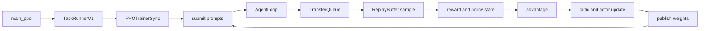

# D07 verl V1 端到端训练迭代

> **阶段**：S02 · **文档编号**：D07
> **源码基线**：verl `main` @ `254a23edc62f25ebfae626e3932ae285d6f86009`（2026-08-28）
> **最后更新**：2026-08-31 · **定位**：默认 V1 sync global-step 唯一生命周期 owner
> **结论先行**：当前标准入口默认执行 `TaskRunnerV1 → PPOTrainerSync`。一次训练步不再让完整 `DataProto` 在 driver 与所有 worker 之间往返，而是让 AgentLoop 把轨迹写入 TransferQueue，controller 用 `KVBatchMeta` 选择样本，各 worker 在执行边界才物化所需字段。本文只拥有这条 sync 动态顺序；AgentLoop、TQ、算法、权重发布和恢复的内部机制分别由 18、16、15、21、23 承担。
> **阅读导航**：[[30_rl_framework_comparison|上一篇 D06]] · [[01_slime_architecture_overview_analysis|下一篇 D08]]

---

## 1. 当前默认主链

默认配置是 `trainer.use_v1: true` 与 `trainer.v1.trainer_mode: sync`（`verl/trainer/config/ppo_trainer.yaml:227-237`）。入口根据前者选择 V1 runner，只有显式设为 false 才导入 V0 runner（`verl/trainer/main_ppo.py:183-192`）；V1 runner 再从 registry 选择 sync、colocate async 或 separate async trainer（`verl/trainer/main_ppo.py:137-152`；`verl/trainer/ppo/v1/trainer_base.py:1897-1924`）。



`TaskRunnerV1` 创建 trainer、worker、LLM server 与 AgentLoop manager，然后进入 `fit()`（`verl/trainer/main_ppo.py:103-163`）。默认 `PPOTrainerSync` 只覆盖采样后的 sleep 和 step 末权重安装；PPO 计算骨架仍来自基类（`verl/trainer/ppo/v1/trainer_sync.py:25-42`）。

> [!contradiction] 旧默认路径已成为显式 opt-out
> [[20_verl_ray_trainer_analysis]] 走读的 `RayPPOTrainer.fit` 只有在 `trainer.use_v1=false` 时进入。当前类仍带 deprecated 标记（`verl/trainer/ppo/ray_trainer.py:285-286`），所以它适合作为 V0 机制档案，不再是本页的当前主线。

---

## 2. 启动：先建计算资源，再接通数据面

### 2.1 从进程入口逐跳跟到 `fit()`

真实调用链不是“main 创建 trainer”这么短，而是跨过一次 Ray actor 边界：

```text
main(config)
  → validate_config(...)
  → run_ppo(config, TaskRunnerV1)
      → TaskRunnerV1.remote()
      → ray.get(runner.run.remote(config))            # driver 在这里等待整个训练任务
          → get_trainer_cls(trainer_mode)
          → tq.init(config.transfer_queue)
          → trainer_cls(config).init()
          → TaskRunnerV1.init_agent_loop_manager()
              → AgentLoopManagerTQ.create(...handles)
          → PPOTrainer.fit(agent_loop_manager)
          → finally: tracking.finish(); tq.close()
```

入口路由与最外层等待位于 `verl/trainer/main_ppo.py:166-196,34-93`；V1 runner 内部的 registry、TQ、trainer、AgentLoop 与清理顺序位于同文件 `103-163`。这条链揭示了两个容易被概述掩盖的事实：第一，Hydra 主进程不是训练生命周期 owner，`TaskRunnerV1` Ray actor 才是；第二，`ray.get(runner.run.remote(...))` 等的是整个 `run()`，不是某个 step 的完成。

### 2.2 启动阶段的对象与状态账本

| 调用点 | 输入/前态 | 动作与 owner | 输出/后态 | 执行语义 |
|---|---|---|---|---|
| `main → run_ppo` | 已校验的 Hydra config | driver 创建 Ray runtime 与 runner actor | runner handle | `ray.get` 阻塞到 runner 退出 |
| `TaskRunnerV1.run → tq.init` | TQ config | TQ runtime 初始化 runner 会话 | 可访问的 TQ 数据面 | 本地初始化；失败直接阻止 trainer 创建 |
| `trainer_cls(...).init()` | 训练/rollout/reward 配置 | `PPOTrainer` 建 resource pools、worker groups、LLM replicas、CheckpointEngine 并恢复 | 可训练的分布式对象与 step/dataloader 状态 | 多个内部 Ray 调用；方法返回后依赖对象已可用 |
| `AgentLoopManagerTQ.create` | LLM、teacher、reward handles | AgentLoop manager 建 workers | prompt dispatch 入口 | `create` 由 `auto_await` 驱动完成 worker 初始化 |
| `trainer.fit(...)` | 已接通的 manager | `PPOTrainer` 驱动 global-step | 更新后的训练状态 | 直到训练结束才返回 |
| `finally → tq.close` | 成功或异常状态 | `TaskRunnerV1` 关闭 runner 的 TQ 会话 | 连接释放 | 无论训练是否成功都执行 |

`PPOTrainer.init()` 的资源初始化、rollout sleep、checkpoint/dataloader 恢复与模式钩子位于 `verl/trainer/ppo/v1/trainer_base.py:219-371`。其中 sync trainer 把 CheckpointEngine backend 固定为 `naive`，创建 manager 后先 `sleep_replicas()`，再恢复 checkpoint（`verl/trainer/ppo/v1/trainer_base.py:352-371`）。

这不是一组可以随意交换的初始化调用。**是什么**：resource pool 和 worker group 先建立训练角色，LLM server 随后取得 actor worker group，CheckpointEngine 最后同时取得训练端与 rollout 端句柄。**怎么做**：初始化按 `resource_pool_manager → worker group → LLM server → CheckpointEngine` 的依赖顺序推进；随后先让 rollout replicas 进入 sleep，再恢复 checkpoint 与 dataloader，最后由模式 hook 安装当前版本。**为什么**：后一个对象的构造参数直接引用前一个对象的句柄，恢复也必须发生在发布新请求之前。`【分析推断】` 若在 actor/rollout 两端尚未恢复到同一版本时开放生成服务，服务可能接受一个无法与训练状态对应的请求；源码通过顺序约束规避了这个窗口，但没有把它声明成通用事务协议。

这里有两个不能互换的开关：`trainer.use_v1` 决定 runner 路由；`transfer_queue.enable` 在 Ray 初始化前还控制 `TRANSFER_QUEUE_ENABLE` 是否进入 runtime env（`verl/trainer/main_ppo.py:56-74`）。V1 runner 虽然后续必定把 TQ 打开，但这个赋值发生得更晚；外部 TQ package 对环境变量的完整依赖不在本页证据范围。

---

## 3. 当前数据契约：元数据先行，TensorDict 延迟物化

V0 的主要调用参数是 `DataProto`。V1 controller 则传 `KVBatchMeta`：它只携带 partition、keys、tags、选择字段与 `extra_info`，真正数据留在 TransferQueue。`tqbridge` 在 worker 方法执行前把 `KVBatchMeta` 转成存储侧 `BatchMeta` 并取回 TensorDict，函数返回后再把新增字段写回 TQ（`verl/utils/transferqueue_utils.py:302-344,347-477`）。

| 层 | 主要对象 | 责任 |
|---|---|---|
| controller | `KVBatchMeta` | 选择 key、排序、分组、附加执行元信息 |
| TransferQueue | key 对应的 TensorDict fields 与 tags | 保存 prompt、trajectory、log-prob、value、advantage 等 |
| worker boundary | `BatchMeta → TensorDict` | 只在执行函数需要时读取字段并回写输出 |
| 算法函数 | 临时 `DataProto`/TensorDict | 运行 KL、advantage、policy/value loss |

因此“DataProto 是 driver 与所有 worker 间唯一契约”只适用于 V0。V1 仍会在 reward/advantage 等局部计算中临时构造 `DataProto`，例如 advantage 路径从 TQ 取字段后转成 padded `DataProto`，计算完再把 nested 结果写回（`verl/trainer/ppo/v1/trainer_base.py:1650-1707`）。详细的数据面见 [[16_verl_v1_transfer_queue_analysis]]，容器本身见 [[12_verl_dataproto_analysis]]。

---

## 4. `fit()`：外层生命周期

`PPOTrainer.fit()` 先初始化日志与可选的 train-before validation；若此前加载过 stable-async TQ snapshot，进入主循环前才使用已经注入的 AgentLoopManager 重发 pending/running prompt（`verl/trainer/ppo/v1/trainer_base.py:389-445`）。保存状态、加载顺序和重发语义由 [[23_verl_training_checkpoint_recovery_analysis]] 统一解释。主循环每步依次：

```text
mode on_step_begin
  step
  optional checkpoint
  mode on_step_end
  optional validation
  metrics and optional dump
  clear consumed TransferQueue keys
  logging and global step advance
```

实际函数调用是 `PPOTrainer.fit → on_step_begin → step → on_step_end → _compute_metrics → _log_rollout_data? → tq.kv_clear → logger.log → global_steps += 1`（`verl/trainer/ppo/v1/trainer_base.py:445-505`）。其中 `on_step_begin/on_step_end` 是动态分派给 trainer mode 的 hook，并不是空的装饰点；sync 的 `on_step_end` 会进入权重发布链（`verl/trainer/ppo/v1/trainer_sync.py:31-42`）。

| 完成信号 | 已经成立 | 尚未保证 |
|---|---|---|
| `step()` 返回 | 本批选择、前向、advantage 和被启用的参数更新都结束 | rollout 已看见新 actor；指标/dump 已消费 TQ 字段 |
| checkpoint 返回 | 当前配置要求的恢复状态已保存 | 新权重已发布给 rollout |
| `on_step_end()` 返回 | 当前 mode 的 step-end 状态切换完成；sync 下即新 actor 已安装 | 本步指标已落日志、TQ 数据已清理 |
| `tq.kv_clear(...)` 返回 | 当前 batch 的轨迹 fields 可回收 | 下一步已完成；日志已推进 step |

这四个完成点解释了为什么不能用“step RPC 返回”代替全局步完成。主循环当前固定为“更新 → 可选保存 → 发布 → 指标/dump → 清理”，但源码没有证明“保存必须早于发布”是所有 mode 的数学要求；真正不可交换的是：发布不能早于 actor update 完成，清理不能早于仍需读取这些 key 的 metrics 与 dump。

---

## 5. `step()`：一批 prompt 如何成为一次更新

### 5.1 供给与消费

公共 `prepare_step()` 从 `StatefulDataLoader` 取一个 train batch，并提交给 AgentLoop；“提交返回”与“轨迹完成”是两个不同事件。完整调用关系如下：

```text
PPOTrainer.step
  → prepare_step
      → _add_batch_to_generate
          → _next_train_batch
          → _submit_batch_to_rollout
              → tq.kv_batch_put(prompt uid, status=pending)
              → AgentLoopManagerTQ.generate_sequences
                  → worker.generate_sequences.remote(chunk)
                  → ray.get([...])                         # 只等 worker 接收并创建后台任务
                      → AgentLoopWorkerTQ.generate_sequences
                          → asyncio.create_task(_run_prompt)
                              → tq.async_kv_put(status=running)
                              → create_task(_run_agent_loop) × rollout.n
                                  → agent_loop.run(...)
                                  → AgentLoopWorkerTQ._agent_loop_postprocess
                                      → reward/teacher log-prob
                                      → tq.async_kv_batch_put(trajectory fields)
                              → settle all sessions
                              → tq.async_kv_put(status=finished|failure)
  → _step_once
      → ReplayBuffer.sample
          → poll TQ tags until enough terminal prompt groups
          → _materialize_batch(...) → KVBatchMeta
```

controller 的提交链位于 `verl/trainer/ppo/v1/trainer_base.py:1385-1434`；manager 的 `ray.get` 与 worker 的 fire-and-forget 分界位于 `verl/trainer/ppo/v1/agent_loop_tq.py:59-105,230-257`。每个 session 的实际 `agent_loop.run` 由基类 `_run_agent_loop` 调用，随后动态分派到 TQ 子类 postprocess（`verl/experimental/agent_loop/agent_loop.py:631-665`；`verl/trainer/ppo/v1/agent_loop_tq.py:150-227`）。prompt 只有在所有 session settle 后才变成 `finished`，任何 session 出错则变成 `failure`（`verl/trainer/ppo/v1/agent_loop_tq.py:107-148`）。

| 对象/字段 | 谁写 | 状态变化 | 谁据此继续 |
|---|---|---|---|
| prompt key/tag | `_submit_batch_to_rollout` | `pending` | AgentLoop worker |
| prompt tag | `_run_prompt` | `pending → running` | ReplayBuffer 的状态快照 |
| trajectory key/fields | `_agent_loop_postprocess` | 写入 `{uid}_{session}_{index}`、tokens、mask、reward、版本 tags | 后续 TQ worker 与算法阶段 |
| prompt tag | `_run_prompt` | `running → finished/failure`，且发生在全部 session settle 之后 | `ReplayBuffer.sample` |
| `KVBatchMeta` | `ReplayBuffer._materialize_batch` | 清除被选 prompt key，保留并返回对应 trajectory keys/tags | `_balance_batch` 及九阶段流水线 |

ReplayBuffer 每次轮询都从 TQ 重建 pending/running/finished/failure 集合，选择 terminal groups，再把命中的 trajectory keys 组装成 `KVBatchMeta`（`verl/trainer/ppo/v1/replay_buffer.py:188-215,319-389,405-489`）。因此真正的同步屏障不是 manager 中的 `ray.get`，而是 `ReplayBuffer.sample` 观察到足够多 terminal prompt group；这也是读代码时最容易误判的等待点。

`step()` 要求 `train_batch_size` 能被 `parameter_sync_step` 整除，并循环消费对应数量的 controller mini-batch（`verl/trainer/ppo/v1/trainer_base.py:511-538`）。默认 sync 的同步次数为 1，所以本步等待 ReplayBuffer 凑齐完整 batch；异步模式如何跨步积压和过滤由 [[17_verl_v1_async_trainer_analysis]] 单独承担。

### 5.2 `_step_once()` 的九个阶段

源码顺序在 `verl/trainer/ppo/v1/trainer_base.py:540-590`：

| 阶段 | 是什么：消费 → 产出 | 为什么位于这里 / 不可交换边界 |
|---|---|---|
| ReplayBuffer sample | 从已完成轨迹中选择一组 `KVBatchMeta` | 锁定本次更新的样本集合；后续阶段都围绕这组 key 工作 |
| colocated reward | 没有独立 reward-loop handles 时，读取响应并写入 `rm_scores` | advantage 必须消费完整 reward；独立 reward-loop 已在入队前完成时才可跳过 |
| balance | 依据有效 token workload 重排并补齐 DP 分片 | `【分析推断】` 先固定顺序再做各模型前向，避免后续角色各自重新决定样本到 DP rank 的映射 |
| old log-prob | 读取训练样本并写入 `old_log_probs`、entropy | PPO ratio 与 rollout correction 都需要更新前的策略概率；不能移到 actor update 之后 |
| ref log-prob | 需要 reference policy 时写入 `ref_log_prob` | reward KL 或 actor KL loss 的基准必须在相应计算前可见 |
| critic infer | 需要 critic 时写入 `values` | GAE 等 estimator 需要 value baseline，必须早于 advantage |
| advantage | 汇合 reward、old/ref log-prob、values，写入 `advantages`、`returns` | 它把轨迹字段转换成两个优化器的直接训练目标，因此必须早于任一参数更新 |
| critic update | 需要 critic 时消费 returns/values，返回指标与新参数 | 当前实现固定先更新 critic；源码没有证明在 actor/critic Engine 独立时这是普遍的数学必要条件 |
| actor update | 过了 critic warmup 后消费 advantage 与 log-prob，返回指标与新参数 | 必须等 advantage 完成；发布新权重则要等整个更新完成 |

这个顺序有三个机制约束：reward 必须先于 advantage；rollout correction 需要 rollout/old log-prob 同时可见；actor update 必须等 advantage 写回。

critic update 还有一个局部 future 边界：`TrainingWorker.train_mini_batch` 注册为 `blocking=False`，所以 `critic_wg.train_mini_batch(batch)` 先返回 `DataProtoFuture`，`_update_critic` 紧接着调用 `output.get()` 才执行真正的 `ray.get` 并聚合 TensorDict（`verl/workers/engine_workers.py:241-242`；`verl/trainer/ppo/v1/trainer_base.py:1711-1732`；`verl/protocol.py:1171-1225`）。当前 sync 主链没有利用这段间隙重叠别的工作；future 在这里主要保留统一的非阻塞接口。若某个 worker 已完成更新而另一个 worker 失败，`DataProtoFuture` 不提供回滚，错误会在 `get()` 暴露。

### 5.3 追一条真实跨边界链：`old_log_probs` 从哪里来

以默认 decoupled old-policy 为例，不能停在“调用 actor 计算 log-prob”。代码实际经过 controller 动态绑定方法、Ray dispatch、TQ 物化、Engine 前向和 TQ 回写：

```text
PPOTrainer._compute_old_log_prob(KVBatchMeta)
  → actor_rollout_wg.compute_log_prob(batch)              # 运行时绑定的方法
      → dispatch_fn(...)                                  # 按 actor mesh 切分 meta
      → execute_fn("compute_log_prob", ...)
      → ray.get(object_refs)                              # register 默认 blocking=True
          → tqbridge: KVBatchMeta → BatchMeta → TensorDict
          → ActorRolloutRefWorker.compute_log_prob(data)
              → TrainingWorker.infer_batch(data)
                  → Engine.eval_mode()
                  → Engine.infer_batch(...)
                      → forward_backward_batch(..., forward_only=True)
          → tqbridge: 把输出 fields 写回 TQ，返回更新后的 meta
      → collect_fn(...)
  → tq.kv_batch_get(log_probs, entropy, response_mask, ...)
  → response_from_nested(...)
  → tq.kv_batch_put(old_log_probs, entropy)
```

WorkerGroup 在初始化时扫描 `@register` 元数据并绑定同名方法（`verl/single_controller/base/worker_group.py:185-250`）；Ray wrapper 依次 dispatch、execute，并因默认 `blocking=True` 执行 `ray.get` 后再 collect（`verl/single_controller/ray/base.py:49-67`）。远端 `@register` 又先套上 `tqbridge`（`verl/single_controller/base/decorator.py:398-442`），后者在调用前把 meta 物化成 TensorDict，在 MP source rank 返回 batch 输出时将 fields 写回 TQ（`verl/utils/transferqueue_utils.py:180-207,347-477`）。真正的 actor 前向是 `ActorRolloutRefWorker.compute_log_prob → TrainingWorker.infer_batch → Engine.infer_batch → forward_backward_batch(forward_only=True)`（`verl/workers/engine_workers.py:699-705,396-440`；`verl/workers/engine/base.py:134-149`）。controller 随后才把通用 `log_probs` 裁成 response 区域并以 `old_log_probs` 名称回写（`verl/trainer/ppo/v1/trainer_base.py:1541-1600`）。

| 边界 | 传过边界的对象 | 数据 owner 是否改变 | 等待点 |
|---|---|---|---|
| controller → WorkerGroup | `KVBatchMeta` + `extra_info` | 否，tensor 仍在 TQ | controller 随后在 wrapper 的 `ray.get` 等 worker 完成 |
| tqbridge → TrainingWorker | 物化后的分片 TensorDict | 计算期间由 worker 持有临时视图 | TQ get 完成后才调用函数体 |
| Engine → tqbridge | `log_probs`、entropy 等 TensorDict | 输出 fields 写回 TQ | MP source rank 写回完成后返回 meta |
| `_compute_old_log_prob` → 下一阶段 | 原 `KVBatchMeta` 对应 key 新增 `old_log_probs`、entropy | TQ 继续持有 | `tq.kv_batch_put` 返回后 advantage/update 才能读取 |

bypass 分支不会走这条 actor/Engine 链，而是直接读取 `rollout_log_probs`、改名并写回（`verl/trainer/ppo/v1/trainer_base.py:1547-1555`）。因此性能分析中看到 old-log-prob 阶段没有 actor 前向，不代表阶段被漏执行，必须先检查 rollout-correction 配置。

---

## 6. 奖励、old policy 与 advantage

### 6.1 reward 可以在两个位置完成

若 reward loop 有独立 worker handles，轨迹入队前就带 reward；否则 `_compute_reward_colocate` 从 TQ 读取 prompts/responses，调用 colocated reward model 后写回（`verl/trainer/ppo/v1/trainer_base.py:1436-1513`）。sync lifecycle 只关心 reward 必须在 advantage 前可见；规则/custom/RM 的选择与异步打分路径见 [[18_verl_agent_loop_reward_runtime_analysis]]。

### 6.2 old log-prob 有两种语义

默认 decoupled 路径用 actor 重新计算 stable `old_log_probs`；bypass 路径直接把 `rollout_log_probs` 改名为 old log-prob（`verl/trainer/ppo/v1/trainer_base.py:1541-1600`）。前者明确区分 rollout policy、proximal old policy 与当前训练 policy，后者减少一次前向但把 rollout correction 责任移进 loss 路径。

### 6.3 advantage 仍复用统一算法库

`_compute_advantage` 先选择 in-reward KL 与 rollout correction，再调用 `compute_advantage_for_multi_trajectories`，最后把 nested advantages/returns 写回 TQ（`verl/trainer/ppo/v1/trainer_base.py:1650-1707`）。非 GRPO 直接复用 V0 `compute_advantage`；V1 多轨迹 GRPO 只以每个 session 的最终输出参与组计算，再广播到同 session 其他输出（`verl/trainer/ppo/v1/utils.py:148-205`）。14 个 estimator、12 个 loss mode 与全局归一化见 [[15_verl_rl_algorithms_analysis]]。

---

## 7. worker update 与权重可见性

critic/actor update 都把 global mini-batch size、epochs、shuffle seed 等放入 `KVBatchMeta.extra_info`（`verl/trainer/ppo/v1/trainer_base.py:1711-1765`）。以 actor 为例，参数真正改变发生在下面这条链的 Engine 层，而不是 controller 的 `_update_actor`：

```text
PPOTrainer._update_actor
  → actor_rollout_wg.update_actor(KVBatchMeta)
      → Ray dispatch + tqbridge materialize
      → ActorRolloutRefWorker.update_actor(TensorDict)
          → TrainingWorker.train_mini_batch
              → make_iterator(mini_batch_size, epochs, seed)
              → for each mini_batch:
                  → TrainingWorker.train_batch
                      → Engine.train_mode
                      → Engine.train_batch(loss_fn)
                          → optimizer_zero_grad
                          → forward_backward_batch(forward_only=False)
                          → optimizer_step
              → aggregate metrics on MP source rank
      → Ray collect
  → reduce_metrics → controller metrics
```

入口与 worker 角色跳转位于 `verl/trainer/ppo/v1/trainer_base.py:1734-1765` 和 `verl/workers/engine_workers.py:707-714`；mini-batch/epoch 循环位于 `verl/workers/engine_workers.py:241-338`；最终的 loss、backward 与 optimizer step 在 `verl/workers/engine_workers.py:340-394` 和 `verl/workers/engine/base.py:113-132`。worker 在 `tqbridge` 边界才取得实际 TensorDict，所以 controller 不回收完整训练数据；worker 返回给 controller 的主要是聚合指标，更新后的参数留在训练 Engine。

默认 sync 的 correctness barrier 是：

```text
ReplayBuffer.sample returns selected batch
  → PPOTrainerSync.on_sample_end
      → CheckpointEngineManager.sleep_replicas
  → old/ref/value/advantage + critic/actor update
  → PPOTrainer.fit calls PPOTrainerSync.on_step_end
      → CheckpointEngineManager.update_weights(global_steps)
          → backend == naive
          → ray.get(actor_wg.update_weights(...))
              → ActorRolloutRefWorker.update_weights
                  → actor.engine.get_per_tensor_param
                  → rollout.update_weights
                  → rollout.resume(kv_cache)
  → on_step_end returns
  → next global step may submit prompts
```

模式 hook 在 `verl/trainer/ppo/v1/trainer_sync.py:31-42`。`CheckpointEngineManager.update_weights` 在 sync 初始化时被强制配置成 `naive`，该分支通过 `ray.get` 等 actor worker group 的异步 `update_weights` 全部返回（`verl/trainer/ppo/v1/trainer_base.py:357-368`；`verl/checkpoint_engine/base.py:505-516`）。worker 侧恢复权重内存、导出参数、调用 rollout adapter 更新，再恢复 KV cache（`verl/workers/engine_workers.py:726-820`）。`auto_await` 使同步 hook 直接调用异步 manager 时仍等待 coroutine 完成（`verl/utils/ray_utils.py:97-139`）。因此，**sync 下 `on_step_end()` 返回才是下一版 rollout 权重的可见性完成点**；`_update_actor()` 返回只证明训练 Engine 已更新。

| 状态 | owner | 创建/改变它的调用 | 何时允许下一阶段 |
|---|---|---|---|
| rollout sleep / KV 释放 | rollout replicas | `on_sample_end → sleep_replicas` | 全部 replica 的 `sleep()` gather 完成后才进入训练计算 |
| actor 新参数 | training Engine | `Engine.train_batch → optimizer_step` | 所有 actor update worker 返回后才可发布 |
| rollout 新参数 | rollout adapter | `ActorRolloutRefWorker.update_weights → rollout.update_weights` | update await 完成且 KV cache resume 后 |
| policy-version barrier | trainer mode | `PPOTrainerSync.on_step_end` | hook 返回后下一 global step 才提交新 prompt |

rollout sleep/KV 的服务侧前后置条件见 [[14_verl_rollout_runtime_analysis]]；colocated naive、disaggregated full 与 `delta_sharded` 的 publication 状态机全部由 [[21_verl_weight_publication_analysis]] 承担。

这道 barrier 的定位不是“某个 RPC 返回了”，而是把两个 actor 版本分开：当前 batch 的 log-prob/update 仍归属于旧版本，下一批 rollout 只能看到完整安装后的新版本。实现上先 sleep 生成侧，再安装参数，最后恢复服务。`【分析推断】` 这样设计是为了避免 rollout 在权重分片只更新一部分时接单；代价是同步模式存在明确停顿，而任何单个 worker 的成功返回都不足以证明集群已经切到同一版本。

---

## 8. 条件角色与常见误读

| 条件 | 运行时角色变化 | 证据 |
|---|---|---|
| `adv_estimator=gae` 或显式开 critic | 创建并运行 critic | `verl/trainer/ppo/utils.py:75-107` |
| `use_kl_in_reward` 或 actor KL loss | 需要 reference policy | `verl/trainer/ppo/utils.py:75-107` |
| reward model enable | 创建 reward 路径 | `verl/trainer/ppo/utils.py:75-107` |
| LoRA ref-in-actor | reference 可复用 actor 的无 adapter 视图 | `verl/trainer/ppo/v1/trainer_base.py:1602-1624` |
| bypass rollout correction | 不重算 old log-prob | `verl/trainer/ppo/v1/trainer_base.py:1541-1555` |

不要把这些条件分支写成固定的“actor + critic + ref + reward”四角色拓扑；GRPO 等 critic-free 配置的真实执行图更小。

---

## 9. 失败边界与最小验证

- V1 直接依赖 `transfer_queue`；缺包会在 runner 或 V1 模块 import/初始化阶段失败（`verl/trainer/main_ppo.py:137-149`；`verl/trainer/ppo/v1/trainer_base.py:30-37`）。
- TQ key/tag 与真实字段可能在不同 backend 中延迟可见；controller 只持有 meta，不能把“RPC 返回”当作数据已完整写入的证明。
- bypass 与 decoupled old-policy 语义不同；诊断 TIM 时必须同时记录 rollout、old 与 current log-prob。
- DP balance 会补 padding 并重排 meta；任何新增字段都必须沿 key 同步，不得依赖 controller 的原顺序（`verl/trainer/ppo/v1/trainer_base.py:1515-1539`）。
- sync 仍可能遇到 failed group；是否 refill 与 `gen_batch_size` 约束见 [[17_verl_v1_async_trainer_analysis]]。

最小验证应覆盖：两个 prompt 的 key/field 对齐、reward/advantage mask、一次 actor update 后 rollout 的版本可见性、bypass/decoupled log-prob 差、固定有效 token 下的 DP/micro-batch 梯度不变量，以及按 [[23_verl_training_checkpoint_recovery_analysis]] 定义的保存后样本集合。

---

## Related Pages

- [[01_verl_architecture_overview_analysis]] —— 当前静态 ownership 与 V1/V0/experimental 路由。
- [[15_verl_rl_algorithms_analysis]] —— advantage、policy loss 与全局归一化。
- [[16_verl_v1_transfer_queue_analysis]] —— V1 数据面的 key、meta 与延迟物化。
- [[17_verl_v1_async_trainer_analysis]] —— colocate/separate async、ReplayBuffer 与资源状态机。
- [[18_verl_agent_loop_reward_runtime_analysis]] —— prompt 到 trajectory/reward 的运行时。
- [[21_verl_weight_publication_analysis]] —— actor 更新后使 rollout 看见新版本的 publication。
- [[23_verl_training_checkpoint_recovery_analysis]] —— sync/async 保存、恢复与样本一致性。
