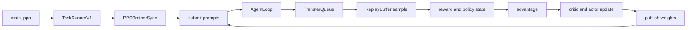

# D07 verl V1 端到端训练迭代

> **阶段**：S02 · **文档编号**：D07
> **源码基线**：verl `main` @ `254a23edc62f25ebfae626e3932ae285d6f86009`（2026-08-28）
> **结论先行**：当前标准入口默认执行 `TaskRunnerV1 → PPOTrainerSync`。一次训练步不再让完整 `DataProto` 在 driver 与所有 worker 之间往返，而是让 AgentLoop 把轨迹写入 TransferQueue，controller 用 `KVBatchMeta` 选择样本，各 worker 在执行边界才物化所需字段。V0 `RayPPOTrainer` 仍可显式启用，但已经是 legacy 路径。
> **阅读导航**：[[30_rl_framework_comparison|上一篇 D06]] · [[01_slime_architecture_overview_analysis|下一篇 D08]]

---

## 1. 当前默认主链

默认配置是 `trainer.use_v1: true` 与 `trainer.v1.trainer_mode: sync`（`verl/trainer/config/ppo_trainer.yaml:227-237`）。入口根据前者选择 V1 runner，只有显式设为 false 才导入 V0 runner（`verl/trainer/main_ppo.py:183-192`）；V1 runner 再从 registry 选择 sync、colocate async 或 separate async trainer（`verl/trainer/main_ppo.py:137-152`；`verl/trainer/ppo/v1/trainer_base.py:1897-1924`）。



`TaskRunnerV1` 创建 trainer、worker、LLM server 与 AgentLoop manager，然后进入 `fit()`（`verl/trainer/main_ppo.py:103-163`）。默认 `PPOTrainerSync` 只覆盖采样后的 sleep 和 step 末权重安装；PPO 计算骨架仍来自基类（`verl/trainer/ppo/v1/trainer_sync.py:25-42`）。

> [!contradiction] 旧默认路径已成为显式 opt-out
> [[20_verl_ray_trainer_analysis]] 走读的 `RayPPOTrainer.fit` 只有在 `trainer.use_v1=false` 时进入。当前类仍带 deprecated 标记（`verl/trainer/ppo/ray_trainer.py:285-286`），所以它适合作为 V0 机制档案，不再是本页的当前主线。

---

## 2. 启动：先建计算资源，再接通数据面

V1 runner 的关键顺序是：

1. 从 trainer registry 得到模式类，并把 `config.transfer_queue.enable` 强制改为 true。
2. 创建 trainer，调用 `init()` 建 worker group、rollout 与 checkpoint 组件。
3. 初始化 TransferQueue。
4. 构造 AgentLoopManager，并把 trainer 的 LLM/reward handles 接入。
5. 调用 `trainer.fit()`；退出时关闭 TransferQueue。

对应源码在 `verl/trainer/main_ppo.py:137-163`。`PPOTrainer.init()` 的资源初始化、rollout sleep、checkpoint/dataloader 恢复与模式钩子位于 `verl/trainer/ppo/v1/trainer_base.py:219-371`。

这里有两个不能互换的开关：`trainer.use_v1` 决定 runner 路由；`transfer_queue.enable` 在 Ray 初始化前还控制 `TRANSFER_QUEUE_ENABLE` 是否进入 runtime env（`verl/trainer/main_ppo.py:56-74`）。V1 runner 虽然后续必定把 TQ 打开，但这个赋值发生得更晚；外部 TQ package 对环境变量的完整依赖不在本页证据范围。

---

## 3. 当前数据契约：元数据先行，TensorDict 延迟物化

V0 的主要调用参数是 `DataProto`。V1 controller 则传 `KVBatchMeta`：它只携带 partition、keys、tags、选择字段与 `extra_info`，真正数据留在 TransferQueue。`tqbridge` 在 worker 方法执行前把 `KVBatchMeta` 转成存储侧 `BatchMeta` 并取回 TensorDict，函数返回后再把新增字段写回 TQ（`verl/utils/transferqueue_utils.py:302-344,347-477`）。

| 层 | 主要对象 | 责任 |
|---|---|---|
| controller | `KVBatchMeta` | 选择 key、排序、分组、附加执行元信息 |
| TransferQueue | key 对应的 TensorDict fields 与 tags | 保存 prompt、trajectory、log-prob、value、advantage 等 |
| worker boundary | `BatchMeta → TensorDict` | 只在执行函数需要时读取字段并回写输出 |
| 算法函数 | 临时 `DataProto`/TensorDict | 运行 KL、advantage、policy/value loss |

因此“DataProto 是 driver 与所有 worker 间唯一契约”只适用于 V0。V1 仍会在 reward/advantage 等局部计算中临时构造 `DataProto`，例如 advantage 路径从 TQ 取字段后转成 padded `DataProto`，计算完再把 nested 结果写回（`verl/trainer/ppo/v1/trainer_base.py:1650-1707`）。详细的数据面见 [[16_verl_v1_transfer_queue_analysis]]，容器本身见 [[12_verl_dataproto_analysis]]。

---

## 4. `fit()`：外层生命周期

`PPOTrainer.fit()` 先初始化日志与可选的 train-before validation；恢复时把 global step 前移，并重新派发 checkpoint 中 pending/running 的 prompt（`verl/trainer/ppo/v1/trainer_base.py:389-445`）。主循环每步依次：

```text
mode on_step_begin
  step
  optional checkpoint
  optional validation
  mode on_step_end
  logging and global step advance
```

主循环入口与 checkpoint 条件在 `verl/trainer/ppo/v1/trainer_base.py:445-510`。模式 hook 把资源切换从公共 PPO 计算中隔离：默认 sync 在 sample 完成后让 rollout sleep，在 step 末向 rollout 安装 actor 新权重（`verl/trainer/ppo/v1/trainer_sync.py:31-42`）。

---

## 5. `step()`：一批 prompt 如何成为一次更新

### 5.1 供给与消费

公共 `prepare_step()` 从 `StatefulDataLoader` 取一个 train batch，并提交给 AgentLoop；它不等待生成完成（`verl/trainer/ppo/v1/trainer_base.py:1421-1434`）。AgentLoop 把每个 prompt 标记为 running，所有 session settle 后再写 finished 或 failure；实际轨迹按 `uid_session_id_index` 单独存储（`verl/trainer/ppo/v1/agent_loop_tq.py:59-148,177-227`）。

`step()` 要求 `train_batch_size` 能被 `parameter_sync_step` 整除，并循环消费对应数量的 controller mini-batch（`verl/trainer/ppo/v1/trainer_base.py:511-538`）。默认 sync 的同步次数为 1，所以本步等待 ReplayBuffer 凑齐完整 batch；异步模式如何跨步积压和过滤由 [[17_verl_v1_async_trainer_analysis]] 单独承担。

### 5.2 `_step_once()` 的九个阶段

源码顺序在 `verl/trainer/ppo/v1/trainer_base.py:540-590`：

| 阶段 | 条件 | 输出状态 |
|---|---|---|
| ReplayBuffer sample | 必选 | 一组可训练 `KVBatchMeta` |
| colocated reward | 没有独立 reward-loop handles | `rm_scores` |
| balance | 必选 | 按 DP workload 重排并补齐 |
| old log-prob | 必选 | `old_log_probs`、entropy |
| ref log-prob | 需要 reference policy | `ref_log_prob` |
| critic infer | 需要 critic | `values` |
| advantage | 必选 | `advantages`、`returns` |
| critic update | 需要 critic | critic metrics 与新参数 |
| actor update | 过了 critic warmup | actor metrics 与新参数 |

这个顺序有三个机制约束：reward 必须先于 advantage；rollout correction 需要 rollout/old log-prob 同时可见；actor update 必须等 advantage 写回。

---

## 6. 奖励、old policy 与 advantage

### 6.1 reward 可以在两个位置完成

若 reward loop 有独立 worker handles，轨迹入队前就带 reward；否则 `_compute_reward_colocate` 从 TQ 读取 prompts/responses，重建 mask，调用 colocated reward model 后写回（`verl/trainer/ppo/v1/trainer_base.py:1436-1513`）。这使 reward 的部署位置可变，但 `_step_once()` 看到的字段契约不变。

### 6.2 old log-prob 有两种语义

默认 decoupled 路径用 actor 重新计算 stable `old_log_probs`；bypass 路径直接把 `rollout_log_probs` 改名为 old log-prob（`verl/trainer/ppo/v1/trainer_base.py:1541-1600`）。前者明确区分 rollout policy、proximal old policy 与当前训练 policy，后者减少一次前向但把 rollout correction 责任移进 loss 路径。

### 6.3 advantage 仍复用统一算法库

`_compute_advantage` 先选择 in-reward KL 与 rollout correction，再调用 `compute_advantage_for_multi_trajectories`，最后把 nested advantages/returns 写回 TQ（`verl/trainer/ppo/v1/trainer_base.py:1650-1707`）。非 GRPO 直接复用 V0 `compute_advantage`；V1 多轨迹 GRPO 只以每个 session 的最终输出参与组计算，再广播到同 session 其他输出（`verl/trainer/ppo/v1/utils.py:148-205`）。14 个 estimator、12 个 loss mode 与全局归一化见 [[15_verl_rl_algorithms_analysis]]。

---

## 7. worker update 与权重可见性

critic/actor update 都把 global mini-batch size、epochs、shuffle seed 等放入 `KVBatchMeta.extra_info`，再调用 worker group 的 `train_mini_batch`（`verl/trainer/ppo/v1/trainer_base.py:1711-1765`）。worker 在 `tqbridge` 边界取得实际 TensorDict，因此 controller 不回收完整训练数据。

默认 sync 的 correctness barrier 是：

```text
ReplayBuffer 选定完整 batch
  → rollout sleep and release weights or KV
  → critic and actor update
  → CheckpointEngine installs actor weights
  → next step submits generation
```

模式 hook 在 `verl/trainer/ppo/v1/trainer_sync.py:31-42`；底层存在 colocated naive、disaggregated full 与 `delta_sharded` 三种发布状态机，不能再统一描述成 CUDA IPC full-tensor 搬运。细节分别由 [[14_verl_rollout_resharding_analysis]] 与 [[21_verl_delta_weight_sync_deepdive]] 承担。

---

## 8. 条件角色与常见误读

| 条件 | 运行时角色变化 | 证据 |
|---|---|---|
| `adv_estimator=gae` 或显式开 critic | 创建并运行 critic | `verl/trainer/ppo/utils.py:75-107` |
| `use_kl_in_reward` 或 actor KL loss | 需要 reference policy | `verl/trainer/ppo/utils.py:75-107` |
| reward model enable | 创建 reward 路径 | `verl/trainer/ppo/utils.py:75-107` |
| LoRA ref-in-actor | reference 可复用 actor 的无 adapter 视图 | `verl/trainer/ppo/v1/trainer_base.py:1602-1624` |
| bypass rollout correction | 不重算 old log-prob | `verl/trainer/ppo/v1/trainer_base.py:1541-1555` |

不要把这些条件分支写成固定的“actor + critic + ref + reward”四角色拓扑；GRPO 等 critic-free 配置的真实执行图更小。

---

## 9. 失败边界与最小验证

- V1 直接依赖 `transfer_queue`；缺包会在 runner 或 V1 模块 import/初始化阶段失败（`verl/trainer/main_ppo.py:137-149`；`verl/trainer/ppo/v1/trainer_base.py:30-37`）。
- TQ key/tag 与真实字段可能在不同 backend 中延迟可见；controller 只持有 meta，不能把“RPC 返回”当作数据已完整写入的证明。
- bypass 与 decoupled old-policy 语义不同；诊断 TIM 时必须同时记录 rollout、old 与 current log-prob。
- DP balance 会补 padding 并重排 meta；任何新增字段都必须沿 key 同步，不得依赖 controller 的原顺序（`verl/trainer/ppo/v1/trainer_base.py:1515-1539`）。
- sync 仍可能遇到 failed group；是否 refill 与 `gen_batch_size` 约束见 [[17_verl_v1_async_trainer_analysis]]。

最小验证应覆盖：两个 prompt 的 key/field 对齐、reward/advantage mask、一次 actor update 后 rollout 的版本可见性、bypass/decoupled log-prob 差、checkpoint 后 prompt 不丢失，以及固定有效 token 下的 DP/micro-batch 梯度不变量。

---

## Related Pages

- [[verl/index]] —— verl 系列入口与当前基线地图
- [[16_verl_v1_transfer_queue_analysis]] —— V1 数据面的 key、meta 与延迟物化
- [[17_verl_v1_async_trainer_analysis]] —— colocate/separate async、ReplayBuffer 与恢复
- [[20_verl_ray_trainer_analysis]] —— 需要 `use_v1=false` 的 V0 legacy 主循环
- [[15_verl_rl_algorithms_analysis]] —— advantage、policy loss 与全局归一化
- [[14_verl_rollout_resharding_analysis]] —— rollout lifecycle 与 colocated 权重刷新
- [[21_verl_delta_weight_sync_deepdive]] —— CheckpointEngine full/delta 发布机制
