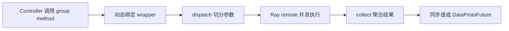

# verl single-controller：当前 V0/V1 共用的 Ray 控制基座

> **代码基准**：verl `main` @ `254a23edc62f25ebfae626e3932ae285d6f86009`（2026-08-28）
> **最后更新**：2026-08-31 · **定位**：Ray/SPMD 控制基础设施唯一机制 owner
>
> **核心结论**：`single_controller` 不是只属于 V0 `RayPPOTrainer` 的旧控制面。当前 V1 trainer、
> rollout server 和 CheckpointEngine 仍共同使用 `RayResourcePool`、`RayWorkerGroup`、`Worker` 与
> `@register`。它拥有的是“把一组 SPMD rank 暴露成一个 controller 对象”的 RPC 语义；
> Trainer 生命周期、批数据语义和模型计算分别属于其它层。

---

## 1. 先划清当前边界

V1 trainer 直接导入 `RayWorkerGroup`、`ResourcePoolManager` 和 `create_colocated_worker_cls`，并在初始化时
按 resource pool 创建 colocated worker class 与 group（`verl/trainer/ppo/v1/trainer_base.py:44-48,277-306`）。
rollout manager 同样接收 `RayWorkerGroup`/`RayResourcePool`（`verl/workers/rollout/llm_server.py:32,475-509`）；
CheckpointEngine worker 继承 `Worker`，manager 还会临时用 rollout handles 组装 `RayWorkerGroup`
（`verl/checkpoint_engine/base.py:22-24,303-354,381-425,521-525`）。

所以本页不能再写成“V0 控制面”。准确边界是：

| 本页拥有 | 本页不拥有 |
|---|---|
| rank 元信息、资源池、placement group、worker 生命周期 | V1 sync/async 的 step 状态机 |
| group method 动态绑定、dispatch、execute、collect | `DataProto` 字段与 batch 不变量 |
| Ray actor 拉起、colocation、同步/异步返回 | Engine 的模型、优化器与并行布局 |
| `DataProtoFuture` 在 RPC 层的延迟物化入口 | TransferQueue 的 key、tag 与存储 |

V0 与 V1 的区别不是“是否使用 single-controller”，而是 controller 传什么：V0 主循环大量传递完整
`DataProto`；V1 controller 主要传 `KVBatchMeta`，worker 在 `tqbridge` 边界才取实际 TensorDict。

这里最关键的对象拆分是 `Worker` 与 `WorkerGroup`。**是什么**：前者表示一个 rank 的进程内执行环境，后者表示 controller 眼中的一组 SPMD ranks。**怎么做**：`Worker` 从环境构造 rank/mesh 元数据并实现 rank-local 方法；`WorkerGroup` 保存 handles，扫描这些方法的注册元数据，生成 dispatch/remote/collect wrapper。**为什么**：rank-local 业务代码不应同时承担 Ray 拓扑和聚合，controller 也不应直接管理每个 rank 的模型状态。`【分析推断】` 若把二者合成一个对象，每个业务方法都要重复处理“我是谁、发给谁、怎样收集”；若 controller 逐 handle 调用，则 mesh/collect 语义会散落到上层。代价是一次看似普通的方法调用背后存在动态绑定，排错必须同时检查定义端 metadata 与 group 绑定结果。

## 2. 一次 group method call 的五段路径

这五段分别由 `WorkerGroup._bind_worker_method`、Ray `func_generator`、decorator registry、Ray actor
handle 和 collect function 承担（`verl/single_controller/base/worker_group.py:185-240`；
`verl/single_controller/ray/base.py:49-68`；`verl/single_controller/base/decorator.py:334-398`）。

这条路径的定位是把“一次逻辑 SPMD 调用”变成 N 个物理 RPC，而不是隐藏算法阶段。实现把切分与收集留在 wrapper，把单 rank 计算留给原始 method。`【分析推断】` 这样做使同一个 actor/ref/critic 方法可以复用 one-to-all、DP 或 mesh-aware 形状，而无需为 Ray 另写一套业务 API；相对地，wrapper 不会替 Trainer 推断跨方法依赖，也不会把 N 个 actor 的副作用合成原子事务。

### 2.1 `Worker` 只描述一个 rank

`Worker` 从环境变量读取 world size、rank、local rank、master address 和设备可见性，并保存 mesh-aware
dispatch/collect 元数据（`verl/single_controller/base/worker.py:76-147,169-231,283-321`）。它不决定
actor/ref/critic 的业务角色，也不实现 PPO；具体 worker class 在其上提供被远程调用的方法。

`execute_with_func_generator` 和 `execute_func_rank_zero` 是少量允许 controller 向 rank 注入函数的通用入口
（`verl/single_controller/base/worker.py:321-344`）。这类能力仍属于 RPC 基座，不能据此推断业务方法的
同步顺序。

### 2.2 `WorkerGroup` 把 N 个 rank 伪装成一个对象

`ResourcePool` 只声明每节点进程数、world size 和 local-rank 分布；`ClassWithInitArgs` 延迟保存 class 与
构造参数（`verl/single_controller/base/worker_group.py:27-101`）。`WorkerGroup` 持有实际 worker handles，
在 `_bind_worker_method` 中扫描用户 worker class 的方法，把带 dispatch metadata 的方法动态绑到 group
实例（`verl/single_controller/base/worker_group.py:123-240`）。

因此 `actor_wg.update_actor(...)` 看起来是一条普通 Python 调用，实际 wrapper 已经固定：

1. 用 method 上的 metadata 选择 dispatch、collect、execute 与 blocking；
2. 将输入按数据并行 mesh 切给目标 ranks；
3. 对每个 actor handle 调相同 method；
4. 同步收集，或返回可延迟 materialize 的 future。

动态绑定只提供调用形状，不保证不同业务调用之间的事务性；Trainer 仍必须显式编排先后关系。

把调用形状写在 method metadata 而不是手写每个 Ray proxy，还有一个直接收益：定义业务方法时即可声明 dispatch、execute、blocking 与 collect，`WorkerGroup` 能对不同 role 统一生成入口（`verl/single_controller/base/decorator.py:398-444`）。`【分析推断】` 替代方案是为每个 worker method 维护一份 controller 代理，二者容易在参数切分或返回聚合上漂移。当前设计的成本也很明确：普通调用点看不见 RPC 形状，错误 metadata 可能直到 group 绑定或远程执行时才暴露。

## 3. `@register` 决定 RPC 形状，不决定算法

`Dispatch` 定义 one-to-all、all-to-all、DP compute、Megatron compute 等预设；`Execute` 决定所有 rank
或 rank zero 执行（`verl/single_controller/base/decorator.py:40-68`）。`register()` 把 dispatch mode、
execute mode、blocking 和 future materialization 写到函数属性，绑定 group method 时再读取
（`verl/single_controller/base/decorator.py:398-444`）。

常见语义可以分成三类：

| 形状 | 适用输入 | collect 后的含义 |
|---|---|---|
| one-to-all | 配置、控制信号 | 每个 rank 收到同一对象 |
| DP compute | 按 batch 维可切的数据 | 每个 DP rank 处理自己的 shard，再按 batch 语义聚合 |
| Megatron/mesh compute | 只在 replica master 接收 controller shard | replica 内部再由模型并行代码同步 |

`make_nd_compute_dataproto_dispatch_fn` 根据 worker 注册的 mesh dispatch 信息构造 N-D 数据并行切分
（`verl/single_controller/base/decorator.py:300-332`）。这说明“均匀切给所有 Ray actors”不是通用保证：
实际切分必须服从 worker 声明的 DP mesh，而 TP/PP/CP rank 可能共享同一 controller shard。

`DataProto` 如何检查、切分和拼接由 [[12_verl_dataproto_analysis]] 负责；本页只说明谁调用这些操作。

## 4. Ray backend：资源声明到活 actor

`RayResourcePool` 把每节点进程数翻译成 placement group bundles；`ResourcePoolManager` 根据 role mapping
创建和查询 pool（`verl/single_controller/ray/base.py:113-226`）。`RayWorkerGroup` 有两种主要来源：

- 从 resource pool 拉起新 workers，分配 global/local rank、master address 和环境；
- 从已有 handles 组装 group，例如 CheckpointEngine 每次 publication 会话临时包住 rollout CE workers。

对应构造与拉起路径位于 `verl/single_controller/ray/base.py:418-682`。`spawn`、`spawn_fused` 和 `fuse`
把多个逻辑角色暴露成不同前缀的方法，而不是启动互不相关的重复 actor
（`verl/single_controller/ray/base.py:714-776`）。V1 `_setup()` 用
`create_colocated_worker_cls` 把同 pool 的 actor/ref/critic 组合到一组 Ray actors
（`verl/trainer/ppo/v1/trainer_base.py:235-306`）。

colocation 只表示共享 Ray actor/设备资源，不表示业务状态自动一致。不同角色仍各自持有 Engine；切换
train/eval、sleep/wake 和更新权重都需要上层明确调用。

它的设计目标是让同一 resource pool 上的多个逻辑角色复用 actor 与 placement，而不是复制一套常驻进程/设备占用；`spawn_fused` 和前缀方法保留了角色可寻址性。`【分析推断】` 若把 colocation 写成“状态共享”，上层就可能漏掉 offload、模式切换或权重发布；共享地址空间只减少资源与 actor 数量，不会自动给多个 Engine 建立一致性协议。

## 5. 同步、异步与失败边界

Ray group 暴露 rank-zero 与 all-worker 的 sync/async 执行入口（`verl/single_controller/ray/base.py:778-862`）。
`blocking=False` 可以把 refs 包成 `DataProtoFuture`，但 future 只是延迟 `ray.get` 与 collect，不会建立
跨 RPC 的 commit protocol（`verl/protocol.py:1171-1226`）。

需要守住四个边界：

1. **dispatch 对齐**：可切输入的 batch 维必须一致，否则问题在发 RPC 前就已产生；
2. **SPMD lockstep**：mesh 内 collective 要求所有参与 rank 走同一调用序列；controller 的异常分支可能导致挂起；
3. **partial failure**：一部分 Ray actor 已执行、一部分失败时，group wrapper 没有通用 rollback；
4. **liveness 不等于 correctness**：worker aliveness check 只能发现 actor 死亡，不能证明参数、KV 或 batch 已一致。

Trainer、CheckpointEngine 和 rollout manager 必须分别定义自己的失败恢复；不能把 Ray future 已返回写成
“整个 RL step 已提交”。

## 6. 当前调用定位

| 当前调用方 | 使用 single-controller 做什么 | 机制 owner |
|---|---|---|
| V1 trainer | 建资源池、colocate 角色、调用 actor/ref/critic workers | [[10_verl_end_to_end_iteration_analysis]]、[[17_verl_v1_async_trainer_analysis]] |
| V0 trainer | driver-centric DataProto RPC lifecycle | [[20_verl_ray_trainer_analysis]] |
| Worker/Engine | 把模型计算方法暴露为 group RPC | [[13_verl_workers_engine_analysis]] |
| LLM server manager | 复用 hybrid worker group 或独立 rollout pool | [[14_verl_rollout_runtime_analysis]] |
| CheckpointEngine | 组 actor/rollout CE workers，执行 publication session | [[21_verl_weight_publication_analysis]] |

## Related Pages

- [[01_verl_architecture_overview_analysis]] —— 当前各状态 owner 与模式路由总览。
- [[12_verl_dataproto_analysis]] —— dispatch/collect 可能承载的本地批容器及其不变量。
- [[13_verl_workers_engine_analysis]] —— group RPC 进入模型计算后的 Worker/Engine 边界。
- [[16_verl_v1_transfer_queue_analysis]] —— V1 controller 不再搬完整 batch 的数据面。
- [[20_verl_ray_trainer_analysis]] —— 使用该基座的 V0 legacy driver lifecycle。
- [[21_verl_weight_publication_analysis]] —— 临时 CE worker group 的权重发布状态机。
