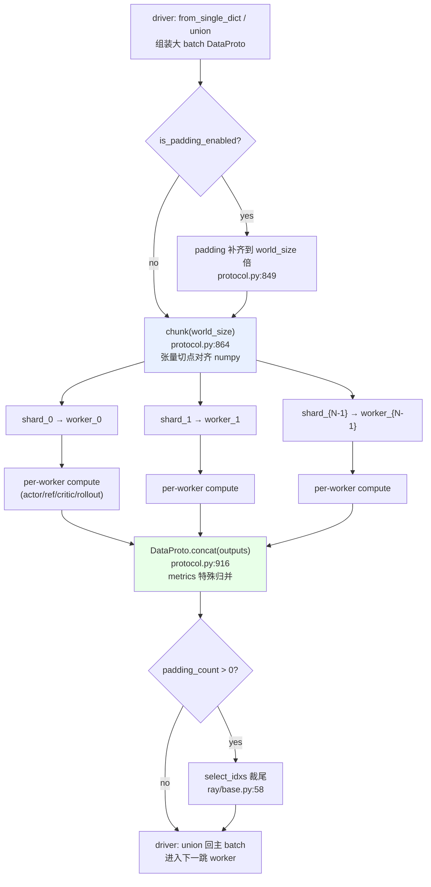

# verl 数据面 —— DataProto:控制器与 worker 之间的数据契约

> **代码基准**:verl `main` @ `8a694930`
> **最后更新**:2026-06-22 · **系列**:verl RLHF 框架源码级分析(见 [[verl/index]])
>
> verl 的 single-controller 模式里,driver 进程在一根 Python 主线程上"指挥"成百上千个 worker。要让"指挥"成立,driver 和 worker 之间必须有一种**自描述、可切分、可拼接、可序列化**的数据载体。这个载体就是 `DataProto`。本文逐方法剖析 `verl/protocol.py`(1346 行),它是整个数据面的单一事实来源。

> [!note] 本页基线 verl `8a694930`;端到端迭代以 [[10_verl_end_to_end_iteration_analysis]](基线 `983cb0f`)为准,两基线间机制差异以新基线页为先。

---

## 1. 功能范围与定位

`DataProto` 是一个 `@dataclass`(`protocol.py:317`),它把一个训练 batch 拆成**三个正交的容器**:

```python
# protocol.py:317-328
@dataclass
class DataProto:
    batch: TensorDict = None
    non_tensor_batch: dict = field(default_factory=dict)
    meta_info: dict = field(default_factory=dict)
```

| 成员 | 类型 | 装什么 | 为什么单列 |
|------|------|--------|-----------|
| `batch` | `TensorDict`(pytorch/tensordict) | 等长 GPU/CPU 张量(`input_ids`、`attention_mask`、`log_probs`、`advantages` …) | TensorDict 允许"像操作单个 Tensor 一样"批量 `.to(device)`/`.chunk()`/`torch.cat`,且能被 `DataLoader` 直接当 dataset 用 |
| `non_tensor_batch` | `dict[str, np.ndarray(dtype=object)]` | 与 batch 等长、但**不是张量**的逐样本数据(原始 prompt 文本、tool schema、`uid`、reward model 的 raw 输出 …) | 张量化会丢信息或不规则;用 numpy object 数组保证仍能按 batch 维切分/索引 |
| `meta_info` | `dict` | 与样本**无关**的全局元信息(`temperature`、`do_sample`、`global_token_num`、`metrics` …) | 切分时整体复制给每个分片,不参与拼接维度 |

设计动机:RLHF 的一个 step 要在 **actor / ref / critic / reward / rollout** 五类 worker 之间反复传递同一批样本,每一跳都可能在原批上**追加**新字段(rollout 追加 `responses`、reward 追加 `token_level_scores`、actor 追加 `old_log_probs`)。如果用裸 dict,每个 worker 的入参签名都要随字段增删而改;而 `DataProto` 把"数据形状"从"函数签名"里解耦——所有 worker 方法统一收 `DataProto`,字段通过 `union`/`pop` 动态增删(见 §2、§3)。

**一致性不变量**。构造后 `__post_init__` 立即调用 `check_consistency`(`protocol.py:330-332`):

```python
# protocol.py:454-477(节选)
if self.batch is not None:
    assert len(self.batch.batch_size) == 1, "only support num_batch_dims=1"
...
batch_size = self.batch.batch_size[0]
for key, val in self.non_tensor_batch.items():
    assert isinstance(val, np.ndarray)            # 必须是 numpy 数组
    assert val.shape[0] == batch_size             # 第 0 维必须等于 batch 大小
```

两条硬约束:(1) `batch` 只允许**单一 batch 维**(`num_batch_dims=1`);(2) `non_tensor_batch` 每个 value 的第 0 维必须与 `batch` 的 batch 维严格相等。这两条是后面 `chunk`/`concat` 能"对齐切分"的前提。`__len__`(`protocol.py:334-341`)据此返回 batch 维长度:有 `batch` 取 `batch.batch_size[0]`,否则退化到任一 non-tensor 数组的 `shape[0]`。

---

## 2. 构造与转换

verl 几乎从不直接 `DataProto(batch=..., ...)`,而是走工厂方法,核心是按 value 类型自动分流到 `batch` 还是 `non_tensor_batch`。

**`from_single_dict`**(`protocol.py:479-493`)是最常用入口:遍历一个混合 dict,`torch.Tensor` 进 `tensors`、`np.ndarray` 进 `non_tensors`、其它类型直接报错,然后转交 `from_dict`。

**`from_dict`**(`protocol.py:495-543`)做真正的构造:

```python
# protocol.py:522-540(节选)
for key, tensor in tensors.items():        # 校验所有张量 dim0 一致
    ...
    assert batch_size == current_batch, "...same batch size..."
for key, val in non_tensors.items():       # 非张量统一转成 object 数组
    if not isinstance(val, np.ndarray):
        non_tensors[key] = np.array(val, dtype=object)
tensor_dict = TensorDict(source=tensors, batch_size=batch_size) if tensors else None
```

注意 `auto_padding=True` 时会把 `DataProtoConfig.auto_padding_key` 写进 `meta_info`(`protocol.py:541-542`)——这是 §4 自动 padding 的开关随数据流动的方式。另有 `from_tensordict`(`protocol.py:545-584`,需 tensordict ≥ 0.10,把 `NonTensorStack`/`NonTensorData` 还原回 `non_tensor_batch`/`meta_info`)。

**设备迁移** `to(device)`(`protocol.py:586-598`):只搬 `batch`(`self.batch = self.batch.to(device)`),numpy 和 meta 留在 CPU,**原地返回 self**。

**索引** `__getitem__`(`protocol.py:343-375`)按 key 类型分派:
- `slice` → `slice()`(`protocol.py:675-719`,返回新 `DataProto`);
- `list`/`np.ndarray`/`torch.Tensor` → `select_idxs()`(`protocol.py:635-673`,支持 bool 掩码与整数索引,batch 用 TensorDict fancy-index、non-tensor 用 numpy fancy-index);
- 单个 `int` → 返回 `DataProtoItem`(`protocol.py:309-314`,一个**无一致性检查**的轻量三元组,代表单样本,主要给 `DataLoader` 的 `collate_fn` 用)。

**字段级增删改**:
- `select(batch_keys, non_tensor_batch_keys, meta_info_keys, deepcopy)`(`protocol.py:600-633`)——投影出子集,返回新对象,可选深拷贝;
- `pop(...)`(`protocol.py:721-752`)——把字段从原对象**移出**并打包成新 `DataProto`(原地修改 `self.batch`/`non_tensor_batch`/`meta_info`);ray_trainer 用它把 `gen_batch` 从大 batch 里抽出来送 rollout(`ray_trainer.py:578`);
- `rename(old_keys, new_keys)`(`protocol.py:754-779`)——只改 `batch` 里的 key,底层 `rename_key_`;
- `union(other)`(`protocol.py:781-798`)——**最高频**操作,把另一个 `DataProto` 的字段并进来。batch 走 `union_tensor_dict`(`protocol.py:109-122`,冲突 key 必须 `.equal`)、non-tensor 走 `union_numpy_dict`(`protocol.py:188-199`,冲突 key 走 `_deep_equal` 处理 NaN/object/环引用)、meta 走 `union_two_dict`。RLHF 主循环靠它把各 worker 的产物逐步叠回主 batch:`batch = batch.union(gen_batch_output)` / `.union(old_log_prob)` / `.union(ref_log_prob)` / `.union(values)`(`ray_trainer.py:1495,1564,1577,1583`)。

---

## 3. 切分与拼接(核心)

这是 `DataProto` 存在的根本理由:它把 **DP_COMPUTE_PROTO** 这一 dispatch/collect 模式的两端(driver 切、worker 算、driver 拼)固化成两个互逆的方法。

### 3.1 `chunk` —— driver 把一批切成 N 份

```python
# protocol.py:864-903(节选)
def chunk(self, chunks: int) -> list["DataProto"]:
    if not self.is_padding_enabled():
        assert len(self) % chunks == 0, "only support equal chunk..."
    if self.batch is not None:
        batch_lst = self.batch.chunk(chunks=chunks, dim=0)          # TensorDict 沿 dim0 切
        bsz_in_batch = np.array([b.batch_size[0] for b in batch_lst])
        chunk_indices = np.cumsum(bsz_in_batch)[:-1]                # 用张量的切点对齐 numpy
    ...
    for key, val in self.non_tensor_batch.items():
        non_tensor_lst = np.array_split(val, chunk_indices.tolist())  # numpy 按相同切点切
```

关键设计:**non-tensor 用 batch 的实际切点(`chunk_indices`)做 `np.array_split`,而不是各切各的**——保证同一样本的张量分片和 numpy 分片永远落在同一个分片里(`protocol.py:887-895`)。`meta_info` 原样复制给每份(`protocol.py:899-901`)。未开 padding 时强制整除(`protocol.py:874`)。

### 3.2 `concat` —— driver 把 N 份结果拼回

```python
# protocol.py:916-961(节选)
new_batch = torch.cat(batch_lst, dim=0) if batch_lst[0] is not None else None
non_tensor_batch = list_of_dict_to_dict_of_list([d.non_tensor_batch for d in data])
for key, val in non_tensor_batch.items():
    non_tensor_batch[key] = np.concatenate(val, axis=0)
```

`concat` 是 `@staticmethod`(`protocol.py:916`)。值得注意的是它对 `meta_info` 的**特殊归并**(`protocol.py:936-958`):普通 key 要求各 worker 取值一致(冲突即 assert),唯独 `"metrics"` 这个 key 会把所有 worker 的指标 `extend`/`append` 聚到一起再 `list_of_dict_to_dict_of_list` 摊平——因为指标本就是 per-worker 的,不该被"一致性"约束。

### 3.3 谁在调用:DP_COMPUTE_PROTO 的两端

`single_controller` 的 dispatch 表把这对方法接进装饰器(`decorator.py:318-326`):

```python
# single_controller/base/decorator.py:318-321
Dispatch.DP_COMPUTE_PROTO: {
    "dispatch_fn": dispatch_dp_compute_data_proto,
    "collect_fn": collect_dp_compute_data_proto,
},
```

- **dispatch 端** `dispatch_dp_compute_data_proto`(`decorator.py:167-177`)→ `_split_args_kwargs_data_proto*`,最终对每个 arg 调 `BatchData(arg).chunk(chunks=world_size)`(`decorator.py:77`);`BatchData`(`protocol.py:1231-1331`)是个类型分派包装器,把 `DataProto`/`TensorDict`/`BatchMeta` 的 chunk/concat 差异收敛到一处,这样 `decorator.py` 永远不用写 `isinstance` 分支。
- **collect 端** `collect_dp_compute_data_proto`(`decorator.py:191-199`)→ `BatchData(output).concat()`,内部回到 `DataProto.concat`。

契约一句话:**driver 把 1 个 DataProto 切成 world_size 份 → 每个 worker 在自己那份上算 → driver 把 world_size 个返回值拼回 1 个 DataProto**,worker 方法体完全不感知自己处理的是"全量的几分之一"。详见 [[11_verl_single_controller_analysis]]。

### 3.4 其它形变

| 方法 | 行号 | 作用 |
|------|------|------|
| `split(split_size)` | `905-914` | 按固定块大小切(`[self[i:i+split_size] ...]`),返回不定数量的块,区别于 `chunk` 的"切成 N 份" |
| `repeat(repeat_times, interleave)` | `971-1013` | 每个样本复制 n 次(GRPO/PPO 一个 prompt 采样 n 条 response);`interleave=True` 用 `repeat_interleave`(AAABBB…→ 原序内扩),`False` 用 expand+reshape。`ray_trainer.py:1445,1494` 用它 |
| `sample_level_repeat(repeat_times)` | `1054-1100` | 每个样本复制**不同**次数(传 list/tensor/ndarray) |
| `reorder(indices)` | `963-969` | **原地**按索引重排 batch 与 non-tensor(`ray_trainer.py:1209` 在变长负载均衡后还原顺序) |
| `unfold_column_chunks` / `fold_batch_dim` / `unfold_batch_dim` | `1015-1052` / `202-238` | 列维↔行维互换、batch 维折叠/展开(分组张量、多轮场景) |

---

## 4. 自动 Padding:为什么要补齐到 world_size 的整数倍

`chunk` 要求"等分",但真实 batch 长度未必是 `world_size`(或 dp_size)的整数倍。verl 用两套机制处理。

**机制一:显式 pad/unpad 一对自由函数。** 用于 rollout 这类长度不定、又必须均分到 DP 的场景:

```python
# protocol.py:74-99(节选)
def pad_dataproto_to_divisor(data: "DataProto", size_divisor: int):
    if len(data) % size_divisor != 0:
        pad_size = size_divisor - len(data) % size_divisor
        ...
        while remaining_pad > 0:                       # 循环从头取样本补齐
            take_size = min(remaining_pad, len(data))
            padding_protos.append(data[:take_size])
            remaining_pad -= take_size
        data_padded = DataProto.concat([data] + padding_protos)
    return data_padded, pad_size
```

`unpad_dataproto`(`protocol.py:102-106`)就是 `data[:-pad_size]`。ray_trainer 的验证生成里成对使用:`pad → generate → union(reward) → unpad`(`ray_trainer.py:639,653`)。补齐策略是"循环复制开头样本",所以即便 `pad_size > len(data)` 也能补满。

**机制二:meta 携带的自动 padding(`is_padding_enabled`)。** 当 `DataProto` 在 `meta_info` 里带 `auto_padding_key`(或全局环境变量 `VERL_AUTO_PADDING=TRUE`)时,`is_padding_enabled()` 返回真(`protocol.py:840-847`)。此时 dispatch 端会**透明地**补齐再切、collect 端透明地裁掉:

```python
# single_controller/base/decorator.py:97-115(节选)
def _padding_and_split_data(obj, chunks):
    if isinstance(obj, DataProto) and obj.is_padding_enabled():
        padding_size = (chunks - (data_proto_len % chunks)) if (data_proto_len % chunks > 0) else 0
        obj.padding(padding_size=padding_size)        # protocol.py:849-862
    return obj.chunk(chunks=chunks)
...
splitted_kwargs[_padding_size_key] = padding_size     # 把 pad 量随 kwargs 传给框架
```

`DataProto.padding`(`protocol.py:849-862`)复用 `select_idxs([0])`/`[len-1]` 取首/尾样本 `repeat(padding_size)` 再 `concat`。补齐量 `_padding_size_key` 不进 worker,而是被框架在 `func_generator` 里 `pop` 出来,等结果 concat 回来后**裁掉尾部**(`ray/base.py:53-63`):

```python
# single_controller/ray/base.py:53-63(节选)
padding_count = kwargs.pop(_padding_size_key, 0)
output = execute_fn(method_name, *args, **kwargs)
output = collect_fn(self, output)
if padding_count > 0 and isinstance(output, DataProto):
    indices = [i for i in range(len(output))][:-padding_count]
    output = output.select_idxs(indices)
```

于是"补齐→均分→各 worker 算→拼回→裁掉补齐"对调用方完全透明。**为什么重要**:均分让每个 DP rank 负载相同、避免某个 rank 拿到空分片导致 NCCL 集合通信挂死或 shape 不一致。

---

## 5. 异步句柄:DataProtoFuture

`DataProtoFuture`(`protocol.py:1173-1228`)是让 driver"指挥而不阻塞"的关键。它**不持有数据**,只持有一组 Ray `ObjectRef`,外加两个回调:

```python
# protocol.py:1173-1190(节选)
@dataclass
class DataProtoFuture:
    collect_fn: Callable          # 把 list[future] 归约成一个 DataProto(默认 DataProto.concat)
    futures: list[ray.ObjectRef]  # 来自某个 WorkerGroup、长度 = world_size
    dispatch_fn: Callable = None  # 取回后再切分/选 dp 的二次变换
```

三个方法对应数据流三段:
- `concat(data)`(`protocol.py:1192-1195`)——把一组 ObjectRef 包成 future,`collect_fn=DataProto.concat`;
- `chunk(chunks)`(`protocol.py:1197-1210`)——**不取数据**,而是为每个目标分片生成一个新的 future,其 `dispatch_fn = lambda x: x.chunk(chunks)[i]`(用 `partial` 绑定 `i`),实现"逻辑切分"延后到 `get` 时才真正发生;
- `get()`(`protocol.py:1212-1228`)——此刻才 `ray.get(self.futures)`,先 `collect_fn`(concat),再(若有)`dispatch_fn`(切+选 dp)。

```python
# protocol.py:1212-1228(节选)
def get(self):
    output = ray.get(self.futures)            # 真正阻塞点
    if isinstance(output[0], DataProto):
        output = DataProto.concat(output)
    if self.dispatch_fn is not None:
        output = self.dispatch_fn(output)
    return output
```

效果:一个 WorkerGroup 的输出可以**直接当作下一个 WorkerGroup 的输入**而无需先回 driver 物化。装饰器在真正执行前才调 `_materialize_futures`(`decorator.py:383-395`)把入参里的 `DataProtoFuture` 调 `.get()` 解开。文档明确警告:driver 上不能对 future 做任何运算,只能直接管道式串接(`protocol.py:1183-1185`)。配合 [[11_verl_single_controller_analysis]] 的 `blocking=False` 路径理解。

---

## 6. 迭代与批处理

PPO 的 mini-batch 内层循环靠 `make_iterator`(`protocol.py:800-838`)。它把 `DataProto` 自身当成 PyTorch dataset 喂给 `DataLoader`:

```python
# protocol.py:816-838(节选)
assert self.batch.batch_size[0] % mini_batch_size == 0
train_dataloader = DataLoader(dataset=self, batch_size=mini_batch_size,
                              collate_fn=collate_fn, generator=generator, **dataloader_kwargs)
def get_data():
    for _ in range(epochs):
        for d in train_dataloader:
            d.meta_info = self.meta_info      # 每个 mini-batch 继承全局 meta
            yield d
```

`collate_fn`(`protocol.py:296-306`)负责把 `DataLoader` 取出的一批 `DataProtoItem`(经 `__getitem__` 单整数索引产生)重新 `torch.stack` 成 batch、把 numpy 用 `list_of_dict_to_dict_of_list` + `np.array(dtype=object)` 重组,再包回 `DataProto`。`generator` 配 `seed` 保证 shuffle 可复现。要点:**mini-batch 必须整除**(`protocol.py:816`),且 `meta_info` 不参与 collate,而是逐 mini-batch 整体回填,确保 `temperature` 等超参不丢。

---

## 7. 生命周期一图



异步路径下,A→C→scatter 不返回 `DataProto` 而返回 `DataProtoFuture`(§5),`F` 的 concat 被推迟到下游 worker 的 `_materialize_futures` 才触发,driver 主线程不阻塞。

---

## 8. 方法速查:method → 作用 → 调用方

| 方法 / 函数 | 行号 | 作用 | 典型调用方 |
|-------------|------|------|-----------|
| `from_single_dict` / `from_dict` | 479 / 495 | 混合 dict → DataProto,按类型分流 batch/non-tensor | dataloader collate、各 worker 返回前 |
| `from_tensordict` | 545 | TensorDict(含 NonTensor)→ DataProto | tensordict ≥0.10 路径 |
| `to(device)` | 586 | 原地搬 batch 到设备 | worker compute 前后 |
| `select` / `pop` | 600 / 721 | 投影 / 移出字段 | `ray_trainer.py:578`(pop gen_batch) |
| `union` | 781 | 并入另一 DataProto 的字段 | `ray_trainer.py:1495,1564,1577,1583` |
| `rename` / `reorder` | 754 / 963 | 改 batch key / 原地重排 | 负载均衡复原(`ray_trainer.py:1209`) |
| `chunk(N)` | 864 | 等分成 N 份(DP scatter) | `decorator.py:77` via `BatchData` |
| `concat(list)` | 916 | 拼回一个(DP gather) | `decorator.py:145,199` |
| `split` / `repeat` / `sample_level_repeat` | 905 / 971 / 1054 | 定长切 / 样本复制 n 次 | rollout n 采样(`ray_trainer.py:1445`) |
| `pad_dataproto_to_divisor` / `unpad_dataproto` | 74 / 102 | 显式补齐/裁剪到整除 | `ray_trainer.py:639,653` |
| `padding` / `is_padding_enabled` | 849 / 840 | 自动 padding 内核 / 开关 | `decorator.py:109` |
| `make_iterator` | 800 | DataLoader 式 mini-batch 迭代 | PPO 内层更新循环 |
| `DataProtoFuture.{concat,chunk,get}` | 1192/1197/1212 | 异步句柄三段 | single_controller 非阻塞 dispatch |
| `BatchData.{chunk,concat}` | 1271 / 1291 | 类型无关的切/拼分派 | `decorator.py` dispatch/collect |
| `all_gather_data_proto` | 1334 | 进程组内 all-gather(原地) | worker 内 DP 聚合 |
| `save_to_disk` / `load_from_disk` | 426 / 430 | pickle 落盘/读回 | 调试、断点 |

---

## 9. 序列化:跨进程传输的隐藏成本

driver↔worker 走 Ray,`DataProto` 必然被 pickle。`__getstate__`/`__setstate__`(`protocol.py:377-424`)做了两件优化:(1) tensordict ≥0.5 时先 `contiguous().consolidate()` 把碎片张量合并成单块,减少 Ray 对象数;(2) 提供两条序列化路径——默认用 `torch.save` 进 `BytesIO`,环境变量 `VERL_DATAPROTO_SERIALIZATION_METHOD=numpy` 时改走 `serialize_tensordict`(`protocol.py:247-259`,把张量摊成 `(dtype, shape, uint8 buffer)`,含 nested tensor 的 layout 处理)。反序列化时按是否有 GPU 决定 `map_location`(`protocol.py:418-420`),避免无 GPU 节点 OOM。这解释了为何 RLHF 里要尽量在跳与跳之间 `pop` 掉不再需要的大张量——每个字段都是真金白银的跨进程拷贝。

---

## 10. 小结

- `DataProto` = `batch`(TensorDict 张量)+ `non_tensor_batch`(numpy object 数组)+ `meta_info`(全局元信息)三个正交容器,`check_consistency` 强制单 batch 维且三者第 0 维对齐。
- `chunk`/`concat` 是 DP_COMPUTE_PROTO 的两端;**non-tensor 用张量的实际切点对齐**,保证同一样本的张量与 numpy 永不错位;`concat` 对 `metrics` 做 per-worker 聚合的特殊归并。
- 两套 padding:显式 `pad_dataproto_to_divisor`/`unpad_dataproto`(rollout 手动)与 meta 驱动的自动 padding(dispatch 端补、`ray/base.py` collect 后裁,对调用方透明)——目的都是让 DP rank 负载严格均分。
- `DataProtoFuture` 只持有 ObjectRef + collect_fn/dispatch_fn,把 `ray.get` 推迟到 `get()`,实现 driver 流水线式非阻塞调度。
- `union`/`pop` 让数据形状与函数签名解耦,是 RLHF 多跳 batch 逐步累积字段的主力;序列化成本是 `pop` 瘦身的现实动机。

## Related Pages

- [[verl/index]] —— verl RLHF 框架源码级分析知识地图(本系列入口)
- [[11_verl_single_controller_analysis]] —— DP_COMPUTE_PROTO 的 dispatch/collect 装饰器、`BatchData`、`func_generator` 的 padding 裁剪与 `DataProtoFuture` 非阻塞执行,与本文互为表里
- [[20_verl_ray_trainer_analysis]] —— PPO 主循环里 `pop`/`union`/`repeat`/`pad`/`reorder` 的实战用法
- [[13_verl_workers_engine_analysis]] —— worker 侧如何消费切片后的 DataProto 并产出新字段
- [[14_verl_rollout_resharding_analysis]] —— rollout 阶段长度不定 batch 的 pad/unpad 与 resharding
- [[01_verl_architecture_overview_analysis]] —— HybridFlow single-controller 总体架构中数据面的位置
