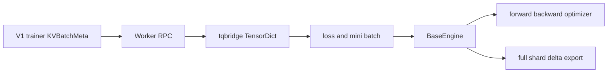

# verl Worker 与 Engine：RPC 粒度、模型语义与后端矩阵

> **代码基准**：verl `main` @ `254a23edc62f25ebfae626e3932ae285d6f86009`（2026-08-28）
> **最后更新**：2026-08-31 · **定位**：Worker/Engine 计算与后端语义唯一机制 owner
>
> **核心结论**：Worker 是 controller 可见的 RPC 和 mini-batch 边界，Engine 才拥有模型、并行布局、optimizer 与权重导出语义。当前后端选择已经是 `model_type × backend × device/vendor`，不是简单的 FSDP/Megatron 二选一；新增 backend 若不能实现 Engine 的训练、checkpoint 与 export 契约，就不能仅靠注册一个 worker 名字完成接入。本页不拥有 Ray dispatch、rollout 服务或 CheckpointEngine wire。

---

## 1. 两层对象解决两个不同问题

`TrainingWorker` 在构造时根据配置创建 `BaseEngine`，并把 actor/critic 等 role 的粗粒度 RPC 暴露给 WorkerGroup（`verl/workers/engine_workers.py:76-163`）。`ActorRolloutRefWorker` 是 actor/ref/rollout 的组合编排层，不是另一个训练后端（`verl/workers/engine_workers.py:451-771`）。

Engine 的接口包含 model forward、optimizer step、数据加载与权重 export 等模型语义（`verl/workers/engine/base.py:99-207`）。所以 ownership 是：

| 层 | 拥有 | 典型变化 |
|---|---|---|
| Worker | RPC、role、mini-batch、loss 调用、TQ bridge | actor/critic/ref 需要哪些字段 |
| Engine | module、parallel mesh、forward/backward、optimizer、checkpoint/export | FSDP、Megatron、TorchTitan、VeOmni |
| rollout adapter | serving engine 与权重安装 | vLLM、SGLang、PD、KV lifecycle |



数据如何在 `KVBatchMeta` 与 TensorDict 间切换见 [[16_verl_v1_transfer_queue_analysis]]；本页只负责计算面。

---

## 2. Engine registry 的真实选择键

`EngineRegistry` 的查询不是单一 `strategy` 字符串。注册与查找同时考虑 model type、backend、device/vendor（`verl/workers/engine/base.py:351-399`）。这让同名 backend 可以对 language/value model 或 CUDA/NPU 提供不同实现，也解释了为什么“删除某套 YAML”不等于设备适配代码全部消失。

当前常见组合：

| backend/实现 | model/device 边界 | 关键约束 |
|---|---|---|
| FSDP1/FSDP2 | language/value，CUDA/NPU | 通用 sharded training 与 HF export |
| FSDP Turbo | language model，CUDA/NPU | Turbo 接管 wrap/offload/CP；不能同时开 verl Ulysses |
| TorchTitan | language model，CUDA/NPU | 委托 FSDP2/TP/CP/EP、optimizer/checkpoint；无 PP |
| Megatron/Bridge | language/value | 3D/专家并行；delta 仅 Bridge 且无 LoRA |
| VeOmni | language model | 独立并行实现；delta 不支持 GPT-OSS |
| MindSpeed adapter | Megatron + NPU | 保留 NPU patch/适配，不再是独立 backend 路线 |

FSDP Turbo 注册与 Ulysses guard 在 `verl/workers/engine/fsdp/fsdp_turbo_impl.py:25-70`。TorchTitan 的 backend 注册在 `verl/workers/engine/torchtitan/transformer_impl.py:717`，能力/PP 边界在 `docs/workers/torchtitan_workers.rst:6-71`。MindSpeed NPU classes 仍在 `verl/workers/engine/mindspeed/transformer_impl.py:56-90`。

> [!contradiction] MindSpeed 的精确变化
> 当前删除的是独立 `mindspeed_megatron` / `mindspeed_fsdp` backend、配置与 recipe 路线；以 `backend="megatron", device="npu"` 注册的 MindSpeed 适配类仍存在。把这次清理写成“MindSpeed 全部移除”会错误缩小 NPU 支持面。

---

## 3. Worker 如何消费 V1 数据

V1 controller 传入 `KVBatchMeta`，Worker 方法上的 `tqbridge` 才把引用物化为 TensorDict；返回 TensorDict 时，bridge 校验 batch size 并按 dispatch 规则写回 TQ（`verl/utils/transferqueue_utils.py:347-477`）。

actor loss 从数据中选择 response mask、old log-prob、advantage 与可选 rollout IS/reference log-prob；再按 `loss_mode` 查策略损失，最后叠加 entropy 与 KL（`verl/workers/utils/losses.py:85-142`）。critic loss 使用相同的 global batch 信息，避免 micro-batch/DP 切分改变梯度（`verl/workers/utils/losses.py:147-201`）。

这说明 Worker 并不拥有 advantage 算法；它只消费已写入的数据字段并调用 loss。14 个 advantage estimator 与 12 个 policy loss mode 的 ownership 在 [[15_verl_rl_algorithms_analysis]]。

---

## 4. offload：当前不是三个独立配置开关

旧资料常把 param、grad、optimizer 描述成三个对称开关。当前通用 Engine 配置保留 param 与 optimizer offload；独立 `grad_offload` 配置已经删除（`verl/workers/config/engine.py:89-153`）。

Megatron 的 gradient buffer 生命周期现在跟随 `param_offload`，而 Worker/Engine 底层手工搬运 API 仍可带 `grad` 参数（`verl/workers/engine/megatron/transformer_impl.py:197-652`；`verl/workers/engine_workers.py:159`）。所以应区分：

- 用户配置面不再有独立 grad-offload 旋钮；
- 内部 API 仍需要能搬运梯度状态；
- 某 backend 的参数 offload 可能连带决定 gradient buffer 生命周期。

评估 offload 时要同时记录显存、PCIe/HCCS 搬运、optimizer step 时间与 weight publish 的 onload 成本，不能只看峰值显存。

---

## 5. Engine 的权重导出契约

Engine 统一暴露 full、shard 与 delta 相关 export 能力（`verl/workers/engine/base.py:151-207`）。actor Worker 根据 checkpoint backend 分叉：

1. `naive`：本进程导出 full tensors，经 rollout adapter 安装；
2. 非 naive full：把 full tensor generator 交给 CheckpointEngine；
3. `delta_sharded`：把整个训练 Engine 交给 CE，让后端直接提供 shard/delta 语义。

分叉位于 `verl/workers/engine_workers.py:727-771`。第三条不能退化成“CE 先把模型 full-gather 再 diff”：当前 delta 把 diff 下推到训练 shard，具体所有权见 [[21_verl_weight_publication_analysis]]。

当前 delta exporter 的源码支持边界：

- FSDP1/FSDP2：`verl/workers/engine/fsdp/transformer_impl.py:895`；
- TorchTitan：`verl/workers/engine/torchtitan/transformer_impl.py:584`，不支持 PP；
- Megatron-Bridge：`verl/workers/engine/megatron/transformer_impl.py:1064-1068`，不支持 vanilla bridge/LoRA；
- VeOmni：`verl/workers/engine/veomni/utils.py:319-323`，不支持 GPT-OSS。

FSDP Turbo 继承 FSDP export 路径在代码上可达，但当前指定文档/测试没有直接证明 production delta 组合，最多标作“源码可达、未验证”，不能提升为已支持矩阵事实。

---

## 6. 后端接入的最小契约

新增 Engine 至少要回答：

```text
model_type and device registration
parallel layout and device mesh
forward and loss inputs
backward and optimizer ownership
micro batch and global normalization
checkpoint save and load
full or shard HF-coordinate export
sleep offload and resume semantics
failure cleanup
```

只跑通 forward 不能证明可用于 RL trainer；actor 还需要反向、optimizer、old/ref log-prob、权重发布和 rollout lifecycle。TorchTitan 之所以是完整 Engine backend，是因为 verl 保留训练循环，但模型并行、optimizer 与 checkpoint 明确委托给 TorchTitan（`docs/workers/torchtitan_workers.rst:6-71`）。

---

## 7. 失败边界

- registry key 不完整或冲突会选错 model/device 实现，不能只按类名排查。
- V1 Worker 若漏声明 TQ fields，错误会在物化或 loss 取键时出现，而非 controller 提交时。
- global batch token/sequence 数缺失会破坏或直接阻止并行不变归一化（`verl/trainer/ppo/core_algos.py:1170-1202`）。
- FSDP Turbo 与 verl Ulysses 同开会被构造期拒绝（`verl/workers/engine/fsdp/fsdp_turbo_impl.py:52-70`）。
- TorchTitan PP、Megatron delta LoRA、VeOmni GPT-OSS delta 属于显式不支持组合。
- Engine export 成功不代表 rollout 已完成安装；传输、checksum 与恢复服务属于 CheckpointEngine/loader 边界。

---

## Related Pages

- [[01_verl_architecture_overview_analysis]] —— Worker/Engine 在当前状态 ownership 中的位置。
- [[10_verl_end_to_end_iteration_analysis]] —— 默认 sync trainer 如何调用 Worker。
- [[11_verl_single_controller_analysis]] —— Worker method 被绑定成 Ray group RPC 的控制基座。
- [[15_verl_rl_algorithms_analysis]] —— actor/critic loss 与全局归一化语义。
- [[16_verl_v1_transfer_queue_analysis]] —— `KVBatchMeta` 到 TensorDict 的执行边界。
- [[21_verl_weight_publication_analysis]] —— Engine export 到 CE/loader 的完整发布协议。
- [[23_verl_training_checkpoint_recovery_analysis]] —— Engine checkpoint 如何进入组合恢复状态。
