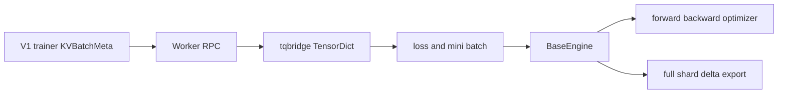

# verl Worker 与 Engine：RPC 粒度、模型语义与后端矩阵

> **代码基准**：verl `main` @ `254a23edc62f25ebfae626e3932ae285d6f86009`（2026-08-28）
> **最后更新**：2026-08-31 · **定位**：Worker/Engine 计算与后端语义唯一机制 owner
>
> **核心结论**：Worker 是 controller 可见的 RPC 和 mini-batch 边界，Engine 才拥有模型、并行布局、optimizer 与权重导出语义。当前后端选择已经是 `model_type × backend × device/vendor`，不是简单的 FSDP/Megatron 二选一；新增 backend 若不能实现 Engine 的训练、checkpoint 与 export 契约，就不能仅靠注册一个 worker 名字完成接入。本页不拥有 Ray dispatch、rollout 服务或 CheckpointEngine wire。

---

## 1. 两层对象解决两个不同问题

`TrainingWorker` 在构造时根据配置创建 `BaseEngine`，并把 actor/critic 等 role 的粗粒度 RPC 暴露给 WorkerGroup（`verl/workers/engine_workers.py:76-163`）。`ActorRolloutRefWorker` 是 actor/ref/rollout 的组合编排层，不是另一个训练后端（`verl/workers/engine_workers.py:451-771`）。

Engine 的接口包含 model forward、optimizer step、数据加载与权重 export 等模型语义（`verl/workers/engine/base.py:99-207`）。所以 ownership 是：

| 层 | 拥有 | 典型变化 |
|---|---|---|
| Worker | RPC、role、mini-batch、loss 调用、TQ bridge | actor/critic/ref 需要哪些字段 |
| Engine | module、parallel mesh、forward/backward、optimizer、checkpoint/export | FSDP、Megatron、TorchTitan、VeOmni |
| rollout adapter | serving engine 与权重安装 | vLLM、SGLang、PD、KV lifecycle |

两层对象的因果分工可以概括为：**Worker 回答“这次 RPC 以哪个训练角色、哪些字段和多大 mini-batch 执行”**，**Engine 回答“这些张量怎样穿过模型并行、反向、optimizer 与参数导出”**。实现上 Worker 在边界准备数据和 loss callable，再调用 `BaseEngine.train_batch`/`infer_batch`；BaseEngine 负责 zero-grad、forward/backward、optimizer step 以及后端特有导出（`verl/workers/engine/base.py:99-207`）。

`【分析推断】` 这样拆分是为了避免 trainer role 与并行 backend 形成实现类的笛卡尔积：actor/critic/ref 的字段和 loss 会变，FSDP/Megatron/TorchTitan 的 mesh 与 checkpoint 也会变；合并后每增加一个 role 或 backend 都可能复制另一维逻辑。代价是两层之间必须维护稳定的 TensorDict/loss/export 契约，问题也可能跨 Worker 数据准备和 Engine 集体通信两个栈追踪。



数据如何在 `KVBatchMeta` 与 TensorDict 间切换见 [[16_verl_v1_transfer_queue_analysis]]；本页只负责计算面。

---

## 2. Engine registry 的真实选择键

`EngineRegistry` 的查询不是单一 `strategy` 字符串。注册与查找同时考虑 model type、backend、device/vendor（`verl/workers/engine/base.py:351-399`）。这让同名 backend 可以对 language/value model 或 CUDA/NPU 提供不同实现，也解释了为什么“删除某套 YAML”不等于设备适配代码全部消失。

选择过程本身也有顺序：先确定 `model_type` 和 `backend`，再读取探测到或由 `VERL_ENGINE_DEVICE` / `VERL_ENGINE_VENDOR` 覆盖的硬件；查找优先 `(device, vendor)`，其次 device-only，CUDA 兼容 vendor 最后可回退到 NVIDIA 注册，否则显式失败（`verl/workers/engine/base.py:398-429`）。**为什么不用一个 backend 字符串**：`【分析推断】` 同一并行策略可能同时存在 language/value 与不同设备实现，单键会发生覆盖或把硬件分支塞进同一个巨型类。多维 registry 的代价是运行环境参与解析；排错必须记录最终 device/vendor，而不能只看 YAML 中的 backend。

实际构造链发生在每个训练 rank 的 `TrainingWorker.__init__` 中：

```text
ActorRolloutRefWorker.init_model
  → TrainingWorker(TrainingWorkerConfig)
      → initialize_global_process_group_ray
      → resolve/auto-select engine_config
      → EngineRegistry.new(model_type, engine_config.strategy, ...)
          → EngineRegistry.get_engine_cls(model_type, backend)
              → get_device_name(); get_vendor()
              → apply VERL_ENGINE_DEVICE / VERL_ENGINE_VENDOR overrides
              → registry[(device, vendor)] ?
              → registry[device] ?
              → if cuda-compatible: registry[("cuda", "nvidia")] ?
              → else ValueError
          → selected_engine_cls(...configs)
      → register train mesh dp_rank/is_collect from Engine
```

`ActorRolloutRefWorker` 把 actor/ref 配置转换成 `TrainingWorkerConfig`，并为 actor 绑定 `ppo_loss` 或蒸馏 loss（`verl/workers/engine_workers.py:538-646`）；内层 worker 读取/自动选择 EngineConfig，调用 registry，并用 Engine 提供的 DP rank 与 MP-source 标志注册 dispatch/collect 信息（`verl/workers/engine_workers.py:83-149`）。注册表自身的 key 写入、查找优先级和失败信息位于 `verl/workers/engine/base.py:339-445`。

| 输入/前态 | 选择动作 | 输出/后态 | 失败边界 |
|---|---|---|---|
| `model_type` 不在 registry | 第一层索引 | 无 | `Unknown model_type` |
| backend 不在该 model type | 第二层索引 | 无 | `Unknown backend` |
| 设备/厂商已探测 | 环境变量可覆盖二者 | 最终 `device/vendor` | 覆盖值错误会参与真实选择，不能靠硬件探测日志推断 |
| 存在 vendor-specific key | 取 `(device, vendor)` | 精确 vendor Engine class | 无 |
| 无 vendor key，但有 device key | 取 `device` | 通用设备 Engine class | 无 |
| CUDA compatible 且有 NVIDIA fallback | 取 `("cuda", "nvidia")` | NVIDIA 注册类 | 只对 CUDA 非 NVIDIA vendor 生效 |
| 都不命中 | 抛出带四维 key 的 `ValueError` | worker 构造失败 | group 无法形成完整 SPMD 角色 |

当前常见组合：

| backend/实现 | model/device 边界 | 关键约束 |
|---|---|---|
| FSDP1/FSDP2 | language/value，CUDA/NPU | 通用 sharded training 与 HF export |
| FSDP Turbo | language model，CUDA/NPU | Turbo 接管 wrap/offload/CP；不能同时开 verl Ulysses |
| TorchTitan | language model，CUDA/NPU | 委托 FSDP2/TP/CP/EP、optimizer/checkpoint；无 PP |
| Megatron/Bridge | language/value | 3D/专家并行；delta 仅 Bridge 且无 LoRA |
| VeOmni | language model | 独立并行实现；delta 不支持 GPT-OSS |
| MindSpeed adapter | Megatron + NPU | 保留 NPU patch/适配，不再是独立 backend 路线 |

FSDP Turbo 注册与 Ulysses guard 在 `verl/workers/engine/fsdp/fsdp_turbo_impl.py:25-70`。TorchTitan 的 backend 注册在 `verl/workers/engine/torchtitan/transformer_impl.py:717`，能力/PP 边界在 `docs/workers/torchtitan_workers.rst:6-71`。MindSpeed NPU classes 仍在 `verl/workers/engine/mindspeed/transformer_impl.py:56-90`。

> [!contradiction] MindSpeed 的精确变化
> 当前删除的是独立 `mindspeed_megatron` / `mindspeed_fsdp` backend、配置与 recipe 路线；以 `backend="megatron", device="npu"` 注册的 MindSpeed 适配类仍存在。把这次清理写成“MindSpeed 全部移除”会错误缩小 NPU 支持面。

---

## 3. Worker 如何消费 V1 数据

V1 controller 传入 `KVBatchMeta`，Worker 方法上的 `tqbridge` 才把引用物化为 TensorDict；返回 TensorDict 时，bridge 校验 batch size 并按 dispatch 规则写回 TQ（`verl/utils/transferqueue_utils.py:347-477`）。

actor loss 从数据中选择 response mask、old log-prob、advantage 与可选 rollout IS/reference log-prob；再按 `loss_mode` 查策略损失，最后叠加 entropy 与 KL（`verl/workers/utils/losses.py:85-142`）。critic loss 使用相同的 global batch 信息，避免 micro-batch/DP 切分改变梯度（`verl/workers/utils/losses.py:147-201`）。

这说明 Worker 并不拥有 advantage 算法；它只消费已写入的数据字段并调用 loss。14 个 advantage estimator 与 12 个 policy loss mode 的 ownership 在 [[15_verl_rl_algorithms_analysis]]。

### 3.1 infer：从 old-log-prob RPC 到模型前向

```text
ActorRolloutRefWorker.compute_log_prob(TensorDict)
  → self.actor.infer_batch(data)
      → add Engine defaults; choose loss_fn only when compute_loss=True
      → Engine.eval_mode(...)
      → optional Engine.disable_adapter()
      → Engine.infer_batch(data, loss_function)
          → torch.no_grad()
          → forward_backward_batch(..., forward_only=True)
      → only Engine.is_mp_src_rank_with_outputs() postprocesses/copies output
  → output.cpu() or None
```

外层 role 跳转位于 `verl/workers/engine_workers.py:699-705`；`TrainingWorker.infer_batch` 的 eval/adapter/MP-source 分支在 `verl/workers/engine_workers.py:396-440`；BaseEngine 用 `torch.no_grad` 调用后端 `forward_backward_batch`（`verl/workers/engine/base.py:134-149`）。**是什么**：它是训练模型在 eval 语义下重算 token log-prob，不是 rollout server 的 generate。**怎么做**：沿同一 actor Engine 的模型并行布局做 forward-only，并只让声明为 collect source 的 rank 返回输出。**为什么**：old/current log-prob 必须与训练模型和 loss 坐标一致；若 controller 收集每个 TP/PP rank 的重复/不完整结果，既浪费带宽也无法按 batch 正确拼接。

### 3.2 train：参数在哪一层真正改变

```text
ActorRolloutRefWorker.update_actor(TensorDict)
  → TrainingWorker.train_mini_batch
      → make_iterator(mini_batch_size_per_gpu, epochs, seed + dp_rank)
      → for each mini_batch:
          → all_gather_object(global_token_num across DP)
          → TrainingWorker.train_batch
              → Engine.train_mode(...)
              → Engine.train_batch(data, loss_fn)
                  → optimizer_zero_grad()
                  → forward_backward_batch(..., forward_only=False)
                      → backend micro-batch forward
                      → loss_fn(model_output, micro_batch)
                      → loss.backward()
                  → optimizer_step()
              → optional lr_scheduler_step on last mini-batch
      → MP source rank aggregates metrics; other ranks return None
```

outer worker、mini-batch/epoch 循环与 rank 输出分支分别位于 `verl/workers/engine_workers.py:707-714,241-338`；Worker 到 Engine 的 train-mode 边界在 `verl/workers/engine_workers.py:340-394`；BaseEngine 把 zero-grad、后端 forward/backward 和 optimizer step 固定成一个 train batch（`verl/workers/engine/base.py:113-132`）。以 FSDP Engine 为例，后端先 all-reduce 全局有效 token 数，再拆 micro-batch；每个 micro-batch 调 loss 后执行 backward，只有最后一个 micro-batch 打开梯度同步（`verl/workers/engine/fsdp/transformer_impl.py:700-753`）。

| 层级 | 输入 | 循环/副作用 owner | 输出 |
|---|---|---|---|
| controller group RPC | `KVBatchMeta` | single-controller/TQ 只 dispatch 与物化 | rank-local TensorDict |
| `train_mini_batch` | 一个 DP shard | Worker 拥有 PPO mini-batch × epoch 循环 | 多次 Engine 更新后的聚合 metrics |
| `Engine.train_batch` | 一个 mini-batch | Engine 拥有 zero-grad、所有 micro-batch backward、一次 optimizer step | grad norm、loss/模型 metrics |
| backend `forward_backward_batch` | micro-batch 列表 | FSDP/Megatron/TorchTitan 等拥有模型并行与梯度同步 | 后端可聚合的 micro-batch outputs |
| MP source return | 所有 rank 已参与 collective | Worker 只在 `is_mp_src_rank_with_outputs()` 为真时构造返回 | controller 可 collect 的唯一结果副本 |

---

## 4. offload：当前不是三个独立配置开关

旧资料常把 param、grad、optimizer 描述成三个对称开关。当前通用 Engine 配置保留 param 与 optimizer offload；独立 `grad_offload` 配置已经删除（`verl/workers/config/engine.py:89-153`）。

Megatron 的 gradient buffer 生命周期现在跟随 `param_offload`，而 Worker/Engine 底层手工搬运 API 仍可带 `grad` 参数（`verl/workers/engine/megatron/transformer_impl.py:197-652`；`verl/workers/engine_workers.py:159`）。所以应区分：

- 用户配置面不再有独立 grad-offload 旋钮；
- 内部 API 仍需要能搬运梯度状态；
- 某 backend 的参数 offload 可能连带决定 gradient buffer 生命周期。

评估 offload 时要同时记录显存、PCIe/HCCS 搬运、optimizer step 时间与 weight publish 的 onload 成本，不能只看峰值显存。

---

## 5. Engine 的权重导出契约

Engine 统一暴露 full、shard 与 delta 相关 export 能力（`verl/workers/engine/base.py:151-207`）。actor Worker 根据 checkpoint backend 分叉：

1. `naive`：本进程导出 full tensors，经 rollout adapter 安装；
2. 非 naive full：把 full tensor generator 交给 CheckpointEngine；
3. `delta_sharded`：把整个训练 Engine 交给 CE，让后端直接提供 shard/delta 语义。

实际出口链是：

```text
CheckpointEngineManager.update_weights
  → actor_wg.update_weights(global_steps, mode)
      → ActorRolloutRefWorker.update_weights
          → effective_mode = explicit mode or configured backend
          ├─ non-naive + delta_sharded
          │    → checkpoint_engine.send_weights(actor.engine, global_steps)
          ├─ non-naive + other
          │    → actor.engine.get_per_tensor_param()
          │    → checkpoint_engine.send_weights(full_tensor_generator, global_steps)
          └─ naive
               → actor.engine.get_per_tensor_param(layered_summon, base_sync_done)
               → rollout.update_weights(generator, peft_config, global_steps)
               → optional actor Engine offload
               → rollout.resume(kv_cache)
```

分叉位于 `verl/workers/engine_workers.py:726-820`。full export 的通用接口返回 HF-keyed tensor generator 与可选 PEFT config；shard export 额外返回位置规格；delta API 则定义最终 HF 坐标中的稀疏变化（`verl/workers/engine/base.py:151-215`）。`delta_sharded` 把整个训练 Engine 交给 CE，是因为 diff base、shard placement 与 lockstep export 属于 Engine/CE 共同协议；它不能退化成“CE 先把模型 full-gather 再 diff”。具体 publication 状态机见 [[21_verl_weight_publication_analysis]]。

| export 分支 | Engine 暴露什么 | 谁消费 | 完成含义 |
|---|---|---|---|
| naive | full tensor generator，可选 PEFT config | colocated rollout adapter | `rollout.update_weights` 与 KV resume 完成后本 replica 可服务 |
| non-naive full | full tensor generator | CheckpointEngine sender | 只说明训练侧已把 full export 交给 CE；全局可见性由 manager 等双方完成 |
| `delta_sharded` | Engine 本身及 shard/delta API | delta CheckpointEngine | CE 驱动 seed/steady snapshot 与传输；不在 worker 先 full-gather |

当前 delta exporter 的源码支持边界：

- FSDP1/FSDP2：`verl/workers/engine/fsdp/transformer_impl.py:895`；
- TorchTitan：`verl/workers/engine/torchtitan/transformer_impl.py:584`，不支持 PP；
- Megatron-Bridge：`verl/workers/engine/megatron/transformer_impl.py:1064-1068`，不支持 vanilla bridge/LoRA；
- VeOmni：`verl/workers/engine/veomni/utils.py:319-323`，不支持 GPT-OSS。

FSDP Turbo 继承 FSDP export 路径在代码上可达，但当前指定文档/测试没有直接证明 production delta 组合，最多标作“源码可达、未验证”，不能提升为已支持矩阵事实。

---

## 6. 后端接入的最小契约

新增 Engine 至少要回答：

```text
model_type and device registration
parallel layout and device mesh
forward and loss inputs
backward and optimizer ownership
micro batch and global normalization
checkpoint save and load
full or shard HF-coordinate export
sleep offload and resume semantics
failure cleanup
```

只跑通 forward 不能证明可用于 RL trainer；actor 还需要反向、optimizer、old/ref log-prob、权重发布和 rollout lifecycle。TorchTitan 之所以是完整 Engine backend，是因为 verl 保留训练循环，但模型并行、optimizer 与 checkpoint 明确委托给 TorchTitan（`docs/workers/torchtitan_workers.rst:6-71`）。

这份契约的定位不是要求所有后端内部同构，而是给 Worker 和 publication/recovery 层一个稳定边界。实现可以把 parallel layout、optimizer 或 checkpoint 委托给外部框架，但必须把 train/infer、保存恢复和 HF 坐标系下的 full/shard export 映射回来。`【分析推断】` 这样设计使 rollout loader 与 CheckpointEngine 不必理解每个训练后端的 shard 布局；否则每加入一个 backend，都要同时修改 Trainer、发布链和恢复链。成本是 backend 接入不再以“模型能 forward”为完成标准，export、sleep/resume 与异常清理也成为兼容性测试的一部分。

---

## 7. 失败边界

- registry key 不完整或冲突会选错 model/device 实现，不能只按类名排查。
- V1 Worker 若漏声明 TQ fields，错误会在物化或 loss 取键时出现，而非 controller 提交时。
- global batch token/sequence 数缺失会破坏或直接阻止并行不变归一化（`verl/trainer/ppo/core_algos.py:1170-1202`）。
- FSDP Turbo 与 verl Ulysses 同开会被构造期拒绝（`verl/workers/engine/fsdp/fsdp_turbo_impl.py:52-70`）。
- TorchTitan PP、Megatron delta LoRA、VeOmni GPT-OSS delta 属于显式不支持组合。
- Engine export 成功不代表 rollout 已完成安装；传输、checksum 与恢复服务属于 CheckpointEngine/loader 边界。

---

## Related Pages

- [[01_verl_architecture_overview_analysis]] —— Worker/Engine 在当前状态 ownership 中的位置。
- [[10_verl_end_to_end_iteration_analysis]] —— 默认 sync trainer 如何调用 Worker。
- [[11_verl_single_controller_analysis]] —— Worker method 被绑定成 Ray group RPC 的控制基座。
- [[15_verl_rl_algorithms_analysis]] —— actor/critic loss 与全局归一化语义。
- [[16_verl_v1_transfer_queue_analysis]] —— `KVBatchMeta` 到 TensorDict 的执行边界。
- [[21_verl_weight_publication_analysis]] —— Engine export 到 CE/loader 的完整发布协议。
- [[23_verl_training_checkpoint_recovery_analysis]] —— Engine checkpoint 如何进入组合恢复状态。
