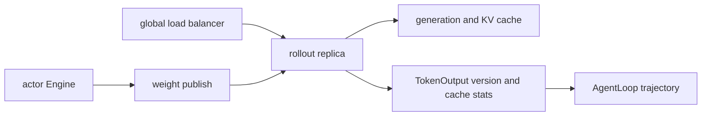
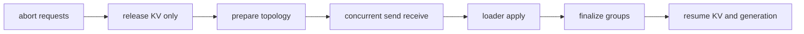

# verl Rollout 生命周期：服务、full 权重刷新与 PD 边界

> **代码基准**：verl `main` @ `254a23edc62f25ebfae626e3932ae285d6f86009`（2026-08-28）
> **最后更新**：2026-08-28 · **系列**：verl RLHF 框架源码级分析（见 [[verl/index]]）
>
> **核心结论**：当前 rollout 面要分清三件事：请求/KV 生命周期、full 权重安装、delta 权重发布。colocated `naive` 可以由 Worker 直接导出 full tensors 并通过 adapter 安装；disaggregated full 由 CheckpointEngine 暂停服务后传输；`delta_sharded` 则有独立的 shard-diff 协议。PD disaggregation 又只拆分 prefill/decode KV 路径，不能与权重 delta 混为一谈。

---

## 1. Rollout 不是一个 `generate_sequences` 函数

V1 AgentLoop 面向的是 LLM server client。prompt 被 fire-and-forget 提交，server 输出 TokenOutput，再由 AgentLoop 转为 trajectory fields/tag 写入 TransferQueue（`verl/trainer/ppo/v1/agent_loop_tq.py:59-148,177-227`）。rollout 层同时承担：

```text
request routing
generation and abort
KV and prefix cache lifecycle
sleep and resume
model version reporting
weight installation
optional prefill decode split
```

因此权重刷新不能只看“参数传过去了没有”，还要确认新请求停止路由、在飞请求处理策略、KV 释放/恢复以及新版本何时对 AgentLoop 可见。



---

## 2. 三条权重刷新路径

actor Worker 在 `verl/workers/engine_workers.py:727-771` 做实际分叉：

| 路径 | 训练侧输入 | 控制面 | rollout 安装 |
|---|---|---|---|
| colocated `naive` | full tensor generator | Worker 本进程 | adapter/IPC loader |
| disaggregated full | full named tensors | CheckpointEngineManager | vLLM/SGLang full loader |
| `delta_sharded` | 训练 Engine 的 shard export | delta CheckpointEngine | SGLang delta loader |

旧版“训练侧 all-gather full tensor，再统一经 CUDA IPC 重分片”的叙述只覆盖第一条的一部分。当前系统已经把请求暂停、传输拓扑、后端 payload 与 loader apply 拆成独立所有权。

`delta_sharded` 的 dense seed、sparse steady state 和支持矩阵由 [[21_verl_delta_weight_sync_deepdive]] 负责，本页不重复 diff 算法。

---

## 3. colocated naive：同池中的 full 安装

`naive` 路径不建立跨进程 CheckpointEngine 拓扑。actor/rollout 同池时，Worker 从训练 Engine 导出 full named tensors，令 rollout resume weights，调用 adapter 更新模型，再恢复 KV/generation（`verl/workers/engine_workers.py:727-771`）。

其优点是控制链短、适合 colocated sync；代价是每次发布都处理 full 参数，并受同池显存接力约束。正确顺序必须包含：

```text
stop or drain generation
release KV if needed
make training weights available
install every tensor on all serving ranks
reset stale cache state
resume generation
```

如果 rollout 在部分 rank 安装完成前就接受新请求，同一 trajectory 可能观察到混合版本。Worker RPC 返回只是控制信号，不能替代 all-rank installation barrier。

---

## 4. disaggregated full：CheckpointEngine 暂停世界

`CheckpointEngineManager` 是 actor 与 rollout replica 之间的控制面 owner；训练侧模型 Engine 与 CE 同进程，rollout 侧 CE Worker 与推理进程分离并通过 loader 接入（`verl/checkpoint_engine/base.py:381-506`）。

full/delta 共用的高层 lifecycle 是：



对应入口在 `verl/checkpoint_engine/base.py:506` 附近。CheckpointEngineWorker 持有 receive transport，并把 `wire_format` 传给 rollout adapter（`verl/checkpoint_engine/base.py:303-354`）。

该设计让 actor 与 rollout 不必在同一 Ray actor 或同一并行 layout，但代价是每次更新需要暂停服务、建/清通信资源，并处理异常后的恢复顺序。

---

## 5. vLLM 与 SGLang 的 payload 边界

vLLM adapter 当前只接收 full `named_tensors`（`verl/workers/rollout/vllm_rollout/vllm_rollout.py:209-225`）。SGLang 除 full 外还有专用 delta loader：每个 TP worker 接收 dense seed 或 sparse positions/values，验证 checksum 后应用（`verl/workers/rollout/sglang_rollout/delta_loader.py:61-72,202-230`）。

因此：

- 选择 vLLM 意味着不能使用 `delta_sharded`；
- 选择 SGLang 也不自动启用 delta，仍取决于 checkpoint backend；
- loader 的 wire format 是 rollout 接口的一部分，不能由训练 Engine 单方面改变。

`delta_sharded` 在启动期被硬限制为 SGLang（`verl/checkpoint_engine/base.py:325-326`）。

---

## 6. PD disaggregation：拆的是 KV 流，不是权重流

vLLM PD replica 支持一组 prefill server 与多个 decode server，并允许两侧使用非对称 TP（`verl/workers/rollout/vllm_rollout/vllm_pd_replica.py:36-59`）。当前限制包括仅 NIXL/Mooncake transport、单节点，以及 DP=PP=1 等 guard（`verl/workers/rollout/vllm_rollout/vllm_pd_replica.py:36-100`）。

PD 的目标是把 prompt prefill 与 autoregressive decode 分离，并搬运 KV；权重仍需通过 full 路径更新到所有参与服务的 replica。SGLang delta 路径显式拒绝 PD 组合（`verl/workers/rollout/sglang_rollout/sglang_rollout.py:384-388`）。所以“支持 PD”不能推出“支持 delta 权重同步”，反之亦然。

---

## 7. sleep、abort 与动态资源切换

同池 trainer/rollout 切换时，要先停止新路由，再 abort 在飞请求，最后 sleep/release KV；恢复时先装权重，再 resume 并重新加入 load balancer。V1 separate async 的 GPU lending 使用 remove → abort → sleep 顺序收回资源（`verl/trainer/ppo/v1/trainer_separate_async.py:339-394`）。

vLLM async server 提供 drain/sleep 与安全回收接口，相关状态在 `verl/workers/rollout/vllm_rollout/vllm_async_server.py:1248-1307`。这些接口只是资源面原语，是否值得切换由 trainer 的库存与成本模型决定；稳定 V1 lending 见 [[17_verl_v1_async_trainer_analysis]]，experimental dynamic schedule 见 [[22_verl_fully_async_dynamic_schedule_deepdive]]。

---

## 8. partial rollout 与版本证据

FullyAsync client 在 abort 后可以携带已生成 token 重试，并记录 trajectory 看到的 `min_global_steps` / `max_global_steps`（`verl/workers/rollout/llm_server.py:383-489`）。这让上层能判断同一 trajectory 是否跨越 policy version，但不会自动决定丢弃、等待或 importance correction；policy 属于 ReplayBuffer/trainer。

最终基线还补齐了 vLLM prefix-cache hit 的可见性：vLLM server 把每个请求的 `num_cached_tokens` 放入 TokenOutput extra fields；FullyAsync client 在 partial-resume 循环中保留第一次 prefill 的值（`verl/workers/rollout/vllm_rollout/vllm_async_server.py:647-690`；`verl/workers/rollout/llm_server.py:406-486`）。这修复的是观测语义，不改变 cache eviction 或调度策略。

---

## 9. 非事务失败边界

- CheckpointEngineManager 的更新序列没有覆盖整个 send/apply/finalize 的事务回滚；中途异常可能遗留 aborted generation、已释放 KV 或未 finalize group——这是由控制流作出的【推断】（`verl/checkpoint_engine/base.py:506-590`）。
- naive full 路径依赖同池 IPC/adapter；跨节点或不同 layout 不能因“named tensors”接口相同就假设零拷贝兼容。
- vLLM 只接 full；SGLang delta 只支持指定 dtype/backend/模式，量化、PD 等组合需要显式 guard。
- prefix-cache hit 统计来自初始 prefill；它不是整个 partial trajectory 所有 resume 次数的累加值（`verl/workers/rollout/llm_server.py:406-486`）。
- abort 后是否保留 partial token、是否重试、是否跨版本可训练由 client/trainer config 共同决定。
- loader checksum 能发现传输/应用不一致，但不能证明上层选择了正确的 actor version。

---

## Related Pages

- [[10_verl_end_to_end_iteration_analysis]] —— 默认 sync 中 rollout 的阶段位置
- [[13_verl_workers_engine_analysis]] —— 训练 Engine 与 export ownership
- [[17_verl_v1_async_trainer_analysis]] —— sleep/resume、partial rollout 与 GPU lending
- [[21_verl_delta_weight_sync_deepdive]] —— `delta_sharded` 的完整状态机
- [[22_verl_fully_async_dynamic_schedule_deepdive]] —— experimental rebalance 与动态资源
- [[verl/index]] —— 系列导航
