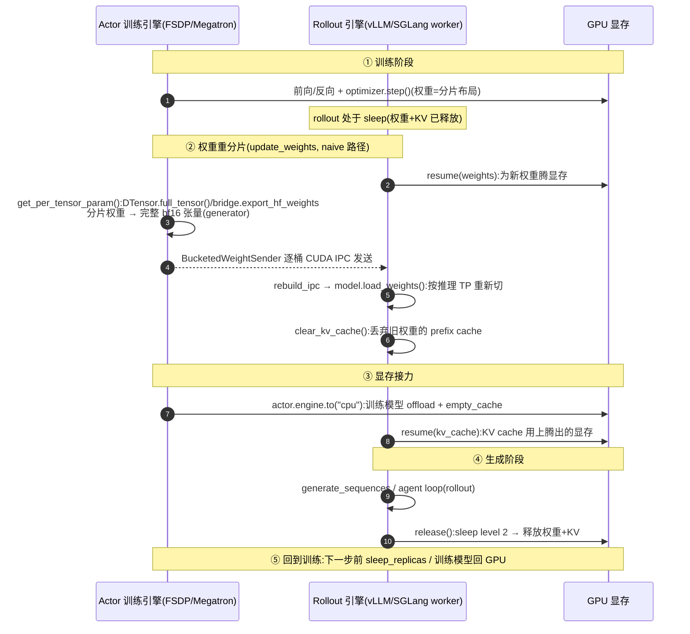

# verl Rollout 与 3D-HybridEngine —— 训练↔生成的权重重分片

> **代码基准**:verl `main` @ `8a694930`
> **最后更新**:2026-06-22 · **系列**:verl RLHF 框架源码级分析(见 [[verl/index]])
>
> RLHF 的一次迭代 = **生成(rollout)→ 打分 → 训练**。生成阶段需要一个快推理引擎(vLLM/SGLang),训练阶段需要分布式训练后端(FSDP/Megatron)。当二者**共用同一批 GPU** 时,actor 权重必须在两种 sharding 之间来回搬运、显存交替占用——这就是 verl 的招牌优化 **3D-HybridEngine**。本文沿源码追这条链:`generate_sequences` 契约 → vLLM/SGLang 后端 → `get_per_tensor_param` 训练侧重分片 → CUDA IPC / NCCL 传输 → 推理侧 `load_weights` 重排 → sleep/wake 显存回收。
>
> 行号约定:以内层包 `verl/` 为根,如 `workers/rollout/base.py:71`。

> [!note] 本页基线 verl `8a694930`;端到端迭代以 [[10_verl_end_to_end_iteration_analysis]](基线 `983cb0f`)为准,两基线间机制差异以新基线页为先。

---

## 1. 功能范围与定位

verl 是 **HybridFlow** 论文的开源实现(`README.md:26`),其头号卖点写在特性列表里:

> **Efficient actor model resharding with 3D-HybridEngine**: Eliminates memory redundancy and significantly reduces communication overhead during transitions between training and generation phases.(`README.md:42`)

问题的本质:**同一个 actor 模型,在训练和生成两阶段需要完全不同的并行布局**。

| 阶段 | 后端 | 典型 sharding | 关注点 |
|------|------|--------------|--------|
| **训练(train)** | FSDP / Megatron | 逐参数分片(DTensor)/ TP×PP×DP 切分 | 显存放得下优化器状态 + 梯度 |
| **生成(generate)** | vLLM / SGLang | 纯 TP(pp 当作额外 dp) | 吞吐、KV cache 利用率 |

如果训练和生成各占一套 GPU(disaggregated),没有重分片问题,但 GPU 利用率低(生成时训练卡闲置,反之亦然)。verl 的 **hybrid/colocated** 模式把两者塞进**同一批 GPU**,于是每一步必须:

1. 训练前向/反向 + 优化器更新(权重在 FSDP/Megatron 布局)。
2. 把更新后的权重**收集成完整张量、重排成推理 TP 布局**,灌进 vLLM/SGLang。
3. 训练侧显存(优化器/梯度)offload 到 CPU,生成侧 KV cache 唤醒。
4. 生成 rollout;生成完释放 KV cache,训练侧权重/优化器回到 GPU。

vllm_rollout 文件头的 docstring 把这套权重路径说得很直白(`workers/rollout/vllm_rollout/vllm_rollout.py:14-27`):

```python
# When working with FSDP:
# - Utilize state_dict from the FSDP to synchronize the weights among tp ranks in vLLM
# When working with Megatron:
# - Before inference, broadcast the parameters of the current pp rank to all other pp ranks
# - Do inference in tp. pp is treated as additional dp
# - After inference, all the parameters that doesn't belong to this pp rank is freed.
```

> **与 HybridFlow 论文的对应**:论文中的 "3D-HybridEngine" 指在 train 的 `(p,t,d)` 与 generate 的 `(p_g,t_g,d_g)` 两套三维并行之间做 zero-redundancy 的权重 resharding。本文档分析的 `main @ 8a694930` 代码里,这套机制被拆成两段:**训练侧** `get_per_tensor_param` 负责把分片权重 all-gather 成完整张量(§5),**推理侧** `model.load_weights` 负责按推理 TP 重新切(§3);中间通过 CUDA IPC bucket(同卡)或 NCCL/NIXL(跨卡)搬运。

---

## 2. Rollout 抽象:`BaseRollout` 与契约

所有 rollout 后端实现 `BaseRollout`(`workers/rollout/base.py:29`),它定义了 hybrid engine 必须支持的四个生命周期方法:

```python
# workers/rollout/base.py:44-69
@abstractmethod
async def resume(self, tags: list[str]):      # 把 weights / kv_cache 装回显存
@abstractmethod
async def update_weights(self, weights, **kwargs):  # 灌新权重(generator 产出 (name, tensor))
@abstractmethod
async def release(self):                       # 释放 weights + kv_cache
def generate_sequences(self, prompts: DataProto) -> DataProto:  # 同步批量生成
```

- **输入/输出契约**:`generate_sequences` 收 `DataProto`(见 [[12_verl_dataproto_analysis]]),返回 `DataProto`。HF 基线返回 `prompts/responses/input_ids/attention_mask/position_ids`(`workers/rollout/hf_rollout.py:162-171`),naive 基线额外返回 `old_log_probs`(`workers/rollout/naive/naive_rollout.py:106-116`)。
- `update_weights` 的 `weights` 是一个 **generator**(`Generator[tuple[str, torch.Tensor]]`),逐张量产出——这是 zero-redundancy 的关键:不一次性物化整模型(`base.py:53-63`)。

**注册表**:`base.py:83` 的 `_ROLLOUT_REGISTRY` 只登记 **async server 模式**的 client adapter:

```python
# workers/rollout/base.py:83-87
_ROLLOUT_REGISTRY = {
    ("vllm", "async"):  "verl.workers.rollout.vllm_rollout.ServerAdapter",
    ("sglang", "async"): "verl.workers.rollout.sglang_rollout.sglang_rollout.ServerAdapter",
    ("trtllm", "async"): "verl.workers.rollout.trtllm_rollout.trtllm_rollout.ServerAdapter",
}
```

`get_rollout_class(name, mode)`(`base.py:90`)按 `(name, mode)` 动态 import。注意 **SPMD 同步模式已在 PR #4411 退役**:`ServerAdapter.generate_sequences` 直接抛 `NotImplementedError`,生成统一走 async server(`workers/rollout/vllm_rollout/vllm_rollout.py:206-222`)。

### 2.1 两个基线(教学/单卡用途)

- **HFRollout**(`workers/rollout/hf_rollout.py:39`):直接用 HuggingFace `module.generate`。FSDP 包裹时用 `FSDP.summon_full_params(self.module, writeback=False, recurse=False)` 临时把完整参数 all-gather 回来再生成(`hf_rollout.py:108-110`)——这其实就是一次"手动 resharding",但代价高、会 hang(文件头 TODO 自陈),仅作 baseline。
- **NaiveRollout**(`workers/rollout/naive/naive_rollout.py:36`):纯 PyTorch 逐 token autoregressive 采样(`naive_rollout.py:68` 循环 `response_length` 次),用于验证正确性,无任何推理优化。

生产路径是 vLLM 和 SGLang。

---

## 3. vLLM 集成:`ServerAdapter` + `vLLMHttpServer`

### 3.1 引擎构造

vLLM 以 **AsyncLLM**(v1 引擎)运行在独立 Ray actor `vLLMHttpServer` 里(`workers/rollout/vllm_rollout/vllm_async_server.py:86`),通过 `AsyncLLM.from_vllm_config(...)` 构造(`vllm_async_server.py:403`)。关键引擎参数(`vllm_async_server.py:258-283`):

```python
args = {
    "enable_sleep_mode": self.config.enable_sleep_mode,   # 允许 sleep/wake 释放显存
    "gpu_memory_utilization": self.config.gpu_memory_utilization,
    "tensor_parallel_size": self.config.tensor_model_parallel_size,
    "worker_extension_cls": self._get_worker_extension_cls(),  # 注入 IPC 收权重逻辑
    "distributed_executor_backend": "mp", ...
}
```

`worker_extension_cls` 是重点:它把 verl 的 `vLLMColocateWorkerExtension`(`workers/rollout/vllm_rollout/utils.py:138`)注入到每个 vLLM worker 子进程,从而让 vLLM 的内部 worker 具备"从 IPC 收权重"的能力(§3.3)。

### 3.2 sampling / sleep / wake

`ServerAdapter`(`vllm_rollout.py:61`)是 client 侧 thin adapter,通过 Ray `collective_rpc` 调远端 server 方法(`vllm_rollout.py:152`)。三个生命周期:

- `resume(tags)`(`vllm_rollout.py:155`)→ `server.wake_up(tags=tags)`,把 weights/kv_cache 装回显存。
- `release()`(`vllm_rollout.py:164`)→ `server.sleep()`。
- server 侧 `wake_up`(`vllm_async_server.py:618`)/`sleep`(`:639`)按 `RolloutMode` 分派;hybrid 模式 sleep 走 `_sleep_hybrid`(`:951`)。

**sleep level 决定释放粒度**(`third_party/vllm/__init__.py:33,48-49`):vLLM ≥ 0.8.5 → `VLLM_SLEEP_LEVEL=2`(同时释放权重和 KV cache),否则 `=1`(只释放 KV cache,权重留驻)。`_sleep_hybrid` 在 LoRA-adapter / MTP / NPU 场景强制 level 1,否则 level 2(`vllm_async_server.py:970-974`)。`ServerAdapter.__init__` 也会在 `layered_summon` 或 EP>1 且 vLLM 旧版时降到 level 1,并警告可能 OOM(`vllm_rollout.py:91-95`)。

> level 2 才能把模型权重也从显存赶出去,给训练阶段的优化器/梯度腾地方——这是"消除显存冗余"的物理前提。

### 3.3 权重更新路径:CUDA IPC bucket

`ServerAdapter.update_weights`(`vllm_rollout.py:169`)是同卡 colocate 的核心。它**不走网络**,而是 CUDA IPC(同卡进程间零拷贝共享显存),IPC 不支持时回退共享内存(`vllm_rollout.py:110-117`)。流程:

```python
# workers/rollout/vllm_rollout/vllm_rollout.py:176-188
future = await self._execute_method("update_weights_from_ipc", non_block=True,
                                     kwargs={**kwargs, "use_shm": self.use_shm})  # 远端 worker 起 receiver
sender = BucketedWeightSender(zmq_handle=self.zmq_handle,
                              bucket_size_mb=bucket_size_mb, use_shm=self.use_shm)
await sender.async_send_weights(weights)   # 本进程把权重打包发送
```

**发送侧** `BucketedWeightSender`(`workers/rollout/vllm_rollout/bucketed_weight_transfer.py:74`):
- 分配一个固定大小通信 buffer,`reduce_tensor(buffer)` 拿到 IPC handle 发给接收方(`bucketed_weight_transfer.py:172-178`)。
- 逐张量 `copy_` 进 buffer,攒满一个 bucket 就 `socket.send_pyobj({"bucket_meta", "is_last"})`,等接收方 `recv()` 确认(`:129-157`)。这是 ZMQ REQ/REP 流控,确保接收方处理完才发下一桶。
- 超过单桶大小的巨张量(如融合 MoE 权重)走 `_direct_send_large_weight`,直接对该张量 `reduce_tensor` 发 IPC handle,不经 buffer(`:136-141, 216-230`)。

**接收侧** `BucketedWeightReceiver`(`bucketed_weight_transfer.py:233`),由 vLLM worker 的 `update_weights_from_ipc` 驱动(`workers/rollout/vllm_rollout/utils.py:229`):
- `rebuild_ipc(handle, device.index)` 把发送方的显存映射进本进程,**关键是改 device id**——两进程 `CUDA_VISIBLE_DEVICES` 可能不同(`bucketed_weight_transfer.py:45-53`)。
- 每收到一桶,callback 调 `_update_weights`(`utils.py:306`),最终 `model.load_weights(param_updates)`(`utils.py:336-338`)——**这就是推理侧重分片发生的地方**:vLLM 的 `load_weights` 按 vLLM 自己的 TP 布局把完整张量重新切给各 TP rank。buffer/参数分流由 `split_buffer_updates` / `apply_buffer_updates` 处理(`workers/rollout/vllm_rollout/weight_update_utils.py:20,38`)。
- 所有桶收完后调一次 `process_weights_after_loading`(非幂等的后处理,如量化打包)(`utils.py:287-292`)。

更新完权重后,client 侧 `clear_kv_cache`(丢弃用旧权重算出的 prefix cache,`vllm_rollout.py:194-195`;server 侧 `vllm_async_server.py:650`)。

> **ZMQ handle 防撞**:IPC socket 路径用 `ipc:///tmp/rl-colocate-zmq-{job_id}-replica-{replica_rank}-rank-{local_rank}.sock`(`vllm_rollout.py:106-108`)。刻意带上 Ray **job id**(两个 verl job 同主机不撞、崩溃残留 socket 不撞)、`replica_rank`(同节点多 replica 不撞),并用 **node-local rank**(而非 rollout_rank)以匹配 vLLM worker 在每个节点上的 `local_rank`。接收侧 `_get_zmq_handle`(`workers/rollout/vllm_rollout/utils.py:345-355`)用同一套规则反推,且对 DP>1 用 `_resolve_vllm_weight_sync_local_rank` 把 `dp_local_rank*tp_size + tp_rank` 映回去——错一位就连不上对面的 buffer。

---

### 3.4 那么生成到底怎么触发?

既然 `ServerAdapter.generate_sequences` 直接抛 `NotImplementedError`(§2),async 模式下真正的生成走 **server 端 token-in-token-out 接口**:trainer 侧由 `LLMServerManager` / `LLMServerClient.generate`(`workers/rollout/llm_server.py:330,182`)把 prompt 异步派发给各 replica 的 HTTP/RPC server,server 内部用 vLLM `AsyncLLM` 或 SGLang engine 真正解码,结果以 `TokenOutput`(§4)回流。`FullyAsyncLLMServerClient.generate`(`llm_server.py:234`)进一步支持全异步 / agent loop 多轮。换言之:**`BaseRollout` 这一层只管"权重/显存生命周期"(resume/update_weights/release),"生成"这件事被上移到了 server + manager 层**——这正是 SPMD 退役后(PR #4411)的架构走向。

---

## 4. SGLang 集成:server-based、async、multi-turn

SGLang 后端的 `ServerAdapter`(`workers/rollout/sglang_rollout/sglang_rollout.py:103`)与 vLLM 形态不同:它是一个 **HTTP client**,通过 `AsyncHttpServerAdapter`(`workers/rollout/sglang_rollout/http_server_engine.py:570`)向独立运行的 SGLang HTTP server 发请求。

- **生命周期**:`resume`/`release` 走 HTTP `resume_memory_occupation` / `release_memory_occupation`(`sglang_rollout.py:266,278`;server 端 `http_server_engine.py:533,545,718,730`)。`release` 同样按 `sleep_level` 决定 tags:level 1 只放 KV cache,level 2 连权重一起放(`sglang_rollout.py:289-293`)。
- **权重更新**:`update_weights`(`sglang_rollout.py:295`)用 `get_named_tensor_buckets` 把权重分桶(`workers/rollout/sglang_rollout/utils.py:92`),逐桶 `sgl_update_weights(..., device_mesh_key="infer_tp")` 发给 server 的 `update_weights_from_tensor`(`http_server_engine.py:348,745`)。分桶时 `_compact_for_bucket` 会判断:`DTensor.full_tensor()` 已是紧致存储就**跳过 clone**,避免多 GiB MoE 权重 OOM(`utils.py:74-89`)。
- **关键约束**:**所有 rank 都必须遍历 weights generator**,即使只有 infer_tp rank 0 真正发 HTTP——因为 `DTensor.full_tensor()` 是 FSDP 组内 all-gather,某个 rank 跳过会让其余 rank 死锁(`sglang_rollout.py:311-313`)。

**server 抽象**(被 vLLM 和 SGLang 共用的上层):
- `RolloutReplica`(`workers/rollout/replica.py:70`)= 一个 server 实例(可跨多节点),封装 `init_hybrid` / `init_colocated` / `init_standalone` 三种部署(`replica.py:131,160,189`),对应 `RolloutMode.{HYBRID, COLOCATED, STANDALONE}`(`replica.py:54-67`)。`RolloutReplicaRegistry`(`replica.py:302`)注册 vllm/sglang/trtllm 三种实现。
- `LLMServerClient` / `FullyAsyncLLMServerClient` / `LLMServerManager`(`workers/rollout/llm_server.py:148,228,330`)在 single-controller 之上做负载均衡(`GlobalRequestLoadBalancer`,`llm_server.py:46`)与 OpenAI-compatible 分发,支撑 **multi-turn / agent loop**(SGLang 的强项)。
- **token-in-token-out 输出 schema**:`TokenOutput`(`workers/rollout/replica.py:39-51`)统一 server 返回结构——`token_ids` / `log_probs` / `routed_experts`(MoE)/ `stop_reason`(`completed`/`aborted`)/ `num_preempted`(被抢占次数,供 partial rollout 指标统计)。`schemas.py` 定义更完整的请求/响应结构。`stop_reason="aborted"` 正是 §5.2 路径 B `abort_replicas` 中止请求时打的标记。

---

## 5. 权重重分片机制(核心)

整条链分**两个半场**:训练侧把分片权重收成完整张量(§5.1),传输+推理侧重新切(§3.3 已讲)。中间的搬运由 **CheckpointEngine** 抽象统一(§5.2)。

### 5.1 训练侧:`get_per_tensor_param`

这是把 FSDP/Megatron 分片权重**重排成"完整 per-tensor 流"**的入口,各训练后端各自实现。

**FSDP**(`workers/rollout/engine` → `workers/engine/fsdp/transformer_impl.py:817`):

```python
# workers/engine/fsdp/transformer_impl.py:847-869(节选)
params = self.module.state_dict()
params = convert_weight_keys(params, ...)
...
per_tensor_param = (
    (name,
     param.to(device, non_blocking=True).full_tensor().to(torch.bfloat16)  # DTensor → 完整张量 → bf16
     if isinstance(param, DTensor) else param)
    for name, param in params.items()
)
```

要点:对每个 `DTensor` 参数调 `.full_tensor()`,在 FSDP mesh 上 **all-gather** 出完整权重,再 cast 成 bf16 降低传输量(fp32 的 MoE gate 等会保留精度,故不强制 cast,见 `bucketed_weight_transfer.py:120-126` 注释)。整个返回值是 **generator**——逐张量产出,产出一个传一个,避免同时物化整模型。

**Megatron**(`workers/engine/megatron/transformer_impl.py:724`):

```python
# workers/engine/megatron/transformer_impl.py:731-741(节选)
load_megatron_model_to_gpu(self.module, load_grad=False, ...)
per_tensor_param = self.bridge.export_hf_weights(self.module)  # TP/PP 分片 → HF-keyed 完整权重
```

Megatron 通过 `bridge.export_hf_weights` 把 TP×PP 的 mcore 切分**反算回 HF 命名的完整权重**——这一步同时完成 pp 维度的聚合(各 pp stage 持有不同层)和 tp 维度的拼接,对齐 docstring 里"broadcast pp rank params, do inference in tp"的描述(§1)。

### 5.2 搬运:CheckpointEngine 与两条路径

`CheckpointEngine`(`checkpoint_engine/base.py:96`)是"把权重从 actor 搬到 rollout"的抽象,有 `naive`(同卡)、`nccl`/`nixl`/`mooncake`/`hccl`/`kimi`(跨卡)等后端。调度器是 **CheckpointEngineManager**(`base.py:345`),其 docstring 画出了拓扑:每个 actor 的 ModelEngine(ME)旁挂一个 CheckpointEngine(CE),通过 nccl/nixl 把权重送到各 Replica 的 CE,最后一跳 **CUDA IPC** 灌进 vLLM/SGLang worker(`base.py:354-366`)。

`CheckpointEngineManager.update_weights`(`base.py:469`)分两条路径:

**路径 A —— `naive`(同卡 hybrid,on-policy 主路径)**(`base.py:478-480`):直接调 `actor_wg.update_weights(mode="naive")`,即下面 §5.3 的 in-process 同步,不建额外 process group。

**路径 B —— checkpoint engine(disaggregated/跨卡)**(`base.py:482-514`):
1. `abort_replicas()` —— partial rollout:中止并保存未完成请求(`:483`)。
2. `release_kv_cache_replicas()` —— 只释放 KV cache,**权重 buffer 留在原地**,让 NCCL 直接写进去(`:493`,注释见 `:451-460`)。
3. `build_process_group(rollout)` —— actor_wg + rollout 一起 `prepare` → `build_topology` → `init_process_group`(`:496`,实现 `base.py:387-412`)。
4. `actor_wg.update_weights(mode=backend)`(触发 `send_weights`)`+ rollout.update_weights`(触发 `receive_weights`)成对执行(`:499-502`)。
5. `finalize`(释放通信 buffer / 销毁 PG)(`:505`)→ `resume_kv_cache_replicas`(`:511`)→ `resume_generation_replicas`(恢复 partial rollout 的请求,`:514`)。

rollout 侧的 `receive_weights` 由 `CheckpointEngineWorker.update_weights`(`base.py:322-325`)驱动:`checkpoint_engine.receive_weights()` 产出权重 generator,喂给 `server_adapter.update_weights()`——又回到 §3.3 的 IPC 灌权重。`split_weight_chunks` / `merge_weight_chunks`(`base.py:517,546`)处理超大张量的分块/重组。

注意两个 worker 的归属差异(`base.py:278-308`):`CheckpointEngineWorker` 与 vLLM/SGLang 的推理 worker **同卡但不同进程**(它持有 `server_adapter` 这个 client),而 actor 侧的 `CheckpointEngine` 与 ModelEngine **同进程**(`engine_workers.py:622-632` 在 actor 角色里直接实例化 checkpoint engine)。这就是为什么"最后一跳必然是 IPC":actor 进程产权重 → CE 跨卡送到 rollout 节点的 CE 进程 → 再 IPC 进同卡的推理 worker 进程。

- **`naive` 后端**(`ColocatedCheckpointEngine`,`base.py:220`):actor 与 rollout 同卡,`send_weights` 只是把 generator 存下来(`base.py:249-260`),`receive_weights` 原样 `yield from`(`:262-275`)——真正搬运全靠 §3.3 的 IPC bucket,checkpoint engine 退化成一个 pass-through。
- **`CheckpointEngineWithCache`**(`base.py:203`,Laminar [arxiv 2510.12633]):带 shm/disk 本地缓存的变体,额外暴露 `get_weights()`(`:210-217`)。它支持**不打断进行中请求**地同步权重(partial rollout):新权重先落本地缓存,等当前请求耗尽后 rollout 再从缓存取——这与 §5.2 路径 B 的 `abort_replicas` / `resume_generation_replicas` 配合,是 verl 做 partial/async rollout 的基础设施。

### 5.3 in-process 同步:`ActorRolloutRefWorker.update_weights`(naive 路径全景)

这是 on-policy hybrid engine 一步里**真正调度显存交替**的函数(`workers/engine_workers.py:669`):

```python
# workers/engine_workers.py:705-746(节选,naive 分支)
set_expandable_segments(False)
# 1. 唤醒 rollout 权重显存(sleep 时已释放)
if self.config.rollout.free_cache_engine:
    await self.rollout.resume(tags=["weights"])
# 2. 训练侧重分片:分片权重 → 完整 per-tensor 流
per_tensor_param, peft_config = self.actor.engine.get_per_tensor_param(layered_summon=..., base_sync_done=True)
# 3. 灌进 rollout(IPC bucket → vLLM load_weights)
await self.rollout.update_weights(per_tensor_param, peft_config=..., global_steps=global_steps)
# 4. 训练模型 offload 到 CPU,腾显存
if self.actor.engine.is_param_offload_enabled:
    self.actor.engine.to("cpu", model=True, optimizer=False, grad=False)
aggressive_empty_cache(force_sync=True)
# 5. 唤醒 KV cache
if self.config.rollout.free_cache_engine:
    await self.rollout.resume(tags=["kv_cache"])
set_expandable_segments(True)
```

注意 **resume 顺序**:先 `resume(weights)`(给灌权重腾位)→ 灌权重 → offload 训练模型 → 再 `resume(kv_cache)`。把 KV cache 的唤醒放到训练模型 offload **之后**,是为了让 KV cache 用上训练腾出来的显存——典型的显存接力。`set_expandable_segments(False)` 在权重搬运期间关闭 PyTorch 可扩展显存段,避免碎片(`engine_workers.py:705,749`)。

> async/disaggregated 分支更简单(`engine_workers.py:700-703`):只 `checkpoint_engine.send_weights(per_tensor_param)`,不在本进程做 resume/offload——因为生成在别的卡上,不抢显存。

### 5.4 训练侧的 Ulysses 序列并行 sharding manager

权重重分片之外,训练侧还有一个**数据/上下文重分片**的 sharding manager:`FSDPUlyssesShardingManager`(`utils/ulysses.py:363`,基类 `BaseShardingManager` 在 `:344`)。它在 FSDP + Ulysses 序列并行(SP)下做数据 resharding:

```python
# utils/ulysses.py:382-404(节选)
def preprocess_data(self, data):   # 进 SP 区:沿 SP 组 all-gather,使同一 SP 组看到相同数据
    all_gather_data_proto(data=data, process_group=self.device_mesh["sp"].get_group())
def postprocess_data(self, data):  # 出 SP 区:按 SP rank chunk 回 FSDP 分区
    data = data.chunk(chunks=sp_size)[sp_rank]
```

`__enter__/__exit__` 切换全局 SP 进程组(`ulysses.py:373-380`)。这与权重重分片正交——它解决的是"FSDP 沿 DP 切数据、Ulysses 要求 SP 组内数据一致"的矛盾(见 [[13_verl_workers_engine_analysis]]),不是 train↔generate 的权重搬运。

---

## 6. 阶段切换时序

一步迭代里 colocated hybrid 的显存/计算时间线(由 `trainer/ppo/ray_trainer.py:1645-1672` 驱动:`update_actor` → `marked_timer("update_weights")` → `checkpoint_manager.update_weights`):



### 经济性(为何能"消除冗余 + 降通信")

设模型参数量 $P$、训练并行宽度 $N_t$、生成 TP 宽度 $N_g$,共用同一批 $N=N_t$ 张卡。

- **显存冗余消除**:disaggregated 方案下,生成引擎要常驻一份完整模型权重 $P$,与训练权重 $P$ + 优化器/梯度 $O$ **同时占显存**。hybrid 通过 sleep level 2 让生成权重与训练状态**分时复用**同一块显存:峰值 $\approx \max(P+O,\ P_{\text{infer}}+\text{KV})$ 而非二者之和。这正是 README 所谓 "eliminates memory redundancy"(`README.md:42`)。
- **通信量**:权重搬运是同卡 **CUDA IPC**(零拷贝映射显存,`bucketed_weight_transfer.py:45`),近乎不走带宽;跨卡才用 NCCL/NIXL。对比"把权重落盘再加载"或"全量 broadcast",IPC + 逐桶 generator 把额外通信压到接近 $0$(同卡)或一次 $O(P/N_g)$ 的 collective(跨卡分块)。
- **bf16 减半**:`get_per_tensor_param` 把 fp32 权重 cast 成 bf16 再传(`fsdp/transformer_impl.py:864`),传输量 $P\cdot 2\text{B}$ 而非 $4\text{B}$;MoE gate 等敏感参数保留 fp32(选择性)。

**一个 7B 模型的显存账(单卡视角,Adam,bf16 训练)**:权重 $P_{\text{bf16}}=14\text{GB}$,fp32 master + Adam 一二阶矩 $O\approx 6P=84\text{GB}$,梯度 bf16 $\approx 14\text{GB}$。FSDP 在 $N$ 卡上把这些都切 $1/N$。生成侧 vLLM 需常驻权重 $P_{\text{bf16}}=14\text{GB}$ 再加 KV cache。

- **disaggregated**(两套卡):训练卡峰值 $\frac{P+O+G}{N}$,生成卡另算 $P+\text{KV}$,模型权重被存了**两份**。
- **hybrid colocated**(本文):同一卡上,生成期把训练态 offload 到 CPU(`engine_workers.py:740`),训练期把生成权重 sleep level 2 释放(`vllm_async_server.py:974`),峰值近似

$$\text{Peak} \approx \max\!\left(\frac{P+O+G}{N}\ ,\ P_{\text{bf16}}+\text{KV}\right)$$

而非两者相加。代价是每步一次 $P_{\text{bf16}}$ 量级的 IPC 搬运($14\text{GB}$,bf16 已减半),同卡近零带宽。

> 源码/README 未给出具体加速倍数(`8a694930` 基线),上述为机制层面的定量框架;HybridFlow 论文(`arxiv 2409.19256`)报告的端到端吞吐提升应以论文为准。

---

## 7. Rollout 后端对照表

| 后端 | server 模型 | 权重同步方法 | KV/权重显存释放 | multi-turn / agent |
|------|------------|-------------|----------------|--------------------|
| **HFRollout** | 无(进程内 `module.generate`) | `FSDP.summon_full_params`(临时 all-gather) | 无 sleep,生成后 `empty_cache` | 否(baseline) |
| **NaiveRollout** | 无(进程内逐 token) | 共享同一 `module`,无搬运 | 无 | 否(baseline) |
| **vLLM** | async,Ray actor `vLLMHttpServer` + `AsyncLLM` | **CUDA IPC bucket**:`BucketedWeightSender`→`update_weights_from_ipc`→`model.load_weights` | sleep level 2 释放权重+KV;level 1 仅 KV | 经 agent loop / `LLMServerClient` 支持 |
| **SGLang** | async,独立 HTTP server | **HTTP tensor**:`get_named_tensor_buckets`→`update_weights_from_tensor`(底层 IPC handle) | `release/resume_memory_occupation`,tags 按 sleep_level | 是(SGLang 强项,server-based 原生多轮) |
| **TRT-LLM** | async,`trtllm_rollout.ServerAdapter` | 复用 IPC bucket 路径 | 同 vLLM | 经 server 支持 |

跨后端统一的搬运抽象是 **CheckpointEngine**:`naive`(同卡 IPC)走 §5.3,`nccl/nixl/...`(跨卡)走 §5.2 路径 B。

---

## Related Pages

- [[verl/index]] —— verl 系列总入口与知识地图
- [[01_verl_architecture_overview_analysis]] —— hybrid/colocated/standalone 整体架构,本页是其"权重搬运"子系统
- [[20_verl_ray_trainer_analysis]] —— PPO 主循环如何调度 `update_weights` / `sleep_replicas`(`ray_trainer.py:1645-1672`)
- [[13_verl_workers_engine_analysis]] —— `ActorRolloutRefWorker` / TrainingWorker / `get_per_tensor_param` 训练引擎侧细节
- [[11_verl_single_controller_analysis]] —— `RayWorkerGroup` / Dispatch 如何把 `update_weights` 派发到各 worker
- [[12_verl_dataproto_analysis]] —— `generate_sequences` 的 `DataProto` 输入/输出契约
- [[30_verl_optimization_analysis]] —— sleep/wake、offload、IPC、bucket 等显存/通信优化合集
- [[11_torchtitan_fsdp_analysis]] —— FSDP2 逐参数分片与 `DTensor.full_tensor()`,即训练侧重分片的底层机制
- [[megatron-lm/index]] —— Megatron TP/PP 切分,`bridge.export_hf_weights` 反算的来源
