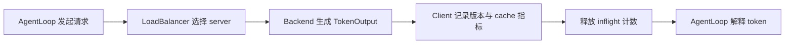

# verl Rollout Runtime：请求、KV、服务切换与 PD

> **代码基准**：verl `main` @ `254a23edc62f25ebfae626e3932ae285d6f86009`（2026-08-28）
> **最后更新**：2026-08-31 · **定位**：rollout 请求/KV/服务状态唯一机制 owner
>
> **核心结论**：rollout runtime 拥有的是请求路由、在飞生成、KV/prefix cache、sleep/wake、abort/resume
> 和 model-visible version。AgentLoop 只消费它的 `TokenOutput`；CheckpointEngine 只在一次外部 publication
> 会话中要求它暂停、释放 KV、安装权重再恢复。PD disaggregation 拆分 prefill/decode 的 KV 路径，
> 与 full/delta 权重发布不是同一种“分片”。

---

## 1. 四个对象分担服务状态

| 对象 | 拥有的状态 | 不拥有的状态 |
|---|---|---|
| `GlobalRequestLoadBalancer` | server 集合、inflight count、sticky request 映射 | token、KV、模型权重 |
| `LLMServerClient` | 一次请求的 acquire/release、retry、版本 span | agent 对话与工具状态 |
| `LLMServerManager` / `RolloutReplica` | replicas、server 初始化、全局 load balancer | Trainer step、ReplayBuffer |
| backend server/adapter | generation、KV/prefix cache、sleep、实际模型写入 | actor shard 如何导出和传输 |

load balancer 以最少 inflight 为基础分配 server，并用 request id 保持 sticky session；它支持动态
add/remove servers 和清 sticky cache（`verl/workers/rollout/llm_server.py:46-192`）。
`LLMServerManager` 根据 worker group 或独立 resource pool 初始化 replicas，再创建全局 balancer 和 client
（`verl/workers/rollout/llm_server.py:475-642`）。

这层不拥有 `AgentLoopOutput` 的 mask、tool reward 或 trajectory schema；这些属于
[[18_verl_agent_loop_reward_runtime_analysis]]。

## 2. 请求生命周期：先 acquire，最终一定 release

`LLMServerClient.generate()` acquire server 后调用远程 `generate`，把 server 返回的 `global_steps` 写成
trajectory 的 `min_global_steps`/`max_global_steps`，并在 `finally` 释放 server
（`verl/workers/rollout/llm_server.py:197-289`）。release 是 fire-and-forget 计数递减，不等于 server 已
完成其它清理（`verl/workers/rollout/llm_server.py:221-229`）。

sticky session 让同一个 request id 优先回到同一 server，便于多轮 prefix cache；但动态移除 server、
权重切换或 retry 都可能打破物理复用。正确性不能依赖“同一个 agent 永远在同一进程”。

`TokenOutput` 是服务边界：token ids、log-prob、stop reason、可选 routed experts 和 extra fields 从这里
交给 AgentLoop。backend 特有对象不应泄露进算法层。

## 3. abort、sleep 与 KV 是不同动作

| 动作 | 改变什么 | 不保证什么 |
|---|---|---|
| remove server from balancer | 停止接收新路由 | 已在飞请求已结束 |
| abort request/all | 停止或标记在飞生成 | tool/reward 外部副作用 rollback |
| sleep | 释放 backend 配置允许释放的 GPU state | 权重或 KV 必然都被释放 |
| release KV cache | 为 publication 腾 KV 显存 | 模型权重已更新 |
| resume KV/generation | 恢复服务能力 | retry 使用原模型版本 |

vLLM server 的 `sleep()`、`release_kv_cache()` 与 `resume_kv_cache()` 是独立入口；当前 release KV 通过
sleep/wake tags 组合实现，并在恢复后 reset prefix cache
（`verl/workers/rollout/vllm_rollout/vllm_async_server.py:797-857`）。
`abort_all_requests()` 在新 vLLM 上调用 pause generation，旧版本逐请求 abort，并提供单独
`resume_generation()`（`verl/workers/rollout/vllm_rollout/vllm_async_server.py:896-941`）。

动态收回资源时必须先从 balancer 移除 server，再 abort in-flight，最后 sleep。顺序反过来会让新 retry
继续落到正在释放的 replica。stable separate async 的具体 lending 状态机见
[[17_verl_v1_async_trainer_analysis]]；experimental scheduler 见
[[22_verl_fully_async_dynamic_schedule_deepdive]]。

## 4. Partial rollout 与模型版本跨度

`FullyAsyncLLMServerClient` 在 request 被 abort 后可把已生成前缀作为下一次请求的一部分继续生成；它在
多次尝试间累计 `min_global_steps` 和 `max_global_steps`，所以一条 trajectory 可以跨模型版本
（`verl/workers/rollout/llm_server.py:292-471`）。

这条路径保留首次 prefill 的 `num_cached_tokens`，而不是把 resume 后的新请求误当完整 cache 统计
（`verl/workers/rollout/llm_server.py:402-471`）。vLLM backend 从最终 request output 读取
`num_cached_tokens` 与 stop reason；空输出的 abort 被显式返回为 `aborted`
（`verl/workers/rollout/vllm_rollout/vllm_async_server.py:647-690`）。

版本 span 是证据，不是 correction：

- `min == max` 只能说明 server 报告的生成版本一致；
- `min < max` 表示 partial trajectory 跨版本；
- 是否 admission、drop 或做 rollout correction 由 Trainer/ReplayBuffer/算法决定；
- server 没有报告版本时，client 不能凭请求时间推断准确 policy version。

## 5. PD disaggregation：拆 KV 流，不拆训练参数语义

PD 把 prefill 与 decode 部署到不同 servers，prefill 构造 KV，再通过 connector 交给 decode；它优化的是
两阶段资源匹配和 KV transport，不改变 actor Engine 的参数布局。

vLLM PD replica 支持一个 prefill group 与多个 decode groups，并允许非对称 TP；当前实现带单节点、
transport 和并行配置 guard（`verl/workers/rollout/vllm_rollout/vllm_pd_replica.py:36-100`）。SGLang
`SGLangPDReplica` 同样将一组 workers 切成 prefill 与多个 decode server，并明确当前只支持一个 prefill
replica、单节点 GPU footprint 和未验证 NPU（`verl/workers/rollout/sglang_rollout/sglang_pd_replica.py:39-97`）。

SGLang prefill server 选择 decode peer，并发发起 prefill 与 remote decode；decode 返回最终 tokens
（`verl/workers/rollout/sglang_rollout/async_sglang_server.py:557-585`）。因此 PD 的正确性要验证 KV handoff、
bootstrap、peer failure 和不对称 TP，而不是 delta position/checksum。

当前 SGLang rollout 明确禁止 PD 与 `delta_sharded` 组合
（`verl/workers/rollout/sglang_rollout/sglang_rollout.py:395`）。这是一条当前实现 guard，不能外推成所有
未来 PD 后端都与 delta 原理冲突。

## 6. 权重 publication 只在本页留下服务侧边界

一次 actor→rollout publication 对服务面的要求是：

1. 停止新路由；
2. 处理或 abort 在飞请求；
3. 释放 KV/可选权重显存；
4. 让 loader 写入新参数；
5. 设置可见 global step；
6. 恢复 KV、generation 和路由。

full/delta payload、transport topology、dense seed、shard snapshot、checksum 和支持矩阵全部由
[[21_verl_weight_publication_analysis]] 拥有，本页不再复述。rollout adapter 只拥有“怎样把收到的
HF-named tensors 或 wire payload 写入具体 backend 模型”的最后一跳。

这个边界也解释了为什么 publication 失败不是普通 RPC failure：模型可能已部分写入、KV 已释放、请求已
abort，但 manager 没有通用 rollback。恢复动作必须先确认模型版本和服务状态，不能直接重新加入 balancer。

## 7. Backend 差异不能被一个 `rollout.name` 抹平

| 能力 | vLLM | SGLang | 边界 |
|---|---|---|---|
| async generation | 支持 | 支持 | TokenOutput schema 仍需统一 |
| sleep/KV lifecycle | backend tags 与 sleep level | memory occupation tags 与 sleep level | adapter mode 可能只释放 KV |
| abort/resume | pause generation 或逐 request fallback | pause/resume generation | retry/partial 行为仍由 client 决定 |
| PD | vLLM PD replica | SGLang PD replica | topology 和 transport guard 不同 |
| delta apply | 不支持当前 `delta_sharded` | 专用 delta loader | 完整矩阵见 21 |

选择 backend 需要同时核对模型、TP/DP、sleep、weight loader、PD、量化和平台限制，不能只替换 config name。

## 8. 观测与失败检查

至少同时观察：

- load balancer 中每个 server 的 inflight 和动态 server 集合；
- generation latency、preemption、abort count 与 retry；
- `min_global_steps`/`max_global_steps` 的跨度；
- prefix-cache hit、prefill/decode 时间和 KV transfer；
- sleep/wake、release/resume KV 和 publication pause；
- server remove 后 inflight 是否归零或超时。

LLMServerManager 会把 replica metrics endpoint 注册到 RL-Insight，并避免重复注册
（`verl/workers/rollout/llm_server.py:529-609`）。指标存在只证明有信号，不证明 request、KV 和模型版本
原子一致。

## Related Pages

- [[01_verl_architecture_overview_analysis]] —— rollout runtime 在整体静态 ownership 中的位置。
- [[13_verl_workers_engine_analysis]] —— 训练 Engine 与推理 backend 的边界。
- [[17_verl_v1_async_trainer_analysis]] —— stable async 如何调用 abort/sleep 和 GPU lending。
- [[18_verl_agent_loop_reward_runtime_analysis]] —— 解释 TokenOutput 并形成 trajectory 的上层 runtime。
- [[21_verl_weight_publication_analysis]] —— full/delta publication 的唯一机制页。
- [[22_verl_fully_async_dynamic_schedule_deepdive]] —— partial rollout 与动态 replica 的 experimental 调度。
