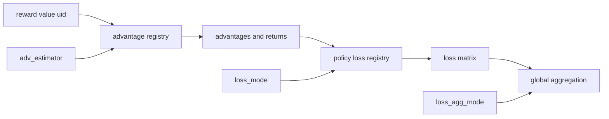

# verl RL 算法：优势估计、策略损失与全局归一化

> **代码基准**：verl `main` @ `254a23edc62f25ebfae626e3932ae285d6f86009`（2026-08-28）
> **最后更新**：2026-08-31 · **定位**：reward shaping、advantage、loss 与 mask 语义唯一机制 owner
>
> **核心结论**：verl 没有为每种 RL 算法复制一套 trainer，而是把“如何从奖励得到优势”和“如何从优势得到策略梯度”拆成两张注册表；训练器负责准备状态，worker 负责统一聚合。这个分解让算法组合可以独立变化，但正确性取决于额外输入、mask 语义和全局 batch 归一化是否同时满足。本页不拥有 trajectory 调度、TQ 存储或 Engine 后端执行。

除特别说明外，行号均指最终基线中的仓库相对路径。

---

## 1. 为什么是两条轴，而不是算法分支树

`AdvantageEstimator` 枚举与 `ADV_ESTIMATOR_REGISTRY` 定义在 `verl/trainer/ppo/core_algos.py:88-137`；策略损失使用独立的 `POLICY_LOSS_REGISTRY` 与 `get_policy_loss_fn`（`verl/trainer/ppo/core_algos.py:50-82`）。因此 PPO、GRPO、DRO 或 GSPO 不是互斥的 trainer 类，而是两项配置的组合：

1. `algorithm.adv_estimator` 决定奖励、value 与分组信息如何变成 `advantages` 和 `returns`。
2. `actor.policy_loss.loss_mode` 决定 `old_log_probs`、当前 `log_prob` 与 `advantages` 如何变成 policy loss。
3. `actor.loss_agg_mode` 决定局部 loss matrix 如何还原为全局 batch 的标量目标。



V0 的 `compute_advantage` 在 `verl/trainer/ppo/ray_trainer.py:187-282` 统一分发；V1 对非 GRPO 直接复用该入口，对多轨迹 GRPO 只取每个 session 的最终输出计算后再广播（`verl/trainer/ppo/v1/utils.py:148-205`）。这说明 trainer 世代变化没有复制算法库，变化的是数据编排边界。

---

## 2. Advantage：先选择“用什么作基线”，再选择实现名字

`AdvantageEstimator` 当前列出 14 个内置名字（`verl/trainer/ppo/core_algos.py:88-110`），但这些名字不是 14 套互不相关的算法。它们主要在回答两个问题：**奖励怎样沿 token/时间传播，以及用什么基线降低方差或改变组内相对信号**。注册装饰器只负责拒绝重名、查找函数和统一输出 `advantages/returns`（`verl/trainer/ppo/core_algos.py:116-145`）；它不会验证组大小、reward 维度、critic、greedy baseline 或 token 概率统计是否存在。

### 2.1 V1 advantage 的完整数据路径

算法函数不是直接消费 TQ，也不知道 trajectory key。V1 trainer 先把存储态转换为算法态，算法完成后再转回 nested 存储态：

```text
PPOTrainer._compute_advantage(KVBatchMeta)
  → tq.kv_batch_get(uid, response_mask, rm_scores,
                    rollout_log_probs, old_log_probs, ref_log_prob, values)
  → nested TensorDict.to_padded_tensor()
  → DataProto(batch=[B,L], non_tensor_batch.uid=[B])
  → token_level_scores = rm_scores
  ├─ use_kl_in_reward
  │    → apply_kl_penalty → token_level_rewards
  └─ else
       → token_level_rewards = token_level_scores
  → optional decoupled rollout correction
       → rollout_is_weights / rejection mask / metrics
  → compute_advantage_for_multi_trajectories(data, batch_keys, estimator, ...)
      ├─ estimator != GRPO
      │    → ray_trainer.compute_advantage
      └─ estimator == GRPO
           → parse {uid}_{session}_{index}
           → select final output of each session
           → ray_trainer.compute_advantage(final rows)
           → broadcast final-session score to every row in that session
      → compute_advantage dispatch
          ├─ GAE explicit branch
          ├─ GRPO explicit branch
          └─ get_adv_estimator_fn(name) → registered estimator
  → advantages / returns [B,L]
  → response_to_nested(..., original response_mask)
  → tq.kv_batch_put(advantages, returns, optional correction/reward fields)
```

TQ 字段选择、padded DataProto 构造、KL/correction 分支和 nested 写回位于 `verl/trainer/ppo/v1/trainer_base.py:1650-1707`。多轨迹包装层对非 GRPO 直接委托，对 GRPO 只选每个 session 的最终输出后广播（`verl/trainer/ppo/v1/utils.py:148-215`）。底层 `compute_advantage` 对 GAE/GRPO 保留显式分支，其余算法才通过 `get_adv_estimator_fn` 查 registry，并按算法补 `uid`、baseline、GDPO 多维字段或 OTB 概率统计（`verl/trainer/ppo/ray_trainer.py:187-282`；registry 在 `verl/trainer/ppo/core_algos.py:113-150`）。

| Hop | 输入/前态 | 动作与 owner | 输出/后态 | 失败/等待边界 |
|---|---|---|---|---|
| TQ read | trajectory keys + nested fields | trainer 选择 advantage 所需字段 | 变长 TensorDict | 任一必需字段缺失时在此或后续取键失败 |
| padded algorithm view | nested response rows | trainer 用 mask 补齐到 `[B,L]` 并把 `uid` 移到 non-tensor 区 | DataProto | padding 只能由 `response_mask` 排除，不能当真实 token |
| reward shaping | scores、old/ref/rollout log-prob | trainer 应用 KL 与 rollout correction | `token_level_rewards`，可选 IS/rejection fields | bypass 不走 decoupled correction 分支 |
| estimator dispatch | DataProto + estimator name | V1 wrapper 处理 session 语义；V0 helper/registry 运行公式 | padded `advantages/returns` | 未知名字、缺 critic/value/uid/OTB 字段按分支失败 |
| TQ writeback | `[B,L]` + 原 mask | trainer 裁回每行有效 response 长度 | nested fields 绑定原 trajectory keys | 写回完成后 actor/critic 才能读取 |

这里的关键设计是把“轨迹如何分组”和“优势公式”分开：V1 wrapper 拥有 session-final 选择，算法 registry 拥有 estimator 数学。`【分析推断】` 若让每个 estimator 自己解析 TQ key，它会与存储命名和多轮输出结构耦合；代价是阅读者必须沿 trainer → V1 wrapper → legacy helper/registry 三层才能找到一次完整计算。

下表的“为什么”在源码 docstring 明确说明时按其原意概括；否则标为 **【分析推断】**，表示从当前公式和前置条件重建选择判据，而不是声称作者在代码中完成了算法比较。

| 设计家族 | 是什么、解决什么问题 | 怎么做 | 为什么不直接用最接近的替代方案 | 实现与前置条件 |
|---|---|---|---|---|
| critic 时序基线 | 用 learned value 为每个 token 提供状态相关基线，处理跨 token 的信用分配 | GAE 逆序累计 TD residual，以 `gamma` 和 `lambda` 控制偏差—方差，再用 mask whiten | 相比同 prompt 组均值，它能利用状态和时序信息；代价是必须训练 critic，value 误差也会进入 advantage | `gae`；需要 `values`。`verl/trainer/ppo/core_algos.py:216-264` |
| 组均值/方差基线 | 在没有 critic 时，用同一 prompt 的多条 outcome 相互比较 | GRPO 按 `uid` 求组均值，可选除组标准差，再把标量广播到有效 token；vectorized 版保持同一数学语义 | 相比直接使用绝对 reward，组中心化消除 prompt 难度的共同偏移；但它要求可靠分组，组大小为 1 时退化为无有效相对基线 | `grpo`、`grpo_vectorized`、`reinforce_plus_plus_baseline`。`verl/trainer/ppo/core_algos.py:268-358,536-584` |
| 改造组基线 | 保留“组内比较”，但改变哪些响应构成基线、reward 维度或长度权重 | GDPO 逐 reward 维归一化后加权；Pass@k 只给 top-1 与 top-2 的差；RLOO 排除自身；OPO 用长度加权；GPG 再按非零 reward 比例缩放 | 相比统一 GRPO z-score，这些变体针对多目标被单一 reward 淹没、self-inclusion、长度偏置、精英选择或稀疏 reward；代价是更强的数据假设和更专门的超参 | `gdpo`、`grpo_passk`、`rloo`/`rloo_vectorized`、`opo`、`gpg`。`verl/trainer/ppo/core_algos.py:362-530,588-690,771-868` |
| reward-to-go 与外部基线 | 不把整条响应压成一个 outcome advantage，而是保留从当前位置到结尾的回报 | REINFORCE++ 逆序累计 discounted return；ReMax 再减去 greedy response 的 reward baseline | 相比把一个 outcome 标量广播到所有 token，它保留时序回报；ReMax 用额外 greedy rollout 换取更直接的 prompt-specific baseline | `reinforce_plus_plus` 需要 `gamma`；`remax` 需要 `reward_baselines`。`verl/trainer/ppo/core_algos.py:694-767` |
| token 路径方差基线 | 为同 prompt 的每个 token 位置计算不同 baseline，而不是整条 trajectory 共用一个数 | OTB 用 `old_log_probs` 与 `sum_pi_squared` 构造累计 path-variance 权重；TIR 版只在有效 response token 序列上对齐多轮轨迹 | 相比组均值，它试图让高方差路径对 baseline 贡献更符合 token 位置；代价是额外概率统计、分组循环、变长尾部处理和更高内存/计算成本 | `optimal_token_baseline`、`tir_optimal_token_baseline`。`verl/trainer/ppo/core_algos.py:872-1115` |

### 2.2 GAE 与 GRPO：critic 时序基线和无 critic 组基线

**是什么与为什么。** GAE 适合已经承担 critic 成本、且需要逐 token 时序信用的路径；GRPO 适合同 prompt 有多条采样、希望不用 value model 做相对比较的路径。二者都输出 token-aligned advantage，但可用信息和失败方式完全不同，不能因为下游接口相同就互换。

**怎么做。** GAE 使用 value 网络，把逐 token TD 残差逆序累积（`verl/trainer/ppo/core_algos.py:216-264`）：

$$
\delta_t = r_t + \gamma V_{t+1} - V_t,
\qquad
A_t^{\mathrm{GAE}} = \delta_t + \gamma \lambda A_{t+1}^{\mathrm{GAE}}.
$$

GRPO 不读取 critic；它把回答总奖励按同一 `uid` 的采样组做中心化，可选再除以组标准差，然后广播到有效 response token（`verl/trainer/ppo/core_algos.py:268-332`）：

$$
A_i^{\mathrm{GRPO}}
=
\frac{R_i-\mu_{g(i)}}{\sigma_{g(i)}+\epsilon}.
$$

关闭 `norm_adv_by_std_in_grpo` 只保留减均值，对应去除组标准差缩放；这会改变组间尺度，并不是一种新 loss mode（`verl/trainer/ppo/core_algos.py:294-329`）。GRPO 的关键约束是 `uid` 必须真实表示“同一 prompt 的采样组”；错误分组仍能算出数值，却会悄悄改变 baseline。

### 2.3 组基线变体：每一种都改变了“谁和谁比较”

- **GDPO** 先对每个 reward dimension 独立做组归一化，再按权重合并和全局 whiten，避免一个量纲或方差更大的 reward 分量淹没其它维度；它要求 `gdpo_reward_keys` 在 `non_tensor_batch` 中真实存在（`verl/trainer/ppo/core_algos.py:362-468`）。
- **Pass@k** 只给组内最好响应非零 advantage，幅度是 top-1 与 top-2 的 reward 差。它不是一般 GRPO 的加速版，而是把学习信号集中到“最好答案相对次好答案”的间隔；每组少于两条样本会直接失败（`verl/trainer/ppo/core_algos.py:471-530`）。
- **RLOO** 对样本 $i$ 使用其余组员的均值作 baseline，避免当前 reward 同时出现在目标和 baseline 中；单样本组没有 leave-one-out 信息，代码把其贡献压为零或不做相减（`verl/trainer/ppo/core_algos.py:587-636,833-868`）。
- **OPO** 用 response length 加权组 baseline，因此显式改变长短回答对基线的贡献；选择它就等于接受“长度应进入基线”的假设（`verl/trainer/ppo/core_algos.py:639-690`）。
- **GPG advantage** 仍做组中心化，但再按 batch 中非零 reward 比例缩放；它针对稀疏 reward 改变信号幅度，不能与同名的 `gpg` policy loss 混为一个开关（`verl/trainer/ppo/core_algos.py:770-830`）。

这些实现说明注册表只统一函数选择，不统一统计假设。调用端仍要为 GDPO 提供多维 reward、为 ReMax 提供 greedy baseline、为 OTB 提供 `sum_pi_squared`，并为所有分组方法保证 `uid` 正确（`verl/trainer/ppo/ray_trainer.py:218-280`）。

### 2.4 时序与 token baseline：mask 决定奖励能否跨 observation 传播

当前 REINFORCE++ 在逆序计算 return 时，`response_mask=0` 的 observation 位置自身 return 为零，但 `running_return` 穿过该区间继续向前传播（`verl/trainer/ppo/core_algos.py:694-731`）：

$$
G_t = r_t + \gamma G_{t+1},
\qquad
\widehat G_t = m_t G_t,
$$

其中 observation token 的 $m_t=0$ 只屏蔽当前位置，不截断后续奖励。这一边界由 CPU 测试覆盖 observation span、尾部 padding、折扣传播和 batch 维度（`tests/trainer/ppo/test_reinforce_pp_multiturn_on_cpu.py:37-139`）。若把 mask 同时用于清空 running state，工具 observation 之后得到的终局奖励就无法传回之前的模型 token。

OTB 进一步把 baseline 从 trajectory 级细化到 token 级：它用旧策略概率构造累计 path-variance proxy，再在 prompt group 内为每个位置求加权 baseline。这样能表达“同一轨迹不同位置的方差不同”，但要求 rollout/actor 额外产出 `sum_pi_squared`，并对最长轨迹超出第二长轨迹的尾部作显式处理（`verl/trainer/ppo/core_algos.py:872-987`）。TIR 版本把多轮有效 token 压到连续坐标后执行相同思想，再映射回原 mask（`verl/trainer/ppo/core_algos.py:990-1115`）。

---

## 3. Policy loss：选择“怎样限制一次策略移动”

actor 从 `config.policy_loss.loss_mode` 查表，给所有实现传入同一组 `old_log_prob`、`log_prob`、`advantages`、`response_mask` 与可选 rollout IS 权重（`verl/workers/utils/losses.py:85-112`）。统一签名只建立了坐标系；12 个公开名字真正的区别，是**在哪个粒度计算 policy ratio、用硬裁剪还是软惩罚、丢弃哪些 token，以及梯度能否穿过 correction weight**。

### 3.1 从 actor RPC 追到 `optimizer_step`

`ppo_loss` 在 actor 初始化时被绑定为 `TrainingWorker.loss_fn`，不是 trainer 每步临时选择的回调（`verl/workers/engine_workers.py:590-646`）。以 FSDP backend 为例，一次 actor update 的算法—反向调用链是：

```text
PPOTrainer._update_actor
  → ActorRolloutRefWorker.update_actor
      → TrainingWorker.train_mini_batch
          → for mini_batch × ppo_epochs
              → TrainingWorker.train_batch
                  → BaseEngine.train_batch(data, loss_fn)
                      → optimizer_zero_grad()
                      → FSDPEngine.forward_backward_batch
                          → all_reduce(batch_num_tokens); set dp_size
                          → prepare_micro_batches
                          → for each micro_batch
                              → FSDPEngine.forward_step
                                  → module(**model_inputs)
                                  → prepare_model_outputs → current log_prob/entropy
                                  → ppo_loss(config, model_output, micro_batch)
                                      → no_padding_2_padding(log_prob, entropy)
                                      → select old_log_probs/advantages/response_mask
                                      → get_policy_loss_fn(loss_mode)
                                      → concrete policy loss
                                          → token loss matrix
                                          → agg_loss(...global_batch_info) → scalar pg_loss
                                      → optional entropy agg/subtraction
                                      → optional reference KL agg/addition
                                      → scalar policy_loss
                              → policy_loss.backward()
                      → optimizer_step()
```

controller、outer worker 与 mini-batch 循环位于 `verl/trainer/ppo/v1/trainer_base.py:1734-1765` 和 `verl/workers/engine_workers.py:241-338,707-714`；Worker 把 loss callable 交给 Engine，BaseEngine 固定 zero-grad/forward-backward/step 顺序（`verl/workers/engine_workers.py:340-394`；`verl/workers/engine/base.py:113-132`）。FSDP 后端计算全局有效 token 数、拆 micro-batch、调用 `forward_step` 并 backward（`verl/workers/engine/fsdp/transformer_impl.py:700-753`）；具体 forward 在模型输出就绪后调用 `loss_function(model_output, data)`（同文件 `1512-1560`）。Megatron 走不同 schedule，但同样在 micro-batch postprocess 调 loss callable，并按 pipeline micro-batch 数缩放（`verl/workers/engine/megatron/transformer_impl.py:1416-1435`）。

| 张量/状态 | 进入 loss 前 | loss 内变化 | 离开 loss / backward 后 |
|---|---|---|---|
| current `log_prob` | backend 可为 no-padding/nested 输出 | `no_padding_2_padding` 对齐到 `[micro_B,response_L]` | 保留 autograd，直到 scalar policy loss backward |
| old log-prob / advantage / mask | TQ 物化并随 micro-batch 切分 | 选择必需字段，统一 padded shape；mask 转 bool | old/adv 不更新，mask 决定有效梯度位置 |
| policy objective | 无 | registry loss 生成 token matrix，再由 `agg_loss` 变标量 | `pg_loss` 参与总 policy loss |
| entropy / reference KL | 可选模型输出与 ref field | 分别聚合后减 entropy bonus、加 KL penalty | 与 policy objective 合成一个 scalar |
| 全局分母 | controller 提供 `global_batch_size`；Engine 提供 `dp_size/batch_num_tokens` | 写入 `config.global_batch_info` 并传给 `agg_loss` | 保证 micro-batch/DP 切法不改变目标尺度 |
| 参数/optimizer | 当前 actor 参数、清零后的 grads | 每个 micro-batch backward 累积梯度 | 全部 micro-batch 后 `optimizer_step` 改参数 |

`ppo_loss` 的字段选择、registry 查找、entropy 与 KL 合成位于 `verl/workers/utils/losses.py:57-144`；vanilla 的 ratio/clip/token matrix 与全局聚合在 `verl/trainer/ppo/core_algos.py:1285-1376`。这条链说明算法完成点不是 `get_policy_loss_fn` 返回，也不是 loss 标量产生，而是所有 micro-batch backward 后 Engine 的 `optimizer_step` 成功；反过来，optimizer 成功仍不等于 rollout 已安装新权重，后者属于 [[21_verl_weight_publication_analysis]]。

| 设计家族 | 是什么、解决什么问题 | 怎么做 | 为什么选择它而不是 vanilla | 实现与代价 |
|---|---|---|---|---|
| token ratio 硬约束 | 限制单 token 的 current/old policy 偏移 | `vanilla` 对 ratio clip 并可 dual-clip；`dppo_tv`/`dppo_kl` 按概率差或 binary-KL 构造 valid mask，再使用截断 IS | vanilla 直接限制 ratio；DPPO 变体在 divergence 超阈值时停止相应方向 token 的更新。后者更明确地拒绝越界样本，但会丢梯度并引入阈值偏差 | `vanilla`、`dppo_tv`、`dppo_kl`。`verl/trainer/ppo/core_algos.py:1285-1542` |
| 序列级 policy movement | 让整条回答共享一个相对变化尺度，避免每个 token 独立比值主导长序列 | GSPO 对平均 log-ratio 指数化并固定 sequence aggregation；GMPO/`geo_mean` 对裁剪后的 log-ratio取几何平均 | **【分析推断】** 当训练语义是整条回答的 outcome advantage 时，序列 ratio 比 token ratio 更贴近决策单位；代价是必须接受特定 aggregation，且当前 `geo_mean` 只支持 sequence-level advantage | `gspo`、`geo_mean`。`verl/trainer/ppo/core_algos.py:1545-1618,1927-2010` |
| 平滑或 stop-gradient 重加权 | 避免 PPO 的 piecewise hard clip 直接决定梯度形状 | SAPO 对正负 advantage 使用不同 sigmoid gate；DRO 对 log-ratio 加二次罚；CISPO clip ratio 后 detach，只让梯度通过 `log_prob` | 相比硬 clip，它们把“更新多少”和“梯度从哪里流”显式化；代价是新增温度或 beta，并且 correction weight 的梯度语义与 vanilla 不同 | `sapo`、`dro`、`cispo`。`verl/trainer/ppo/core_algos.py:1621-1705,2013-2104` |
| 选择性 token 控制 | 只处理被 advantage–logp 关系识别为高风险的 token | `clip_cov` 对高协方差 token 屏蔽/裁剪，`kl_cov` 在相应位置改用 KL penalty | **【分析推断】** 相比所有 token 一刀切，目标是把限制集中到最可能主导更新的 token；代价是百分位选择依赖 batch 分布，且排序/掩码增加非平滑性 | `clip_cov`、`kl_cov`。`verl/trainer/ppo/core_algos.py:1742-1924` |
| 直接 policy gradient 与 rollout correction | 不把所有 off-policy 语义都压进 proximal old-policy ratio | `gpg` 直接计算 $-A\log\pi$；`bypass_mode` 把 rollout log-prob 当 old，先算 IS/rejection，再分派 PPO-clip 或 REINFORCE | 适合显式处理 rollout/current mismatch；但若 PPO ratio 已承担 correction，再乘一次 IS 会 double-count，因此 bypass 必须集中管理这条语义 | `gpg`、`bypass_mode`；`reinforce` 只是后者内部辅助函数。`verl/trainer/ppo/core_algos.py:1706-1741,2332-2512` |

这些名字由 `PolicyLossConfig.loss_mode` 接收；同一配置对象还承载 DRO 的 `dro_beta`（`verl/workers/config/actor.py:77-101`）。注册成功只证明函数存在，不证明 estimator、old-policy 语义、aggregation 和 correction mode 彼此兼容。

### 3.2 vanilla：所有变体共享的 ratio 坐标系

令

$$
\rho_t(\theta)=\exp\!\left(\log\pi_\theta(a_t\mid s_t)-\log\pi_{\mathrm{old}}(a_t\mid s_t)\right).
$$

vanilla 对 $\rho_t$ 做上下界裁剪，并在负优势时可使用 dual-clip；实现同时统计 KL 近似与上下界 clip fraction（`verl/trainer/ppo/core_algos.py:1286-1376`）。它的定位是默认 proximal 基线：更新过远时取裁剪目标，而不是让 ratio 无限放大 advantage。代价是超过阈值后目标变成分段函数，clip fraction 高只能说明大量 token 触边，不能单独证明训练更安全。

DPPO-TV 与 DPPO-KL 并非“换一个 clip 数值”：它们先构造 divergence valid mask，再用 detach 的截断 ratio 乘 `log_prob`。TV 直接比较新旧 token 概率差，binary-KL 同时考虑事件与非事件概率；两者都建议把 IS 上限设得较大以降低截断偏差（`verl/trainer/ppo/core_algos.py:1379-1542`）。

### 3.3 序列尺度与梯度路径是独立选择

GSPO 把一条 response 的平均 log-ratio 转成共享 sequence ratio，并强制用 `seq-mean-token-mean` 聚合；`geo_mean` 也在序列维求几何平均，但先按 advantage 符号限制每个 token 的 log-ratio，并要求 sequence-level advantage（`verl/trainer/ppo/core_algos.py:1545-1618,1927-2010`）。因此二者不能只按名字替换 vanilla：ratio 粒度和最终分母都改变了。

SAPO、DRO、CISPO 则主要改变梯度路径。SAPO 用正负 advantage 各自的温度控制 sigmoid gate；CISPO 对 clip 后 ratio 做 stop-gradient，使梯度只从最终 `log_prob` 项流过（`verl/trainer/ppo/core_algos.py:1621-1705,2046-2104`）。这类方法的关键验收不是仅看 loss 数值，而是核对 gate/weight 是否 detach、正负 advantage 是否走正确参数，以及 aggregation 是否保持全局语义。

### 3.4 DRO：用平滑二次罚代替硬裁剪

`dro` 对 old/current log-prob 差施加二次惩罚（`verl/trainer/ppo/core_algos.py:2013-2043`）：

$$
\mathcal L_t^{\mathrm{DRO}}
=
-\log\pi_\theta(a_t\mid s_t)A_t
+\frac{\beta}{2}
\left(\log\pi_\theta(a_t\mid s_t)-\log\pi_{\mathrm{old}}(a_t\mid s_t)\right)^2.
$$

这里 `policy_loss.dro_beta` 必须为正；若 rollout 提供 IS 权重，则权重乘在整个 token loss 上（`verl/trainer/ppo/core_algos.py:2027-2038`）。直接公式与非法 beta 都有 CPU 测试（`tests/trainer/ppo/test_dynamic_policy_losses_on_cpu.py:39-60`）。它比 PPO 硬 clip 更平滑，但 beta 变成必须调节的偏移惩罚强度；beta 过小接近无约束 policy gradient，过大则让“留在 old policy 附近”压过 advantage 信号，这是公式直接给出的工程取舍。

### 3.5 KL 与熵是注册 loss 之外的正则项

actor 先计算注册表返回的 policy loss，再减去 entropy bonus，并在 `use_kl_loss=true` 时加上参考策略 KL（`verl/workers/utils/losses.py:118-142`）。因此 `loss_mode=dro` 或 `gspo` 并不自动决定是否使用 reference model；KL 是独立配置轴。`kl_penalty` 支持多种近似并由 `verl/trainer/ppo/core_algos.py:2187-2245` 实现。

---

## 4. 第三条轴：全局 batch 归一化

算法公式只定义 token loss matrix，分布式正确性由 `agg_loss` 负责。该函数显式以 FSDP/Megatron 并行不变为目标（`verl/trainer/ppo/core_algos.py:1140-1168`），当前支持：

| `loss_agg_mode` | 标量语义 | 所需全局信息 |
|---|---|---|
| `token-mean` | 全局有效 token 均值 | `batch_num_tokens` |
| `token-sum` | 全局有效 token 总和 | `dp_size` 补偿 DP 平均 |
| `seq-mean-token-sum` | 每序列 token 求和，再做全局序列均值 | `global_batch_size` |
| `seq-mean-token-sum-norm` | 上项再除固定 scale | `global_batch_size`、`loss_scale_factor` |
| `seq-mean-token-mean` | 每序列 token 均值，再做全局序列均值 | `global_batch_size` |

关键不变量是：FSDP/DDP 会平均各 rank 梯度，所以局部贡献要乘 `dp_size`，而分母必须来自 global mini-batch，不能来自当前 micro-batch（`verl/trainer/ppo/core_algos.py:1170-1202`）。新增 `token-sum` 分支直接把 masked local sum 乘 `dp_size`；测试覆盖 mask、micro-batch 切分与不同 DP size（`tests/trainer/ppo/test_loss_aggregation_on_cpu.py:23-55`）。

critic 现在沿用同一归一化参数。`value_loss` 从 TensorDict 提取 `dp_size`、`batch_num_tokens`、`global_batch_size`，并把全局归一化下的 metric 聚合从 mean 切成 sum（`verl/workers/utils/losses.py:147-201`）；`compute_value_loss` 最终调用 `agg_loss`（`verl/trainer/ppo/core_algos.py:2124-2182`）。对应测试覆盖变长序列、micro-batch、DP size、metric 与梯度不变量（`tests/trainer/ppo/test_value_loss_normalization_on_cpu.py:87-219`）。

这解释了为什么仅核对 PPO/GRPO 公式不够：如果分母随 micro-batch 切法变化，同一算法和数据也会得到不同梯度。

---

## 5. 组合方式与失败边界

| 目标 | estimator | loss mode | 必须额外核对 |
|---|---|---|---|
| PPO | `gae` | `vanilla` | critic values、value clip、全局归一化 |
| GRPO | `grpo` | `vanilla` | 每个 `uid` 的组大小与 `norm_adv_by_std_in_grpo` |
| DAPO 风格 | `grpo` | `vanilla` | asymmetric clip、group filter、聚合方式 |
| GSPO | `grpo` | `gspo` | 序列级聚合 |
| REINFORCE++ | `reinforce_plus_plus` | `vanilla` 或 `gpg` | observation mask 与 `gamma` |
| DRO | 任意兼容 estimator | `dro` | 正的 `dro_beta` 与 old log-prob |
| OTB | `optimal_token_baseline` | 可组合 | actor 必须生成 `sum_pi_squared` |

源码能阻止未知注册名和非法 DRO beta，但以下问题不会被注册表自动修复：

- 分组 estimator 的 `uid` 组成错误，会改变 baseline 而不一定抛异常。
- OTB 缺少 `sum_pi_squared` 会在 trainer 断言失败（`verl/trainer/ppo/ray_trainer.py:264-273`）。
- `token-mean` 在 `dp_size>1` 时缺失全局 token 数会显式报错；sequence 模式同理要求全局 batch size（`verl/trainer/ppo/core_algos.py:1170-1202`）。
- `bypass_mode` 同时涉及 rollout policy、old policy 与 rejection/IS 校正，不能只按普通 PPO ratio 解读；其入口在 `verl/trainer/ppo/core_algos.py:2413-2512`。
- V1 多轨迹 GRPO 只用 session 最终输出计算组优势后广播；把 V0 的逐行语义直接套入 V1 会漏掉这个边界（`verl/trainer/ppo/v1/utils.py:158-205`）。

---

## 6. 阅读源码的最短路径

1. 在 `verl/trainer/ppo/core_algos.py:88-145` 确认 estimator 名字和注册机制。
2. 在 `ray_trainer.py:187-282` 确认该 estimator 需要哪些 batch 字段；V1 再看 `v1/utils.py:148-205`。
3. 在 `verl/trainer/ppo/core_algos.py:50-82` 与 `verl/workers/utils/losses.py:85-142` 确认 loss mode、entropy 和 KL 的组合。
4. 最后核对 `verl/trainer/ppo/core_algos.py:1140-1206` 的聚合模式；这是从单卡公式到分布式训练目标的边界。

这样能把算法问题分成三个可独立审计的问题：优势是否正确、token loss 是否正确、全局梯度尺度是否正确。

---

## Related Pages

- [[10_verl_end_to_end_iteration_analysis]] —— 默认 V1 sync 如何准备算法输入。
- [[12_verl_dataproto_analysis]] —— `advantages`、`returns`、`uid` 等字段的本地载体。
- [[13_verl_workers_engine_analysis]] —— actor/critic worker 如何在后端中执行 loss。
- [[18_verl_agent_loop_reward_runtime_analysis]] —— reward、response mask 与 tool fields 的上游来源。
- [[20_verl_ray_trainer_analysis]] —— V0 `compute_advantage` 与 legacy 主循环。
- [[30_verl_optimization_analysis]] —— loss 聚合与性能实验的控制变量。
- [[13_reasoning_rl_algorithm_evolution_analysis|D02 Reasoning RL 算法演进]] —— GRPO、DAPO、GSPO 的跨实现算法脉络。
