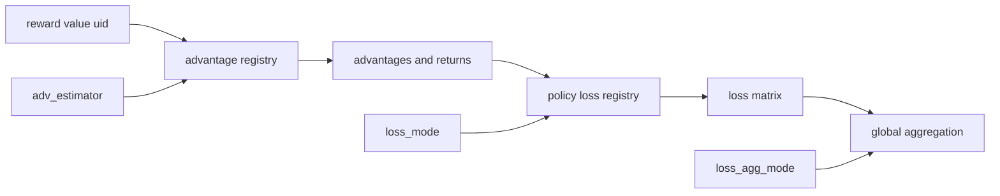

# verl RL 算法：优势估计、策略损失与全局归一化

> **代码基准**：verl `main` @ `254a23edc62f25ebfae626e3932ae285d6f86009`（2026-08-28）
> **最后更新**：2026-08-28 · **系列**：verl RLHF 框架源码级分析（见 [[verl/index]]）
>
> **核心结论**：verl 没有为每种 RL 算法复制一套 trainer，而是把“如何从奖励得到优势”和“如何从优势得到策略梯度”拆成两张注册表；训练器负责准备状态，worker 负责统一聚合。这个分解让算法组合可以独立变化，但正确性取决于额外输入、mask 语义和全局 batch 归一化是否同时满足。

除特别说明外，行号均指最终基线中的仓库相对路径。

---

## 1. 为什么是两条轴，而不是算法分支树

`AdvantageEstimator` 枚举与 `ADV_ESTIMATOR_REGISTRY` 定义在 `verl/trainer/ppo/core_algos.py:88-137`；策略损失使用独立的 `POLICY_LOSS_REGISTRY` 与 `get_policy_loss_fn`（`verl/trainer/ppo/core_algos.py:50-82`）。因此 PPO、GRPO、DRO 或 GSPO 不是互斥的 trainer 类，而是两项配置的组合：

1. `algorithm.adv_estimator` 决定奖励、value 与分组信息如何变成 `advantages` 和 `returns`。
2. `actor.policy_loss.loss_mode` 决定 `old_log_probs`、当前 `log_prob` 与 `advantages` 如何变成 policy loss。
3. `actor.loss_agg_mode` 决定局部 loss matrix 如何还原为全局 batch 的标量目标。

V0 的 `compute_advantage` 在 `verl/trainer/ppo/ray_trainer.py:187-282` 统一分发；V1 对非 GRPO 直接复用该入口，对多轨迹 GRPO 只取每个 session 的最终输出计算后再广播（`verl/trainer/ppo/v1/utils.py:148-205`）。这说明 trainer 世代变化没有复制算法库，变化的是数据编排边界。

---

## 2. 优势估计注册表：14 个名字，一份输出契约

`AdvantageEstimator` 当前列出 14 个内置名字（`verl/trainer/ppo/core_algos.py:88-110`）。注册装饰器拒绝用不同函数覆盖同名项，未知名字在查表时抛错（`verl/trainer/ppo/core_algos.py:116-145`）。自定义实现可以用字符串注册，不必修改枚举。

| `adv_estimator` | 实现入口 | 状态或约束 |
|---|---|---|
| `gae` | `verl/trainer/ppo/core_algos.py:216` | 需要 critic `values` |
| `grpo` | `verl/trainer/ppo/core_algos.py:268` | 按 `uid` 分组 |
| `grpo_vectorized` | `verl/trainer/ppo/core_algos.py:335` | GRPO 的张量化版本 |
| `gdpo` | `verl/trainer/ppo/core_algos.py:362` | 多维奖励键与权重 |
| `grpo_passk` | `verl/trainer/ppo/core_algos.py:472` | 组内 top-2 奖励 |
| `reinforce_plus_plus_baseline` | `verl/trainer/ppo/core_algos.py:536` | 组均值基线 |
| `rloo` | `verl/trainer/ppo/core_algos.py:588` | 每组至少两个样本才有留一基线 |
| `opo` | `verl/trainer/ppo/core_algos.py:640` | 长度加权组基线 |
| `reinforce_plus_plus` | `verl/trainer/ppo/core_algos.py:694` | `gamma` 与时序 mask |
| `remax` | `verl/trainer/ppo/core_algos.py:735` | 需要 greedy `reward_baselines` |
| `gpg` | `verl/trainer/ppo/core_algos.py:771` | `uid` 分组与非零奖励校正 |
| `rloo_vectorized` | `verl/trainer/ppo/core_algos.py:834` | RLOO 的张量化版本 |
| `optimal_token_baseline` | `verl/trainer/ppo/core_algos.py:872` | 需要 `sum_pi_squared` 与 `old_log_probs` |
| `tir_optimal_token_baseline` | `verl/trainer/ppo/core_algos.py:991` | 多轮 TIR 的 token baseline |

### 2.1 GAE 与 GRPO 是两种不同的信用分配

GAE 使用 value 网络，把逐 token TD 残差逆序累积（`verl/trainer/ppo/core_algos.py:216-264`）：

$$
\delta_t = r_t + \gamma V_{t+1} - V_t,
\qquad
A_t^{\mathrm{GAE}} = \delta_t + \gamma \lambda A_{t+1}^{\mathrm{GAE}}.
$$

GRPO 不读取 critic；它把回答总奖励按同一 `uid` 的采样组做中心化，可选再除以组标准差，然后广播到有效 response token（`verl/trainer/ppo/core_algos.py:268-332`）：

$$
A_i^{\mathrm{GRPO}}
=
\frac{R_i-\mu_{g(i)}}{\sigma_{g(i)}+\epsilon}.
$$

关闭 `norm_adv_by_std_in_grpo` 只保留减均值，对应去除组标准差缩放；这不是一种新 loss mode，而是 advantage 侧的开关（`verl/trainer/ppo/core_algos.py:296-329`）。

### 2.2 通用分发也有显式的状态分支

调用端对 GAE 与 GRPO 单独传参，其余估计器经注册表分发；GDPO 从 `non_tensor_batch` 取多维奖励，OTB 强制要求 `sum_pi_squared`，ReMax 读取 greedy baseline（`verl/trainer/ppo/ray_trainer.py:218-280`）。所以“注册表消除 trainer 分支”只适用于算法函数的选择，不能消除输入状态的差异。

### 2.3 多轮 REINFORCE++ 的 mask 修复

当前 REINFORCE++ 在逆序计算 return 时，`response_mask=0` 的 observation 位置自身 return 为零，但 `running_return` 穿过该区间继续向前传播（`verl/trainer/ppo/core_algos.py:694-731`）：

$$
G_t = r_t + \gamma G_{t+1},
\qquad
\widehat G_t = m_t G_t,
$$

其中 observation token 的 $m_t=0$ 只屏蔽当前位置，不截断后续奖励。这一边界由 CPU 测试覆盖 observation span、尾部 padding、折扣传播和 batch 维度（`tests/trainer/ppo/test_reinforce_pp_multiturn_on_cpu.py:37-139`）。旧实现若把 mask 同时用于清空 running state，会错误阻断工具观察之后的奖励。

---

## 3. 策略损失注册表：12 种梯度形状

actor 从 `config.policy_loss.loss_mode` 查表，给所有实现传入同一组 `old_log_prob`、`log_prob`、`advantages`、`response_mask` 与可选 rollout IS 权重（`verl/workers/utils/losses.py:85-112`）。当前注册表有 12 个公开名字：

| `loss_mode` | 实现入口 | 相对 vanilla 的主要变化 |
|---|---|---|
| `vanilla` | `verl/trainer/ppo/core_algos.py:1286` | PPO clip 与 dual-clip |
| `dppo_tv` | `verl/trainer/ppo/core_algos.py:1380` | TV 阈值 mask 与截断 IS |
| `dppo_kl` | `verl/trainer/ppo/core_algos.py:1461` | binary-KL 阈值 mask 与截断 IS |
| `gspo` | `verl/trainer/ppo/core_algos.py:1546` | 序列级 importance ratio |
| `sapo` | `verl/trainer/ppo/core_algos.py:1622` | 正负优势使用不同 sigmoid gate |
| `gpg` | `verl/trainer/ppo/core_algos.py:1707` | 直接使用 $-A\log\pi$ |
| `clip_cov` | `verl/trainer/ppo/core_algos.py:1743` | 按 advantage-logp 协方差屏蔽 token |
| `kl_cov` | `verl/trainer/ppo/core_algos.py:1848` | 对高协方差 token 加 KL 罚 |
| `geo_mean` | `verl/trainer/ppo/core_algos.py:1928` | 序列比值的几何平均 |
| `dro` | `verl/trainer/ppo/core_algos.py:2014` | log-ratio 二次正则 |
| `cispo` | `verl/trainer/ppo/core_algos.py:2047` | stop-gradient 的裁剪 IS 权重 |
| `bypass_mode` | `verl/trainer/ppo/core_algos.py:2413` | rollout correction 的调度入口 |

这些名字由 `PolicyLossConfig.loss_mode` 接收；同一配置对象还承载 DRO 的 `dro_beta`（`verl/workers/config/actor.py:77-101`）。`reinforce` 是 `bypass_mode` 内部辅助路径，不是可直接查表的第 13 个公开 loss mode。

### 3.1 vanilla 的共同坐标系

令

$$
\rho_t(\theta)=\exp\!\left(\log\pi_\theta(a_t\mid s_t)-\log\pi_{\mathrm{old}}(a_t\mid s_t)\right).
$$

vanilla 对 $\rho_t$ 做上下界裁剪，并在负优势时可使用 dual-clip；实现同时统计 KL 近似与上下界 clip fraction（`verl/trainer/ppo/core_algos.py:1286-1376`）。其余 loss mode 大多改变“如何限制或重加权 $\rho_t$”，但仍消费相同 advantage 与 mask，因此可以与多种 estimator 组合。

### 3.2 新增 DRO：用平滑二次罚代替硬裁剪

`dro` 对 old/current log-prob 差施加二次惩罚（`verl/trainer/ppo/core_algos.py:2013-2043`）：

$$
\mathcal L_t^{\mathrm{DRO}}
=
-\log\pi_\theta(a_t\mid s_t)A_t
+\frac{\beta}{2}
\left(\log\pi_\theta(a_t\mid s_t)-\log\pi_{\mathrm{old}}(a_t\mid s_t)\right)^2.
$$

这里 `policy_loss.dro_beta` 必须为正；若 rollout 提供 IS 权重，则权重乘在整个 token loss 上（`verl/trainer/ppo/core_algos.py:2027-2038`）。直接公式与非法 beta 都有 CPU 测试（`tests/trainer/ppo/test_dynamic_policy_losses_on_cpu.py:39-60`）。它比 PPO 硬 clip 更平滑，但 beta 变成必须调节的偏移惩罚强度。

### 3.3 KL 与熵是注册 loss 之外的正则项

actor 先计算注册表返回的 policy loss，再减去 entropy bonus，并在 `use_kl_loss=true` 时加上参考策略 KL（`verl/workers/utils/losses.py:118-142`）。因此 `loss_mode=dro` 或 `gspo` 并不自动决定是否使用 reference model；KL 是独立配置轴。`kl_penalty` 支持多种近似并由 `verl/trainer/ppo/core_algos.py:2187-2245` 实现。

---

## 4. 第三条轴：全局 batch 归一化

算法公式只定义 token loss matrix，分布式正确性由 `agg_loss` 负责。该函数显式以 FSDP/Megatron 并行不变为目标（`verl/trainer/ppo/core_algos.py:1140-1168`），当前支持：

| `loss_agg_mode` | 标量语义 | 所需全局信息 |
|---|---|---|
| `token-mean` | 全局有效 token 均值 | `batch_num_tokens` |
| `token-sum` | 全局有效 token 总和 | `dp_size` 补偿 DP 平均 |
| `seq-mean-token-sum` | 每序列 token 求和，再做全局序列均值 | `global_batch_size` |
| `seq-mean-token-sum-norm` | 上项再除固定 scale | `global_batch_size`、`loss_scale_factor` |
| `seq-mean-token-mean` | 每序列 token 均值，再做全局序列均值 | `global_batch_size` |

关键不变量是：FSDP/DDP 会平均各 rank 梯度，所以局部贡献要乘 `dp_size`，而分母必须来自 global mini-batch，不能来自当前 micro-batch（`verl/trainer/ppo/core_algos.py:1170-1202`）。新增 `token-sum` 分支直接把 masked local sum 乘 `dp_size`；测试覆盖 mask、micro-batch 切分与不同 DP size（`tests/trainer/ppo/test_loss_aggregation_on_cpu.py:23-55`）。

critic 现在沿用同一归一化参数。`value_loss` 从 TensorDict 提取 `dp_size`、`batch_num_tokens`、`global_batch_size`，并把全局归一化下的 metric 聚合从 mean 切成 sum（`verl/workers/utils/losses.py:147-201`）；`compute_value_loss` 最终调用 `agg_loss`（`verl/trainer/ppo/core_algos.py:2124-2182`）。对应测试覆盖变长序列、micro-batch、DP size、metric 与梯度不变量（`tests/trainer/ppo/test_value_loss_normalization_on_cpu.py:87-219`）。

这解释了为什么仅核对 PPO/GRPO 公式不够：如果分母随 micro-batch 切法变化，同一算法和数据也会得到不同梯度。

---

## 5. 组合方式与失败边界

| 目标 | estimator | loss mode | 必须额外核对 |
|---|---|---|---|
| PPO | `gae` | `vanilla` | critic values、value clip、全局归一化 |
| GRPO | `grpo` | `vanilla` | 每个 `uid` 的组大小与 `norm_adv_by_std_in_grpo` |
| DAPO 风格 | `grpo` | `vanilla` | asymmetric clip、group filter、聚合方式 |
| GSPO | `grpo` | `gspo` | 序列级聚合 |
| REINFORCE++ | `reinforce_plus_plus` | `vanilla` 或 `gpg` | observation mask 与 `gamma` |
| DRO | 任意兼容 estimator | `dro` | 正的 `dro_beta` 与 old log-prob |
| OTB | `optimal_token_baseline` | 可组合 | actor 必须生成 `sum_pi_squared` |

源码能阻止未知注册名和非法 DRO beta，但以下问题不会被注册表自动修复：

- 分组 estimator 的 `uid` 组成错误，会改变 baseline 而不一定抛异常。
- OTB 缺少 `sum_pi_squared` 会在 trainer 断言失败（`verl/trainer/ppo/ray_trainer.py:264-273`）。
- `token-mean` 在 `dp_size>1` 时缺失全局 token 数会显式报错；sequence 模式同理要求全局 batch size（`verl/trainer/ppo/core_algos.py:1170-1202`）。
- `bypass_mode` 同时涉及 rollout policy、old policy 与 rejection/IS 校正，不能只按普通 PPO ratio 解读；其入口在 `verl/trainer/ppo/core_algos.py:2413-2512`。
- V1 多轨迹 GRPO 只用 session 最终输出计算组优势后广播；把 V0 的逐行语义直接套入 V1 会漏掉这个边界（`verl/trainer/ppo/v1/utils.py:158-205`）。

---

## 6. 阅读源码的最短路径

1. 在 `verl/trainer/ppo/core_algos.py:88-145` 确认 estimator 名字和注册机制。
2. 在 `ray_trainer.py:187-282` 确认该 estimator 需要哪些 batch 字段；V1 再看 `v1/utils.py:148-205`。
3. 在 `verl/trainer/ppo/core_algos.py:50-82` 与 `verl/workers/utils/losses.py:85-142` 确认 loss mode、entropy 和 KL 的组合。
4. 最后核对 `verl/trainer/ppo/core_algos.py:1140-1206` 的聚合模式；这是从单卡公式到分布式训练目标的边界。

这样能把算法问题分成三个可独立审计的问题：优势是否正确、token loss 是否正确、全局梯度尺度是否正确。

---

## Related Pages

- [[10_verl_end_to_end_iteration_analysis]] —— 当前 V1 训练步如何准备算法输入
- [[20_verl_ray_trainer_analysis]] —— V0 `compute_advantage` 与 legacy 主循环
- [[13_verl_workers_engine_analysis]] —— actor/critic worker 如何执行 loss
- [[12_verl_dataproto_analysis]] —— `advantages`、`returns`、`uid` 等字段的载体
- [[30_verl_optimization_analysis]] —— micro-batch、并行后端与性能边界
- [[13_reasoning_rl_algorithm_evolution_analysis|D02 Reasoning RL 算法演进]] —— GRPO、DAPO、GSPO 的跨实现算法脉络
- [[verl/index]] —— verl 系列导航
