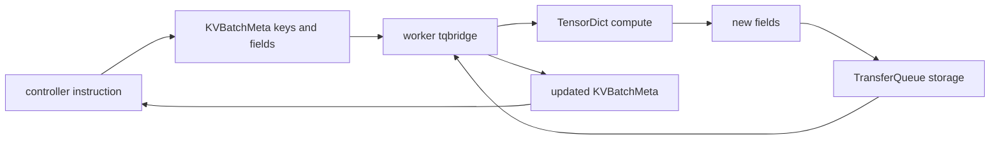

# verl V1 TransferQueue：元数据控制与延迟物化数据面

> **源码基线**：verl `main` @ `254a23edc62f25ebfae626e3932ae285d6f86009`（2026-08-28）
> **最后更新**：2026-08-31 · **定位**：TQ key/tag/storage 与延迟物化唯一机制 owner
> **核心结论**：当前 V1 runner 必定启用 TransferQueue。controller 不再搬运完整 batch，而是用 prompt key、trajectory key 与 `KVBatchMeta` 编排；worker 到执行边界才按需取 TensorDict，并把新增字段写回。TQ 解耦的是控制流与数据流，不是取消 TensorDict/DataProto，也不自动保证异步 freshness 或 checkpoint 一致性。AgentLoop 行为、ReplayBuffer admission 和组合恢复分别属于 18、17、23。

---

## 1. 先纠正三个旧结论

旧页基于 2026-08-11 的官方文档，曾把以下问题列为待核实。当前源码给出了明确答案：

| 旧问题 | 当前源码结论 | locator |
|---|---|---|
| `use_v1` 是否等价于启用 TQ | 进入 V1 后必定强制启用；反向不成立 | `verl/trainer/main_ppo.py:137-155,183-192` |
| TQ 是否仍是可选非默认路径 | YAML 自身默认 false，但标准入口默认 V1，V1 内部强制 true | `verl/trainer/config/ppo_trainer.yaml:227-237`；`verl/trainer/config/transfer_queue/transfer_queue.yaml:1-2` |
| fully async 是否仍是下一版本计划 | 稳定 V1 已有 `colocate_async` 与 `separate_async` | `verl/trainer/ppo/v1/trainer_colocate_async.py:25-59`；`verl/trainer/ppo/v1/trainer_separate_async.py:43-398` |

因此，release note 中的历史状态不能继续代表当前 `main`。本页只描述最终基线源码；三种 V1 trainer 的状态机见 [[17_verl_v1_async_trainer_analysis]]。

---

## 2. 为什么要把数据移出 controller

V0 的 single-controller 路径让 driver 负责 DataProto 的 dispatch/collect。这样便于建立严格顺序，却让大 TensorDict 的传递、收集与拼接经过中心控制器。V1 保留 controller 对“做什么、处理哪些样本”的决定，把“样本字段放在哪里、何时取回”交给 TransferQueue。



这个结构有三个 ownership：

- controller 拥有 key 选择、分组、排序和执行元信息；
- TransferQueue 拥有 key 对应字段与 tag 的存储/检索；
- worker 拥有函数执行期间的实际 TensorDict 与输出字段。

`KVBatchMeta` 和 `BatchMeta` 的互转在 `verl/utils/transferqueue_utils.py:302-344`；同步与异步 worker 的桥接逻辑在 `verl/utils/transferqueue_utils.py:347-477`。

---

## 3. 开关时序：为什么 YAML 的 false 与 V1 必用不矛盾

TransferQueue 配置文件仍以 `enable: False` 开头（`verl/trainer/config/transfer_queue/transfer_queue.yaml:1-2`）。但 V1 runner 选择 trainer 后立即执行：

```text
config.transfer_queue.enable = True
tq.init(config.transfer_queue)
trainer.fit(...)
tq.close()
```

完整生命周期在 `verl/trainer/main_ppo.py:137-163`。所以用户不需要另开 TQ 才能运行 V1；`trainer.use_v1` 才是实际的 V0/V1 路由开关（`verl/trainer/main_ppo.py:183-192`）。

仍有一个源码明确但影响未完全证明的时序差：Ray 初始化前，只有原始 `transfer_queue.enable=true` 才会把 `TRANSFER_QUEUE_ENABLE=1` 加到 runtime env；V1 runner 的强制赋值发生在远端 TaskRunner 中（`verl/trainer/main_ppo.py:56-74,141-149`）。外部 TQ package 如何消费这个环境变量超出本仓代码，不能仅凭该时序断言跨进程故障。

---

## 4. 两层 key schema：prompt 状态与 trajectory 数据

### 4.1 prompt key 是 group 控制记录

AgentLoop 接到 batch 后不会等待全部生成，而是为每个样本创建 background task（`verl/trainer/ppo/v1/agent_loop_tq.py:59-105`）。prompt 的 `uid` 作为 group key：启动时写 `status=running`，所有 rollout session settle 后才写 `finished` 或 `failure`（`verl/trainer/ppo/v1/agent_loop_tq.py:107-148`）。

这个“先等 sibling settle，再发布 terminal 状态”的顺序避免 ReplayBuffer 清理 failure group 后，迟到 sibling 又向同 group 写入轨迹（`verl/trainer/ppo/v1/agent_loop_tq.py:131-143`）。prompt key 因而是控制记录，不是训练张量本身。

### 4.2 trajectory key 是可独立消费的数据记录

每次 agent loop 输出使用：

```text
{uid}_{session_id}_{index}
```

源码在 `verl/trainer/ppo/v1/agent_loop_tq.py:177-193`。每个 trajectory field 包含 prompts、responses、mask、position、log-prob/extra fields 等；tag 单独记录 prompt/response/sequence 长度、dataloader global step，以及生成开始/结束所见的权重版本（`verl/trainer/ppo/v1/agent_loop_tq.py:194-225`）。

| tag | 用途 |
|---|---|
| `status` | trajectory 写入是否成功 |
| `seq_len` | DP workload balance 与 padding |
| `global_steps` | prompt 来自哪个 trainer step |
| `min_global_steps` | trajectory 开始生成时的 policy version |
| `max_global_steps` | trajectory 完成时的 policy version |

prompt key 管 group 生命周期，trajectory key 管可训练输出；把两者混为一个“sample key”会漏掉多 session、多轮输出与失败清理的原子性。

---

## 5. `KVBatchMeta`：引用不是数据

V1 trainer 的 `step()` 返回和传递的是 `KVBatchMeta`（`verl/trainer/ppo/v1/trainer_base.py:511-590`）。它携带 keys、partition、tags 和 extra info；tags 可在 controller 上做长度平衡、staleness 判断和 padding 标记，而无需先拉取所有 token 张量。

`KVBatchMeta → BatchMeta` 的流程是：

1. 确保本进程 TQ client 初始化。
2. 用 keys 与 partition 检索 storage metadata。
3. 若 meta 指定 fields，只选择这些字段。
4. 保留 controller 附加的 `extra_info`。

实现位于 `verl/utils/transferqueue_utils.py:302-316`。反向转换从 storage 的 global indexes 找回 keys，并复制 field names/extra info（`verl/utils/transferqueue_utils.py:323-340`）。

因此，meta RPC 成功只证明引用可解析，不等价于所有下游字段已经就绪。字段完整性仍由生产者状态、worker 调用顺序和 ReplayBuffer 选择共同保证。

---

## 6. `tqbridge`：在 worker 边界延迟取数与回写

`tqbridge` 同时支持普通函数和 coroutine（`verl/utils/transferqueue_utils.py:347-354`）。两条路径的共同状态机是：

1. 从 args/kwargs 找到 `BatchMeta` 或 `KVBatchMeta`。
2. 若是 KV meta，先检索 storage meta。
3. 在函数执行前物化为 TensorDict。
4. 调原函数。
5. 若输出是具有 batch size 的 TensorDict，检查输出 batch size 与输入 meta size 相等。
6. 根据 dispatch mode 判断是否 collect；需要时把输出字段写回 storage。
7. 若输入是 KV meta，再转回 KV meta 并保留 tags。

同步实现位于 `verl/utils/transferqueue_utils.py:374-419`，异步实现位于 `verl/utils/transferqueue_utils.py:421-471`。当没有 meta 参数时，wrapper 直接调用原函数；这使同一 worker 方法仍能接受普通 TensorDict 调用（`verl/utils/transferqueue_utils.py:375-379,422-426`）。

该桥接层保留 V0 worker 的“拿 TensorDict 计算”接口，同时改变数据到达 worker 的方式。它并未让 DataProto/TensorDict 消失，而是把 materialization 推迟到执行点。

---

## 7. trainer 如何选择性读写字段

V1 基类不是每一步都拉取全量 trajectory：

| 阶段 | 读取 | 写回 | locator |
|---|---|---|---|
| colocated reward | prompts、responses、raw prompt | `rm_scores` 等 | `verl/trainer/ppo/v1/trainer_base.py:1436-1513` |
| old log-prob | rollout/log-prob、mask | old log-prob、entropy | `verl/trainer/ppo/v1/trainer_base.py:1541-1600` |
| reference | log-prob、mask | ref log-prob | `verl/trainer/ppo/v1/trainer_base.py:1602-1626` |
| critic infer | values、mask | response-aligned values | `verl/trainer/ppo/v1/trainer_base.py:1628-1648` |
| advantage | uid、reward、policy state、value | advantage、return、可选 IS | `verl/trainer/ppo/v1/trainer_base.py:1650-1707` |

这种字段级访问减少了 controller 搬运与无关数据 materialization，但也要求新增算法显式声明它需要的 TQ fields。少读字段会在计算时缺键，多写字段会扩大存储和传输成本。

---

## 8. 当前仓内可配置后端，而不是产品能力全集

最终基线的 verl 配置只直接暴露两个 storage backend（`verl/trainer/config/transfer_queue/transfer_queue.yaml:14-60`）：

| backend | 仓内配置语义 |
|---|---|
| `SimpleStorage` | ZMQ 内存存储；配置容量与分布式 storage unit 数 |
| `MooncakeStore` | experimental；可用 TCP/RDMA，配置 metadata/master、segment 与 buffer |

外部 TransferQueue 产品或历史文档可能列出 Yuanrong、RayRDT 等更多实现，但它们不在当前 verl 内置 YAML 的 stable-path 选择面。不能把外部产品全景直接写成“当前 verl 配置支持矩阵”。

metrics 可选择 logger-only 或暴露 Prometheus `/metrics` endpoint，并允许端口自动分配（`verl/trainer/config/transfer_queue/transfer_queue.yaml:4-12`）。这提供可观测入口，不等价于数据 durable 或操作原子性保证。

---

## 9. checkpoint 与一致性边界

稳定 V1 async 会额外保存 TQ snapshot，但只有外部 package 版本至少 `0.1.9` 且同时提供 save/load API 时才启用（`verl/trainer/ppo/v1/trainer_base.py:106-116,942-950`）。恢复时：

- finished trajectory 留在 TQ 等待消费；
- pending/running prompt 的旧局部 trajectory 被删除，prompt 以新 step 重新派发（`verl/trainer/ppo/v1/trainer_base.py:843-887`）。

这不是对 in-flight trajectory 做连续恢复。能力检查不满足时源码会跳过 TQ snapshot，因此 dataloader 已前进、但未形成 finished group 的 prompt 没有本仓内的恢复保证。TQ 本页只拥有 snapshot API 表面和被保存的数据结构；Trainer 的组合保存、恢复顺序与 crash window 见 [[23_verl_training_checkpoint_recovery_analysis]]。

---

## 10. 失败边界

- V1 文件直接 import `transfer_queue`；缺失依赖会在入口或模块加载阶段失败（`verl/trainer/main_ppo.py:137`；`verl/trainer/ppo/v1/agent_loop_tq.py:25`）。
- `tqbridge` 只验证返回 TensorDict 的 batch size 与 meta size，不证明每个 key 的语义字段正确（`verl/utils/transferqueue_utils.py:401-418,453-470`）。
- prompt 的 terminal 状态依赖所有 session settle；永久挂起的 session 会让 group 一直处于 in-flight。
- tag 中的 min/max policy version 是 freshness 证据，但“是否丢弃或等待”属于 ReplayBuffer policy，不属于 TQ storage 本身。
- MooncakeStore 标为 experimental；本页没有多节点 RDMA、故障恢复或 snapshot 原子性的 E2E 证据。
- 当前源码中 TQ metadata 与 worker 输出写回跨多个调用，不应假设整个 PPO step 是单事务。

---

## Related Pages

- [[10_verl_end_to_end_iteration_analysis]] —— 当前默认 V1 sync 如何消费 TQ 数据面。
- [[11_verl_single_controller_analysis]] —— V1 引用流与 V0 driver dispatch 的控制面对照。
- [[12_verl_dataproto_analysis]] —— 执行点仍会物化的 TensorDict/DataProto 结构。
- [[17_verl_v1_async_trainer_analysis]] —— ReplayBuffer、staleness 与 refill 如何消费 TQ 状态。
- [[18_verl_agent_loop_reward_runtime_analysis]] —— prompt/trajectory fields 与 tag 的生产者。
- [[23_verl_training_checkpoint_recovery_analysis]] —— TQ snapshot 如何组合进训练恢复。
